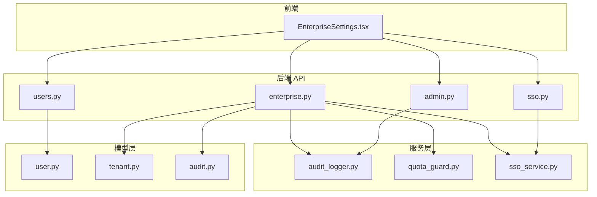
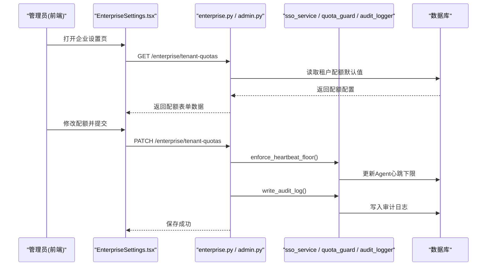
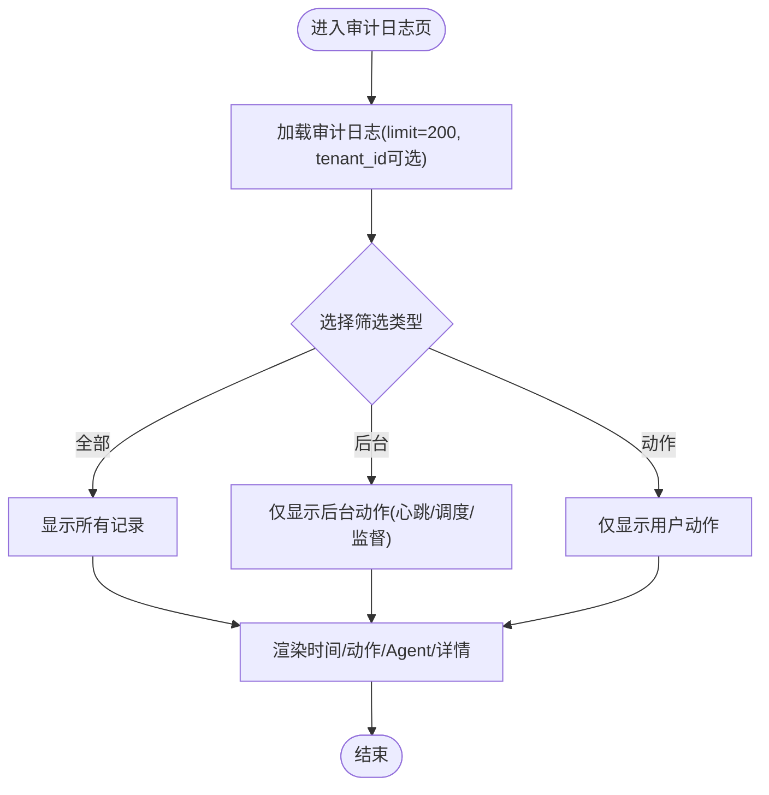
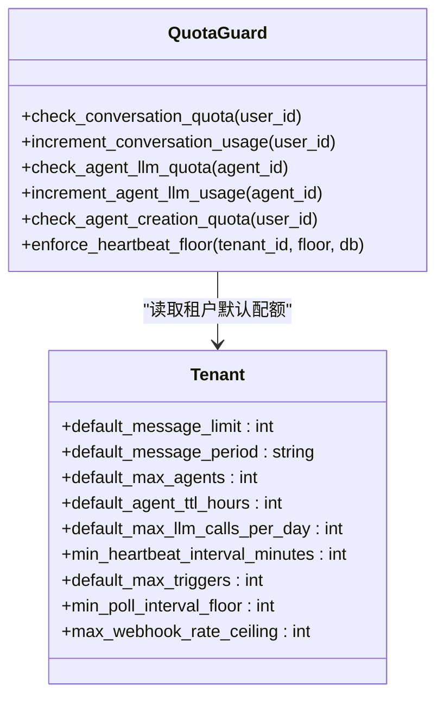
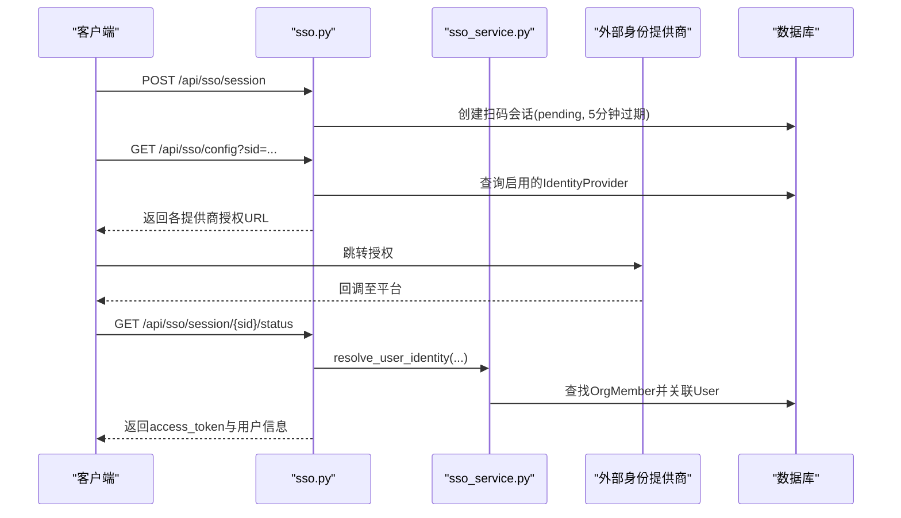
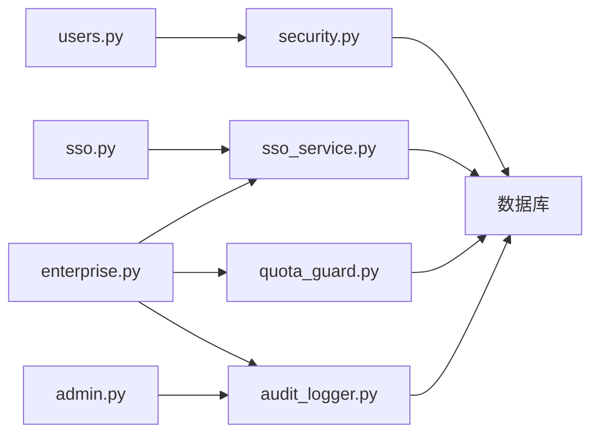

# 企业级功能

<cite>
**本文引用的文件**   
- [backend/app/api/admin.py](file://backend/app/api/admin.py)
- [backend/app/api/enterprise.py](file://backend/app/api/enterprise.py)
- [backend/app/api/sso.py](file://backend/app/api/sso.py)
- [backend/app/services/audit_logger.py](file://backend/app/services/audit_logger.py)
- [backend/app/services/quota_guard.py](file://backend/app/services/quota_guard.py)
- [backend/app/services/sso_service.py](file://backend/app/services/sso_service.py)
- [backend/app/core/security.py](file://backend/app/core/security.py)
- [backend/app/models/audit.py](file://backend/app/models/audit.py)
- [backend/app/models/user.py](file://backend/app/models/user.py)
- [backend/app/models/tenant.py](file://backend/app/models/tenant.py)
- [backend/app/api/users.py](file://backend/app/api/users.py)
- [frontend/src/pages/EnterpriseSettings.tsx](file://frontend/src/pages/EnterpriseSettings.tsx)
</cite>

## 目录
1. [简介](#简介)
2. [项目结构](#项目结构)
3. [核心组件](#核心组件)
4. [架构总览](#架构总览)
5. [详细组件分析](#详细组件分析)
6. [依赖关系分析](#依赖关系分析)
7. [性能与容量规划](#性能与容量规划)
8. [故障排查指南](#故障排查指南)
9. [结论](#结论)
10. [附录：部署与安全最佳实践](#附录部署与安全最佳实践)

## 简介
本指南面向企业管理员与运维人员，系统阐述审计日志查看、使用配额管理、安全设置等关键企业级能力的使用方法与管理要点；同时覆盖管理员界面（用户管理、组织配置、系统监控）的操作说明，以及SSO集成、权限控制、数据加密等安全特性的配置方法。文末提供企业部署与安全配置的最佳实践建议。

## 项目结构
后端采用FastAPI模块化路由设计，按功能域划分API（admin、enterprise、sso、users等），服务层封装业务逻辑（SSO、审计、配额守卫等），模型层定义多租户隔离边界与核心实体（User、Tenant、AuditLog等）。前端通过React页面集中呈现企业设置（EnterpriseSettings），并调用后端企业级接口完成配置与监控。

图表来源
- [backend/app/api/admin.py:1-120](file://backend/app/api/admin.py#L1-L120)
- [backend/app/api/enterprise.py:1-120](file://backend/app/api/enterprise.py#L1-L120)
- [backend/app/api/sso.py:1-60](file://backend/app/api/sso.py#L1-L60)
- [backend/app/services/audit_logger.py:1-80](file://backend/app/services/audit_logger.py#L1-L80)
- [backend/app/services/quota_guard.py:1-80](file://backend/app/services/quota_guard.py#L1-L80)
- [backend/app/services/sso_service.py:1-60](file://backend/app/services/sso_service.py#L1-L60)
- [backend/app/models/user.py:1-60](file://backend/app/models/user.py#L1-L60)
- [backend/app/models/tenant.py:1-60](file://backend/app/models/tenant.py#L1-L60)
- [backend/app/models/audit.py:1-60](file://backend/app/models/audit.py#L1-L60)
- [frontend/src/pages/EnterpriseSettings.tsx:1-120](file://frontend/src/pages/EnterpriseSettings.tsx#L1-L120)

章节来源
- [backend/app/api/admin.py:1-120](file://backend/app/api/admin.py#L1-L120)
- [backend/app/api/enterprise.py:1-120](file://backend/app/api/enterprise.py#L1-L120)
- [backend/app/api/sso.py:1-60](file://backend/app/api/sso.py#L1-L60)
- [backend/app/services/audit_logger.py:1-80](file://backend/app/services/audit_logger.py#L1-L80)
- [backend/app/services/quota_guard.py:1-80](file://backend/app/services/quota_guard.py#L1-L80)
- [backend/app/services/sso_service.py:1-60](file://backend/app/services/sso_service.py#L1-L60)
- [backend/app/models/user.py:1-60](file://backend/app/models/user.py#L1-L60)
- [backend/app/models/tenant.py:1-60](file://backend/app/models/tenant.py#L1-L60)
- [backend/app/models/audit.py:1-60](file://backend/app/models/audit.py#L1-L60)
- [frontend/src/pages/EnterpriseSettings.tsx:1-120](file://frontend/src/pages/EnterpriseSettings.tsx#L1-L120)

## 核心组件
- 审计日志：统一记录平台与企业内关键操作，支持后台任务写入与查询过滤。
- 使用配额：对用户会话消息、Agent LLM调用、Agent创建数量、心跳频率等进行限制与周期重置。
- 安全与认证：JWT鉴权、角色权限校验、敏感数据AES加密、SSO登录流程与提供商管理。
- 企业管理：公司（租户）管理、LLM模型池、审批流、企业知识库信息同步。
- 管理员界面：企业设置页聚合用户管理、组织配置、工具与技能、OKR、配额、邀请码、审计日志等。

章节来源
- [backend/app/services/audit_logger.py:1-120](file://backend/app/services/audit_logger.py#L1-L120)
- [backend/app/services/quota_guard.py:1-120](file://backend/app/services/quota_guard.py#L1-L120)
- [backend/app/core/security.py:1-120](file://backend/app/core/security.py#L1-L120)
- [backend/app/api/enterprise.py:1-120](file://backend/app/api/enterprise.py#L1-L120)
- [frontend/src/pages/EnterpriseSettings.tsx:1-120](file://frontend/src/pages/EnterpriseSettings.tsx#L1-L120)

## 架构总览
企业级能力由“前端页面 + FastAPI路由 + 服务层 + 模型层”构成。管理员通过前端企业设置页发起请求，后端路由进行鉴权与参数校验，服务层执行具体业务（如SSO匹配、配额检查、审计写入），最终持久化到数据库。

图表来源
- [backend/app/api/enterprise.py:738-800](file://backend/app/api/enterprise.py#L738-L800)
- [backend/app/services/quota_guard.py:210-254](file://backend/app/services/quota_guard.py#L210-L254)
- [backend/app/services/audit_logger.py:178-215](file://backend/app/services/audit_logger.py#L178-L215)
- [frontend/src/pages/EnterpriseSettings.tsx:140-156](file://frontend/src/pages/EnterpriseSettings.tsx#L140-L156)

## 详细组件分析

### 审计日志查看
- 功能概述：统一记录用户操作、后台任务事件（心跳、调度、监督等），支持按租户与Agent维度筛选，便于合规审计与问题定位。
- 数据来源：
  - 审计模型：包含id、user_id、agent_id、action、details、created_at等字段。
  - 审计写入：提供通用写入口，避免ORM关联导致的后台任务异常。
- 查询接口：
  - 企业审计日志列表：支持limit、tenant_id、agent_id过滤。
  - 前端展示：支持“全部/后台/动作”三类筛选，显示时间、动作、Agent标识与详情键值对。
- 典型场景：
  - 后台心跳失败、调度错误、服务器启动等事件自动记录。
  - 管理员删除LLM模型、变更企业信息等操作均生成审计条目。

图表来源
- [backend/app/api/enterprise.py:668-689](file://backend/app/api/enterprise.py#L668-L689)
- [backend/app/services/audit_logger.py:178-215](file://backend/app/services/audit_logger.py#L178-L215)
- [frontend/src/pages/EnterpriseSettings.tsx:428-439](file://frontend/src/pages/EnterpriseSettings.tsx#L428-L439)

章节来源
- [backend/app/models/audit.py:13-44](file://backend/app/models/audit.py#L13-L44)
- [backend/app/services/audit_logger.py:1-120](file://backend/app/services/audit_logger.py#L1-L120)
- [backend/app/api/enterprise.py:668-689](file://backend/app/api/enterprise.py#L668-L689)
- [frontend/src/pages/EnterpriseSettings.tsx:428-439](file://frontend/src/pages/EnterpriseSettings.tsx#L428-L439)

### 使用配额管理
- 功能概述：对企业内用户与Agent的用量进行限额与周期重置，防止资源滥用与成本失控。
- 主要配额项：
  - 用户会话消息配额：按周期（永久/日/周/月）限制，超限抛出配额异常。
  - Agent每日LLM调用配额：按日重置，超限阻止继续调用。
  - Agent创建数量上限：非管理员用户受限于配额。
  - 心跳最小间隔：租户级下限，强制调整低于阈值的Agent。
- 管理方式：
  - 前端配额页可配置默认消息限额、周期、最大Agent数、TTL、每日LLM调用上限、心跳下限、触发器上限、轮询下限、Webhook速率上限等。
  - 后端在保存时应用心跳下限策略，批量修正现有Agent。
- 关键实现：
  - 配额检查与递增：分别对用户会话、Agent LLM调用、Agent创建进行拦截与计数。
  - 心跳下限强制执行：扫描租户下所有Agent，将低于阈值的interval提升到下限。

图表来源
- [backend/app/services/quota_guard.py:30-120](file://backend/app/services/quota_guard.py#L30-L120)
- [backend/app/models/tenant.py:30-53](file://backend/app/models/tenant.py#L30-L53)

章节来源
- [backend/app/services/quota_guard.py:1-120](file://backend/app/services/quota_guard.py#L1-L120)
- [backend/app/models/tenant.py:30-53](file://backend/app/models/tenant.py#L30-L53)
- [frontend/src/pages/EnterpriseSettings.tsx:654-771](file://frontend/src/pages/EnterpriseSettings.tsx#L654-L771)

### 安全设置与SSO集成
- 认证与授权：
  - JWT访问令牌：包含用户ID与角色，过期时间由配置决定。
  - 密码哈希：bcrypt异步处理，避免阻塞事件循环。
  - 数据加密：AES-256-CBC对称加密存储敏感字段（如API Key）。
  - 角色权限：platform_admin、org_admin、agent_admin、member四级，支持require_role装饰器。
- SSO流程：
  - 创建扫码会话、获取提供商授权URL、轮询状态、成功后返回access_token与用户信息。
  - 支持飞书、钉钉、企业微信、Google Workspace等提供商。
  - 自动租户匹配：基于邮箱域名或自定义SSO域名映射。
  - IP限制：当以IP地址作为基础URL时，全平台仅允许一个租户启用SSO。
- 身份绑定与去绑：
  - 通过OrgMember关联外部身份，支持unionid/openid/external_id等多字段查找。
  - 首次SSO登录可被动填充用户资料（姓名、邮箱、头像、手机号）。

图表来源
- [backend/app/api/sso.py:16-72](file://backend/app/api/sso.py#L16-L72)
- [backend/app/services/sso_service.py:183-226](file://backend/app/services/sso_service.py#L183-L226)
- [backend/app/core/security.py:128-151](file://backend/app/core/security.py#L128-L151)

章节来源
- [backend/app/core/security.py:1-120](file://backend/app/core/security.py#L1-L120)
- [backend/app/api/sso.py:1-160](file://backend/app/api/sso.py#L1-L160)
- [backend/app/services/sso_service.py:1-120](file://backend/app/services/sso_service.py#L1-L120)

### 管理员界面功能
- 企业设置页（EnterpriseSettings.tsx）：
  - Tab导航：信息、LLM、工具、技能、OKR、邀请码、配额、用户、组织、审批、审计。
  - 配额页：表单化配置租户默认配额，支持保存与即时反馈。
  - 审计页：分页加载、筛选后台/动作、展示详情键值对。
  - 用户管理：切换至UserManagement组件，支持角色与配额调整。
  - 公司信息：Logo、名称、时区、公司介绍、主题色、A2A异步开关、危险操作（删除公司）。
- 企业统计与排行榜：
  - 平台指标时序：新增公司/用户、Token消耗、会话数、DAU/WAU/MAU。
  - 排行榜：Top 20公司/Agent按Token消耗排序，含缓存命中率。
  - 增强指标：平均Token/会话、7日留存率、渠道分布、工具类别Top10、流失预警。

章节来源
- [frontend/src/pages/EnterpriseSettings.tsx:100-120](file://frontend/src/pages/EnterpriseSettings.tsx#L100-L120)
- [frontend/src/pages/EnterpriseSettings.tsx:410-439](file://frontend/src/pages/EnterpriseSettings.tsx#L410-L439)
- [backend/app/api/admin.py:212-382](file://backend/app/api/admin.py#L212-L382)
- [backend/app/api/admin.py:384-433](file://backend/app/api/admin.py#L384-L433)
- [backend/app/api/admin.py:436-583](file://backend/app/api/admin.py#L436-L583)

### 企业安全特性配置
- 权限控制：
  - require_role装饰器用于保护高权限接口（平台管理员、组织管理员）。
  - 用户角色层级：member < agent_admin < org_admin < platform_admin。
- 数据加密：
  - AES-256-CBC加密API Key等敏感信息，解密需相同密钥。
  - JWT令牌签名与验签，过期自动失效。
- SSO安全：
  - 提供商激活需满足IP限制（单IP仅一个租户启用）。
  - 支持自定义域名重定向与回调URL标准化。

章节来源
- [backend/app/core/security.py:199-227](file://backend/app/core/security.py#L199-L227)
- [backend/app/core/security.py:54-124](file://backend/app/core/security.py#L54-L124)
- [backend/app/services/sso_service.py:514-563](file://backend/app/services/sso_service.py#L514-L563)

## 依赖关系分析
- 模块耦合：
  - enterprise.py依赖sso_service、quota_guard、audit_logger，形成“配置-执行-审计”闭环。
  - admin.py聚焦平台级统计与公司管理，独立于租户内部逻辑。
  - sso.py负责SSO会话与回调，依赖sso_service进行身份解析与租户匹配。
  - users.py提供用户配额与角色管理，依赖security进行鉴权。
- 外部依赖：
  - 数据库：PostgreSQL（UUID、JSON、JSONB、枚举类型）。
  - 第三方身份提供商：飞书、钉钉、企业微信、Google Workspace。
  - 加密库：PyCryptodome（AES）、PyJWT（JWT）、bcrypt（密码哈希）。

图表来源
- [backend/app/api/enterprise.py:1-120](file://backend/app/api/enterprise.py#L1-L120)
- [backend/app/api/admin.py:1-120](file://backend/app/api/admin.py#L1-L120)
- [backend/app/api/sso.py:1-60](file://backend/app/api/sso.py#L1-L60)
- [backend/app/api/users.py:1-60](file://backend/app/api/users.py#L1-L60)
- [backend/app/core/security.py:1-60](file://backend/app/core/security.py#L1-L60)

章节来源
- [backend/app/api/enterprise.py:1-120](file://backend/app/api/enterprise.py#L1-L120)
- [backend/app/api/admin.py:1-120](file://backend/app/api/admin.py#L1-L120)
- [backend/app/api/sso.py:1-60](file://backend/app/api/sso.py#L1-L60)
- [backend/app/api/users.py:1-60](file://backend/app/api/users.py#L1-L60)
- [backend/app/core/security.py:1-60](file://backend/app/core/security.py#L1-L60)

## 性能与容量规划
- 审计日志写入：使用原始SQL插入，避免ORM外键解析开销，适合后台高频写入。
- 配额检查：按用户/Agent粒度查询与更新，注意在高并发场景下的锁竞争；建议结合Redis做短期计数缓存（如需扩展）。
- 心跳下限强制执行：批量更新Agent interval，建议在低峰期执行以减少锁冲突。
- 平台指标查询：使用窗口函数与分组聚合，避免N+1查询；必要时为常用字段建立索引。

[本节为通用指导，不直接分析具体文件]

## 故障排查指南
- 审计日志缺失：
  - 检查后台任务是否调用write_audit_log；确认数据库连接与事务提交。
  - 关注异常捕获与日志输出，确保审计写入失败不影响主流程。
- 配额超限：
  - 核对用户/Agent配额字段是否正确初始化；检查周期重置逻辑是否生效。
  - 若心跳下限未生效，确认enforce_heartbeat_floor是否被调用且参数正确。
- SSO登录失败：
  - 验证提供商配置（app_id/corp_id/agent_id等）与回调URL。
  - 检查IP限制是否阻止其他租户启用SSO；确认域名映射是否匹配。
- 权限不足：
  - 确认当前用户角色是否满足require_role要求；检查identity.is_platform_admin标志。

章节来源
- [backend/app/services/audit_logger.py:178-215](file://backend/app/services/audit_logger.py#L178-L215)
- [backend/app/services/quota_guard.py:210-254](file://backend/app/services/quota_guard.py#L210-L254)
- [backend/app/api/sso.py:83-160](file://backend/app/api/sso.py#L83-L160)
- [backend/app/core/security.py:199-227](file://backend/app/core/security.py#L199-L227)

## 结论
本系统提供了完善的企业级能力：审计日志可追溯、配额管理精细化、安全认证与SSO集成成熟、管理员界面功能齐全。通过合理的部署与安全配置，可满足中大型企业的合规与运营需求。建议在生产环境严格遵循附录中的最佳实践，确保稳定性与安全性。

[本节为总结性内容，不直接分析具体文件]

## 附录：部署与安全最佳实践
- 部署建议：
  - 使用容器化部署（Docker Compose/Helm），分离前后端与数据库、缓存服务。
  - 为高负载服务配置水平扩展与健康检查，合理设置超时与重试策略。
  - 定期备份数据库与静态资源，制定灾难恢复预案。
- 安全配置：
  - 强密码策略与定期轮换；禁用不必要的账号与权限。
  - 启用HTTPS与HSTS，限制CORS与CSRF策略。
  - 敏感配置（JWT密钥、加密密钥）通过环境变量注入，禁止硬编码。
  - 定期审计日志与访问日志，结合SIEM系统进行威胁检测。
- 配额与限流：
  - 根据业务规模设定合理的默认配额，逐步收紧以控制成本。
  - 对API网关与后端服务实施速率限制，防止恶意刷量。
- SSO集成：
  - 优先使用域名匹配而非IP限制，提升灵活性。
  - 定期审查提供商配置与回调URL，及时清理废弃集成。

[本节为通用指导，不直接分析具体文件]