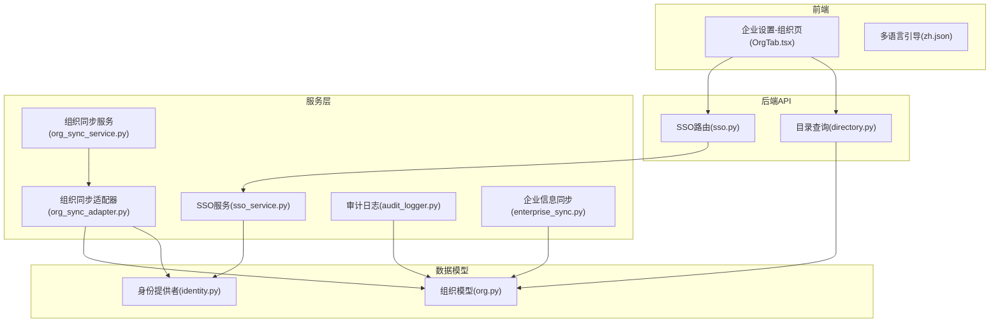
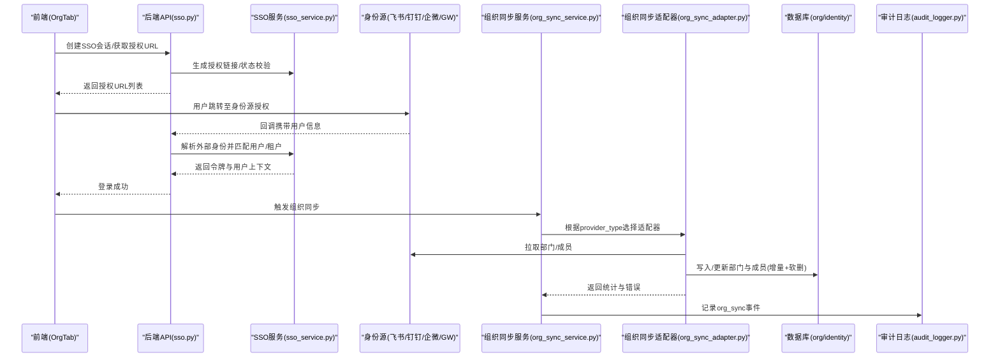
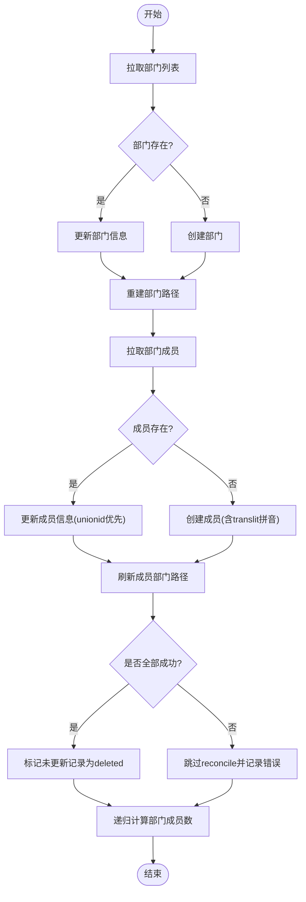
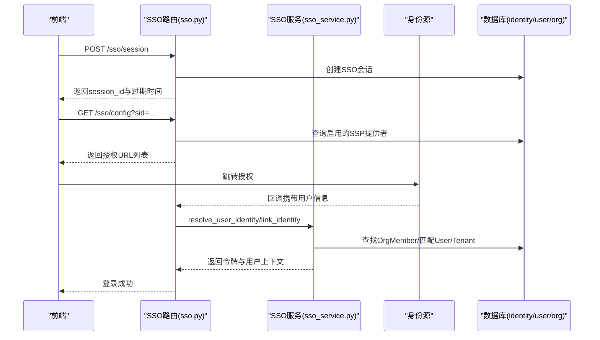
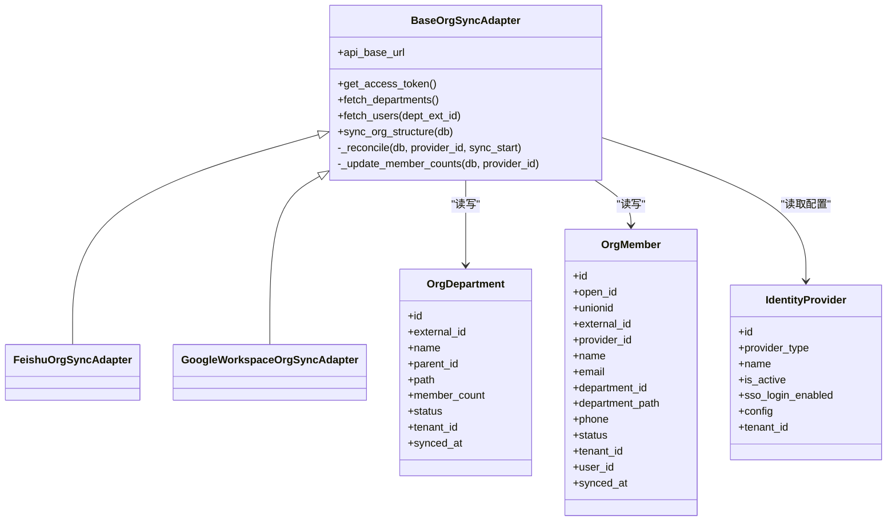

# 企业集成

<cite>
**本文引用的文件**   
- [backend/app/services/org_sync_service.py](file://backend/app/services/org_sync_service.py)
- [backend/app/services/org_sync_adapter.py](file://backend/app/services/org_sync_adapter.py)
- [backend/app/models/org.py](file://backend/app/models/org.py)
- [backend/app/models/identity.py](file://backend/app/models/identity.py)
- [backend/app/api/sso.py](file://backend/app/api/sso.py)
- [backend/app/services/sso_service.py](file://backend/app/services/sso_service.py)
- [backend/app/services/audit_logger.py](file://backend/app/services/audit_logger.py)
- [backend/app/api/directory.py](file://backend/app/api/directory.py)
- [backend/app/services/enterprise_sync.py](file://backend/app/services/enterprise_sync.py)
- [frontend/src/i18n/zh.json](file://frontend/src/i18n/zh.json)
- [frontend/src/pages/enterprise-settings/tabs/OrgTab.tsx](file://frontend/src/pages/enterprise-settings/tabs/OrgTab.tsx)
- [backend/tests/test_org_sync_adapter.py](file://backend/tests/test_org_sync_adapter.py)
</cite>

## 目录
1. [简介](#简介)
2. [项目结构](#项目结构)
3. [核心组件](#核心组件)
4. [架构总览](#架构总览)
5. [详细组件分析](#详细组件分析)
6. [依赖关系分析](#依赖关系分析)
7. [性能与扩展性](#性能与扩展性)
8. [故障排查指南](#故障排查指南)
9. [结论](#结论)
10. [附录：配置清单与最佳实践](#附录配置清单与最佳实践)

## 简介
本指南面向企业集成场景，覆盖以下目标：
- 与企业现有系统对接（HR/身份源）：飞书、钉钉、企业微信、Google Workspace、Microsoft Teams、OAuth2/SAML。
- 组织架构同步：部门与成员增量同步、路径重建、冲突解决策略。
- 单点登录（SSO）：多提供商统一入口、回调处理、用户匹配与租户自动关联。
- 数据同步策略：全量/增量、幂等更新、软删除与一致性保障。
- 安全与合规：审计日志、权限隔离、IP限制与域名白名单。
- 集成测试与故障排查：端到端验证、常见问题定位与修复建议。

## 项目结构
后端采用 FastAPI + SQLAlchemy 异步模型，组织同步通过“适配器模式”实现多身份源接入；SSO 提供统一会话与回调路由；审计日志以独立模块记录关键事件；前端提供企业设置页与多语言引导。

**图表来源** 
- [backend/app/api/sso.py:1-160](file://backend/app/api/sso.py#L1-L160)
- [backend/app/services/sso_service.py:1-576](file://backend/app/services/sso_service.py#L1-L576)
- [backend/app/services/org_sync_service.py:1-48](file://backend/app/services/org_sync_service.py#L1-L48)
- [backend/app/services/org_sync_adapter.py:1-800](file://backend/app/services/org_sync_adapter.py#L1-L800)
- [backend/app/models/org.py:1-98](file://backend/app/models/org.py#L1-L98)
- [backend/app/models/identity.py:1-67](file://backend/app/models/identity.py#L1-L67)
- [backend/app/services/audit_logger.py:1-215](file://backend/app/services/audit_logger.py#L1-L215)
- [backend/app/services/enterprise_sync.py:1-34](file://backend/app/services/enterprise_sync.py#L1-L34)
- [frontend/src/pages/enterprise-settings/tabs/OrgTab.tsx:924-955](file://frontend/src/pages/enterprise-settings/tabs/OrgTab.tsx#L924-L955)
- [frontend/src/i18n/zh.json:1453-1477](file://frontend/src/i18n/zh.json#L1453-L1477)

**章节来源**
- [backend/app/services/org_sync_service.py:1-48](file://backend/app/services/org_sync_service.py#L1-L48)
- [backend/app/services/org_sync_adapter.py:1-800](file://backend/app/services/org_sync_adapter.py#L1-L800)
- [backend/app/models/org.py:1-98](file://backend/app/models/org.py#L1-L98)
- [backend/app/models/identity.py:1-67](file://backend/app/models/identity.py#L1-L67)
- [backend/app/api/sso.py:1-160](file://backend/app/api/sso.py#L1-L160)
- [backend/app/services/sso_service.py:1-576](file://backend/app/services/sso_service.py#L1-L576)
- [backend/app/services/audit_logger.py:1-215](file://backend/app/services/audit_logger.py#L1-L215)
- [backend/app/services/enterprise_sync.py:1-34](file://backend/app/services/enterprise_sync.py#L1-L34)
- [frontend/src/pages/enterprise-settings/tabs/OrgTab.tsx:924-955](file://frontend/src/pages/enterprise-settings/tabs/OrgTab.tsx#L924-L955)
- [frontend/src/i18n/zh.json:1453-1477](file://frontend/src/i18n/zh.json#L1453-L1477)

## 核心组件
- 组织同步服务与适配器：基于 provider_type 动态选择适配器，完成部门与成员的拉取、去重、路径重建、计数聚合与软删除。
- SSO 服务与路由：统一创建扫码会话、生成授权链接、回调后解析外部身份并匹配平台用户与租户。
- 审计日志：标准化动作枚举，记录认证、身份绑定、组织同步等关键事件。
- 目录查询：为 Agent 提供只读的人员与数字员工目录，支持按组织路径与名称拼音检索。
- 企业信息同步：通过 Redis Pub/Sub 通知在线 Agent 容器更新本地企业信息。

**章节来源**
- [backend/app/services/org_sync_service.py:1-48](file://backend/app/services/org_sync_service.py#L1-L48)
- [backend/app/services/org_sync_adapter.py:1-800](file://backend/app/services/org_sync_adapter.py#L1-L800)
- [backend/app/api/sso.py:1-160](file://backend/app/api/sso.py#L1-L160)
- [backend/app/services/sso_service.py:1-576](file://backend/app/services/sso_service.py#L1-L576)
- [backend/app/services/audit_logger.py:1-215](file://backend/app/services/audit_logger.py#L1-L215)
- [backend/app/api/directory.py:1-378](file://backend/app/api/directory.py#L1-L378)
- [backend/app/services/enterprise_sync.py:1-34](file://backend/app/services/enterprise_sync.py#L1-L34)

## 架构总览
下图展示从前端到后端的核心调用链：企业设置页触发组织同步或 SSO 配置；SSO 流程由路由与服务协作完成；组织同步通过适配器对接各身份源；审计日志贯穿关键操作。

**图表来源** 
- [backend/app/api/sso.py:1-160](file://backend/app/api/sso.py#L1-L160)
- [backend/app/services/sso_service.py:1-576](file://backend/app/services/sso_service.py#L1-L576)
- [backend/app/services/org_sync_service.py:1-48](file://backend/app/services/org_sync_service.py#L1-L48)
- [backend/app/services/org_sync_adapter.py:1-800](file://backend/app/services/org_sync_adapter.py#L1-L800)
- [backend/app/services/audit_logger.py:1-215](file://backend/app/services/audit_logger.py#L1-L215)

## 详细组件分析

### 组织同步（HR系统集成与组织架构同步）
- 适配框架：BaseOrgSyncAdapter 定义统一接口（获取token、拉取部门/成员、upsert逻辑），具体实现包括飞书、钉钉、企业微信、Google Workspace 等。
- 数据模型：OrgDepartment 与 OrgMember 存储外部系统与内部映射，包含 unionid/open_id/external_id 等多标识字段，支持跨应用识别。
- 增量与冲突：
  - 使用 synced_at 时间戳进行 reconcile，未更新的记录标记为 deleted（软删除）。
  - 成员 upsert 优先 unionid，其次 external_id/open_id，避免重复与冲突。
  - 部门路径 rebuild，确保 department_path 准确反映层级。
  - 部门成员计数递归聚合，保证上级部门显示正确人数。
- 失败保护：部分失败时跳过 reconcile，记录错误并继续后续步骤。

**图表来源** 
- [backend/app/services/org_sync_adapter.py:232-329](file://backend/app/services/org_sync_adapter.py#L232-L329)
- [backend/app/services/org_sync_adapter.py:331-416](file://backend/app/services/org_sync_adapter.py#L331-L416)
- [backend/app/services/org_sync_adapter.py:539-680](file://backend/app/services/org_sync_adapter.py#L539-L680)

**章节来源**
- [backend/app/services/org_sync_service.py:1-48](file://backend/app/services/org_sync_service.py#L1-L48)
- [backend/app/services/org_sync_adapter.py:1-800](file://backend/app/services/org_sync_adapter.py#L1-L800)
- [backend/app/models/org.py:1-98](file://backend/app/models/org.py#L1-L98)

### 单点登录（SSO）配置与流程
- 会话管理：创建 SSOScanSession，支持扫码/移动端扫描，状态流转 pending→scanned→authorized→completed/expired。
- 授权链接：根据 provider_type 生成不同平台的授权 URL，并注入 state 与回调地址。
- 回调处理：解析外部身份（unionid/open_id/external_id），通过 SSOService 匹配平台用户与租户，必要时创建壳记录 OrgMember。
- 租户自动关联：基于邮箱域名或自定义域名匹配租户，支持 IP 基址下的唯一启用限制。

**图表来源** 
- [backend/app/api/sso.py:16-159](file://backend/app/api/sso.py#L16-L159)
- [backend/app/services/sso_service.py:183-445](file://backend/app/services/sso_service.py#L183-L445)
- [backend/app/models/identity.py:26-67](file://backend/app/models/identity.py#L26-L67)

**章节来源**
- [backend/app/api/sso.py:1-160](file://backend/app/api/sso.py#L1-L160)
- [backend/app/services/sso_service.py:1-576](file://backend/app/services/sso_service.py#L1-L576)
- [backend/app/models/identity.py:1-67](file://backend/app/models/identity.py#L1-L67)

### 审计与合规
- 审计动作：涵盖登录、SSO、身份绑定、组织同步、角色与租户管理等。
- 写入方式：使用 raw SQL 插入 audit_logs，避免 ORM 外键解析问题，且不影响主流程。
- 合规要点：敏感操作均记录 user_id、tenant_id、details，便于追溯与合规审计。

**章节来源**
- [backend/app/services/audit_logger.py:1-215](file://backend/app/services/audit_logger.py#L1-L215)

### 企业目录与访问控制
- 只读目录：提供人员与数字员工的查询接口，支持按名称、邮箱、职位、部门路径与拼音检索。
- 自定义目录：管理员可为 Agent 手动添加人类用户与数字员工，维护访问级别与关系。

**章节来源**
- [backend/app/api/directory.py:1-378](file://backend/app/api/directory.py#L1-L378)

### 企业信息同步
- 机制：更新 EnterpriseInfo 后通过 Redis Pub/Sub 通知在线 Agent 容器，Agent 拉取最新数据并落盘。
- 用途：将企业级配置（如 LLM 池、审批策略、审计策略）下发至运行中的 Agent。

**章节来源**
- [backend/app/services/enterprise_sync.py:1-34](file://backend/app/services/enterprise_sync.py#L1-L34)

## 依赖关系分析
- 组织同步适配器依赖 IdentityProvider 配置与 OrgDepartment/OrgMember 模型。
- SSO 路由依赖 IdentityProvider 与 SSOScanSession，回调后依赖 User/Identity/OrgMember 进行匹配。
- 审计日志独立于业务事务，使用 raw SQL 写入，降低耦合。
- 目录查询依赖 OrgMember/User/Agent 模型及权限表。

**图表来源** 
- [backend/app/services/org_sync_adapter.py:174-800](file://backend/app/services/org_sync_adapter.py#L174-L800)
- [backend/app/models/org.py:13-63](file://backend/app/models/org.py#L13-L63)
- [backend/app/models/identity.py:26-47](file://backend/app/models/identity.py#L26-L47)

**章节来源**
- [backend/app/services/org_sync_adapter.py:174-800](file://backend/app/services/org_sync_adapter.py#L174-L800)
- [backend/app/models/org.py:13-63](file://backend/app/models/org.py#L13-L63)
- [backend/app/models/identity.py:26-47](file://backend/app/models/identity.py#L26-L47)

## 性能与扩展性
- 并发与批处理：组织同步对部门与成员采用嵌套事务与批量更新，减少锁竞争。
- 路径重建与计数：在内存中构建部门树并一次性更新，避免多次 IO。
- 审计日志：raw SQL 直写，避免 ORM 开销。
- 可扩展性：新增身份源只需实现 BaseOrgSyncAdapter 接口并注册类型。

[本节为通用指导，不直接分析具体文件]

## 故障排查指南
- 组织同步失败
  - 现象：部分成员同步失败，reconcile 被跳过。
  - 排查：检查 unionid 必填与合法性；确认外部系统 token 有效；查看 errors 列表。
  - 参考：适配器 validate 与 _upsert_member 逻辑。
- SSO 登录失败
  - 现象：回调后无法匹配用户或租户。
  - 排查：确认 identity_data 中包含 unionid/open_id/external_id；检查邮箱/手机号匹配；查看 IP 限制与域名白名单。
  - 参考：SSOService 的 _extract_identity_ids 与 auto_associate_tenant。
- 目录查询无结果
  - 现象：搜索不到成员或数字员工。
  - 排查：确认成员已同步且 status=active；检查 tenant_id 范围；验证权限表是否存在对应关系。
  - 参考：directory API 的查询条件与分页参数。
- 审计日志缺失
  - 现象：关键操作未记录。
  - 排查：检查 audit_logs 表写入是否成功；确认调用 write_*_audit_log 的位置。
  - 参考：audit_logger 的 _write_log 与异常捕获。

**章节来源**
- [backend/app/services/org_sync_adapter.py:686-744](file://backend/app/services/org_sync_adapter.py#L686-L744)
- [backend/app/services/sso_service.py:227-301](file://backend/app/services/sso_service.py#L227-L301)
- [backend/app/api/directory.py:122-178](file://backend/app/api/directory.py#L122-L178)
- [backend/app/services/audit_logger.py:178-215](file://backend/app/services/audit_logger.py#L178-L215)

## 结论
本方案通过统一的适配器框架与 SSO 服务，实现了与企业 HR/身份系统的稳定对接，支持多提供商的组织同步与单点登录。结合审计日志与严格的租户隔离，满足企业级安全与合规要求。建议在生产环境启用定时增量同步、完善监控告警，并结合前端多语言引导提升配置体验。

[本节为总结，不直接分析具体文件]

## 附录：配置清单与最佳实践
- 身份源配置
  - 飞书：需 app_id、app_secret；权限需开通 contact:user.employee_id:readonly；发布版本并审批后方可生效。
  - 钉钉：需 AppKey/AppSecret；通讯录权限范围设置为全部员工；如需免登需开通 Contact.User.Read。
  - 企业微信：需 CorpID/Secret；API 可见范围包含目标部门/成员；可信域名配置 Redirect URL 域名。
  - Google Workspace：Client ID/Secret/Redirect URL；支持 OAuth 或 Service Account。
- 同步策略
  - 首次全量，后续增量；使用 unionid/external_id/open_id 去重；未更新记录软删除。
  - 部门路径重建与成员计数递归聚合，确保层级准确。
- SSO 配置
  - 启用 sso_login_enabled；配置回调域与授权页面；IP 基址下仅允许一个租户启用。
- 审计与合规
  - 所有关键操作记录审计日志；敏感字段脱敏；定期导出审计报表。
- 前端引导
  - 使用 zh.json 的多语言步骤指引，确保管理员按步骤完成配置与发布。

**章节来源**
- [frontend/src/i18n/zh.json:1453-1477](file://frontend/src/i18n/zh.json#L1453-L1477)
- [backend/app/services/org_sync_adapter.py:769-800](file://backend/app/services/org_sync_adapter.py#L769-L800)
- [backend/app/services/sso_service.py:514-576](file://backend/app/services/sso_service.py#L514-L576)
- [backend/app/services/audit_logger.py:16-58](file://backend/app/services/audit_logger.py#L16-L58)