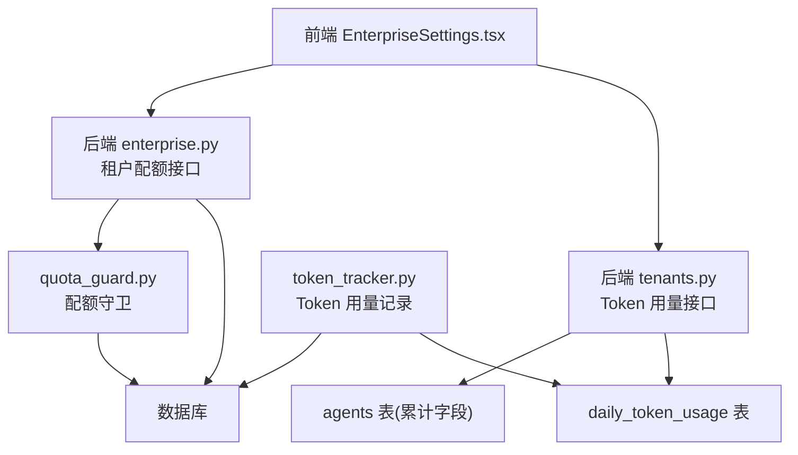
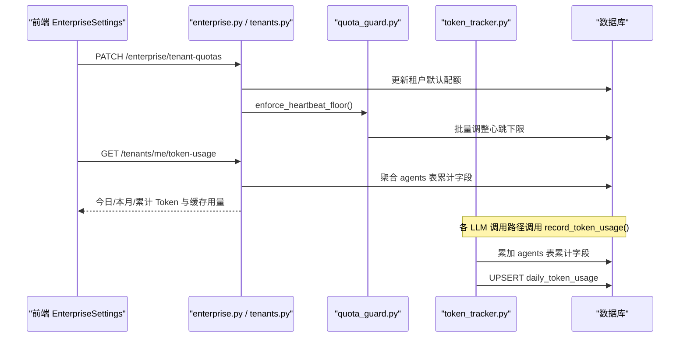
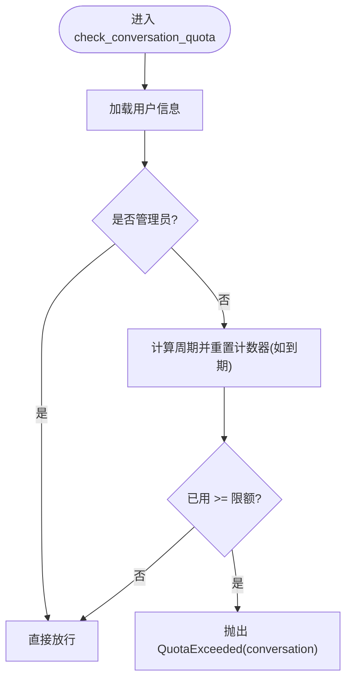
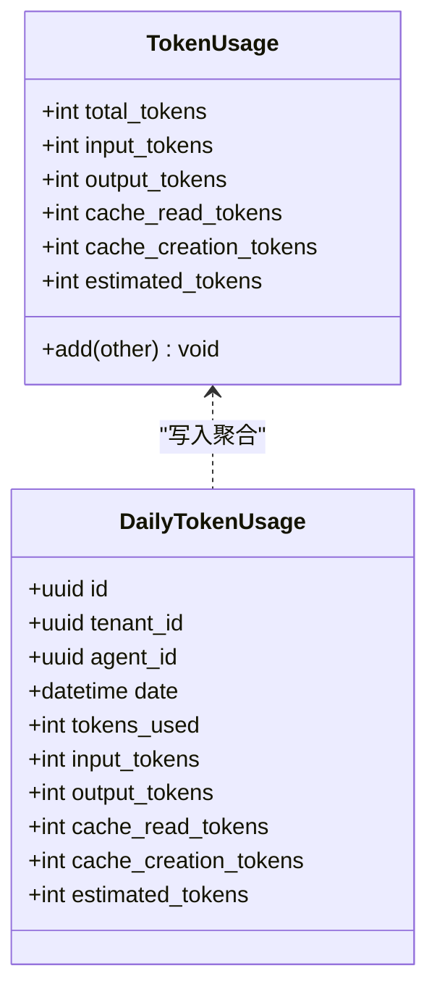
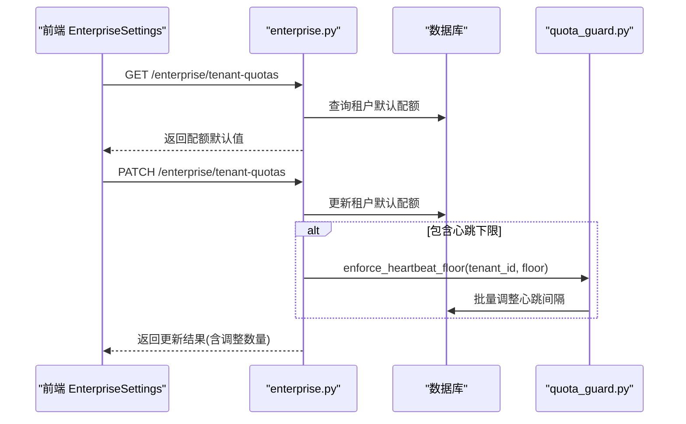
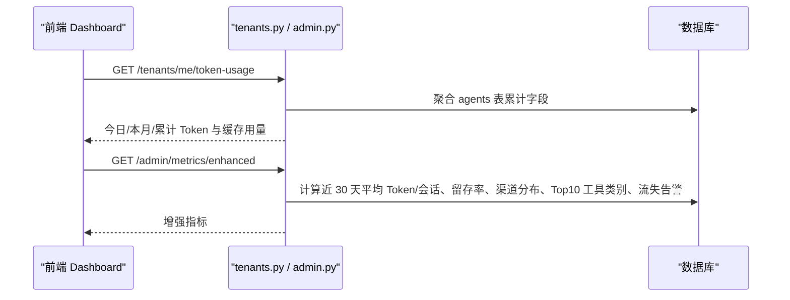
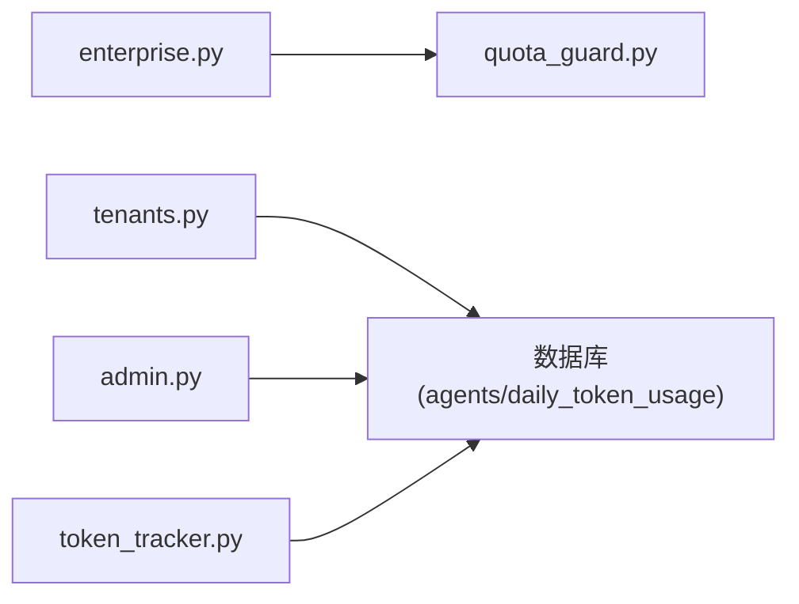

# 使用配额管理

<cite>
**本文引用的文件**   
- [backend/app/services/quota_guard.py](file://backend/app/services/quota_guard.py)
- [backend/app/services/token_tracker.py](file://backend/app/services/token_tracker.py)
- [backend/app/models/activity_log.py](file://backend/app/models/activity_log.py)
- [backend/app/api/enterprise.py](file://backend/app/api/enterprise.py)
- [backend/app/api/tenants.py](file://backend/app/api/tenants.py)
- [backend/app/api/admin.py](file://backend/app/api/admin.py)
- [frontend/src/pages/EnterpriseSettings.tsx](file://frontend/src/pages/EnterpriseSettings.tsx)
</cite>

## 目录
1. [简介](#简介)
2. [项目结构](#项目结构)
3. [核心组件](#核心组件)
4. [架构总览](#架构总览)
5. [详细组件分析](#详细组件分析)
6. [依赖关系分析](#依赖关系分析)
7. [性能考虑](#性能考虑)
8. [故障排查指南](#故障排查指南)
9. [结论](#结论)
10. [附录](#附录)

## 简介
本指南围绕“使用配额管理系统”展开，覆盖 Token 使用量监控、配额限制设置、超额处理策略、租户差异化配额、实时监控与报告、告警机制、自动暂停策略与资源回收流程，以及配额优化建议与成本控制最佳实践。系统通过服务层进行配额检查与执行、统一记录 Token 用量、提供租户级配额配置接口与前端界面，并在平台层面提供增强指标与告警能力。

## 项目结构
与配额管理相关的关键代码分布在以下位置：
- 服务层：配额守卫（对话、Agent LLM 调用、创建数量、心跳下限）与 Token 用量追踪
- 数据模型：按日聚合的 Token 用量表
- API 层：租户配额默认值读取/更新、当前租户 Token 用量汇总、平台增强指标
- 前端：企业设置页中的配额表单与保存交互

**图表来源** 
- [backend/app/api/enterprise.py:754-826](file://backend/app/api/enterprise.py#L754-L826)
- [backend/app/api/tenants.py:488-525](file://backend/app/api/tenants.py#L488-L525)
- [backend/app/services/quota_guard.py:1-266](file://backend/app/services/quota_guard.py#L1-L266)
- [backend/app/services/token_tracker.py:160-246](file://backend/app/services/token_tracker.py#L160-L246)
- [backend/app/models/activity_log.py:35-57](file://backend/app/models/activity_log.py#L35-L57)
- [frontend/src/pages/EnterpriseSettings.tsx:132-158](file://frontend/src/pages/EnterpriseSettings.tsx#L132-L158)

**章节来源**
- [backend/app/api/enterprise.py:754-826](file://backend/app/api/enterprise.py#L754-L826)
- [backend/app/api/tenants.py:488-525](file://backend/app/api/tenants.py#L488-L525)
- [backend/app/services/quota_guard.py:1-266](file://backend/app/services/quota_guard.py#L1-L266)
- [backend/app/services/token_tracker.py:160-246](file://backend/app/services/token_tracker.py#L160-L246)
- [backend/app/models/activity_log.py:35-57](file://backend/app/models/activity_log.py#L35-L57)
- [frontend/src/pages/EnterpriseSettings.tsx:132-158](file://frontend/src/pages/EnterpriseSettings.tsx#L132-L158)

## 核心组件
- 配额守卫（Quota Guard）
  - 对话配额：按用户周期重置与限额控制，超限抛出专用异常
  - Agent LLM 调用配额：按日重置与上限控制
  - Agent 创建配额：按用户非过期 Agent 计数限制
  - 心跳下限强制：对租户内所有 Agent 的最小心跳间隔进行批量修正
- Token 用量追踪（Token Tracker）
  - 统一从不同 LLM 提供商提取标准化用量（输入/输出/缓存读/缓存创建/估算）
  - 原子累加 Agent 的今日/本月/累计 Token 与缓存用量
  - 写入 daily_token_usage 表用于时间序列分析
- 租户配额 API
  - 获取/更新租户默认配额（消息限额、周期、最大 Agent 数、Agent TTL、每日 LLM 调用上限、心跳下限、触发器上限、轮询下限、Webhook 速率上限）
  - 更新时同步强制执行心跳下限
- 租户 Token 用量 API
  - 返回当前租户的今日/本月/累计 Token 与缓存用量及命中率
- 平台增强指标
  - 近 30 天平均 Token/会话、7 日留存率、渠道分布、工具类别 Top10、流失告警（高用量且长期不活跃）

**章节来源**
- [backend/app/services/quota_guard.py:1-266](file://backend/app/services/quota_guard.py#L1-L266)
- [backend/app/services/token_tracker.py:1-246](file://backend/app/services/token_tracker.py#L1-L246)
- [backend/app/models/activity_log.py:35-57](file://backend/app/models/activity_log.py#L35-L57)
- [backend/app/api/enterprise.py:754-826](file://backend/app/api/enterprise.py#L754-L826)
- [backend/app/api/tenants.py:488-525](file://backend/app/api/tenants.py#L488-L525)
- [backend/app/api/admin.py:412-611](file://backend/app/api/admin.py#L412-L611)

## 架构总览
下图展示从前端到后端、再到数据库的完整配额管理与用量追踪链路。

**图表来源** 
- [backend/app/api/enterprise.py:779-826](file://backend/app/api/enterprise.py#L779-L826)
- [backend/app/services/quota_guard.py:211-254](file://backend/app/services/quota_guard.py#L211-L254)
- [backend/app/api/tenants.py:488-525](file://backend/app/api/tenants.py#L488-L525)
- [backend/app/services/token_tracker.py:160-246](file://backend/app/services/token_tracker.py#L160-L246)
- [backend/app/models/activity_log.py:35-57](file://backend/app/models/activity_log.py#L35-L57)

## 详细组件分析

### 配额守卫（Quota Guard）
- 对话配额
  - 支持周期重置（日/周/月/永久），管理员豁免
  - 超限抛出 QuotaExceeded（类型 conversation）
- Agent LLM 调用配额
  - 按日重置，超限抛出 QuotaExceeded（类型 agent_llm）
- Agent 创建配额
  - 统计用户未过期 Agent 数量，超限抛出 QuotaExceeded（类型 max_agents）
- 心跳下限强制
  - 读取租户最小心跳间隔，批量将低于阈值的 Agent 心跳间隔上调至阈值

**图表来源** 
- [backend/app/services/quota_guard.py:30-60](file://backend/app/services/quota_guard.py#L30-L60)

**章节来源**
- [backend/app/services/quota_guard.py:30-60](file://backend/app/services/quota_guard.py#L30-L60)
- [backend/app/services/quota_guard.py:121-174](file://backend/app/services/quota_guard.py#L121-L174)
- [backend/app/services/quota_guard.py:178-207](file://backend/app/services/quota_guard.py#L178-L207)
- [backend/app/services/quota_guard.py:211-254](file://backend/app/services/quota_guard.py#L211-L254)

### Token 用量追踪（Token Tracker）
- 标准化提取
  - 兼容 OpenAI/Anthropic/Gemini 等格式，统一为 total/input/output/cache_read/cache_creation/estimated
- 原子记录
  - 独立数据库会话，避免干扰调用方事务
  - 累加 agents 表的今日/本月/累计 Token 与缓存用量
  - 写入 daily_token_usage 表（按 agent_id+date 唯一约束做 UPSERT）

**图表来源** 
- [backend/app/services/token_tracker.py:13-31](file://backend/app/services/token_tracker.py#L13-L31)
- [backend/app/models/activity_log.py:35-57](file://backend/app/models/activity_log.py#L35-L57)

**章节来源**
- [backend/app/services/token_tracker.py:54-146](file://backend/app/services/token_tracker.py#L54-L146)
- [backend/app/services/token_tracker.py:160-246](file://backend/app/services/token_tracker.py#L160-L246)
- [backend/app/models/activity_log.py:35-57](file://backend/app/models/activity_log.py#L35-L57)

### 租户配额设置与生效
- 读取租户默认配额
  - 包括消息限额/周期、最大 Agent 数、Agent TTL、每日 LLM 调用上限、心跳下限、触发器上限、轮询下限、Webhook 速率上限
- 更新租户默认配额
  - 仅管理员可写
  - 若修改心跳下限，立即对现有 Agent 强制执行（批量调整）

**图表来源** 
- [backend/app/api/enterprise.py:754-826](file://backend/app/api/enterprise.py#L754-L826)
- [backend/app/services/quota_guard.py:211-254](file://backend/app/services/quota_guard.py#L211-L254)

**章节来源**
- [backend/app/api/enterprise.py:754-826](file://backend/app/api/enterprise.py#L754-L826)
- [frontend/src/pages/EnterpriseSettings.tsx:132-158](file://frontend/src/pages/EnterpriseSettings.tsx#L132-L158)

### 实时监控与用量报告
- 租户维度实时汇总
  - 接口返回今日/本月/累计 Token 与缓存用量，并计算缓存命中率
- 平台增强指标
  - 近 30 天平均 Token/会话、7 日留存率、渠道分布、工具类别 Top10、流失告警（高用量且长期不活跃）

**图表来源** 
- [backend/app/api/tenants.py:488-525](file://backend/app/api/tenants.py#L488-L525)
- [backend/app/api/admin.py:436-582](file://backend/app/api/admin.py#L436-L582)

**章节来源**
- [backend/app/api/tenants.py:488-525](file://backend/app/api/tenants.py#L488-L525)
- [backend/app/api/admin.py:412-611](file://backend/app/api/admin.py#L412-L611)

## 依赖关系分析
- 耦合与内聚
  - quota_guard 与 token_tracker 分别负责“限制检查”和“用量记录”，职责清晰、内聚性强
  - API 层仅暴露配置与查询接口，业务逻辑下沉至服务层
- 外部依赖
  - 数据库：PostgreSQL（基于 Alembic 迁移）
  - LLM 提供商：OpenAI/Anthropic/Gemini 等（通过 token_tracker 统一抽象）
- 潜在循环依赖
  - 无直接循环；服务层通过延迟导入模型避免循环引用

**图表来源** 
- [backend/app/api/enterprise.py:754-826](file://backend/app/api/enterprise.py#L754-L826)
- [backend/app/api/tenants.py:488-525](file://backend/app/api/tenants.py#L488-L525)
- [backend/app/api/admin.py:412-611](file://backend/app/api/admin.py#L412-L611)
- [backend/app/services/token_tracker.py:160-246](file://backend/app/services/token_tracker.py#L160-L246)

**章节来源**
- [backend/app/api/enterprise.py:754-826](file://backend/app/api/enterprise.py#L754-L826)
- [backend/app/api/tenants.py:488-525](file://backend/app/api/tenants.py#L488-L525)
- [backend/app/api/admin.py:412-611](file://backend/app/api/admin.py#L412-L611)
- [backend/app/services/token_tracker.py:160-246](file://backend/app/services/token_tracker.py#L160-L246)

## 性能考虑
- 用量记录原子性
  - 使用独立数据库会话与 UPSERT 保证高并发下的一致性
- 聚合查询优化
  - daily_token_usage 表针对 agent_id、tenant_id、date 建立索引，提升时间序列查询效率
- 配额检查开销
  - 对话与 LLM 调用配额检查均为轻量 O(1) 读写，适合高频路径
- 前端渲染
  - 平台增强指标采用 SQL 聚合，减少后端内存计算压力

[本节为通用指导，不直接分析具体文件]

## 故障排查指南
- 常见错误与定位
  - 对话配额超限：捕获 QuotaExceeded(conversation)，检查用户周期重置与限额配置
  - Agent LLM 调用超限：捕获 QuotaExceeded(agent_llm)，检查每日重置时间与上限
  - Agent 创建超限：捕获 QuotaExceeded(max_agents)，检查用户非过期 Agent 计数
  - Token 记录失败：查看 token_tracker 日志警告，确认数据库连接与权限
- 自愈与恢复
  - 心跳下限强制：在租户配额更新后自动调整，无需人工干预
  - 周期重置：对话与 LLM 调用配额在周期开始时自动归零

**章节来源**
- [backend/app/services/quota_guard.py:11-26](file://backend/app/services/quota_guard.py#L11-L26)
- [backend/app/services/quota_guard.py:30-60](file://backend/app/services/quota_guard.py#L30-L60)
- [backend/app/services/quota_guard.py:121-174](file://backend/app/services/quota_guard.py#L121-L174)
- [backend/app/services/token_tracker.py:240-246](file://backend/app/services/token_tracker.py#L240-L246)

## 结论
本系统通过清晰的分层设计与统一的用量追踪，实现了灵活的租户级配额管理与实时监控。结合平台增强指标与告警能力，可有效支撑成本管控与运营决策。建议在多租户场景下结合业务特征细化配额策略，并通过缓存命中与工具调用优化降低 Token 消耗。

[本节为总结性内容，不直接分析具体文件]

## 附录
- 配额优化建议
  - 优先启用 Prompt Cache，提高缓存命中率
  - 合理设置 Agent TTL 与心跳下限，避免无效占用
  - 对高频工具调用进行限流与去重
- 成本控制最佳实践
  - 定期审查 top 消耗 Agent 与渠道分布
  - 对高用量租户设置更严格的 LLM 调用上限
  - 利用流失告警识别高成本低活跃租户，及时干预

[本节为通用指导，不直接分析具体文件]