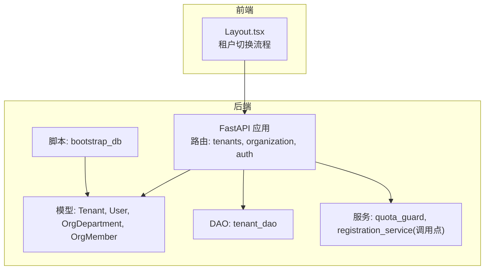
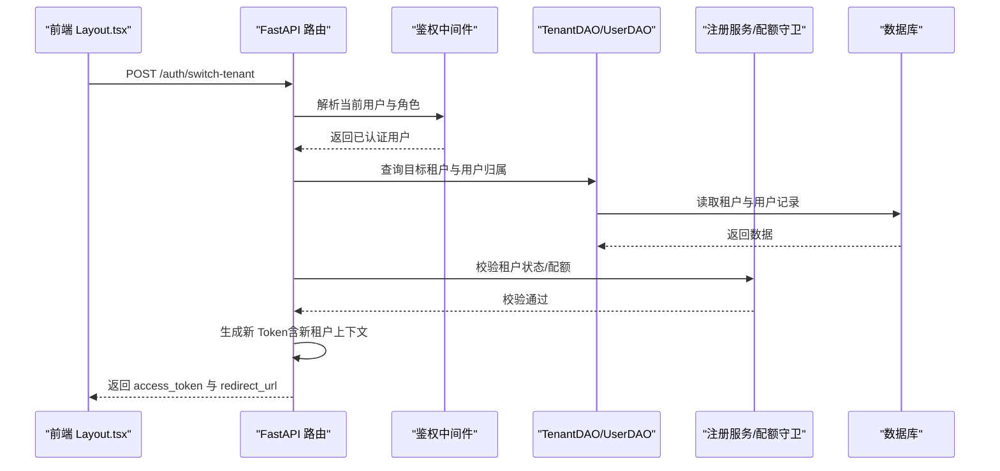
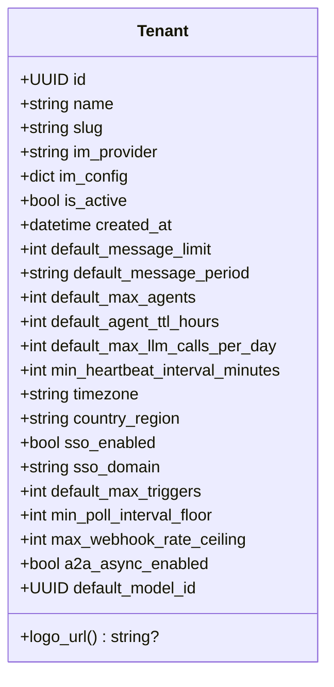
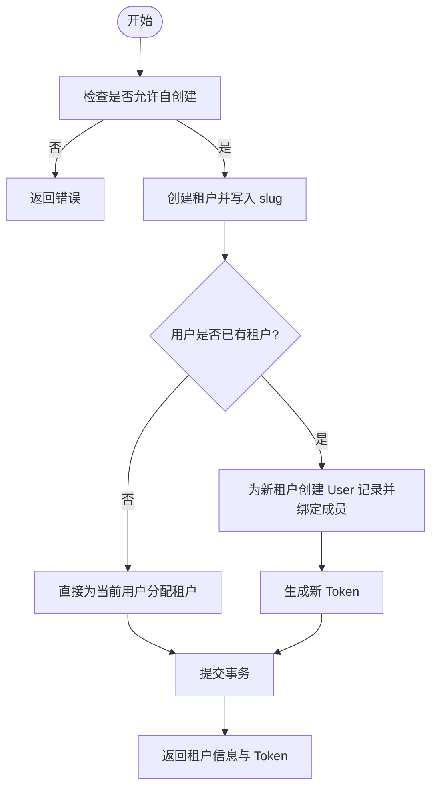
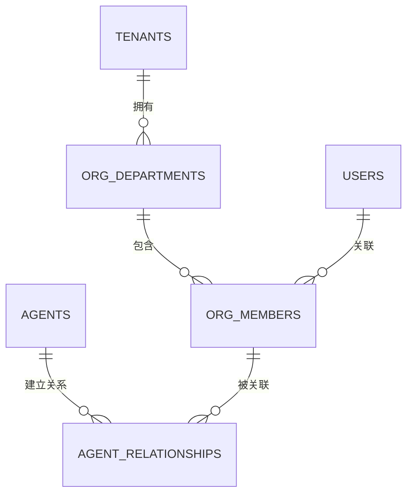
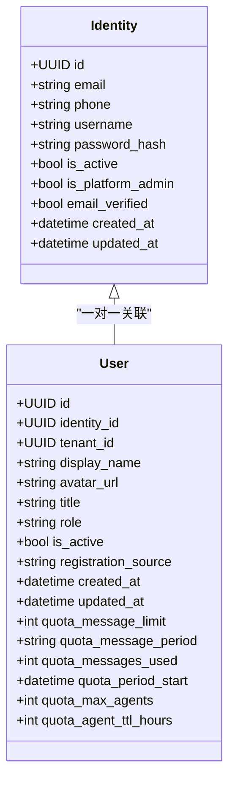
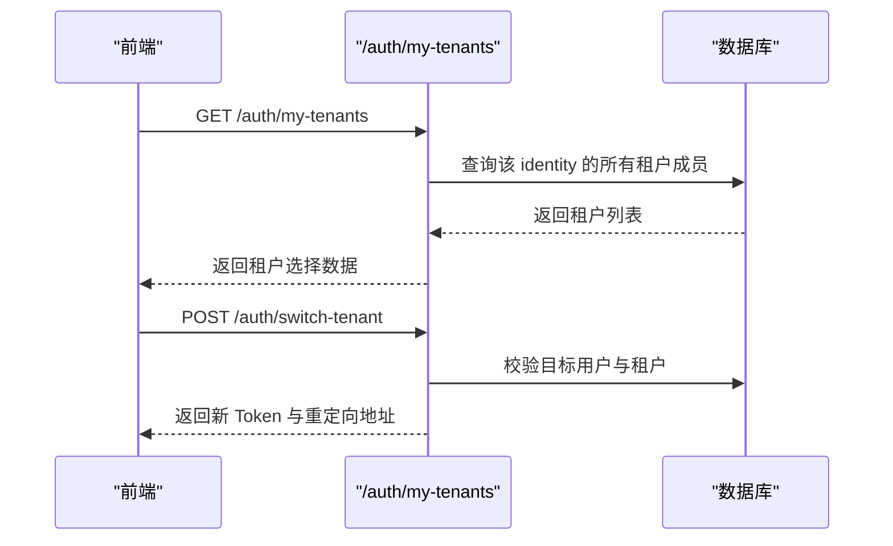
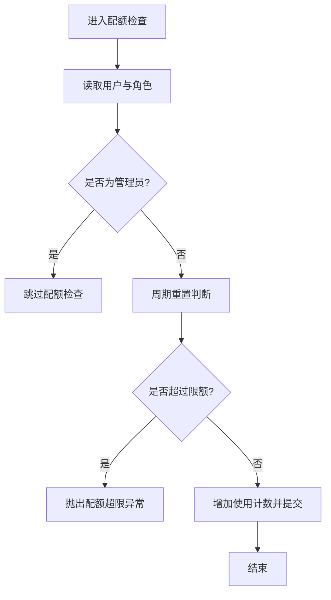
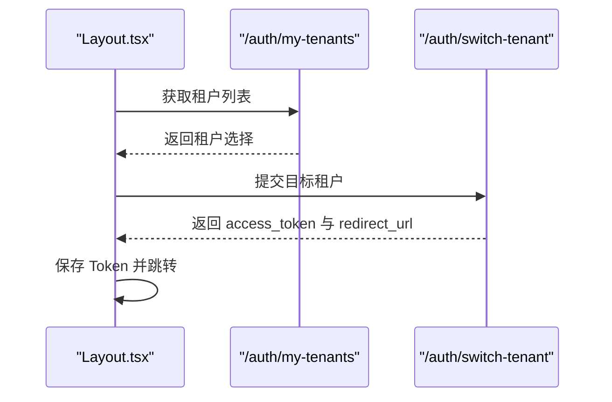
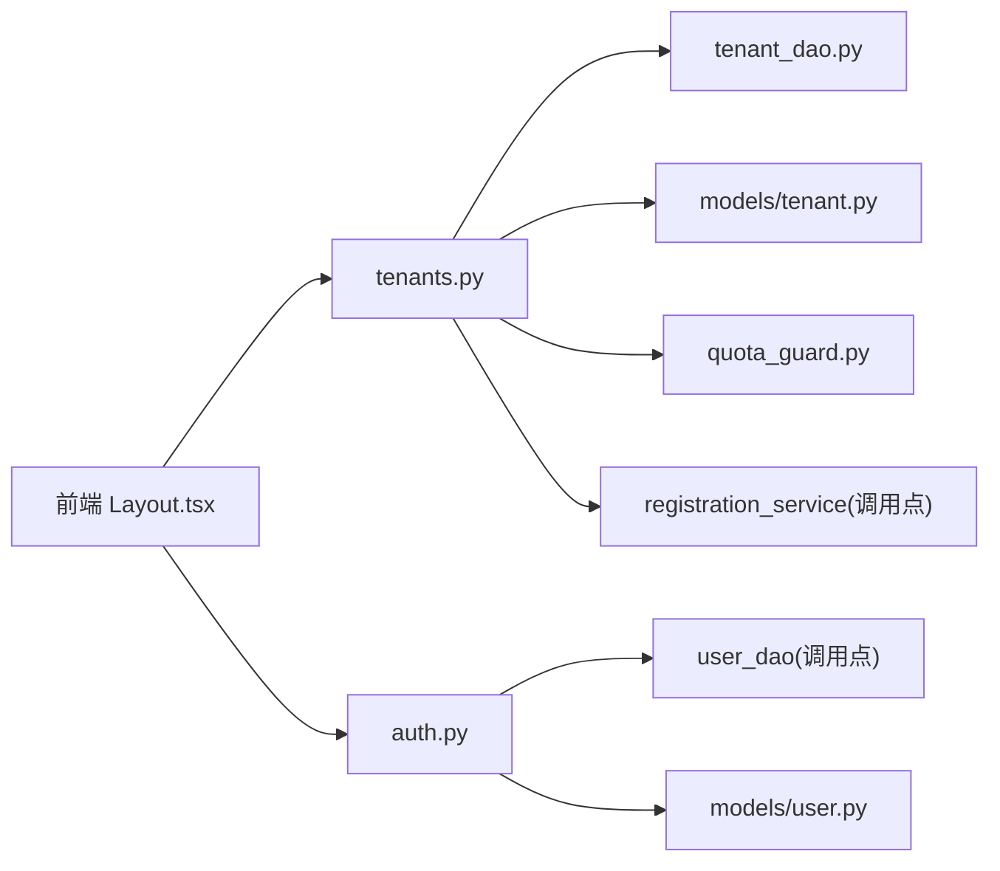

# 多租户管理

<cite>
**本文引用的文件**   
- [backend/app/models/tenant.py](file://backend/app/models/tenant.py)
- [backend/app/api/tenants.py](file://backend/app/api/tenants.py)
- [backend/app/dao/tenant_dao.py](file://backend/app/dao/tenant_dao.py)
- [backend/app/models/org.py](file://backend/app/models/org.py)
- [backend/app/api/organization.py](file://backend/app/api/organization.py)
- [backend/app/models/user.py](file://backend/app/models/user.py)
- [backend/app/core/middleware.py](file://backend/app/core/middleware.py)
- [backend/app/services/quota_guard.py](file://backend/app/services/quota_guard.py)
- [backend/app/api/auth.py](file://backend/app/api/auth.py)
- [backend/app/scripts/bootstrap_db.py](file://backend/app/scripts/bootstrap_db.py)
- [backend/alembic/versions/013_multi_tenant_registration.py](file://backend/alembic/versions/013_multi_tenant_registration.py)
- [frontend/src/pages/Layout.tsx](file://frontend/src/pages/Layout.tsx)
</cite>

## 目录
1. [简介](#简介)
2. [项目结构](#项目结构)
3. [核心组件](#核心组件)
4. [架构总览](#架构总览)
5. [详细组件分析](#详细组件分析)
6. [依赖关系分析](#依赖关系分析)
7. [性能与扩展性](#性能与扩展性)
8. [故障排查指南](#故障排查指南)
9. [结论](#结论)
10. [附录：操作手册](#附录操作手册)

## 简介
本操作手册面向多租户管理系统的使用者与运维人员，系统围绕“租户（公司）”作为隔离边界，提供租户创建、组织结构设计、成员管理、资源配额与限流、跨租户协作配置、生命周期管理与数据迁移等能力。文档从架构到实现细节进行分层说明，并给出可视化图示与操作步骤，帮助读者快速上手与排障。

## 项目结构
后端采用 FastAPI + SQLAlchemy 异步 ORM，模型按领域划分（租户、用户、组织、代理等），API 路由按功能模块拆分，DAO 层封装数据库访问，服务层承载业务逻辑（如配额、注册、工具配置等）。前端通过 API 完成租户切换与展示。

**图表来源** 
- [backend/app/api/tenants.py](file://backend/app/api/tenants.py)
- [backend/app/models/tenant.py](file://backend/app/models/tenant.py)
- [backend/app/dao/tenant_dao.py](file://backend/app/dao/tenant_dao.py)
- [backend/app/services/quota_guard.py](file://backend/app/services/quota_guard.py)
- [backend/app/scripts/bootstrap_db.py](file://backend/app/scripts/bootstrap_db.py)
- [frontend/src/pages/Layout.tsx](file://frontend/src/pages/Layout.tsx)

**章节来源**
- [backend/app/models/tenant.py](file://backend/app/models/tenant.py)
- [backend/app/api/tenants.py](file://backend/app/api/tenants.py)
- [backend/app/dao/tenant_dao.py](file://backend/app/dao/tenant_dao.py)
- [backend/app/models/org.py](file://backend/app/models/org.py)
- [backend/app/api/organization.py](file://backend/app/api/organization.py)
- [backend/app/models/user.py](file://backend/app/models/user.py)
- [backend/app/core/middleware.py](file://backend/app/core/middleware.py)
- [backend/app/services/quota_guard.py](file://backend/app/services/quota_guard.py)
- [backend/app/api/auth.py](file://backend/app/api/auth.py)
- [backend/app/scripts/bootstrap_db.py](file://backend/app/scripts/bootstrap_db.py)
- [backend/alembic/versions/013_multi_tenant_registration.py](file://backend/alembic/versions/013_multi_tenant_registration.py)
- [frontend/src/pages/Layout.tsx](file://frontend/src/pages/Layout.tsx)

## 核心组件
- 租户模型与 DAO：定义租户实体、默认配额、SSO 域名、A2A 开关、时区与国家码等；提供按 slug、ID、SSO 域名的查询能力。
- 用户与身份：全局 Identity 与租户内 User 分离，支持多租户角色（platform_admin、org_admin、agent_admin、member）。
- 组织模型：部门与成员（OrgDepartment/OrgMember），支持外部身份提供商软耦合与路径字段。
- 配额与限流：会话消息配额、Agent LLM 调用限额、心跳频率下限、Agent 过期策略。
- 认证与租户切换：根据当前用户身份获取可切换的租户列表，生成新 Token 并支持跨域重定向。
- 启动与迁移：容器启动时执行列补丁；Alembic 迁移负责历史数据清理与初始角色分配。

**章节来源**
- [backend/app/models/tenant.py](file://backend/app/models/tenant.py)
- [backend/app/dao/tenant_dao.py](file://backend/app/dao/tenant_dao.py)
- [backend/app/models/user.py](file://backend/app/models/user.py)
- [backend/app/models/org.py](file://backend/app/models/org.py)
- [backend/app/services/quota_guard.py](file://backend/app/services/quota_guard.py)
- [backend/app/api/auth.py](file://backend/app/api/auth.py)
- [backend/app/scripts/bootstrap_db.py](file://backend/app/scripts/bootstrap_db.py)
- [backend/alembic/versions/013_multi_tenant_registration.py](file://backend/alembic/versions/013_multi_tenant_registration.py)

## 架构总览
下图展示了多租户请求处理的关键路径：前端发起租户切换或创建，后端鉴权与权限校验，DAO 访问数据库，服务层执行配额与注册逻辑，最终返回结果与 Token。

**图表来源** 
- [backend/app/api/auth.py](file://backend/app/api/auth.py)
- [backend/app/dao/tenant_dao.py](file://backend/app/dao/tenant_dao.py)
- [backend/app/services/quota_guard.py](file://backend/app/services/quota_guard.py)
- [frontend/src/pages/Layout.tsx](file://frontend/src/pages/Layout.tsx)

## 详细组件分析

### 租户模型与默认配额
- 字段包括名称、slug、IM 提供商、JSON 配置、激活状态、默认消息限额与周期、最大 Agent 数、Agent TTL、每日 LLM 调用上限、心跳最小间隔、时区与国家码、SSO 开关与域名、触发器限制、A2A 异步开关、默认模型 ID。
- 提供 logo_url 属性从 im_config 中读取。

**图表来源** 
- [backend/app/models/tenant.py](file://backend/app/models/tenant.py)

**章节来源**
- [backend/app/models/tenant.py](file://backend/app/models/tenant.py)

### 租户 API：创建、加入、更新、删除与 Logo 管理
- 自创建公司：支持注册流程与多租户切换流程；若用户已有租户则在新租户下新建 User 记录并绑定成员；返回 access_token 供前端切换上下文。
- 邀请码加入：校验邀请码有效性、使用次数、租户匹配；首个加入者自动成为 org_admin。
- 注册配置：是否允许自创建公司。
- 域名解析：根据 sso_domain 或子域名 slug 解析租户。
- 列出/获取/更新租户：平台管理员可查看所有；组织管理员仅能操作自身租户；禁止平台管理员覆盖 SSO 配置。
- Logo 上传/删除：存储于对象存储，URL 由后端生成。
- 删除租户：按外键顺序级联删除各表数据，确保约束不冲突；返回 fallback_tenant_id。

**图表来源** 
- [backend/app/api/tenants.py](file://backend/app/api/tenants.py)

**章节来源**
- [backend/app/api/tenants.py](file://backend/app/api/tenants.py)

### 组织结构与成员管理
- 部门与成员：支持外部 ID、提供商 ID 软耦合、部门路径、成员状态、同步时间戳。
- 成员与代理关系：Agent 与 OrgMember 的关系表，描述协作关系。
- 用户管理 API：按租户过滤列出用户；管理员更新用户资料并在变更邮箱/手机时同步至 OrgMember。

**图表来源** 
- [backend/app/models/org.py](file://backend/app/models/org.py)
- [backend/app/models/user.py](file://backend/app/models/user.py)

**章节来源**
- [backend/app/models/org.py](file://backend/app/models/org.py)
- [backend/app/api/organization.py](file://backend/app/api/organization.py)

### 用户与身份模型
- Identity：全局唯一标识（邮箱、手机号、用户名）、密码哈希、激活状态、平台管理员标记、邮箱验证状态。
- User：租户内成员，角色枚举、配额字段（消息限额与周期、Agent 数量与 TTL）、与 Identity 的关联。

**图表来源** 
- [backend/app/models/user.py](file://backend/app/models/user.py)

**章节来源**
- [backend/app/models/user.py](file://backend/app/models/user.py)

### 认证与租户切换
- 获取我的租户列表：基于当前用户的 identity_id 查询所有租户成员记录，返回租户选择信息（名称、slug、logo）。
- 切换租户：校验目标用户归属与租户状态，生成新 Token，计算重定向 URL（支持自定义域名跳转），返回 access_token 与 redirect_url。

**图表来源** 
- [backend/app/api/auth.py](file://backend/app/api/auth.py)

**章节来源**
- [backend/app/api/auth.py](file://backend/app/api/auth.py)

### 配额与限流机制
- 会话消息配额：按周期重置计数器，管理员豁免；超过限额抛出异常。
- Agent LLM 调用配额：按日重置计数，超过限额抛出异常。
- Agent 创建配额：统计非过期 Agent 数量，超过限额抛出异常。
- 心跳下限：强制租户内所有 Agent 的心跳间隔不低于阈值。

**图表来源** 
- [backend/app/services/quota_guard.py](file://backend/app/services/quota_guard.py)

**章节来源**
- [backend/app/services/quota_guard.py](file://backend/app/services/quota_guard.py)

### 启动与迁移：列补丁与历史数据处理
- 启动脚本：在启用 legacy 模式时创建表并批量应用列补丁（如租户 SSO 字段、工具源类型、Agent 用量字段等）。
- Alembic 迁移：为邀请码添加租户 ID、清理历史邀请码、将最早加入的用户设为 org_admin、初始化平台设置 allow_self_create_company。

**章节来源**
- [backend/app/scripts/bootstrap_db.py](file://backend/app/scripts/bootstrap_db.py)
- [backend/alembic/versions/013_multi_tenant_registration.py](file://backend/alembic/versions/013_multi_tenant_registration.py)

### 前端租户切换流程
- 获取 my-tenants 列表后，用户选择目标租户，调用 switch-tenant 接口，保存新 Token 并根据 redirect_url 跳转或刷新页面。

**图表来源** 
- [frontend/src/pages/Layout.tsx](file://frontend/src/pages/Layout.tsx)

**章节来源**
- [frontend/src/pages/Layout.tsx](file://frontend/src/pages/Layout.tsx)

## 依赖关系分析
- 路由层依赖鉴权中间件与数据库会话，调用 DAO 与服务层。
- 模型间通过外键与关系字段形成强一致性边界（如 users.tenant_id 指向 tenants.id）。
- 服务层对配额与注册流程进行集中控制，避免在路由中散落业务规则。
- 前端通过 API 完成租户切换与展示，保持前后端职责清晰。

**图表来源** 
- [backend/app/api/tenants.py](file://backend/app/api/tenants.py)
- [backend/app/api/auth.py](file://backend/app/api/auth.py)
- [backend/app/dao/tenant_dao.py](file://backend/app/dao/tenant_dao.py)
- [backend/app/models/tenant.py](file://backend/app/models/tenant.py)
- [backend/app/models/user.py](file://backend/app/models/user.py)
- [backend/app/services/quota_guard.py](file://backend/app/services/quota_guard.py)

**章节来源**
- [backend/app/api/tenants.py](file://backend/app/api/tenants.py)
- [backend/app/api/auth.py](file://backend/app/api/auth.py)
- [backend/app/dao/tenant_dao.py](file://backend/app/dao/tenant_dao.py)
- [backend/app/models/tenant.py](file://backend/app/models/tenant.py)
- [backend/app/models/user.py](file://backend/app/models/user.py)
- [backend/app/services/quota_guard.py](file://backend/app/services/quota_guard.py)

## 性能与扩展性
- 索引与查询优化：租户 slug、sso_domain、users.tenant_id、org_members.* 等字段具备索引，提升常见查询性能。
- 异步 ORM：SQLAlchemy 异步会话减少阻塞，提高并发处理能力。
- 配额检查与重置：按周期重置计数器，避免频繁全量扫描；心跳下限统一调整，降低高频任务压力。
- 可扩展点：
  - 新增租户字段与默认配额：在模型与 API Schema 中扩展，并在启动脚本或迁移中补齐历史数据。
  - 新增 IM 提供商：扩展枚举与配置项，结合 SSO 域名解析。
  - 跨租户协作：通过 A2A 异步开关与工具配置（如 Smithery）实现安全协作。

[本节为通用指导，无需特定文件引用]

## 故障排查指南
- 无法自创建公司：检查系统设置 allow_self_create_company；确认当前用户角色与链接限制。
- 邀请码无效或已达上限：核对邀请码状态与使用次数；确认 target_tenant_id 匹配。
- 切换租户失败：检查目标用户是否属于该租户；确认租户处于激活状态；查看返回的错误详情。
- 配额超限：查看用户角色与周期重置情况；必要时调整租户默认配额或用户配额。
- 删除租户失败：检查外键约束与级联删除顺序；确认是否有未释放的关联数据。

**章节来源**
- [backend/app/api/tenants.py](file://backend/app/api/tenants.py)
- [backend/app/api/auth.py](file://backend/app/api/auth.py)
- [backend/app/services/quota_guard.py](file://backend/app/services/quota_guard.py)

## 结论
本系统以租户为核心隔离边界，结合用户与组织模型、配额与限流机制、认证与租户切换流程，提供了完整的多租户管理能力。通过清晰的架构设计与可扩展点，既能满足企业级需求，又具备良好的演进空间。建议在生产环境中严格管控租户创建与邀请码发放，合理设置配额与心跳下限，并定期审计与备份关键数据。

[本节为总结，无需特定文件引用]

## 附录：操作手册

### 租户创建流程
- 步骤
  1. 登录系统，进入“公司/租户”管理页面。
  2. 点击“自创建公司”，输入公司名称，系统自动生成 slug。
  3. 若用户已有其他租户，系统将在新租户下创建新的用户记录并返回 access_token。
  4. 使用返回的 token 切换到新租户上下文。
- 注意事项
  - 若系统禁用自创建，需联系平台管理员开启。
  - 专属链接模式下不允许自创建，只能加入指定组织。

**章节来源**
- [backend/app/api/tenants.py](file://backend/app/api/tenants.py)

### 组织结构设计
- 部门与成员
  - 导入或同步外部身份提供商的组织结构（飞书等）。
  - 部门具有层级与路径，成员包含姓名、邮箱、电话、职位等信息。
- 成员与代理关系
  - 为 Agent 配置与成员的协作关系，便于权限与可见性控制。

**章节来源**
- [backend/app/models/org.py](file://backend/app/models/org.py)
- [backend/app/api/organization.py](file://backend/app/api/organization.py)

### 成员管理功能
- 列出成员：按租户过滤，支持管理员查看指定租户成员。
- 更新成员资料：修改邮箱或手机号时自动同步至 OrgMember。
- 邀请码加入：生成邀请码，用户凭码加入并自动分配角色（首个加入者为 org_admin）。

**章节来源**
- [backend/app/api/organization.py](file://backend/app/api/organization.py)
- [backend/app/api/tenants.py](file://backend/app/api/tenants.py)

### 租户隔离机制
- 数据隔离：所有业务表通过 tenant_id 字段限定作用域；查询与写入均携带租户上下文。
- 身份隔离：Identity 全局唯一，User 按租户区分角色与配额。
- 资源隔离：工具、技能、LLM 模型等按租户可见与配置。

**章节来源**
- [backend/app/models/user.py](file://backend/app/models/user.py)
- [backend/app/models/tenant.py](file://backend/app/models/tenant.py)

### 资源分配策略
- 默认配额：消息限额与周期、最大 Agent 数、Agent TTL、每日 LLM 调用上限。
- 心跳下限：防止 Agent 过于频繁心跳导致系统压力。
- 触发器限制：轮询间隔下限与 Webhook 速率上限。

**章节来源**
- [backend/app/models/tenant.py](file://backend/app/models/tenant.py)
- [backend/app/services/quota_guard.py](file://backend/app/services/quota_guard.py)

### 跨租户协作配置
- A2A 异步通信：租户级别开关控制 Agent 间异步通知与任务委派。
- 工具配置：通过租户设置注入第三方密钥（如 GitHub、ClawHub、Smithery），实现跨租户工具能力。

**章节来源**
- [backend/app/models/tenant.py](file://backend/app/models/tenant.py)
- [backend/app/api/tools.py](file://backend/app/api/tools.py)
- [backend/app/services/resource_discovery.py](file://backend/app/services/resource_discovery.py)

### 租户生命周期管理
- 创建：自创建或邀请码加入。
- 更新：基本信息、SSO 配置、默认配额与心跳下限。
- 删除：级联删除所有关联数据，返回 fallback_tenant_id 以便用户回退。

**章节来源**
- [backend/app/api/tenants.py](file://backend/app/api/tenants.py)

### 数据迁移与批量操作
- 启动脚本：批量应用列补丁，补齐历史数据。
- Alembic 迁移：清理历史邀请码、分配 org_admin、初始化平台设置。
- 批量工具更新：一次性启用/禁用多个工具。

**章节来源**
- [backend/app/scripts/bootstrap_db.py](file://backend/app/scripts/bootstrap_db.py)
- [backend/alembic/versions/013_multi_tenant_registration.py](file://backend/alembic/versions/013_multi_tenant_registration.py)
- [backend/app/api/tools.py](file://backend/app/api/tools.py)

### 多租户架构设计原则与扩展性考虑
- 原则
  - 明确隔离边界：租户作为数据与资源的隔离单元。
  - 身份与作用域分离：全局身份与租户内角色解耦。
  - 配置驱动：通过租户设置与系统设置控制行为。
- 扩展性
  - 新增租户字段与配额：模型与 API 同步扩展，迁移补齐历史数据。
  - 新增集成与工具：通过租户设置注入密钥与配置。
  - 异步与缓存：利用异步 ORM 与缓存策略提升性能。

[本节为通用指导，无需特定文件引用]