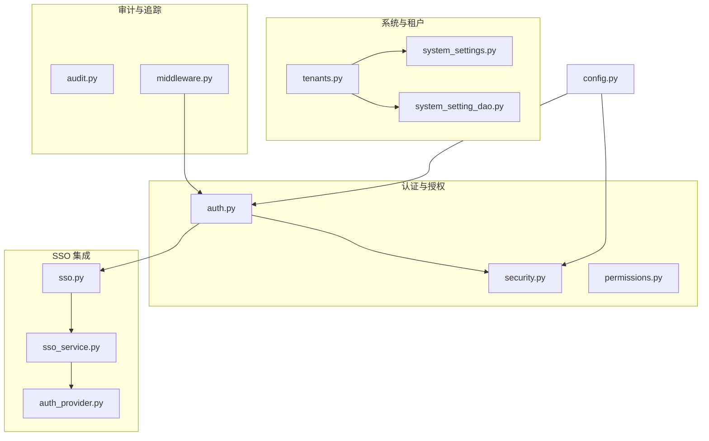
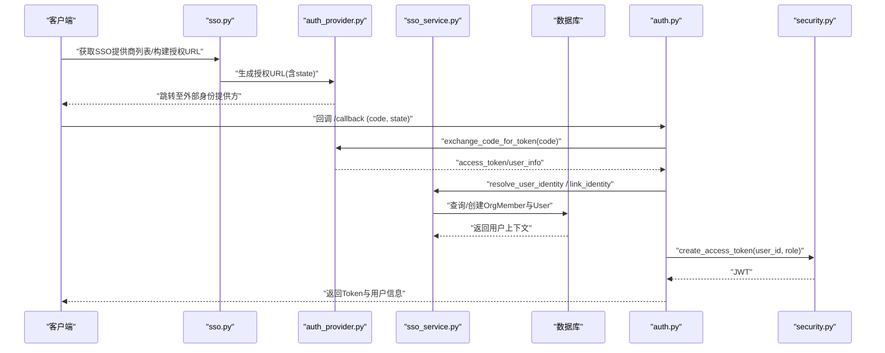
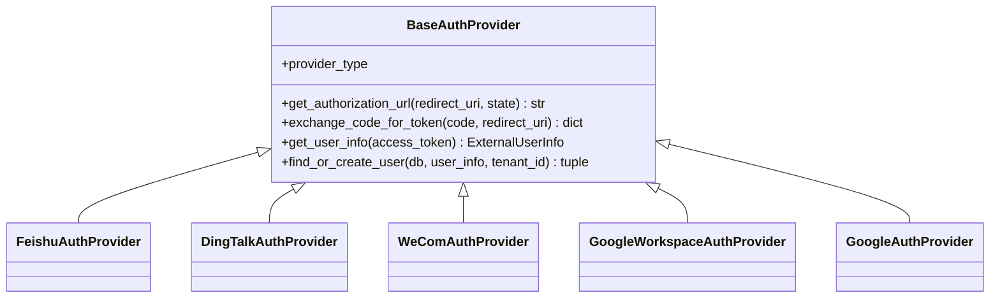
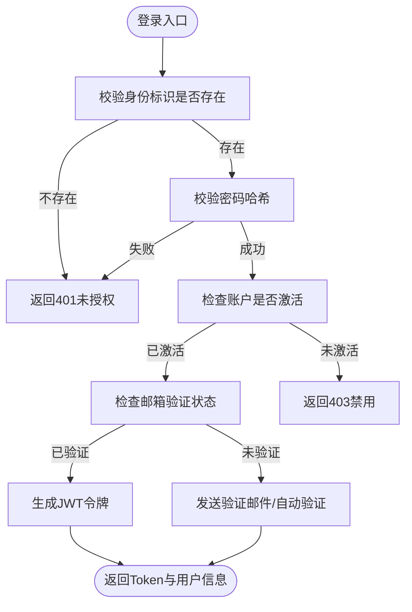
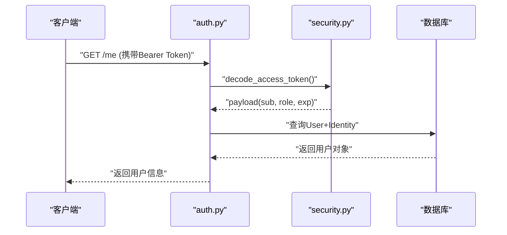
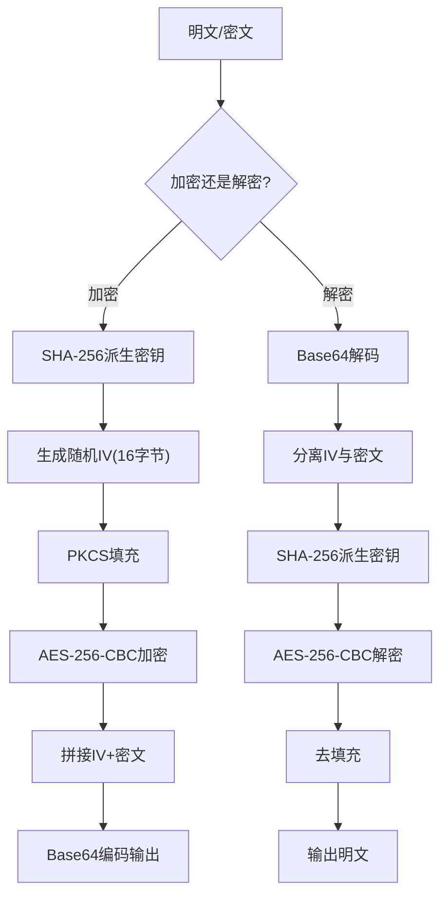
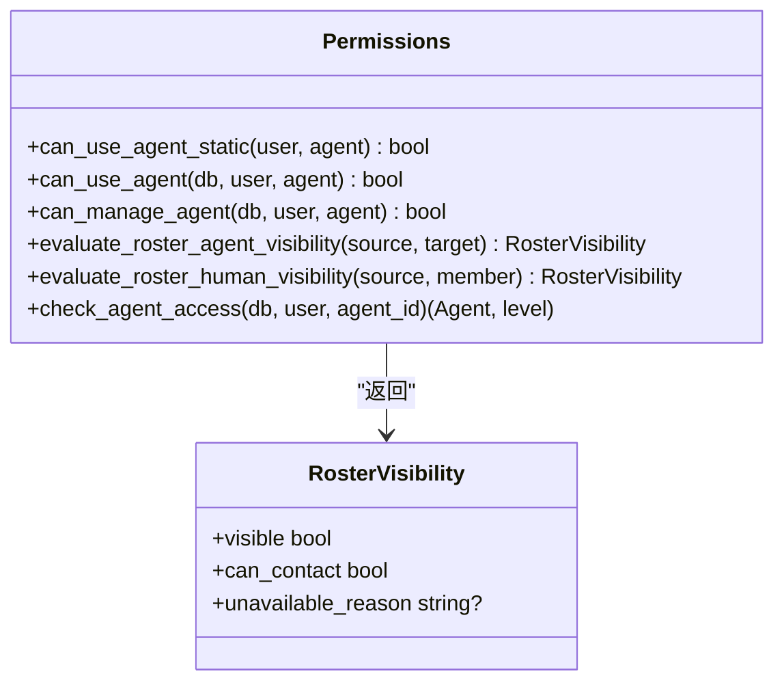
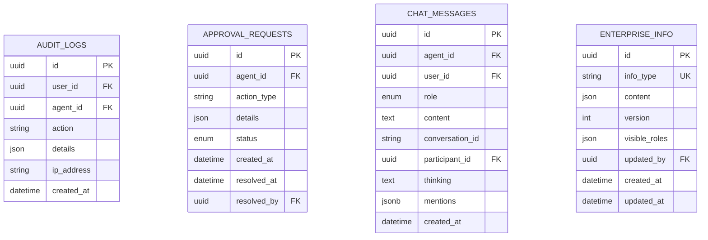
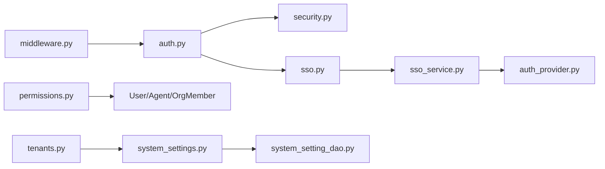

# 安全设置

<cite>
**本文引用的文件**   
- [backend/app/api/sso.py](file://backend/app/api/sso.py)
- [backend/app/services/sso_service.py](file://backend/app/services/sso_service.py)
- [backend/app/core/security.py](file://backend/app/core/security.py)
- [backend/app/core/permissions.py](file://backend/app/core/permissions.py)
- [backend/app/models/system_settings.py](file://backend/app/models/system_settings.py)
- [backend/app/api/auth.py](file://backend/app/api/auth.py)
- [backend/app/models/audit.py](file://backend/app/models/audit.py)
- [backend/app/services/auth_provider.py](file://backend/app/services/auth_provider.py)
- [backend/app/core/middleware.py](file://backend/app/core/middleware.py)
- [backend/app/config.py](file://backend/app/config.py)
- [backend/app/dao/system_setting_dao.py](file://backend/app/dao/system_setting_dao.py)
- [backend/app/api/tenants.py](file://backend/app/api/tenants.py)
</cite>

## 目录
1. [简介](#简介)
2. [项目结构](#项目结构)
3. [核心组件](#核心组件)
4. [架构总览](#架构总览)
5. [详细组件分析](#详细组件分析)
6. [依赖关系分析](#依赖关系分析)
7. [性能考虑](#性能考虑)
8. [故障排查指南](#故障排查指南)
9. [结论](#结论)
10. [附录](#附录)

## 简介
本指南面向企业级部署，提供系统安全设置的完整配置与加固建议。内容覆盖：
- SSO 集成（OAuth2/OIDC、企业微信、钉钉、飞书、Google Workspace）
- 密码策略与会话管理
- 数据加密选项（敏感字段加密、密钥管理）
- API 访问控制（角色与权限模型、租户隔离）
- IP 白名单与域名重定向
- 多因素认证（MFA）扩展点
- 安全审计与日志追踪
- 常见漏洞防护与安全加固清单

## 项目结构
后端采用 FastAPI + SQLAlchemy 异步架构，安全相关能力分布在以下模块：
- 认证与授权：auth.py、security.py、permissions.py
- SSO 服务：sso.py、sso_service.py、auth_provider.py
- 系统与租户设置：system_settings.py、system_setting_dao.py、tenants.py
- 审计与追踪：audit.py、middleware.py
- 应用配置：config.py

**图表来源** 
- [backend/app/api/auth.py](file://backend/app/api/auth.py)
- [backend/app/core/security.py](file://backend/app/core/security.py)
- [backend/app/core/permissions.py](file://backend/app/core/permissions.py)
- [backend/app/api/sso.py](file://backend/app/api/sso.py)
- [backend/app/services/sso_service.py](file://backend/app/services/sso_service.py)
- [backend/app/services/auth_provider.py](file://backend/app/services/auth_provider.py)
- [backend/app/models/system_settings.py](file://backend/app/models/system_settings.py)
- [backend/app/dao/system_setting_dao.py](file://backend/app/dao/system_setting_dao.py)
- [backend/app/api/tenants.py](file://backend/app/api/tenants.py)
- [backend/app/core/middleware.py](file://backend/app/core/middleware.py)
- [backend/app/config.py](file://backend/app/config.py)

**章节来源**
- [backend/app/api/auth.py](file://backend/app/api/auth.py)
- [backend/app/core/security.py](file://backend/app/core/security.py)
- [backend/app/core/permissions.py](file://backend/app/core/permissions.py)
- [backend/app/api/sso.py](file://backend/app/api/sso.py)
- [backend/app/services/sso_service.py](file://backend/app/services/sso_service.py)
- [backend/app/services/auth_provider.py](file://backend/app/services/auth_provider.py)
- [backend/app/models/system_settings.py](file://backend/app/models/system_settings.py)
- [backend/app/dao/system_setting_dao.py](file://backend/app/dao/system_setting_dao.py)
- [backend/app/api/tenants.py](file://backend/app/api/tenants.py)
- [backend/app/core/middleware.py](file://backend/app/core/middleware.py)
- [backend/app/config.py](file://backend/app/config.py)

## 核心组件
- 认证与令牌：JWT 签发与校验、Bearer 鉴权、管理员角色检查
- 密码与加密：bcrypt 哈希、AES-256-CBC 加解密工具
- 权限模型：RBAC + 租户隔离 + Agent 访问控制
- SSO 服务：统一身份提供者抽象、用户匹配与绑定、会话状态机
- 系统与租户设置：键值存储、平台级开关、SSO 域名重定向
- 审计与追踪：操作审计表、请求 TraceId 注入与记录

**章节来源**
- [backend/app/core/security.py](file://backend/app/core/security.py)
- [backend/app/core/permissions.py](file://backend/app/core/permissions.py)
- [backend/app/services/sso_service.py](file://backend/app/services/sso_service.py)
- [backend/app/models/system_settings.py](file://backend/app/models/system_settings.py)
- [backend/app/core/middleware.py](file://backend/app/core/middleware.py)

## 架构总览
下图展示一次典型的 SSO 登录流程（以 OAuth2/OIDC 为例），包括授权码交换、用户解析、组织成员关联与令牌签发。

**图表来源** 
- [backend/app/api/sso.py](file://backend/app/api/sso.py)
- [backend/app/services/auth_provider.py](file://backend/app/services/auth_provider.py)
- [backend/app/services/sso_service.py](file://backend/app/services/sso_service.py)
- [backend/app/api/auth.py](file://backend/app/api/auth.py)
- [backend/app/core/security.py](file://backend/app/core/security.py)

## 详细组件分析

### SSO 集成配置（SAML/OAuth2/LDAP 等）
- 支持的 OAuth2/OIDC 提供商：飞书、钉钉、企业微信、Google Workspace、Google（个人账号）
- 统一抽象：BaseAuthProvider 定义授权 URL、代码换令牌、获取用户信息接口；各 Provider 实现具体协议细节
- 用户解析与绑定：通过 sso_service 基于 unionid/open_id/external_id 查找或创建 OrgMember，并关联到 User；支持邮箱/手机号回退匹配
- 会话与扫码：SSOScanSession 用于二维码扫码登录的状态流转（pending/scanned/authorized/expired/completed）
- 租户与域名：根据 tenant_id 过滤可用 Provider；支持按租户的 SSO 域名与公共基础 URL 计算回调地址

**图表来源** 
- [backend/app/services/auth_provider.py](file://backend/app/services/auth_provider.py)

配置要点与建议：
- 在 IdentityProvider 中启用 sso_login_enabled 与 is_active，并按租户配置 app_id/client_id、secret、scope 等
- 回调地址需使用平台服务计算的 public_base_url，避免跨域问题
- 对于企业微信，注意“IP 白名单”限制（调用 getuserdetail/user/get 需要服务器 IP 在白名单）
- 对 Google Workspace，建议使用 OIDC scope 与必要的 Admin 只读权限（如需组织同步）

**章节来源**
- [backend/app/api/sso.py](file://backend/app/api/sso.py)
- [backend/app/services/auth_provider.py](file://backend/app/services/auth_provider.py)
- [backend/app/services/sso_service.py](file://backend/app/services/sso_service.py)
- [backend/app/models/identity.py](file://backend/app/models/identity.py)

### 密码策略设置
- 密码哈希：bcrypt（线程池异步执行，避免阻塞事件循环）
- 登录流程：支持邮箱/用户名/手机号登录，强制检查 identity 活跃性与邮箱验证状态
- 重置密码：一次性 token 机制，过期时间由配置项控制
- 注册流程：支持邀请码、SSO 注册、首次用户自动成为平台管理员

**图表来源** 
- [backend/app/api/auth.py](file://backend/app/api/auth.py)
- [backend/app/core/security.py](file://backend/app/core/security.py)

配置项参考：
- JWT_SECRET_KEY、JWT_ALGORITHM、JWT_ACCESS_TOKEN_EXPIRE_MINUTES
- PASSWORD_RESET_TOKEN_EXPIRE_MINUTES、EMAIL_VERIFICATION_TOKEN_EXPIRE_MINUTES、EMAIL_VERIFICATION_REQUIRED

**章节来源**
- [backend/app/api/auth.py](file://backend/app/api/auth.py)
- [backend/app/core/security.py](file://backend/app/core/security.py)
- [backend/app/config.py](file://backend/app/config.py)

### 会话管理配置
- 访问令牌：JWT，包含用户子标识与角色，过期时间可配置
- 当前用户解析：从 Bearer Token 解码后加载 User 与 Identity，确保活跃性
- 管理员依赖：require_role 工厂函数，支持平台管理员与组织管理员层级
- 切换租户：重新签发新租户下的 Token，并可携带跨域重定向 URL

**图表来源** 
- [backend/app/api/auth.py](file://backend/app/api/auth.py)
- [backend/app/core/security.py](file://backend/app/core/security.py)

**章节来源**
- [backend/app/core/security.py](file://backend/app/core/security.py)
- [backend/app/api/auth.py](file://backend/app/api/auth.py)

### 数据加密选项
- AES-256-CBC 加解密：用于敏感字段（如渠道密钥、沙箱配置等），IV 随机生成并与密文一起 Base64 编码
- 密钥派生：SHA-256 将输入密钥转换为 32 字节 AES 密钥
- 使用场景：系统设置中的加密字段、沙箱配置读取时的透明解密

**图表来源** 
- [backend/app/core/security.py](file://backend/app/core/security.py)

**章节来源**
- [backend/app/core/security.py](file://backend/app/core/security.py)

### API 访问控制与权限模型设计
- RBAC：角色层次 member < agent_admin < org_admin < platform_admin
- 租户隔离：所有资源按 tenant_id 隔离，跨租户访问直接拒绝
- Agent 访问控制：公司可见、私有、自定义三种模式；支持显式用户授权
- 关系评估：Agent-Agent、Agent-Human 的关系有效性动态评估

**图表来源** 
- [backend/app/core/permissions.py](file://backend/app/core/permissions.py)

**章节来源**
- [backend/app/core/permissions.py](file://backend/app/core/permissions.py)

### 安全审计配置
- 审计日志：AuditLog 记录操作人、动作、详情、IP、时间戳
- 审批流：ApprovalRequest 支持 L3 自主操作的审批状态机
- 消息审计：ChatMessage 记录对话内容与参与者身份
- 企业档案：EnterpriseInfo 集中存储版本化企业元数据

**图表来源** 
- [backend/app/models/audit.py](file://backend/app/models/audit.py)

**章节来源**
- [backend/app/models/audit.py](file://backend/app/models/audit.py)

### 多因素认证（MFA）配置
- 当前实现：未内置 MFA，但可通过扩展点接入（例如在登录成功后增加二次校验中间件）
- 建议方案：结合短信验证码、TOTP 或企业微信/钉钉扫码二次确认；在 auth.py 的登录成功后插入 MFA 校验步骤
- 会话增强：为 MFA 成功后的会话添加额外声明（如 mfa_verified=true），并在后续敏感操作前校验

[本节为概念性说明，不直接分析具体文件]

### IP 白名单与域名重定向
- 企业微信：部分 API（getuserdetail/user/get）要求服务器 IP 在白名单内
- SSO 域名重定向：支持按租户的 sso_domain 进行跨域重定向，全局开关由 system_settings 控制
- 平台级设置：PUBLIC_BASE_URL、CORS_ORIGINS、代理配置等影响回调与跨域行为

**章节来源**
- [backend/app/services/auth_provider.py](file://backend/app/services/auth_provider.py)
- [backend/app/api/tenants.py](file://backend/app/api/tenants.py)
- [backend/app/dao/system_setting_dao.py](file://backend/app/dao/system_setting_dao.py)
- [backend/app/config.py](file://backend/app/config.py)

## 依赖关系分析
- 认证层依赖安全工具（JWT、bcrypt、AES）、DAO 层（用户、身份、租户）、SSO 服务
- SSO 服务依赖身份提供者抽象与数据库（OrgMember、User、IdentityProvider）
- 权限模块依赖用户与 Agent 模型，以及租户隔离约束
- 系统与租户设置通过 SystemSetting 表与 DAO 层统一管理

**图表来源** 
- [backend/app/api/auth.py](file://backend/app/api/auth.py)
- [backend/app/core/security.py](file://backend/app/core/security.py)
- [backend/app/api/sso.py](file://backend/app/api/sso.py)
- [backend/app/services/sso_service.py](file://backend/app/services/sso_service.py)
- [backend/app/services/auth_provider.py](file://backend/app/services/auth_provider.py)
- [backend/app/core/permissions.py](file://backend/app/core/permissions.py)
- [backend/app/models/system_settings.py](file://backend/app/models/system_settings.py)
- [backend/app/dao/system_setting_dao.py](file://backend/app/dao/system_setting_dao.py)
- [backend/app/api/tenants.py](file://backend/app/api/tenants.py)
- [backend/app/core/middleware.py](file://backend/app/core/middleware.py)

**章节来源**
- [backend/app/api/auth.py](file://backend/app/api/auth.py)
- [backend/app/core/security.py](file://backend/app/core/security.py)
- [backend/app/api/sso.py](file://backend/app/api/sso.py)
- [backend/app/services/sso_service.py](file://backend/app/services/sso_service.py)
- [backend/app/services/auth_provider.py](file://backend/app/services/auth_provider.py)
- [backend/app/core/permissions.py](file://backend/app/core/permissions.py)
- [backend/app/models/system_settings.py](file://backend/app/models/system_settings.py)
- [backend/app/dao/system_setting_dao.py](file://backend/app/dao/system_setting_dao.py)
- [backend/app/api/tenants.py](file://backend/app/api/tenants.py)
- [backend/app/core/middleware.py](file://backend/app/core/middleware.py)

## 性能考虑
- bcrypt 哈希使用线程池异步执行，避免阻塞事件循环
- JWT 解码与用户查询在依赖注入中完成，减少重复计算
- SSO 回调与用户解析尽量在事务边界外进行非关键路径操作（如发送邮件）
- 审计日志写入应异步化，避免影响主流程延迟

[本节为通用指导，不直接分析具体文件]

## 故障排查指南
- 登录失败：检查 identity 是否存在、密码哈希是否正确、账户是否激活、邮箱是否验证
- SSO 回调失败：核对 provider 配置（client_id/secret/scope）、回调地址、state 校验
- 企业微信受限：确认服务器 IP 已在企业微信应用白名单；检查 user_ticket 与权限范围
- 跨域重定向异常：检查 PUBLIC_BASE_URL、CORS_ORIGINS、sso_custom_domain_redirect_enabled 开关
- 审计缺失：确认 middleware 是否注入 TraceId，审计表写入是否正常

**章节来源**
- [backend/app/api/auth.py](file://backend/app/api/auth.py)
- [backend/app/services/auth_provider.py](file://backend/app/services/auth_provider.py)
- [backend/app/core/middleware.py](file://backend/app/core/middleware.py)
- [backend/app/dao/system_setting_dao.py](file://backend/app/dao/system_setting_dao.py)

## 结论
本系统提供了完善的企业级安全基座：统一的 SSO 抽象、严格的 RBAC 与租户隔离、健壮的密码与加密工具、可扩展的审计与追踪。建议在生产环境中：
- 严格配置 JWT 密钥与算法，缩短令牌有效期
- 启用邮箱验证与密码重置保护
- 合理设置 CORS 与代理，避免跨域泄露
- 定期审查审计日志与权限分配
- 针对第三方服务（如企业微信）落实 IP 白名单与最小权限原则

[本节为总结性内容，不直接分析具体文件]

## 附录
- 常用环境变量（节选）：
  - JWT_SECRET_KEY、JWT_ALGORITHM、JWT_ACCESS_TOKEN_EXPIRE_MINUTES
  - DATABASE_URL、REDIS_URL
  - PUBLIC_BASE_URL、CORS_ORIGINS、HTTP_PROXY/HTTPS_PROXY/NO_PROXY
  - SANDBOX_*（沙箱配置）
- 关键端点：
  - /api/auth/register/init、/api/auth/login、/api/auth/reset-password
  - /api/sso/session、/api/sso/config
  - /api/enterprise/system-settings/{key}

**章节来源**
- [backend/app/config.py](file://backend/app/config.py)
- [backend/app/api/auth.py](file://backend/app/api/auth.py)
- [backend/app/api/sso.py](file://backend/app/api/sso.py)
- [backend/app/api/enterprise.py](file://backend/app/api/enterprise.py)