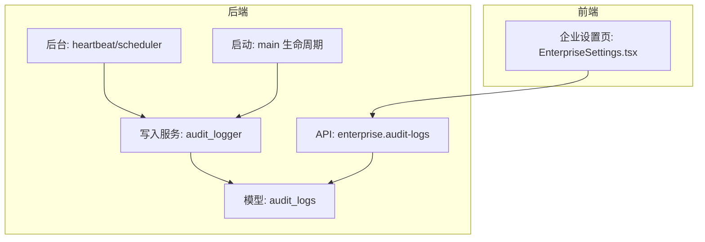
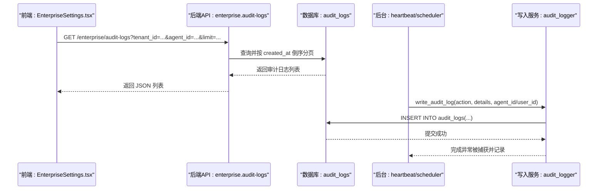
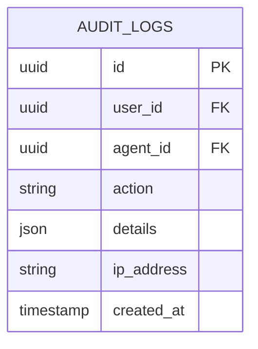
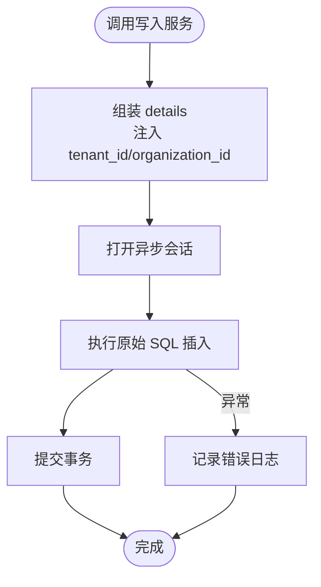
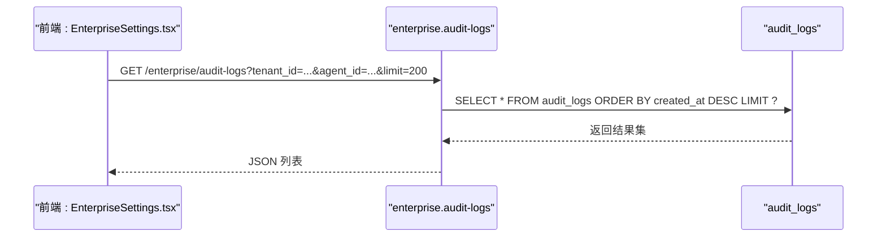
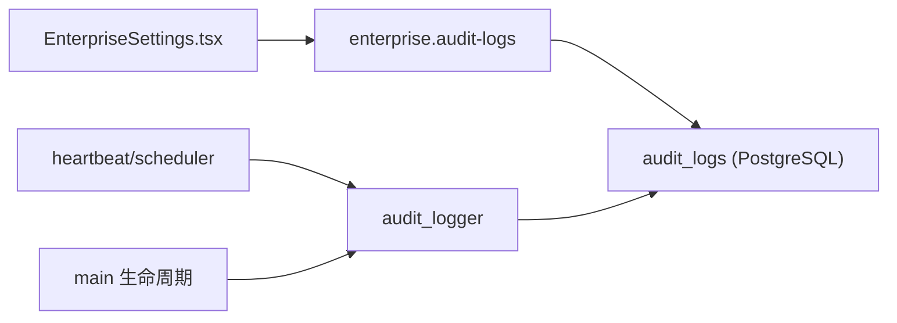

# 审计日志系统

<cite>
**本文引用的文件**   
- [backend/app/models/audit.py](file://backend/app/models/audit.py)
- [backend/app/services/audit_logger.py](file://backend/app/services/audit_logger.py)
- [backend/app/api/enterprise.py](file://backend/app/api/enterprise.py)
- [backend/app/main.py](file://backend/app/main.py)
- [backend/app/services/heartbeat.py](file://backend/app/services/heartbeat.py)
- [backend/app/services/scheduler.py](file://backend/app/services/scheduler.py)
- [frontend/src/pages/EnterpriseSettings.tsx](file://frontend/src/pages/EnterpriseSettings.tsx)
</cite>

## 目录
1. [简介](#简介)
2. [项目结构](#项目结构)
3. [核心组件](#核心组件)
4. [架构总览](#架构总览)
5. [详细组件分析](#详细组件分析)
6. [依赖关系分析](#依赖关系分析)
7. [性能与扩展性](#性能与扩展性)
8. [故障排查指南](#故障排查指南)
9. [结论](#结论)
10. [附录](#附录)

## 简介
本文件面向审计日志子系统，系统性说明其收集机制、存储格式、查询接口、前端展示、保留策略与安全合规要点，并提供最佳实践与常见问题解决方案。该系统以数据库表为核心持久化载体，通过统一写入服务在后台任务与关键业务路径中记录操作事件，并通过企业级管理 API 提供按租户隔离的审计日志查询能力。

## 项目结构
审计日志相关代码主要分布在以下位置：
- 数据模型定义：后端模型层集中定义审计日志表结构与关联字段
- 写入服务：统一的异步写入入口，封装原始 SQL 插入，确保后台任务安全调用
- 业务集成点：启动流程、心跳调度、定时任务等关键路径主动写入审计事件
- 查询接口：企业管理端 API，支持按租户与 Agent 维度过滤并分页返回
- 前端展示：企业设置页中的“审计”标签页，拉取并展示审计日志

**图表来源** 
- [backend/app/models/audit.py:13-25](file://backend/app/models/audit.py#L13-L25)
- [backend/app/services/audit_logger.py:68-214](file://backend/app/services/audit_logger.py#L68-L214)
- [backend/app/api/enterprise.py:670-688](file://backend/app/api/enterprise.py#L670-L688)
- [backend/app/services/heartbeat.py:316-349](file://backend/app/services/heartbeat.py#L316-L349)
- [backend/app/services/scheduler.py:33-116](file://backend/app/services/scheduler.py#L33-L116)
- [backend/app/main.py:290-295](file://backend/app/main.py#L290-L295)
- [frontend/src/pages/EnterpriseSettings.tsx:427-438](file://frontend/src/pages/EnterpriseSettings.tsx#L427-L438)

**章节来源**
- [backend/app/models/audit.py:13-25](file://backend/app/models/audit.py#L13-L25)
- [backend/app/services/audit_logger.py:68-214](file://backend/app/services/audit_logger.py#L68-L214)
- [backend/app/api/enterprise.py:670-688](file://backend/app/api/enterprise.py#L670-L688)
- [backend/app/services/heartbeat.py:316-349](file://backend/app/services/heartbeat.py#L316-L349)
- [backend/app/services/scheduler.py:33-116](file://backend/app/services/scheduler.py#L33-L116)
- [backend/app/main.py:290-295](file://backend/app/main.py#L290-L295)
- [frontend/src/pages/EnterpriseSettings.tsx:427-438](file://frontend/src/pages/EnterpriseSettings.tsx#L427-L438)

## 核心组件
- 数据模型（AuditLog）
  - 主键 id（UUID）
  - 用户标识 user_id（可选）
  - Agent 标识 agent_id（可选）
  - 动作 action（字符串，最大长度限制）
  - 详情 details（JSON 对象，用于记录上下文）
  - 客户端 IP ip_address（可选）
  - 创建时间 created_at（带时区，默认当前时间，已建索引）
- 写入服务（audit_logger）
  - 提供多种专用写入方法：通用写入、身份相关、角色相关、租户相关
  - 内部使用原始 SQL 插入，避免 ORM 外键解析问题，适合后台任务场景
  - 异常捕获不中断调用方，仅记录错误日志
- 查询接口（enterprise.audit-logs）
  - 管理员权限校验
  - 支持按 tenant_id 与 agent_id 过滤
  - 默认按 created_at 倒序，limit 控制返回条数
- 前端展示（EnterpriseSettings.tsx）
  - 通过 /enterprise/audit-logs 获取数据
  - 支持“后台动作”与“业务动作”两类筛选
  - 渲染时间戳与详情 JSON

**章节来源**
- [backend/app/models/audit.py:13-25](file://backend/app/models/audit.py#L13-L25)
- [backend/app/services/audit_logger.py:68-214](file://backend/app/services/audit_logger.py#L68-L214)
- [backend/app/api/enterprise.py:670-688](file://backend/app/api/enterprise.py#L670-L688)
- [frontend/src/pages/EnterpriseSettings.tsx:427-438](file://frontend/src/pages/EnterpriseSettings.tsx#L427-L438)

## 架构总览
审计日志系统的整体交互如下：
- 后台任务（心跳、调度器）与启动流程触发写入服务
- 写入服务通过异步会话执行原始 SQL 插入到 audit_logs 表
- 企业管理 API 提供受控查询，前端页面负责展示与筛选

**图表来源** 
- [backend/app/api/enterprise.py:670-688](file://backend/app/api/enterprise.py#L670-L688)
- [backend/app/services/audit_logger.py:178-214](file://backend/app/services/audit_logger.py#L178-L214)
- [backend/app/services/heartbeat.py:316-349](file://backend/app/services/heartbeat.py#L316-L349)
- [backend/app/services/scheduler.py:33-116](file://backend/app/services/scheduler.py#L33-L116)
- [frontend/src/pages/EnterpriseSettings.tsx:427-438](file://frontend/src/pages/EnterpriseSettings.tsx#L427-L438)

## 详细组件分析

### 数据模型与存储格式
- 表名：audit_logs
- 字段说明：
  - id：UUID 主键
  - user_id：关联用户（可选）
  - agent_id：关联 Agent（可选）
  - action：动作类型（短字符串）
  - details：JSON 对象，承载上下文信息（如 provider_type、success、error、tenant_id 等）
  - ip_address：请求来源 IP（可选）
  - created_at：UTC 时间戳，默认当前时间，已建索引
- 存储格式：details 为 JSON 文本，便于扩展不同动作类型的上下文；action 为枚举式短码，便于统计与筛选

**图表来源** 
- [backend/app/models/audit.py:13-25](file://backend/app/models/audit.py#L13-L25)

**章节来源**
- [backend/app/models/audit.py:13-25](file://backend/app/models/audit.py#L13-L25)

### 写入服务与收集机制
- 统一写入入口：
  - write_audit_log：通用写入
  - write_identity_audit_log：身份相关事件（包含 provider_type、provider_user_id、success、error）
  - write_role_audit_log：角色相关事件（包含 target_user_id、role_name、granted_by）
  - write_tenant_audit_log：租户相关事件（可附加 details）
- 内部实现：
  - 使用 async_session 打开数据库会话
  - 组装 full_details（自动注入 tenant_id、organization_id）
  - 使用 text() 执行原始 SQL 插入，避免 ORM 外键解析问题
  - 异常捕获并记录错误，保证不影响调用方
- 采集点：
  - 启动流程：server_startup（记录进程 PID）
  - 心跳任务：heartbeat_fire、heartbeat_tick、heartbeat_error
  - 调度任务：schedule_tick、schedule_fire、schedule_error
  - 其他业务路径（Agent 工具、Webhook、聊天会话等）

**图表来源** 
- [backend/app/services/audit_logger.py:178-214](file://backend/app/services/audit_logger.py#L178-L214)

**章节来源**
- [backend/app/services/audit_logger.py:68-214](file://backend/app/services/audit_logger.py#L68-L214)
- [backend/app/main.py:290-295](file://backend/app/main.py#L290-L295)
- [backend/app/services/heartbeat.py:316-349](file://backend/app/services/heartbeat.py#L316-L349)
- [backend/app/services/scheduler.py:33-116](file://backend/app/services/scheduler.py#L33-L116)

### 查询接口与前端展示
- 接口定义：GET /enterprise/audit-logs
- 参数：
  - agent_id：按 Agent 过滤（可选）
  - tenant_id：按租户过滤（可选），若未提供则回退到当前用户的租户
  - limit：返回条数上限（默认 50）
- 权限：需要管理员权限
- 返回：审计日志列表（按 created_at 倒序）
- 前端：
  - 企业设置页“审计”标签页调用该接口
  - 支持“后台动作”和“业务动作”两类筛选
  - 展示时间戳与 details 内容

**图表来源** 
- [backend/app/api/enterprise.py:670-688](file://backend/app/api/enterprise.py#L670-L688)
- [frontend/src/pages/EnterpriseSettings.tsx:427-438](file://frontend/src/pages/EnterpriseSettings.tsx#L427-L438)

**章节来源**
- [backend/app/api/enterprise.py:670-688](file://backend/app/api/enterprise.py#L670-L688)
- [frontend/src/pages/EnterpriseSettings.tsx:427-438](file://frontend/src/pages/EnterpriseSettings.tsx#L427-L438)

## 依赖关系分析
- 模型依赖：AuditLog 表通过 user_id、agent_id 与其他实体建立外键关系（可选）
- 写入服务依赖：
  - 数据库会话（async_session）
  - 原始 SQL 执行（text）
  - 日志记录（loguru）
- 查询接口依赖：
  - 权限校验（get_current_admin）
  - 数据库会话（AsyncSession）
  - 模型（AuditLog、Agent）
- 前端依赖：
  - 企业设置页通过 useQuery 调用 /enterprise/audit-logs
  - 本地状态管理 activeTab、selectedTenantId、auditFilter

**图表来源** 
- [backend/app/api/enterprise.py:670-688](file://backend/app/api/enterprise.py#L670-L688)
- [backend/app/services/audit_logger.py:178-214](file://backend/app/services/audit_logger.py#L178-L214)
- [backend/app/services/heartbeat.py:316-349](file://backend/app/services/heartbeat.py#L316-L349)
- [backend/app/services/scheduler.py:33-116](file://backend/app/services/scheduler.py#L33-L116)
- [backend/app/main.py:290-295](file://backend/app/main.py#L290-L295)
- [frontend/src/pages/EnterpriseSettings.tsx:427-438](file://frontend/src/pages/EnterpriseSettings.tsx#L427-L438)

**章节来源**
- [backend/app/models/audit.py:13-25](file://backend/app/models/audit.py#L13-L25)
- [backend/app/services/audit_logger.py:178-214](file://backend/app/services/audit_logger.py#L178-L214)
- [backend/app/api/enterprise.py:670-688](file://backend/app/api/enterprise.py#L670-L688)
- [frontend/src/pages/EnterpriseSettings.tsx:427-438](file://frontend/src/pages/EnterpriseSettings.tsx#L427-L438)

## 性能与扩展性
- 写入性能：
  - 使用原始 SQL 插入，减少 ORM 开销
  - 异常捕获避免阻塞调用方
  - created_at 字段已建索引，利于排序与范围查询
- 查询性能：
  - 默认按 created_at 倒序，limit 控制返回量
  - 支持按 agent_id 与 tenant_id 过滤，建议对 agent_id 与 tenant_id 建立索引以提升查询效率
- 扩展性：
  - details 字段为 JSON，便于新增上下文字段而不改动表结构
  - action 采用短码枚举，便于统计与分类
- 建议优化：
  - 在高并发场景下，考虑批量写入或异步队列缓冲
  - 对常用查询条件（agent_id、tenant_id、created_at）建立复合索引
  - 定期归档历史数据至冷存储，降低主库压力

[本节为通用指导，无需引用具体文件]

## 故障排查指南
- 写入失败：
  - 现象：后台任务记录审计日志失败但不影响主流程
  - 排查：查看日志输出中的 “[audit_logger] WARNING: failed to write audit log” 消息
  - 可能原因：数据库连接异常、SQL 语法错误、字段约束冲突
- 查询无数据：
  - 现象：前端“审计”标签页为空
  - 排查：确认 tenant_id 与 agent_id 参数是否正确；检查是否有对应 Agent 的审计日志
  - 可能原因：租户隔离导致无权限查看；Agent 未产生审计事件
- 启动流程审计缺失：
  - 现象：server_startup 事件未出现
  - 排查：确认服务是否成功进入生命周期阶段；检查数据库连接是否正常

**章节来源**
- [backend/app/services/audit_logger.py:212-214](file://backend/app/services/audit_logger.py#L212-L214)
- [backend/app/main.py:290-295](file://backend/app/main.py#L290-L295)
- [backend/app/api/enterprise.py:670-688](file://backend/app/api/enterprise.py#L670-L688)

## 结论
审计日志系统以简洁的数据模型与统一的写入服务为核心，实现了跨模块、跨任务的标准化审计记录能力。通过企业级 API 提供安全的查询接口，并结合前端界面进行可视化展示。系统在性能与扩展性方面具备良好基础，建议在后续迭代中加强索引优化与数据归档策略，以满足更高并发与合规要求。

[本节为总结性内容，无需引用具体文件]

## 附录

### 审计规则配置与使用建议
- 动作类型规范：
  - 建议使用短码枚举（如 login、user_create、agent_start）
  - 在 details 中补充上下文（如 provider_type、success、error、tenant_id）
- 采集点建议：
  - 所有用户态操作（登录、注册、修改密码）
  - 所有 Agent 生命周期事件（创建、更新、删除、启动、停止）
  - 所有后台任务关键节点（心跳、调度、错误）
- 查询与导出：
  - 通过 /enterprise/audit-logs 接口获取数据
  - 前端支持按“后台动作”与“业务动作”筛选
  - 建议在后端增加导出功能（CSV/Excel），支持按时间范围与动作类型过滤

**章节来源**
- [backend/app/services/audit_logger.py:16-66](file://backend/app/services/audit_logger.py#L16-L66)
- [backend/app/api/enterprise.py:670-688](file://backend/app/api/enterprise.py#L670-L688)
- [frontend/src/pages/EnterpriseSettings.tsx:427-438](file://frontend/src/pages/EnterpriseSettings.tsx#L427-L438)

### 审计数据保留策略与安全访问控制
- 保留策略：
  - 建议按租户维度划分存储，支持冷热分层
  - 历史数据定期归档至对象存储（如 S3），主库仅保留近期数据
- 安全访问控制：
  - 查询接口需管理员权限（get_current_admin）
  - 支持租户隔离，仅允许查看所属租户的审计日志
- 合规性要求：
  - 记录敏感操作（登录失败、权限变更、数据删除）
  - 确保审计日志不可篡改（只写模式、完整性校验）
  - 符合数据最小化原则，避免记录敏感信息（如密码、密钥）

**章节来源**
- [backend/app/api/enterprise.py:670-688](file://backend/app/api/enterprise.py#L670-L688)
- [backend/app/services/audit_logger.py:178-214](file://backend/app/services/audit_logger.py#L178-L214)

### 最佳实践与常见问题
- 最佳实践：
  - 使用统一的写入服务，避免分散的数据库插入逻辑
  - 在 details 中结构化记录上下文，便于后续分析与检索
  - 对高频查询字段建立索引，提升查询性能
- 常见问题：
  - 审计日志丢失：检查写入服务的异常捕获与日志记录
  - 查询缓慢：优化索引与查询条件，避免全表扫描
  - 数据不一致：确保事务提交成功，避免部分写入

**章节来源**
- [backend/app/services/audit_logger.py:212-214](file://backend/app/services/audit_logger.py#L212-L214)
- [backend/app/api/enterprise.py:670-688](file://backend/app/api/enterprise.py#L670-L688)