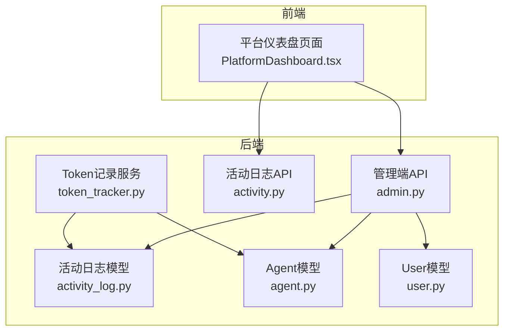
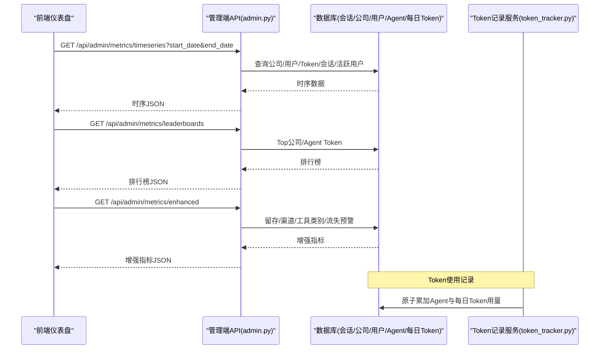
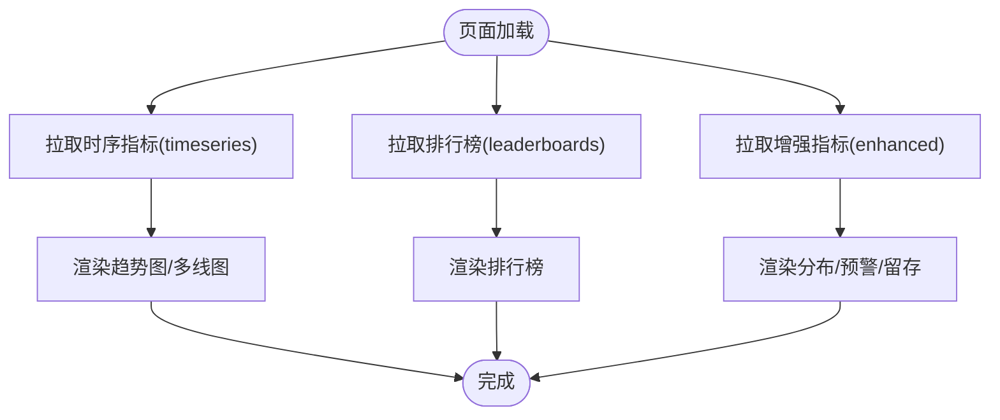
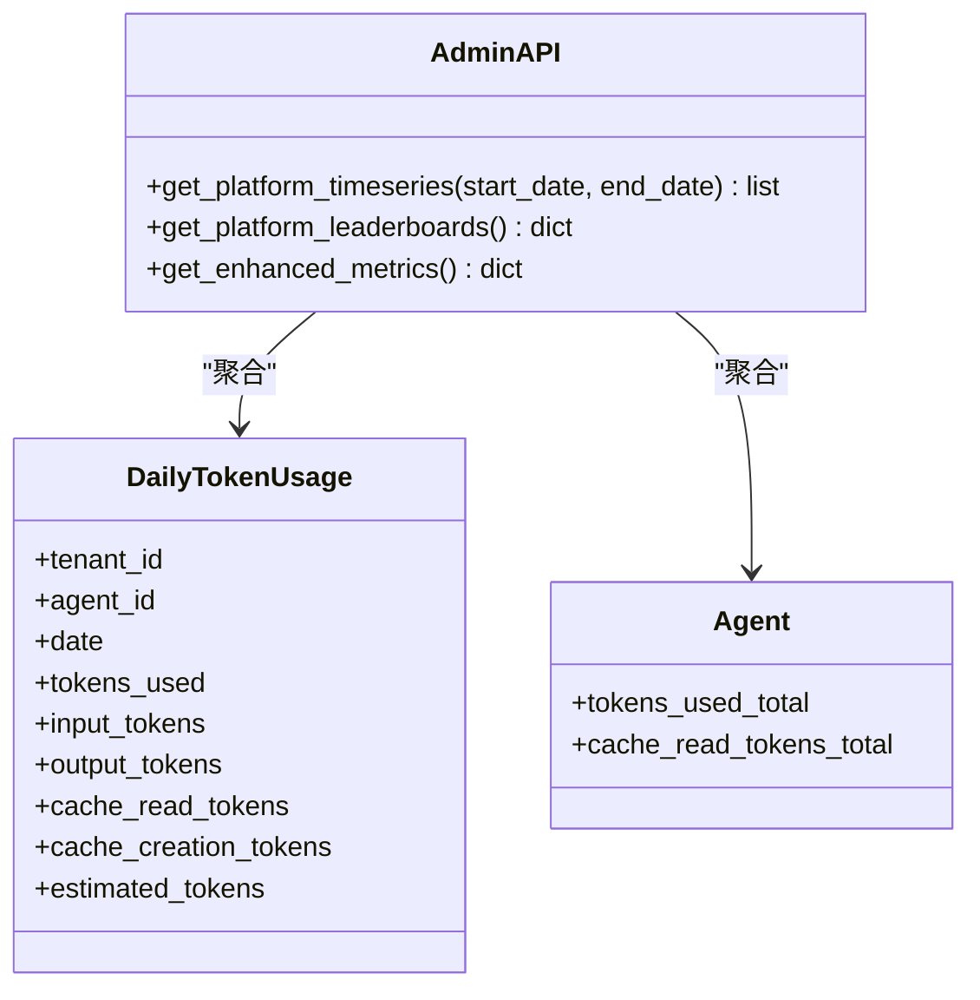
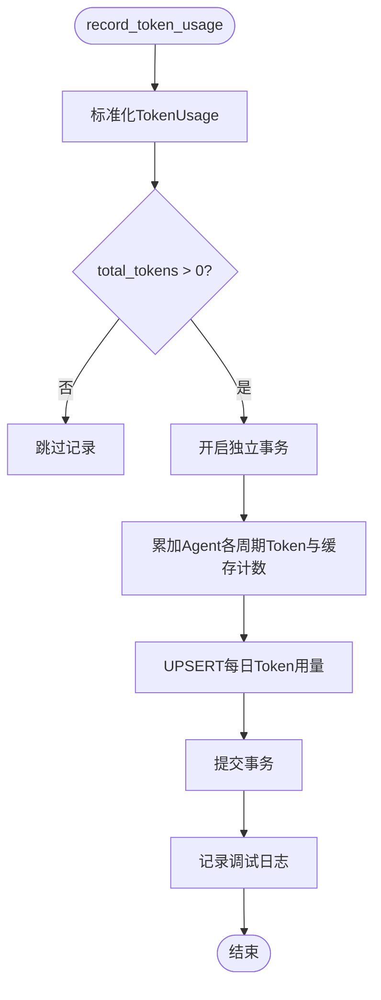
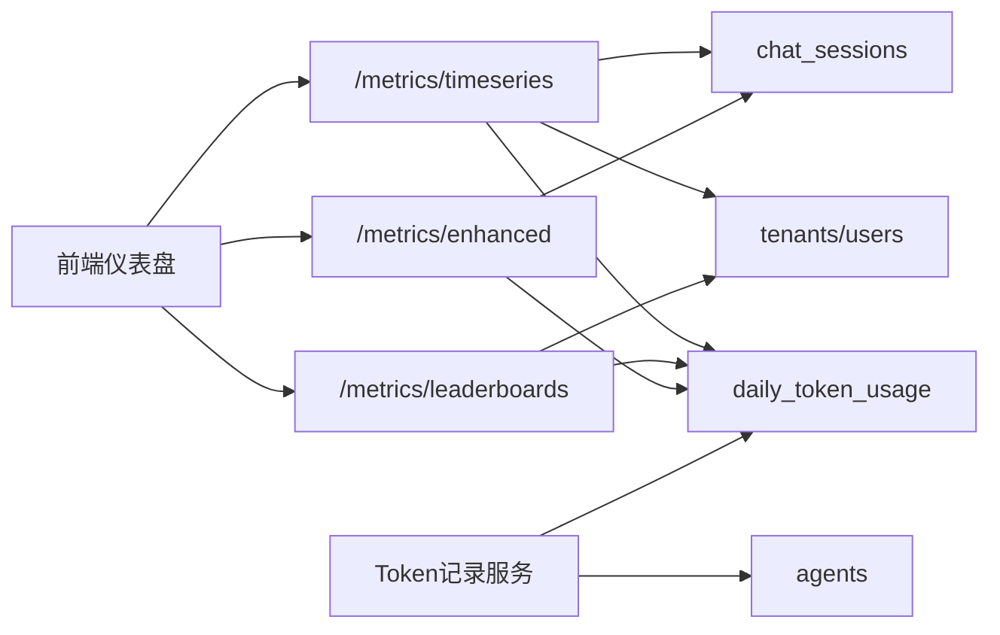

# 平台仪表盘

<cite>
**本文引用的文件**   
- [PlatformDashboard.tsx](file://frontend/src/pages/PlatformDashboard.tsx)
- [admin.py](file://backend/app/api/admin.py)
- [activity.py](file://backend/app/api/activity.py)
- [token_tracker.py](file://backend/app/services/token_tracker.py)
- [activity_log.py](file://backend/app/models/activity_log.py)
- [agent.py](file://backend/app/models/agent.py)
- [user.py](file://backend/app/models/user.py)
- [middleware.py](file://backend/app/core/middleware.py)
- [logging_config.py](file://backend/app/core/logging_config.py)
</cite>

## 目录
1. [简介](#简介)
2. [项目结构](#项目结构)
3. [核心组件](#核心组件)
4. [架构总览](#架构总览)
5. [详细组件分析](#详细组件分析)
6. [依赖关系分析](#依赖关系分析)
7. [性能考量](#性能考量)
8. [故障排查指南](#故障排查指南)
9. [结论](#结论)
10. [附录](#附录)

## 简介
本指南面向平台运营与运维人员，系统化说明“平台仪表盘”的监控能力与使用方法。内容覆盖关键指标（用户数、Agent数量、Token使用量、活跃度等）、实时数据展示、趋势分析、自定义报表与导出建议、告警配置思路、性能监控、错误追踪与健康检查，以及数据分析方法与运营决策支持实践。文档基于代码库中的前端页面与后端API、模型与服务实现进行梳理，确保可落地、可操作。

## 项目结构
平台仪表盘由前端页面与后端管理接口协同构成：
- 前端：平台仪表盘页面负责时间范围切换、指标卡片、折线图、饼图、排行榜与流失预警等可视化呈现。
- 后端：管理端API提供时序指标、排行榜、增强指标（留存、渠道分布、工具类别、流失预警）等；Token记录服务负责统一采集与聚合；活动日志与模型定义支撑查询与分析。

**图表来源** 
- [PlatformDashboard.tsx:127-182](file://frontend/src/pages/PlatformDashboard.tsx#L127-L182)
- [admin.py:217-381](file://backend/app/api/admin.py#L217-L381)
- [activity.py:17-45](file://backend/app/api/activity.py#L17-L45)
- [token_tracker.py:160-246](file://backend/app/services/token_tracker.py#L160-L246)
- [activity_log.py:35-56](file://backend/app/models/activity_log.py#L35-L56)
- [agent.py:83-96](file://backend/app/models/agent.py#L83-L96)
- [user.py:52-119](file://backend/app/models/user.py#L52-L119)

**章节来源**
- [PlatformDashboard.tsx:127-182](file://frontend/src/pages/PlatformDashboard.tsx#L127-L182)
- [admin.py:217-381](file://backend/app/api/admin.py#L217-L381)

## 核心组件
- 前端仪表盘页面：提供时间范围选择（近7天/30天），渲染累计与新增趋势、DAU/WAU/MAU多线趋势、渠道分布饼图、Top工具类别柱状图、公司/Agent Token排行榜、流失预警表等。
- 管理端API：
  - 时序指标：按日期返回公司、用户、Token、会话、DAU/WAU/MAU等累计与新增值。
  - 排行榜：Top 20公司与Agent按累计Token排序，附带缓存命中统计。
  - 增强指标：平均Token/会话、7日留存率、渠道分布、Top工具类别、流失预警。
- Token记录服务：统一从LLM响应中提取Token用量（含输入/输出、缓存读/创建、估算），并原子累加至Agent维度与每日聚合表。
- 活动日志与模型：记录Agent动作与每日Token用量，支撑趋势与排行计算。

**章节来源**
- [PlatformDashboard.tsx:127-182](file://frontend/src/pages/PlatformDashboard.tsx#L127-L182)
- [admin.py:217-381](file://backend/app/api/admin.py#L217-L381)
- [admin.py:384-433](file://backend/app/api/admin.py#L384-L433)
- [admin.py:436-582](file://backend/app/api/admin.py#L436-L582)
- [token_tracker.py:160-246](file://backend/app/services/token_tracker.py#L160-L246)
- [activity_log.py:35-56](file://backend/app/models/activity_log.py#L35-L56)

## 架构总览
下图展示了从前端到后端的请求链路，以及Token记录的写入路径。

**图表来源** 
- [PlatformDashboard.tsx:144-179](file://frontend/src/pages/PlatformDashboard.tsx#L144-L179)
- [admin.py:217-381](file://backend/app/api/admin.py#L217-L381)
- [admin.py:384-433](file://backend/app/api/admin.py#L384-L433)
- [admin.py:436-582](file://backend/app/api/admin.py#L436-L582)
- [token_tracker.py:160-246](file://backend/app/services/token_tracker.py#L160-L246)

## 详细组件分析

### 前端仪表盘（PlatformDashboard.tsx）
- 功能要点
  - 时间范围切换：近7天/30天，触发时序数据重新拉取。
  - 指标卡片：平均Token/会话、7日留存率。
  - 趋势图：公司、用户、Token、会话的累计与新增折线；DAU/WAU/MAU多线趋势。
  - 分布图：渠道分布饼图、Top工具类别柱状图。
  - 排行榜：Top 20公司与Agent，显示Token总量与缓存命中情况。
  - 流失预警：高消耗但长期未活跃的公司列表。
- 数据获取
  - 时序指标：GET /api/admin/metrics/timeseries
  - 排行榜：GET /api/admin/metrics/leaderboards
  - 增强指标：GET /api/admin/metrics/enhanced
- 交互与展示
  - 统一的Tooltip提示，数字格式化（K/M/B）。
  - 图表组件复用（折线、多线、饼图、柱状图）。

**图表来源** 
- [PlatformDashboard.tsx:144-182](file://frontend/src/pages/PlatformDashboard.tsx#L144-L182)
- [PlatformDashboard.tsx:442-561](file://frontend/src/pages/PlatformDashboard.tsx#L442-L561)

**章节来源**
- [PlatformDashboard.tsx:127-182](file://frontend/src/pages/PlatformDashboard.tsx#L127-L182)
- [PlatformDashboard.tsx:442-561](file://frontend/src/pages/PlatformDashboard.tsx#L442-L561)

### 管理端API（admin.py）
- 时序指标接口
  - 输入：start_date、end_date
  - 输出：按日期的累计与新增字段（公司、用户、Token、会话、DAU/WAU/MAU、缓存命中等）
  - 关键点：使用窗口函数高效计算WAU/MAU；累积求和生成累计序列。
- 排行榜接口
  - 输出：Top 20公司与Agent，包含Token总量与缓存命中比率。
- 增强指标接口
  - 输出：平均Token/会话（近30天）、7日留存率、渠道分布、Top工具类别、流失预警。
  - 关键点：SQL聚合与过滤条件（如高消耗且长时间不活跃）。

**图表来源** 
- [admin.py:217-381](file://backend/app/api/admin.py#L217-L381)
- [admin.py:384-433](file://backend/app/api/admin.py#L384-L433)
- [admin.py:436-582](file://backend/app/api/admin.py#L436-L582)
- [activity_log.py:35-56](file://backend/app/models/activity_log.py#L35-L56)
- [agent.py:83-96](file://backend/app/models/agent.py#L83-L96)

**章节来源**
- [admin.py:217-381](file://backend/app/api/admin.py#L217-L381)
- [admin.py:384-433](file://backend/app/api/admin.py#L384-L433)
- [admin.py:436-582](file://backend/app/api/admin.py#L436-L582)

### Token记录服务（token_tracker.py）
- 功能要点
  - 标准化提取Token用量：兼容OpenAI/Anthropic/Gemini等格式，支持缓存读/创建计数。
  - 原子更新：独立事务内对Agent维度与每日聚合表进行增量累加，避免干扰调用方事务。
  - 估算策略：当无法获取真实用量时，按字符数估算。
- 数据结构
  - TokenUsage：total/input/output/cache_read/cache_creation/estimated。
  - DailyTokenUsage：按日聚合，唯一约束保证UPSERT效率。

**图表来源** 
- [token_tracker.py:160-246](file://backend/app/services/token_tracker.py#L160-L246)
- [activity_log.py:35-56](file://backend/app/models/activity_log.py#L35-L56)

**章节来源**
- [token_tracker.py:160-246](file://backend/app/services/token_tracker.py#L160-L246)
- [activity_log.py:35-56](file://backend/app/models/activity_log.py#L35-L56)

### 活动日志API（activity.py）
- 功能要点
  - 获取Agent活动历史：最近N条动作记录（聊天回复、工具调用、消息发送、任务变更、错误等）。
  - 对话历史：按会话ID拉取消息列表，支持Web/飞书/Slack/Discord/Agent间对话。
- 适用场景
  - 审计与排障：定位某Agent在某时间段内的行为轨迹。
  - 运营分析：结合会话与消息统计，评估Agent活跃度与用户互动质量。

**章节来源**
- [activity.py:17-45](file://backend/app/api/activity.py#L17-L45)
- [activity.py:50-220](file://backend/app/api/activity.py#L50-L220)
- [activity.py:223-286](file://backend/app/api/activity.py#L223-L286)

### 模型与数据（activity_log.py、agent.py、user.py）
- DailyTokenUsage：按日聚合Token用量，支撑时序与排行。
- Agent：维护各周期Token与缓存计数、运行状态、上下文窗口、心跳等。
- User/Identity：租户成员与全局身份，用于活跃用户统计与权限控制。

**章节来源**
- [activity_log.py:35-56](file://backend/app/models/activity_log.py#L35-L56)
- [agent.py:83-96](file://backend/app/models/agent.py#L83-L96)
- [user.py:52-119](file://backend/app/models/user.py#L52-L119)

## 依赖关系分析
- 前端依赖后端三个管理端接口：timeseries、leaderboards、enhanced。
- 管理端API依赖数据库中的会话、公司、用户、Agent与每日Token用量表。
- Token记录服务依赖Agent与DailyTokenUsage模型，通过原子写入保障一致性。
- 活动日志API依赖ChatMessage与会话模型，用于对话历史与参与者信息。

**图表来源** 
- [PlatformDashboard.tsx:144-179](file://frontend/src/pages/PlatformDashboard.tsx#L144-L179)
- [admin.py:217-381](file://backend/app/api/admin.py#L217-L381)
- [admin.py:384-433](file://backend/app/api/admin.py#L384-L433)
- [admin.py:436-582](file://backend/app/api/admin.py#L436-L582)
- [token_tracker.py:160-246](file://backend/app/services/token_tracker.py#L160-L246)

**章节来源**
- [PlatformDashboard.tsx:144-179](file://frontend/src/pages/PlatformDashboard.tsx#L144-L179)
- [admin.py:217-381](file://backend/app/api/admin.py#L217-L381)

## 性能考量
- 查询优化
  - 时序接口使用窗口函数计算WAU/MAU，减少多次扫描。
  - 每日Token用量采用唯一约束UPSERT，避免重复插入开销。
- 写入隔离
  - Token记录服务使用独立事务，避免与调用方事务互相阻塞。
- 前端渲染
  - 图表组件按需渲染，限制最大点数，避免大数据集导致卡顿。
- 日志与追踪
  - 请求级Trace ID注入，便于跨层追踪与性能分析。

[本节为通用指导，无需特定文件引用]

## 故障排查指南
- 请求追踪
  - 中间件在请求头注入X-Trace-Id，并在响应中回传，便于日志关联。
- 日志规范
  - 统一使用loguru，支持trace_id上下文变量，后台任务可通过new_trace_id绑定上下文。
- 常见问题定位
  - 若时序数据缺失或异常，检查DailyTokenUsage写入是否成功、时间范围参数是否正确。
  - 若排行榜为空，确认Agent tokens_used_total与缓存计数是否正常累加。
  - 若活跃用户指标异常，核查会话created_at与user_id字段完整性。

**章节来源**
- [middleware.py:12-53](file://backend/app/core/middleware.py#L12-L53)
- [logging_config.py:28-47](file://backend/app/core/logging_config.py#L28-L47)
- [logging_config.py:61-79](file://backend/app/core/logging_config.py#L61-L79)

## 结论
平台仪表盘以清晰的前端可视化与稳健的后端API为核心，提供了全面的运营监控能力。通过标准化的Token记录、高效的时序聚合与丰富的增强指标，运营团队可以精准掌握用户增长、Agent活跃度、资源消耗与渠道分布，并据此制定优化策略与告警规则。建议在现有基础上扩展自定义报表与导出能力，完善告警体系，进一步提升平台的可观测性与可运营性。

[本节为总结性内容，无需特定文件引用]

## 附录

### 关键指标监控清单
- 用户数：累计注册、新增注册、DAU/WAU/MAU
- Agent数量：累计Agent、运行中Agent
- Token使用量：累计与新增、缓存命中比率、平均Token/会话
- 活跃度：会话数、渠道分布、工具类别Top10
- 健康度：7日留存率、流失预警（高消耗且长时间不活跃）

**章节来源**
- [admin.py:217-381](file://backend/app/api/admin.py#L217-L381)
- [admin.py:436-582](file://backend/app/api/admin.py#L436-L582)

### 实时数据展示与趋势分析
- 实时展示：前端定时刷新或WebSocket推送（当前实现为按需拉取）
- 趋势分析：累计与新增双轴折线、多线对比（DAU/WAU/MAU）
- 分布分析：渠道占比、工具类别热度

**章节来源**
- [PlatformDashboard.tsx:212-270](file://frontend/src/pages/PlatformDashboard.tsx#L212-L270)
- [PlatformDashboard.tsx:274-345](file://frontend/src/pages/PlatformDashboard.tsx#L274-L345)

### 自定义报表与数据导出建议
- 自定义报表
  - 基于timeseries与enhanced接口组合筛选维度（公司、Agent、渠道、工具类别）
  - 增加时间粒度（小时/周/月）与同比/环比计算
- 数据导出
  - 将接口结果转换为CSV/Excel，支持批量下载与定时任务
  - 敏感字段脱敏，遵循数据安全规范

[本节为通用指导，无需特定文件引用]

### 告警配置思路
- 阈值告警
  - Token用量突增、缓存命中率骤降、DAU/WAU/MAU断崖式下跌
- 流失告警
  - 高消耗公司超过阈值且长时间无活跃
- 健康检查
  - 每日Token写入失败、会话写入延迟、Agent心跳超时

[本节为通用指导，无需特定文件引用]

### 性能监控与错误追踪
- 性能监控
  - 接口耗时、数据库慢查询、外部依赖超时
- 错误追踪
  - Trace ID贯穿全链路，集中收集错误日志与堆栈
- 系统健康检查
  - 数据库连接、缓存可用性、外部API可达性

**章节来源**
- [middleware.py:12-53](file://backend/app/core/middleware.py#L12-L53)
- [logging_config.py:61-79](file://backend/app/core/logging_config.py#L61-L79)

### 数据分析方法与运营决策支持
- 分析方法
  - 趋势分析：观察增长曲线与拐点
  - 细分分析：按公司、Agent、渠道、工具类别拆解
  - 留存分析：7日留存率与流失预警联动
- 决策支持
  - 资源扩容：根据Token用量峰值规划容量
  - 产品优化：热门渠道与工具类别优先投入
  - 风险控制：异常波动及时干预

[本节为通用指导，无需特定文件引用]