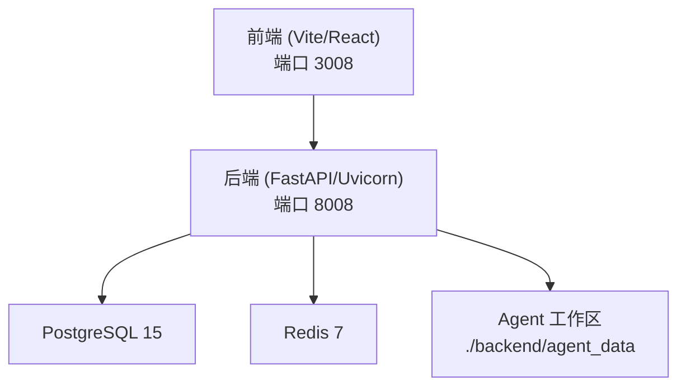

# 快速开始

<cite>
**本文引用的文件**   
- [README.md](file://README.md)
- [setup.sh](file://setup.sh)
- [restart.sh](file://restart.sh)
- [docker-compose.yml](file://docker-compose.yml)
- [deploy/docker-compose.yml](file://deploy/docker-compose.yml)
- [backend/pyproject.toml](file://backend/pyproject.toml)
- [frontend/package.json](file://frontend/package.json)
- [backend/app/config.py](file://backend/app/config.py)
- [backend/entrypoint.sh](file://backend/entrypoint.sh)
- [backend/seed.py](file://backend/seed.py)
- [frontend/src/pages/Login.tsx](file://frontend/src/pages/Login.tsx)
</cite>

## 目录
1. [简介](#简介)
2. [环境要求](#环境要求)
3. [安装与部署](#安装与部署)
4. [初始配置](#初始配置)
5. [首次登录流程](#首次登录流程)
6. [常见问题与故障排除](#常见问题与故障排除)
7. [架构概览](#架构概览)
8. [性能与容量建议](#性能与容量建议)
9. [结论](#结论)

## 简介
本指南面向新用户，帮助你在最短时间内完成 Clawith 平台的本地或容器化部署，完成基础配置并成功登录。平台支持两种主流方式：
- 使用 setup.sh 脚本一键初始化（推荐用于开发与体验）
- 使用 Docker Compose 容器化部署（推荐用于生产与团队协作）

Clawith 不依赖本地大模型推理，所有 LLM 调用通过外部 API 完成；本地仅运行 Web 应用与基础设施服务。

## 环境要求
- Python 3.11+（后端依赖声明为 >=3.11；setup.sh 会校验 Python 版本）
- Node.js 20+（前端开发服务器需要）
- PostgreSQL 15+（也可用 SQLite 做快速测试，但推荐 PostgreSQL）
- Redis 7+（容器化部署默认提供）
- 最低硬件参考：2 核 CPU / 4 GB RAM / 30 GB 磁盘（个人试用可更低）
- 网络需能访问外部 LLM API 端点

说明：
- README 中列出的“Python 3.12+、Node.js 20+、PostgreSQL 15+”是官方推荐；pyproject.toml 要求 Python >=3.11；setup.sh 会强制检查 Python 版本并给出升级指引。
- Docker 模式会自动拉起 PostgreSQL 15 与 Redis 7 镜像。

章节来源
- [README.md:70-90](file://README.md#L70-L90)
- [backend/pyproject.toml:1-10](file://backend/pyproject.toml#L1-L10)
- [setup.sh:29-48](file://setup.sh#L29-L48)
- [docker-compose.yml:2-30](file://docker-compose.yml#L2-L30)

## 安装与部署
### 方式一：使用 setup.sh 脚本（源码模式）
适用场景：本地开发、快速体验、最小化依赖。

步骤：
1. 克隆仓库并进入项目根目录
2. 执行安装脚本
   - 生产模式：bash setup.sh
   - 开发模式：bash setup.sh --dev
3. 启动应用
   - bash restart.sh
   - 前端默认端口：3008
   - 后端默认端口：8008

脚本自动完成：
- 生成 .env（若不存在）
- 检测或自动安装/启动 PostgreSQL（优先复用已有实例，否则尝试系统包管理器或本地 initdb）
- 创建数据库与角色（clawith/clawith）
- 安装后端依赖（Python venv + pip）
- 安装前端依赖（npm）
- 执行数据库迁移与种子数据（默认公司、模板、技能等）

注意：
- 如需指定外部 PostgreSQL，请先在 .env 中设置 DATABASE_URL，再运行 setup.sh。
- 首次注册的用户将自动成为平台管理员。

章节来源
- [README.md:90-118](file://README.md#L90-L118)
- [setup.sh:66-110](file://setup.sh#L66-L110)
- [setup.sh:117-179](file://setup.sh#L117-L179)
- [setup.sh:181-345](file://setup.sh#L181-L345)
- [setup.sh:347-361](file://setup.sh#L347-L361)
- [setup.sh:362-441](file://setup.sh#L362-L441)
- [restart.sh:19-24](file://restart.sh#L19-L24)
- [restart.sh:224-259](file://restart.sh#L224-L259)

### 方式二：Docker Compose 部署
适用场景：生产环境、团队共享、隔离性强。

步骤：
1. 克隆仓库并复制环境变量示例
   - git clone ... && cd Clawith
   - cp .env.example .env
2. 启动服务
   - docker compose up -d
3. 访问地址
   - 前端：http://localhost:3008
   - 后端：http://localhost:8008（内部通信）

说明：
- 容器编排包含 PostgreSQL 15、Redis 7、后端与前端服务。
- Agent 工作区数据持久化到 ./backend/agent_data（宿主路径），便于直接查看与备份。
- 更新部署：git pull 后重新 docker compose up -d --build。

章节来源
- [README.md:119-136](file://README.md#L119-L136)
- [docker-compose.yml:1-115](file://docker-compose.yml#L1-L115)
- [deploy/docker-compose.yml:1-111](file://deploy/docker-compose.yml#L1-L111)

## 初始配置
关键环境变量（部分常用项）：
- DATABASE_URL：数据库连接串（PostgreSQL）
- REDIS_URL：Redis 连接串
- SECRET_KEY、JWT_SECRET_KEY：安全密钥（生产务必修改）
- PUBLIC_BASE_URL：对外域名（用于密码重置链接、OAuth 回调等）
- STORAGE_BACKEND、STORAGE_LOCAL_ROOT：存储后端与本地根目录
- AGENT_DATA_DIR：Agent 工作区目录
- CORS_ORIGINS：允许的前端源
- PASSWORD_RESET_TOKEN_EXPIRE_MINUTES：密码重置令牌有效期（分钟）

配置位置：
- 源码模式：项目根目录 .env
- Docker 模式：docker-compose.yml 的 environment 字段或宿主机 .env

注意事项：
- 首次注册的用户自动成为平台管理员。
- 若使用反向代理（Nginx/Cloudflare），请正确设置 PUBLIC_BASE_URL。
- 可通过 Web 界面“管理员 -> 平台设置”配置系统邮件（SMTP）。

章节来源
- [backend/app/config.py:89-120](file://backend/app/config.py#L89-L120)
- [backend/app/config.py:168-176](file://backend/app/config.py#L168-L176)
- [backend/app/config.py:236-241](file://backend/app/config.py#L236-L241)
- [docker-compose.yml:40-68](file://docker-compose.yml#L40-L68)
- [README.md:164-179](file://README.md#L164-L179)

## 首次登录流程
- 打开前端地址 http://localhost:3008
- 点击“注册”，填写邮箱与密码完成注册
- 第一个注册用户自动成为平台管理员
- 登录后如未绑定公司，将引导完成公司设置
- 支持邮箱验证码验证、邀请码加入、SSO/OAuth（取决于配置）

章节来源
- [README.md:164-166](file://README.md#L164-L166)
- [frontend/src/pages/Login.tsx:224-246](file://frontend/src/pages/Login.tsx#L224-L246)
- [frontend/src/pages/Login.tsx:256-307](file://frontend/src/pages/Login.tsx#L256-L307)

## 常见问题与故障排除
- Python 版本过低
  - 现象：setup.sh 报错提示需要 Python >= 3.12
  - 解决：安装 Python 3.12+ 或通过 PYTHON_BIN 指定二进制路径
- PostgreSQL 无法连接或端口占用
  - 现象：seed 失败、迁移失败、重启脚本报端口占用
  - 解决：确认 pg_isready 可用；检查端口冲突；按提示配置 pg_hba.conf 或使用外部数据库
- 前端无法访问或代理不可用
  - 现象：浏览器打不开或健康检查失败
  - 解决：确认前端端口 3008 已监听；检查 reverse proxy 配置；查看日志 tail -f backend/log/backend.log 与 frontend/log/frontend.log
- Docker 拉取镜像超时（国内用户）
  - 现象：docker compose up -d 卡住或超时
  - 解决：配置 Docker 镜像加速源后重试；必要时设置 PyPI 镜像加速后端依赖构建
- 密码重置邮件无法发送
  - 现象：忘记密码流程无邮件
  - 解决：在“管理员 -> 平台设置”中配置 SMTP；确保 PUBLIC_BASE_URL 指向公网域名

章节来源
- [setup.sh:29-48](file://setup.sh#L29-L48)
- [setup.sh:117-179](file://setup.sh#L117-L179)
- [setup.sh:347-361](file://setup.sh#L347-L361)
- [setup.sh:423-441](file://setup.sh#L423-L441)
- [restart.sh:99-110](file://restart.sh#L99-L110)
- [restart.sh:264-273](file://restart.sh#L264-L273)
- [README.md:193-202](file://README.md#L193-L202)
- [README.md:168-186](file://README.md#L168-L186)

## 架构概览
下图展示了源码模式下的核心组件与交互关系：

图表来源
- [restart.sh:19-24](file://restart.sh#L19-L24)
- [docker-compose.yml:2-30](file://docker-compose.yml#L2-L30)
- [docker-compose.yml:32-86](file://docker-compose.yml#L32-L86)

## 性能与容量建议
- 个人试用/演示：1 核 CPU / 2 GB RAM / 20 GB 磁盘，可使用 SQLite，跳过 Agent 容器
- 完整体验（1–2 个 Agent）：2 核 / 4 GB / 30 GB（推荐起步）
- 小团队（3–5 个 Agent）：2–4 核 / 4–8 GB / 50 GB，建议使用 PostgreSQL
- 生产环境：4+ 核 / 8+ GB / 50+ GB，多租户与高并发场景

章节来源
- [README.md:82-89](file://README.md#L82-L89)

## 结论
按照本指南完成环境准备、安装部署与初始配置后，即可通过浏览器访问平台并完成首次登录。后续可在“管理员 -> 平台设置”中完善邮件、CORS、存储等配置，逐步启用更多企业级能力。