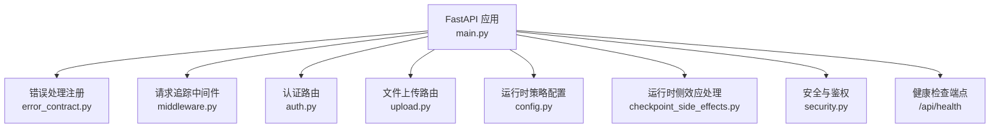
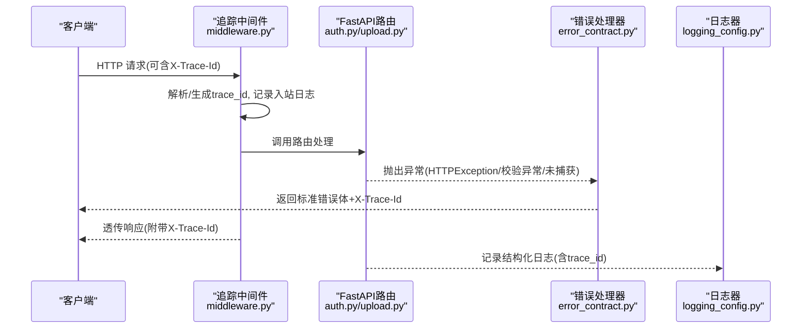
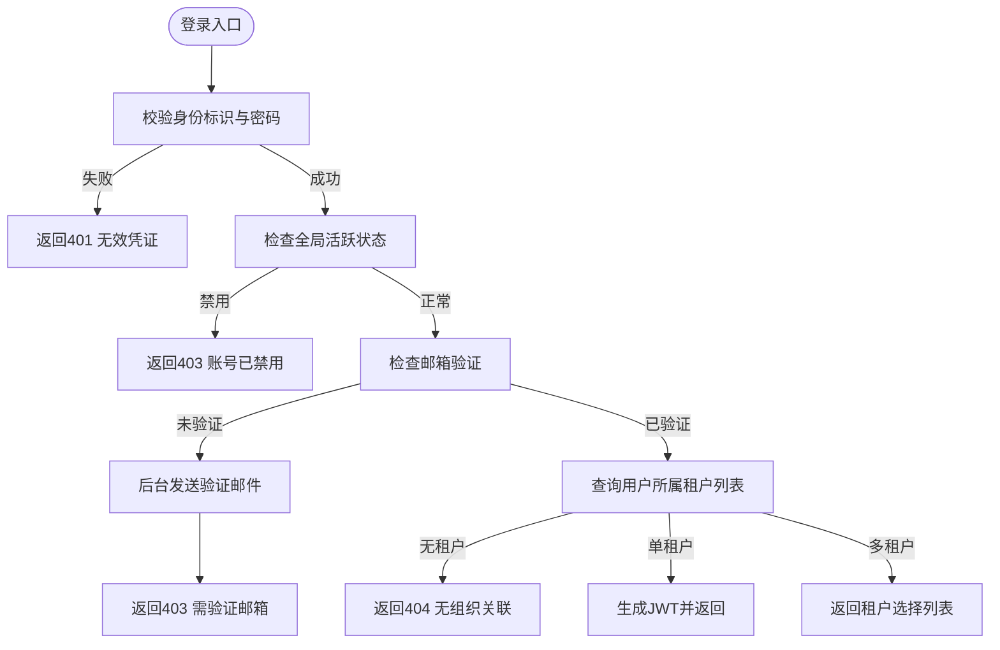
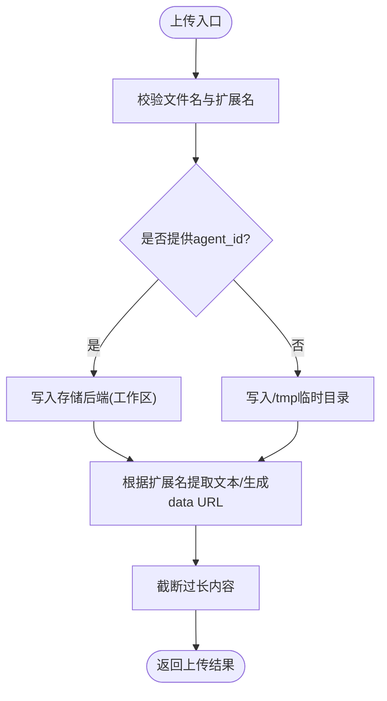
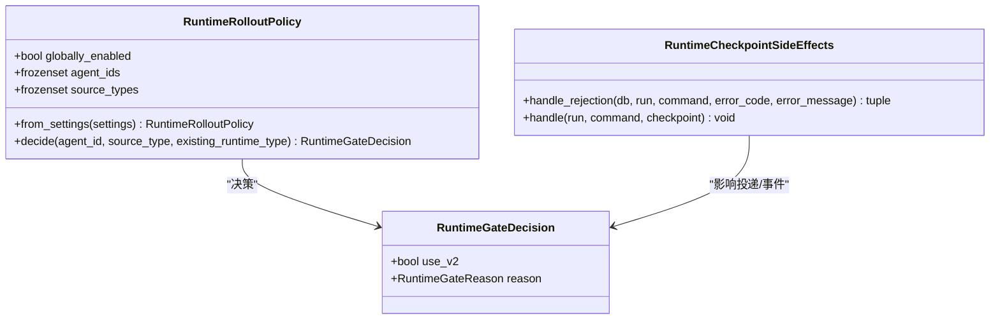
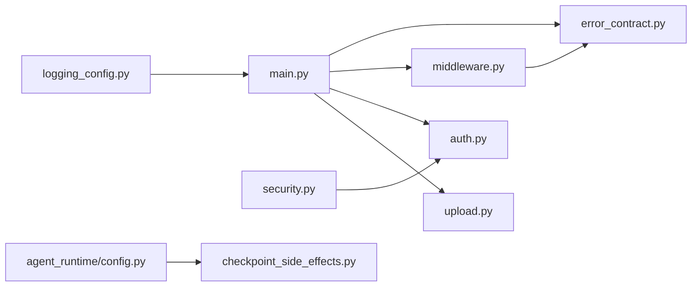

# 故障排除

<cite>
**本文引用的文件**   
- [backend/app/core/error_contract.py](file://backend/app/core/error_contract.py)
- [backend/app/core/logging_config.py](file://backend/app/core/logging_config.py)
- [backend/app/core/middleware.py](file://backend/app/core/middleware.py)
- [backend/app/api/auth.py](file://backend/app/api/auth.py)
- [backend/app/api/upload.py](file://backend/app/api/upload.py)
- [backend/app/services/agent_runtime/config.py](file://backend/app/services/agent_runtime/config.py)
- [backend/app/services/agent_runtime/checkpoint_side_effects.py](file://backend/app/services/agent_runtime/checkpoint_side_effects.py)
- [backend/app/core/security.py](file://backend/app/core/security.py)
- [backend/app/main.py](file://backend/app/main.py)
</cite>

## 目录
1. [简介](#简介)
2. [项目结构](#项目结构)
3. [核心组件](#核心组件)
4. [架构总览](#架构总览)
5. [详细组件分析](#详细组件分析)
6. [依赖关系分析](#依赖关系分析)
7. [性能注意事项](#性能注意事项)
8. [故障排除指南](#故障排除指南)
9. [结论](#结论)
10. [附录](#附录)

## 简介
本指南面向运维与开发人员，提供系统级故障排查方法、错误信息解读、日志查看与分析技巧，以及常见场景（登录失败、Agent运行异常、文件上传错误、API调用失败等）的解决方案。同时涵盖调试工具使用、性能监控指标、健康检查与系统自检、问题反馈与支持渠道。

## 项目结构
后端采用 FastAPI 应用，统一通过中间件注入追踪ID，集中式错误处理返回标准化错误体；认证、权限、JWT在安全模块实现；日志由 loguru 统一配置并输出带 trace_id 的结构化日志；启动流程负责初始化数据库、后台任务、运行时工作进程与健康端点。

图表来源
- [backend/app/main.py:352-376](file://backend/app/main.py#L352-L376)
- [backend/app/core/error_contract.py:224-229](file://backend/app/core/error_contract.py#L224-L229)
- [backend/app/core/middleware.py:12-53](file://backend/app/core/middleware.py#L12-L53)
- [backend/app/api/auth.py:43-43](file://backend/app/api/auth.py#L43-L43)
- [backend/app/api/upload.py:14-14](file://backend/app/api/upload.py#L14-L14)
- [backend/app/services/agent_runtime/config.py:88-97](file://backend/app/services/agent_runtime/config.py#L88-L97)
- [backend/app/services/agent_runtime/checkpoint_side_effects.py:554-567](file://backend/app/services/agent_runtime/checkpoint_side_effects.py#L554-L567)
- [backend/app/core/security.py:128-151](file://backend/app/core/security.py#L128-L151)

章节来源
- [backend/app/main.py:352-476](file://backend/app/main.py#L352-L476)

## 核心组件
- 统一错误响应：所有HTTP异常、校验异常、未捕获异常均被拦截，返回包含 code、message、trace_id、可选 run_id/agent_id/stage/details/retryable 的标准错误体，并在响应头中回写 X-Trace-Id。
- 结构化日志：loguru 配置输出带 trace_id 的日志，自动抑制高频连接日志，并将标准库日志重定向到 loguru。
- 请求追踪：中间件从请求头读取或生成 trace_id，写入 request.state 和响应头，记录请求/响应耗时。
- 认证与权限：JWT签发与解码、密码哈希/验证、角色检查、当前用户获取。
- 文件上传：支持文本/办公/图片类型，按 agent_id 落盘至工作区或临时目录，提取文本内容并返回。
- Agent运行时：基于配置的灰度策略决定 v2 运行时，持久化检查点与生命周期事件，投递终端消息。

章节来源
- [backend/app/core/error_contract.py:57-111](file://backend/app/core/error_contract.py#L57-L111)
- [backend/app/core/logging_config.py:61-79](file://backend/app/core/logging_config.py#L61-L79)
- [backend/app/core/middleware.py:15-52](file://backend/app/core/middleware.py#L15-L52)
- [backend/app/core/security.py:128-151](file://backend/app/core/security.py#L128-L151)
- [backend/app/api/upload.py:108-175](file://backend/app/api/upload.py#L108-L175)
- [backend/app/services/agent_runtime/config.py:88-147](file://backend/app/services/agent_runtime/config.py#L88-L147)
- [backend/app/services/agent_runtime/checkpoint_side_effects.py:554-567](file://backend/app/services/agent_runtime/checkpoint_side_effects.py#L554-L567)

## 架构总览
下图展示一次典型 API 请求的生命周期：中间件注入 trace_id → 路由处理 → 业务逻辑 → 错误处理 → 响应回写 trace_id。

图表来源
- [backend/app/core/middleware.py:15-52](file://backend/app/core/middleware.py#L15-L52)
- [backend/app/core/error_contract.py:158-181](file://backend/app/core/error_contract.py#L158-L181)
- [backend/app/core/logging_config.py:61-79](file://backend/app/core/logging_config.py#L61-L79)

## 详细组件分析

### 认证与登录流程
- 登录接口校验身份标识与密码，处理多租户选择、邮箱验证状态、首次用户自动激活等分支。
- 失败路径包括：凭证无效、账号禁用、未验证邮箱、无组织关联、跨租户访问拒绝等。
- 成功路径生成 JWT 并返回用户与租户信息。

图表来源
- [backend/app/api/auth.py:422-542](file://backend/app/api/auth.py#L422-L542)

章节来源
- [backend/app/api/auth.py:422-542](file://backend/app/api/auth.py#L422-L542)
- [backend/app/core/security.py:128-151](file://backend/app/core/security.py#L128-L151)

### 文件上传流程
- 接收文件与可选 agent_id，确定保存位置（工作区/uploads 或 /tmp）。
- 对图片进行 base64 data URL 生成，对文本/办公文档尝试提取文本内容。
- 返回文件名、大小、提取文本、是否图片及 data URL 等信息。

图表来源
- [backend/app/api/upload.py:108-175](file://backend/app/api/upload.py#L108-L175)

章节来源
- [backend/app/api/upload.py:108-175](file://backend/app/api/upload.py#L108-L175)

### Agent运行时策略与侧效应
- 运行时策略依据全局开关、Agent白名单、来源类型决定使用 v2 运行时。
- 检查点侧效应将已提交的 Graph 控制边界投影为幂等的事件与交付请求，确保最终一致性。

图表来源
- [backend/app/services/agent_runtime/config.py:88-147](file://backend/app/services/agent_runtime/config.py#L88-L147)
- [backend/app/services/agent_runtime/checkpoint_side_effects.py:554-567](file://backend/app/services/agent_runtime/checkpoint_side_effects.py#L554-L567)

章节来源
- [backend/app/services/agent_runtime/config.py:88-147](file://backend/app/services/agent_runtime/config.py#L88-L147)
- [backend/app/services/agent_runtime/checkpoint_side_effects.py:554-567](file://backend/app/services/agent_runtime/checkpoint_side_effects.py#L554-L567)

## 依赖关系分析
- main.py 在启动时注册错误处理器、中间件、CORS、路由与健康端点。
- middleware.py 依赖 error_contract.normalize_trace_id 以规范化 trace_id。
- logging_config.py 提供 get/set/new trace_id 能力，供各模块记录结构化日志。
- security.py 提供 JWT 与密码相关能力，被 auth.py 等路由依赖。
- upload.py 依赖 storage 服务与用户鉴权依赖。
- agent_runtime 模块依赖 Settings 与数据库会话工厂。

图表来源
- [backend/app/main.py:352-476](file://backend/app/main.py#L352-L476)
- [backend/app/core/middleware.py:15-52](file://backend/app/core/middleware.py#L15-L52)
- [backend/app/core/logging_config.py:61-79](file://backend/app/core/logging_config.py#L61-L79)
- [backend/app/core/security.py:128-151](file://backend/app/core/security.py#L128-L151)
- [backend/app/services/agent_runtime/config.py:88-147](file://backend/app/services/agent_runtime/config.py#L88-L147)
- [backend/app/services/agent_runtime/checkpoint_side_effects.py:554-567](file://backend/app/services/agent_runtime/checkpoint_side_effects.py#L554-L567)

章节来源
- [backend/app/main.py:352-476](file://backend/app/main.py#L352-L476)

## 性能注意事项
- bcrypt 操作使用线程池避免阻塞事件循环，提升并发性能。
- 日志输出启用 enqueue 异步队列，减少主线程开销。
- 上传时对大图片限制大小，文本内容截断以避免过大负载。
- 运行时策略与检查点侧效应保证幂等性与最小化重复计算。

章节来源
- [backend/app/core/security.py:28-51](file://backend/app/core/security.py#L28-L51)
- [backend/app/core/logging_config.py:61-79](file://backend/app/core/logging_config.py#L61-L79)
- [backend/app/api/upload.py:147-165](file://backend/app/api/upload.py#L147-L165)

## 故障排除指南

### 通用诊断步骤
- 收集 trace_id：从请求头 X-Trace-Id 或响应头 X-Trace-Id 获取，用于全链路日志检索。
- 查看结构化日志：关注包含 trace_id 的日志行，定位请求起止时间与错误堆栈。
- 检查健康端点：访问 /api/health 确认服务可用与版本信息。
- 审查错误体：标准错误体包含 code、message、trace_id、可选字段，便于快速分类与重试判断。

章节来源
- [backend/app/core/middleware.py:15-52](file://backend/app/core/middleware.py#L15-L52)
- [backend/app/core/error_contract.py:57-111](file://backend/app/core/error_contract.py#L57-L111)
- [backend/app/main.py:473-476](file://backend/app/main.py#L473-L476)

### 登录失败
常见问题与解决：
- 凭证无效：检查用户名/邮箱/手机号与密码是否正确，确认 identity.password_hash 存在且匹配。
- 账号禁用：检查 identity.is_active 与 tenant.is_active。
- 邮箱未验证：若未配置 SMTP，系统会自动标记验证并通过；否则需完成邮箱验证流程。
- 无组织关联：确认用户至少属于一个租户。
- 多租户选择：当用户属于多个租户时需选择目标租户。

定位要点：
- 查看登录接口的日志与错误码，确认失败分支。
- 检查 JWT 生成与解码是否正常。

章节来源
- [backend/app/api/auth.py:422-542](file://backend/app/api/auth.py#L422-L542)
- [backend/app/core/security.py:128-151](file://backend/app/core/security.py#L128-L151)

### Agent运行异常
常见问题与解决：
- 运行时策略不生效：检查 AGENT_RUNTIME_V2_ENABLED、AGENT_RUNTIME_V2_AGENT_IDS、AGENT_RUNTIME_V2_SOURCE_TYPES 配置。
- 检查点侧效应失败：确认命令与作用域一致、checkpoint_id 有效、lifecycle 状态合法。
- 终端消息投递失败：检查 delivery_status 与投递通道可用性。

定位要点：
- 查看运行时策略决策日志与错误码。
- 检查 AgentRunEvent 事件与 checkpoint 状态。

章节来源
- [backend/app/services/agent_runtime/config.py:88-147](file://backend/app/services/agent_runtime/config.py#L88-L147)
- [backend/app/services/agent_runtime/checkpoint_side_effects.py:554-567](file://backend/app/services/agent_runtime/checkpoint_side_effects.py#L554-L567)

### 文件上传错误
常见问题与解决：
- 不支持的文件格式：确认扩展名是否在 TEXT/OFFICE/IMAGE 集合内。
- 图片过大：超过限制将被拒绝。
- 文本提取失败：某些格式需要外部依赖（如 PyPDF2、python-docx、openpyxl），安装缺失依赖或降级处理。
- 工作区写入失败：检查存储后端配置与权限。

定位要点：
- 查看上传接口的错误信息与日志。
- 确认保存路径与 content_type 设置。

章节来源
- [backend/app/api/upload.py:108-175](file://backend/app/api/upload.py#L108-L175)

### API调用失败
常见问题与解决：
- 校验失败：检查请求体结构与参数类型，参考 422 错误详情。
- 权限不足：确认用户角色与所需角色匹配。
- 内部错误：查看未捕获异常日志，定位具体原因。

定位要点：
- 使用 X-Trace-Id 检索完整请求链路日志。
- 检查错误体中的 code 与 message。

章节来源
- [backend/app/core/error_contract.py:184-202](file://backend/app/core/error_contract.py#L184-L202)
- [backend/app/core/error_contract.py:205-221](file://backend/app/core/error_contract.py#L205-L221)
- [backend/app/core/security.py:199-227](file://backend/app/core/security.py#L199-L227)

### 调试工具与技巧
- 使用 curl 或 Postman 添加 X-Trace-Id 头，便于追踪。
- 在浏览器开发者工具的 Network 面板查看响应头 X-Trace-Id。
- 过滤日志关键字：[startup]、[LOGIN]、[REGISTER_INIT]、[RuntimeFailure] 等。
- 本地运行开启 DEBUG 级别日志，观察详细堆栈。

章节来源
- [backend/app/core/middleware.py:15-52](file://backend/app/core/middleware.py#L15-L52)
- [backend/app/core/logging_config.py:61-79](file://backend/app/core/logging_config.py#L61-L79)

### 性能监控指标
- 请求耗时：中间件记录请求起止时间，统计 P50/P95/P99。
- 错误率：统计 4xx/5xx 比例，重点关注 internal_error。
- 资源占用：bcrypt 线程池大小、日志队列长度、数据库连接池。
- 运行时吞吐：Agent Run 数量、检查点提交频率、投递成功率。

章节来源
- [backend/app/core/middleware.py:22-52](file://backend/app/core/middleware.py#L22-L52)
- [backend/app/core/security.py:28-51](file://backend/app/core/security.py#L28-L51)

### 系统健康检查
- 健康端点：GET /api/health 返回 status 与 version。
- 版本端点：GET /api/version 返回版本与 commit 信息。
- 启动诊断：查看 startup 日志，确认数据库、后台任务、运行时工作进程启动状态。

章节来源
- [backend/app/main.py:473-513](file://backend/app/main.py#L473-L513)

### 问题反馈与支持
- 收集信息：trace_id、请求URL、错误体、关键日志片段、环境配置（脱敏）。
- 提交渠道：通过 GitHub Issues 或企业支持工单，附上上述信息以便快速复现与定位。
- 社区资源：查阅仓库 README 与贡献指南，了解部署与排错最佳实践。

## 结论
通过统一的错误响应、结构化日志与请求追踪，结合健康检查与性能监控，可以快速定位与解决登录、Agent运行、文件上传与API调用等常见问题。建议在生产环境中严格配置 trace_id、监控关键指标，并建立标准化的问题反馈流程以提升排障效率。

## 附录
- 常用命令示例（curl）：
  - 健康检查：curl -i http://localhost:端口/api/health
  - 登录：curl -X POST -H "Content-Type: application/json" -d '{"login_identifier":"...","password":"..."}' http://localhost:端口/api/auth/login
  - 上传：curl -F "file=@/path/to/file" -F "agent_id=..." http://localhost:端口/api/chat/upload
- 日志关键字：
  - [startup]、[LOGIN]、[REGISTER_INIT]、[RuntimeFailure]、[Proxy]、[Background task]