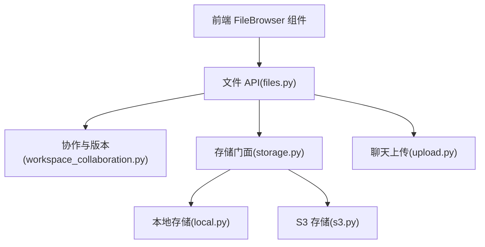
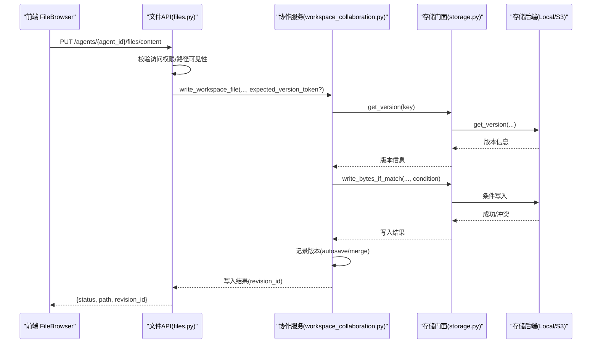
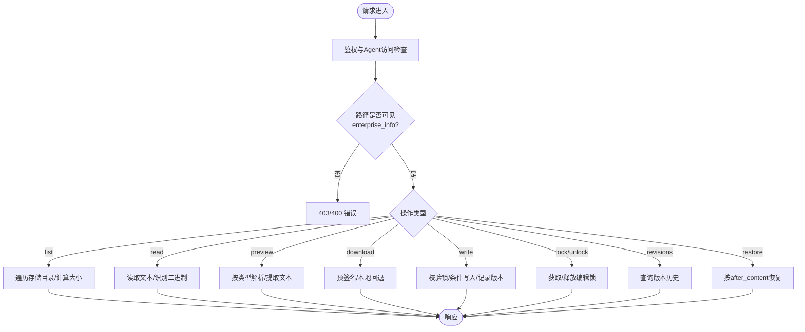
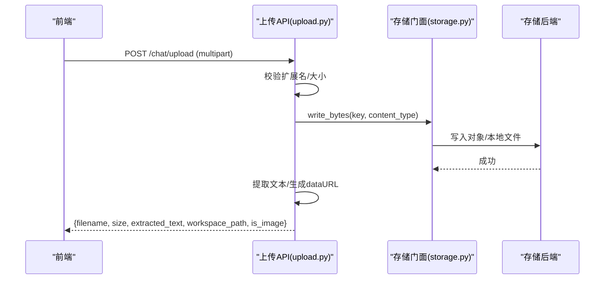
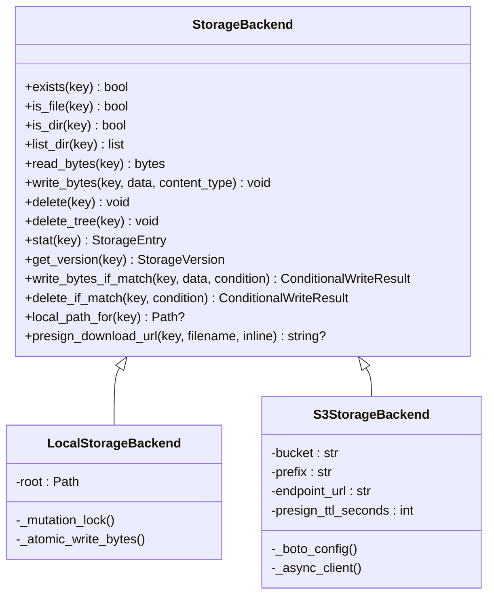
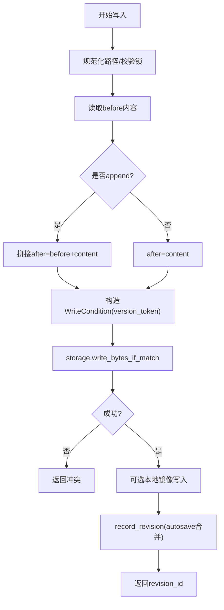
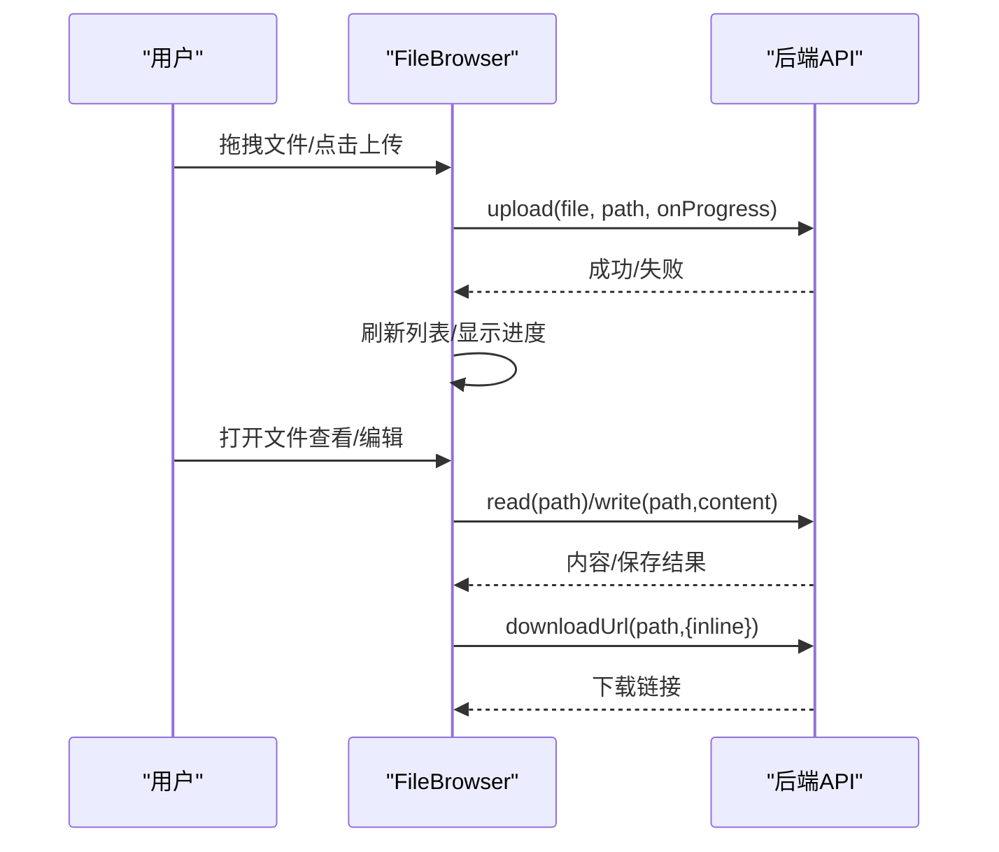
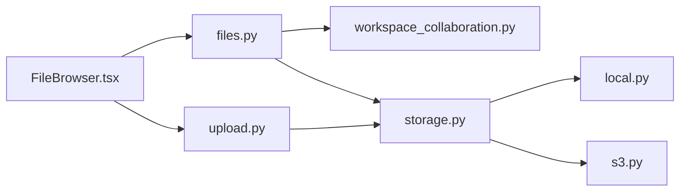

# 文件操作

<cite>
**本文引用的文件**   
- [backend/app/api/files.py](file://backend/app/api/files.py)
- [backend/app/api/upload.py](file://backend/app/api/upload.py)
- [frontend/src/components/FileBrowser.tsx](file://frontend/src/components/FileBrowser.tsx)
- [frontend/src/utils/workspaceFileFormats.ts](file://frontend/src/utils/workspaceFileFormats.ts)
- [backend/app/services/storage.py](file://backend/app/services/storage.py)
- [backend/app/services/storage_runtime/__init__.py](file://backend/app/services/storage_runtime/__init__.py)
- [backend/app/services/storage_runtime/local.py](file://backend/app/services/storage_runtime/local.py)
- [backend/app/services/storage_runtime/s3.py](file://backend/app/services/storage_runtime/s3.py)
- [backend/app/services/workspace_collaboration.py](file://backend/app/services/workspace_collaboration.py)
</cite>

## 目录
1. [简介](#简介)
2. [项目结构](#项目结构)
3. [核心组件](#核心组件)
4. [架构总览](#架构总览)
5. [详细组件分析](#详细组件分析)
6. [依赖关系分析](#依赖关系分析)
7. [性能与容量限制](#性能与容量限制)
8. [故障排查指南](#故障排查指南)
9. [结论](#结论)
10. [附录：最佳实践与快捷键](#附录最佳实践与快捷键)

## 简介
本指南面向使用“文件操作”功能的用户与开发者，覆盖以下能力：
- 文件上传、下载、在线预览与编辑
- 版本管理与恢复
- 团队协作中的权限控制、编辑锁、冲突处理
- 存储策略（本地/对象存储）与配置要点
- 文件格式支持、大小限制与批量操作技巧
- 快捷键与高效工作流

## 项目结构
后端提供统一的文件 API（列出、读取、写入、删除、预览、下载、版本历史、恢复），前端通过通用 FileBrowser 组件实现统一交互。存储层抽象为本地文件系统与 S3 兼容对象存储两种后端，并通过兼容性门面暴露统一接口。

**图表来源** 
- [backend/app/api/files.py:1-120](file://backend/app/api/files.py#L1-L120)
- [backend/app/api/upload.py:1-60](file://backend/app/api/upload.py#L1-L60)
- [frontend/src/components/FileBrowser.tsx:1-120](file://frontend/src/components/FileBrowser.tsx#L1-L120)
- [backend/app/services/storage.py:1-46](file://backend/app/services/storage.py#L1-L46)
- [backend/app/services/storage_runtime/local.py:1-60](file://backend/app/services/storage_runtime/local.py#L1-L60)
- [backend/app/services/storage_runtime/s3.py:1-60](file://backend/app/services/storage_runtime/s3.py#L1-L60)
- [backend/app/services/workspace_collaboration.py:1-80](file://backend/app/services/workspace_collaboration.py#L1-L80)

**章节来源**
- [backend/app/api/files.py:1-120](file://backend/app/api/files.py#L1-L120)
- [backend/app/api/upload.py:1-60](file://backend/app/api/upload.py#L1-L60)
- [frontend/src/components/FileBrowser.tsx:1-120](file://frontend/src/components/FileBrowser.tsx#L1-L120)
- [backend/app/services/storage.py:1-46](file://backend/app/services/storage.py#L1-L46)

## 核心组件
- 文件 API（files.py）
  - 列表/读取/写入/删除/预览/下载/版本历史/恢复
  - 路径可见性（企业知识库 enterprise_info）、访问控制、人类编辑锁
- 聊天上传（upload.py）
  - 将文件保存到 Agent 工作区并提取文本（文本/PDF/DOCX/XLSX等）
- 存储层（storage_runtime）
  - 本地文件系统与 S3 兼容对象存储的统一接口
  - 条件写入、版本令牌、预签名下载、内容类型推断
- 协作与版本（workspace_collaboration.py）
  - 人类编辑锁、自动合并 autosave、版本记录、删除/移动事务
- 前端 FileBrowser（FileBrowser.tsx）
  - 统一的文件浏览、拖拽上传、在线编辑、Markdown/图片预览、下载

**章节来源**
- [backend/app/api/files.py:220-800](file://backend/app/api/files.py#L220-L800)
- [backend/app/api/upload.py:100-175](file://backend/app/api/upload.py#L100-L175)
- [backend/app/services/storage_runtime/__init__.py:1-54](file://backend/app/services/storage_runtime/__init__.py#L1-L54)
- [backend/app/services/workspace_collaboration.py:536-708](file://backend/app/services/workspace_collaboration.py#L536-L708)
- [frontend/src/components/FileBrowser.tsx:120-300](file://frontend/src/components/FileBrowser.tsx#L120-L300)

## 架构总览
下图展示一次“在线编辑保存”的完整调用链：前端触发保存 → 后端校验权限与锁 → 条件写入存储 → 记录版本 → 返回结果。

**图表来源** 
- [backend/app/api/files.py:619-663](file://backend/app/api/files.py#L619-L663)
- [backend/app/services/workspace_collaboration.py:536-631](file://backend/app/services/workspace_collaboration.py#L536-L631)
- [backend/app/services/storage_runtime/local.py:144-167](file://backend/app/services/storage_runtime/local.py#L144-L167)
- [backend/app/services/storage_runtime/s3.py:278-327](file://backend/app/services/storage_runtime/s3.py#L278-L327)

## 详细组件分析

### 文件 API（files.py）
- 列表文件 GET /agents/{agent_id}/files
  - 支持按路径列出，过滤 .gitkeep 与焦点文件；计算目录总大小；返回 version_token
- 读取内容 GET /agents/{agent_id}/files/content
  - 文本直接返回；二进制返回提示与 size；返回 version_token
- 预览 GET /agents/{agent_id}/files/preview
  - 文本/CSV/Markdown/HTML 直接返回内容；PDF 返回下载链接；Excel/Word/PPT 尝试提取文本或返回 sheets
- 下载 GET /agents/{agent_id}/files/download
  - 支持 Bearer 或 token 查询参数鉴权；优先走预签名直连，否则本地回退
- 写入 PUT /agents/{agent_id}/files/content
  - 支持 autosave、session_id、expected_version_token 冲突检测；enterprise_info 仅管理员可写
- 锁定/解锁 POST/DELETE /agents/{agent_id}/files/locks
  - 短生命周期的人类编辑锁，避免并发覆盖
- 版本历史 GET /agents/{agent_id}/files/revisions
  - 返回操作、作者、前后内容、时间戳等
- 恢复 POST /agents/{agent_id}/files/restore
  - 基于 after_content 重建新版本，支持 expected_version_token

**图表来源** 
- [backend/app/api/files.py:224-800](file://backend/app/api/files.py#L224-L800)

**章节来源**
- [backend/app/api/files.py:224-800](file://backend/app/api/files.py#L224-L800)

### 聊天上传（upload.py）
- 支持文本、办公文档、图片等格式上传
- 文本类直接读取；PDF/DOCX/XLSX 通过子进程或库提取文本（失败时给出提示）
- 图片生成 base64 data URL 供视觉模型使用
- 默认保存到 Agent 工作区 uploads/ 下，文件名冲突自动追加序号

**图表来源** 
- [backend/app/api/upload.py:108-175](file://backend/app/api/upload.py#L108-L175)
- [backend/app/services/storage.py:1-46](file://backend/app/services/storage.py#L1-L46)

**章节来源**
- [backend/app/api/upload.py:108-175](file://backend/app/api/upload.py#L108-L175)

### 存储层（local.py / s3.py）
- 本地存储
  - 原子写入（临时文件+rename）、进程级互斥锁、版本令牌基于 mtime/size/hash
  - 支持 local_path_for 直接返回本地路径
- S3 存储
  - 预签名下载、条件写入（IfMatch/IfNoneMatch）、批量删除、ETag/VersionId 作为版本令牌
  - GCS MinIO 兼容端点特殊处理

**图表来源** 
- [backend/app/services/storage_runtime/local.py:28-167](file://backend/app/services/storage_runtime/local.py#L28-L167)
- [backend/app/services/storage_runtime/s3.py:21-112](file://backend/app/services/storage_runtime/s3.py#L21-L112)
- [backend/app/services/storage_runtime/s3.py:278-327](file://backend/app/services/storage_runtime/s3.py#L278-L327)

**章节来源**
- [backend/app/services/storage_runtime/local.py:28-167](file://backend/app/services/storage_runtime/local.py#L28-L167)
- [backend/app/services/storage_runtime/s3.py:21-112](file://backend/app/services/storage_runtime/s3.py#L21-L112)
- [backend/app/services/storage_runtime/s3.py:278-327](file://backend/app/services/storage_runtime/s3.py#L278-L327)

### 协作与版本（workspace_collaboration.py）
- 人类编辑锁：短 TTL、心跳续期、过期清理
- 写入流程：读取 before → 条件写入 → 可选本地镜像 → 记录版本（支持 autosave 合并）
- 删除流程：收集树版本 → 条件删除 → 本地镜像删除 → 记录删除版本
- 移动/重命名：保护受保护路径、目标存在覆盖策略、双向锁

**图表来源** 
- [backend/app/services/workspace_collaboration.py:536-631](file://backend/app/services/workspace_collaboration.py#L536-L631)

**章节来源**
- [backend/app/services/workspace_collaboration.py:134-180](file://backend/app/services/workspace_collaboration.py#L134-L180)
- [backend/app/services/workspace_collaboration.py:536-708](file://backend/app/services/workspace_collaboration.py#L536-L708)

### 前端 FileBrowser（FileBrowser.tsx）
- 功能开关：上传、新建文件/文件夹、编辑、删除、目录导航
- 拖拽上传与进度条；单文件模式（Soul 风格）与浏览器模式
- Markdown 渲染、图片内联预览、二进制文件下载
- 统一 API 适配：list/read/write/delete/upload/downloadUrl

**图表来源** 
- [frontend/src/components/FileBrowser.tsx:160-256](file://frontend/src/components/FileBrowser.tsx#L160-L256)
- [frontend/src/components/FileBrowser.tsx:430-506](file://frontend/src/components/FileBrowser.tsx#L430-L506)

**章节来源**
- [frontend/src/components/FileBrowser.tsx:120-300](file://frontend/src/components/FileBrowser.tsx#L120-L300)
- [frontend/src/components/FileBrowser.tsx:430-506](file://frontend/src/components/FileBrowser.tsx#L430-L506)

## 依赖关系分析
- files.py 依赖 storage 门面与 workspace_collaboration 协作模块
- upload.py 依赖 storage 门面进行持久化
- storage_runtime 提供 Local/S3 两套实现，统一接口
- 前端 FileBrowser 通过 api 抽象与后端交互

**图表来源** 
- [backend/app/api/files.py:1-45](file://backend/app/api/files.py#L1-L45)
- [backend/app/api/upload.py:1-30](file://backend/app/api/upload.py#L1-L30)
- [backend/app/services/storage.py:1-46](file://backend/app/services/storage.py#L1-L46)

**章节来源**
- [backend/app/api/files.py:1-45](file://backend/app/api/files.py#L1-L45)
- [backend/app/api/upload.py:1-30](file://backend/app/api/upload.py#L1-L30)
- [backend/app/services/storage.py:1-46](file://backend/app/services/storage.py#L1-L46)

## 性能与容量限制
- 预览性能
  - Excel/Word/PPT 预览会尝试提取文本，限制行数/列数以减少开销
  - CSV 自动检测分隔符，限制前若干行解析
- 下载性能
  - S3 后端优先返回预签名直链，减少后端转发压力
- 上传限制
  - 图片最大 10MB（超过将拒绝）
  - 文本提取输出最多 6000 字，超长截断
- 版本与锁
  - 人类编辑锁 TTL 较短，心跳续期；autosave 在短时间窗口内合并版本，降低冗余

**章节来源**
- [backend/app/api/files.py:428-554](file://backend/app/api/files.py#L428-L554)
- [backend/app/api/upload.py:146-175](file://backend/app/api/upload.py#L146-L175)
- [backend/app/services/workspace_collaboration.py:27-30](file://backend/app/services/workspace_collaboration.py#L27-L30)

## 故障排查指南
- 401 未授权
  - 下载接口需携带 Bearer Token 或 query token；确认用户有效且激活
- 403 禁止访问
  - 路径穿越防护；enterprise_info 仅管理员可读写；删除文件需管理权限
- 404 未找到
  - 文件或目录不存在；Focus 文件不可通过此 API 访问
- 409 冲突
  - 写入/删除时版本令牌不匹配；建议前端传递 expected_version_token
- 预览失败
  - 依赖缺失或解析异常；检查 PDF/DOCX/XLSX 依赖安装情况

**章节来源**
- [backend/app/api/files.py:557-616](file://backend/app/api/files.py#L557-L616)
- [backend/app/api/files.py:619-663](file://backend/app/api/files.py#L619-L663)
- [backend/app/api/files.py:771-800](file://backend/app/api/files.py#L771-L800)

## 结论
本系统以统一 API 和抽象存储层为核心，结合协作与版本机制，实现了安全、可靠、可扩展的文件管理能力。前端 FileBrowser 提供一致的用户体验，支持多场景下的文件浏览、编辑与协作。通过条件写入、编辑锁与版本历史，保障多人协作的一致性与可追溯性。

## 附录：最佳实践与快捷键

### 文件格式支持与在线编辑
- 文本类（可直接在线编辑/预览）
  - .txt, .md, .csv, .json, .xml, .yaml, .yml, .js, .ts, .py, .html, .css, .sh, .log, .gitkeep, .env 等
- 二进制类（预览/下载）
  - .pdf, .docx, .xlsx, .pptx, .png, .jpg, .jpeg, .gif, .svg, .webp, .bmp 等
- 其他格式
  - 可通过聊天上传接口保存并由 Agent 工具读取

**章节来源**
- [frontend/src/utils/workspaceFileFormats.ts:1-17](file://frontend/src/utils/workspaceFileFormats.ts#L1-L17)
- [backend/app/api/files.py:99-156](file://backend/app/api/files.py#L99-L156)
- [backend/app/api/upload.py:16-24](file://backend/app/api/upload.py#L16-L24)

### 文件大小限制
- 图片上传上限：10MB
- 文本提取输出上限：6000 字（超出截断）
- 预览解析限制：Excel/Word/PPT 限制行列数以控制内存

**章节来源**
- [backend/app/api/upload.py:146-175](file://backend/app/api/upload.py#L146-L175)
- [backend/app/api/files.py:477-513](file://backend/app/api/files.py#L477-L513)

### 存储策略配置
- 本地存储：适合开发/小规模部署；原子写入与进程锁保证一致性
- S3 兼容存储：生产推荐；支持预签名直链、条件写入、版本 ID/ETag
- 选择方式：通过 storage 门面获取后端实例，上层无需关心具体实现

**章节来源**
- [backend/app/services/storage_runtime/local.py:28-116](file://backend/app/services/storage_runtime/local.py#L28-L116)
- [backend/app/services/storage_runtime/s3.py:21-112](file://backend/app/services/storage_runtime/s3.py#L21-L112)
- [backend/app/services/storage.py:1-46](file://backend/app/services/storage.py#L1-L46)

### 团队协作最佳实践
- 文件命名规范
  - 使用小写英文、数字、下划线或中划线；避免空格与特殊字符
  - 目录层级清晰，如 workspace/uploads/ 用于上传附件
- 权限控制
  - 普通成员可读写自身工作区；enterprise_info 仅管理员可编辑/删除
  - 删除操作需要管理权限
- 备份与恢复
  - 利用版本历史查看变更；通过 restore 接口恢复到指定版本的 after_content
  - 定期导出关键文件至外部存储

**章节来源**
- [backend/app/api/files.py:619-663](file://backend/app/api/files.py#L619-L663)
- [backend/app/api/files.py:732-768](file://backend/app/api/files.py#L732-L768)
- [backend/app/api/files.py:771-800](file://backend/app/api/files.py#L771-L800)

### 快捷键与批量操作
- 常用快捷键
  - Ctrl+A：全选
  - Ctrl+C：复制
  - Ctrl+V：粘贴
  - Enter：发送消息（聊天）
  - Shift+Enter：插入换行（聊天）
- 批量操作技巧
  - 拖拽多文件上传，支持进度反馈
  - 列表模式下勾选多个文件进行批量下载（由前端实现）
  - 使用新技能模板快速创建 .md 文件

**章节来源**
- [frontend/src/components/TakeControlPanel.tsx:35-37](file://frontend/src/components/TakeControlPanel.tsx#L35-L37)
- [frontend/src/pages/groups/MessageComposer.tsx:250](file://frontend/src/pages/groups/MessageComposer.tsx#L250)
- [frontend/src/components/FileBrowser.tsx:160-178](file://frontend/src/components/FileBrowser.tsx#L160-L178)