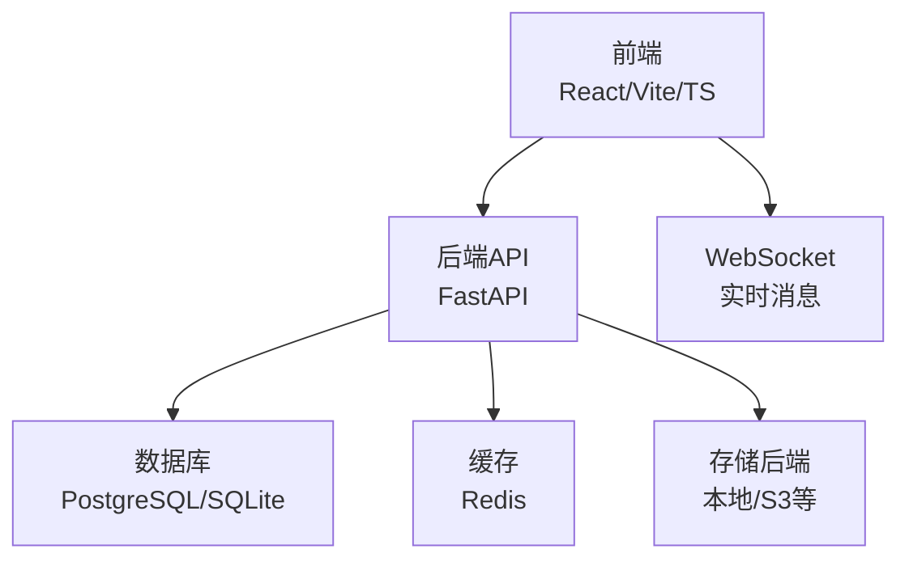
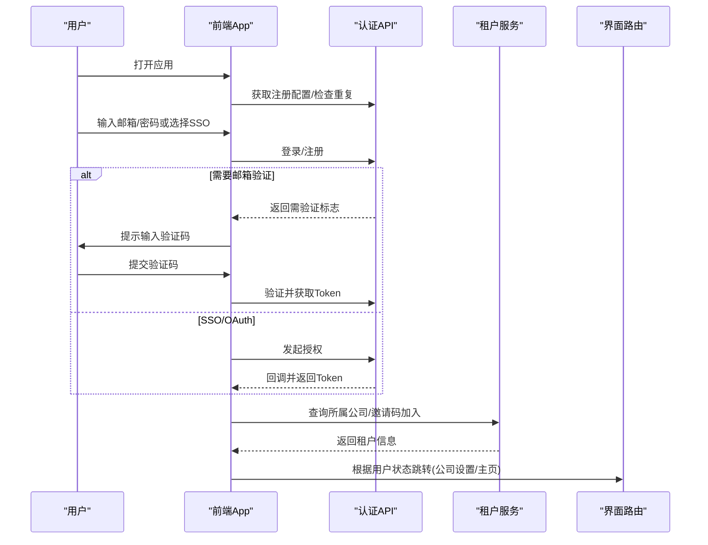
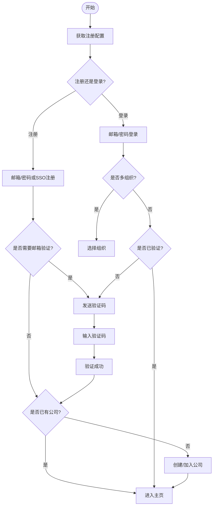
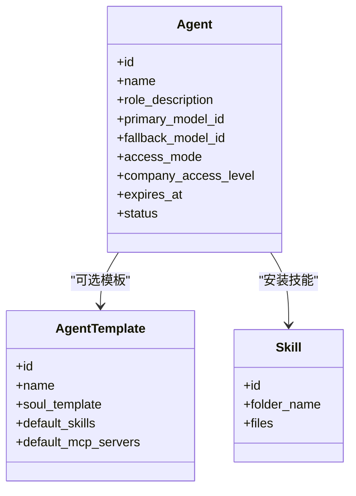
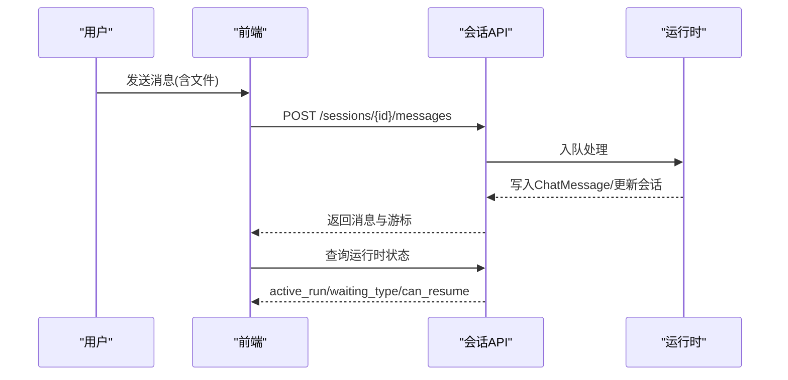
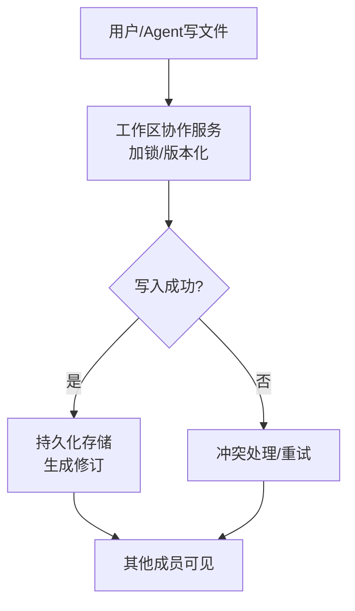
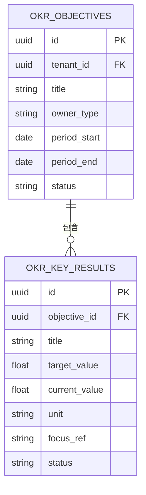
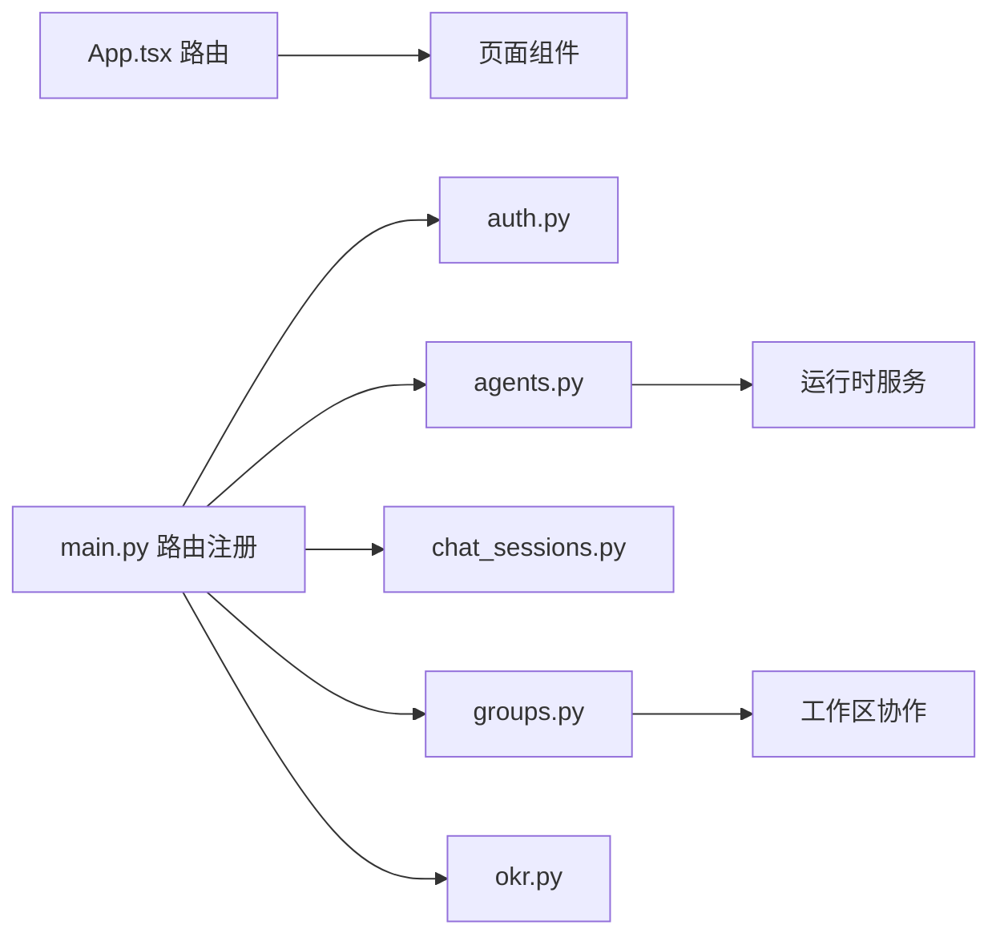

# 用户指南

<cite>
**本文引用的文件**   
- [README.md](file://README.md)
- [main.py](file://backend/app/main.py)
- [App.tsx](file://frontend/src/App.tsx)
- [Login.tsx](file://frontend/src/pages/Login.tsx)
- [CompanySetup.tsx](file://frontend/src/pages/CompanySetup.tsx)
- [auth.py](file://backend/app/api/auth.py)
- [organization.py](file://backend/app/api/organization.py)
- [agents.py](file://backend/app/api/agents.py)
- [chat_sessions.py](file://backend/app/api/chat_sessions.py)
- [groups.py](file://backend/app/api/groups.py)
- [okr.py](file://backend/app/api/okr.py)
- [OKR.tsx](file://frontend/src/pages/OKR.tsx)
- [groupWorkspaceUpload.ts](file://frontend/src/pages/groups/groupWorkspaceUpload.ts)
- [GroupWorkspaceTab.tsx](file://frontend/src/pages/groups/GroupWorkspaceTab.tsx)
- [workspace_collaboration.py](file://backend/app/services/workspace_collaboration.py)
- [group_runtime_tools.py](file://backend/app/services/agent_runtime/group_runtime_tools.py)
- [product_reconciler.py](file://backend/app/services/agent_runtime/product_reconciler.py)
- [schemas.py](file://backend/app/schemas/schemas.py)
- [registration_service.py](file://backend/app/services/registration_service.py)
- [021_add_okr_tables.py](file://backend/alembic/versions/021_add_okr_tables.py)
</cite>

## 目录
1. [简介](#简介)
2. [项目结构](#项目结构)
3. [核心组件](#核心组件)
4. [架构总览](#架构总览)
5. [详细组件分析](#详细组件分析)
6. [依赖关系分析](#依赖关系分析)
7. [性能与配额](#性能与配额)
8. [故障排除指南](#故障排除指南)
9. [结论](#结论)
10. [附录：常用操作与快捷键](#附录：常用操作与快捷键)

## 简介
本指南面向Clawith平台的使用者，覆盖从注册登录、组织加入、初始设置到Agent创建与管理、聊天会话使用、文件协作、群组协作、OKR目标管理、审计日志查看与使用配额管理等企业级功能。文档以“循序渐进”的方式帮助新用户快速上手，并为管理员提供必要的配置与排障要点。

## 项目结构
Clawith采用前后端分离架构：
- 前端（React + TypeScript + Vite）负责页面路由、状态管理与交互。
- 后端（FastAPI）提供REST API、WebSocket实时通信、权限控制与多租户隔离。
- 基础设施层包含数据库（SQLite/PostgreSQL）、缓存（Redis）以及容器化部署。

图表来源
- [main.py:352-470](file://backend/app/main.py#L352-L470)
- [App.tsx:274-301](file://frontend/src/App.tsx#L274-L301)

章节来源
- [README.md:205-224](file://README.md#L205-L224)
- [main.py:352-470](file://backend/app/main.py#L352-L470)
- [App.tsx:274-301](file://frontend/src/App.tsx#L274-L301)

## 核心组件
- 认证与授权：支持邮箱密码、SSO/OAuth、多租户选择、验证码校验。
- 组织与成员：公司创建/加入、成员列表与更新、角色权限。
- Agent（数字员工）：模板选择、参数配置、技能安装、MCP预装、运行容器启动。
- 聊天与会话：直接对话、会话管理、运行时状态、工具执行对账。
- 群组协作：共享工作区、文件读写、版本历史、并发锁。
- OKR目标管理：周期计算、目标与关键结果、自动报告与触发器。
- 审计与配额：操作审计、用量统计、Agent TTL与调用上限。

章节来源
- [auth.py:114-420](file://backend/app/api/auth.py#L114-L420)
- [organization.py:21-106](file://backend/app/api/organization.py#LL21-L106)
- [agents.py:409-590](file://backend/app/api/agents.py#L409-L590)
- [chat_sessions.py:216-355](file://backend/app/api/chat_sessions.py#L216-L355)
- [groups.py:1391-1436](file://backend/app/api/groups.py#L1391-L1436)
- [okr.py:484-586](file://backend/app/api/okr.py#L484-L586)

## 架构总览
下图展示用户从登录到进入主界面的流程，以及多租户切换与验证的分支逻辑。

图表来源
- [App.tsx:274-301](file://frontend/src/App.tsx#L274-L301)
- [Login.tsx:217-343](file://frontend/src/pages/Login.tsx#L217-L343)
- [auth.py:422-543](file://backend/app/api/auth.py#L422-L543)
- [CompanySetup.tsx:78-113](file://frontend/src/pages/CompanySetup.tsx#L78-L113)

章节来源
- [App.tsx:274-301](file://frontend/src/App.tsx#L274-L301)
- [Login.tsx:217-343](file://frontend/src/pages/Login.tsx#L217-L343)
- [auth.py:422-543](file://backend/app/api/auth.py#L422-L543)
- [CompanySetup.tsx:78-113](file://frontend/src/pages/CompanySetup.tsx#L78-L113)

## 详细组件分析

### 用户注册与登录
- 注册流程：支持邮箱密码注册与SSO注册；首次用户自动成为平台管理员；可启用邀请码强制。
- 登录流程：支持邮箱/用户名+密码登录；若绑定多个组织则弹出选择；未验证邮箱时引导验证。
- 安全机制：密码哈希、JWT令牌、跨域CORS、默认密钥告警。

图表来源
- [auth.py:114-254](file://backend/app/api/auth.py#L114-L254)
- [auth.py:422-543](file://backend/app/api/auth.py#L422-L543)
- [Login.tsx:217-343](file://frontend/src/pages/Login.tsx#L217-L343)
- [CompanySetup.tsx:78-113](file://frontend/src/pages/CompanySetup.tsx#L78-L113)

章节来源
- [auth.py:114-254](file://backend/app/api/auth.py#L114-L254)
- [auth.py:422-543](file://backend/app/api/auth.py#L422-L543)
- [Login.tsx:217-343](file://frontend/src/pages/Login.tsx#L217-L343)
- [CompanySetup.tsx:78-113](file://frontend/src/pages/CompanySetup.tsx#L78-L113)
- [schemas.py:11-70](file://backend/app/schemas/schemas.py#L11-L70)
- [registration_service.py:32-213](file://backend/app/services/registration_service.py#L32-L213)

### 组织加入与初始设置
- 创建公司：允许自创建或由管理员开启；失败时回退到邀请码加入。
- 加入公司：通过邀请码加入，成功后刷新用户上下文并进入引导页。
- 初始设置：根据用户状态跳转到公司设置或主页。

章节来源
- [CompanySetup.tsx:78-113](file://frontend/src/pages/CompanySetup.tsx#L78-L113)
- [auth.py:422-543](file://backend/app/api/auth.py#L422-L543)

### Agent创建、配置与管理
- 模板选择：列出内置/自定义模板，支持默认技能与MCP服务器预装。
- 参数设置：模型选择（主/备）、权限范围（公司/用户/自定义）、TTL与限额。
- 技能安装：后台异步复制技能文件、安装MCP、启动容器、钩子集成（如OKR）。
- 权限管理：支持按公司与指定用户设置访问级别（use/manage）。

图表来源
- [agents.py:142-168](file://backend/app/api/agents.py#L142-L168)
- [agents.py:409-590](file://backend/app/api/agents.py#L409-L590)

章节来源
- [agents.py:142-168](file://backend/app/api/agents.py#L142-L168)
- [agents.py:409-590](file://backend/app/api/agents.py#L409-L590)
- [agents.py:593-633](file://backend/app/api/agents.py#L593-L633)
- [agents.py:636-800](file://backend/app/api/agents.py#L636-L800)

### 聊天会话与文件操作
- 会话管理：创建/重命名/删除会话，列出当前用户的会话与未读数。
- 运行时状态：查询活跃Run、等待用户输入、工具执行对账。
- 文件操作：在会话中上传/读取文件，支持二进制与文本类型。

图表来源
- [chat_sessions.py:216-355](file://backend/app/api/chat_sessions.py#L216-L355)
- [chat_sessions.py:397-559](file://backend/app/api/chat_sessions.py#L397-L559)

章节来源
- [chat_sessions.py:216-355](file://backend/app/api/chat_sessions.py#L216-L355)
- [chat_sessions.py:397-559](file://backend/app/api/chat_sessions.py#L397-L559)

### 群组协作特性
- 共享工作区：群内所有会话共用同一文件树，支持上传、编辑、删除、目录导航。
- 版本历史与并发锁：记录修订、编辑锁、合并策略。
- 工具能力：list_files、read_document、搜索匹配等。

图表来源
- [workspace_collaboration.py:1-63](file://backend/app/services/workspace_collaboration.py#L1-L63)
- [group_runtime_tools.py:903-1134](file://backend/app/services/agent_runtime/group_runtime_tools.py#L903-L1134)
- [product_reconciler.py:210-350](file://backend/app/services/agent_runtime/product_reconciler.py#L210-L350)

章节来源
- [groups.py:1391-1436](file://backend/app/api/groups.py#L1391-L1436)
- [GroupWorkspaceTab.tsx:100-118](file://frontend/src/pages/groups/GroupWorkspaceTab.tsx#L100-L118)
- [workspace_collaboration.py:1-63](file://backend/app/services/workspace_collaboration.py#L1-L63)
- [group_runtime_tools.py:903-1134](file://backend/app/services/agent_runtime/group_runtime_tools.py#L903-L1134)
- [product_reconciler.py:210-350](file://backend/app/services/agent_runtime/product_reconciler.py#L210-L350)

### OKR目标管理
- 周期计算：支持月度/季度/自定义长度，锁定后不可更改。
- 目标与关键结果：创建/更新、进度上报、状态自动计算。
- 自动报告：每日/每周/每月报告，系统触发器驱动。
- 关系同步：将OKR Agent与公司成员及可见Agent关联。

图表来源
- [021_add_okr_tables.py:67-100](file://backend/alembic/versions/021_add_okr_tables.py#L67-L100)

章节来源
- [okr.py:484-586](file://backend/app/api/okr.py#L484-L586)
- [OKR.tsx:1-23](file://frontend/src/pages/OKR.tsx#L1-L23)
- [021_add_okr_tables.py:67-100](file://backend/alembic/versions/021_add_okr_tables.py#L67-L100)

### 审计日志与使用配额
- 审计日志：记录服务器启动、工具执行对账、运行时事件等。
- 使用配额：Agent创建配额、TTL限制、LLM调用上限、心跳间隔下限等。

章节来源
- [main.py:291-330](file://backend/app/main.py#L291-L330)
- [agents.py:72-98](file://backend/app/api/agents.py#L72-L98)
- [agents.py:409-478](file://backend/app/api/agents.py#L409-L478)

## 依赖关系分析
- 前端路由与页面：App.tsx集中定义路由，按需加载页面组件。
- 后端API模块：main.py统一注册各业务模块路由（认证、Agent、会话、群组、OKR等）。
- 服务层：工作区协作、运行时工具、产品对账等支撑复杂业务。

图表来源
- [App.tsx:274-301](file://frontend/src/App.tsx#L274-L301)
- [main.py:374-470](file://backend/app/main.py#L374-L470)

章节来源
- [App.tsx:274-301](file://frontend/src/App.tsx#L274-L301)
- [main.py:374-470](file://backend/app/main.py#L374-L470)

## 性能与配额
- 性能建议：生产环境建议使用PostgreSQL与Redis；合理设置CORS与代理；避免大文件频繁上传。
- 配额管理：
  - Agent TTL：可按租户默认值或用户配额设置过期时间。
  - LLM调用上限：按租户默认限制，防止滥用。
  - 心跳间隔：受租户最小值约束，避免过度轮询。
- 资源监控：健康检查接口用于探针；版本接口便于运维追踪。

章节来源
- [README.md:81-117](file://README.md#L81-L117)
- [agents.py:409-478](file://backend/app/api/agents.py#L409-L478)
- [main.py:473-513](file://backend/app/main.py#L473-L513)

## 故障排除指南
- 网络问题：Git克隆慢或超时可使用浅克隆或下载Release包；必要时配置代理。
- Docker镜像拉取失败：配置国内镜像源；构建阶段替换apt源为阿里云镜像。
- 邮箱验证失败：检查SMTP配置是否正确；确认PUBLIC_BASE_URL指向前端域名。
- 登录多组织选择：确保账号确实属于所选组织；否则返回无权限错误。
- 工作区写入冲突：查看编辑锁与版本历史；必要时重试或回滚。

章节来源
- [README.md:193-202](file://README.md#L193-L202)
- [README.md:134-163](file://README.md#L134-L163)
- [README.md:164-192](file://README.md#L164-L192)
- [auth.py:422-543](file://backend/app/api/auth.py#L422-L543)
- [workspace_collaboration.py:1-63](file://backend/app/services/workspace_collaboration.py#L1-L63)

## 结论
Clawith为企业提供了完整的AI Agent协作平台，涵盖身份认证、多租户隔离、Agent生命周期管理、实时聊天与文件协作、OKR目标管理以及审计与配额控制。通过本指南，用户可以快速完成注册登录、组织加入、初始设置，并高效使用Agent与协作功能，同时借助企业级管理能力保障数据安全与合规。

## 附录：常用操作与快捷键
- 注册/登录：邮箱+密码或SSO；首次用户自动成为平台管理员。
- 加入组织：通过邀请码加入；失败时回退到自有组织。
- 创建Agent：选择模板、设置模型与权限、安装技能与MCP。
- 聊天会话：新建会话、发送消息（支持文件）、查看未读与运行时状态。
- 群组协作：在工作区上传/编辑文件、查看版本历史、使用工具列目录与搜索。
- OKR管理：设置周期、创建目标与关键结果、更新进度、查看报告。
- 快捷键（浏览器层面）：Ctrl/Cmd+F查找、Esc关闭弹窗、Enter提交表单。

章节来源
- [README.md:164-192](file://README.md#L164-L192)
- [agents.py:409-590](file://backend/app/api/agents.py#L409-L590)
- [chat_sessions.py:216-355](file://backend/app/api/chat_sessions.py#L216-L355)
- [groups.py:1391-1436](file://backend/app/api/groups.py#L1391-L1436)
- [okr.py:484-586](file://backend/app/api/okr.py#L484-L586)