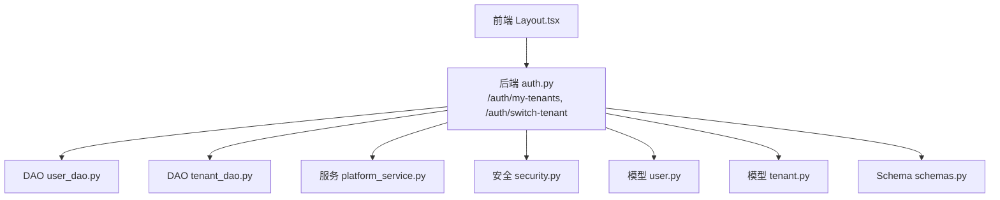
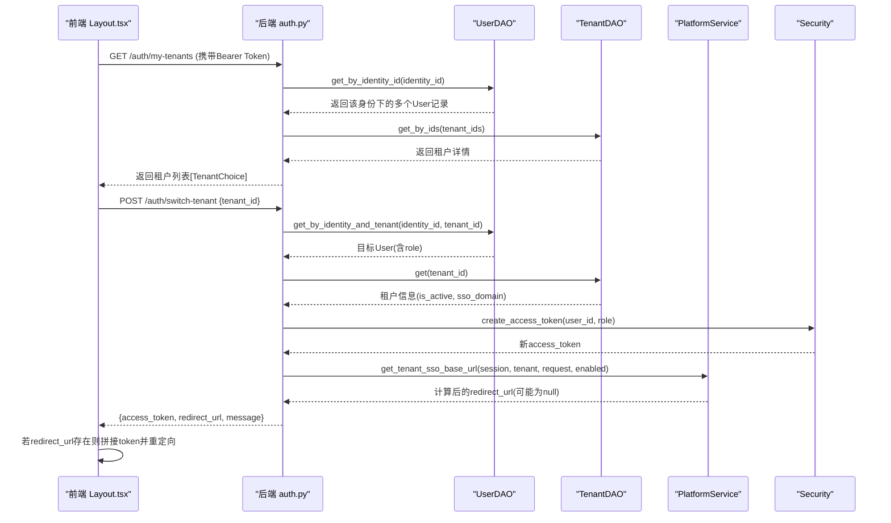
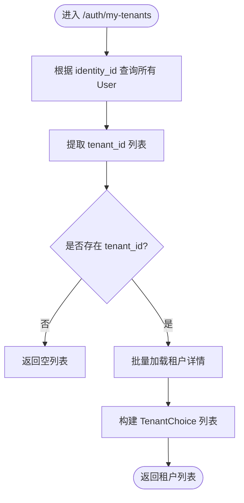
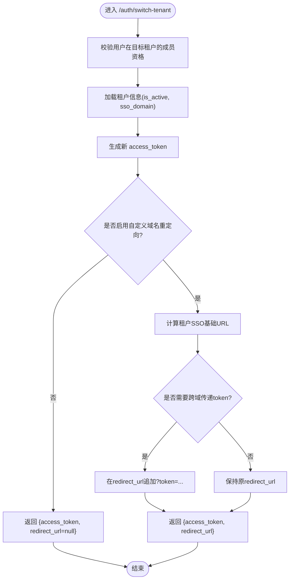
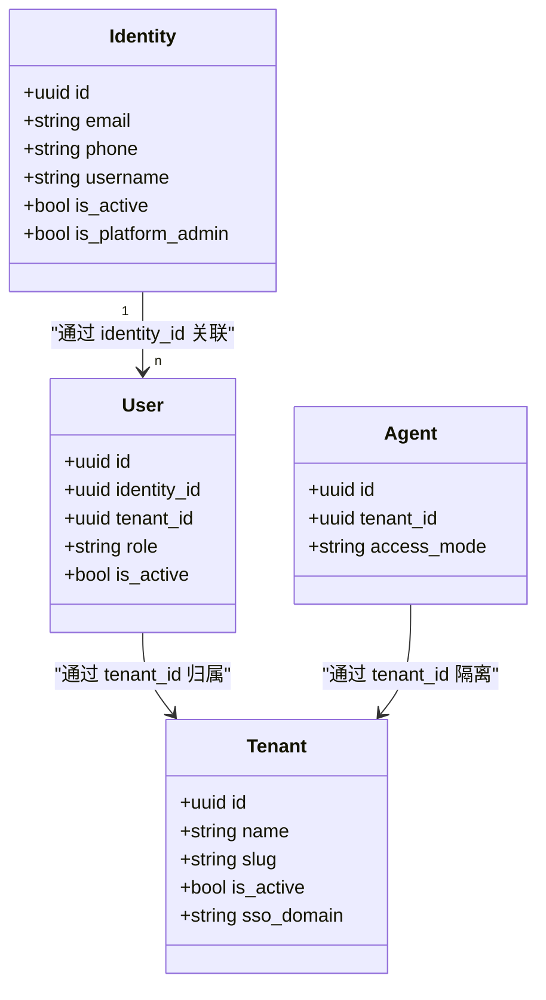
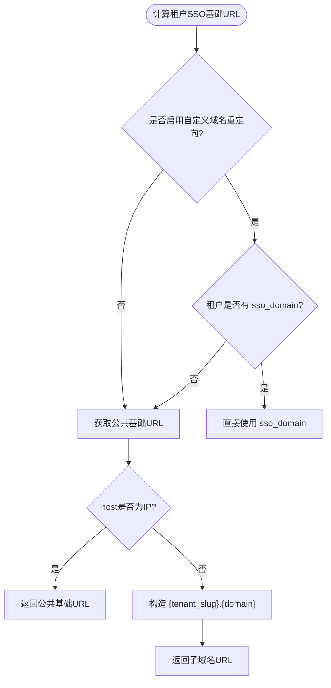
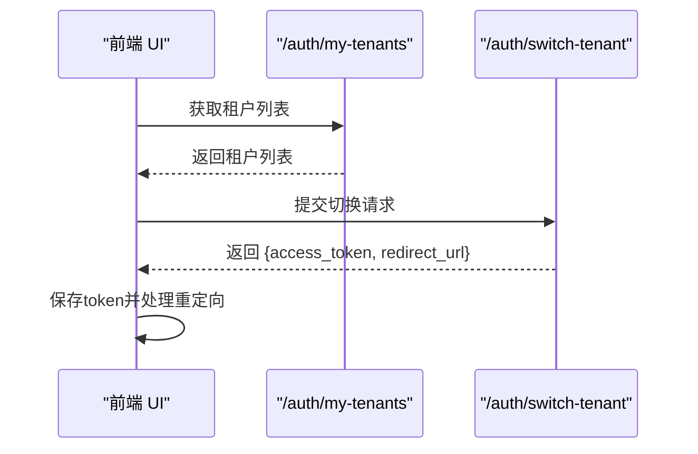
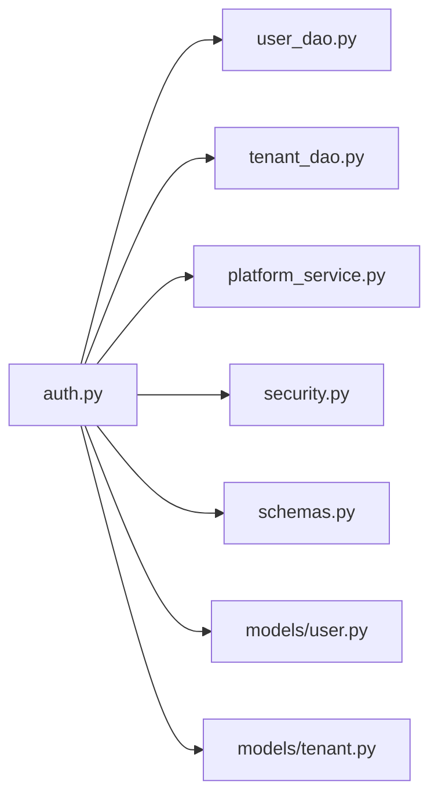

# 多租户切换

<cite>
**本文引用的文件**   
- [backend/app/api/auth.py](file://backend/app/api/auth.py)
- [backend/app/api/tenants.py](file://backend/app/api/tenants.py)
- [backend/app/schemas/schemas.py](file://backend/app/schemas/schemas.py)
- [backend/app/core/security.py](file://backend/app/core/security.py)
- [backend/app/models/user.py](file://backend/app/models/user.py)
- [backend/app/models/tenant.py](file://backend/app/models/tenant.py)
- [backend/app/dao/user_dao.py](file://backend/app/dao/user_dao.py)
- [backend/app/dao/tenant_dao.py](file://backend/app/dao/tenant_dao.py)
- [backend/app/services/platform_service.py](file://backend/app/services/platform_service.py)
- [frontend/src/pages/Layout.tsx](file://frontend/src/pages/Layout.tsx)
</cite>

## 目录
1. [简介](#简介)
2. [项目结构](#项目结构)
3. [核心组件](#核心组件)
4. [架构总览](#架构总览)
5. [详细组件分析](#详细组件分析)
6. [依赖关系分析](#依赖关系分析)
7. [性能考量](#性能考量)
8. [故障排查指南](#故障排查指南)
9. [结论](#结论)
10. [附录：API使用示例与开发指南](#附录api使用示例与开发指南)

## 简介
本文件面向多租户切换能力，覆盖以下关键主题：
- 获取当前用户可切换的租户列表（my-tenants）
- 执行租户切换（switch-tenant），包括跨域重定向URL生成策略
- 跨租户访问控制与权限隔离机制
- 租户上下文管理（基于JWT与User模型）
- 前端交互流程与最佳实践

## 项目结构
多租户切换涉及后端认证、数据访问、服务层以及前端页面。核心文件分布如下：
- 认证与租户切换API：backend/app/api/auth.py
- 租户管理与配置：backend/app/api/tenants.py
- 请求/响应Schema定义：backend/app/schemas/schemas.py
- 安全与令牌：backend/app/core/security.py
- 用户与租户模型：backend/app/models/user.py, backend/app/models/tenant.py
- DAO数据访问：backend/app/dao/user_dao.py, backend/app/dao/tenant_dao.py
- 平台级URL解析服务：backend/app/services/platform_service.py
- 前端租户切换UI与调用：frontend/src/pages/Layout.tsx

**图表来源** 
- [backend/app/api/auth.py](file://backend/app/api/auth.py)
- [backend/app/dao/user_dao.py](file://backend/app/dao/user_dao.py)
- [backend/app/dao/tenant_dao.py](file://backend/app/dao/tenant_dao.py)
- [backend/app/services/platform_service.py](file://backend/app/services/platform_service.py)
- [backend/app/core/security.py](file://backend/app/core/security.py)
- [backend/app/models/user.py](file://backend/app/models/user.py)
- [backend/app/models/tenant.py](file://backend/app/models/tenant.py)
- [backend/app/schemas/schemas.py](file://backend/app/schemas/schemas.py)
- [frontend/src/pages/Layout.tsx](file://frontend/src/pages/Layout.tsx)

**章节来源**
- [backend/app/api/auth.py](file://backend/app/api/auth.py)
- [backend/app/api/tenants.py](file://backend/app/api/tenants.py)
- [backend/app/schemas/schemas.py](file://backend/app/schemas/schemas.py)
- [backend/app/core/security.py](file://backend/app/core/security.py)
- [backend/app/models/user.py](file://backend/app/models/user.py)
- [backend/app/models/tenant.py](file://backend/app/models/tenant.py)
- [backend/app/dao/user_dao.py](file://backend/app/dao/user_dao.py)
- [backend/app/dao/tenant_dao.py](file://backend/app/dao/tenant_dao.py)
- [backend/app/services/platform_service.py](file://backend/app/services/platform_service.py)
- [frontend/src/pages/Layout.tsx](file://frontend/src/pages/Layout.tsx)

## 核心组件
- 认证与安全
  - JWT创建与解码、当前用户获取、角色校验等由安全模块提供。
- 租户与用户模型
  - User包含identity_id与tenant_id，表示“全局身份”到“租户内成员”的关系；Tenant描述租户边界与默认配额、SSO域名等。
- DAO数据访问
  - UserDAO支持按identity_id查询所有租户关联用户；TenantDAO支持按slug或sso_domain查询。
- 平台服务
  - PlatformService负责公共基础URL与租户SSO基础URL解析，支持IP/域名与子域名策略。
- Schema定义
  - TenantChoice/TenantSwitchRequest/TenantSwitchResponse等用于前后端契约。
- 前端交互
  - 通过GET /auth/my-tenants获取租户列表，POST /auth/switch-tenant执行切换，处理redirect_url并更新本地token。

**章节来源**
- [backend/app/core/security.py](file://backend/app/core/security.py)
- [backend/app/models/user.py](file://backend/app/models/user.py)
- [backend/app/models/tenant.py](file://backend/app/models/tenant.py)
- [backend/app/dao/user_dao.py](file://backend/app/dao/user_dao.py)
- [backend/app/dao/tenant_dao.py](file://backend/app/dao/tenant_dao.py)
- [backend/app/services/platform_service.py](file://backend/app/services/platform_service.py)
- [backend/app/schemas/schemas.py](file://backend/app/schemas/schemas.py)
- [frontend/src/pages/Layout.tsx](file://frontend/src/pages/Layout.tsx)

## 架构总览
下图展示从前端发起租户切换到后端处理的完整调用链，包括跨域重定向URL生成与Token传递。

**图表来源** 
- [backend/app/api/auth.py](file://backend/app/api/auth.py)
- [backend/app/dao/user_dao.py](file://backend/app/dao/user_dao.py)
- [backend/app/dao/tenant_dao.py](file://backend/app/dao/tenant_dao.py)
- [backend/app/services/platform_service.py](file://backend/app/services/platform_service.py)
- [backend/app/core/security.py](file://backend/app/core/security.py)
- [frontend/src/pages/Layout.tsx](file://frontend/src/pages/Layout.tsx)

## 详细组件分析

### my-tenants 端点（获取租户列表）
- 功能：根据当前用户的identity_id，查询其所属的所有租户，并返回租户选择所需的信息（id、name、slug、logo_url）。
- 权限：需要已登录用户（Bearer Token）。
- 数据流：
  - 通过UserDAO.get_by_identity_id获取该身份对应的所有User记录。
  - 提取非空的tenant_id集合，再通过TenantDAO.get_by_ids批量获取租户详情。
  - 组装为TenantChoice列表返回。

**图表来源** 
- [backend/app/api/auth.py](file://backend/app/api/auth.py)
- [backend/app/dao/user_dao.py](file://backend/app/dao/user_dao.py)
- [backend/app/dao/tenant_dao.py](file://backend/app/dao/tenant_dao.py)
- [backend/app/schemas/schemas.py](file://backend/app/schemas/schemas.py)

**章节来源**
- [backend/app/api/auth.py](file://backend/app/api/auth.py)
- [backend/app/dao/user_dao.py](file://backend/app/dao/user_dao.py)
- [backend/app/dao/tenant_dao.py](file://backend/app/dao/tenant_dao.py)
- [backend/app/schemas/schemas.py](file://backend/app/schemas/schemas.py)

### switch-tenant 端点（执行租户切换）
- 功能：验证目标租户成员资格，生成新的access_token，并根据系统设置决定是否返回跨域重定向URL。
- 权限：需要已登录用户（Bearer Token）。
- 数据流：
  - 通过UserDAO.get_by_identity_and_tenant校验用户在目标租户的存在性。
  - 通过TenantDAO.get获取租户状态（is_active、sso_domain）。
  - 通过security.create_access_token生成新token。
  - 通过system_setting判断是否启用自定义域名重定向；若启用，调用platform_service.get_tenant_sso_base_url计算redirect_url，并在必要时将token附加到URL参数中。
  - 返回{access_token, redirect_url, message}。

**图表来源** 
- [backend/app/api/auth.py](file://backend/app/api/auth.py)
- [backend/app/dao/user_dao.py](file://backend/app/dao/user_dao.py)
- [backend/app/dao/tenant_dao.py](file://backend/app/dao/tenant_dao.py)
- [backend/app/services/platform_service.py](file://backend/app/services/platform_service.py)
- [backend/app/core/security.py](file://backend/app/core/security.py)

**章节来源**
- [backend/app/api/auth.py](file://backend/app/api/auth.py)
- [backend/app/dao/user_dao.py](file://backend/app/dao/user_dao.py)
- [backend/app/dao/tenant_dao.py](file://backend/app/dao/tenant_dao.py)
- [backend/app/services/platform_service.py](file://backend/app/services/platform_service.py)
- [backend/app/core/security.py](file://backend/app/core/security.py)

### 跨租户访问控制与权限隔离
- 用户与租户关系：
  - Identity表示全局身份（邮箱/手机/用户名等），User表示某租户内的成员，二者通过identity_id关联。
- 权限判定：
  - 资源访问通常以tenant_id作为隔离边界，例如Agent访问检查会强制要求agent.tenant_id == user.tenant_id。
  - 管理员角色（org_admin、platform_admin）拥有更宽泛的管理权限，但仍受租户边界约束。
- 相关工具：
  - permissions模块提供can_use_agent、can_manage_agent、evaluate_roster_*等方法，确保跨租户不可见与不可用。

**图表来源** 
- [backend/app/models/user.py](file://backend/app/models/user.py)
- [backend/app/models/tenant.py](file://backend/app/models/tenant.py)

**章节来源**
- [backend/app/models/user.py](file://backend/app/models/user.py)
- [backend/app/models/tenant.py](file://backend/app/models/tenant.py)
- [backend/app/core/permissions.py](file://backend/app/core/permissions.py)

### 重定向URL生成策略
- 优先级：
  - 若系统设置启用自定义域名重定向且租户配置了sso_domain，则优先使用该域名。
  - 否则回退到平台公共基础URL（PUBLIC_BASE_URL环境变量或请求base_url）。
- IP与域名逻辑：
  - 当host为IP时，直接返回公共基础URL。
  - 当host为域名时，尝试构造{tenant_slug}.{domain}形式的子域名URL。
- 跨域Token传递：
  - 若需跨域切换，后端会在redirect_url后追加token参数，前端接收后保存并跳转。

**图表来源** 
- [backend/app/services/platform_service.py](file://backend/app/services/platform_service.py)
- [backend/app/api/auth.py](file://backend/app/api/auth.py)

**章节来源**
- [backend/app/services/platform_service.py](file://backend/app/services/platform_service.py)
- [backend/app/api/auth.py](file://backend/app/api/auth.py)

### 前端交互流程
- 获取租户列表：
  - 前端调用GET /auth/my-tenants，携带Authorization头，渲染租户选择菜单。
- 执行切换：
  - 前端调用POST /auth/switch-tenant，传入目标tenant_id。
  - 若返回redirect_url，前端将其规范化（协议/端口/主机名一致），并将access_token写入本地存储后跳转。
  - 若无redirect_url，直接保存access_token并刷新页面。

**图表来源** 
- [frontend/src/pages/Layout.tsx](file://frontend/src/pages/Layout.tsx)
- [backend/app/api/auth.py](file://backend/app/api/auth.py)

**章节来源**
- [frontend/src/pages/Layout.tsx](file://frontend/src/pages/Layout.tsx)
- [backend/app/api/auth.py](file://backend/app/api/auth.py)

## 依赖关系分析
- 模块耦合：
  - auth.py依赖user_dao、tenant_dao、platform_service、security与schemas。
  - platform_service独立于业务逻辑，仅负责URL解析。
  - models与dao解耦，便于扩展与维护。
- 外部依赖：
  - JWT库用于令牌编解码。
  - 数据库会话由FastAPI依赖注入提供。
- 潜在循环依赖：
  - 通过延迟导入避免循环引用（如注册服务、系统设置等）。

**图表来源** 
- [backend/app/api/auth.py](file://backend/app/api/auth.py)
- [backend/app/dao/user_dao.py](file://backend/app/dao/user_dao.py)
- [backend/app/dao/tenant_dao.py](file://backend/app/dao/tenant_dao.py)
- [backend/app/services/platform_service.py](file://backend/app/services/platform_service.py)
- [backend/app/core/security.py](file://backend/app/core/security.py)
- [backend/app/schemas/schemas.py](file://backend/app/schemas/schemas.py)
- [backend/app/models/user.py](file://backend/app/models/user.py)
- [backend/app/models/tenant.py](file://backend/app/models/tenant.py)

**章节来源**
- [backend/app/api/auth.py](file://backend/app/api/auth.py)
- [backend/app/dao/user_dao.py](file://backend/app/dao/user_dao.py)
- [backend/app/dao/tenant_dao.py](file://backend/app/dao/tenant_dao.py)
- [backend/app/services/platform_service.py](file://backend/app/services/platform_service.py)
- [backend/app/core/security.py](file://backend/app/core/security.py)
- [backend/app/schemas/schemas.py](file://backend/app/schemas/schemas.py)
- [backend/app/models/user.py](file://backend/app/models/user.py)
- [backend/app/models/tenant.py](file://backend/app/models/tenant.py)

## 性能考量
- 批量查询：
  - my-tenants通过批量加载tenant_ids减少DB往返。
- 异步IO：
  - 所有数据库操作均为异步，避免阻塞事件循环。
- CPU密集型操作：
  - 密码哈希等通过线程池执行，防止阻塞。
- URL解析：
  - platform_service尽量复用请求上下文与环境变量，减少额外查询。

[本节为通用指导，不直接分析具体文件]

## 故障排查指南
- 常见错误与定位：
  - 未登录或Token无效：检查Authorization头与JWT有效期。
  - 无租户成员资格：确认用户是否在目标租户中存在。
  - 租户不可用：检查租户is_active与sso_domain配置。
  - 重定向异常：检查系统设置是否启用自定义域名重定向，以及PUBLIC_BASE_URL配置。
- 日志与追踪：
  - TraceIdMiddleware注入trace_id，便于链路追踪。
  - 错误消息应包含detail字段，便于前端提示。

**章节来源**
- [backend/app/core/middleware.py](file://backend/app/core/middleware.py)
- [backend/app/api/auth.py](file://backend/app/api/auth.py)

## 结论
多租户切换通过清晰的JWT上下文与严格的租户边界实现安全的跨组织切换。前端与后端协作良好，支持跨域重定向与Token传递。建议在开发中遵循以下原则：
- 始终基于tenant_id进行数据隔离与权限校验。
- 合理处理redirect_url与Token传递，确保跨域场景可用。
- 充分利用批量查询与异步IO提升性能。

[本节为总结，不直接分析具体文件]

## 附录：API使用示例与开发指南

### API定义与契约
- GET /auth/my-tenants
  - 请求头：Authorization: Bearer <token>
  - 响应：list<TenantChoice>
- POST /auth/switch-tenant
  - 请求体：{tenant_id: uuid}
  - 响应：{access_token, token_type, redirect_url?, message?}

**章节来源**
- [backend/app/api/auth.py](file://backend/app/api/auth.py)
- [backend/app/schemas/schemas.py](file://backend/app/schemas/schemas.py)

### 前端集成要点
- 获取租户列表后渲染选择菜单。
- 切换时保存新token并处理redirect_url（规范化协议/端口/主机名）。
- 若无redirect_url，直接刷新页面或导航至首页。

**章节来源**
- [frontend/src/pages/Layout.tsx](file://frontend/src/pages/Layout.tsx)

### 后端扩展建议
- 新增租户属性时，同步更新Schemas与前端显示。
- 权限规则变更需在permissions模块统一处理，确保跨租户隔离。
- URL解析逻辑集中在platform_service，便于集中维护。

**章节来源**
- [backend/app/core/permissions.py](file://backend/app/core/permissions.py)
- [backend/app/services/platform_service.py](file://backend/app/services/platform_service.py)
- [backend/app/schemas/schemas.py](file://backend/app/schemas/schemas.py)