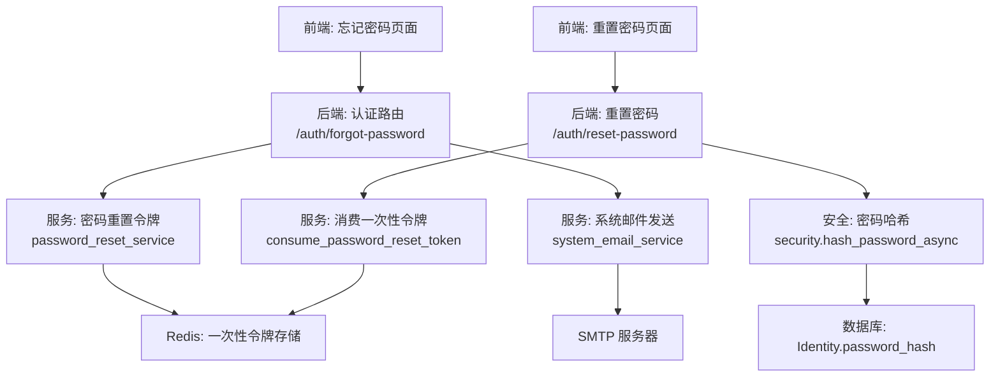
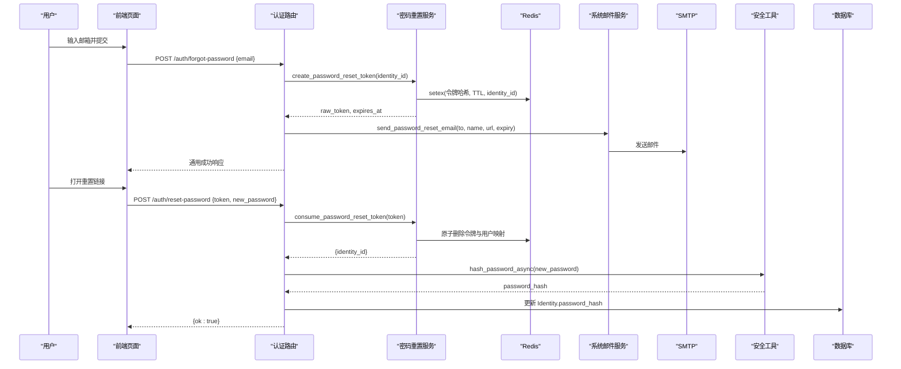
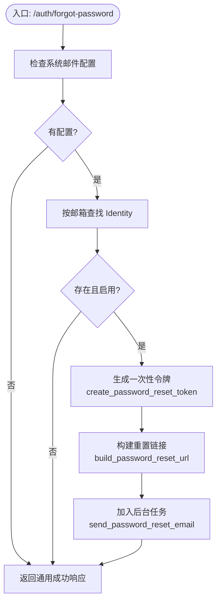
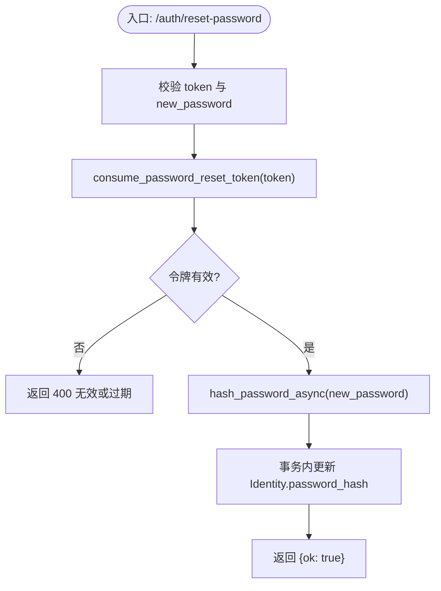
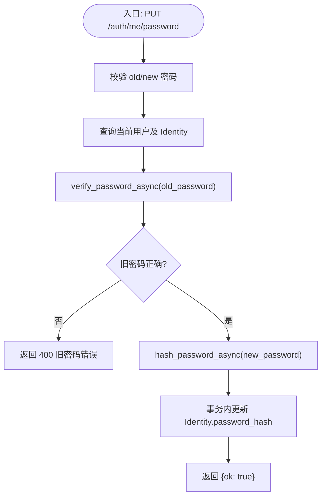
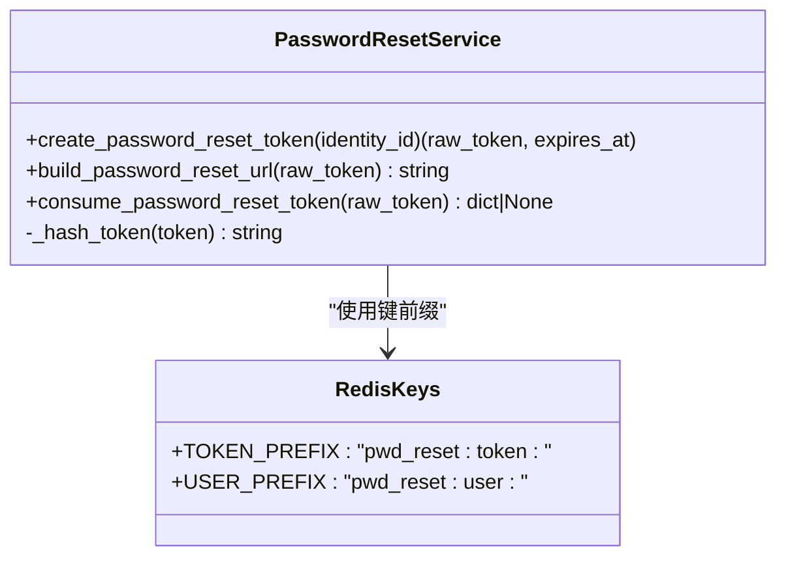
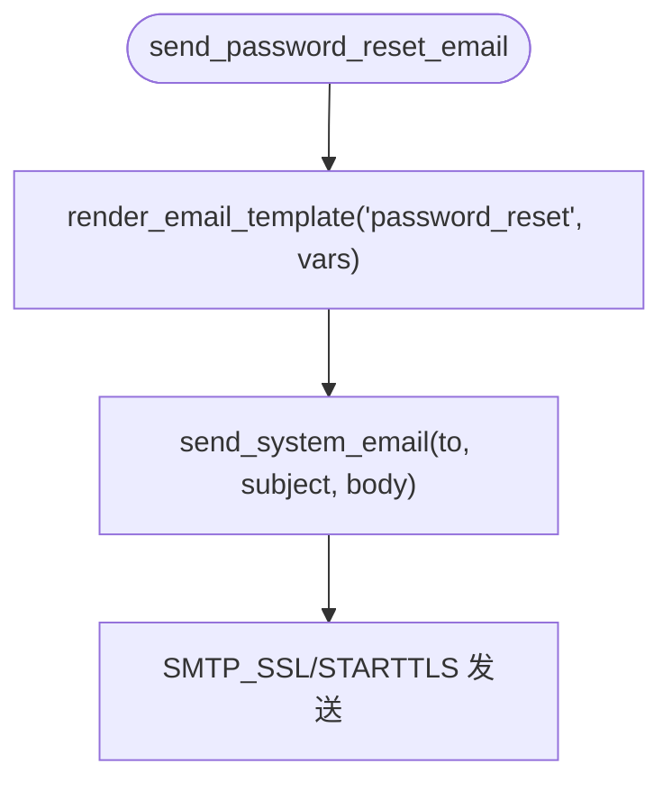
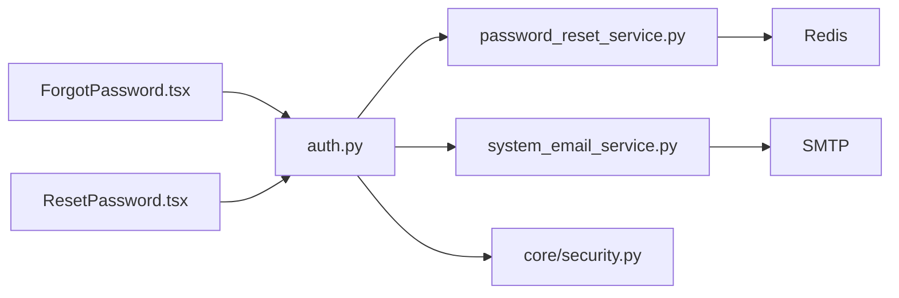

# 密码管理

<cite>
**本文引用的文件**   
- [backend/app/api/auth.py](file://backend/app/api/auth.py)
- [backend/app/services/password_reset_service.py](file://backend/app/services/password_reset_service.py)
- [backend/app/services/system_email_service.py](file://backend/app/services/system_email_service.py)
- [backend/app/core/security.py](file://backend/app/core/security.py)
- [backend/app/schemas/schemas.py](file://backend/app/schemas/schemas.py)
- [frontend/src/pages/ForgotPassword.tsx](file://frontend/src/pages/ForgotPassword.tsx)
- [frontend/src/pages/ResetPassword.tsx](file://frontend/src/pages/ResetPassword.tsx)
- [backend/tests/test_password_reset_and_notifications.py](file://backend/tests/test_password_reset_and_notifications.py)
</cite>

## 目录
1. [简介](#简介)
2. [项目结构](#项目结构)
3. [核心组件](#核心组件)
4. [架构总览](#架构总览)
5. [详细组件分析](#详细组件分析)
6. [依赖关系分析](#依赖关系分析)
7. [性能与安全考量](#性能与安全考量)
8. [故障排查指南](#故障排查指南)
9. [结论](#结论)
10. [附录：API 调用示例与前端集成](#附录api-调用示例与前端集成)

## 简介
本文件面向后端与前端开发者，系统化说明密码管理相关能力，包括：
- 忘记密码流程（/auth/forgot-password）
- 密码重置流程（/auth/reset-password）
- 已登录用户修改密码（PUT /auth/me/password）
- 一次性令牌生成、邮件发送、密码强度校验与安全存储策略
- 完整的 API 调用示例与前端页面集成要点

## 项目结构
密码管理功能涉及以下关键模块：
- 路由层：认证与密码管理接口定义
- 服务层：一次性令牌生命周期、邮件模板与发送
- 安全层：密码哈希与验证
- 数据模型与请求响应模式：统一 Schema
- 前端页面：忘记密码与重置密码交互

**图表来源** 
- [backend/app/api/auth.py:582-652](file://backend/app/api/auth.py#L582-L652)
- [backend/app/services/password_reset_service.py:1-84](file://backend/app/services/password_reset_service.py#L1-L84)
- [backend/app/services/system_email_service.py:127-149](file://backend/app/services/system_email_service.py#L127-L149)
- [backend/app/core/security.py:32-51](file://backend/app/core/security.py#L32-L51)

**章节来源**
- [backend/app/api/auth.py:582-652](file://backend/app/api/auth.py#L582-L652)
- [backend/app/services/password_reset_service.py:1-84](file://backend/app/services/password_reset_service.py#L1-L84)
- [backend/app/services/system_email_service.py:127-149](file://backend/app/services/system_email_service.py#L127-L149)
- [backend/app/core/security.py:32-51](file://backend/app/core/security.py#L32-L51)

## 核心组件
- 认证路由（/auth/*）
  - forgot-password：发起密码重置，生成一次性令牌并异步发送邮件
  - reset-password：使用一次性令牌重置密码
  - change_password（PUT /auth/me/password）：已登录用户修改密码
- 密码重置服务（password_reset_service）
  - create_password_reset_token：生成一次性令牌，写入 Redis，并失效旧令牌
  - build_password_reset_url：拼装用户可见的重置链接
  - consume_password_reset_token：原子性消费令牌（删除），返回 identity_id
- 系统邮件服务（system_email_service）
  - send_password_reset_email：渲染模板并通过 SMTP 发送
  - 模板变量：display_name、reset_url、expiry_minutes
- 安全工具（security）
  - hash_password_async / verify_password_async：非阻塞的 bcrypt 哈希与校验

**章节来源**
- [backend/app/api/auth.py:582-652](file://backend/app/api/auth.py#L582-L652)
- [backend/app/services/password_reset_service.py:1-84](file://backend/app/services/password_reset_service.py#L1-L84)
- [backend/app/services/system_email_service.py:127-149](file://backend/app/services/system_email_service.py#L127-L149)
- [backend/app/core/security.py:32-51](file://backend/app/core/security.py#L32-L51)

## 架构总览
整体时序如下：用户在前端触发“忘记密码”，后端生成一次性令牌并发送邮件；用户点击邮件中的链接进入重置页面，提交新密码后后端校验令牌并更新密码。

**图表来源** 
- [backend/app/api/auth.py:582-652](file://backend/app/api/auth.py#L582-L652)
- [backend/app/services/password_reset_service.py:23-49](file://backend/app/services/password_reset_service.py#L23-L49)
- [backend/app/services/system_email_service.py:127-149](file://backend/app/services/system_email_service.py#L127-L149)
- [backend/app/core/security.py:42-51](file://backend/app/core/security.py#L42-L51)

## 详细组件分析

### 忘记密码（/auth/forgot-password）
- 输入校验：请求体包含 email
- 行为逻辑：
  - 检查系统邮件配置是否可用
  - 根据 email 查找 Identity，若不存在或禁用则返回通用成功响应（防枚举）
  - 生成一次性令牌并构建重置 URL
  - 通过 BackgroundTasks 异步发送邮件
- 错误处理：异常被捕获并记录日志，仍返回通用成功响应

**图表来源** 
- [backend/app/api/auth.py:582-627](file://backend/app/api/auth.py#L582-L627)
- [backend/app/services/password_reset_service.py:23-49](file://backend/app/services/password_reset_service.py#L23-L49)
- [backend/app/services/system_email_service.py:127-149](file://backend/app/services/system_email_service.py#L127-L149)

**章节来源**
- [backend/app/api/auth.py:582-627](file://backend/app/api/auth.py#L582-L627)
- [backend/tests/test_password_reset_and_notifications.py:197-233](file://backend/tests/test_password_reset_and_notifications.py#L197-L233)

### 密码重置（/auth/reset-password）
- 输入校验：token（长度限制）、new_password（最小长度）
- 行为逻辑：
  - 消费一次性令牌（原子删除，确保单次使用）
  - 计算新密码哈希
  - 在事务中更新 Identity.password_hash
- 错误处理：令牌无效或过期、身份不存在等均返回明确错误

**图表来源** 
- [backend/app/api/auth.py:630-652](file://backend/app/api/auth.py#L630-L652)
- [backend/app/services/password_reset_service.py:64-83](file://backend/app/services/password_reset_service.py#L64-L83)
- [backend/app/core/security.py:42-51](file://backend/app/core/security.py#L42-L51)

**章节来源**
- [backend/app/api/auth.py:630-652](file://backend/app/api/auth.py#L630-L652)
- [backend/tests/test_password_reset_and_notifications.py:329-346](file://backend/tests/test_password_reset_and_notifications.py#L329-L346)

### 修改密码（PUT /auth/me/password）
- 输入校验：old_password、new_password（最小长度）
- 行为逻辑：
  - 获取当前用户及其全局 Identity
  - 校验旧密码
  - 计算新密码哈希并在事务中更新
- 错误处理：缺少参数、旧密码错误、身份不存在等

**图表来源** 
- [backend/app/api/auth.py:795-834](file://backend/app/api/auth.py#L795-L834)
- [backend/app/core/security.py:42-51](file://backend/app/core/security.py#L42-L51)

**章节来源**
- [backend/app/api/auth.py:795-834](file://backend/app/api/auth.py#L795-L834)

### 一次性令牌机制（Redis）
- 生成：
  - 随机生成 raw_token
  - SHA-256 哈希存储为 key
  - 同时维护 user_key -> token_hash 映射，便于失效旧令牌
  - 设置 TTL（分钟级）
- 消费：
  - 根据 raw_token 计算哈希，定位 token_key
  - 原子删除 token_key 与 user_key，保证单次使用

**图表来源** 
- [backend/app/services/password_reset_service.py:1-84](file://backend/app/services/password_reset_service.py#L1-L84)

**章节来源**
- [backend/app/services/password_reset_service.py:1-84](file://backend/app/services/password_reset_service.py#L1-L84)
- [backend/tests/test_password_reset_and_notifications.py:138-194](file://backend/tests/test_password_reset_and_notifications.py#L138-L194)

### 邮件发送与模板
- 模板变量：display_name、reset_url、expiry_minutes
- 发送方式：异步线程执行 SMTP 发送，避免阻塞事件循环
- 失败隔离：广播邮件场景支持单条失败不影响其他收件人

**图表来源** 
- [backend/app/services/system_email_service.py:127-149](file://backend/app/services/system_email_service.py#L127-L149)

**章节来源**
- [backend/app/services/system_email_service.py:127-149](file://backend/app/services/system_email_service.py#L127-L149)
- [backend/tests/test_password_reset_and_notifications.py:285-326](file://backend/tests/test_password_reset_and_notifications.py#L285-L326)

## 依赖关系分析
- 路由层依赖：
  - identity_dao、user_dao 用于身份与用户查询
  - background_tasks 用于异步邮件发送
  - security 用于密码哈希与校验
- 服务层依赖：
  - password_reset_service 依赖 Redis（令牌存储）
  - system_email_service 依赖 SMTP 与模板渲染
- 前端依赖：
  - ForgotPassword.tsx 调用 /auth/forgot-password
  - ResetPassword.tsx 调用 /auth/reset-password

**图表来源** 
- [backend/app/api/auth.py:582-652](file://backend/app/api/auth.py#L582-L652)
- [backend/app/services/password_reset_service.py:1-84](file://backend/app/services/password_reset_service.py#L1-L84)
- [backend/app/services/system_email_service.py:127-149](file://backend/app/services/system_email_service.py#L127-L149)
- [backend/app/core/security.py:32-51](file://backend/app/core/security.py#L32-L51)
- [frontend/src/pages/ForgotPassword.tsx:21-35](file://frontend/src/pages/ForgotPassword.tsx#L21-L35)
- [frontend/src/pages/ResetPassword.tsx:22-49](file://frontend/src/pages/ResetPassword.tsx#L22-L49)

**章节来源**
- [backend/app/api/auth.py:582-652](file://backend/app/api/auth.py#L582-L652)
- [backend/app/services/password_reset_service.py:1-84](file://backend/app/services/password_reset_service.py#L1-L84)
- [backend/app/services/system_email_service.py:127-149](file://backend/app/services/system_email_service.py#L127-L149)
- [backend/app/core/security.py:32-51](file://backend/app/core/security.py#L32-L51)
- [frontend/src/pages/ForgotPassword.tsx:21-35](file://frontend/src/pages/ForgotPassword.tsx#L21-L35)
- [frontend/src/pages/ResetPassword.tsx:22-49](file://frontend/src/pages/ResetPassword.tsx#L22-L49)

## 性能与安全考量
- 性能
  - 密码哈希与校验使用线程池异步执行，避免阻塞事件循环
  - 邮件发送通过后台任务与线程池执行，降低请求延迟
  - Redis 操作使用 pipeline 原子化，减少网络往返
- 安全
  - 一次性令牌使用 SHA-256 哈希存储，不持久明文
  - 令牌 TTL 控制有效期，消费即删，防止重放
  - 忘记密码接口返回通用响应，避免邮箱枚举
  - 密码最小长度校验（至少 6 字符）
  - 使用 bcrypt 进行密码哈希存储

**章节来源**
- [backend/app/core/security.py:28-51](file://backend/app/core/security.py#L28-L51)
- [backend/app/services/password_reset_service.py:18-49](file://backend/app/services/password_reset_service.py#L18-L49)
- [backend/app/api/auth.py:582-652](file://backend/app/api/auth.py#L582-L652)

## 故障排查指南
- 无法发送邮件
  - 检查系统邮件配置是否可用（resolve_email_config_async）
  - 查看日志中关于 SMTP 连接的警告或错误
- 重置令牌无效或过期
  - 确认前端传递的 token 是否正确
  - 检查 Redis 中是否存在对应令牌键
- 重置失败
  - 检查 new_password 是否符合最小长度要求
  - 确认 Identity 存在且处于启用状态
- 修改密码失败
  - 确认 old_password 正确
  - 检查 Identity 是否存在

**章节来源**
- [backend/app/services/system_email_service.py:54-84](file://backend/app/services/system_email_service.py#L54-L84)
- [backend/app/services/password_reset_service.py:64-83](file://backend/app/services/password_reset_service.py#L64-L83)
- [backend/tests/test_password_reset_and_notifications.py:197-233](file://backend/tests/test_password_reset_and_notifications.py#L197-L233)

## 结论
密码管理功能围绕“一次性令牌 + 异步邮件 + 安全哈希”的核心设计，实现了高可用的忘记密码与重置流程，并通过严格的输入校验与 Redis 原子操作保障安全性与幂等性。前后端协作清晰，易于扩展与维护。

## 附录：API 调用示例与前端集成

### API 定义与请求/响应
- POST /auth/forgot-password
  - 请求体：{ email }
  - 响应：{ ok, message }（通用成功响应）
- POST /auth/reset-password
  - 请求体：{ token, new_password }
  - 响应：{ ok: true }
- PUT /auth/me/password
  - 请求体：{ old_password, new_password }
  - 响应：{ ok: true }

**章节来源**
- [backend/app/schemas/schemas.py:69-76](file://backend/app/schemas/schemas.py#L69-L76)
- [backend/app/api/auth.py:582-652](file://backend/app/api/auth.py#L582-L652)

### 前端集成要点
- 忘记密码页面
  - 表单收集 email，调用 /auth/forgot-password
  - 显示通用成功消息，提示用户检查邮箱
- 重置密码页面
  - 从 URL 参数读取 token
  - 校验 new_password 与 confirm 一致且满足长度
  - 调用 /auth/reset-password，成功后跳转登录页

**章节来源**
- [frontend/src/pages/ForgotPassword.tsx:21-35](file://frontend/src/pages/ForgotPassword.tsx#L21-L35)
- [frontend/src/pages/ResetPassword.tsx:22-49](file://frontend/src/pages/ResetPassword.tsx#L22-L49)