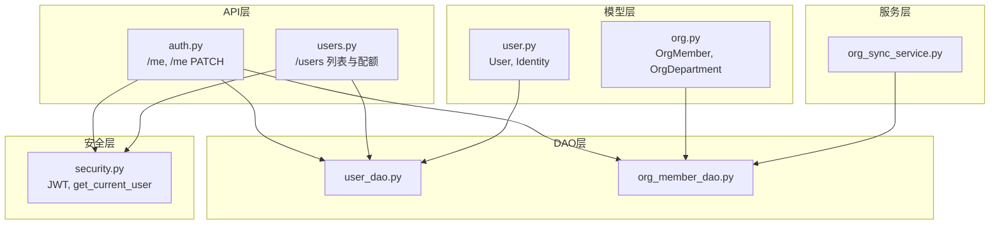
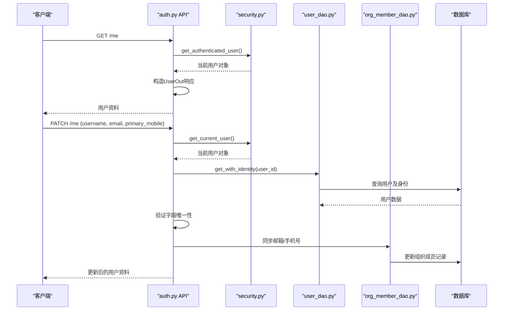
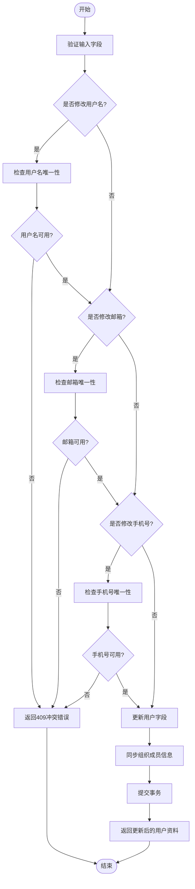
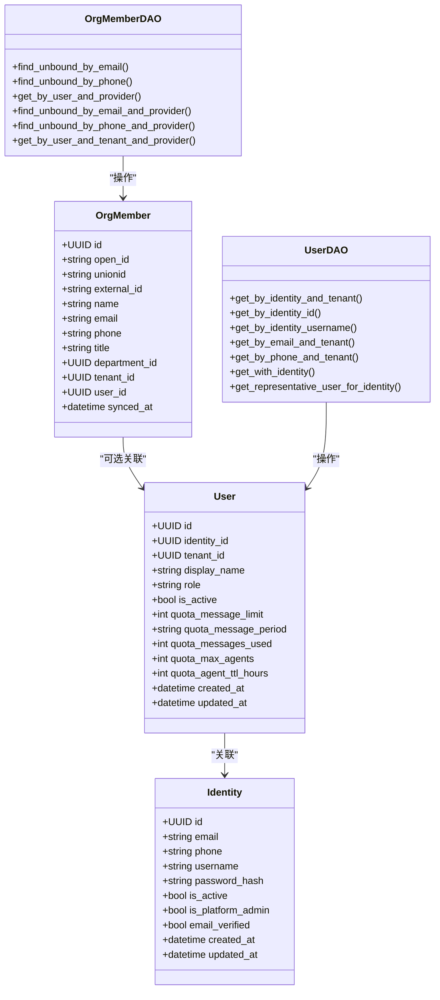

# 用户信息管理

<cite>
**本文引用的文件**   
- [backend/app/api/auth.py](file://backend/app/api/auth.py)
- [backend/app/api/users.py](file://backend/app/api/users.py)
- [backend/app/models/user.py](file://backend/app/models/user.py)
- [backend/app/dao/user_dao.py](file://backend/app/dao/user_dao.py)
- [backend/app/dao/org_member_dao.py](file://backend/app/dao/org_member_dao.py)
- [backend/app/models/org.py](file://backend/app/models/org.py)
- [backend/app/services/org_sync_service.py](file://backend/app/services/org_sync_service.py)
- [backend/app/core/security.py](file://backend/app/core/security.py)
</cite>

## 目录
1. [简介](#简介)
2. [项目结构](#项目结构)
3. [核心组件](#核心组件)
4. [架构总览](#架构总览)
5. [详细组件分析](#详细组件分析)
6. [依赖关系分析](#依赖关系分析)
7. [性能考虑](#性能考虑)
8. [故障排查指南](#故障排查指南)
9. [结论](#结论)
10. [附录：API调用示例与数据模型](#附录api调用示例与数据模型)

## 简介
本文件聚焦于用户信息管理功能，覆盖以下关键能力：
- 获取当前用户资料（me端点）
- 更新当前用户资料（update_me端点），包括用户名、邮箱、手机号等字段的唯一性校验
- 用户数据同步机制（用户与组织成员信息的双向同步）
- 字段验证规则与错误处理
- 完整的API调用示例与数据模型说明

该功能基于FastAPI构建，使用SQLAlchemy进行数据库访问，并通过DAO层封装查询逻辑。认证鉴权由安全模块提供，支持JWT令牌与角色权限控制。

## 项目结构
用户信息管理涉及以下主要模块：
- API层：auth.py中的/me和/me PATCH端点；users.py中的用户列表与配额管理
- 模型层：user.py中的User与Identity模型；org.py中的OrgMember与部门模型
- DAO层：user_dao.py与org_member_dao.py提供用户与组织成员的查询方法
- 服务层：org_sync_service.py负责组织结构的同步
- 安全层：security.py提供JWT与用户身份解析



**图表来源** 
- [backend/app/api/auth.py:655-718](file://backend/app/api/auth.py#L655-L718)
- [backend/app/api/users.py:49-100](file://backend/app/api/users.py#L49-L100)
- [backend/app/models/user.py:52-118](file://backend/app/models/user.py#L52-L118)
- [backend/app/models/org.py:34-62](file://backend/app/models/org.py#L34-L62)
- [backend/app/dao/user_dao.py:16-91](file://backend/app/dao/user_dao.py#L16-L91)
- [backend/app/dao/org_member_dao.py:17-120](file://backend/app/dao/org_member_dao.py#L17-L120)
- [backend/app/services/org_sync_service.py:14-48](file://backend/app/services/org_sync_service.py#L14-L48)
- [backend/app/core/security.py:153-196](file://backend/app/core/security.py#L153-L196)

**章节来源**
- [backend/app/api/auth.py:655-718](file://backend/app/api/auth.py#L655-L718)
- [backend/app/api/users.py:49-100](file://backend/app/api/users.py#L49-L100)
- [backend/app/models/user.py:52-118](file://backend/app/models/user.py#L52-L118)
- [backend/app/models/org.py:34-62](file://backend/app/models/org.py#L34-L62)
- [backend/app/dao/user_dao.py:16-91](file://backend/app/dao/user_dao.py#L16-L91)
- [backend/app/dao/org_member_dao.py:17-120](file://backend/app/dao/org_member_dao.py#L17-L120)
- [backend/app/services/org_sync_service.py:14-48](file://backend/app/services/org_sync_service.py#L14-L48)
- [backend/app/core/security.py:153-196](file://backend/app/core/security.py#L153-L196)

## 核心组件
- 用户资料获取（GET /me）：返回当前认证用户的完整资料，包含用户名、邮箱、显示名、角色、配额信息等
- 用户资料更新（PATCH /me）：支持更新用户名、邮箱、手机号等字段，并进行唯一性校验
- 用户数据同步：当用户邮箱或手机号变更时，自动同步到组织成员记录
- 组织成员同步：通过org_sync_service从身份提供商同步组织架构与成员信息

**章节来源**
- [backend/app/api/auth.py:655-718](file://backend/app/api/auth.py#L655-L718)
- [backend/app/services/org_sync_service.py:14-48](file://backend/app/services/org_sync_service.py#L14-L48)

## 架构总览
用户信息管理采用分层架构设计：
- API层处理HTTP请求与响应
- 业务逻辑通过DAO层访问数据库
- 模型层定义数据结构与关系
- 服务层协调跨模块操作
- 安全层提供认证与授权



**图表来源** 
- [backend/app/api/auth.py:655-718](file://backend/app/api/auth.py#L655-L718)
- [backend/app/core/security.py:153-196](file://backend/app/core/security.py#L153-L196)
- [backend/app/dao/user_dao.py:79-84](file://backend/app/dao/user_dao.py#L79-L84)
- [backend/app/dao/org_member_dao.py:17-120](file://backend/app/dao/org_member_dao.py#L17-L120)

## 详细组件分析

### 用户资料获取（GET /me）
该端点返回当前认证用户的完整资料，包括：
- 基本信息：id、username、email、display_name
- 账户状态：role、is_active
- 配额信息：quota_message_limit、quota_message_period、quota_messages_used、quota_max_agents、quota_agent_ttl_hours
- 元数据：created_at、source（注册来源）

实现流程：
1. 通过get_authenticated_user依赖获取当前用户
2. 将User模型转换为UserOut响应模型
3. 添加is_platform_admin字段用于前端展示

**章节来源**
- [backend/app/api/auth.py:655-660](file://backend/app/api/auth.py#L655-L660)
- [backend/app/api/users.py:24-46](file://backend/app/api/users.py#L24-L46)

### 用户资料更新（PATCH /me）
该端点支持更新用户资料，包含严格的字段验证：

#### 字段验证规则
- **用户名唯一性**：全局唯一，不能与其他用户重复
- **邮箱唯一性**：租户范围内唯一，排除当前用户自身
- **手机号唯一性**：租户范围内唯一，排除当前用户自身

#### 更新流程


**图表来源** 
- [backend/app/api/auth.py:663-718](file://backend/app/api/auth.py#L663-L718)
- [backend/app/dao/user_dao.py:36-77](file://backend/app/dao/user_dao.py#L36-L77)

**章节来源**
- [backend/app/api/auth.py:663-718](file://backend/app/api/auth.py#L663-L718)
- [backend/app/dao/user_dao.py:36-77](file://backend/app/dao/user_dao.py#L36-L77)

### 用户数据同步机制
当用户邮箱或手机号发生变更时，系统会自动同步到组织成员记录：

#### 同步触发条件
- 用户邮箱字段变更
- 用户手机号字段变更

#### 同步目标
- 组织成员表（org_members）中的对应记录
- 保持用户信息与组织信息的实时一致性

#### 同步实现
通过registration_service.sync_org_member_contact_from_user方法实现，该方法会：
1. 查找对应的组织成员记录
2. 更新邮箱和手机号字段
3. 确保数据一致性

**章节来源**
- [backend/app/api/auth.py:708-716](file://backend/app/api/auth.py#L708-L716)

### 组织成员信息同步
系统支持从外部身份提供商（如飞书、钉钉等）同步组织架构与成员信息：

#### 同步流程
1. 通过org_sync_service.sync_provider启动同步
2. 根据提供商类型选择对应的适配器
3. 拉取组织结构和成员数据
4. 更新本地数据库中的org_departments和org_members表

#### 数据模型
- **OrgDepartment**：部门信息，包含名称、父级部门、路径等
- **OrgMember**：成员信息，包含姓名、邮箱、电话、职位、部门等

**章节来源**
- [backend/app/services/org_sync_service.py:14-48](file://backend/app/services/org_sync_service.py#L14-L48)
- [backend/app/models/org.py:13-62](file://backend/app/models/org.py#L13-L62)

## 依赖关系分析
用户信息管理模块的依赖关系如下：



**图表来源** 
- [backend/app/models/user.py:16-118](file://backend/app/models/user.py#L16-L118)
- [backend/app/models/org.py:34-62](file://backend/app/models/org.py#L34-L62)
- [backend/app/dao/user_dao.py:10-94](file://backend/app/dao/user_dao.py#L10-L94)
- [backend/app/dao/org_member_dao.py:11-120](file://backend/app/dao/org_member_dao.py#L11-L120)

**章节来源**
- [backend/app/models/user.py:16-118](file://backend/app/models/user.py#L16-L118)
- [backend/app/models/org.py:34-62](file://backend/app/models/org.py#L34-L62)
- [backend/app/dao/user_dao.py:10-94](file://backend/app/dao/user_dao.py#L10-L94)
- [backend/app/dao/org_member_dao.py:11-120](file://backend/app/dao/org_member_dao.py#L11-L120)

## 性能考虑
- **异步数据库操作**：所有数据库操作均使用异步模式，避免阻塞事件循环
- **连接池优化**：使用SQLAlchemy的异步会话管理，提高并发性能
- **索引优化**：在常用查询字段上建立索引（如email、phone、username等）
- **懒加载策略**：使用selectinload预加载关联数据，减少N+1查询问题
- **事务管理**：批量操作使用事务保证数据一致性

## 故障排查指南

### 常见问题及解决方案

#### 1. 用户名冲突错误（409 Conflict）
**现象**：更新用户名时报错"Username already taken"
**原因**：尝试设置的用户名已被其他用户使用
**解决方案**：更换其他用户名

#### 2. 邮箱冲突错误（409 Conflict）
**现象**：更新邮箱时报错"Email already registered"
**原因**：尝试设置的邮箱已在同一租户内被其他用户使用
**解决方案**：使用未占用的邮箱地址

#### 3. 手机号冲突错误（409 Conflict）
**现象**：更新手机号时报错"Mobile already registered"
**原因**：尝试设置的手机号已在同一租户内被其他用户使用
**解决方案**：使用未占用的手机号码

#### 4. 用户不存在错误（404 Not Found）
**现象**：更新用户时报错"User not found"
**原因**：指定的用户ID不存在或已被删除
**解决方案**：确认用户ID有效性

#### 5. 认证失败错误（401 Unauthorized）
**现象**：访问受保护端点时报错"Invalid or expired token"
**原因**：JWT令牌无效或已过期
**解决方案**：重新登录获取新的访问令牌

**章节来源**
- [backend/app/api/auth.py:677-701](file://backend/app/api/auth.py#L677-L701)
- [backend/app/core/security.py:141-150](file://backend/app/core/security.py#L141-L150)

## 结论
用户信息管理功能提供了完整的用户资料CRUD操作，具备严格的字段验证和数据同步机制。通过分层架构设计，实现了良好的可维护性和扩展性。系统支持多租户环境下的用户管理，能够与外部身份提供商集成，满足企业级应用的需求。

## 附录：API调用示例与数据模型

### API调用示例

#### 获取当前用户资料
```http
GET /api/auth/me
Authorization: Bearer {access_token}
```

**响应示例**：
```json
{
  "id": "uuid-string",
  "username": "john_doe",
  "email": "john@example.com",
  "display_name": "John Doe",
  "role": "member",
  "is_active": true,
  "quota_message_limit": 50,
  "quota_message_period": "permanent",
  "quota_messages_used": 10,
  "quota_max_agents": 2,
  "quota_agent_ttl_hours": 0,
  "agents_count": 0,
  "created_at": "2024-01-01T00:00:00Z",
  "source": "registered"
}
```

#### 更新用户资料
```http
PATCH /api/auth/me
Authorization: Bearer {access_token}
Content-Type: application/json

{
  "username": "jane_smith",
  "email": "jane@example.com",
  "primary_mobile": "+8613800138000"
}
```

**成功响应**：返回更新后的用户资料
**错误响应**：
- 409 Conflict：用户名/邮箱/手机号冲突
- 404 Not Found：用户不存在
- 401 Unauthorized：认证失败

### 数据模型说明

#### User模型
- **id**: 用户唯一标识符（UUID）
- **identity_id**: 关联的全局身份标识
- **tenant_id**: 所属租户标识
- **display_name**: 显示名称
- **role**: 用户角色（member、agent_admin、org_admin、platform_admin）
- **is_active**: 账户激活状态
- **quota_*:** 各种配额限制字段
- **created_at/updated_at**: 创建和更新时间

#### Identity模型
- **id**: 全局身份标识符
- **email**: 邮箱地址（全局唯一）
- **phone**: 手机号码（全局唯一）
- **username**: 用户名（全局唯一）
- **password_hash**: 密码哈希值
- **is_platform_admin**: 是否为平台管理员
- **email_verified**: 邮箱验证状态

#### OrgMember模型
- **id**: 组织成员标识符
- **open_id/unionid/external_id**: 第三方平台标识
- **name/email/phone**: 基本联系信息
- **title**: 职位名称
- **department_id**: 所属部门
- **user_id**: 关联的系统用户
- **synced_at**: 最后同步时间

**章节来源**
- [backend/app/models/user.py:52-118](file://backend/app/models/user.py#L52-L118)
- [backend/app/models/org.py:34-62](file://backend/app/models/org.py#L34-L62)
- [backend/app/api/auth.py:655-718](file://backend/app/api/auth.py#L655-L718)