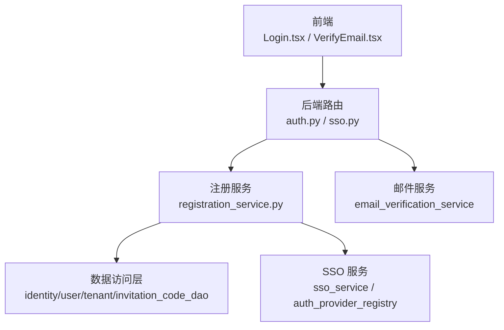
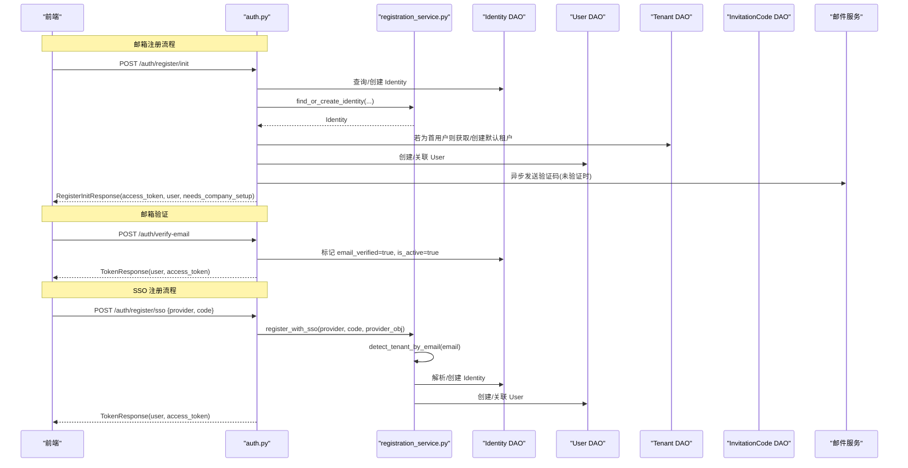
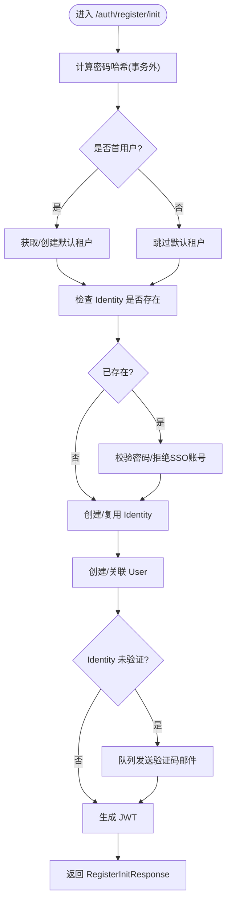
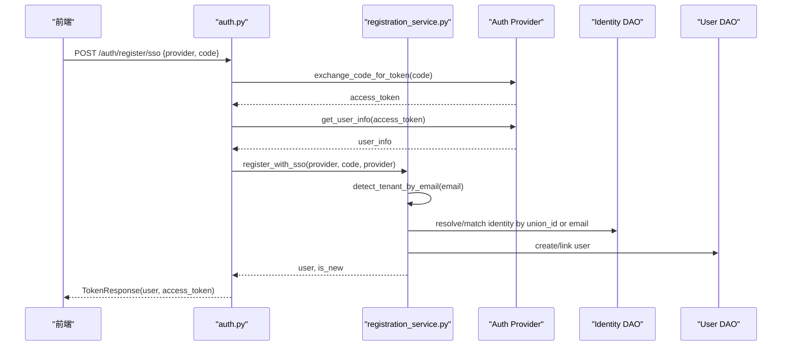
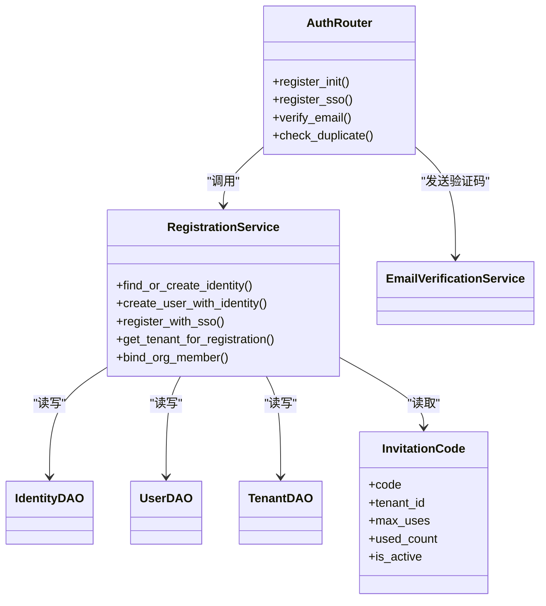

# 用户注册

<cite>
**本文引用的文件**   
- [backend/app/api/auth.py](file://backend/app/api/auth.py)
- [backend/app/api/sso.py](file://backend/app/api/sso.py)
- [backend/app/services/registration_service.py](file://backend/app/services/registration_service.py)
- [backend/app/models/invitation_code.py](file://backend/app/models/invitation_code.py)
- [backend/app/schemas/schemas.py](file://backend/app/schemas/schemas.py)
- [frontend/src/pages/Login.tsx](file://frontend/src/pages/Login.tsx)
- [frontend/src/pages/VerifyEmail.tsx](file://frontend/src/pages/VerifyEmail.tsx)
</cite>

## 目录
1. [简介](#简介)
2. [项目结构](#项目结构)
3. [核心组件](#核心组件)
4. [架构总览](#架构总览)
5. [详细组件分析](#详细组件分析)
6. [依赖关系分析](#依赖关系分析)
7. [性能考量](#性能考量)
8. [故障排查指南](#故障排查指南)
9. [结论](#结论)
10. [附录：API 调用示例与前端集成](#附录api-调用示例与前端集成)

## 简介
本文件面向开发者与产品实施人员，系统化说明用户注册功能，包括：
- 邮箱注册流程（register/init 端点）
- 邀请码机制与租户自动分配逻辑
- SSO 注册流程（register/sso 端点）
- 首次用户平台管理员自动创建
- 注册验证流程、重复检查机制
- 完整 API 调用示例与前端集成指南
- 错误处理与用户体验优化建议

## 项目结构
后端采用 FastAPI 路由 + Service 分层设计，注册相关能力集中在 auth 路由与 registration_service 服务中；SSO 能力由 sso 路由与 auth_provider_registry 协作完成。前端通过 Login 页面与 VerifyEmail 页面实现注册、验证码校验与跳转。

图表来源 
- [backend/app/api/auth.py:138-253](file://backend/app/api/auth.py#L138-L253)
- [backend/app/api/sso.py:16-31](file://backend/app/api/sso.py#L16-L31)
- [backend/app/services/registration_service.py:32-198](file://backend/app/services/registration_service.py#L32-L198)

章节来源
- [backend/app/api/auth.py:138-253](file://backend/app/api/auth.py#L138-L253)
- [backend/app/api/sso.py:16-31](file://backend/app/api/sso.py#L16-L31)
- [backend/app/services/registration_service.py:32-198](file://backend/app/services/registration_service.py#L32-L198)

## 核心组件
- 注册入口与校验
  - register/init：初始化注册，创建或复用 Identity，生成 JWT，必要时发送验证码邮件
  - check-duplicate：全局重复检查（邮箱/用户名）
  - verify-email：邮箱验证码校验并激活账户
- 邀请码与租户分配
  - invitation_code：邀请码模型，支持使用次数限制与租户绑定
  - get_tenant_for_registration：按邀请码优先、再按邮箱域名匹配租户
- SSO 注册
  - register/sso：第三方授权码换取用户信息，自动匹配/创建 Identity 与 User，并尝试分配租户
  - sso/session 与 sso/config：企业级扫码登录会话与可用提供商列表
- 首用户平台管理员
  - 系统为空时，首个注册用户自动成为平台管理员，并自动创建默认租户

章节来源
- [backend/app/api/auth.py:53-73](file://backend/app/api/auth.py#L53-L73)
- [backend/app/api/auth.py:138-253](file://backend/app/api/auth.py#L138-L253)
- [backend/app/api/auth.py:256-301](file://backend/app/api/auth.py#L256-L301)
- [backend/app/api/auth.py:1140-1188](file://backend/app/api/auth.py#L1140-L1188)
- [backend/app/services/registration_service.py:343-362](file://backend/app/services/registration_service.py#L343-L362)
- [backend/app/models/invitation_code.py:13-26](file://backend/app/models/invitation_code.py#L13-L26)
- [backend/app/api/sso.py:16-31](file://backend/app/api/sso.py#L16-L31)

## 架构总览
下图展示邮箱注册与 SSO 注册的端到端流程，以及关键的数据流转与外部交互。

图表来源 
- [backend/app/api/auth.py:138-253](file://backend/app/api/auth.py#L138-L253)
- [backend/app/api/auth.py:256-301](file://backend/app/api/auth.py#L256-L301)
- [backend/app/api/auth.py:1140-1188](file://backend/app/api/auth.py#L1140-L1188)
- [backend/app/services/registration_service.py:265-339](file://backend/app/services/registration_service.py#L265-L339)

## 详细组件分析

### 邮箱注册：register/init
- 输入参数
  - username、email、password、display_name、target_tenant_id
- 处理要点
  - 密码哈希在事务外计算，避免占用连接
  - 检测是否为首用户（系统是否为空），若是则自动创建/获取默认租户并赋予 platform_admin 角色
  - 重复性检查：根据 email 查找 Identity，若存在且无密码（SSO/同步用户）则拒绝；若已存在且密码不匹配则返回 401
  - 事务内创建/复用 Identity，创建/关联 User，设置初始状态
  - 若 Identity 未验证，后台任务发送验证码邮件
  - 返回 access_token、user、needs_company_setup 等
- 错误处理
  - 409：邮箱冲突
  - 400：SSO/同步账号无法用密码注册
  - 401：密码错误

图表来源 
- [backend/app/api/auth.py:138-253](file://backend/app/api/auth.py#L138-L253)

章节来源
- [backend/app/api/auth.py:138-253](file://backend/app/api/auth.py#L138-L253)

### 邀请码机制与租户自动分配
- 邀请码模型字段
  - code、tenant_id、max_uses、used_count、is_active、created_by、created_at
- 分配优先级
  - 若提供 invitation_code：校验有效且未达上限，直接绑定到对应租户
  - 否则按 email 域名匹配租户
  - 若均无，则不分配租户（需后续 setup-company）
- 典型场景
  - 邀请链接携带 code，前端在注册/登录时透传，后端据此确定目标租户

章节来源
- [backend/app/models/invitation_code.py:13-26](file://backend/app/models/invitation_code.py#L13-L26)
- [backend/app/services/registration_service.py:343-362](file://backend/app/services/registration_service.py#L343-L362)

### SSO 注册：register/sso
- 输入参数
  - provider、code、invitation_code（可选）
- 处理要点
  - 通过 provider 交换 token 并拉取用户信息
  - 按 email 域名检测租户；若无则保持空
  - 基于 provider_union_id/provider_user_id 解析已有身份，或按 email 匹配现有用户并绑定
  - 新建 Identity + User，并尝试绑定 OrgMember
  - 返回 access_token、user、needs_company_setup
- 错误处理
  - 不支持的 provider、token 交换失败、SSO 注册异常等

图表来源 
- [backend/app/api/auth.py:256-301](file://backend/app/api/auth.py#L256-L301)
- [backend/app/services/registration_service.py:265-339](file://backend/app/services/registration_service.py#L265-L339)

章节来源
- [backend/app/api/auth.py:256-301](file://backend/app/api/auth.py#L256-L301)
- [backend/app/services/registration_service.py:265-339](file://backend/app/services/registration_service.py#L265-L339)

### 邮箱验证：verify-email
- 输入参数
  - token（验证码）
- 处理要点
  - 消费验证码令牌（Redis 一次性）
  - 将 Identity 标记为已验证并激活，同时激活所有关联的 User
  - 返回 TokenResponse（包含 access_token 与 user）
- 错误处理
  - 无效或过期令牌、找不到 Identity 等

章节来源
- [backend/app/api/auth.py:1140-1188](file://backend/app/api/auth.py#L1140-L1188)

### 重复检查：check-duplicate
- 输入参数
  - email、username（可选）
- 处理要点
  - 全局检查 Identity 是否已被该邮箱/用户名占用
  - 返回 has_conflict 与 conflicts 列表，便于前端即时提示

章节来源
- [backend/app/api/auth.py:53-73](file://backend/app/api/auth.py#L53-L73)

### 首用户平台管理员自动创建
- 触发条件
  - 系统中不存在任何 Identity
- 行为
  - 自动创建/获取 slug=default 的租户
  - 首个用户角色设为 platform_admin，并立即激活
  - 可触发默认 Agent 种子数据（在旧版兼容路径中）

章节来源
- [backend/app/api/auth.py:138-253](file://backend/app/api/auth.py#L138-L253)

## 依赖关系分析
- 路由层
  - auth.py：注册、登录、邮箱验证、OAuth 回调、切换租户等
  - sso.py：企业级扫码会话与提供商配置
- 服务层
  - registration_service.py：统一注册逻辑、SSO 注册、租户检测、OrgMember 绑定
- 数据层
  - identity/user/tenant/invitation_code_dao：身份、用户、租户、邀请码持久化
- 外部依赖
  - 邮件服务：验证码发送、重置密码邮件
  - OAuth/SSO 提供商：exchange_code_for_token、get_user_info

图表来源 
- [backend/app/api/auth.py:138-253](file://backend/app/api/auth.py#L138-L253)
- [backend/app/services/registration_service.py:32-198](file://backend/app/services/registration_service.py#L32-L198)
- [backend/app/models/invitation_code.py:13-26](file://backend/app/models/invitation_code.py#L13-L26)

章节来源
- [backend/app/api/auth.py:138-253](file://backend/app/api/auth.py#L138-L253)
- [backend/app/services/registration_service.py:32-198](file://backend/app/services/registration_service.py#L32-L198)
- [backend/app/models/invitation_code.py:13-26](file://backend/app/models/invitation_code.py#L13-L26)

## 性能考量
- 事务边界优化
  - 密码哈希、外部网络请求（OAuth）、邮件发送均在事务外执行，减少锁持有时间
- 并发安全
  - Identity 查找/创建在事务内保证一致性，防止重复注册
- 缓存与一次性令牌
  - 验证码令牌使用 Redis 一次性消费，避免重放攻击
- 批量操作
  - 首次用户注册后可能触发默认 Agent 种子数据，建议在后台任务中执行以避免阻塞主流程

[本节为通用指导，无需具体文件引用]

## 故障排查指南
- 常见错误与定位
  - 409 邮箱冲突：检查 check-duplicate 与 Identity 唯一约束
  - 400 SSO 账号无法用密码注册：确认该 Identity 是否由 SSO/同步创建
  - 401 密码错误：核对密码哈希比对逻辑
  - 403 需要验证：login 时若未验证会返回结构化 needs_verification，引导用户输入验证码
  - 404 组织不存在：登录时未关联任何租户
- 日志关键字
  - [REGISTER_INIT]、[REGISTER_SSO]、[LOGIN]、Failed to send verification email 等
- 常见问题
  - 未配置 SMTP：验证码不会发送，但会按策略自动验证并激活
  - 邀请码已用完或租户禁用：get_tenant_for_registration 会返回错误原因

章节来源
- [backend/app/api/auth.py:422-542](file://backend/app/api/auth.py#L422-L542)
- [backend/app/api/auth.py:1191-1227](file://backend/app/api/auth.py#L1191-L1227)
- [backend/app/services/registration_service.py:343-362](file://backend/app/services/registration_service.py#L343-L362)

## 结论
本注册体系以“Identity + User + Tenant”三层模型为核心，结合邀请码与邮箱域名进行租户自动分配，并通过 SSO/OAuth 扩展多源身份。邮箱验证确保合规与安全，首用户自动成为平台管理员简化了初始部署。整体设计兼顾安全性、可扩展性与用户体验。

[本节为总结性内容，无需具体文件引用]

## 附录：API 调用示例与前端集成

### 邮箱注册（register/init）
- 请求
  - 方法：POST
  - 路径：/auth/register/init
  - 请求体：{ username, email, password, display_name?, target_tenant_id? }
- 响应
  - 201：{ user_id, email, access_token, message, user, needs_company_setup, target_tenant_id }
- 前端集成要点
  - 提交后保存 access_token 与 user
  - 若 needs_company_setup 为真，跳转到公司设置页
  - 若未验证，进入验证码输入界面

章节来源
- [backend/app/api/auth.py:138-253](file://backend/app/api/auth.py#L138-L253)
- [frontend/src/pages/Login.tsx:217-254](file://frontend/src/pages/Login.tsx#L217-L254)

### 邮箱验证（verify-email）
- 请求
  - 方法：POST
  - 路径：/auth/verify-email
  - 请求体：{ token }
- 响应
  - 200：{ access_token, user, identity, needs_company_setup }
- 前端集成要点
  - 成功后自动登录并根据 needs_company_setup 决定跳转

章节来源
- [backend/app/api/auth.py:1140-1188](file://backend/app/api/auth.py#L1140-L1188)
- [frontend/src/pages/VerifyEmail.tsx:36-67](file://frontend/src/pages/VerifyEmail.tsx#L36-L67)

### 重新发送验证码（resend-verification）
- 请求
  - 方法：POST
  - 路径：/auth/resend-verification
  - 请求体：{ email }
- 响应
  - 200：{ ok, message }（防枚举，总是成功）

章节来源
- [backend/app/api/auth.py:1191-1227](file://backend/app/api/auth.py#L1191-L1227)

### 重复检查（check-duplicate）
- 请求
  - 方法：GET
  - 路径：/auth/check-duplicate?email=&username=
- 响应
  - 200：{ email_exists, username_exists, has_conflict, conflicts[] }

章节来源
- [backend/app/api/auth.py:53-73](file://backend/app/api/auth.py#L53-L73)

### SSO 注册（register/sso）
- 请求
  - 方法：POST
  - 路径：/auth/register/sso
  - 请求体：{ provider, code, invitation_code? }
- 响应
  - 200：{ access_token, user, needs_company_setup }

章节来源
- [backend/app/api/auth.py:256-301](file://backend/app/api/auth.py#L256-L301)

### 企业级 SSO 扫码会话与提供商配置
- 创建会话
  - 方法：POST
  - 路径：/sso/session?tenant_id=
  - 响应：{ session_id, expires_at }
- 获取提供商列表
  - 方法：GET
  - 路径：/sso/config?sid=
  - 响应：[{ provider_type, name, url }]

章节来源
- [backend/app/api/sso.py:16-31](file://backend/app/api/sso.py#L16-L31)
- [backend/app/api/sso.py:83-159](file://backend/app/api/sso.py#L83-L159)

### 前端集成最佳实践
- 表单校验与实时反馈
  - 使用 check-duplicate 做实时重复检查，提升体验
- 验证码流程
  - 注册后进入验证码页面，支持一键重发
  - 支持 URL 中的 token/code 自动验证
- 多租户选择
  - 登录时若返回 requires_tenant_selection，前端弹出选择框
- 错误处理
  - 区分 401/403/409/404 等状态，给出友好提示
  - 对网络错误进行降级提示

章节来源
- [frontend/src/pages/Login.tsx:217-343](file://frontend/src/pages/Login.tsx#L217-L343)
- [frontend/src/pages/VerifyEmail.tsx:36-91](file://frontend/src/pages/VerifyEmail.tsx#L36-L91)