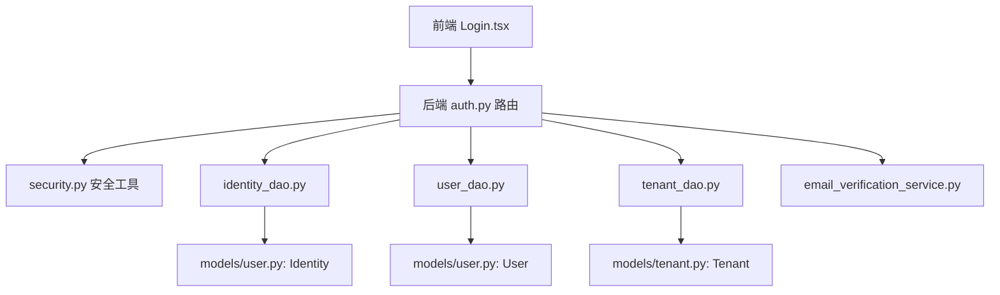
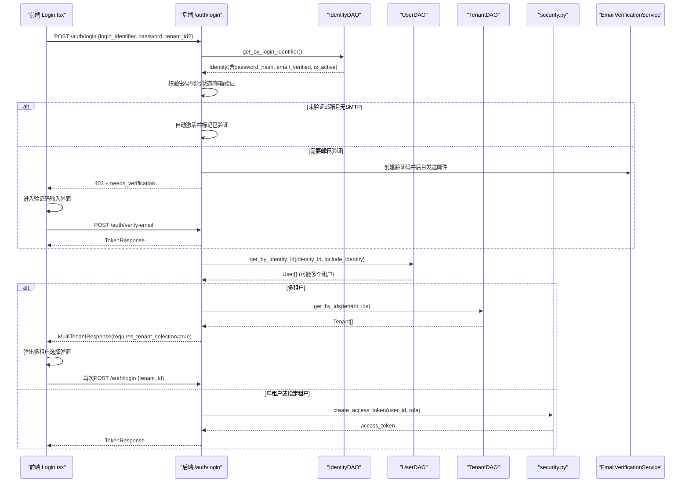
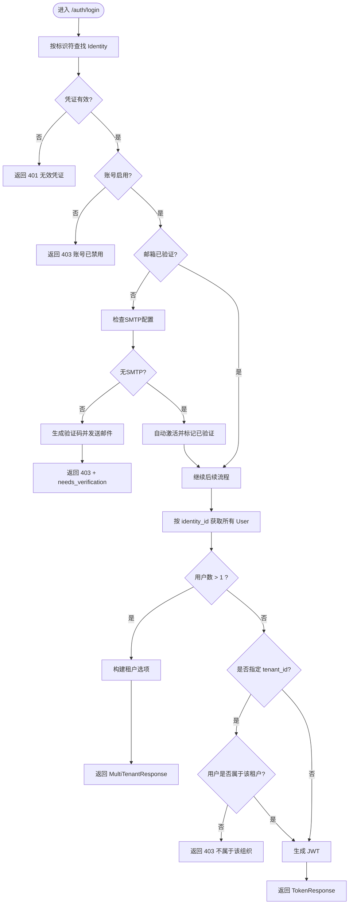
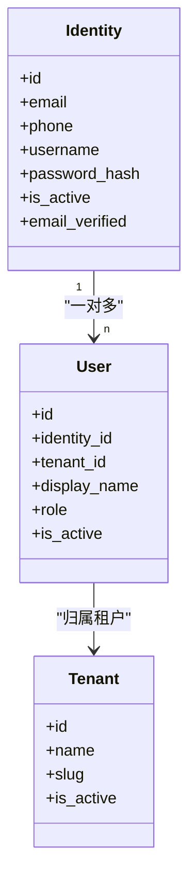
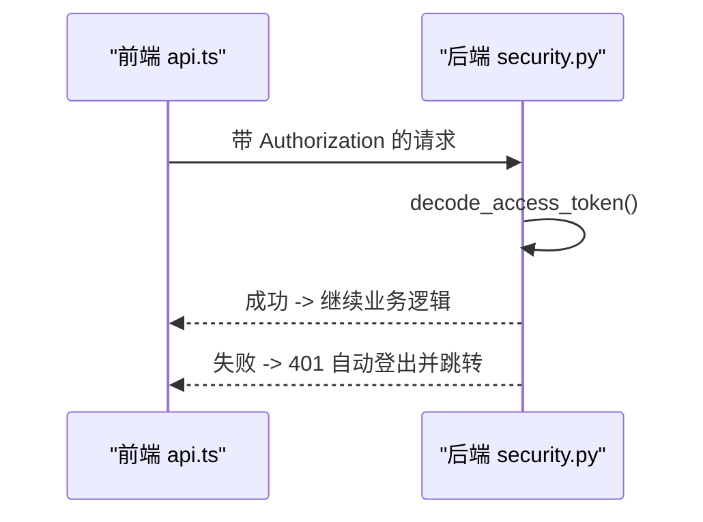
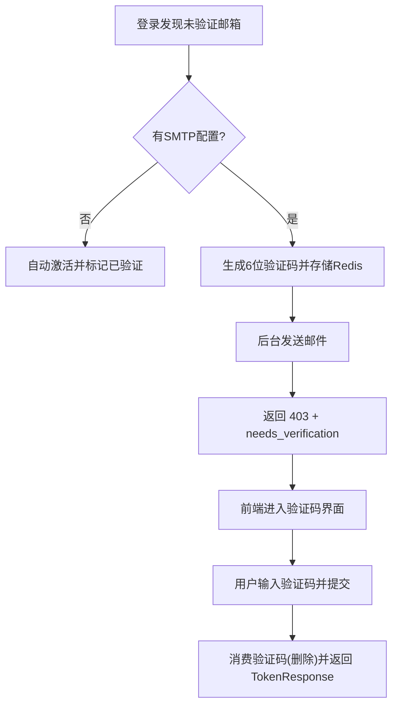
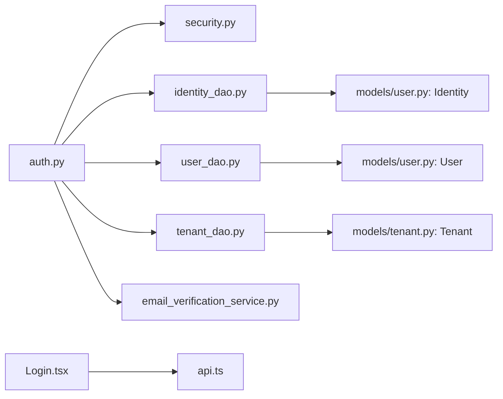
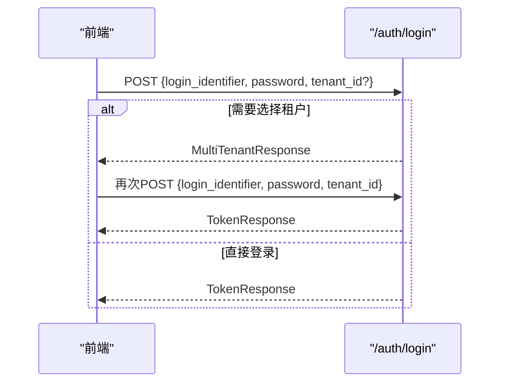

# 用户登录

<cite>
**本文引用的文件**   
- [backend/app/api/auth.py](file://backend/app/api/auth.py)
- [backend/app/core/security.py](file://backend/app/core/security.py)
- [backend/app/models/user.py](file://backend/app/models/user.py)
- [backend/app/models/tenant.py](file://backend/app/models/tenant.py)
- [backend/app/dao/user_dao.py](file://backend/app/dao/user_dao.py)
- [backend/app/dao/identity_dao.py](file://backend/app/dao/identity_dao.py)
- [backend/app/dao/tenant_dao.py](file://backend/app/dao/tenant_dao.py)
- [backend/app/schemas/schemas.py](file://backend/app/schemas/schemas.py)
- [backend/app/services/email_verification_service.py](file://backend/app/services/email_verification_service.py)
- [frontend/src/pages/Login.tsx](file://frontend/src/pages/Login.tsx)
- [frontend/src/services/api.ts](file://frontend/src/services/api.ts)
</cite>

## 目录
1. [简介](#简介)
2. [项目结构](#项目结构)
3. [核心组件](#核心组件)
4. [架构总览](#架构总览)
5. [详细组件分析](#详细组件分析)
6. [依赖关系分析](#依赖关系分析)
7. [性能考虑](#性能考虑)
8. [故障排查指南](#故障排查指南)
9. [结论](#结论)
10. [附录：API 使用示例与最佳实践](#附录api-使用示例与最佳实践)

## 简介
本文件面向后端与前端开发者，系统化阐述“用户登录”功能的设计与实现，包括：
- 密码登录流程（/auth/login）
- 多租户选择机制与跨租户访问控制
- JWT 令牌生成与校验、会话管理策略
- 邮箱验证状态检查与验证码重发
- 完整 API 调用示例、错误处理方案与安全最佳实践

## 项目结构
围绕登录能力，系统由以下层次组成：
- 接口层：FastAPI 路由定义认证相关端点（注册、登录、邮箱验证、切换租户等）
- 安全层：JWT 生成/解析、密码哈希/校验、角色权限校验
- 数据模型层：Identity（全局身份）、User（租户内成员）、Tenant（组织）
- DAO 层：对 Identity/User/Tenant 的异步查询封装
- 服务层：邮箱验证码生命周期管理（Redis 存储与发送）
- 前端层：登录页面、SSO/OAuth 入口、多租户选择弹窗、错误提示与跳转

**图表来源** 
- [backend/app/api/auth.py](file://backend/app/api/auth.py)
- [backend/app/core/security.py](file://backend/app/core/security.py)
- [backend/app/dao/identity_dao.py](file://backend/app/dao/identity_dao.py)
- [backend/app/dao/user_dao.py](file://backend/app/dao/user_dao.py)
- [backend/app/dao/tenant_dao.py](file://backend/app/dao/tenant_dao.py)
- [backend/app/models/user.py](file://backend/app/models/user.py)
- [backend/app/models/tenant.py](file://backend/app/models/tenant.py)
- [backend/app/services/email_verification_service.py](file://backend/app/services/email_verification_service.py)
- [frontend/src/pages/Login.tsx](file://frontend/src/pages/Login.tsx)

**章节来源**
- [backend/app/api/auth.py](file://backend/app/api/auth.py)
- [backend/app/core/security.py](file://backend/app/core/security.py)
- [backend/app/models/user.py](file://backend/app/models/user.py)
- [backend/app/models/tenant.py](file://backend/app/models/tenant.py)
- [backend/app/dao/user_dao.py](file://backend/app/dao/user_dao.py)
- [backend/app/dao/identity_dao.py](file://backend/app/dao/identity_dao.py)
- [backend/app/dao/tenant_dao.py](file://backend/app/dao/tenant_dao.py)
- [backend/app/services/email_verification_service.py](file://backend/app/services/email_verification_service.py)
- [frontend/src/pages/Login.tsx](file://frontend/src/pages/Login.tsx)
- [frontend/src/services/api.ts](file://frontend/src/services/api.ts)

## 核心组件
- 认证路由（/auth/*）：负责登录、注册、邮箱验证、租户切换、个人信息等
- 安全工具（JWT、密码哈希、鉴权依赖）：create_access_token、decode_access_token、get_current_user、get_authenticated_user
- 数据模型：Identity（全局唯一身份）、User（租户内成员）、Tenant（组织）
- DAO 层：按标识符查找 Identity、按 identity_id 获取用户列表、按 tenant_id 过滤
- 邮箱验证服务：生成/校验一次性验证码，存 Redis，支持邮件模板发送
- 前端登录页：表单提交、多租户选择弹窗、SSO/OAuth 入口、错误处理与跳转

**章节来源**
- [backend/app/api/auth.py](file://backend/app/api/auth.py)
- [backend/app/core/security.py](file://backend/app/core/security.py)
- [backend/app/models/user.py](file://backend/app/models/user.py)
- [backend/app/models/tenant.py](file://backend/app/models/tenant.py)
- [backend/app/dao/user_dao.py](file://backend/app/dao/user_dao.py)
- [backend/app/dao/identity_dao.py](file://backend/app/dao/identity_dao.py)
- [backend/app/services/email_verification_service.py](file://backend/app/services/email_verification_service.py)
- [frontend/src/pages/Login.tsx](file://frontend/src/pages/Login.tsx)
- [frontend/src/services/api.ts](file://frontend/src/services/api.ts)

## 架构总览
下图展示了从前端到后端的登录主流程，以及多租户选择与邮箱验证分支。

**图表来源** 
- [backend/app/api/auth.py](file://backend/app/api/auth.py)
- [backend/app/core/security.py](file://backend/app/core/security.py)
- [backend/app/dao/identity_dao.py](file://backend/app/dao/identity_dao.py)
- [backend/app/dao/user_dao.py](file://backend/app/dao/user_dao.py)
- [backend/app/dao/tenant_dao.py](file://backend/app/dao/tenant_dao.py)
- [backend/app/services/email_verification_service.py](file://backend/app/services/email_verification_service.py)
- [frontend/src/pages/Login.tsx](file://frontend/src/pages/Login.tsx)

## 详细组件分析

### 登录端点 /auth/login 流程
- 输入参数：login_identifier（邮箱/手机/用户名）、password、可选 tenant_id
- 步骤：
  1) 通过 login_identifier 查询 Identity
  2) 校验密码、账号是否启用、邮箱是否已验证
     - 若未配置 SMTP：自动激活并标记邮箱已验证
     - 否则：触发验证码邮件，返回 403 并要求输入验证码
  3) 根据 identity_id 查询所有关联的 User（多租户）
  4) 多租户处理：
     - 未传 tenant_id 且存在多个租户：返回 MultiTenantResponse，前端展示选择弹窗
     - 传入 tenant_id：校验该用户是否属于该租户（跨租户访问控制）
  5) 校验租户状态（禁用则拒绝）
  6) 生成 JWT 并返回 TokenResponse

**图表来源** 
- [backend/app/api/auth.py](file://backend/app/api/auth.py)
- [backend/app/dao/identity_dao.py](file://backend/app/dao/identity_dao.py)
- [backend/app/dao/user_dao.py](file://backend/app/dao/user_dao.py)
- [backend/app/dao/tenant_dao.py](file://backend/app/dao/tenant_dao.py)
- [backend/app/services/email_verification_service.py](file://backend/app/services/email_verification_service.py)

**章节来源**
- [backend/app/api/auth.py](file://backend/app/api/auth.py)
- [backend/app/dao/identity_dao.py](file://backend/app/dao/identity_dao.py)
- [backend/app/dao/user_dao.py](file://backend/app/dao/user_dao.py)
- [backend/app/dao/tenant_dao.py](file://backend/app/dao/tenant_dao.py)
- [backend/app/services/email_verification_service.py](file://backend/app/services/email_verification_service.py)

### 多租户选择与跨租户访问控制
- 当同一 Identity 对应多个 User（多租户），且请求未指定 tenant_id 时，后端返回 requires_tenant_selection 与 tenants 列表
- 前端显示选择弹窗；用户选择后携带 tenant_id 重新发起登录
- 若显式传入 tenant_id，后端会校验该用户是否属于该租户，否则返回 403 禁止跨租户访问
- 切换租户接口 /auth/switch-tenant 用于登录后切换上下文，并返回新的 access_token 和可选 redirect_url

**图表来源** 
- [backend/app/models/user.py](file://backend/app/models/user.py)
- [backend/app/models/tenant.py](file://backend/app/models/tenant.py)

**章节来源**
- [backend/app/api/auth.py](file://backend/app/api/auth.py)
- [backend/app/dao/user_dao.py](file://backend/app/dao/user_dao.py)
- [backend/app/dao/tenant_dao.py](file://backend/app/dao/tenant_dao.py)
- [backend/app/models/user.py](file://backend/app/models/user.py)
- [backend/app/models/tenant.py](file://backend/app/models/tenant.py)

### JWT 令牌生成与校验、会话管理
- 生成：create_access_token(user_id, role)，有效期由配置项决定
- 校验：decode_access_token 解析并验证签名与过期时间；get_current_user/get_authenticated_user 作为 FastAPI 依赖注入，加载用户并校验活跃状态
- 会话管理：客户端在 localStorage 保存 token，并在请求头 Authorization: Bearer <token> 中携带；前端 api.ts 在 401 时自动清理本地状态并重定向至登录页

**图表来源** 
- [backend/app/core/security.py](file://backend/app/core/security.py)
- [frontend/src/services/api.ts](file://frontend/src/services/api.ts)

**章节来源**
- [backend/app/core/security.py](file://backend/app/core/security.py)
- [frontend/src/services/api.ts](file://frontend/src/services/api.ts)

### 邮箱验证状态检查与验证码流程
- 登录时发现邮箱未验证：
  - 若无 SMTP：自动激活并标记已验证
  - 若有 SMTP：生成一次性验证码（6位），存入 Redis，并后台发送邮件
- 前端收到 needs_verification 后进入验证码输入界面，支持“重新发送验证码”
- 验证码消费为一次性，成功后返回 TokenResponse

**图表来源** 
- [backend/app/api/auth.py](file://backend/app/api/auth.py)
- [backend/app/services/email_verification_service.py](file://backend/app/services/email_verification_service.py)
- [frontend/src/pages/Login.tsx](file://frontend/src/pages/Login.tsx)

**章节来源**
- [backend/app/api/auth.py](file://backend/app/api/auth.py)
- [backend/app/services/email_verification_service.py](file://backend/app/services/email_verification_service.py)
- [frontend/src/pages/Login.tsx](file://frontend/src/pages/Login.tsx)

### 前端登录交互与错误处理
- 表单提交：调用 /auth/login，处理多租户选择弹窗、邀请码加入流程、公司初始化引导
- SSO/OAuth：根据域名解析租户，动态加载企业 SSO 或全局 OAuth 提供商
- 错误处理：区分网络错误、服务器不可达、账号禁用、邮箱已注册、跨租户访问被拒等场景，给出友好提示

**章节来源**
- [frontend/src/pages/Login.tsx](file://frontend/src/pages/Login.tsx)
- [frontend/src/services/api.ts](file://frontend/src/services/api.ts)

## 依赖关系分析
- 路由依赖：auth.py 依赖 security.py、各 DAO、schemas、email_verification_service
- 模型依赖：User 引用 Identity，Tenant 独立实体
- 前端依赖：Login.tsx 依赖 api.ts 提供的统一请求封装与错误处理

**图表来源** 
- [backend/app/api/auth.py](file://backend/app/api/auth.py)
- [backend/app/core/security.py](file://backend/app/core/security.py)
- [backend/app/dao/identity_dao.py](file://backend/app/dao/identity_dao.py)
- [backend/app/dao/user_dao.py](file://backend/app/dao/user_dao.py)
- [backend/app/dao/tenant_dao.py](file://backend/app/dao/tenant_dao.py)
- [backend/app/models/user.py](file://backend/app/models/user.py)
- [backend/app/models/tenant.py](file://backend/app/models/tenant.py)
- [backend/app/services/email_verification_service.py](file://backend/app/services/email_verification_service.py)
- [frontend/src/pages/Login.tsx](file://frontend/src/pages/Login.tsx)
- [frontend/src/services/api.ts](file://frontend/src/services/api.ts)

**章节来源**
- [backend/app/api/auth.py](file://backend/app/api/auth.py)
- [backend/app/core/security.py](file://backend/app/core/security.py)
- [backend/app/dao/identity_dao.py](file://backend/app/dao/identity_dao.py)
- [backend/app/dao/user_dao.py](file://backend/app/dao/user_dao.py)
- [backend/app/dao/tenant_dao.py](file://backend/app/dao/tenant_dao.py)
- [backend/app/models/user.py](file://backend/app/models/user.py)
- [backend/app/models/tenant.py](file://backend/app/models/tenant.py)
- [backend/app/services/email_verification_service.py](file://backend/app/services/email_verification_service.py)
- [frontend/src/pages/Login.tsx](file://frontend/src/pages/Login.tsx)
- [frontend/src/services/api.ts](file://frontend/src/services/api.ts)

## 性能考虑
- 密码哈希/校验使用线程池执行，避免阻塞事件循环
- 数据库操作尽量短事务，减少连接占用
- 验证码存储在 Redis，原子性写入/消费，降低锁竞争
- 多租户查询批量获取租户信息，减少往返

[本节为通用指导，不直接分析具体文件]

## 故障排查指南
- 401 无效凭证：检查 login_identifier 与 password 是否正确；确认 Identity.password_hash 是否存在
- 403 账号禁用：检查 Identity.is_active 与 Tenant.is_active
- 403 邮箱未验证：检查是否需要 SMTP 配置；查看 Redis 中验证码是否过期
- 403 跨租户访问：确认用户是否属于所选租户；必要时先选择正确租户再登录
- 404 无组织关联：该 Identity 尚未在任何租户下创建 User 记录
- 前端自动登出：检查 token 是否过期或无效；确认请求头 Authorization 是否正确设置

**章节来源**
- [backend/app/api/auth.py](file://backend/app/api/auth.py)
- [backend/app/core/security.py](file://backend/app/core/security.py)
- [frontend/src/services/api.ts](file://frontend/src/services/api.ts)

## 结论
登录功能以 Identity 为中心，结合 User/Tenant 的多租户隔离，实现了安全的密码登录、灵活的邮箱验证、健壮的跨租户访问控制与便捷的租户切换。JWT 与前端自动登出策略保障了会话安全与用户体验。建议在生产环境开启强密码策略、限制登录尝试次数、合理设置 JWT 过期时间与刷新策略，并完善审计日志。

[本节为总结，不直接分析具体文件]

## 附录：API 使用示例与最佳实践

### 登录 API 调用示例
- 请求路径：POST /api/auth/login
- 请求体字段：
  - login_identifier: 邮箱/手机/用户名
  - password: 明文密码
  - tenant_id: 可选，限定登录到某租户（专域 SSO 子域名模式可传递）
- 响应类型：
  - TokenResponse：包含 access_token、user、identity、needs_company_setup
  - MultiTenantResponse：requires_tenant_selection=true 时，前端需让用户选择租户后再重试

**图表来源** 
- [backend/app/api/auth.py](file://backend/app/api/auth.py)
- [backend/app/schemas/schemas.py](file://backend/app/schemas/schemas.py)
- [frontend/src/services/api.ts](file://frontend/src/services/api.ts)

**章节来源**
- [backend/app/api/auth.py](file://backend/app/api/auth.py)
- [backend/app/schemas/schemas.py](file://backend/app/schemas/schemas.py)
- [frontend/src/services/api.ts](file://frontend/src/services/api.ts)

### 邮箱验证与重发
- 触发条件：登录时邮箱未验证且 SMTP 可用
- 验证码：6 位数字，存储在 Redis，一次性消费
- 重发：前端调用 /auth/resend-verification，后端生成新验证码并发送邮件

**章节来源**
- [backend/app/api/auth.py](file://backend/app/api/auth.py)
- [backend/app/services/email_verification_service.py](file://backend/app/services/email_verification_service.py)
- [frontend/src/pages/Login.tsx](file://frontend/src/pages/Login.tsx)

### 安全性最佳实践
- 密码安全：使用 bcrypt 哈希，避免明文存储；前端不缓存密码
- 令牌安全：JWT 设置合理过期时间；服务端校验签名与过期；客户端 401 自动清理状态
- 防暴力破解：建议增加登录尝试限制与账户锁定策略（可在网关或中间件层实现）
- 跨租户隔离：严格校验用户与租户的归属关系，禁止越权访问
- 邮箱验证：验证码一次性、短期有效；无 SMTP 时谨慎自动激活策略
- 传输安全：全站 HTTPS；敏感接口限流与审计

[本节为通用指导，不直接分析具体文件]