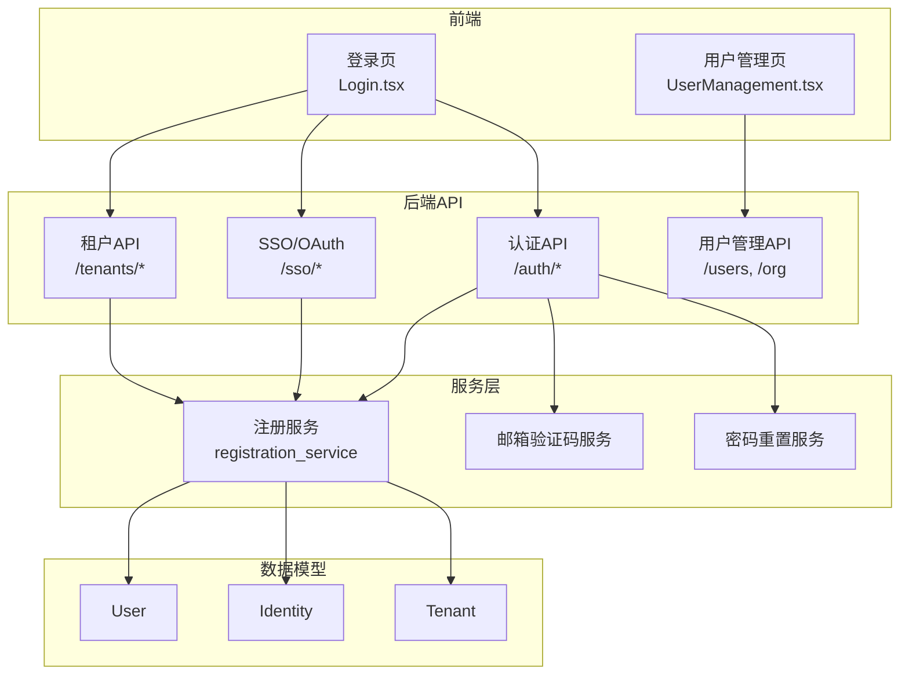
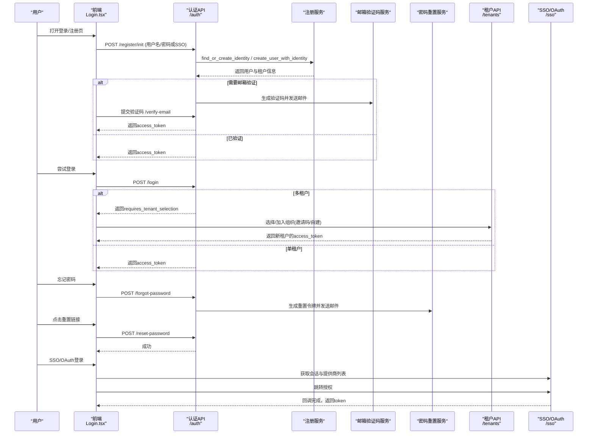
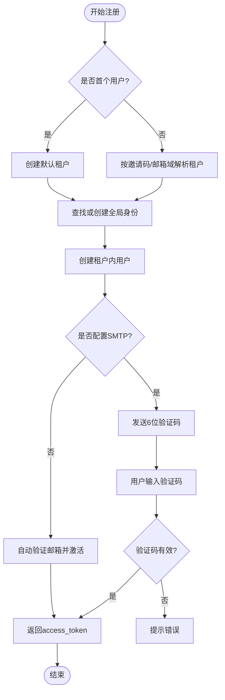
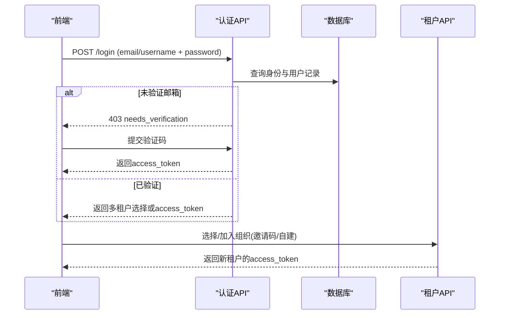
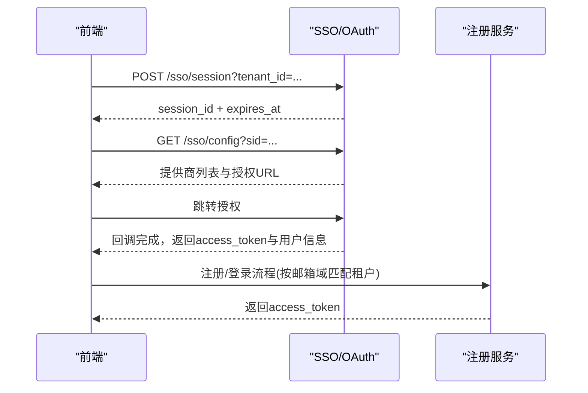
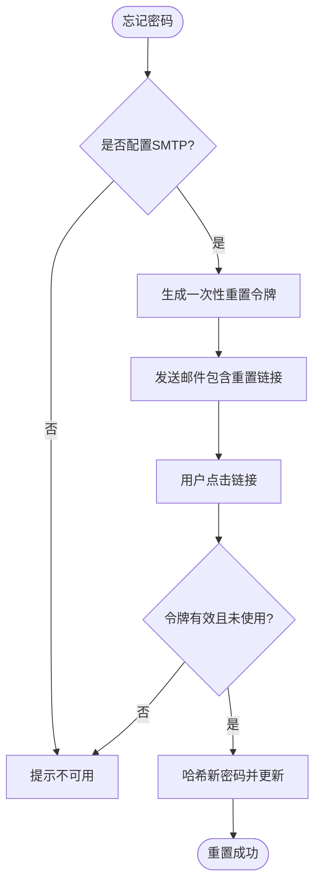
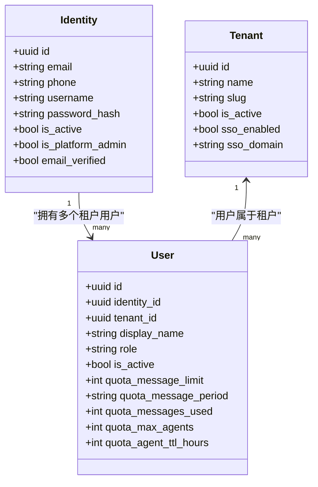
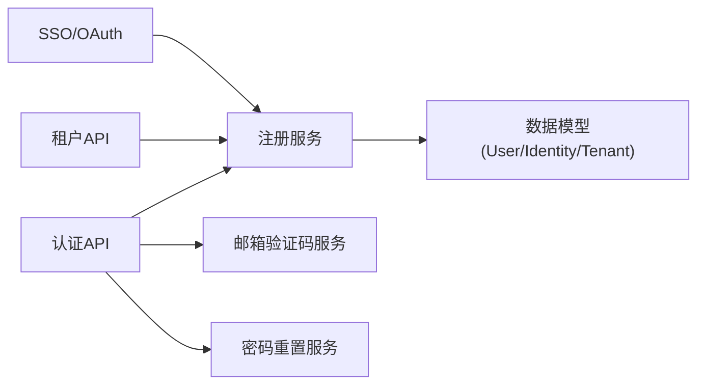

# 用户管理

<cite>
**本文引用的文件**   
- [backend/app/api/auth.py](file://backend/app/api/auth.py)
- [backend/app/api/users.py](file://backend/app/api/users.py)
- [backend/app/api/organization.py](file://backend/app/api/organization.py)
- [backend/app/api/sso.py](file://backend/app/api/sso.py)
- [backend/app/api/tenants.py](file://backend/app/api/tenants.py)
- [backend/app/services/registration_service.py](file://backend/app/services/registration_service.py)
- [backend/app/services/password_reset_service.py](file://backend/app/services/password_reset_service.py)
- [backend/app/services/email_verification_service.py](file://backend/app/services/email_verification_service.py)
- [backend/app/models/user.py](file://backend/app/models/user.py)
- [backend/app/models/tenant.py](file://backend/app/models/tenant.py)
- [frontend/src/pages/Login.tsx](file://frontend/src/pages/Login.tsx)
- [frontend/src/pages/UserManagement.tsx](file://frontend/src/pages/UserManagement.tsx)
</cite>

## 目录
1. [简介](#简介)
2. [项目结构](#项目结构)
3. [核心组件](#核心组件)
4. [架构总览](#架构总览)
5. [详细组件分析](#详细组件分析)
6. [依赖关系分析](#依赖关系分析)
7. [性能考虑](#性能考虑)
8. [故障排查指南](#故障排查指南)
9. [结论](#结论)
10. [附录：界面操作与截图指引](#附录界面操作与截图指引)

## 简介
本指南面向企业级用户管理，覆盖以下能力：
- 用户注册流程（邮箱验证码、邀请码机制）
- 登录方式（密码登录、SSO集成、OAuth第三方登录）
- 多租户切换与组织加入
- 密码重置
- 企业级特性：组织成员绑定、权限分配、用户状态管理、配额控制

文档同时提供流程图、时序图与类图，帮助非技术读者理解整体流程，并为开发者提供关键实现路径。

## 项目结构
- 后端API层
  - 认证与授权：/auth（注册、登录、邮箱验证、密码重置、多租户选择与切换）
  - SSO/OAuth：/sso（会话、配置、回调入口）
  - 租户/公司：/tenants（自建、加入、域名解析、Logo等）
  - 用户管理：/users、/org（列表、角色、配额更新）
- 服务层
  - 注册服务：处理身份发现/创建、SSO注册、租户判定、OrgMember绑定
  - 邮箱验证码服务：生成一次性验证码、发送模板邮件
  - 密码重置服务：Redis单使用令牌、构建重置链接
- 数据模型
  - Identity（全局身份）、User（租户内用户）、Tenant（租户/公司）
- 前端页面
  - Login.tsx：注册/登录、SSO/OAuth按钮、邮箱验证码输入、多租户选择弹窗
  - UserManagement.tsx：管理员用户列表、角色调整、配额编辑、邀请用户

**图表来源** 
- [backend/app/api/auth.py](file://backend/app/api/auth.py)
- [backend/app/api/sso.py](file://backend/app/api/sso.py)
- [backend/app/api/tenants.py](file://backend/app/api/tenants.py)
- [backend/app/services/registration_service.py](file://backend/app/services/registration_service.py)
- [backend/app/services/email_verification_service.py](file://backend/app/services/email_verification_service.py)
- [backend/app/services/password_reset_service.py](file://backend/app/services/password_reset_service.py)
- [backend/app/models/user.py](file://backend/app/models/user.py)
- [backend/app/models/tenant.py](file://backend/app/models/tenant.py)
- [frontend/src/pages/Login.tsx](file://frontend/src/pages/Login.tsx)
- [frontend/src/pages/UserManagement.tsx](file://frontend/src/pages/UserManagement.tsx)

**章节来源**
- [backend/app/api/auth.py](file://backend/app/api/auth.py)
- [backend/app/api/sso.py](file://backend/app/api/sso.py)
- [backend/app/api/tenants.py](file://backend/app/api/tenants.py)
- [backend/app/services/registration_service.py](file://backend/app/services/registration_service.py)
- [backend/app/services/email_verification_service.py](file://backend/app/services/email_verification_service.py)
- [backend/app/services/password_reset_service.py](file://backend/app/services/password_reset_service.py)
- [backend/app/models/user.py](file://backend/app/models/user.py)
- [backend/app/models/tenant.py](file://backend/app/models/tenant.py)
- [frontend/src/pages/Login.tsx](file://frontend/src/pages/Login.tsx)
- [frontend/src/pages/UserManagement.tsx](file://frontend/src/pages/UserManagement.tsx)

## 核心组件
- 认证与注册
  - 注册初始化：支持用户名/密码或SSO；首次用户自动创建默认租户；未配置SMTP时自动验证邮箱并激活
  - 邮箱验证码：生成6位一次性验证码，通过模板邮件发送；支持重新发送
  - 密码重置：基于Redis的单使用令牌，构建重置URL，安全更新密码
- 登录与多租户
  - 密码登录：校验身份、邮箱验证状态、组织状态；返回多租户选择或直登
  - 多租户切换：根据目标租户生成新token并可选携带重定向URL
- SSO/OAuth
  - SSO会话：创建扫码会话、查询状态、获取可用提供商及授权URL
  - OAuth第三方：Google/GitHub等，统一回调处理
- 用户与组织管理
  - 用户列表、角色变更、配额调整
  - 组织加入：邀请码加入、域名匹配自动归属、首次加入者成为管理员
  - OrgMember绑定：将平台用户与企业通讯录成员关联，同步联系方式

**章节来源**
- [backend/app/api/auth.py](file://backend/app/api/auth.py)
- [backend/app/api/sso.py](file://backend/app/api/sso.py)
- [backend/app/api/tenants.py](file://backend/app/api/tenants.py)
- [backend/app/services/registration_service.py](file://backend/app/services/registration_service.py)
- [backend/app/services/email_verification_service.py](file://backend/app/services/email_verification_service.py)
- [backend/app/services/password_reset_service.py](file://backend/app/services/password_reset_service.py)
- [backend/app/api/users.py](file://backend/app/api/users.py)
- [backend/app/api/organization.py](file://backend/app/api/organization.py)

## 架构总览
下图展示从前端到后端的用户管理主流程，包括注册、登录、SSO/OAuth、多租户切换与密码重置。

**图表来源** 
- [backend/app/api/auth.py](file://backend/app/api/auth.py)
- [backend/app/api/sso.py](file://backend/app/api/sso.py)
- [backend/app/api/tenants.py](file://backend/app/api/tenants.py)
- [backend/app/services/registration_service.py](file://backend/app/services/registration_service.py)
- [backend/app/services/email_verification_service.py](file://backend/app/services/email_verification_service.py)
- [backend/app/services/password_reset_service.py](file://backend/app/services/password_reset_service.py)
- [frontend/src/pages/Login.tsx](file://frontend/src/pages/Login.tsx)

## 详细组件分析

### 用户注册与邮箱验证
- 注册初始化
  - 支持用户名/密码或SSO；首次用户自动创建默认租户；未配置SMTP时自动验证邮箱并激活
  - 若存在冲突（邮箱/用户名），返回明确错误
- 邮箱验证码
  - 生成6位一次性验证码，存入Redis，设置过期时间
  - 模板邮件发送，支持重新发送
- 验证码校验
  - 成功后返回access_token，并根据needs_company_setup决定后续流程

**图表来源** 
- [backend/app/api/auth.py](file://backend/app/api/auth.py)
- [backend/app/services/registration_service.py](file://backend/app/services/registration_service.py)
- [backend/app/services/email_verification_service.py](file://backend/app/services/email_verification_service.py)

**章节来源**
- [backend/app/api/auth.py](file://backend/app/api/auth.py)
- [backend/app/services/registration_service.py](file://backend/app/services/registration_service.py)
- [backend/app/services/email_verification_service.py](file://backend/app/services/email_verification_service.py)

### 登录与多租户切换
- 密码登录
  - 校验身份、邮箱验证状态、组织状态；如未验证且无SMTP则自动激活并继续
  - 若同一身份属于多个租户，返回多租户选择列表
- 多租户切换
  - 选择目标租户后生成新的access_token，并可附带重定向URL（SSO自定义域名场景）

**图表来源** 
- [backend/app/api/auth.py](file://backend/app/api/auth.py)
- [backend/app/api/tenants.py](file://backend/app/api/tenants.py)

**章节来源**
- [backend/app/api/auth.py](file://backend/app/api/auth.py)
- [backend/app/api/tenants.py](file://backend/app/api/tenants.py)

### SSO与OAuth第三方登录
- SSO会话与配置
  - 创建扫码会话、查询状态、获取可用提供商及授权URL（飞书、钉钉、企微、Google Workspace等）
- OAuth第三方
  - 统一回调处理，交换code为token，拉取用户信息，完成注册/登录与租户匹配

**图表来源** 
- [backend/app/api/sso.py](file://backend/app/api/sso.py)
- [backend/app/services/registration_service.py](file://backend/app/services/registration_service.py)

**章节来源**
- [backend/app/api/sso.py](file://backend/app/api/sso.py)
- [backend/app/services/registration_service.py](file://backend/app/services/registration_service.py)

### 密码重置
- 请求重置
  - 校验邮件服务可用性，生成一次性重置令牌，构建重置URL并发送邮件
- 执行重置
  - 校验令牌有效性（单使用、过期即失效），哈希新密码并更新

**图表来源** 
- [backend/app/api/auth.py](file://backend/app/api/auth.py)
- [backend/app/services/password_reset_service.py](file://backend/app/services/password_reset_service.py)

**章节来源**
- [backend/app/api/auth.py](file://backend/app/api/auth.py)
- [backend/app/services/password_reset_service.py](file://backend/app/services/password_reset_service.py)

### 企业级用户管理：组织加入、权限分配、状态管理
- 组织加入
  - 邀请码加入：校验邀请码有效性、使用次数限制、租户状态；首次加入者为管理员
  - 域名匹配：按邮箱域自动归属租户
- 权限分配
  - 角色：platform_admin、org_admin、agent_admin、member；保护最后一名管理员不被降级
  - 配额：消息限额、周期、最大Agent数、Agent存活时长
- 状态管理
  - 用户与组织状态：is_active、email_verified；禁用组织或账号时的登录拦截

**图表来源** 
- [backend/app/models/user.py](file://backend/app/models/user.py)
- [backend/app/models/tenant.py](file://backend/app/models/tenant.py)

**章节来源**
- [backend/app/api/tenants.py](file://backend/app/api/tenants.py)
- [backend/app/api/users.py](file://backend/app/api/users.py)
- [backend/app/api/organization.py](file://backend/app/api/organization.py)
- [backend/app/services/registration_service.py](file://backend/app/services/registration_service.py)

## 依赖关系分析
- 模块耦合
  - auth.py依赖registration_service、email_verification_service、password_reset_service
  - sso.py依赖identity_providers与auth_provider_registry
  - tenants.py依赖registration_service进行组织加入与成员绑定
- 外部依赖
  - Redis用于验证码与重置令牌存储
  - SMTP用于邮件发送
  - 第三方OAuth/SSO提供商（飞书、钉钉、企微、Google Workspace等）

**图表来源** 
- [backend/app/api/auth.py](file://backend/app/api/auth.py)
- [backend/app/api/sso.py](file://backend/app/api/sso.py)
- [backend/app/api/tenants.py](file://backend/app/api/tenants.py)
- [backend/app/services/registration_service.py](file://backend/app/services/registration_service.py)

**章节来源**
- [backend/app/api/auth.py](file://backend/app/api/auth.py)
- [backend/app/api/sso.py](file://backend/app/api/sso.py)
- [backend/app/api/tenants.py](file://backend/app/api/tenants.py)
- [backend/app/services/registration_service.py](file://backend/app/services/registration_service.py)

## 性能考虑
- 异步与事务
  - 注册与登录使用异步数据库会话与事务边界优化，减少锁竞争
- CPU密集型操作
  - 密码哈希在事务外执行，避免阻塞数据库连接
- 缓存与令牌
  - 验证码与重置令牌使用Redis，保证单使用与快速过期清理
- 批量与分页
  - 用户列表支持搜索、排序与分页，降低前端渲染压力

[本节为通用指导，不直接分析具体文件]

## 故障排查指南
- 邮箱验证失败
  - 检查SMTP配置与模板渲染；确认验证码未过期；查看Redis中令牌是否存在
- 登录被拒绝
  - 检查身份是否被禁用、邮箱是否验证、组织是否被禁用；多租户选择是否正确
- SSO/OAuth异常
  - 检查提供商配置、回调地址、state参数传递；确认IP限制与多租户SSO开关
- 密码重置无效
  - 检查令牌是否已被使用或过期；确认重置URL构建正确

**章节来源**
- [backend/app/services/email_verification_service.py](file://backend/app/services/email_verification_service.py)
- [backend/app/services/password_reset_service.py](file://backend/app/services/password_reset_service.py)
- [backend/app/api/auth.py](file://backend/app/api/auth.py)
- [backend/app/api/sso.py](file://backend/app/api/sso.py)

## 结论
本系统提供了完整的企业级用户管理能力，涵盖注册、登录、SSO/OAuth、多租户切换、密码重置以及组织成员管理与权限控制。通过清晰的服务分层与健壮的错误处理，确保在高并发与安全要求下稳定运行。建议在生产环境启用SMTP与Redis，合理配置SSO/OAuth提供商，并结合企业通讯录进行成员同步。

[本节为总结，不直接分析具体文件]

## 附录：界面操作与截图指引
- 登录页（Login.tsx）
  - 支持邮箱/密码登录、SSO/OAuth按钮、邮箱验证码输入、多租户选择弹窗
  - 邀请链接进入时自动判断注册/登录模式
- 用户管理页（UserManagement.tsx）
  - 管理员可搜索用户、调整角色、编辑配额、邀请新用户
  - 显示用户来源（注册/飞书等）与Agent配额使用情况

[本节为概念性说明，不直接分析具体文件]