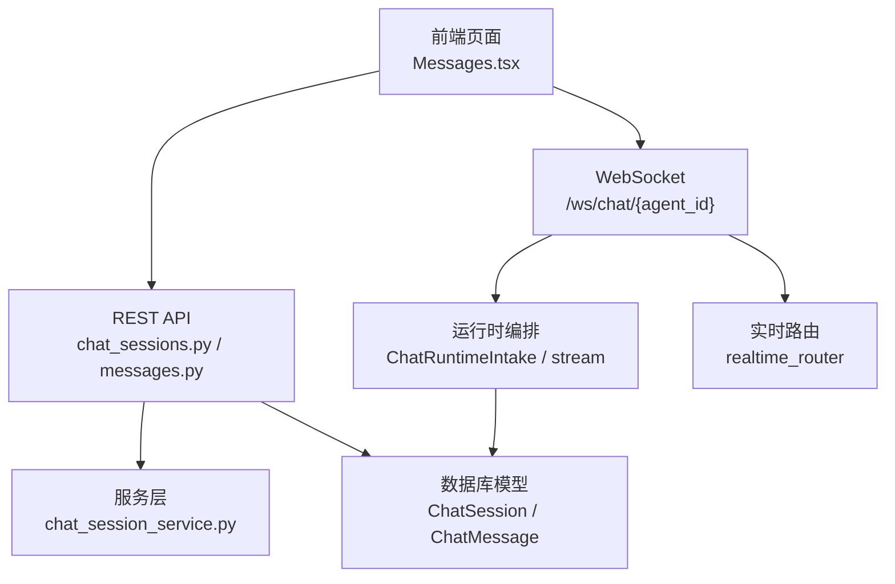
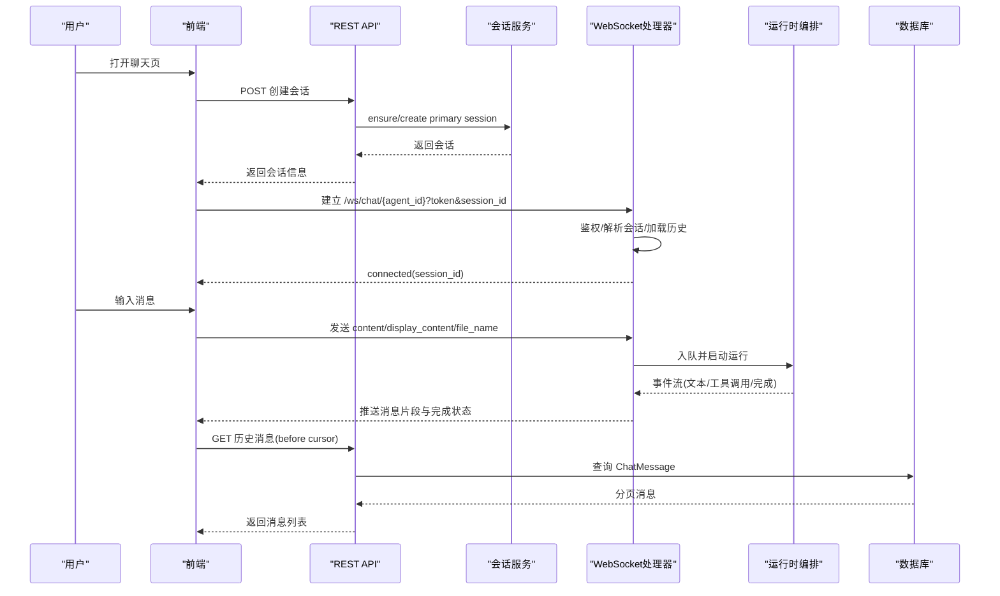
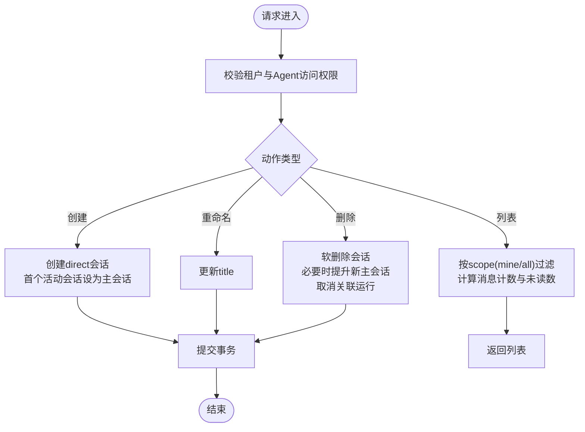
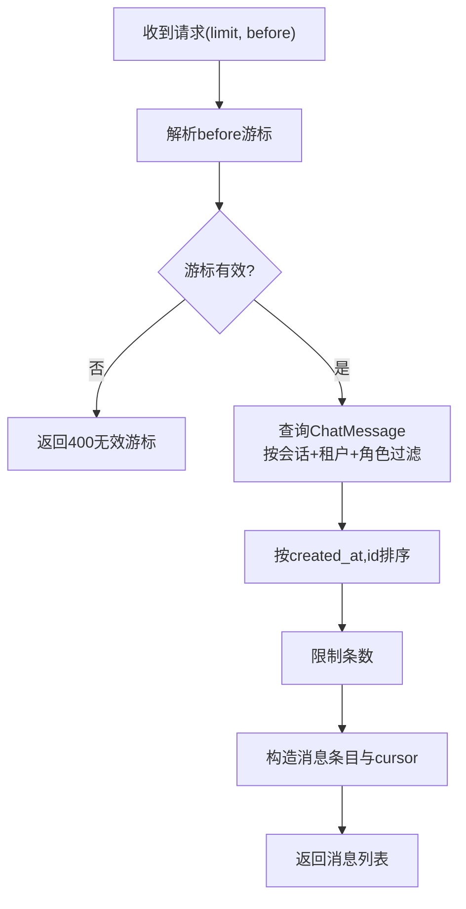
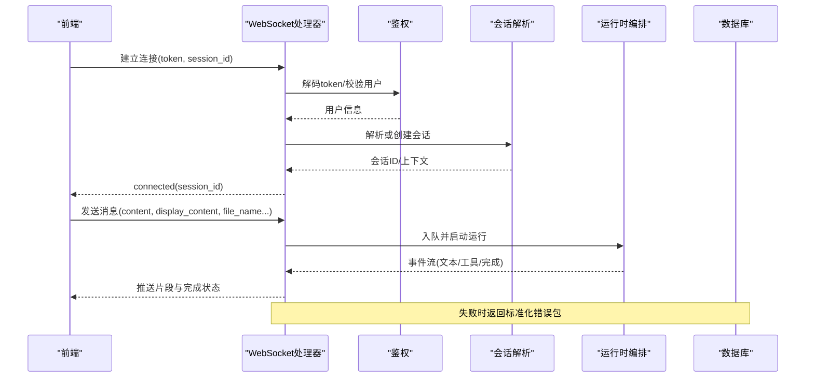
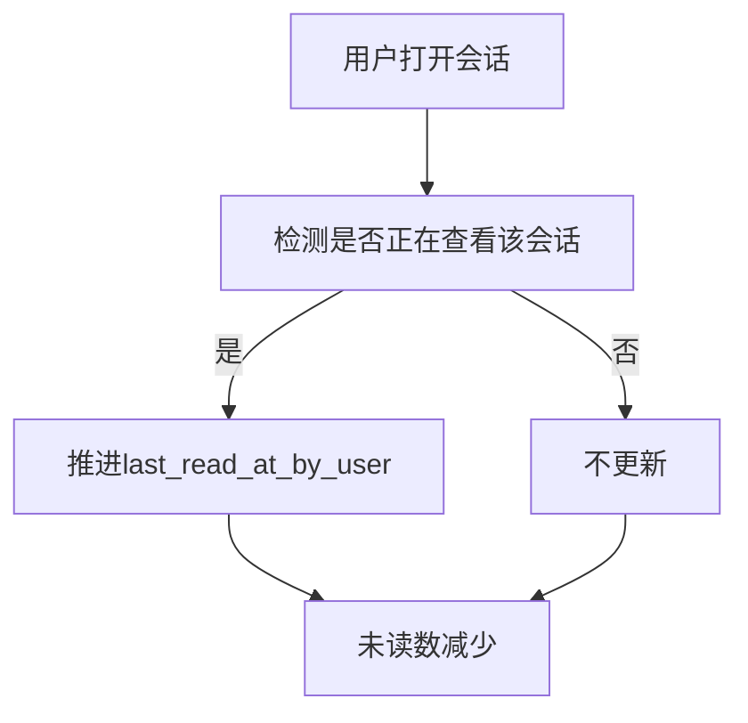
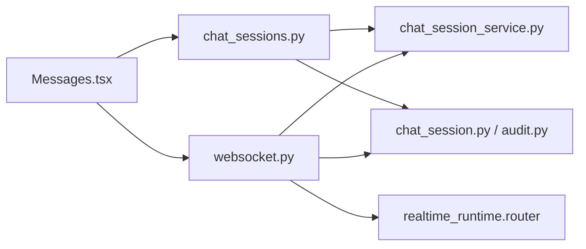

# 个人聊天

<cite>
**本文引用的文件**   
- [chat_sessions.py](file://backend/app/api/chat_sessions.py)
- [messages.py](file://backend/app/api/messages.py)
- [websocket.py](file://backend/app/api/websocket.py)
- [chat_session_service.py](file://backend/app/services/chat_session_service.py)
- [chat_session.py](file://backend/app/models/chat_session.py)
- [audit.py](file://backend/app/models/audit.py)
- [Messages.tsx](file://frontend/src/pages/Messages.tsx)
- [api.ts](file://frontend/src/services/api.ts)
</cite>

## 目录
1. [简介](#简介)
2. [项目结构](#项目结构)
3. [核心组件](#核心组件)
4. [架构总览](#架构总览)
5. [详细组件分析](#详细组件分析)
6. [依赖关系分析](#依赖关系分析)
7. [性能考虑](#性能考虑)
8. [故障排查指南](#故障排查指南)
9. [结论](#结论)
10. [附录：使用场景与操作步骤](#附录使用场景与操作步骤)

## 简介
本文件面向“个人聊天”功能，提供从创建与管理会话、发送与接收消息、消息类型支持、实时推送机制、已读状态管理、历史消息查看、到会话生命周期管理的完整说明。文档同时给出常见问题的解决方案与最佳实践，帮助开发者与使用者快速上手并稳定运行。

## 项目结构
个人聊天能力由后端 API、WebSocket 实时通道、数据模型与服务层共同构成；前端通过 REST 接口与 WebSocket 进行交互。

图表来源
- [chat_sessions.py](file://backend/app/api/chat_sessions.py)
- [messages.py](file://backend/app/api/messages.py)
- [websocket.py](file://backend/app/api/websocket.py)
- [chat_session_service.py](file://backend/app/services/chat_session_service.py)
- [chat_session.py](file://backend/app/models/chat_session.py)
- [audit.py](file://backend/app/models/audit.py)
- [Messages.tsx](file://frontend/src/pages/Messages.tsx)
- [api.ts](file://frontend/src/services/api.ts)

章节来源
- [chat_sessions.py](file://backend/app/api/chat_sessions.py)
- [messages.py](file://backend/app/api/messages.py)
- [websocket.py](file://backend/app/api/websocket.py)
- [chat_session_service.py](file://backend/app/services/chat_session_service.py)
- [chat_session.py](file://backend/app/models/chat_session.py)
- [audit.py](file://backend/app/models/audit.py)
- [Messages.tsx](file://frontend/src/pages/Messages.tsx)
- [api.ts](file://frontend/src/services/api.ts)

## 核心组件
- 会话管理 API：创建、列出、重命名、删除（软删）个人会话，支持按用户维度过滤与权限校验。
- 消息查询 API：分页获取会话历史消息，基于游标 before 参数实现高效翻页。
- 实时通信：WebSocket 长连接，认证与会话解析、消息入队、流式输出、错误处理。
- 会话服务：主会话选择与提升、会话创建与软删、取消运行任务等事务性操作。
- 数据模型：统一会话模型 ChatSession 与消息模型 ChatMessage，支持多通道与多角色。
- 前端页面：消息收件箱展示、轮询刷新、标记已读、未读数统计。

章节来源
- [chat_sessions.py](file://backend/app/api/chat_sessions.py)
- [messages.py](file://backend/app/api/messages.py)
- [websocket.py](file://backend/app/api/websocket.py)
- [chat_session_service.py](file://backend/app/services/chat_session_service.py)
- [chat_session.py](file://backend/app/models/chat_session.py)
- [audit.py](file://backend/app/models/audit.py)
- [Messages.tsx](file://frontend/src/pages/Messages.tsx)

## 架构总览
个人聊天的端到端流程如下：前端通过 REST 创建或列举会话，通过 WebSocket 建立实时通道；服务端完成鉴权、会话解析、消息持久化与运行时编排，并将结果流式推送到前端。

图表来源
- [chat_sessions.py](file://backend/app/api/chat_sessions.py)
- [websocket.py](file://backend/app/api/websocket.py)
- [chat_session_service.py](file://backend/app/services/chat_session_service.py)
- [audit.py](file://backend/app/models/audit.py)

## 详细组件分析

### 会话管理 API（创建、列表、重命名、删除）
- 创建会话：为当前租户下的活跃用户创建 direct 类型会话，首个活动会话自动成为主会话。
- 列出会话：支持 mine/all 两种范围，mine 仅返回当前用户的会话；all 需要管理员或创建者权限。
- 重命名会话：更新会话标题。
- 删除会话：软删除会话，若为主会话则提升其他活动会话为主会话，并取消相关前台协作运行。

图表来源
- [chat_sessions.py](file://backend/app/api/chat_sessions.py)
- [chat_session_service.py](file://backend/app/services/chat_session_service.py)

章节来源
- [chat_sessions.py](file://backend/app/api/chat_sessions.py)
- [chat_session_service.py](file://backend/app/services/chat_session_service.py)

### 历史消息查询（分页与游标）
- 接口：GET /agents/{agent_id}/sessions/{session_id}/messages
- 参数：limit（1-500）、before（游标，格式 ISO时间|消息UUID）
- 行为：按 created_at 与 id 排序，避免漏消息；兼容旧版仅时间游标。
- 输出：每条消息包含 id、role、content、created_at、cursor。

图表来源
- [chat_sessions.py](file://backend/app/api/chat_sessions.py)

章节来源
- [chat_sessions.py](file://backend/app/api/chat_sessions.py)

### WebSocket 实时聊天（连接、消息、流式输出）
- 连接建立：/ws/chat/{agent_id}?token&session_id&lang
- 鉴权与会话解析：验证 token、查找或创建 direct 会话、加载历史上下文。
- 消息处理：接受 content、display_content、file_name、model_id、message_id、run_id、correlation_id 等字段；支持 onboarding_trigger 特殊类型。
- 运行时编排：将消息入队，启动 langgraph 运行，流式推送事件（文本片段、工具调用、完成）。
- 错误处理：标准化错误包，包含 code、message、stage、trace_id、run_id、agent_id。

图表来源
- [websocket.py](file://backend/app/api/websocket.py)

章节来源
- [websocket.py](file://backend/app/api/websocket.py)

### 消息类型支持（文本、文件、图片等）
- 文本消息：content 字段承载正文，display_content 用于展示富文本或格式化内容。
- 文件与图片：通过 file_name 传递文件名，实际二进制上传走文件接口；聊天中可引用文件路径或链接。
- 工具调用：role=tool_call 的消息记录工具执行过程与结果，便于审计与调试。
- 思考过程：thinking 字段可用于保存模型推理摘要（可选）。

章节来源
- [audit.py](file://backend/app/models/audit.py)
- [websocket.py](file://backend/app/api/websocket.py)

### 已读状态管理与收件箱
- 会话级已读：last_read_at_by_user 记录用户最后阅读时间，未读数基于该时间之后的非 user 消息计算。
- 在线已读推进：当用户正在查看某会话时，服务端会推进 last_read_at_by_user。
- 收件箱：/messages/inbox 返回最近消息（来自 agent-to-agent 的会话），前端轮询刷新并支持点击标记单条已读、全部已读。

图表来源
- [websocket.py](file://backend/app/api/websocket.py)
- [messages.py](file://backend/app/api/messages.py)
- [Messages.tsx](file://frontend/src/pages/Messages.tsx)

章节来源
- [websocket.py](file://backend/app/api/websocket.py)
- [messages.py](file://backend/app/api/messages.py)
- [Messages.tsx](file://frontend/src/pages/Messages.tsx)

### 会话生命周期管理
- 主会话策略：同一租户/用户/Agent 下，首个活动会话被提升为主会话；删除主会话时自动提升下一个活动会话。
- 软删除：deleted_at 标记删除，保留历史数据；同时取消前台协作运行，保证一致性。
- 并发安全：使用数据库 advisory lock 序列化主会话变更，避免竞态。

章节来源
- [chat_session_service.py](file://backend/app/services/chat_session_service.py)
- [chat_sessions.py](file://backend/app/api/chat_sessions.py)

### 历史消息查看与搜索过滤
- 历史查看：通过 before 游标分页拉取，适合无限滚动与回溯。
- 搜索与过滤：当前 API 未提供全文检索与高级过滤；可在前端对本地消息进行关键词匹配，或扩展后端索引与查询。

章节来源
- [chat_sessions.py](file://backend/app/api/chat_sessions.py)

### 消息撤回与编辑
- 当前设计：消息以 append-only 方式持久化，未提供直接撤回/编辑接口。
- 建议方案：通过新增一条“编辑/撤回”类型的系统消息（role=system）表达变更意图，并在前端渲染时合并显示。

[本节为概念性说明，不直接分析具体文件]

## 依赖关系分析
个人聊天模块的关键依赖关系如下：

图表来源
- [chat_sessions.py](file://backend/app/api/chat_sessions.py)
- [chat_session_service.py](file://backend/app/services/chat_session_service.py)
- [chat_session.py](file://backend/app/models/chat_session.py)
- [audit.py](file://backend/app/models/audit.py)
- [websocket.py](file://backend/app/api/websocket.py)
- [Messages.tsx](file://frontend/src/pages/Messages.tsx)

章节来源
- [chat_sessions.py](file://backend/app/api/chat_sessions.py)
- [chat_session_service.py](file://backend/app/services/chat_session_service.py)
- [chat_session.py](file://backend/app/models/chat_session.py)
- [audit.py](file://backend/app/models/audit.py)
- [websocket.py](file://backend/app/api/websocket.py)
- [Messages.tsx](file://frontend/src/pages/Messages.tsx)

## 性能考虑
- 分页与游标：使用 before 游标避免深分页性能问题，确保排序键包含 created_at 与 id。
- 未读数计算：基于 last_read_at_by_user 与消息时间戳聚合，避免全量扫描。
- 实时推送：WebSocket 流式输出降低首屏延迟；连接管理器按 agent/session/user 维度路由消息。
- 并发控制：会话主切换使用 advisory lock 防止竞态；运行取消队列保证资源释放。
- 前端轮询：收件箱每 15 秒刷新一次，可根据业务调整频率。

[本节为通用指导，不直接分析具体文件]

## 故障排查指南
- 认证失败：检查 token 是否有效，WebSocket 连接前需携带正确 token。
- 会话不存在：确认 session_id 属于当前租户/用户/Agent，且未被软删除。
- 运行时状态不匹配：attach_run 需要正确的 run_id 与 cursor，确保来源一致。
- 未读数不更新：确认用户正在查看该会话，服务端才会推进 last_read_at_by_user。
- 历史消息缺失：检查 before 游标是否正确回传，避免跳过相同时间戳的消息。

章节来源
- [websocket.py](file://backend/app/api/websocket.py)
- [chat_sessions.py](file://backend/app/api/chat_sessions.py)

## 结论
个人聊天功能通过 REST 与 WebSocket 协同，实现了完整的会话生命周期管理、消息收发与实时推送、已读状态跟踪与历史回溯。建议在后续迭代中补充消息全文检索、编辑/撤回语义以及更细粒度的权限控制，以提升用户体验与可维护性。

[本节为总结性内容，不直接分析具体文件]

## 附录：使用场景与操作步骤

### 场景一：首次创建个人聊天会话
- 步骤：
  - 前端调用 POST /agents/{agent_id}/sessions 创建会话。
  - 后端创建 direct 会话并提升为首个主会话。
  - 前端建立 WebSocket 连接 /ws/chat/{agent_id}?token&session_id。
  - 服务端返回 connected(session_id)，开始对话。
- 参考：
  - [chat_sessions.py](file://backend/app/api/chat_sessions.py)
  - [websocket.py](file://backend/app/api/websocket.py)

### 场景二：发送文本与文件
- 步骤：
  - 前端通过 WebSocket 发送 {content, display_content, file_name}。
  - 后端入队并启动运行，流式推送回复片段。
  - 文件二进制通过文件接口上传，聊天中引用路径或链接。
- 参考：
  - [websocket.py](file://backend/app/api/websocket.py)
  - [api.ts](file://frontend/src/services/api.ts)

### 场景三：查看历史消息与分页
- 步骤：
  - 前端调用 GET /agents/{agent_id}/sessions/{session_id}/messages?limit=50&before=cursor。
  - 后端按游标分页返回消息，前端拼接滚动列表。
- 参考：
  - [chat_sessions.py](file://backend/app/api/chat_sessions.py)

### 场景四：标记已读与未读数
- 步骤：
  - 用户打开会话，服务端推进 last_read_at_by_user。
  - 前端轮询 /messages/inbox 与 /messages/unread-count，点击单条或全部已读。
- 参考：
  - [websocket.py](file://backend/app/api/websocket.py)
  - [messages.py](file://backend/app/api/messages.py)
  - [Messages.tsx](file://frontend/src/pages/Messages.tsx)

### 场景五：删除会话与恢复主会话
- 步骤：
  - 前端调用 DELETE /agents/{agent_id}/sessions/{session_id}。
  - 后端软删除会话，若为主会话则提升下一个活动会话为主。
  - 取消关联的前台运行，释放资源。
- 参考：
  - [chat_sessions.py](file://backend/app/api/chat_sessions.py)
  - [chat_session_service.py](file://backend/app/services/chat_session_service.py)