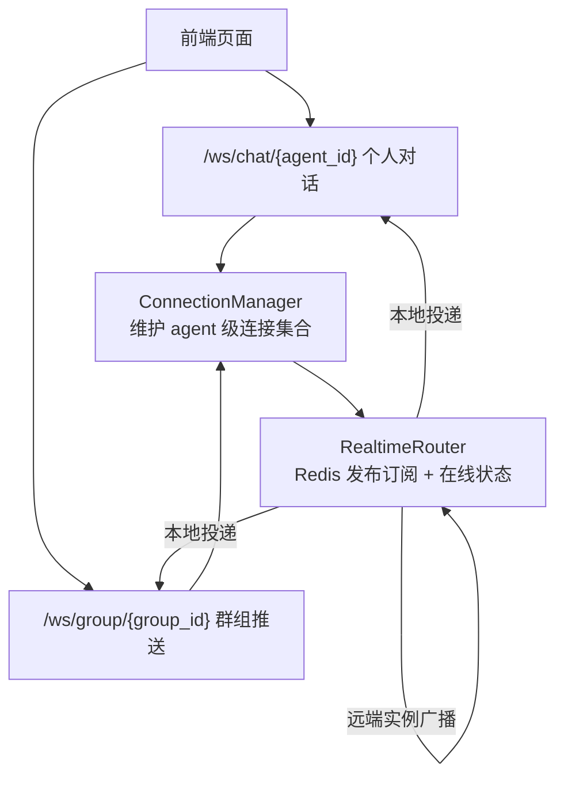
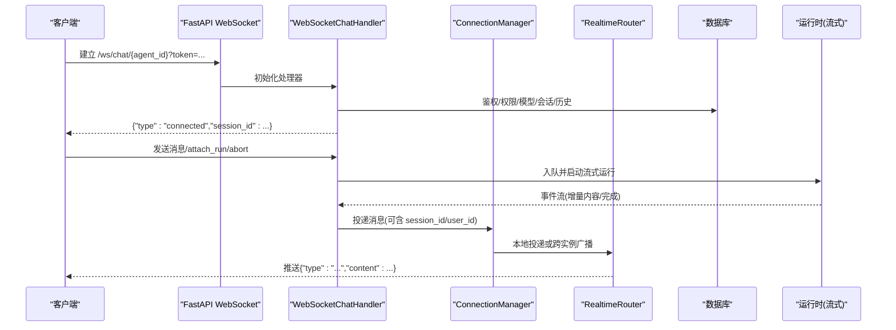
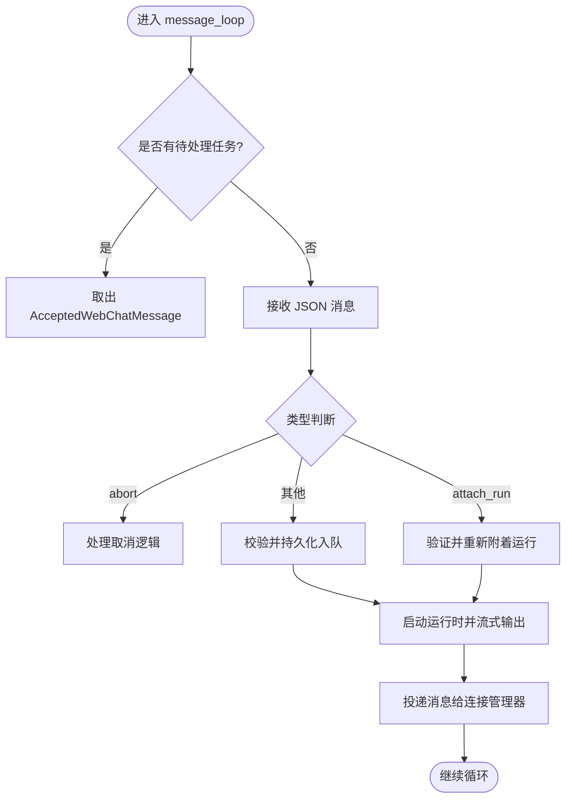
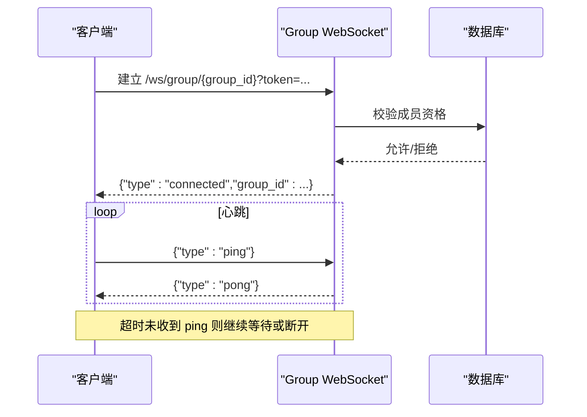
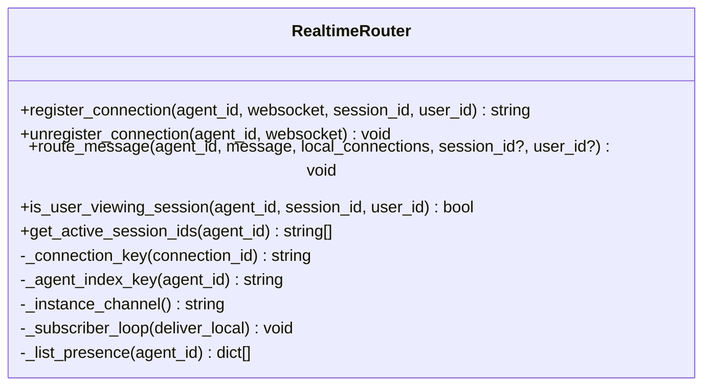
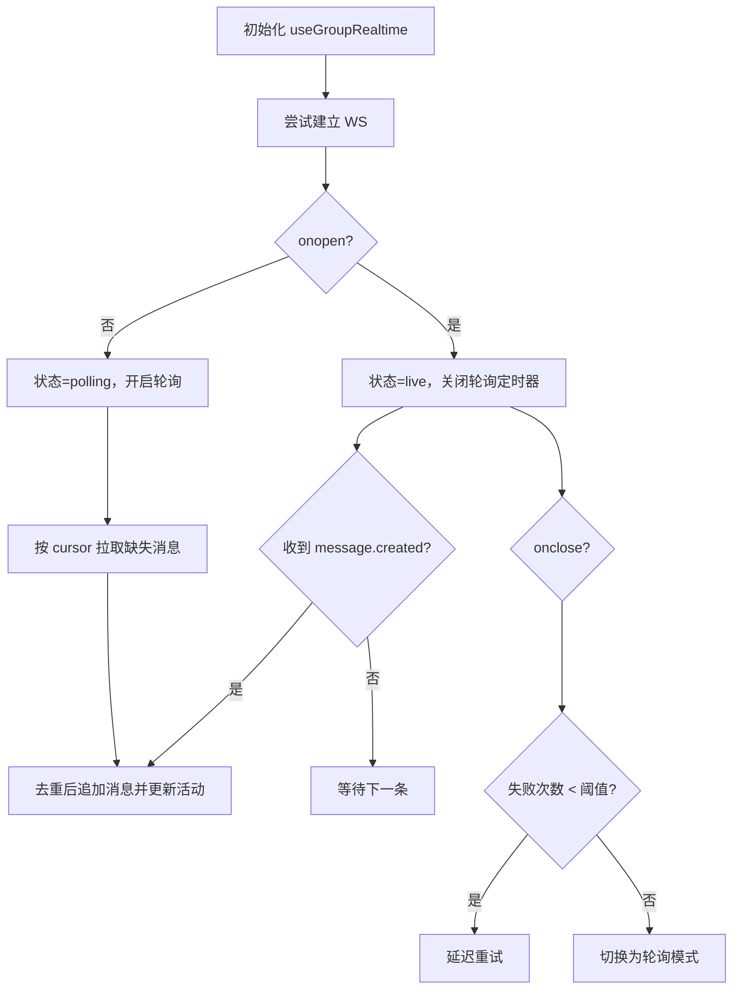
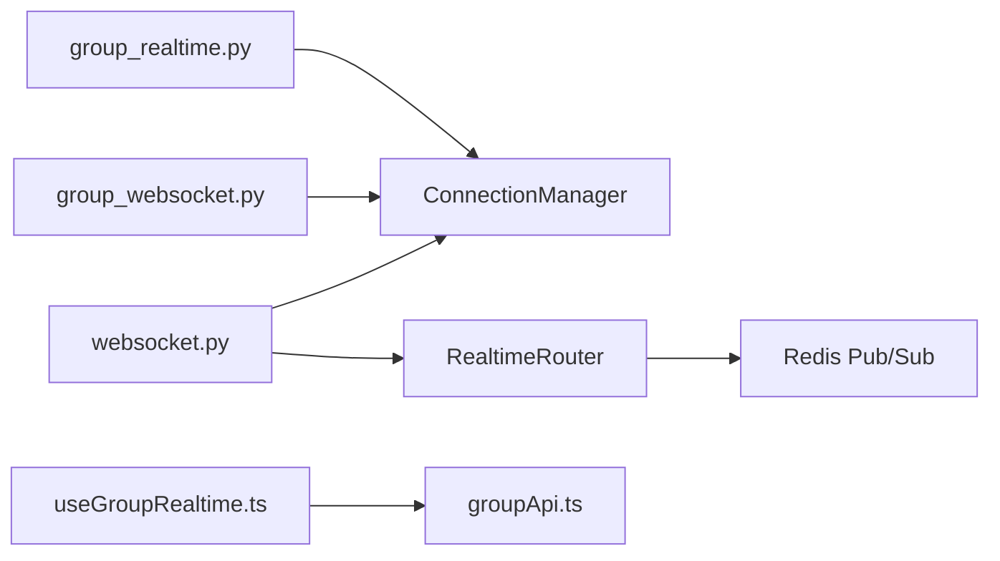

# 实时通信

<cite>
**本文引用的文件**   
- [backend/app/api/websocket.py](file://backend/app/api/websocket.py)
- [backend/app/api/group_websocket.py](file://backend/app/api/group_websocket.py)
- [backend/app/services/realtime.py](file://backend/app/services/realtime.py)
- [backend/app/services/realtime_runtime/router.py](file://backend/app/services/realtime_runtime/router.py)
- [backend/app/services/group_realtime.py](file://backend/app/services/group_realtime.py)
- [frontend/src/hooks/useGroupRealtime.ts](file://frontend/src/hooks/useGroupRealtime.ts)
- [frontend/src/services/groupApi.ts](file://frontend/src/services/groupApi.ts)
</cite>

## 目录
1. [简介](#简介)
2. [项目结构](#项目结构)
3. [核心组件](#核心组件)
4. [架构总览](#架构总览)
5. [详细组件分析](#详细组件分析)
6. [依赖关系分析](#依赖关系分析)
7. [性能考量](#性能考量)
8. [故障排查指南](#故障排查指南)
9. [结论](#结论)
10. [附录](#附录)

## 简介
本技术文档围绕仓库中的实时通信子系统，系统性说明 WebSocket 连接建立与维护、消息推送协议、心跳检测与健康检查、事件与错误模型、重连策略、前端数据绑定与状态同步、离线处理、性能优化、并发连接管理以及消息队列集成等。文档同时提供调试方法与故障排查建议，帮助开发者快速定位问题并提升系统稳定性。

## 项目结构
后端通过 FastAPI 暴露两类 WebSocket 端点：
- 个人对话（Agent）WebSocket：用于用户与 Agent 的实时聊天与流式输出。
- 群组 WebSocket：用于原生 Group 会话中已提交消息的实时推送。

跨实例路由与在线状态由基于 Redis 的 RealtimeRouter 提供，支持本地直发与远端实例间广播。

图表来源 
- [backend/app/api/websocket.py:229-239](file://backend/app/api/websocket.py#L229-L239)
- [backend/app/api/group_websocket.py:51-82](file://backend/app/api/group_websocket.py#L51-L82)
- [backend/app/services/realtime_runtime/router.py:21-59](file://backend/app/services/realtime_runtime/router.py#L21-L59)

章节来源
- [backend/app/api/websocket.py:229-239](file://backend/app/api/websocket.py#L229-L239)
- [backend/app/api/group_websocket.py:51-82](file://backend/app/api/group_websocket.py#L51-L82)
- [backend/app/services/realtime_runtime/router.py:21-59](file://backend/app/services/realtime_runtime/router.py#L21-L59)

## 核心组件
- WebSocketChatHandler：负责个人对话连接的认证、权限校验、会话解析、历史加载、消息循环、运行时编排与持久化。
- ConnectionManager：按 agent_id 维度维护活跃 WebSocket 连接，并提供按 session_id/user_id 过滤的消息投递能力。
- RealtimeRouter：基于 Redis 的连接注册、在线状态维护、跨实例消息路由与本地投递。
- Group WebSocket：群组场景下的认证、成员资格校验、心跳 ping/pong 与消息推送。
- GroupRealtime 服务：将已提交的群组消息序列化为统一 payload 并通过 manager 推送。

章节来源
- [backend/app/api/websocket.py:242-391](file://backend/app/api/websocket.py#L242-L391)
- [backend/app/api/websocket.py:76-162](file://backend/app/api/websocket.py#L76-L162)
- [backend/app/services/realtime_runtime/router.py:21-197](file://backend/app/services/realtime_runtime/router.py#L21-L197)
- [backend/app/api/group_websocket.py:51-117](file://backend/app/api/group_websocket.py#L51-L117)
- [backend/app/services/group_realtime.py:24-66](file://backend/app/services/group_realtime.py#L24-L66)

## 架构总览
下图展示了从客户端到后端的端到端流程，包括认证、会话建立、消息入队、运行时流式输出与跨实例路由。

图表来源 
- [backend/app/api/websocket.py:229-239](file://backend/app/api/websocket.py#L229-L239)
- [backend/app/api/websocket.py:275-391](file://backend/app/api/websocket.py#L275-L391)
- [backend/app/services/realtime_runtime/router.py:85-138](file://backend/app/services/realtime_runtime/router.py#L85-L138)

## 详细组件分析

### 个人对话 WebSocket（/ws/chat）
- 连接建立
  - 接受连接后立即返回 connected 事件，携带 session_id。
  - 在后台完成鉴权、权限校验、模型加载、会话解析与历史加载。
- 消息循环
  - 支持普通消息、attach_run（重新附着已有运行）、abort（取消）。
  - 对 onboarding_trigger 特殊处理，确保幂等与合规。
- 错误模型
  - 统一的 error 包体，包含 code/message/run_id/agent_id/stage/trace_id 等字段，便于前端与日志追踪。
- 会话与历史
  - 优先使用传入 session_id，否则选择主会话或创建新会话。
  - 历史消息按上下文窗口限制加载并转换为 LLM 输入格式。

图表来源 
- [backend/app/api/websocket.py:506-562](file://backend/app/api/websocket.py#L506-L562)
- [backend/app/api/websocket.py:588-677](file://backend/app/api/websocket.py#L588-L677)
- [backend/app/api/websocket.py:679-793](file://backend/app/api/websocket.py#L679-L793)

章节来源
- [backend/app/api/websocket.py:229-239](file://backend/app/api/websocket.py#L229-L239)
- [backend/app/api/websocket.py:275-391](file://backend/app/api/websocket.py#L275-L391)
- [backend/app/api/websocket.py:506-562](file://backend/app/api/websocket.py#L506-L562)
- [backend/app/api/websocket.py:588-677](file://backend/app/api/websocket.py#L588-L677)
- [backend/app/api/websocket.py:679-793](file://backend/app/api/websocket.py#L679-L793)

### 群组 WebSocket（/ws/group）
- 连接建立
  - 校验 token 与群组成员资格，通过后发送 connected 事件。
- 心跳机制
  - 客户端每 30 秒内需发送一次 ping，服务端回 pong；超时则视为空闲，继续等待或断开。
- 消息推送
  - 仅推送已提交的公开消息，payload 包含 id/role/content/participant_id/sender_name/mentions/created_at/cursor。
- 断线处理
  - 退出时清理连接，避免僵尸连接。

图表来源 
- [backend/app/api/group_websocket.py:51-117](file://backend/app/api/group_websocket.py#L51-L117)

章节来源
- [backend/app/api/group_websocket.py:51-117](file://backend/app/api/group_websocket.py#L51-L117)

### 连接管理与跨实例路由（RealtimeRouter）
- 连接注册
  - 为每个连接生成唯一 connection_id，记录 agent_id/session_id/user_id/instance_id，设置 TTL。
- 消息路由
  - 先尝试本地投递（按 session_id/user_id 过滤），再统计远端实例目标，通过 Redis 发布订阅广播。
- 在线状态查询
  - 支持查询某用户是否正在查看某会话、获取某 agent 的所有活跃 session_id。

图表来源 
- [backend/app/services/realtime_runtime/router.py:21-197](file://backend/app/services/realtime_runtime/router.py#L21-L197)

章节来源
- [backend/app/services/realtime_runtime/router.py:21-197](file://backend/app/services/realtime_runtime/router.py#L21-L197)

### 群组消息推送（GroupRealtime）
- 序列化
  - 将 ChatMessage 序列化为标准 payload，包含 cursor（时间戳|id）用于前后端排序与补全。
- 发布
  - 通过 manager.send_message 进行本地投递与跨实例广播，失败不影响已提交消息的可靠性。

章节来源
- [backend/app/services/group_realtime.py:24-66](file://backend/app/services/group_realtime.py#L24-L66)

### 前端实时钩子（useGroupRealtime）
- 连接策略
  - 优先 WebSocket，失败阈值达到后降级为轮询（POLL_INTERVAL_MS=4s）。
  - 指数退避重试（基础间隔 2s，乘以失败次数）。
- 断线恢复
  - 根据 lastCursor 拉取缺失消息，最多分页 10 次，防止风暴。
- 状态同步
  - 收到 message.created 后更新当前会话消息列表，并触发 unread 计数更新。

图表来源 
- [frontend/src/hooks/useGroupRealtime.ts:140-245](file://frontend/src/hooks/useGroupRealtime.ts#L140-L245)

章节来源
- [frontend/src/hooks/useGroupRealtime.ts:140-245](file://frontend/src/hooks/useGroupRealtime.ts#L140-L245)

## 依赖关系分析
- 模块耦合
  - websocket.py 依赖 ConnectionManager 与 RealtimeRouter，后者通过 realtime.py 兼容导入。
  - group_websocket.py 复用 ConnectionManager，并使用 group_realtime.py 构造推送 payload。
  - frontend 通过 groupApi.ts 进行 REST 操作，通过 useGroupRealtime.ts 管理 WS 生命周期。
- 外部依赖
  - Redis：用于连接注册、在线状态与跨实例广播。
  - 数据库：用于鉴权、权限、会话、历史消息与成员资格校验。

图表来源 
- [backend/app/api/websocket.py:76-162](file://backend/app/api/websocket.py#L76-L162)
- [backend/app/services/realtime.py:7-19](file://backend/app/services/realtime.py#L7-L19)
- [backend/app/services/realtime_runtime/router.py:21-59](file://backend/app/services/realtime_runtime/router.py#L21-L59)
- [backend/app/services/group_realtime.py:40-66](file://backend/app/services/group_realtime.py#L40-L66)
- [frontend/src/hooks/useGroupRealtime.ts:140-245](file://frontend/src/hooks/useGroupRealtime.ts#L140-L245)
- [frontend/src/services/groupApi.ts:101-118](file://frontend/src/services/groupApi.ts#L101-L118)

章节来源
- [backend/app/services/realtime.py:7-19](file://backend/app/services/realtime.py#L7-L19)
- [backend/app/services/realtime_runtime/router.py:21-59](file://backend/app/services/realtime_runtime/router.py#L21-L59)
- [backend/app/services/group_realtime.py:40-66](file://backend/app/services/group_realtime.py#L40-L66)
- [frontend/src/services/groupApi.ts:101-118](file://frontend/src/services/groupApi.ts#L101-L118)

## 性能考量
- 连接管理
  - 按 agent_id 索引连接，减少遍历开销；支持按 session_id/user_id 精准投递。
- 跨实例路由
  - 本地优先投递，远端通过 Redis 批量 publish，降低阻塞。
- 历史加载
  - 限制上下文窗口大小，避免大历史导致的内存与网络压力。
- 前端重连
  - 指数退避与失败阈值控制，避免雪崩；断线后按 cursor 分页补全，限制最大页数。
- 心跳与空闲
  - 群组心跳周期短，及时释放空闲连接；个人对话侧可根据业务需要扩展心跳。

[本节为通用指导，不直接分析具体文件]

## 故障排查指南
- 常见错误码与阶段
  - authentication_failed、user_not_found、agent_expired、chat_connection_not_ready、invalid_chat_session、chat_session_scope_mismatch、model_unavailable、runtime_intake_failed 等。
  - stage 字段标识请求阶段（request/intake/stream 等），便于定位。
- 诊断要点
  - 检查 trace_id 与 run_id，关联日志与审计。
  - 确认 Redis 连通性与实例 ID 配置，确保跨实例广播有效。
  - 前端检查 token 有效性、WS 关闭码（如 1008/4001/4002/4003）决定是否重试。
- 群组场景
  - 若推送失败，以 HTTP 拉取为准（cursor 补全），不应影响已提交消息的可见性。
- 个人对话
  - attach_run 失败时检查 run_id、cursor 合法性与运行时状态；abort 仅在特定 agent_type 下生效。

章节来源
- [backend/app/api/websocket.py:173-206](file://backend/app/api/websocket.py#L173-L206)
- [backend/app/api/websocket.py:294-378](file://backend/app/api/websocket.py#L294-L378)
- [backend/app/api/websocket.py:588-677](file://backend/app/api/websocket.py#L588-L677)
- [backend/app/services/group_realtime.py:60-66](file://backend/app/services/group_realtime.py#L60-L66)
- [frontend/src/hooks/useGroupRealtime.ts:20-21](file://frontend/src/hooks/useGroupRealtime.ts#L20-L21)

## 结论
该实时通信系统以 FastAPI WebSocket 为核心，结合 Redis 实现跨实例路由与在线状态管理，提供稳定可靠的个人对话与群组消息推送能力。前端采用健壮的重连与补全策略，保障弱网环境下的用户体验。通过统一的错误模型与完善的诊断信息，便于开发与运维快速定位问题。建议在后续迭代中持续优化心跳策略、消息批量化与资源回收，进一步提升吞吐与稳定性。

[本节为总结性内容，不直接分析具体文件]

## 附录

### 消息协议与事件类型
- 个人对话
  - connected：{"type":"connected","session_id":...}
  - done：{"type":"done","role":"assistant","content":...}
  - error：{"type":"error","content":...,"code":...,"stage":...,"run_id":...,"agent_id":...,"trace_id":...}
  - 其他运行时事件（流式内容片段、完成信号等）
- 群组
  - connected：{"type":"connected","group_id":...}
  - message.created：{"type":"message.created","group_id":...,"session_id":...,"message":{...}}
  - ping/pong：{"type":"ping"} / {"type":"pong"}

章节来源
- [backend/app/api/websocket.py:386](file://backend/app/api/websocket.py#L386)
- [backend/app/api/websocket.py:509-511](file://backend/app/api/websocket.py#L509-L511)
- [backend/app/api/websocket.py:173-206](file://backend/app/api/websocket.py#L173-L206)
- [backend/app/api/group_websocket.py:82](file://backend/app/api/group_websocket.py#L82)
- [backend/app/services/group_realtime.py:24-37](file://backend/app/services/group_realtime.py#L24-L37)

### 前端实时数据绑定与状态同步
- 使用 useGroupRealtime 统一管理 WS 生命周期与状态（connecting/live/polling/offline）。
- 通过 getLastCursor 与 fetchMessagesSince 实现断线后的增量补全。
- 收到 message.created 后，按 sessionId 分发至对应会话，并进行去重与排序。

章节来源
- [frontend/src/hooks/useGroupRealtime.ts:99-138](file://frontend/src/hooks/useGroupRealtime.ts#L99-L138)
- [frontend/src/hooks/useGroupRealtime.ts:188-206](file://frontend/src/hooks/useGroupRealtime.ts#L188-L206)

### 离线处理与降级策略
- 当 WS 连续失败超过阈值，自动切换到轮询模式，保证消息可达。
- 断线重连后，依据 cursor 拉取缺失消息，限制最大页数，避免过载。

章节来源
- [frontend/src/hooks/useGroupRealtime.ts:217-226](file://frontend/src/hooks/useGroupRealtime.ts#L217-L226)
- [frontend/src/hooks/useGroupRealtime.ts:123-138](file://frontend/src/hooks/useGroupRealtime.ts#L123-L138)

### 性能优化与并发连接管理
- 连接索引按 agent_id 组织，支持按 session_id/user_id 过滤投递。
- 跨实例路由通过 Redis 批量 publish，减少阻塞。
- 前端重连采用指数退避与失败阈值，避免风暴。

章节来源
- [backend/app/services/realtime_runtime/router.py:85-138](file://backend/app/services/realtime_runtime/router.py#L85-L138)
- [frontend/src/hooks/useGroupRealtime.ts:217-226](file://frontend/src/hooks/useGroupRealtime.ts#L217-L226)

### 调试工具与日志
- 使用 trace_id 与 run_id 关联日志与审计，便于端到端追踪。
- 关注 RealtimeRouter 的 debug 日志，确认本地与远端投递情况。
- 前端控制台观察 WS 状态变化与错误码，必要时抓包分析。

章节来源
- [backend/app/api/websocket.py:173-206](file://backend/app/api/websocket.py#L173-L206)
- [backend/app/services/realtime_runtime/router.py:136-138](file://backend/app/services/realtime_runtime/router.py#L136-L138)