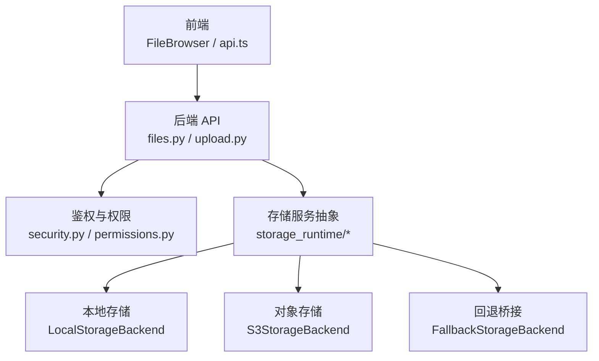
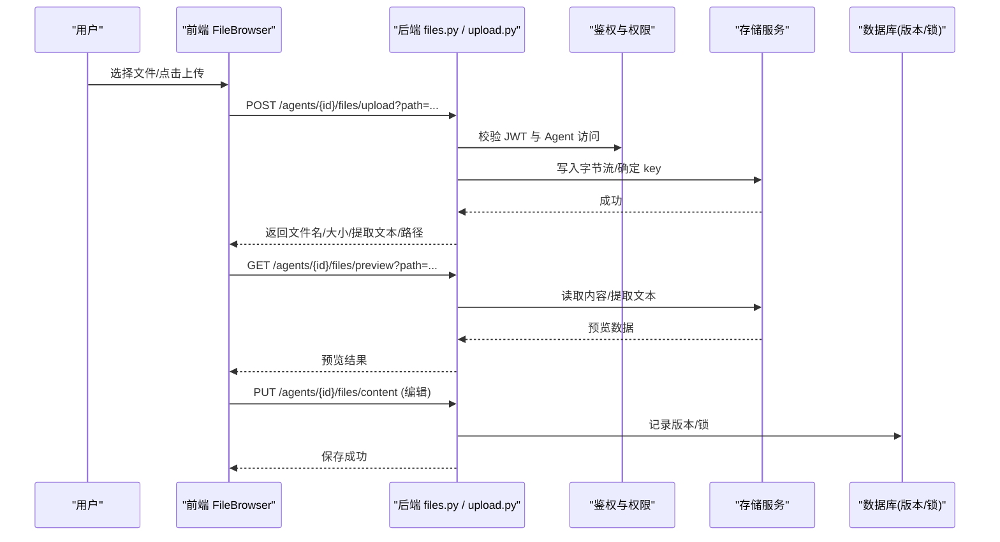
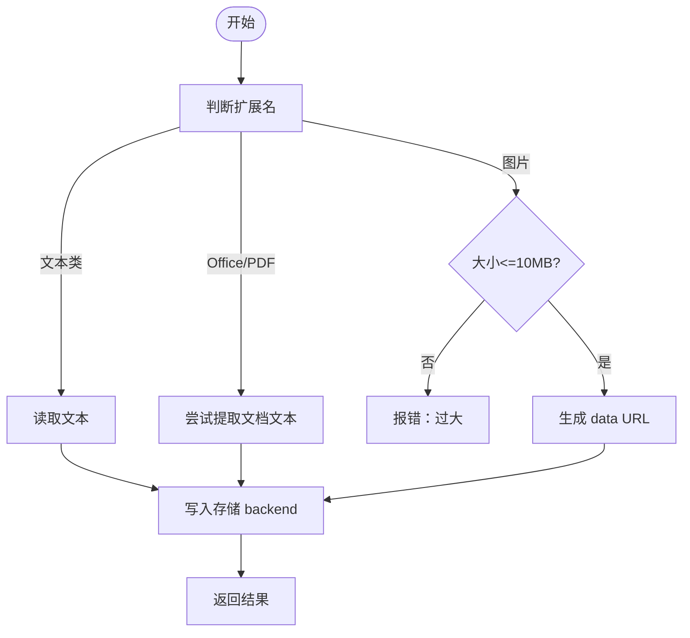
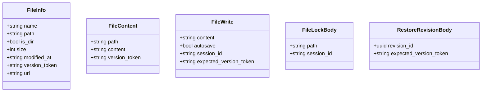
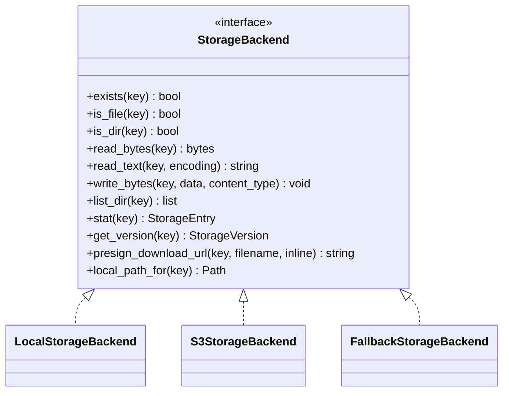
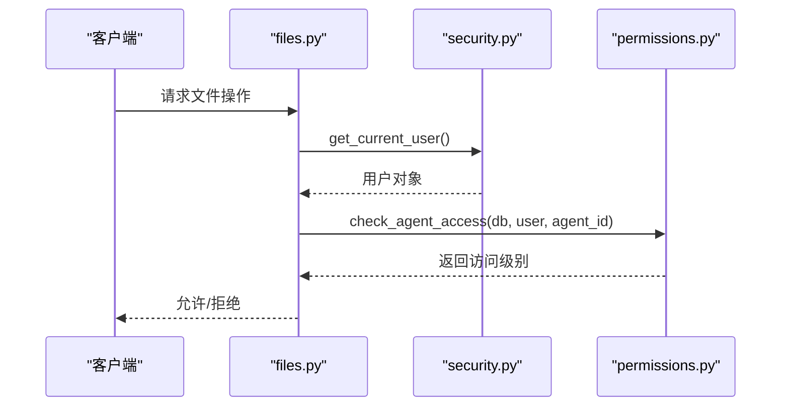
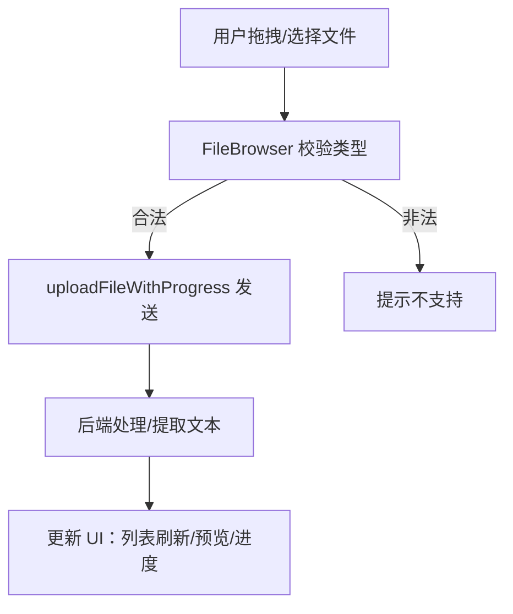
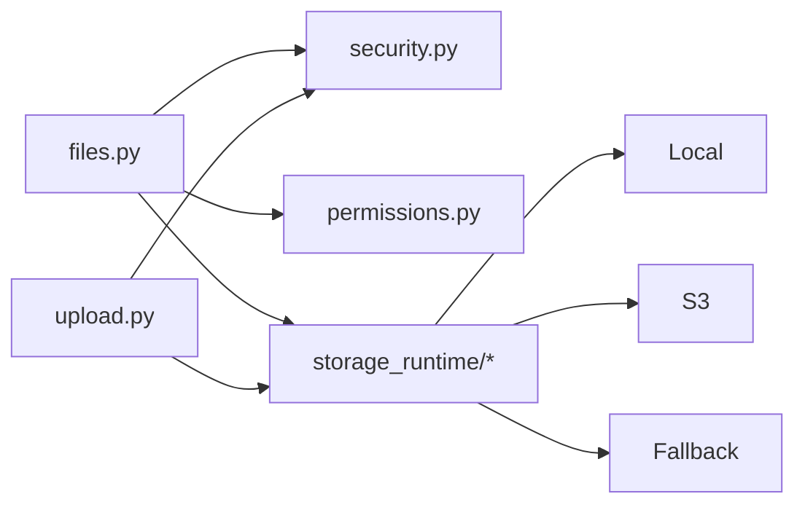

# 文件共享

<cite>
**本文引用的文件**   
- [backend/app/api/files.py](file://backend/app/api/files.py)
- [backend/app/api/upload.py](file://backend/app/api/upload.py)
- [backend/app/services/storage_runtime/facade.py](file://backend/app/services/storage_runtime/facade.py)
- [backend/app/services/storage_runtime/local.py](file://backend/app/services/storage_runtime/local.py)
- [backend/app/services/storage_runtime/s3.py](file://backend/app/services/storage_runtime/s3.py)
- [backend/app/services/storage_runtime/fallback.py](file://backend/app/services/storage_runtime/fallback.py)
- [backend/app/models/workspace.py](file://backend/app/models/workspace.py)
- [backend/app/core/permissions.py](file://backend/app/core/permissions.py)
- [backend/app/core/security.py](file://backend/app/core/security.py)
- [frontend/src/components/FileBrowser.tsx](file://frontend/src/components/FileBrowser.tsx)
- [frontend/src/services/api.ts](file://frontend/src/services/api.ts)
- [frontend/src/utils/workspaceFileFormats.ts](file://frontend/src/utils/workspaceFileFormats.ts)
</cite>

## 目录
1. [简介](#简介)
2. [项目结构](#项目结构)
3. [核心组件](#核心组件)
4. [架构总览](#架构总览)
5. [详细组件分析](#详细组件分析)
6. [依赖关系分析](#依赖关系分析)
7. [性能与扩展性](#性能与扩展性)
8. [故障排查指南](#故障排查指南)
9. [结论](#结论)
10. [附录：最佳实践与常见问题](#附录最佳实践与常见问题)

## 简介
本文件共享功能面向聊天与工作区场景，提供上传、下载、预览、在线编辑、版本控制与协作锁定、权限与安全控制等企业级能力。支持本地与对象存储（S3）后端，具备回退迁移能力；前端提供统一的文件浏览器与进度上传体验。

## 项目结构
- 后端 API：基于 FastAPI，提供工作区文件管理、聊天上传、预览、下载、锁与版本等接口。
- 存储服务：统一的 StorageBackend 抽象，支持本地文件系统与 S3，并可通过 FallbackStorageBackend 实现“主存优先、回退读取”的渐进式迁移。
- 权限与安全：JWT 鉴权、RBAC 访问控制、租户隔离、路径安全校验。
- 前端：React + TypeScript，统一 FileBrowser 组件封装浏览、上传、预览、编辑、删除等操作，并通过 api.ts 调用后端。

**图表来源** 
- [backend/app/api/files.py:1-120](file://backend/app/api/files.py#L1-L120)
- [backend/app/api/upload.py:1-60](file://backend/app/api/upload.py#L1-L60)
- [backend/app/services/storage_runtime/facade.py:34-77](file://backend/app/services/storage_runtime/facade.py#L34-L77)
- [backend/app/services/storage_runtime/local.py:1-49](file://backend/app/services/storage_runtime/local.py#L1-L49)
- [backend/app/services/storage_runtime/s3.py:1-48](file://backend/app/services/storage_runtime/s3.py#L1-L48)
- [backend/app/services/storage_runtime/fallback.py:1-35](file://backend/app/services/storage_runtime/fallback.py#L1-L35)
- [frontend/src/components/FileBrowser.tsx:1-120](file://frontend/src/components/FileBrowser.tsx#L1-L120)
- [frontend/src/services/api.ts:300-345](file://frontend/src/services/api.ts#L300-L345)

**章节来源**
- [backend/app/api/files.py:1-120](file://backend/app/api/files.py#L1-L120)
- [backend/app/api/upload.py:1-60](file://backend/app/api/upload.py#L1-L60)
- [backend/app/services/storage_runtime/facade.py:34-77](file://backend/app/services/storage_runtime/facade.py#L34-L77)
- [frontend/src/components/FileBrowser.tsx:1-120](file://frontend/src/components/FileBrowser.tsx#L1-L120)
- [frontend/src/services/api.ts:300-345](file://frontend/src/services/api.ts#L300-L345)

## 核心组件
- 文件 API（工作区）：列出、读取、写入、删除、预览、下载、编辑锁、版本历史与恢复。
- 聊天上传：将文件保存到工作区，提取文本或生成图片 data URL，供 Agent 使用。
- 存储服务：统一抽象，支持本地与 S3，并提供内容类型推断、键规范化、本地路径落地等工具。
- 权限与安全：JWT 鉴权、用户角色与租户隔离、Agent 访问级别控制、路径遍历防护。
- 前端组件：统一 FileBrowser，支持拖拽上传、多格式预览、Markdown 渲染、二进制下载、编辑保存。

**章节来源**
- [backend/app/api/files.py:223-800](file://backend/app/api/files.py#L223-L800)
- [backend/app/api/upload.py:108-175](file://backend/app/api/upload.py#L108-L175)
- [backend/app/services/storage_runtime/facade.py:34-77](file://backend/app/services/storage_runtime/facade.py#L34-L77)
- [backend/app/core/permissions.py:481-518](file://backend/app/core/permissions.py#L481-L518)
- [backend/app/core/security.py:153-173](file://backend/app/core/security.py#L153-L173)
- [frontend/src/components/FileBrowser.tsx:120-220](file://frontend/src/components/FileBrowser.tsx#L120-L220)
- [frontend/src/services/api.ts:300-345](file://frontend/src/services/api.ts#L300-L345)

## 架构总览
文件共享的整体流程如下：
- 前端通过 FileBrowser 发起操作（上传、预览、编辑、下载）。
- 后端 API 进行鉴权与权限校验，再调用存储服务完成读写。
- 存储服务根据配置选择本地或 S3，必要时通过回退桥接保证兼容。
- 聊天上传额外进行文本提取或图片 base64 处理，返回给前端用于对话上下文。

**图表来源** 
- [backend/app/api/upload.py:108-175](file://backend/app/api/upload.py#L108-L175)
- [backend/app/api/files.py:428-555](file://backend/app/api/files.py#L428-L555)
- [backend/app/api/files.py:619-663](file://backend/app/api/files.py#L619-L663)
- [backend/app/core/security.py:153-173](file://backend/app/core/security.py#L153-L173)
- [backend/app/core/permissions.py:481-518](file://backend/app/core/permissions.py#L481-L518)
- [backend/app/models/workspace.py:28-68](file://backend/app/models/workspace.py#L28-L68)

## 详细组件分析

### 聊天上传（Chat Upload）
- 支持的格式与行为：
  - 文本类：直接读取文本内容，作为对话上下文。
  - Office/PDF：尝试提取文本（受限于依赖），失败时返回提示。
  - 图片：限制最大 10MB，生成 data URL 供视觉模型使用。
- 存储位置：按 agent_id 归一化到 workspace/uploads/ 下，避免冲突命名。
- 响应字段：包含文件名、大小、提取文本、workspace_path、是否图片及 data URL。

**图表来源** 
- [backend/app/api/upload.py:17-24](file://backend/app/api/upload.py#L17-L24)
- [backend/app/api/upload.py:108-175](file://backend/app/api/upload.py#L108-L175)

**章节来源**
- [backend/app/api/upload.py:17-24](file://backend/app/api/upload.py#L17-L24)
- [backend/app/api/upload.py:108-175](file://backend/app/api/upload.py#L108-L175)

### 工作区文件 API（预览、下载、编辑、锁、版本）
- 预览：
  - 文本/HTML/Markdown：直接返回内容。
  - CSV：自动检测分隔符，返回前若干行。
  - PDF：返回下载链接。
  - Excel/Word/PPT：尝试提取文本，返回结构化表格或段落摘要。
  - 其他二进制：返回 base64 样本与下载链接。
- 下载：
  - 支持 Bearer Token 或 query token 鉴权，便于  标签内联显示。
  - 优先走预签名直链（S3），否则本地文件或内存返回。
- 编辑：
  - 写入内容，支持 autosave 模式与 session_id。
  - 企业知识库路径需管理员权限。
- 锁：
  - 短生命周期编辑锁，防止多人同时编辑冲突。
- 版本：
  - 列出最近修订，支持恢复到指定版本的 after_content。

**图表来源** 
- [backend/app/api/files.py:48-96](file://backend/app/api/files.py#L48-L96)

**章节来源**
- [backend/app/api/files.py:223-800](file://backend/app/api/files.py#L223-L800)

### 存储服务抽象与后端
- 抽象层：StorageBackend 定义 exists/is_file/is_dir/read_bytes/read_text/write_bytes/list_dir/stat/get_version/presign_download_url/local_path_for 等接口。
- 本地实现：LocalStorageBackend，路径安全校验，原子写入策略。
- S3 实现：S3StorageBackend，支持预签名下载、连接池、写并发参数。
- 回退桥接：FallbackStorageBackend，读优先主存，命中回退则复制至主存，逐步迁移旧数据。
- 门面：get_storage_backend() 根据配置选择后端，ensure_local_path() 确保可落盘。

**图表来源** 
- [backend/app/services/storage_runtime/base.py](file://backend/app/services/storage_runtime/base.py)
- [backend/app/services/storage_runtime/local.py:1-49](file://backend/app/services/storage_runtime/local.py#L1-L49)
- [backend/app/services/storage_runtime/s3.py:1-48](file://backend/app/services/storage_runtime/s3.py#L1-L48)
- [backend/app/services/storage_runtime/fallback.py:1-35](file://backend/app/services/storage_runtime/fallback.py#L1-L35)
- [backend/app/services/storage_runtime/facade.py:34-77](file://backend/app/services/storage_runtime/facade.py#L34-L77)

**章节来源**
- [backend/app/services/storage_runtime/facade.py:34-77](file://backend/app/services/storage_runtime/facade.py#L34-L77)
- [backend/app/services/storage_runtime/local.py:1-49](file://backend/app/services/storage_runtime/local.py#L1-L49)
- [backend/app/services/storage_runtime/s3.py:1-48](file://backend/app/services/storage_runtime/s3.py#L1-L48)
- [backend/app/services/storage_runtime/fallback.py:1-35](file://backend/app/services/storage_runtime/fallback.py#L1-L35)

### 权限与安全
- 鉴权：JWT access token，支持从 Header 或查询参数获取，校验用户存在且活跃。
- 权限：check_agent_access 检查用户与 Agent 的关系（创建者/公司范围/自定义授权），返回 use/manage 级别。
- 路径安全：对 agent 根目录做严格校验，禁止路径穿越。
- 企业知识库：仅管理员可编辑/删除 enterprise_info 相关路径。

**图表来源** 
- [backend/app/core/security.py:153-173](file://backend/app/core/security.py#L153-L173)
- [backend/app/core/permissions.py:481-518](file://backend/app/core/permissions.py#L481-L518)
- [backend/app/api/files.py:223-260](file://backend/app/api/files.py#L223-L260)

**章节来源**
- [backend/app/core/security.py:153-173](file://backend/app/core/security.py#L153-L173)
- [backend/app/core/permissions.py:481-518](file://backend/app/core/permissions.py#L481-L518)
- [backend/app/api/files.py:223-260](file://backend/app/api/files.py#L223-L260)

### 前端文件浏览器与上传
- FileBrowser 组件：
  - 支持拖拽上传、多文件选择、上传进度条。
  - 文本文件在线编辑（textarea），Markdown 渲染。
  - 图片内联预览（inline=true），二进制文件下载。
  - 新建文件夹/文件、删除确认、面包屑导航。
- 上传流程：
  - 使用 XMLHttpRequest 实现进度回调，支持取消与超时。
  - 支持 extraFields（如 agent_id）传递。
- 接受格式：
  - 文本类：txt/md/csv/json/xml/yaml/js/ts/py/html/css/sh/log/gitkeep/env 等。
  - 二进制类：pdf/docx/xlsx/pptx 及常见图片格式。

**图表来源** 
- [frontend/src/components/FileBrowser.tsx:160-188](file://frontend/src/components/FileBrowser.tsx#L160-L188)
- [frontend/src/services/api.ts:75-128](file://frontend/src/services/api.ts#L75-L128)
- [frontend/src/utils/workspaceFileFormats.ts:1-17](file://frontend/src/utils/workspaceFileFormats.ts#L1-L17)

**章节来源**
- [frontend/src/components/FileBrowser.tsx:160-188](file://frontend/src/components/FileBrowser.tsx#L160-L188)
- [frontend/src/services/api.ts:75-128](file://frontend/src/services/api.ts#L75-L128)
- [frontend/src/utils/workspaceFileFormats.ts:1-17](file://frontend/src/utils/workspaceFileFormats.ts#L1-L17)

## 依赖关系分析
- API 层依赖鉴权与权限模块，所有文件操作均经过 check_agent_access。
- 存储服务通过门面统一注入，运行时根据配置选择后端。
- 版本与锁由数据库表支撑，写入/删除/恢复均记录审计信息。

**图表来源** 
- [backend/app/api/files.py:1-45](file://backend/app/api/files.py#L1-L45)
- [backend/app/api/upload.py:1-20](file://backend/app/api/upload.py#L1-L20)
- [backend/app/services/storage_runtime/facade.py:34-77](file://backend/app/services/storage_runtime/facade.py#L34-L77)

**章节来源**
- [backend/app/api/files.py:1-45](file://backend/app/api/files.py#L1-L45)
- [backend/app/api/upload.py:1-20](file://backend/app/api/upload.py#L1-L20)
- [backend/app/services/storage_runtime/facade.py:34-77](file://backend/app/services/storage_runtime/facade.py#L34-L77)

## 性能与扩展性
- 大文件传输优化：
  - 前端使用 XMLHttpRequest 上报上传进度，支持取消与超时。
  - 后端下载优先走预签名直链（S3），减少应用服务器带宽压力。
- 断点续传：
  - 当前未实现分片与断点续传，建议结合对象存储的分片上传能力扩展。
- 云存储集成：
  - 支持 S3 与本地双后端，可通过环境变量切换；启用回退桥接实现平滑迁移。
- 并发与资源：
  - S3 写并发与连接池可调；本地存储注意磁盘 I/O 与锁竞争。

[本节为通用指导，不直接分析具体文件]

## 故障排查指南
- 鉴权失败（401）：
  - 检查 Authorization 头或 token 查询参数是否正确，确认用户活跃状态。
- 权限不足（403）：
  - 确认用户与 Agent 的访问级别（use/manage），企业知识库路径需管理员。
- 路径错误（404/400）：
  - 检查路径是否存在、是否为目录；enterprise_info 特殊路径限制。
- 预览失败：
  - 依赖缺失（openpyxl/docx/pptx）或文件格式不支持，查看返回 text 中的错误信息。
- 上传失败：
  - 图片超过 10MB 会报错；网络超时或取消上传会触发相应错误码。

**章节来源**
- [backend/app/core/security.py:153-173](file://backend/app/core/security.py#L153-L173)
- [backend/app/core/permissions.py:481-518](file://backend/app/core/permissions.py#L481-L518)
- [backend/app/api/files.py:428-555](file://backend/app/api/files.py#L428-L555)
- [backend/app/api/upload.py:108-175](file://backend/app/api/upload.py#L108-L175)

## 结论
文件共享功能以清晰的 API 分层、可扩展的存储服务抽象、完善的权限与安全机制为基础，提供了覆盖聊天与工作区的完整文件管理能力。通过前端统一组件与后端稳健实现，满足预览、编辑、版本控制与企业级安全需求。未来可在断点续传、分片上传、更丰富的文档转换方面持续增强。

[本节为总结，不直接分析具体文件]

## 附录：最佳实践与常见问题
- 最佳实践
  - 合理划分路径：将用户上传文件置于 workspace/uploads/，避免与业务文件混放。
  - 使用预览接口：优先通过 preview 获取轻量文本或结构化数据，降低带宽与解析成本。
  - 利用版本与锁：编辑前申请锁，保存时携带 expected_version_token 避免覆盖冲突。
  - 云存储优先：生产环境启用 S3，配合预签名直链提升下载性能。
- 常见问题
  - 无法预览 PDF/Office：检查依赖安装情况，或改用下载后本地打开。
  - 上传卡顿：网络不稳定或文件过大，建议压缩或分片上传（需扩展）。
  - 权限异常：确认租户一致性与 Agent 访问模式（company/private/custom）。
  - 企业知识库不可编辑：仅平台/组织管理员可操作 enterprise_info。

[本节为通用指导，不直接分析具体文件]