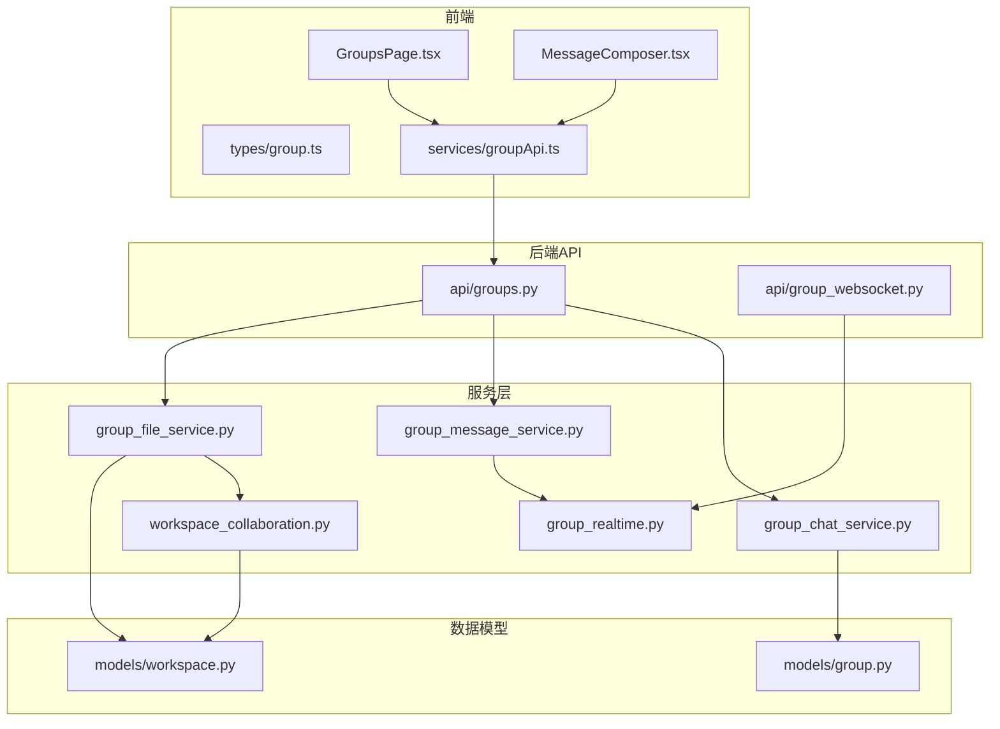
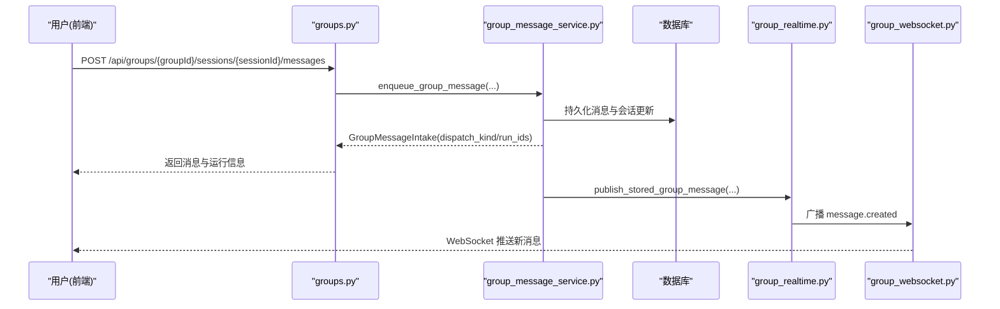
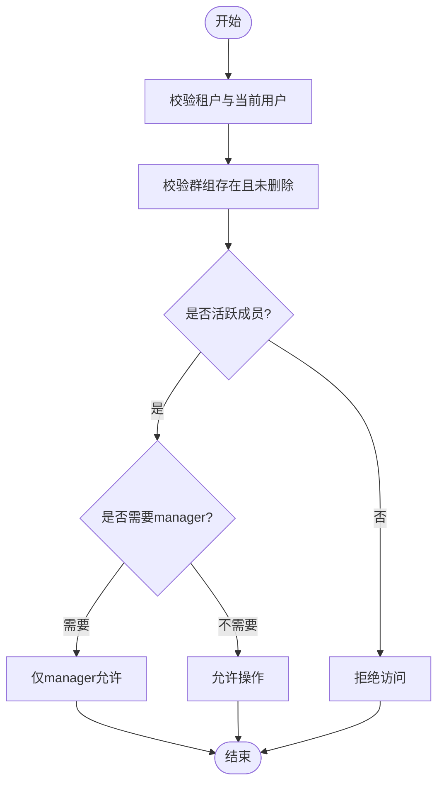
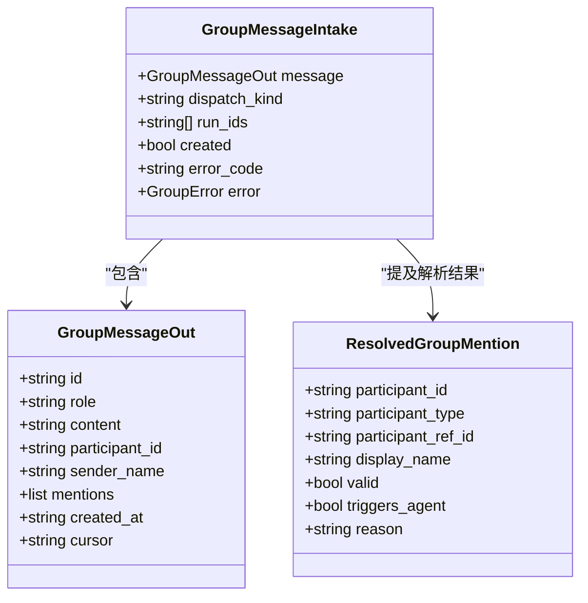
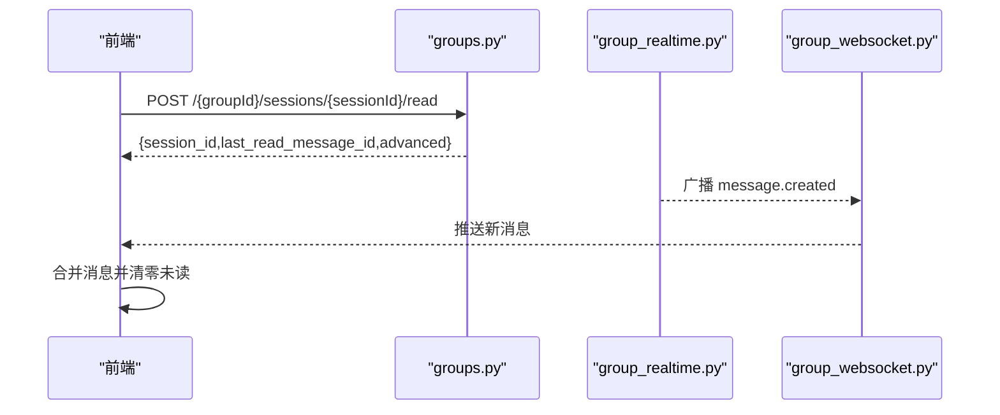
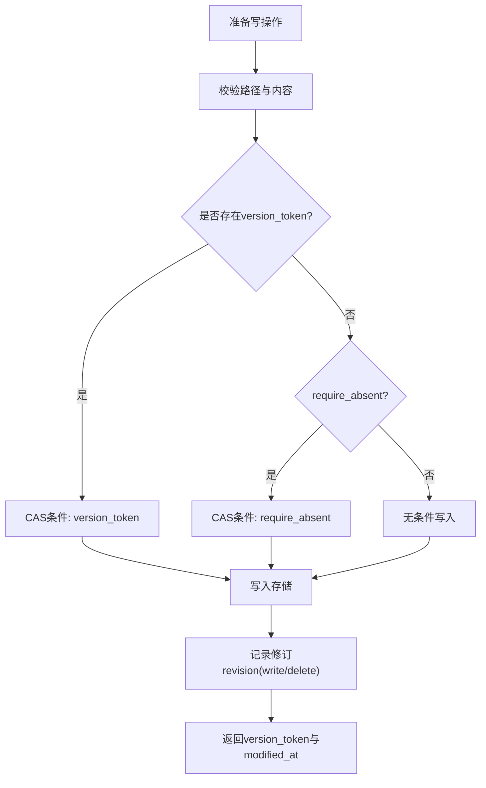
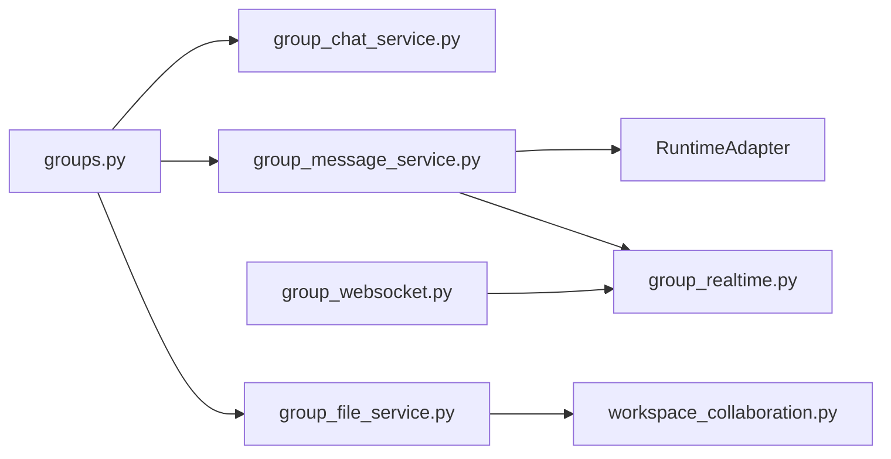

# 群组协作

<cite>
**本文引用的文件**   
- [backend/app/models/group.py](file://backend/app/models/group.py)
- [backend/app/api/groups.py](file://backend/app/api/groups.py)
- [backend/app/services/group_chat_service.py](file://backend/app/services/group_chat_service.py)
- [backend/app/services/group_message_service.py](file://backend/app/services/group_message_service.py)
- [backend/app/services/group_file_service.py](file://backend/app/services/group_file_service.py)
- [backend/app/services/workspace_collaboration.py](file://backend/app/services/workspace_collaboration.py)
- [backend/app/models/workspace.py](file://backend/app/models/workspace.py)
- [backend/app/services/group_realtime.py](file://backend/app/services/group_realtime.py)
- [backend/app/api/group_websocket.py](file://backend/app/api/group_websocket.py)
- [frontend/src/types/group.ts](file://frontend/src/types/group.ts)
- [frontend/src/pages/groups/GroupsPage.tsx](file://frontend/src/pages/groups/GroupsPage.tsx)
- [frontend/src/pages/groups/MessageComposer.tsx](file://frontend/src/pages/groups/MessageComposer.tsx)
- [frontend/src/services/groupApi.ts](file://frontend/src/services/groupApi.ts)
</cite>

## 目录
1. [简介](#简介)
2. [项目结构](#项目结构)
3. [核心组件](#核心组件)
4. [架构总览](#架构总览)
5. [详细组件分析](#详细组件分析)
6. [依赖关系分析](#依赖关系分析)
7. [性能与扩展性](#性能与扩展性)
8. [故障排查指南](#故障排查指南)
9. [结论](#结论)
10. [附录：工作流示例与最佳实践](#附录工作流示例与最佳实践)

## 简介
本指南面向企业用户与管理员，系统性说明群组协作功能的使用方法与最佳实践。内容涵盖：
- 群组的创建、成员邀请与管理、权限设置
- 群组聊天使用方式：@提及、消息通知、未读消息管理
- 群组工作空间：文件共享、版本控制、协作编辑
- 群组设置配置、公告发布、成员角色管理等企业级特性
- 实际工作流示例与落地建议

## 项目结构
群组协作由后端 API、领域服务、存储与实时推送，以及前端页面与类型定义共同实现。关键路径如下：
- 模型层：群组与成员、工作区修订与编辑锁
- API 层：群组 CRUD、会话与消息、文件与工作空间、WebSocket
- 服务层：群组域逻辑、消息编排（单 Agent/多 Agent 规划）、文件与版本控制、实时广播
- 前端：群组列表与会话树、消息输入与 @ 提及、未读计数与标记已读、工作空间编辑器

**图表来源** 
- [backend/app/api/groups.py](file://backend/app/api/groups.py)
- [backend/app/api/group_websocket.py](file://backend/app/api/group_websocket.py)
- [backend/app/services/group_chat_service.py](file://backend/app/services/group_chat_service.py)
- [backend/app/services/group_message_service.py](file://backend/app/services/group_message_service.py)
- [backend/app/services/group_file_service.py](file://backend/app/services/group_file_service.py)
- [backend/app/services/workspace_collaboration.py](file://backend/app/services/workspace_collaboration.py)
- [backend/app/models/group.py](file://backend/app/models/group.py)
- [backend/app/models/workspace.py](file://backend/app/models/workspace.py)
- [frontend/src/pages/groups/GroupsPage.tsx](file://frontend/src/pages/groups/GroupsPage.tsx)
- [frontend/src/pages/groups/MessageComposer.tsx](file://frontend/src/pages/groups/MessageComposer.tsx)
- [frontend/src/services/groupApi.ts](file://frontend/src/services/groupApi.ts)
- [frontend/src/types/group.ts](file://frontend/src/types/group.ts)

**章节来源**
- [backend/app/models/group.py:24-95](file://backend/app/models/group.py#L24-L95)
- [backend/app/models/workspace.py:28-108](file://backend/app/models/workspace.py#L28-L108)
- [backend/app/api/groups.py:48-1642](file://backend/app/api/groups.py#L48-L1642)
- [backend/app/services/group_chat_service.py:1-800](file://backend/app/services/group_chat_service.py#L1-L800)
- [backend/app/services/group_message_service.py:1-800](file://backend/app/services/group_message_service.py#L1-L800)
- [backend/app/services/group_file_service.py:1-800](file://backend/app/services/group_file_service.py#L1-L800)
- [backend/app/services/workspace_collaboration.py:1-800](file://backend/app/services/workspace_collaboration.py#L1-L800)
- [backend/app/services/group_realtime.py:1-130](file://backend/app/services/group_realtime.py#L1-L130)
- [backend/app/api/group_websocket.py:1-118](file://backend/app/api/group_websocket.py#L1-L118)
- [frontend/src/pages/groups/GroupsPage.tsx:1-800](file://frontend/src/pages/groups/GroupsPage.tsx#L1-L800)
- [frontend/src/pages/groups/MessageComposer.tsx:1-278](file://frontend/src/pages/groups/MessageComposer.tsx#L1-L278)
- [frontend/src/services/groupApi.ts:1-245](file://frontend/src/services/groupApi.ts#L1-L245)
- [frontend/src/types/group.ts:1-129](file://frontend/src/types/group.ts#L1-L129)

## 核心组件
- 群组与成员模型：群组实体、成员角色（manager/member）、加入/移除时间戳、会话读取状态
- 群组会话与消息：会话标题、是否主会话、未读数、最后消息时间；消息按 (created_at, id) 排序的游标分页
- 消息分发：单 Agent 直接唤醒；多 Agent 触发“任务规划”编排
- 工作空间：公告、Agent 记忆、通用工作空间文件；支持版本令牌与修订记录
- 实时推送：WebSocket 连接校验、组成员重验证、消息广播
- 前端交互：群组树、会话树、消息流、@ 提及、未读计数、标记已读、工作空间编辑器

**章节来源**
- [backend/app/models/group.py:24-95](file://backend/app/models/group.py#L24-L95)
- [backend/app/api/groups.py:510-800](file://backend/app/api/groups.py#L510-L800)
- [backend/app/services/group_message_service.py:615-748](file://backend/app/services/group_message_service.py#L615-L748)
- [backend/app/services/group_file_service.py:713-800](file://backend/app/services/group_file_service.py#L713-L800)
- [backend/app/services/group_realtime.py:40-130](file://backend/app/services/group_realtime.py#L40-L130)
- [frontend/src/pages/groups/GroupsPage.tsx:120-450](file://frontend/src/pages/groups/GroupsPage.tsx#L120-L450)
- [frontend/src/pages/groups/MessageComposer.tsx:120-278](file://frontend/src/pages/groups/MessageComposer.tsx#L120-L278)

## 架构总览
群组协作采用“API + 领域服务 + 存储 + 实时”的分层架构。HTTP 接口负责鉴权与参数校验，领域服务封装业务规则与一致性约束，存储层提供对象存储与数据库事务，实时层通过 WebSocket 推送消息并维护未读计数。

**图表来源** 
- [backend/app/api/groups.py:1140-1200](file://backend/app/api/groups.py#L1140-L1200)
- [backend/app/services/group_message_service.py:615-748](file://backend/app/services/group_message_service.py#L615-L748)
- [backend/app/services/group_realtime.py:69-130](file://backend/app/services/group_realtime.py#L69-L130)
- [backend/app/api/group_websocket.py:51-118](file://backend/app/api/group_websocket.py#L51-L118)

## 详细组件分析

### 群组与成员管理
- 创建群组：指定名称、描述与初始成员；创建者自动成为 manager
- 列出成员与候选：支持 user/agent 两类参与者；过滤已在群内或不可见 Agent
- 邀请/移除成员：幂等邀请（复用已删除成员行）；仅 manager 可移除
- 权限校验：活跃租户、活跃成员、人类成员要求（某些操作需 human_only）

**图表来源** 
- [backend/app/services/group_chat_service.py:228-253](file://backend/app/services/group_chat_service.py#L228-L253)
- [backend/app/services/group_chat_service.py:725-782](file://backend/app/services/group_chat_service.py#L725-L782)
- [backend/app/services/group_chat_service.py:784-800](file://backend/app/services/group_chat_service.py#L784-L800)

**章节来源**
- [backend/app/models/group.py:24-95](file://backend/app/models/group.py#L24-L95)
- [backend/app/api/groups.py:510-780](file://backend/app/api/groups.py#L510-L780)
- [backend/app/services/group_chat_service.py:378-453](file://backend/app/services/group_chat_service.py#L378-L453)
- [backend/app/services/group_chat_service.py:565-650](file://backend/app/services/group_chat_service.py#L565-L650)
- [backend/app/services/group_chat_service.py:725-800](file://backend/app/services/group_chat_service.py#L725-L800)

### 群组聊天与@提及
- 发送消息：支持 content 与 mentions；客户端生成 message_id 去重
- 消息持久化：按 (created_at, id) 顺序，支持 before/after 游标分页
- 提及解析：仅对活跃成员有效；若提及多个 Agent 则进入“任务规划”流程
- 运行状态：单 Agent 直接执行；多 Agent 先规划再分工；前端轮询 activeRuns

**图表来源** 
- [backend/app/api/groups.py:136-171](file://backend/app/api/groups.py#L136-L171)
- [backend/app/services/group_message_service.py:56-95](file://backend/app/services/group_message_service.py#L56-L95)
- [frontend/src/types/group.ts:58-91](file://frontend/src/types/group.ts#L58-L91)

**章节来源**
- [backend/app/api/groups.py:1140-1200](file://backend/app/api/groups.py#L1140-L1200)
- [backend/app/services/group_message_service.py:615-748](file://backend/app/services/group_message_service.py#L615-L748)
- [frontend/src/pages/groups/MessageComposer.tsx:120-278](file://frontend/src/pages/groups/MessageComposer.tsx#L120-L278)
- [frontend/src/services/groupApi.ts:114-133](file://frontend/src/services/groupApi.ts#L114-L133)

### 未读消息与通知
- 未读计数：服务端维护 session.unread_count；前端收到 message.created 后增量更新
- 标记已读：POST /read 提交 last_read_message_id，前端合并最新实时消息避免闪烁
- 实时推送：WebSocket 连接校验、周期性重验组成员身份、失败不阻塞 HTTP

**图表来源** 
- [frontend/src/pages/groups/GroupsPage.tsx:411-458](file://frontend/src/pages/groups/GroupsPage.tsx#L411-L458)
- [backend/app/services/group_realtime.py:40-67](file://backend/app/services/group_realtime.py#L40-L67)
- [backend/app/api/group_websocket.py:51-118](file://backend/app/api/group_websocket.py#L51-L118)

**章节来源**
- [frontend/src/pages/groups/GroupsPage.tsx:324-458](file://frontend/src/pages/groups/GroupsPage.tsx#L324-L458)
- [backend/app/services/group_realtime.py:40-130](file://backend/app/services/group_realtime.py#L40-L130)
- [backend/app/api/group_websocket.py:51-118](file://backend/app/api/group_websocket.py#L51-L118)

### 群组工作空间（文件共享与版本控制）
- 公告与记忆：announcement.md、agents/{agentId}/memory/memory.md，文本读写带版本令牌
- 工作空间：相对路径规范化、禁止危险后缀、二进制/文本差异化处理
- 版本控制：写入前准备修订（prepared_write/delete），成功后 finalize；冲突检测基于 version_token
- 协作编辑：人类编辑锁（edit_locks），防止非人类 Actor 在人类编辑时覆盖

**图表来源** 
- [backend/app/services/group_file_service.py:373-424](file://backend/app/services/group_file_service.py#L373-L424)
- [backend/app/services/workspace_collaboration.py:386-510](file://backend/app/services/workspace_collaboration.py#L386-L510)
- [backend/app/models/workspace.py:28-108](file://backend/app/models/workspace.py#L28-L108)

**章节来源**
- [backend/app/services/group_file_service.py:713-800](file://backend/app/services/group_file_service.py#L713-L800)
- [backend/app/services/workspace_collaboration.py:336-510](file://backend/app/services/workspace_collaboration.py#L336-L510)
- [frontend/src/services/groupApi.ts:135-245](file://frontend/src/services/groupApi.ts#L135-L245)

### 群组设置与公告
- 群组元数据：名称、描述可更新；软删除群组
- 公告：人类成员可写，Agent 只读；支持版本令牌防冲突
- 成员角色：manager 拥有更高权限（如删除会话、移除成员）

**章节来源**
- [backend/app/api/groups.py:603-661](file://backend/app/api/groups.py#L603-L661)
- [backend/app/services/group_file_service.py:734-762](file://backend/app/services/group_file_service.py#L734-L762)

## 依赖关系分析
- API 层依赖领域服务进行权限校验与业务编排
- 消息服务依赖运行时适配器启动 Agent 运行（单/多 Agent）
- 文件服务依赖工作区协作模块进行修订与锁管理
- 实时服务依赖 WebSocket 管理器进行跨进程广播

**图表来源** 
- [backend/app/api/groups.py:1-120](file://backend/app/api/groups.py#L1-L120)
- [backend/app/services/group_message_service.py:1-120](file://backend/app/services/group_message_service.py#L1-L120)
- [backend/app/services/group_file_service.py:1-120](file://backend/app/services/group_file_service.py#L1-L120)
- [backend/app/services/workspace_collaboration.py:1-120](file://backend/app/services/workspace_collaboration.py#L1-L120)
- [backend/app/services/group_realtime.py:1-60](file://backend/app/services/group_realtime.py#L1-L60)
- [backend/app/api/group_websocket.py:1-60](file://backend/app/api/group_websocket.py#L1-L60)

**章节来源**
- [backend/app/api/groups.py:1-120](file://backend/app/api/groups.py#L1-L120)
- [backend/app/services/group_message_service.py:1-120](file://backend/app/services/group_message_service.py#L1-L120)
- [backend/app/services/group_file_service.py:1-120](file://backend/app/services/group_file_service.py#L1-L120)
- [backend/app/services/workspace_collaboration.py:1-120](file://backend/app/services/workspace_collaboration.py#L1-L120)
- [backend/app/services/group_realtime.py:1-60](file://backend/app/services/group_realtime.py#L1-L60)
- [backend/app/api/group_websocket.py:1-60](file://backend/app/api/group_websocket.py#L1-L60)

## 性能与扩展性
- 消息分页：基于 (created_at, id) 游标，避免深翻页开销
- 并发安全：数据库行级锁 with_for_update、CAS 写入条件、幂等 message_id
- 实时推送：本地+Redis 广播，失败降级不影响 HTTP 成功
- 工作区修订：文本/二进制分流，限制修订文本大小，减少数据库压力

[本节为通用指导，无需特定文件引用]

## 故障排查指南
- 常见错误码：
  - group_not_found、group_session_not_found、group_message_not_found
  - group_access_denied、group_human_member_required、group_manager_required
  - group_member_already_active、group_last_manager_required
  - group_file_conflict、group_workspace_directory_not_empty
- 排查步骤：
  - 检查租户与成员有效性（active、tenant_id 匹配）
  - 确认版本令牌一致性与 require_absent 条件
  - 查看运行状态与规划错误提示（多 Agent 场景）
  - 检查 WebSocket 连接与成员重验证日志

**章节来源**
- [backend/app/api/groups.py:229-347](file://backend/app/api/groups.py#L229-L347)
- [backend/app/services/group_message_service.py:41-46](file://backend/app/services/group_message_service.py#L41-L46)
- [backend/app/services/group_file_service.py:40-177](file://backend/app/services/group_file_service.py#L40-L177)
- [backend/app/api/group_websocket.py:51-118](file://backend/app/api/group_websocket.py#L51-L118)

## 结论
群组协作用户体验以“低延迟消息 + 强一致性版本控制 + 灵活权限模型”为核心。通过明确的 API 契约、稳健的错误码与实时推送机制，企业团队可在同一群组内高效协作，结合工作空间与 Agent 能力，形成从沟通到执行的闭环。

[本节为总结，无需特定文件引用]

## 附录：工作流示例与最佳实践

### 工作流示例
- 创建群组并邀请成员
  - 前端调用 create(group)，选择 member_participant_ids
  - 后端校验参与者可见性，创建群组与初始成员
  - 前端刷新群组列表并导航至新群组
- 发送@提及并触发多 Agent 规划
  - 用户在 MessageComposer 中输入 @A @B
  - 后端识别多 Agent 提及，启动 planning 运行
  - 前端轮询 activeRuns，展示规划状态与执行结果
- 工作空间协作编辑
  - 读取 announcement.md 或 workspace 文件
  - 保存时携带 expected_version_token，冲突时重试
  - 人类编辑期间，系统阻止非人类 Actor 覆盖

**章节来源**
- [frontend/src/pages/groups/GroupsPage.tsx:543-576](file://frontend/src/pages/groups/GroupsPage.tsx#L543-L576)
- [frontend/src/pages/groups/MessageComposer.tsx:120-278](file://frontend/src/pages/groups/MessageComposer.tsx#L120-L278)
- [backend/app/services/group_message_service.py:667-726](file://backend/app/services/group_message_service.py#L667-L726)
- [backend/app/services/group_file_service.py:734-762](file://backend/app/services/group_file_service.py#L734-L762)

### 最佳实践建议
- 使用幂等 message_id 避免重复发送
- 合理设置版本令牌，提升并发安全性
- 利用 manager 角色进行敏感操作（删除会话、移除成员）
- 在多人协作中优先使用工作空间修订历史进行回溯
- 实时监控 activeRuns 与未读计数，优化用户体验

[本节为通用指导，无需特定文件引用]