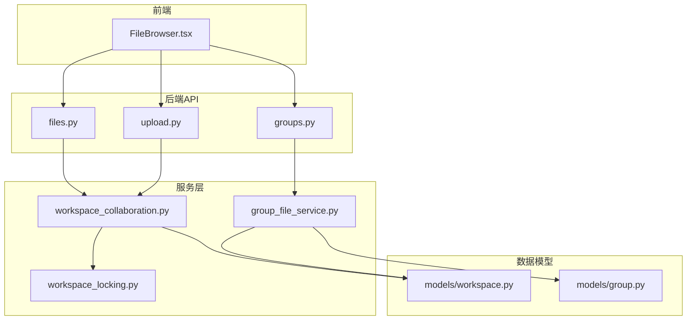
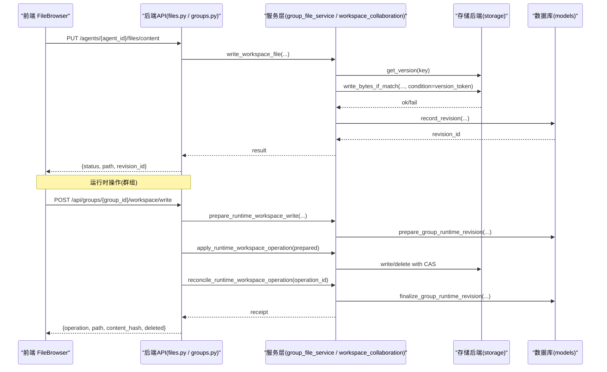
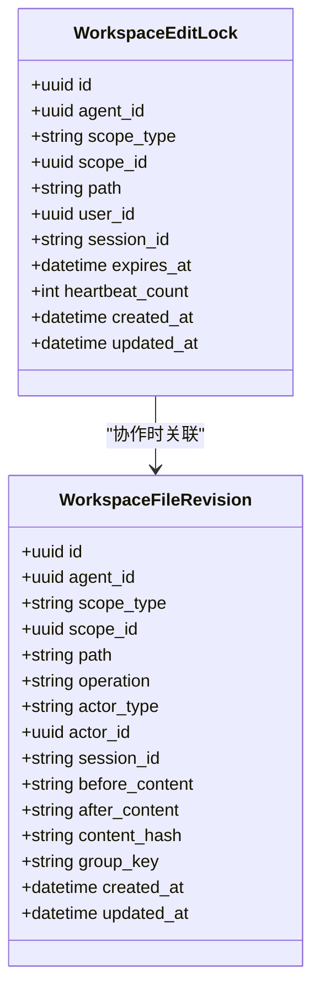
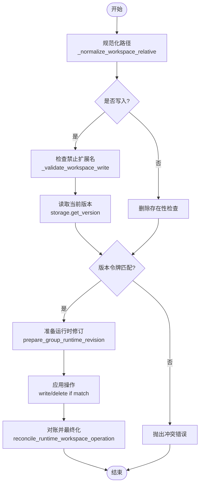
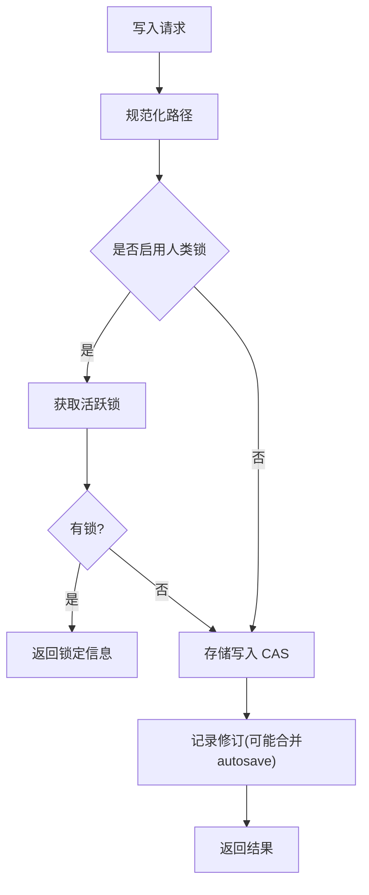
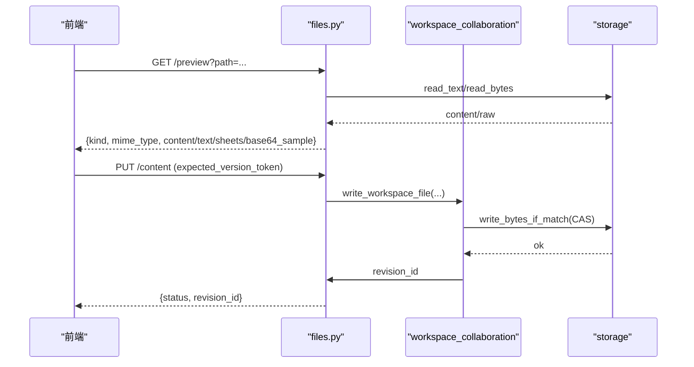
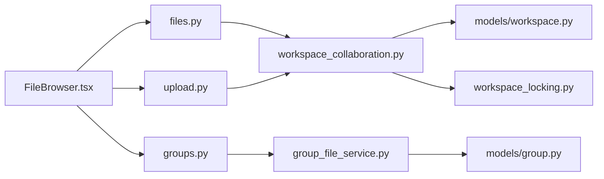

# 群组工作空间

<cite>
**本文引用的文件**   
- [backend/app/models/workspace.py](file://backend/app/models/workspace.py)
- [backend/app/services/group_file_service.py](file://backend/app/services/group_file_service.py)
- [backend/app/services/workspace_collaboration.py](file://backend/app/services/workspace_collaboration.py)
- [backend/app/api/files.py](file://backend/app/api/files.py)
- [backend/app/api/upload.py](file://backend/app/api/upload.py)
- [backend/app/api/groups.py](file://backend/app/api/groups.py)
- [backend/app/services/workspace_locking.py](file://backend/app/services/workspace_locking.py)
- [backend/app/models/group.py](file://backend/app/models/group.py)
- [frontend/src/components/FileBrowser.tsx](file://frontend/src/components/FileBrowser.tsx)
</cite>

## 目录
1. [简介](#简介)
2. [项目结构](#项目结构)
3. [核心组件](#核心组件)
4. [架构总览](#架构总览)
5. [详细组件分析](#详细组件分析)
6. [依赖关系分析](#依赖关系分析)
7. [性能考量](#性能考量)
8. [故障排查指南](#故障排查指南)
9. [结论](#结论)
10. [附录](#附录)

## 简介
本文件面向“群组工作空间”功能，提供从概念到实现、从使用到排障的完整说明。该能力为群组（Group）提供统一的文件共享与协作编辑环境，支持：
- 文件上传与管理：文本/二进制/办公文档等格式，批量操作与预览
- 版本控制：版本历史查看、差异比较、回滚恢复
- 协作编辑：多人同时编辑、冲突检测与解决、变更追踪
- 权限与安全：基于租户与群组成员的访问控制、编辑锁、审计日志
- 最佳实践与性能优化建议

## 项目结构
后端采用 FastAPI + SQLAlchemy 异步架构，服务层按领域划分（群组、文件、协作），模型层定义持久化结构；前端通过统一 FileBrowser 组件对接 API，提供拖拽上传、预览、编辑与版本管理界面。

**图表来源** 
- [backend/app/api/files.py](file://backend/app/api/files.py)
- [backend/app/api/groups.py](file://backend/app/api/groups.py)
- [backend/app/api/upload.py](file://backend/app/api/upload.py)
- [backend/app/services/group_file_service.py](file://backend/app/services/group_file_service.py)
- [backend/app/services/workspace_collaboration.py](file://backend/app/services/workspace_collaboration.py)
- [backend/app/services/workspace_locking.py](file://backend/app/services/workspace_locking.py)
- [backend/app/models/workspace.py](file://backend/app/models/workspace.py)
- [backend/app/models/group.py](file://backend/app/models/group.py)
- [frontend/src/components/FileBrowser.tsx](file://frontend/src/components/FileBrowser.tsx)

**章节来源**
- [backend/app/api/files.py:1-800](file://backend/app/api/files.py#L1-L800)
- [backend/app/api/groups.py:1-900](file://backend/app/api/groups.py#L1-L900)
- [backend/app/api/upload.py:1-175](file://backend/app/api/upload.py#L1-L175)
- [backend/app/services/group_file_service.py:1-800](file://backend/app/services/group_file_service.py#L1-L800)
- [backend/app/services/workspace_collaboration.py:1-800](file://backend/app/services/workspace_collaboration.py#L1-L800)
- [backend/app/services/workspace_locking.py:1-81](file://backend/app/services/workspace_locking.py#L1-L81)
- [backend/app/models/workspace.py:1-108](file://backend/app/models/workspace.py#L1-L108)
- [backend/app/models/group.py:1-95](file://backend/app/models/group.py#L1-L95)
- [frontend/src/components/FileBrowser.tsx:1-200](file://frontend/src/components/FileBrowser.tsx#L1-L200)

## 核心组件
- 工作空间版本与编辑锁模型
  - 工作空间文件修订表：记录每次有意义的写入/删除，包含 before/after 内容、内容哈希、操作者、会话ID、分组键等
  - 编辑锁表：短生命周期的人类编辑锁，防止并发覆盖
- 群组文件服务
  - 将业务相对路径映射到存储键，隔离直接访问物理命名空间
  - 支持文本/二进制文件读写、版本令牌 CAS、运行时操作准备与对账
- 协作工具集
  - 路径规范化、人类编辑锁获取/释放、修订记录合并（用户自动保存合并）、运行时版本准备与最终化
- 文件与上传 API
  - 列出/读取/预览/下载/写入/删除/恢复版本
  - 聊天上传接口，支持多格式文本提取与图片 base64 返回
- 群组 API
  - 群组、成员、会话管理与审计，文件操作错误码翻译

**章节来源**
- [backend/app/models/workspace.py:1-108](file://backend/app/models/workspace.py#L1-L108)
- [backend/app/services/group_file_service.py:1-800](file://backend/app/services/group_file_service.py#L1-L800)
- [backend/app/services/workspace_collaboration.py:1-800](file://backend/app/services/workspace_collaboration.py#L1-L800)
- [backend/app/api/files.py:1-800](file://backend/app/api/files.py#L1-L800)
- [backend/app/api/upload.py:1-175](file://backend/app/api/upload.py#L1-L175)
- [backend/app/api/groups.py:1-900](file://backend/app/api/groups.py#L1-L900)

## 架构总览
群组工作空间的核心流程包括：
- 文件写入：校验路径与内容 -> 计算版本令牌 -> 原子写入存储 -> 记录修订 -> 可选本地镜像
- 运行时操作（Agent/Tool）：准备意图 -> 执行CAS -> 对账证明 -> 最终化为可见修订
- 协作编辑：人类编辑锁 -> 冲突检测 -> 差异对比 -> 合并或提示冲突
- 预览与下载：根据类型选择文本/表格/富文档解析或直接二进制流

**图表来源** 
- [backend/app/api/files.py:619-769](file://backend/app/api/files.py#L619-L769)
- [backend/app/services/workspace_collaboration.py:536-631](file://backend/app/services/workspace_collaboration.py#L536-L631)
- [backend/app/services/group_file_service.py:373-518](file://backend/app/services/group_file_service.py#L373-L518)
- [backend/app/models/workspace.py:28-108](file://backend/app/models/workspace.py#L28-L108)

## 详细组件分析

### 工作空间版本与编辑锁模型
- WorkspaceFileRevision：记录 scope_type（agent/group）、scope_id、path、operation、actor_type/id、session_id、before/after 内容、content_hash、group_key、时间戳
- WorkspaceEditLock：scope_type/scope_id/path、user_id、session_id、expires_at、heartbeat_count，唯一约束保证同一文件仅一个活跃锁

**图表来源** 
- [backend/app/models/workspace.py:28-108](file://backend/app/models/workspace.py#L28-L108)

**章节来源**
- [backend/app/models/workspace.py:1-108](file://backend/app/models/workspace.py#L1-L108)

### 群组文件服务（GroupFileService）
- 路径与键映射：_workspace_key 将业务相对路径映射到 groups/{group_id}/workspace/... 的存储键
- 写入/删除准备：prepare_runtime_workspace_write/delete 进行授权、存在性检查、版本令牌校验、准备修订行
- 应用与对账：apply_runtime_workspace_operation 执行一次 CAS；reconcile_runtime_workspace_operation 验证当前状态并 finalise 修订
- 文本/二进制处理：BINARY_REVISION_EXTENSIONS 决定不存文本到数据库，避免 NUL 字节与超大文本

**图表来源** 
- [backend/app/services/group_file_service.py:129-177](file://backend/app/services/group_file_service.py#L129-L177)
- [backend/app/services/group_file_service.py:292-371](file://backend/app/services/group_file_service.py#L292-L371)
- [backend/app/services/group_file_service.py:426-518](file://backend/app/services/group_file_service.py#L426-L518)

**章节来源**
- [backend/app/services/group_file_service.py:1-800](file://backend/app/services/group_file_service.py#L1-L800)

### 协作工具集（WorkspaceCollaboration）
- 路径规范化：normalize_workspace_path 清理反斜杠、去除空段与点段，拒绝越界
- 人类编辑锁：acquire_edit_lock/release_edit_lock/get_active_lock，心跳续期与过期清理
- 修订记录：record_revision/record_group_revision 支持用户自动保存合并（group_key）
- 运行时版本：prepare_group_runtime_revision/finalize_group_runtime_revision 用于 Tool Ledger 幂等与可证明性

**图表来源** 
- [backend/app/services/workspace_collaboration.py:92-114](file://backend/app/services/workspace_collaboration.py#L92-L114)
- [backend/app/services/workspace_collaboration.py:134-214](file://backend/app/services/workspace_collaboration.py#L134-L214)
- [backend/app/services/workspace_collaboration.py:306-364](file://backend/app/services/workspace_collaboration.py#L306-L364)
- [backend/app/services/workspace_collaboration.py:386-510](file://backend/app/services/workspace_collaboration.py#L386-L510)

**章节来源**
- [backend/app/services/workspace_collaboration.py:1-800](file://backend/app/services/workspace_collaboration.py#L1-L800)

### 文件与上传 API
- 列表/读取/预览/下载：支持文本、CSV、PDF、XLSX、DOCX、PPTX、图片与二进制；预览会尝试富文本提取或返回 base64 片段
- 写入/删除/恢复：支持 expected_version_token 冲突检测；恢复基于 after_content 创建新修订
- 聊天上传：支持多种格式文本提取，图片生成 data URL，保存到 workspace/uploads

**图表来源** 
- [backend/app/api/files.py:428-555](file://backend/app/api/files.py#L428-L555)
- [backend/app/api/files.py:619-769](file://backend/app/api/files.py#L619-L769)
- [backend/app/api/upload.py:108-175](file://backend/app/api/upload.py#L108-L175)

**章节来源**
- [backend/app/api/files.py:1-800](file://backend/app/api/files.py#L1-L800)
- [backend/app/api/upload.py:1-175](file://backend/app/api/upload.py#L1-L175)

### 群组 API 与权限
- 群组/成员/会话 CRUD 与审计日志
- 文件操作错误码翻译，区分未找到、禁止、冲突等
- 企业知识库路径 enterprise_info 的特殊访问控制（管理员）

**章节来源**
- [backend/app/api/groups.py:1-900](file://backend/app/api/groups.py#L1-L900)
- [backend/app/models/group.py:1-95](file://backend/app/models/group.py#L1-L95)

### 前端 FileBrowser 组件
- 统一文件浏览/编辑/上传/删除组件，支持拖拽上传、进度展示、单文件模式、过滤与只读
- 与后端 API 抽象适配，便于在 Agent 工作区、技能、记忆、企业知识库等多处复用

**章节来源**
- [frontend/src/components/FileBrowser.tsx:1-200](file://frontend/src/components/FileBrowser.tsx#L1-L200)

## 依赖关系分析
- API 层依赖服务层：files.py 调用 workspace_collaboration；groups.py 调用 group_file_service
- 服务层依赖模型与存储：workspace_collaboration 依赖 models/workspace 与 storage；group_file_service 依赖 models/group 与 storage
- 锁机制：workspace_locking 使用 Redis 提供分布式短生命周期锁
- 前端依赖 API：FileBrowser 通过 list/read/write/delete/upload/downloadUrl 等接口与后端交互

**图表来源** 
- [backend/app/api/files.py:1-800](file://backend/app/api/files.py#L1-L800)
- [backend/app/api/groups.py:1-900](file://backend/app/api/groups.py#L1-L900)
- [backend/app/api/upload.py:1-175](file://backend/app/api/upload.py#L1-L175)
- [backend/app/services/workspace_collaboration.py:1-800](file://backend/app/services/workspace_collaboration.py#L1-L800)
- [backend/app/services/group_file_service.py:1-800](file://backend/app/services/group_file_service.py#L1-L800)
- [backend/app/models/workspace.py:1-108](file://backend/app/models/workspace.py#L1-L108)
- [backend/app/models/group.py:1-95](file://backend/app/models/group.py#L1-L95)
- [backend/app/services/workspace_locking.py:1-81](file://backend/app/services/workspace_locking.py#L1-L81)
- [frontend/src/components/FileBrowser.tsx:1-200](file://frontend/src/components/FileBrowser.tsx#L1-L200)

**章节来源**
- [backend/app/api/files.py:1-800](file://backend/app/api/files.py#L1-L800)
- [backend/app/api/groups.py:1-900](file://backend/app/api/groups.py#L1-L900)
- [backend/app/api/upload.py:1-175](file://backend/app/api/upload.py#L1-L175)
- [backend/app/services/workspace_collaboration.py:1-800](file://backend/app/services/workspace_collaboration.py#L1-L800)
- [backend/app/services/group_file_service.py:1-800](file://backend/app/services/group_file_service.py#L1-L800)
- [backend/app/models/workspace.py:1-108](file://backend/app/models/workspace.py#L1-L108)
- [backend/app/models/group.py:1-95](file://backend/app/models/group.py#L1-L95)
- [backend/app/services/workspace_locking.py:1-81](file://backend/app/services/workspace_locking.py#L1-L81)
- [frontend/src/components/FileBrowser.tsx:1-200](file://frontend/src/components/FileBrowser.tsx#L1-L200)

## 性能考量
- 版本令牌 CAS：通过 version_token 减少锁竞争，提升并发写入吞吐
- 修订合并：用户自动保存合并（group_key）降低高频小写导致的冗余修订
- 二进制文件策略：大文件或二进制不存文本到数据库，避免 TEXT 列限制与解码开销
- 本地镜像：仅在本地存储后端镜像写入，减少额外 IO
- 预览优化：富文档解析限制行数/列数，避免大文件解析阻塞
- 锁超时与心跳：编辑锁 TTL 短且心跳续期，避免僵尸锁占用资源

[本节为通用指导，无需特定文件引用]

## 故障排查指南
- 常见错误码与含义
  - group_file_conflict：版本令牌不匹配或并发修改
  - group_file_not_found：路径不存在或不是文件
  - group_workspace_reconciliation_conflict：运行时对账失败（状态不一致）
  - group_file_content_invalid：文本包含 NUL 或非 UTF-8
  - group_workspace_path_invalid：路径非法（绝对路径或包含 ..）
- 定位步骤
  - 检查 expected_version_token 是否正确传递
  - 确认路径规范化与白名单（禁止扩展名）
  - 查看修订记录（list_revisions）与存储版本（get_version）
  - 对于运行时操作，核对 operation_id 对应的 prepared 与 finalized 状态
- 人类编辑锁问题
  - 确认锁是否过期或被其他用户持有
  - 检查心跳续期逻辑与清理任务

**章节来源**
- [backend/app/services/group_file_service.py:40-45](file://backend/app/services/group_file_service.py#L40-L45)
- [backend/app/services/group_file_service.py:156-177](file://backend/app/services/group_file_service.py#L156-L177)
- [backend/app/services/group_file_service.py:460-518](file://backend/app/services/group_file_service.py#L460-L518)
- [backend/app/services/workspace_collaboration.py:134-214](file://backend/app/services/workspace_collaboration.py#L134-L214)

## 结论
群组工作空间以“版本令牌 + 修订记录 + 人类编辑锁”为核心，结合运行时操作的准备-应用-对账-最终化流程，实现了高可靠、可追溯、可协作的文件管理能力。配合前端统一组件与多格式预览/上传，满足团队协作与企业级安全需求。

[本节为总结，无需特定文件引用]

## 附录
- 最佳实践
  - 始终传递 expected_version_token，避免覆盖冲突
  - 合理使用 autosave 合并，减少修订噪音
  - 对大文件优先使用下载/分片预览，避免内存压力
  - 定期清理过期编辑锁与历史修订（按策略）
- 安全策略
  - 企业知识库仅管理员可写/删
  - 禁止 .exe 等危险扩展
  - 路径规范化与遍历防护
  - 审计日志记录关键操作

[本节为通用指导，无需特定文件引用]