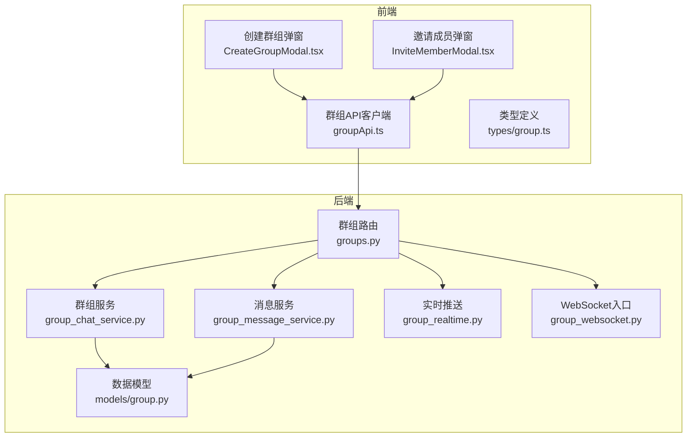
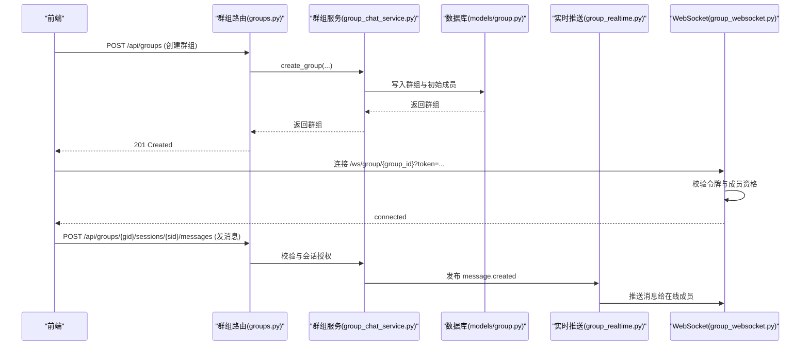
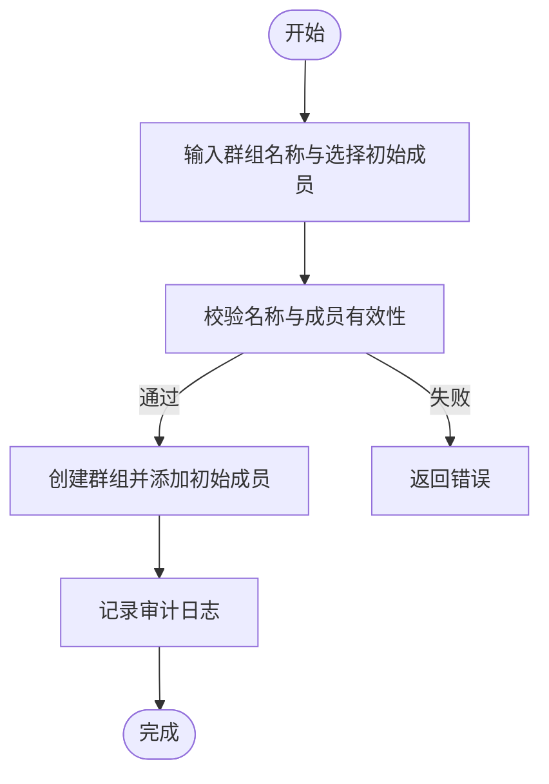
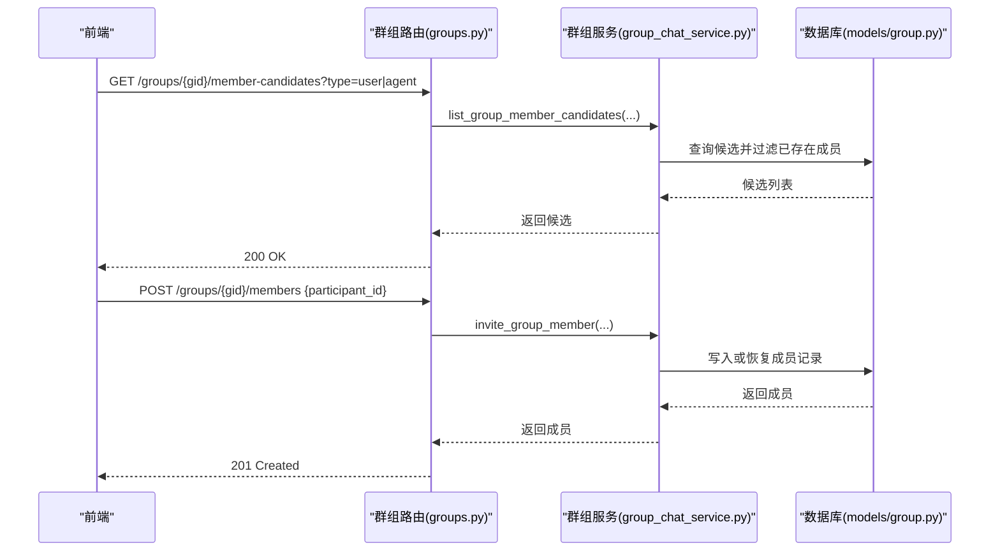
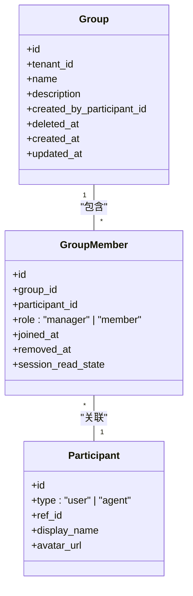
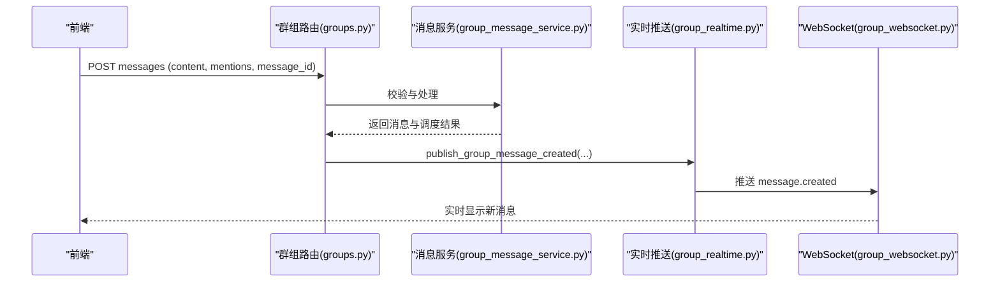
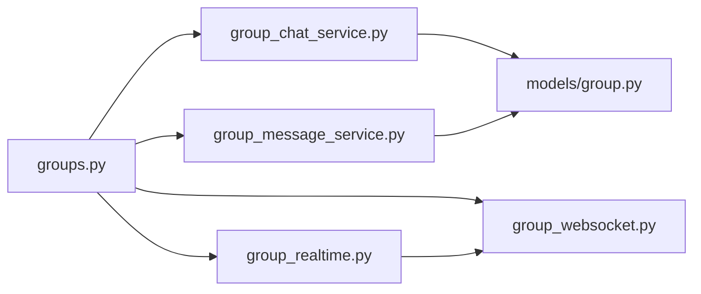

# 群组管理

<cite>
**本文引用的文件**   
- [backend/app/api/groups.py](file://backend/app/api/groups.py)
- [backend/app/models/group.py](file://backend/app/models/group.py)
- [backend/app/services/group_chat_service.py](file://backend/app/services/group_chat_service.py)
- [backend/app/services/group_message_service.py](file://backend/app/services/group_message_service.py)
- [backend/app/services/group_realtime.py](file://backend/app/services/group_realtime.py)
- [backend/app/api/group_websocket.py](file://backend/app/api/group_websocket.py)
- [frontend/src/types/group.ts](file://frontend/src/types/group.ts)
- [frontend/src/pages/groups/CreateGroupModal.tsx](file://frontend/src/pages/groups/CreateGroupModal.tsx)
- [frontend/src/pages/groups/InviteMemberModal.tsx](file://frontend/src/pages/groups/InviteMemberModal.tsx)
- [frontend/src/services/groupApi.ts](file://frontend/src/services/groupApi.ts)
</cite>

## 目录
1. [简介](#简介)
2. [项目结构](#项目结构)
3. [核心组件](#核心组件)
4. [架构总览](#架构总览)
5. [详细组件分析](#详细组件分析)
6. [依赖关系分析](#依赖关系分析)
7. [性能与可用性](#性能与可用性)
8. [故障排查指南](#故障排查指南)
9. [最佳实践](#最佳实践)
10. [常见问题](#常见问题)
11. [结论](#结论)

## 简介
本文件面向使用“群组管理”功能的用户与实施人员，系统说明如何创建群组、邀请成员、设置权限以及修改群组基础信息。文档同时覆盖后端接口、数据模型与服务逻辑，以及前端交互流程，帮助读者快速上手并高效排错。

## 项目结构
群组功能由前后端协同实现：
- 后端提供 REST API（/api/groups）与 WebSocket（/ws/group/{group_id}），负责群组的创建、更新、删除、成员管理与消息收发等。
- 前端通过类型定义与 API 客户端调用后端能力，并提供创建群组、邀请成员等交互界面。

图表来源
- [backend/app/api/groups.py](file://backend/app/api/groups.py)
- [backend/app/services/group_chat_service.py](file://backend/app/services/group_chat_service.py)
- [backend/app/services/group_message_service.py](file://backend/app/services/group_message_service.py)
- [backend/app/services/group_realtime.py](file://backend/app/services/group_realtime.py)
- [backend/app/api/group_websocket.py](file://backend/app/api/group_websocket.py)
- [backend/app/models/group.py](file://backend/app/models/group.py)
- [frontend/src/pages/groups/CreateGroupModal.tsx](file://frontend/src/pages/groups/CreateGroupModal.tsx)
- [frontend/src/pages/groups/InviteMemberModal.tsx](file://frontend/src/pages/groups/InviteMemberModal.tsx)
- [frontend/src/services/groupApi.ts](file://frontend/src/services/groupApi.ts)
- [frontend/src/types/group.ts](file://frontend/src/types/group.ts)

章节来源
- [backend/app/api/groups.py](file://backend/app/api/groups.py)
- [backend/app/models/group.py](file://backend/app/models/group.py)
- [backend/app/services/group_chat_service.py](file://backend/app/services/group_chat_service.py)
- [frontend/src/services/groupApi.ts](file://frontend/src/services/groupApi.ts)

## 核心组件
- 群组实体与成员关系
  - 群组：包含租户隔离、名称、描述、创建者、时间戳等字段。
  - 成员：记录参与者（用户或智能体）、角色（管理员/普通成员）、加入时间与读状态等。
- 群组服务
  - 创建群组、列出群组、获取群组详情、更新群组元数据、软删除。
  - 成员候选查询、邀请成员、移除成员、成员列表。
  - 会话与消息相关授权校验。
- 消息服务
  - 消息入站校验、@提及解析、多智能体任务规划调度、幂等控制。
- 实时推送
  - 基于 WebSocket 的组内消息广播与连接鉴权。

章节来源
- [backend/app/models/group.py](file://backend/app/models/group.py)
- [backend/app/services/group_chat_service.py](file://backend/app/services/group_chat_service.py)
- [backend/app/services/group_message_service.py](file://backend/app/services/group_message_service.py)
- [backend/app/services/group_realtime.py](file://backend/app/services/group_realtime.py)

## 架构总览
群组管理的请求链路如下：
- 前端通过 groupApi.ts 调用后端 /api/groups 下的 REST 接口。
- 路由层进行鉴权与参数校验，调用服务层完成业务逻辑。
- 服务层对群组、成员、会话、消息等进行持久化操作，并在需要时触发实时推送。
- WebSocket 通道用于将已提交的消息实时推送到在线成员。

图表来源
- [backend/app/api/groups.py](file://backend/app/api/groups.py)
- [backend/app/services/group_chat_service.py](file://backend/app/services/group_chat_service.py)
- [backend/app/services/group_realtime.py](file://backend/app/services/group_realtime.py)
- [backend/app/api/group_websocket.py](file://backend/app/api/group_websocket.py)
- [backend/app/models/group.py](file://backend/app/models/group.py)

## 详细组件分析

### 创建群组
- 前端交互
  - CreateGroupModal.tsx 支持输入群组名称、选择初始成员（用户或智能体），并提交创建请求。
- 后端接口
  - POST /api/groups，请求体包含 name、description、member_participant_ids。
  - 服务层校验创建者身份、成员候选有效性，写入群组与初始成员（创建者为管理员）。
- 关键约束
  - 名称必填且长度限制；成员去重；仅允许活跃的用户或智能体；智能体需对邀请者可见。

图表来源
- [frontend/src/pages/groups/CreateGroupModal.tsx](file://frontend/src/pages/groups/CreateGroupModal.tsx)
- [backend/app/api/groups.py](file://backend/app/api/groups.py)
- [backend/app/services/group_chat_service.py](file://backend/app/services/group_chat_service.py)

章节来源
- [frontend/src/pages/groups/CreateGroupModal.tsx](file://frontend/src/pages/groups/CreateGroupModal.tsx)
- [backend/app/api/groups.py](file://backend/app/api/groups.py)
- [backend/app/services/group_chat_service.py](file://backend/app/services/group_chat_service.py)

### 邀请成员
- 前端交互
  - InviteMemberModal.tsx 展示可邀请的成员候选（用户/智能体），支持搜索与单条邀请。
- 后端接口
  - GET /api/groups/{group_id}/member-candidates?participant_type=user|agent
  - POST /api/groups/{group_id}/members 邀请成员
- 邀请流程要点
  - 仅当前租户活跃用户或智能体可被邀请；智能体需满足可见性规则；重复邀请会返回冲突错误；支持恢复已移除成员。

图表来源
- [frontend/src/pages/groups/InviteMemberModal.tsx](file://frontend/src/pages/groups/InviteMemberModal.tsx)
- [backend/app/api/groups.py](file://backend/app/api/groups.py)
- [backend/app/services/group_chat_service.py](file://backend/app/services/group_chat_service.py)
- [backend/app/models/group.py](file://backend/app/models/group.py)

章节来源
- [frontend/src/pages/groups/InviteMemberModal.tsx](file://frontend/src/pages/groups/InviteMemberModal.tsx)
- [backend/app/api/groups.py](file://backend/app/api/groups.py)
- [backend/app/services/group_chat_service.py](file://backend/app/services/group_chat_service.py)

### 群组权限体系
- 角色与权限
  - 管理员（manager）：拥有群组管理权限，如移除成员、更新群组信息等。
  - 普通成员（member）：可参与聊天、查看会话与消息等。
- 权限校验关键点
  - 创建者自动成为管理员。
  - 移除成员需管理员权限。
  - 更新群组元数据需为活跃人类成员（管理员或普通成员均可，具体操作受接口约束）。
  - 智能体不可加入私有访问模式的群组。

图表来源
- [backend/app/models/group.py](file://backend/app/models/group.py)

章节来源
- [backend/app/models/group.py](file://backend/app/models/group.py)
- [backend/app/services/group_chat_service.py](file://backend/app/services/group_chat_service.py)

### 群组设置与基础信息修改
- 支持的字段
  - 名称（name）：必填校验，长度限制。
  - 描述（description）：可选，按需更新。
- 操作方式
  - PATCH /api/groups/{group_id}，仅传入需要更新的字段。
- 注意事项
  - 至少提供一个待更新字段；更新后更新时间戳刷新。

章节来源
- [backend/app/api/groups.py](file://backend/app/api/groups.py)
- [backend/app/services/group_chat_service.py](file://backend/app/services/group_chat_service.py)

### 消息与实时协作
- 消息发送
  - POST /api/groups/{group_id}/sessions/{session_id}/messages，支持 @提及与幂等 message_id。
  - 服务层校验内容长度、提及数量与有效性，必要时触发多智能体规划。
- 实时推送
  - WebSocket /ws/group/{group_id}?token=... 建立连接，定期校验成员资格。
  - 消息提交后通过 group_realtime.py 广播 message.created 到在线成员。

图表来源
- [backend/app/api/groups.py](file://backend/app/api/groups.py)
- [backend/app/services/group_message_service.py](file://backend/app/services/group_message_service.py)
- [backend/app/services/group_realtime.py](file://backend/app/services/group_realtime.py)
- [backend/app/api/group_websocket.py](file://backend/app/api/group_websocket.py)

章节来源
- [backend/app/api/groups.py](file://backend/app/api/groups.py)
- [backend/app/services/group_message_service.py](file://backend/app/services/group_message_service.py)
- [backend/app/services/group_realtime.py](file://backend/app/services/group_realtime.py)
- [backend/app/api/group_websocket.py](file://backend/app/api/group_websocket.py)

## 依赖关系分析
- 路由层依赖服务层完成业务逻辑，服务层依赖数据模型进行持久化。
- 消息服务依赖运行时适配器与模型能力以支持多智能体任务规划。
- 实时推送模块在消息提交后异步广播，不影响主事务一致性。

图表来源
- [backend/app/api/groups.py](file://backend/app/api/groups.py)
- [backend/app/services/group_chat_service.py](file://backend/app/services/group_chat_service.py)
- [backend/app/services/group_message_service.py](file://backend/app/services/group_message_service.py)
- [backend/app/services/group_realtime.py](file://backend/app/services/group_realtime.py)
- [backend/app/api/group_websocket.py](file://backend/app/api/group_websocket.py)
- [backend/app/models/group.py](file://backend/app/models/group.py)

章节来源
- [backend/app/api/groups.py](file://backend/app/api/groups.py)
- [backend/app/services/group_chat_service.py](file://backend/app/services/group_chat_service.py)
- [backend/app/services/group_message_service.py](file://backend/app/services/group_message_service.py)
- [backend/app/services/group_realtime.py](file://backend/app/services/group_realtime.py)
- [backend/app/api/group_websocket.py](file://backend/app/api/group_websocket.py)
- [backend/app/models/group.py](file://backend/app/models/group.py)

## 性能与可用性
- 分页与游标
  - 消息列表支持 before/after 游标分页，避免全量加载。
- 幂等与去重
  - 消息发送支持 client-generated message_id，服务端去重防止重复提交。
- 实时推送容错
  - 推送失败不阻塞消息提交，保证最终一致性。
- 连接保活
  - WebSocket 定时 ping/pong 与成员资格重校验，提升稳定性。

章节来源
- [backend/app/api/groups.py](file://backend/app/api/groups.py)
- [backend/app/services/group_message_service.py](file://backend/app/services/group_message_service.py)
- [backend/app/services/group_realtime.py](file://backend/app/services/group_realtime.py)
- [backend/app/api/group_websocket.py](file://backend/app/api/group_websocket.py)

## 故障排查指南
- 常见错误码与含义
  - group_not_found：群组不存在或已被删除。
  - group_access_denied：非活跃成员或无权限访问。
  - group_manager_required：需要管理员权限。
  - group_member_already_active：成员已在群组中。
  - group_human_member_required：需要活跃的人类成员。
  - group_session_not_found：会话不存在。
  - group_sender_invalid：发送者无效或非活跃租户用户。
- 排查步骤
  - 检查令牌与成员资格（WebSocket 连接阶段）。
  - 确认群组与会话是否存在且未被删除。
  - 验证成员角色与权限是否满足操作要求。
  - 查看消息内容长度与提及数量是否符合限制。
  - 关注实时推送日志，定位推送失败原因。

章节来源
- [backend/app/api/groups.py](file://backend/app/api/groups.py)
- [backend/app/services/group_chat_service.py](file://backend/app/services/group_chat_service.py)
- [backend/app/services/group_message_service.py](file://backend/app/services/group_message_service.py)
- [backend/app/api/group_websocket.py](file://backend/app/api/group_websocket.py)

## 最佳实践
- 创建群组
  - 明确群组名称与描述，便于识别与管理。
  - 初始成员尽量只添加必要人员，减少后续管理成本。
- 邀请成员
  - 优先使用“成员候选”接口筛选目标，避免误邀。
  - 对于智能体，确保其可见性与状态符合预期。
- 权限管理
  - 管理员谨慎授予，避免权限扩散。
  - 定期审查成员列表，清理不再需要的成员。
- 消息协作
  - 合理使用 @提及，聚焦讨论主题。
  - 利用游标分页与未读数管理，提升阅读效率。
- 安全与合规
  - 保持令牌有效，避免共享敏感链接。
  - 遵循租户隔离策略，不在跨租户间分享群组。

[本节为通用指导，无需特定文件引用]

## 常见问题
- 无法创建群组
  - 检查名称是否为空或超长；确认创建者为活跃人类成员。
- 邀请失败
  - 目标成员不在候选列表或已存在于群组；智能体可能不可见或处于私有模式。
- 无法发送消息
  - 内容为空或超长；@提及数量超限；发送者非活跃成员。
- 实时消息不更新
  - 检查 WebSocket 连接是否成功；确认成员资格未被撤销；查看推送日志。

章节来源
- [backend/app/api/groups.py](file://backend/app/api/groups.py)
- [backend/app/services/group_chat_service.py](file://backend/app/services/group_chat_service.py)
- [backend/app/services/group_message_service.py](file://backend/app/services/group_message_service.py)
- [backend/app/api/group_websocket.py](file://backend/app/api/group_websocket.py)

## 结论
群组管理功能提供了完整的群组生命周期管理能力，涵盖创建、成员邀请、权限控制、消息协作与实时推送。通过清晰的权限模型与稳健的服务设计，用户可以在租户隔离环境下高效协作。建议遵循最佳实践与安全规范，以获得稳定、安全的群组体验。

[本节为总结性内容，无需特定文件引用]