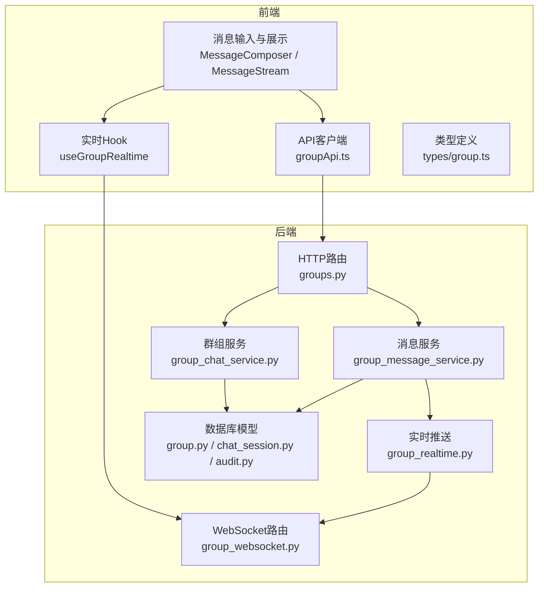
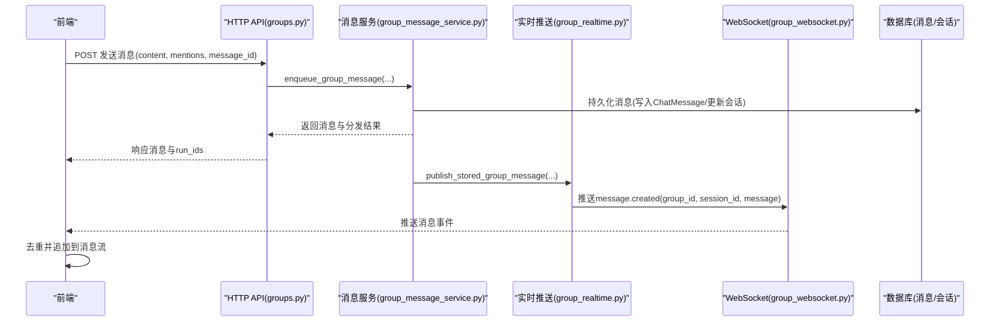
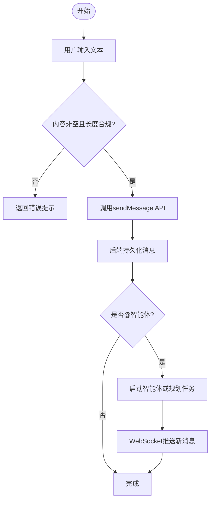
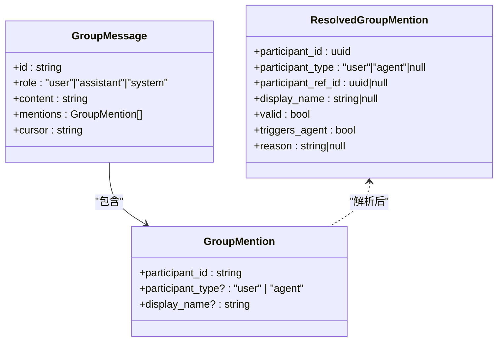
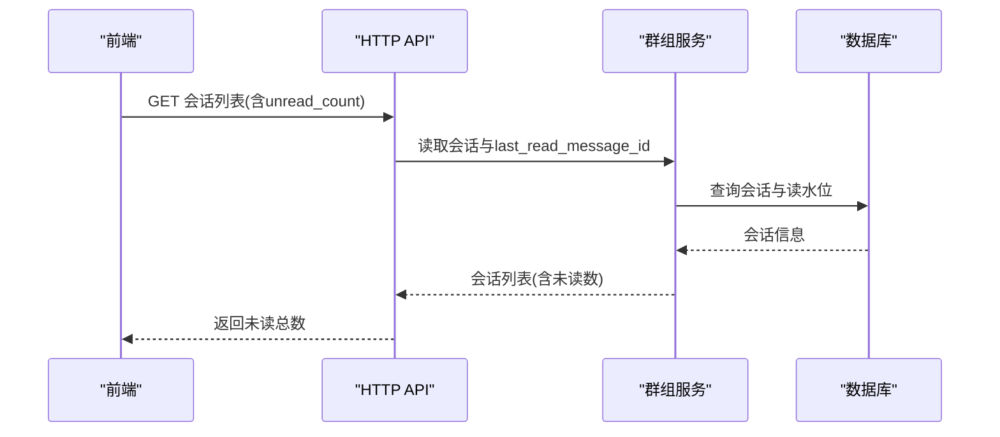
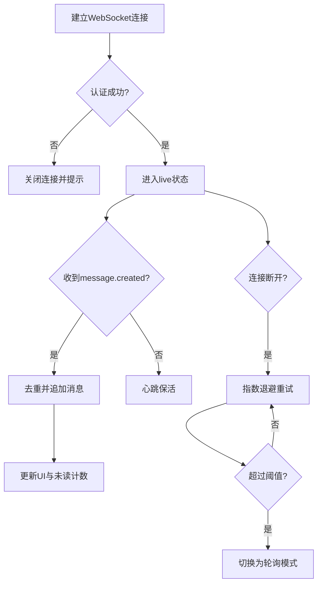
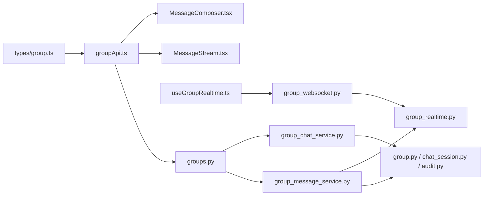

# 群组聊天

<cite>
**本文引用的文件**   
- [group_websocket.py](file://backend/app/api/group_websocket.py)
- [group_chat_service.py](file://backend/app/services/group_chat_service.py)
- [group_message_service.py](file://backend/app/services/group_message_service.py)
- [group_realtime.py](file://backend/app/services/group_realtime.py)
- [groups.py](file://backend/app/api/groups.py)
- [messages.py](file://backend/app/api/messages.py)
- [group.ts](file://frontend/src/types/group.ts)
- [groupApi.ts](file://frontend/src/services/groupApi.ts)
- [useGroupRealtime.ts](file://frontend/src/hooks/useGroupRealtime.ts)
- [MessageComposer.tsx](file://frontend/src/pages/groups/MessageComposer.tsx)
- [MessageStream.tsx](file://frontend/src/pages/groups/MessageStream.tsx)
- [useGroupUnread.ts](file://frontend/src/hooks/useGroupUnread.ts)
- [group.py](file://backend/app/models/group.py)
- [chat_session.py](file://backend/app/models/chat_session.py)
- [audit.py](file://backend/app/models/audit.py)
</cite>

## 目录
1. [简介](#简介)
2. [项目结构](#项目结构)
3. [核心组件](#核心组件)
4. [架构总览](#架构总览)
5. [详细组件分析](#详细组件分析)
6. [依赖关系分析](#依赖关系分析)
7. [性能考虑](#性能考虑)
8. [故障排查指南](#故障排查指南)
9. [结论](#结论)
10. [附录](#附录)

## 简介
本指南面向使用“群组聊天”功能的用户与开发者，覆盖消息发送（文本、富文本、表情符号）、@提及（全员、特定成员、角色/智能体）、通知机制（未读计数、提醒设置、免打扰）、历史查看与搜索过滤、转发、界面自定义与快捷键，以及实时通信原理与性能优化建议。文档基于仓库中的后端 API、服务层、WebSocket、前端页面与类型定义进行系统化说明。

## 项目结构
群组聊天功能由前后端协同实现：
- 后端
  - API 路由：群组、会话、消息、运行状态等 HTTP 接口
  - 领域服务：群组管理、消息入队与分发、实时推送
  - WebSocket：群组级实时通道
  - 数据模型：群组、会话、消息等
- 前端
  - 类型定义：群组、会话、消息、运行状态等
  - API 客户端：封装 /api/groups 调用
  - 实时 Hook：WebSocket 连接、断线重连、回退轮询
  - 页面组件：消息输入框（含 @ 提及）、消息流渲染、未读统计

图表来源
- [groups.py:1-120](file://backend/app/api/groups.py#L1-L120)
- [group_websocket.py:1-118](file://backend/app/api/group_websocket.py#L1-L118)
- [group_chat_service.py:1-120](file://backend/app/services/group_chat_service.py#L1-L120)
- [group_message_service.py:1-120](file://backend/app/services/group_message_service.py#L1-L120)
- [group_realtime.py:1-60](file://backend/app/services/group_realtime.py#L1-L60)
- [group.ts:1-60](file://frontend/src/types/group.ts#L1-L60)
- [groupApi.ts:1-120](file://frontend/src/services/groupApi.ts#L1-L120)
- [useGroupRealtime.ts:1-120](file://frontend/src/hooks/useGroupRealtime.ts#L1-L120)
- [group.py:1-60](file://backend/app/models/group.py#L1-L60)
- [chat_session.py:1-60](file://backend/app/models/chat_session.py#L1-L60)
- [audit.py:1-60](file://backend/app/models/audit.py#L1-L60)

章节来源
- [groups.py:1-120](file://backend/app/api/groups.py#L1-L120)
- [group_websocket.py:1-118](file://backend/app/api/group_websocket.py#L1-L118)
- [group_chat_service.py:1-120](file://backend/app/services/group_chat_service.py#L1-L120)
- [group_message_service.py:1-120](file://backend/app/services/group_message_service.py#L1-L120)
- [group_realtime.py:1-60](file://backend/app/services/group_realtime.py#L1-L60)
- [group.ts:1-60](file://frontend/src/types/group.ts#L1-L60)
- [groupApi.ts:1-120](file://frontend/src/services/groupApi.ts#L1-L120)
- [useGroupRealtime.ts:1-120](file://frontend/src/hooks/useGroupRealtime.ts#L1-L120)
- [group.py:1-60](file://backend/app/models/group.py#L1-L60)
- [chat_session.py:1-60](file://backend/app/models/chat_session.py#L1-L60)
- [audit.py:1-60](file://backend/app/models/audit.py#L1-L60)

## 核心组件
- 群组与会话
  - 群组：租户内长期存在的协作空间，支持成员管理与权限控制
  - 会话：统一聊天会话模型，支持 direct/group/a2a/trigger 多种类型；群组会话通过 group_id 关联
- 消息与持久化
  - 消息：统一存储于 chat_messages，包含角色、内容、参与者、@提及、时间戳
  - 分页：基于 (created_at, id) 的游标排序，支持 before/after 双向翻页
- 实时通信
  - WebSocket：按 group_id 命名空间隔离，认证通过后建立连接，推送 message.created 事件
  - 断线恢复：前端自动重试并回退为轮询，保证消息不丢失
- 消息分发与智能体协作
  - @提及解析：仅对有效成员且活跃的参与者生效；单智能体直接调度，多智能体进入规划模式
  - 运行状态：支持查询与取消正在运行的任务

章节来源
- [group_chat_service.py:1-120](file://backend/app/services/group_chat_service.py#L1-L120)
- [group_message_service.py:1-120](file://backend/app/services/group_message_service.py#L1-L120)
- [group_realtime.py:1-60](file://backend/app/services/group_realtime.py#L1-L60)
- [chat_session.py:1-60](file://backend/app/models/chat_session.py#L1-L60)
- [audit.py:1-60](file://backend/app/models/audit.py#L1-L60)

## 架构总览
群组聊天的端到端流程如下：
- 发送消息：前端通过 REST 提交消息与 @提及，后端校验权限、持久化消息、触发智能体或规划任务，并通过 WebSocket 广播新消息
- 接收消息：WebSocket 推送 message.created，前端去重后追加到消息流；断线时通过游标拉取缺失片段
- 未读计数：会话级别维护 last_read_message_id，前端根据游标比较计算未读

图表来源
- [groups.py:1-120](file://backend/app/api/groups.py#L1-L120)
- [group_message_service.py:1-120](file://backend/app/services/group_message_service.py#L1-L120)
- [group_realtime.py:1-60](file://backend/app/services/group_realtime.py#L1-L60)
- [group_websocket.py:1-118](file://backend/app/api/group_websocket.py#L1-L118)
- [audit.py:1-60](file://backend/app/models/audit.py#L1-L60)

## 详细组件分析

### 消息发送与富文本编辑
- 文本消息
  - 前端输入框支持自动增高、Enter 发送、Shift+Enter 换行
  - 后端限制最大长度，空内容拒绝
- 富文本渲染
  - 智能体回复以 Markdown 渲染，用户消息保留原始文本并按 @提及高亮
- 表情符号插入
  - 当前输入框为纯文本，表情可通过系统输入法或外部粘贴方式插入；后端不限制表情字符

图表来源
- [MessageComposer.tsx:1-120](file://frontend/src/pages/groups/MessageComposer.ts#L1-L120)
- [MessageStream.tsx:1-120](file://frontend/src/pages/groups/MessageStream.ts#L1-L120)
- [group_message_service.py:1-120](file://backend/app/services/group_message_service.py#L1-L120)
- [group_realtime.py:1-60](file://backend/app/services/group_realtime.py#L1-L60)

章节来源
- [MessageComposer.tsx:1-120](file://frontend/src/pages/groups/MessageComposer.tsx#L1-L120)
- [MessageStream.tsx:1-120](file://frontend/src/pages/groups/MessageStream.tsx#L1-L120)
- [group_message_service.py:1-120](file://backend/app/services/group_message_service.py#L1-L120)

### @提及功能
- 成员提及
  - 输入 @ 触发候选列表，支持键盘上下选择、回车确认；绑定稳定的 participant_id，避免显示名变更导致失效
- 全员提及
  - 通过批量选择多个成员实现；后端对重复提及去重，限制最大数量
- 角色/智能体提及
  - 智能体作为参与者可被 @；单智能体直接调度执行，多智能体进入规划模式（先规划再分工）
- 有效性校验
  - 仅活跃成员有效；智能体需处于可用状态且具备可用模型

图表来源
- [group.ts:1-90](file://frontend/src/types/group.ts#L1-L90)
- [group_message_service.py:1-120](file://backend/app/services/group_message_service.py#L1-L120)

章节来源
- [MessageComposer.tsx:1-120](file://frontend/src/pages/groups/MessageComposer.tsx#L1-L120)
- [group_message_service.py:1-120](file://backend/app/services/group_message_service.py#L1-L120)
- [group.ts:1-90](file://frontend/src/types/group.ts#L1-L90)

### 消息通知机制
- 未读计数
  - 会话级别维护 last_read_message_id；前端通过游标比较计算未读
  - 侧边栏聚合所有群组会话未读数，定时刷新
- 消息提醒设置
  - 当前未提供全局开关；可在前端通过隐藏会话或关闭标签页减少干扰
- 免打扰模式
  - 前端可通过暂停 useGroupRealtime 或切换为轮询模式降低推送频率

图表来源
- [useGroupUnread.ts:1-42](file://frontend/src/hooks/useGroupUnread.ts#L1-L42)
- [groups.py:1-120](file://backend/app/api/groups.py#L1-L120)
- [group_chat_service.py:1-120](file://backend/app/services/group_chat_service.py#L1-L120)

章节来源
- [useGroupUnread.ts:1-42](file://frontend/src/hooks/useGroupUnread.ts#L1-L42)
- [groups.py:1-120](file://backend/app/api/groups.py#L1-L120)
- [group_chat_service.py:1-120](file://backend/app/services/group_chat_service.py#L1-L120)

### 历史记录查看、搜索过滤与转发
- 历史查看
  - 支持 before/after 游标分页，默认加载最新一页；滚动到顶部加载更多更早消息
- 搜索过滤
  - 当前未提供服务端全文检索；前端可按内容关键字过滤本地消息列表
- 转发
  - 当前未提供消息转发接口；可将内容复制后发送到其他会话或群组

章节来源
- [group_message_service.py:1-120](file://backend/app/services/group_message_service.py#L1-L120)
- [groupApi.ts:1-120](file://frontend/src/services/groupApi.ts#L1-L120)
- [MessageStream.tsx:1-120](file://frontend/src/pages/groups/MessageStream.tsx#L1-L120)

### 聊天界面自定义与快捷键
- 界面自定义
  - 智能体消息使用 Markdown 渲染；用户消息按 @提及高亮显示
  - 会话标题自动从首条消息截取前缀
- 快捷键
  - Enter 发送，Shift+Enter 换行
  - @ 提及：上下键选择，回车/Tab 确认，Esc 取消

章节来源
- [MessageStream.tsx:1-120](file://frontend/src/pages/groups/MessageStream.tsx#L1-L120)
- [MessageComposer.tsx:1-120](file://frontend/src/pages/groups/MessageComposer.tsx#L1-L120)

### 实时通信的技术实现与性能优化
- 技术实现
  - WebSocket 按 group_id 命名空间隔离，认证通过后建立连接
  - 推送 message.created 事件，包含 cursor（created_at|id）用于一致性比较
  - 前端断线自动重试，失败阈值后降级为轮询，确保消息不丢失
- 性能优化
  - 游标分页限制每页大小，避免大负载
  - 前端去重与增量追加，减少重渲染
  - 后台推送失败不影响已持久化的消息，保证最终一致性

图表来源
- [group_websocket.py:1-118](file://backend/app/api/group_websocket.py#L1-L118)
- [useGroupRealtime.ts:1-120](file://frontend/src/hooks/useGroupRealtime.ts#L1-L120)
- [group_realtime.py:1-60](file://backend/app/services/group_realtime.py#L1-L60)

章节来源
- [group_websocket.py:1-118](file://backend/app/api/group_websocket.py#L1-L118)
- [useGroupRealtime.ts:1-120](file://frontend/src/hooks/useGroupRealtime.ts#L1-L120)
- [group_realtime.py:1-60](file://backend/app/services/group_realtime.py#L1-L60)

## 依赖关系分析
- 前端依赖
  - types/group.ts 定义数据结构，groupApi.ts 封装 HTTP 调用，useGroupRealtime.ts 管理 WebSocket 与轮询
  - MessageComposer.tsx 与 MessageStream.tsx 负责输入与展示
- 后端依赖
  - groups.py 暴露 HTTP 接口，调用 group_chat_service.py 与 group_message_service.py
  - group_message_service.py 负责消息入队与分发，group_realtime.py 负责推送
  - 数据模型 group.py、chat_session.py、audit.py 提供持久化支撑

图表来源
- [group.ts:1-129](file://frontend/src/types/group.ts#L1-L129)
- [groupApi.ts:1-120](file://frontend/src/services/groupApi.ts#L1-L120)
- [MessageComposer.tsx:1-120](file://frontend/src/pages/groups/MessageComposer.tsx#L1-L120)
- [MessageStream.tsx:1-120](file://frontend/src/pages/groups/MessageStream.tsx#L1-L120)
- [useGroupRealtime.ts:1-120](file://frontend/src/hooks/useGroupRealtime.ts#L1-L120)
- [group_websocket.py:1-118](file://backend/app/api/group_websocket.py#L1-L118)
- [group_realtime.py:1-60](file://backend/app/services/group_realtime.py#L1-L60)
- [groups.py:1-120](file://backend/app/api/groups.py#L1-L120)
- [group_chat_service.py:1-120](file://backend/app/services/group_chat_service.py#L1-L120)
- [group_message_service.py:1-120](file://backend/app/services/group_message_service.py#L1-L120)
- [group.py:1-60](file://backend/app/models/group.py#L1-L60)
- [chat_session.py:1-60](file://backend/app/models/chat_session.py#L1-L60)
- [audit.py:1-60](file://backend/app/models/audit.py#L1-L60)

章节来源
- [group.ts:1-129](file://frontend/src/types/group.ts#L1-L129)
- [groupApi.ts:1-120](file://frontend/src/services/groupApi.ts#L1-L120)
- [MessageComposer.tsx:1-120](file://frontend/src/pages/groups/MessageComposer.tsx#L1-L120)
- [MessageStream.tsx:1-120](file://frontend/src/pages/groups/MessageStream.tsx#L1-L120)
- [useGroupRealtime.ts:1-120](file://frontend/src/hooks/useGroupRealtime.ts#L1-L120)
- [group_websocket.py:1-118](file://backend/app/api/group_websocket.py#L1-L118)
- [group_realtime.py:1-60](file://backend/app/services/group_realtime.py#L1-L60)
- [groups.py:1-120](file://backend/app/api/groups.py#L1-L120)
- [group_chat_service.py:1-120](file://backend/app/services/group_chat_service.py#L1-L120)
- [group_message_service.py:1-120](file://backend/app/services/group_message_service.py#L1-L120)
- [group.py:1-60](file://backend/app/models/group.py#L1-L60)
- [chat_session.py:1-60](file://backend/app/models/chat_session.py#L1-L60)
- [audit.py:1-60](file://backend/app/models/audit.py#L1-L60)

## 性能考虑
- 分页与游标
  - 使用 (created_at, id) 游标保证稳定顺序，避免时间精度问题导致的丢消息
  - 限制每页大小，防止一次性加载过多数据
- 去重与增量
  - 前端对消息 ID 去重，仅追加新增消息，减少重渲染开销
- 断线恢复
  - 指数退避重试，失败阈值后切换轮询，保障可用性
- 推送容错
  - 推送失败不影响已持久化的消息，保证最终一致性

[本节为通用指导，无需引用具体文件]

## 故障排查指南
- 常见问题
  - 认证失败：检查 token 是否有效，确保 WebSocket URL 正确
  - 无消息推送：检查网络连通性与浏览器控制台错误；确认组内成员状态
  - 未读计数异常：核对 last_read_message_id 与游标比较逻辑
- 定位方法
  - 查看后端日志中 WebSocket 与推送相关警告
  - 前端控制台观察 WebSocket 状态与消息事件
  - 检查数据库会话的 last_read_message_id 与消息 created_at

章节来源
- [group_websocket.py:1-118](file://backend/app/api/group_websocket.py#L1-L118)
- [group_realtime.py:1-60](file://backend/app/services/group_realtime.py#L1-L60)
- [useGroupRealtime.ts:1-120](file://frontend/src/hooks/useGroupRealtime.ts#L1-L120)

## 结论
群组聊天功能通过统一的会话与消息模型、严格的权限校验、稳定的游标分页与实时推送，提供了可靠的协作体验。@提及与智能体协作增强了自动化能力，前端交互简洁易用。建议在后续迭代中补充全文检索、消息转发与更细粒度的通知设置，以提升用户体验。

[本节为总结性内容，无需引用具体文件]

## 附录
- API 参考
  - 群组管理：创建、更新、删除、成员邀请/移除
  - 会话管理：列出、重命名、删除、标记已读
  - 消息操作：发送、分页查询、运行状态查询与取消
- 快捷键速查
  - Enter 发送，Shift+Enter 换行
  - @ 提及：上下选择，回车/Tab 确认，Esc 取消

章节来源
- [groups.py:1-120](file://backend/app/api/groups.py#L1-L120)
- [groupApi.ts:1-120](file://frontend/src/services/groupApi.ts#L1-L120)
- [MessageComposer.tsx:1-120](file://frontend/src/pages/groups/MessageComposer.tsx#L1-L120)