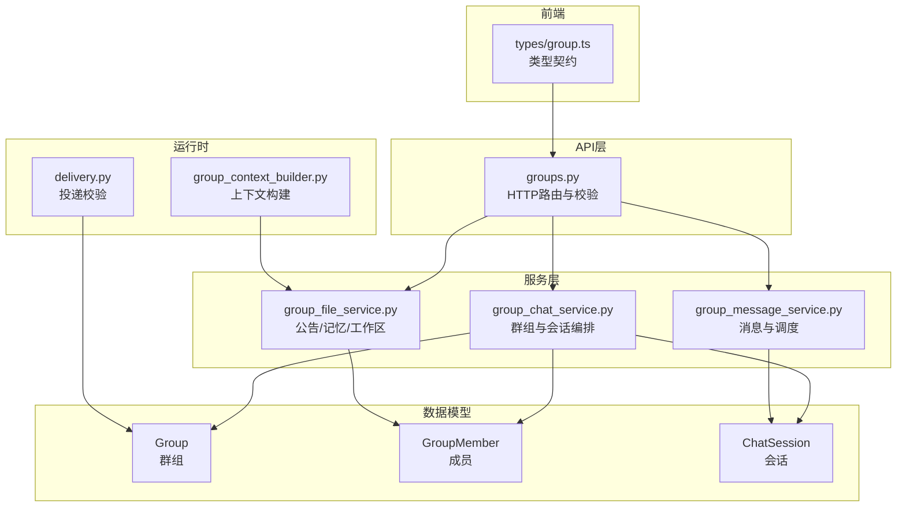
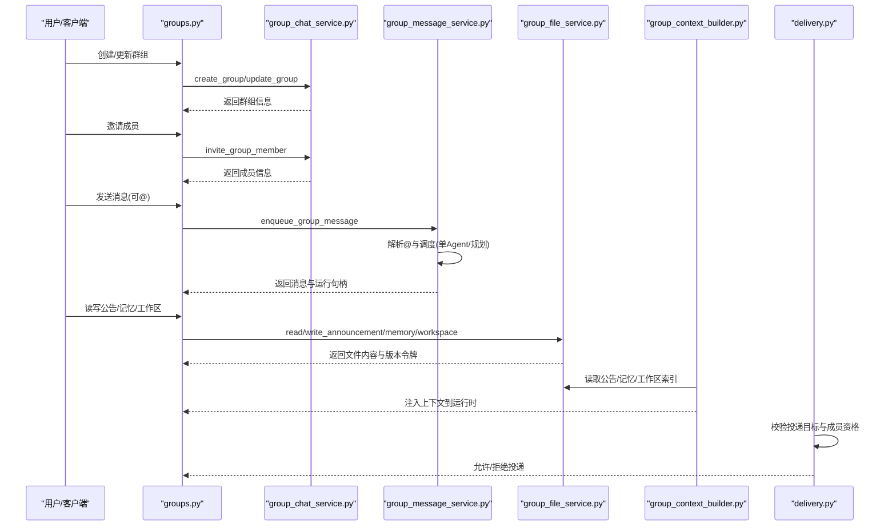
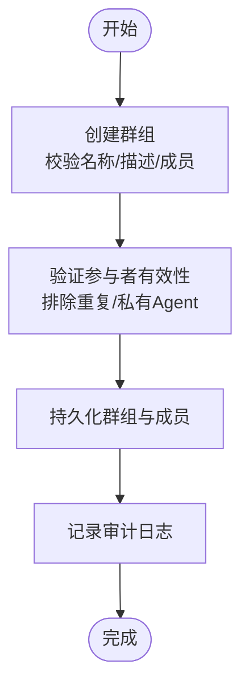
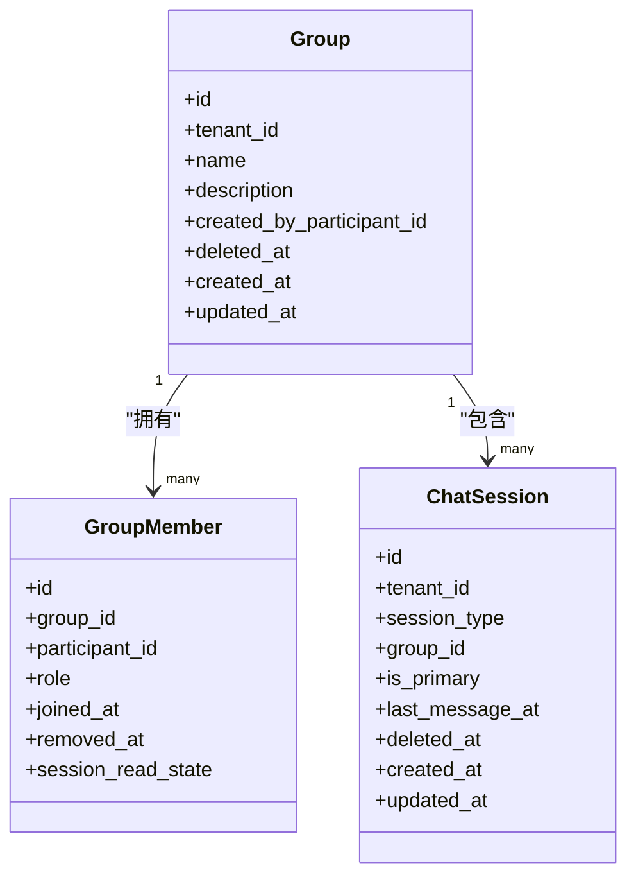
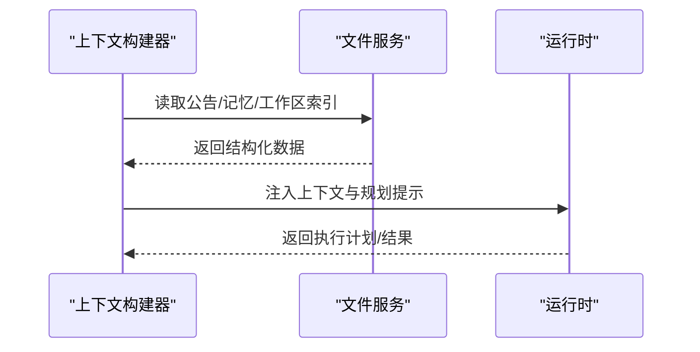
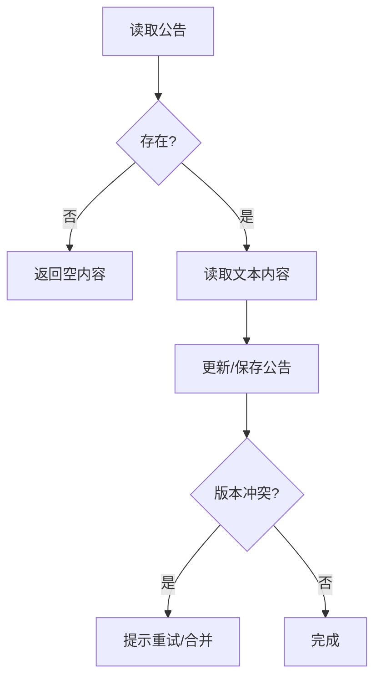
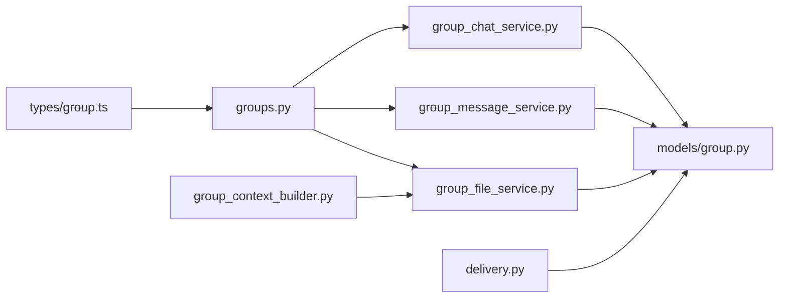

# 群组设置

<cite>
**本文引用的文件**   
- [backend/app/models/group.py](file://backend/app/models/group.py)
- [backend/app/api/groups.py](file://backend/app/api/groups.py)
- [backend/app/services/group_chat_service.py](file://backend/app/services/group_chat_service.py)
- [backend/app/services/group_message_service.py](file://backend/app/services/group_message_service.py)
- [backend/app/services/group_file_service.py](file://backend/app/services/group_file_service.py)
- [backend/app/services/agent_runtime/group_context_builder.py](file://backend/app/services/agent_runtime/group_context_builder.py)
- [backend/app/services/agent_runtime/delivery.py](file://backend/app/services/agent_runtime/delivery.py)
- [backend/app/models/system_settings.py](file://backend/app/models/system_settings.py)
- [backend/app/models/tenant_setting.py](file://backend/app/models/tenant_setting.py)
- [frontend/src/types/group.ts](file://frontend/src/types/group.ts)
</cite>

## 目录
1. [简介](#简介)
2. [项目结构](#项目结构)
3. [核心组件](#核心组件)
4. [架构总览](#架构总览)
5. [详细组件分析](#详细组件分析)
6. [依赖关系分析](#依赖关系分析)
7. [性能与扩展性](#性能与扩展性)
8. [故障排查指南](#故障排查指南)
9. [结论](#结论)
10. [附录：企业级安全与合规配置](#附录企业级安全与合规配置)

## 简介
本指南面向使用“群组”功能的用户与管理员，系统说明群组基础设置、高级设置、记忆与上下文能力、公告管理、模板化实践以及企业级安全与合规配置。内容基于后端模型、服务层与API契约，结合前端类型定义进行解读，帮助你在不同角色下正确配置与管理群组。

## 项目结构
群组功能由以下层次构成：
- 数据模型层：群组、成员、会话等持久化实体
- API层：HTTP接口负责入参校验、鉴权、审计与错误映射
- 服务层：业务编排（创建/更新群组、成员管理、会话生命周期、消息收发、文件读写）
- 运行时集成：上下文构建、多Agent规划、投递与一致性保障
- 前端类型：与后端Schema对齐的TypeScript类型

图表来源 
- [backend/app/models/group.py:24-95](file://backend/app/models/group.py#L24-L95)
- [backend/app/api/groups.py:51-120](file://backend/app/api/groups.py#L51-L120)
- [backend/app/services/group_chat_service.py:378-453](file://backend/app/services/group_chat_service.py#L378-L453)
- [backend/app/services/group_message_service.py:615-747](file://backend/app/services/group_message_service.py#L615-L747)
- [backend/app/services/group_file_service.py:713-761](file://backend/app/services/group_file_service.py#L713-L761)
- [backend/app/services/agent_runtime/group_context_builder.py:293-326](file://backend/app/services/agent_runtime/group_context_builder.py#L293-L326)
- [backend/app/services/agent_runtime/delivery.py:491-539](file://backend/app/services/agent_runtime/delivery.py#L491-L539)
- [frontend/src/types/group.ts:3-129](file://frontend/src/types/group.ts#L3-L129)

章节来源
- [backend/app/models/group.py:24-95](file://backend/app/models/group.py#L24-L95)
- [backend/app/api/groups.py:51-120](file://backend/app/api/groups.py#L51-L120)
- [backend/app/services/group_chat_service.py:378-453](file://backend/app/services/group_chat_service.py#L378-L453)
- [backend/app/services/group_message_service.py:615-747](file://backend/app/services/group_message_service.py#L615-L747)
- [backend/app/services/group_file_service.py:713-761](file://backend/app/services/group_file_service.py#L713-L761)
- [backend/app/services/agent_runtime/group_context_builder.py:293-326](file://backend/app/services/agent_runtime/group_context_builder.py#L293-L326)
- [backend/app/services/agent_runtime/delivery.py:491-539](file://backend/app/services/agent_runtime/delivery.py#L491-L539)
- [frontend/src/types/group.ts:3-129](file://frontend/src/types/group.ts#L3-L129)

## 核心组件
- 群组与成员
  - 群组实体包含名称、描述、创建者、时间戳等；成员记录包含角色（manager/member）、加入/移除时间与读状态快照。
  - 成员角色约束为枚举值，确保权限边界清晰。
- 会话与消息
  - 会话属于群组，支持主会话切换、未读数计算、按游标分页的消息读取。
  - 消息支持@提及，触发单Agent或规划模式的多Agent协作。
- 文件与工作区
  - 公告（announcement.md）用于群内规则与置顶信息；每个Agent有独立memory.md；工作区提供版本化文件操作与冲突检测。
- 上下文与AI特性
  - 上下文构建会聚合公告、Agent记忆与工作区索引，作为提示注入给运行时。
- 设置与配置
  - 系统级与租户级键值设置可用于存储平台与企业策略参数。

章节来源
- [backend/app/models/group.py:24-95](file://backend/app/models/group.py#L24-L95)
- [backend/app/services/group_chat_service.py:836-920](file://backend/app/services/group_chat_service.py#L836-L920)
- [backend/app/services/group_message_service.py:750-800](file://backend/app/services/group_message_service.py#L750-L800)
- [backend/app/services/group_file_service.py:713-761](file://backend/app/services/group_file_service.py#L713-L761)
- [backend/app/services/agent_runtime/group_context_builder.py:293-326](file://backend/app/services/agent_runtime/group_context_builder.py#L293-L326)
- [backend/app/models/system_settings.py:13-21](file://backend/app/models/system_settings.py#L13-L21)
- [backend/app/models/tenant_setting.py:13-31](file://backend/app/models/tenant_setting.py#L13-L31)

## 架构总览
群组设置相关的关键流程包括：创建/更新群组、邀请成员、发送消息（含@触发）、读写公告与记忆、工作区文件变更的一致性控制、上下文构建与投递校验。

图表来源 
- [backend/app/api/groups.py:510-661](file://backend/app/api/groups.py#L510-L661)
- [backend/app/services/group_chat_service.py:378-453](file://backend/app/services/group_chat_service.py#L378-L453)
- [backend/app/services/group_message_service.py:615-747](file://backend/app/services/group_message_service.py#L615-L747)
- [backend/app/services/group_file_service.py:713-761](file://backend/app/services/group_file_service.py#L713-L761)
- [backend/app/services/agent_runtime/group_context_builder.py:293-326](file://backend/app/services/agent_runtime/group_context_builder.py#L293-L326)
- [backend/app/services/agent_runtime/delivery.py:491-539](file://backend/app/services/agent_runtime/delivery.py#L491-L539)

## 详细组件分析

### 群组基础设置（名称、描述、可见性与成员）
- 创建群组
  - 输入字段：名称（必填，长度限制）、描述（可选）、初始成员列表（参与者ID）。
  - 创建后自动将发起者设为manager，并写入审计日志。
- 更新群组
  - 支持部分更新name与description；需至少提供一个字段。
- 成员管理
  - 列出候选成员（用户/Agent），邀请加入，移除成员。
  - 成员角色为member或manager；删除成员时保证至少保留一个manager。
- 可见性
  - 当前实现通过“活跃成员”访问控制；公开可见性不在群组模型中暴露，可通过组织/租户级权限控制Agent可见性。

图表来源 
- [backend/app/api/groups.py:510-541](file://backend/app/api/groups.py#L510-L541)
- [backend/app/services/group_chat_service.py:378-453](file://backend/app/services/group_chat_service.py#L378-L453)

章节来源
- [backend/app/api/groups.py:510-661](file://backend/app/api/groups.py#L510-L661)
- [backend/app/services/group_chat_service.py:378-453](file://backend/app/services/group_chat_service.py#L378-L453)
- [backend/app/services/group_chat_service.py:725-833](file://backend/app/services/group_chat_service.py#L725-L833)
- [backend/app/models/group.py:24-95](file://backend/app/models/group.py#L24-L95)

### 群组高级设置（消息保留、文件存储限制、API访问控制）
- 消息保留策略
  - 消息以会话为单位持久化，支持游标分页；未读数基于成员读水位计算。
  - 会话软删除时会取消相关运行任务，避免残留执行。
- 文件存储限制
  - 文本文件禁止NUL字节与非法编码；二进制文件按扩展名区分处理。
  - 工作区路径必须相对且不允许“..”，禁止特定扩展名（如.exe）。
  - 写操作采用版本令牌与CAS原子性，防止并发覆盖。
- API访问控制
  - 所有接口均要求租户与活跃成员身份；对Agent参与群组有限制（私有Agent不可加入）。
  - 投递阶段校验目标会话与成员资格，确保仅合法Agent投递至群组。

图表来源 
- [backend/app/models/group.py:24-95](file://backend/app/models/group.py#L24-L95)
- [backend/app/services/group_chat_service.py:836-920](file://backend/app/services/group_chat_service.py#L836-L920)

章节来源
- [backend/app/services/group_message_service.py:750-800](file://backend/app/services/group_message_service.py#L750-L800)
- [backend/app/services/group_file_service.py:156-177](file://backend/app/services/group_file_service.py#L156-L177)
- [backend/app/services/group_file_service.py:292-371](file://backend/app/services/group_file_service.py#L292-L371)
- [backend/app/services/agent_runtime/delivery.py:491-539](file://backend/app/services/agent_runtime/delivery.py#L491-L539)

### 群组记忆与上下文（保存、历史管理与智能推荐）
- 上下文构建
  - 读取公告、Agent记忆与工作区索引，组装为运行时上下文。
  - 支持传入mode、plan_prompt、current_responsibility等提示增强。
- 历史数据管理
  - 工作区变更通过预准备修订与最终提交两阶段保证一致性。
  - 撤销/失败场景通过幂等键与重试机制恢复。
- 智能推荐
  - 多Agent规划模式下，根据@目标与可用模型选择调度策略。

图表来源 
- [backend/app/services/agent_runtime/group_context_builder.py:293-326](file://backend/app/services/agent_runtime/group_context_builder.py#L293-L326)
- [backend/app/services/group_file_service.py:713-761](file://backend/app/services/group_file_service.py#L713-L761)

章节来源
- [backend/app/services/agent_runtime/group_context_builder.py:293-326](file://backend/app/services/agent_runtime/group_context_builder.py#L293-L326)
- [backend/app/services/group_file_service.py:460-519](file://backend/app/services/group_file_service.py#L460-L519)

### 群组公告发布与管理（格式、置顶、过期）
- 公告文件
  - 路径固定为announcement.md；人类成员可读写，Agent只读。
  - 支持版本令牌与冲突检测，确保多人编辑一致性。
- 置顶显示
  - 前端样式支持公告编辑器与高亮展示；置顶逻辑由应用层决定（例如在会话顶部渲染）。
- 过期管理
  - 可在公告内容中标注有效期，或由上层定时任务清理旧版本；底层不强制过期语义。

图表来源 
- [backend/app/services/group_file_service.py:713-761](file://backend/app/services/group_file_service.py#L713-L761)

章节来源
- [backend/app/services/group_file_service.py:713-761](file://backend/app/services/group_file_service.py#L713-L761)
- [frontend/src/pages/groups/groups.css:800-817](file://frontend/src/pages/groups/groups.css#L800-L817)

### 群组模板与自定义模板
- 模板使用
  - 通过工作区文件组织模板（如README、SOP、Prompt模板），在创建会话或初始化上下文时引用。
- 自定义模板
  - 在工作区新增目录与文件，遵循相对路径与命名规范；通过上下文构建注入到Agent提示中。
- 最佳实践
  - 使用Markdown结构化模板，便于解析与渲染；避免二进制大文件进入提示上下文。

章节来源
- [backend/app/services/group_file_service.py:129-153](file://backend/app/services/group_file_service.py#L129-L153)
- [backend/app/services/agent_runtime/group_context_builder.py:293-326](file://backend/app/services/agent_runtime/group_context_builder.py#L293-L326)

### 企业级安全与合规配置（概述）
- 访问控制
  - 成员资格校验、Agent可见性控制、私有Agent限制加入群组。
- 数据保护
  - 文本编码校验、二进制文件分类处理、路径安全校验。
- 审计与追踪
  - 关键操作记录审计日志，包含租户、群组、动作与详情。
- 配置存储
  - 系统级与租户级键值设置用于集中管理策略参数。

章节来源
- [backend/app/services/group_chat_service.py:192-226](file://backend/app/services/group_chat_service.py#L192-L226)
- [backend/app/services/group_file_service.py:156-177](file://backend/app/services/group_file_service.py#L156-L177)
- [backend/app/api/groups.py:360-380](file://backend/app/api/groups.py#L360-L380)
- [backend/app/models/system_settings.py:13-21](file://backend/app/models/system_settings.py#L13-L21)
- [backend/app/models/tenant_setting.py:13-31](file://backend/app/models/tenant_setting.py#L13-L31)

## 依赖关系分析
- API层依赖服务层进行业务编排；服务层依赖数据模型与存储后端。
- 上下文构建依赖文件服务与工作区索引；投递校验依赖群组与会话模型。
- 前端类型与后端Schema严格对应，确保前后端契约一致。

图表来源 
- [backend/app/api/groups.py:510-661](file://backend/app/api/groups.py#L510-L661)
- [backend/app/services/group_chat_service.py:378-453](file://backend/app/services/group_chat_service.py#L378-L453)
- [backend/app/services/group_message_service.py:615-747](file://backend/app/services/group_message_service.py#L615-L747)
- [backend/app/services/group_file_service.py:713-761](file://backend/app/services/group_file_service.py#L713-L761)
- [backend/app/services/agent_runtime/group_context_builder.py:293-326](file://backend/app/services/agent_runtime/group_context_builder.py#L293-L326)
- [backend/app/services/agent_runtime/delivery.py:491-539](file://backend/app/services/agent_runtime/delivery.py#L491-L539)
- [frontend/src/types/group.ts:3-129](file://frontend/src/types/group.ts#L3-L129)

章节来源
- [backend/app/api/groups.py:510-661](file://backend/app/api/groups.py#L510-L661)
- [backend/app/services/group_chat_service.py:378-453](file://backend/app/services/group_chat_service.py#L378-L453)
- [backend/app/services/group_message_service.py:615-747](file://backend/app/services/group_message_service.py#L615-L747)
- [backend/app/services/group_file_service.py:713-761](file://backend/app/services/group_file_service.py#L713-L761)
- [backend/app/services/agent_runtime/group_context_builder.py:293-326](file://backend/app/services/agent_runtime/group_context_builder.py#L293-L326)
- [backend/app/services/agent_runtime/delivery.py:491-539](file://backend/app/services/agent_runtime/delivery.py#L491-L539)
- [frontend/src/types/group.ts:3-129](file://frontend/src/types/group.ts#L3-L129)

## 性能与扩展性
- 消息分页与游标
  - 使用(created_at, id)联合排序，避免深分页性能问题；限制单次查询上限。
- 文件操作一致性
  - 预准备修订+CAS原子写入，减少锁竞争与冲突重试成本。
- 上下文构建优化
  - 限制工作区索引条目数量，避免过大上下文影响推理延迟。
- 可扩展点
  - 通过租户级设置扩展策略；通过工作区模板扩展提示工程。

[本节为通用指导，不直接分析具体文件]

## 故障排查指南
- 常见错误码与含义
  - 群组不存在/成员无效/会话不存在：检查租户与成员资格。
  - 消息内容无效/提及过多：校验输入长度与去重。
  - 文件冲突/路径非法：检查版本令牌与相对路径。
  - 规划模型不可用：检查运行时模型配置与可用性。
- 定位步骤
  - 查看API响应中的code与trace_id；核对审计日志。
  - 检查工作区版本令牌是否匹配；确认文件是否存在。
  - 验证Agent状态与模型配置；确认投递目标会话类型。

章节来源
- [backend/app/api/groups.py:298-346](file://backend/app/api/groups.py#L298-L346)
- [backend/app/services/group_message_service.py:48-128](file://backend/app/services/group_message_service.py#L48-L128)
- [backend/app/services/group_file_service.py:40-104](file://backend/app/services/group_file_service.py#L40-L104)
- [backend/app/services/agent_runtime/group_context_builder.py:293-326](file://backend/app/services/agent_runtime/group_context_builder.py#L293-L326)

## 结论
群组设置围绕“成员-会话-消息-文件-上下文”形成闭环。通过严格的权限校验、版本化文件操作与上下文注入，既满足日常协作需求，又具备企业级安全与可扩展性。建议结合租户级设置与工作区模板，持续优化群组治理与AI协作效率。

[本节为总结性内容，不直接分析具体文件]

## 附录：企业级安全与合规配置
- 访问控制清单
  - 成员资格校验、Agent可见性、私有Agent限制、投递目标校验。
- 数据保护清单
  - 文本编码校验、二进制分类、路径安全、版本令牌与CAS。
- 审计与合规
  - 关键操作审计日志、租户隔离、配置集中化管理。
- 配置项建议
  - 系统级：全局策略开关、默认模型、限流阈值。
  - 租户级：公司策略、白名单、模板路径、上下文大小限制。

章节来源
- [backend/app/services/group_chat_service.py:192-226](file://backend/app/services/group_chat_service.py#L192-L226)
- [backend/app/services/group_file_service.py:156-177](file://backend/app/services/group_file_service.py#L156-L177)
- [backend/app/api/groups.py:360-380](file://backend/app/api/groups.py#L360-L380)
- [backend/app/models/system_settings.py:13-21](file://backend/app/models/system_settings.py#L13-L21)
- [backend/app/models/tenant_setting.py:13-31](file://backend/app/models/tenant_setting.py#L13-L31)