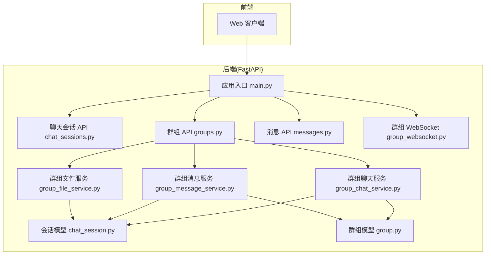
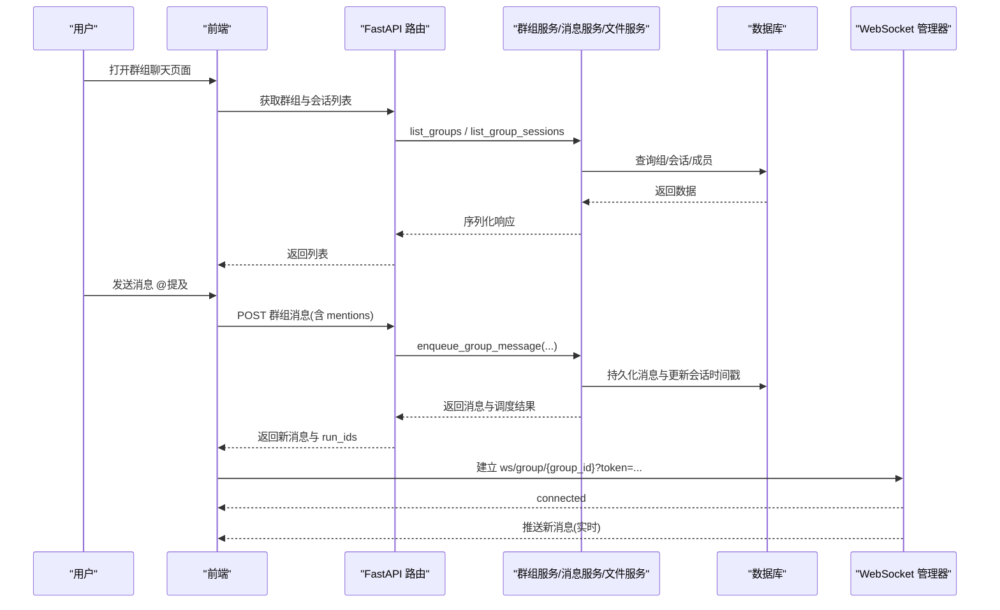
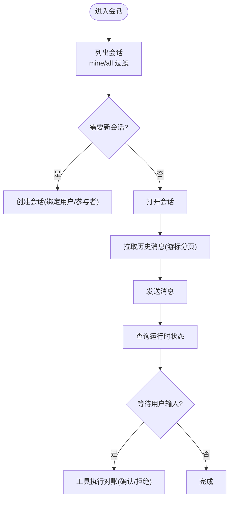
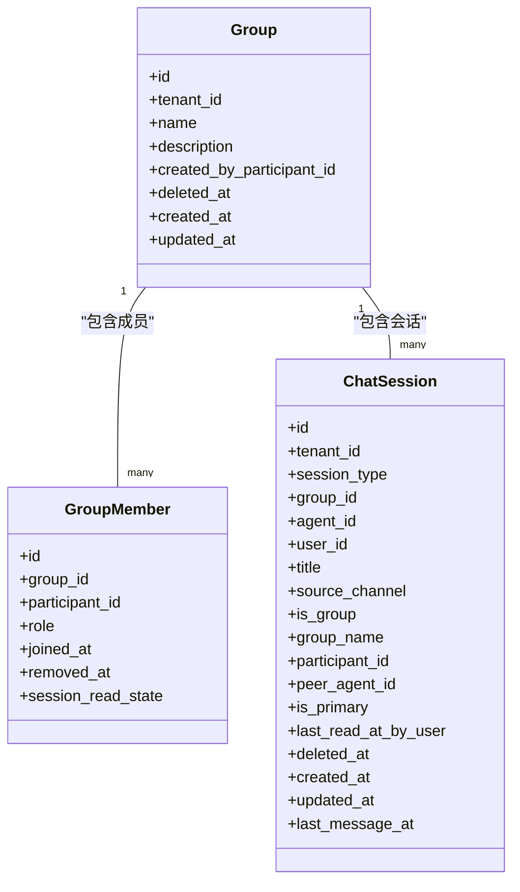
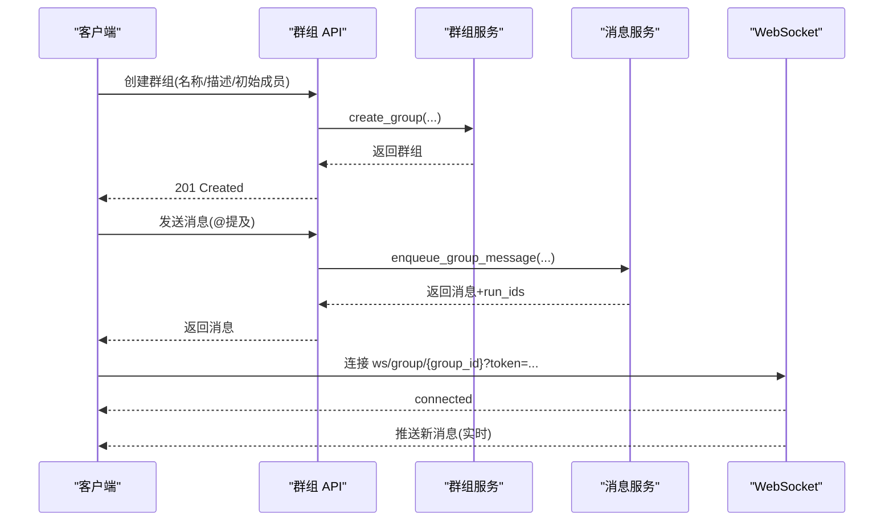
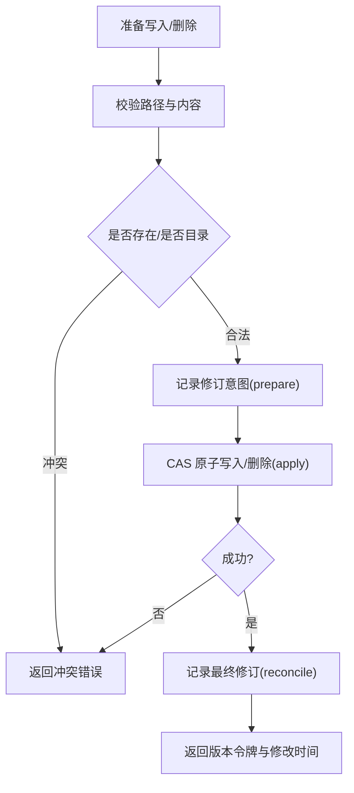
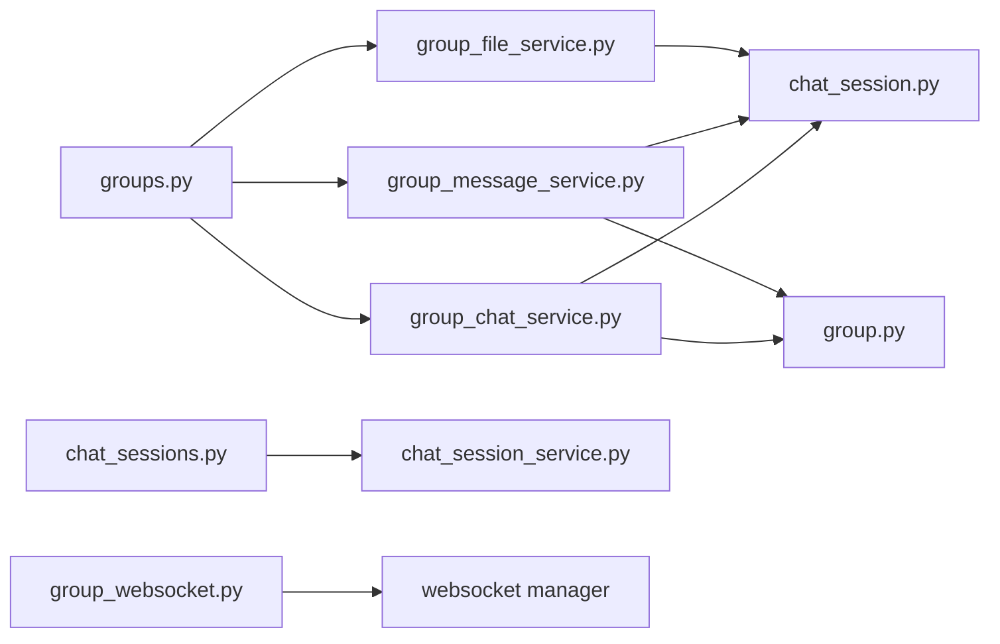

# 聊天协作

<cite>
**本文引用的文件**   
- [README.md](file://README.md)
- [main.py](file://backend/app/main.py)
- [chat_sessions.py](file://backend/app/api/chat_sessions.py)
- [groups.py](file://backend/app/api/groups.py)
- [messages.py](file://backend/app/api/messages.py)
- [group_websocket.py](file://backend/app/api/group_websocket.py)
- [group_chat_service.py](file://backend/app/services/group_chat_service.py)
- [group_message_service.py](file://backend/app/services/group_message_service.py)
- [group_file_service.py](file://backend/app/services/group_file_service.py)
- [chat_session.py](file://backend/app/models/chat_session.py)
- [group.py](file://backend/app/models/group.py)
</cite>

## 目录
1. [简介](#简介)
2. [项目结构](#项目结构)
3. [核心组件](#核心组件)
4. [架构总览](#架构总览)
5. [详细组件分析](#详细组件分析)
6. [依赖关系分析](#依赖关系分析)
7. [性能与扩展性](#性能与扩展性)
8. [故障排查指南](#故障排查指南)
9. [结论](#结论)
10. [附录：API 速查](#附录api-速查)

## 简介
本指南面向使用 Clawith 聊天协作功能的用户与集成开发者，覆盖个人聊天会话、群组聊天创建与管理、文件共享与协作编辑、实时消息通信、@提及、消息搜索与过滤、文件上传下载等能力，并解释“群组工作空间”的概念与高级用法（版本控制、协作编辑、权限管理）。文档同时提供架构图、时序图与流程图，帮助快速上手与排障。

## 项目结构
后端采用 FastAPI 模块化路由与服务分层设计：
- API 层：按功能划分模块（聊天会话、群组、消息、WebSocket 等）
- 服务层：领域服务（群组聊天、消息、文件）封装事务与一致性约束
- 模型层：统一会话模型与群组域模型
- 启动入口：应用生命周期管理、中间件、路由注册、后台任务

图表来源
- [main.py:352-471](file://backend/app/main.py#L352-L471)
- [chat_sessions.py:1-120](file://backend/app/api/chat_sessions.py#L1-L120)
- [groups.py:1-120](file://backend/app/api/groups.py#L1-L120)
- [messages.py:1-101](file://backend/app/api/messages.py#L1-L101)
- [group_websocket.py:1-118](file://backend/app/api/group_websocket.py#L1-L118)
- [group_chat_service.py:1-120](file://backend/app/services/group_chat_service.py#L1-L120)
- [group_message_service.py:1-120](file://backend/app/services/group_message_service.py#L1-L120)
- [group_file_service.py:1-120](file://backend/app/services/group_file_service.py#L1-L120)
- [chat_session.py:1-116](file://backend/app/models/chat_session.py#L1-L116)
- [group.py:1-95](file://backend/app/models/group.py#L1-L95)

章节来源
- [README.md:205-225](file://README.md#L205-L225)
- [main.py:352-471](file://backend/app/main.py#L352-L471)

## 核心组件
- 个人聊天会话（Direct Chat）
  - 会话列表、创建、重命名、删除、运行时状态查询、工具执行对账、消息分页拉取
  - 支持未读数、主会话标记、A2A/群组会话识别
- 群组聊天（Group Chat）
  - 群组 CRUD、成员邀请/移除、会话列表与未读计数、消息收发、@提及触发 Agent 运行或规划
  - 基于 WebSocket 的实时推送与成员资格校验
- 消息与收件箱
  - 聚合 Agent-to-Agent 消息到统一收件箱，展示最近消息与发送者信息
- 群组工作空间与文件协作
  - 公告、Agent 记忆、工作区文件的读写与版本化；支持二进制与文本差异、冲突检测、幂等写入与回滚

章节来源
- [chat_sessions.py:216-356](file://backend/app/api/chat_sessions.py#L216-L356)
- [chat_sessions.py:358-395](file://backend/app/api/chat_sessions.py#L358-L395)
- [chat_sessions.py:397-560](file://backend/app/api/chat_sessions.py#L397-L560)
- [chat_sessions.py:562-668](file://backend/app/api/chat_sessions.py#L562-L668)
- [chat_sessions.py:670-731](file://backend/app/api/chat_sessions.py#L670-L731)
- [chat_sessions.py:794-800](file://backend/app/api/chat_sessions.py#L794-L800)
- [groups.py:510-541](file://backend/app/api/groups.py#L510-L541)
- [groups.py:544-556](file://backend/app/api/groups.py#L544-L556)
- [groups.py:584-601](file://backend/app/api/groups.py#L584-L601)
- [groups.py:603-635](file://backend/app/api/groups.py#L603-L635)
- [groups.py:637-662](file://backend/app/api/groups.py#L637-L662)
- [groups.py:664-682](file://backend/app/api/groups.py#L664-L682)
- [groups.py:684-713](file://backend/app/api/groups.py#L684-L713)
- [groups.py:715-750](file://backend/app/api/groups.py#L715-L750)
- [groups.py:752-780](file://backend/app/api/groups.py#L752-L780)
- [messages.py:26-83](file://backend/app/api/messages.py#L26-L83)
- [messages.py:85-101](file://backend/app/api/messages.py#L85-L101)
- [group_chat_service.py:378-453](file://backend/app/services/group_chat_service.py#L378-L453)
- [group_message_service.py:615-747](file://backend/app/services/group_message_service.py#L615-L747)
- [group_file_service.py:713-762](file://backend/app/services/group_file_service.py#L713-L762)

## 架构总览
系统以 FastAPI 为入口，通过路由将请求分发至各业务模块；群组聊天与文件操作由领域服务保证事务与一致性；WebSocket 提供实时推送；数据模型统一抽象会话与群组实体。

图表来源
- [groups.py:510-541](file://backend/app/api/groups.py#L510-L541)
- [groups.py:782-800](file://backend/app/api/groups.py#L782-L800)
- [group_message_service.py:615-747](file://backend/app/services/group_message_service.py#L615-L747)
- [group_websocket.py:51-118](file://backend/app/api/group_websocket.py#L51-L118)

## 详细组件分析

### 个人聊天会话（Direct Chat）
- 会话列表与筛选
  - 支持 mine/all 范围，自动计算消息数与未读数，区分 A2A 与群组会话
- 创建与重命名
  - 创建时绑定当前租户用户与参与者身份；重命名需会话所有者授权
- 运行时状态与工具对账
  - 查询前台运行的 Run 状态，支持恢复与取消；未知工具执行需用户确认对账
- 消息分页
  - 基于游标 before 参数，避免重复与遗漏

图表来源
- [chat_sessions.py:216-356](file://backend/app/api/chat_sessions.py#L216-L356)
- [chat_sessions.py:358-395](file://backend/app/api/chat_sessions.py#L358-L395)
- [chat_sessions.py:397-560](file://backend/app/api/chat_sessions.py#L397-L560)
- [chat_sessions.py:562-668](file://backend/app/api/chat_sessions.py#L562-L668)
- [chat_sessions.py:794-800](file://backend/app/api/chat_sessions.py#L794-L800)

章节来源
- [chat_sessions.py:216-356](file://backend/app/api/chat_sessions.py#L216-L356)
- [chat_sessions.py:358-395](file://backend/app/api/chat_sessions.py#L358-L395)
- [chat_sessions.py:397-560](file://backend/app/api/chat_sessions.py#L397-L560)
- [chat_sessions.py:562-668](file://backend/app/api/chat_sessions.py#L562-L668)
- [chat_sessions.py:670-731](file://backend/app/api/chat_sessions.py#L670-L731)
- [chat_sessions.py:794-800](file://backend/app/api/chat_sessions.py#L794-L800)

### 群组聊天（Group Chat）
- 群组管理
  - 创建、查看、更新、删除；成员候选查询、邀请、移除；会话列表与未读计数
- 消息收发与 @提及
  - 单提及直接触发目标 Agent；多提及触发多 Agent 规划；消息持久化与幂等
- 实时推送
  - 基于 WebSocket，连接时校验成员资格，周期性重验证

图表来源
- [group.py:24-95](file://backend/app/models/group.py#L24-L95)
- [chat_session.py:23-116](file://backend/app/models/chat_session.py#L23-L116)

图表来源
- [groups.py:510-541](file://backend/app/api/groups.py#L510-L541)
- [group_chat_service.py:378-453](file://backend/app/services/group_chat_service.py#L378-L453)
- [group_message_service.py:615-747](file://backend/app/services/group_message_service.py#L615-L747)
- [group_websocket.py:51-118](file://backend/app/api/group_websocket.py#L51-L118)

章节来源
- [groups.py:510-541](file://backend/app/api/groups.py#L510-L541)
- [groups.py:544-556](file://backend/app/api/groups.py#L544-L556)
- [groups.py:584-601](file://backend/app/api/groups.py#L584-L601)
- [groups.py:603-635](file://backend/app/api/groups.py#L603-L635)
- [groups.py:637-662](file://backend/app/api/groups.py#L637-L662)
- [groups.py:664-682](file://backend/app/api/groups.py#L664-L682)
- [groups.py:684-713](file://backend/app/api/groups.py#L684-L713)
- [groups.py:715-750](file://backend/app/api/groups.py#L715-L750)
- [groups.py:752-780](file://backend/app/api/groups.py#L752-L780)
- [group_chat_service.py:378-453](file://backend/app/services/group_chat_service.py#L378-L453)
- [group_message_service.py:615-747](file://backend/app/services/group_message_service.py#L615-L747)
- [group_websocket.py:51-118](file://backend/app/api/group_websocket.py#L51-L118)

### 消息与收件箱（Messages）
- 收件箱聚合
  - 查询用户创建的 Agent 参与的 Agent-to-Agent 会话的最新消息
- 未读数
  - 当前实现返回 0，可后续增强为逐条已读追踪

章节来源
- [messages.py:26-83](file://backend/app/api/messages.py#L26-L83)
- [messages.py:85-101](file://backend/app/api/messages.py#L85-L101)

### 群组工作空间与文件协作
- 文件类型与路径
  - 公告 announcement.md、Agent 记忆 memory.md、工作区 workspace/*
  - 禁止 .exe 扩展名；文本文件必须 UTF-8 且不含 NUL
- 版本控制与协作
  - 写前准备（prepare）、CAS 原子写入（apply）、冲突检测（version_token）、回滚/幂等（reconcile）
  - 二进制文件不入库文本，仅保留哈希与元数据
- 权限控制
  - 人类成员可写公告与记忆；Agent 仅读；工作区写需具备组成员身份

图表来源
- [group_file_service.py:292-371](file://backend/app/services/group_file_service.py#L292-L371)
- [group_file_service.py:426-458](file://backend/app/services/group_file_service.py#L426-L458)
- [group_file_service.py:460-519](file://backend/app/services/group_file_service.py#L460-L519)
- [group_file_service.py:713-762](file://backend/app/services/group_file_service.py#L713-L762)

章节来源
- [group_file_service.py:1-120](file://backend/app/services/group_file_service.py#L1-L120)
- [group_file_service.py:292-371](file://backend/app/services/group_file_service.py#L292-L371)
- [group_file_service.py:426-458](file://backend/app/services/group_file_service.py#L426-L458)
- [group_file_service.py:460-519](file://backend/app/services/group_file_service.py#L460-L519)
- [group_file_service.py:713-762](file://backend/app/services/group_file_service.py#L713-L762)

## 依赖关系分析
- 路由到服务
  - groups.py 调用 group_chat_service、group_message_service、group_file_service
  - chat_sessions.py 调用 chat_session_service 与运行时状态读取器
- 服务到模型
  - 所有服务通过 SQLAlchemy 访问 ChatSession、Group、GroupMember 等模型
- 实时通道
  - group_websocket.py 复用 websocket manager 进行连接管理与消息广播

图表来源
- [groups.py:1-120](file://backend/app/api/groups.py#L1-L120)
- [chat_sessions.py:1-120](file://backend/app/api/chat_sessions.py#L1-L120)
- [group_chat_service.py:1-120](file://backend/app/services/group_chat_service.py#L1-L120)
- [group_message_service.py:1-120](file://backend/app/services/group_message_service.py#L1-L120)
- [group_file_service.py:1-120](file://backend/app/services/group_file_service.py#L1-L120)
- [chat_session.py:1-116](file://backend/app/models/chat_session.py#L1-L116)
- [group.py:1-95](file://backend/app/models/group.py#L1-L95)
- [group_websocket.py:1-118](file://backend/app/api/group_websocket.py#L1-L118)

章节来源
- [groups.py:1-120](file://backend/app/api/groups.py#L1-L120)
- [chat_sessions.py:1-120](file://backend/app/api/chat_sessions.py#L1-L120)
- [group_chat_service.py:1-120](file://backend/app/services/group_chat_service.py#L1-L120)
- [group_message_service.py:1-120](file://backend/app/services/group_message_service.py#L1-L120)
- [group_file_service.py:1-120](file://backend/app/services/group_file_service.py#L1-L120)
- [group_websocket.py:1-118](file://backend/app/api/group_websocket.py#L1-L118)

## 性能与扩展性
- 游标分页
  - 消息拉取使用 (created_at, id) 复合排序与游标，避免深翻页性能问题
- 并发与锁
  - 群组与成员操作使用行级锁（with_for_update）保障一致性
- 异步与后台任务
  - 启动阶段初始化数据库、种子数据、后台任务（调度器、触发器、渠道连接）
- 存储优化
  - 二进制文件不入库文本，仅存哈希与元数据；文本文件限制大小与编码

[本节为通用指导，无需引用具体文件]

## 故障排查指南
- 认证与权限
  - WebSocket 连接失败：检查 token 解析与组成员资格；服务端会返回明确错误码
  - 群组操作 403/404：确认参与者活跃、租户一致、成员未被移除
- 消息与提及
  - 多提及规划失败：检查多 Agent 规划模型配置；服务会返回友好错误消息
  - 消息幂等冲突：确保 message_id 与不可变字段一致
- 文件协作
  - 版本冲突：提交前获取 version_token，写入失败需重试
  - 非法路径/内容：路径不得包含 .. 或绝对路径；文本必须 UTF-8 且无 NUL

章节来源
- [group_websocket.py:51-118](file://backend/app/api/group_websocket.py#L51-L118)
- [group_message_service.py:41-46](file://backend/app/services/group_message_service.py#L41-L46)
- [group_file_service.py:156-177](file://backend/app/services/group_file_service.py#L156-L177)
- [group_file_service.py:322-331](file://backend/app/services/group_file_service.py#L322-L331)

## 结论
Clawith 的聊天协作能力以统一的会话模型与强一致的群组域服务为核心，结合 WebSocket 实时推送与工作空间版本控制，提供了从个人对话到团队协作的完整方案。通过清晰的权限与冲突处理机制，用户可在安全可控的环境下高效协作。

[本节为总结，无需引用具体文件]

## 附录：API 速查
- 个人聊天会话
  - 列表：GET /api/agents/{agent_id}/sessions?scope={mine|all}
  - 创建：POST /api/agents/{agent_id}/sessions
  - 重命名：PATCH /api/agents/{agent_id}/sessions/{session_id}
  - 删除：DELETE /api/agents/{agent_id}/sessions/{session_id}
  - 运行时状态：GET /api/agents/{agent_id}/sessions/{session_id}/runtime-state
  - 工具对账：POST /api/agents/{agent_id}/sessions/{session_id}/runs/{run_id}/tool-executions/{execution_id}/reconcile
  - 消息分页：GET /api/agents/{agent_id}/sessions/{session_id}/messages?limit=&before=
- 群组聊天
  - 创建：POST /api/groups
  - 列表：GET /api/groups
  - 详情：GET /api/groups/{group_id}
  - 更新：PATCH /api/groups/{group_id}
  - 删除：DELETE /api/groups/{group_id}
  - 成员候选：GET /api/groups/{group_id}/member-candidates?participant_type=user|agent&limit=
  - 邀请成员：POST /api/groups/{group_id}/members
  - 移除成员：DELETE /api/groups/{group_id}/members/{member_id}
  - 会话列表：GET /api/groups/{group_id}/sessions
  - 消息：POST /api/groups/{group_id}/sessions/{session_id}/messages（含 mentions）
  - 实时：ws://.../ws/group/{group_id}?token=...
- 消息与收件箱
  - 收件箱：GET /api/messages/inbox?limit=
  - 未读数：GET /api/messages/unread-count

章节来源
- [chat_sessions.py:216-356](file://backend/app/api/chat_sessions.py#L216-L356)
- [chat_sessions.py:358-395](file://backend/app/api/chat_sessions.py#L358-L395)
- [chat_sessions.py:397-560](file://backend/app/api/chat_sessions.py#L397-L560)
- [chat_sessions.py:562-668](file://backend/app/api/chat_sessions.py#L562-L668)
- [chat_sessions.py:670-731](file://backend/app/api/chat_sessions.py#L670-L731)
- [chat_sessions.py:794-800](file://backend/app/api/chat_sessions.py#L794-L800)
- [groups.py:510-541](file://backend/app/api/groups.py#L510-L541)
- [groups.py:544-556](file://backend/app/api/groups.py#L544-L556)
- [groups.py:584-601](file://backend/app/api/groups.py#L584-L601)
- [groups.py:603-635](file://backend/app/api/groups.py#L603-L635)
- [groups.py:637-662](file://backend/app/api/groups.py#L637-L662)
- [groups.py:664-682](file://backend/app/api/groups.py#L664-L682)
- [groups.py:684-713](file://backend/app/api/groups.py#L684-L713)
- [groups.py:715-750](file://backend/app/api/groups.py#L715-L750)
- [groups.py:752-780](file://backend/app/api/groups.py#L752-L780)
- [messages.py:26-83](file://backend/app/api/messages.py#L26-L83)
- [messages.py:85-101](file://backend/app/api/messages.py#L85-L101)
- [group_websocket.py:51-118](file://backend/app/api/group_websocket.py#L51-L118)