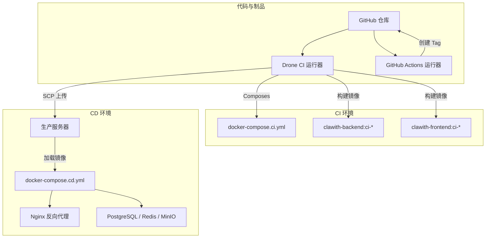
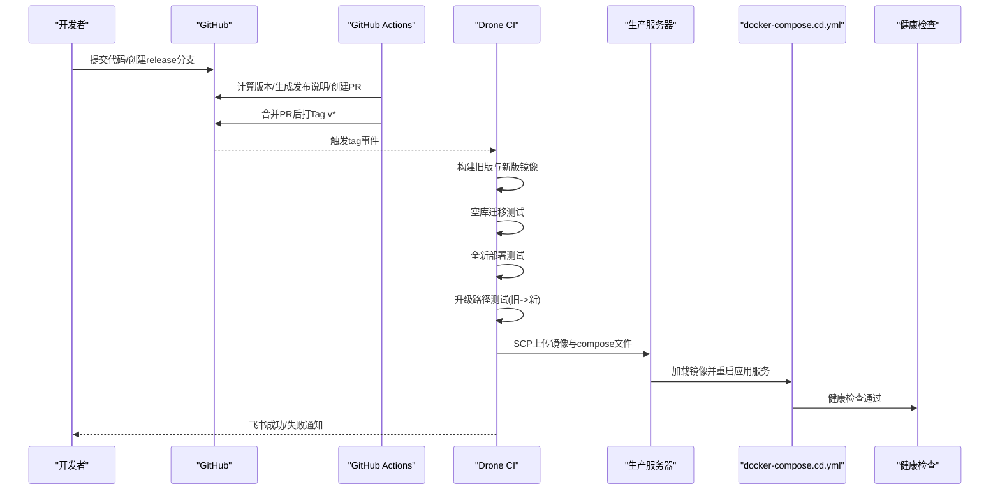
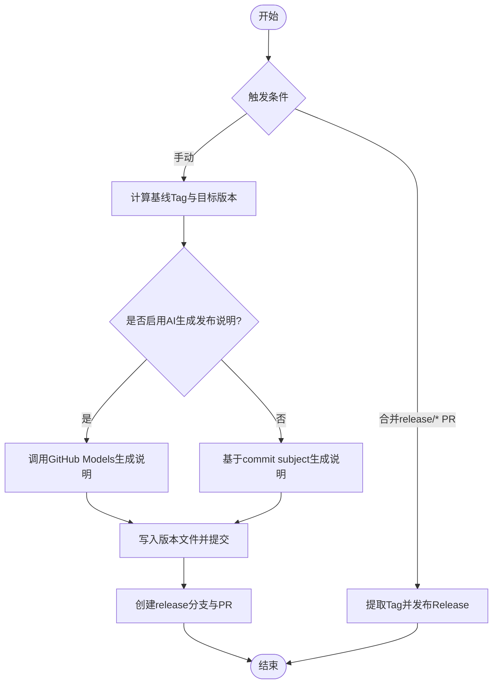
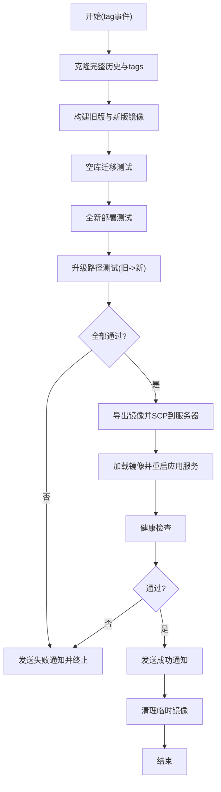
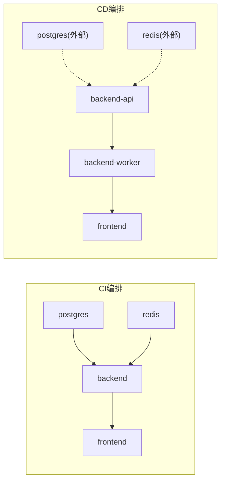
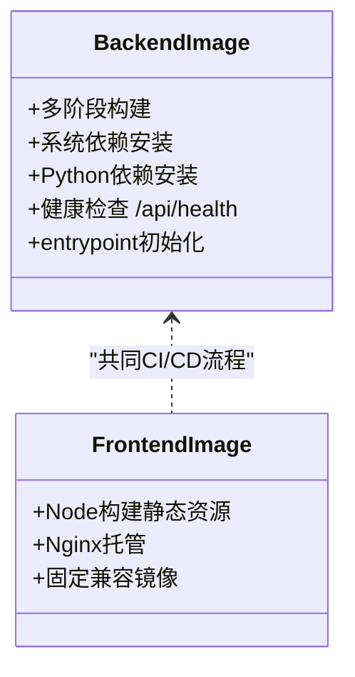
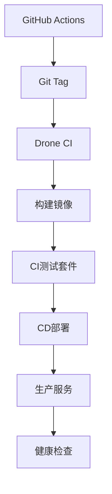

# CI/CD流水线

<cite>
**本文引用的文件**   
- [.github/drone.yml](file://.github/drone.yml)
- [.github/workflows/release.yml](file://.github/workflows/release.yml)
- [docker-compose.ci.yml](file://docker-compose.ci.yml)
- [docker-compose.cd.yml](file://docker-compose.cd.yml)
- [backend/Dockerfile](file://backend/Dockerfile)
- [frontend/Dockerfile](file://frontend/Dockerfile)
- [.github/scripts/ci_migration_test.sh](file://.github/scripts/ci_migration_test.sh)
- [.github/scripts/ci_deploy_test.sh](file://.github/scripts/ci_deploy_test.sh)
- [.github/scripts/ci_upgrade_test.sh](file://.github/scripts/ci_upgrade_test.sh)
- [deploy/RELEASE_DEPLOYMENT.md](file://deploy/RELEASE_DEPLOYMENT.md)
</cite>

## 目录
1. [简介](#简介)
2. [项目结构](#项目结构)
3. [核心组件](#核心组件)
4. [架构总览](#架构总览)
5. [详细组件分析](#详细组件分析)
6. [依赖关系分析](#依赖关系分析)
7. [性能与成本优化](#性能与成本优化)
8. [故障排查指南](#故障排查指南)
9. [结论](#结论)
10. [附录：分支策略、版本管理与发布流程](#附录分支策略版本管理与发布流程)

## 简介
本指南面向Clawith平台的持续集成与持续部署（CI/CD）实践，覆盖GitHub Actions工作流、Drone CI流水线、Docker镜像构建、多架构支持建议、镜像仓库推送、自动化测试与质量检查、分支与版本管理、灰度与蓝绿部署、回滚策略以及运维层面的故障排查、性能优化与成本控制。文档以仓库现有配置为依据，提供可操作的落地方案与最佳实践。

## 项目结构
仓库采用前后端分离与容器化部署，CI/CD相关的关键位置如下：
- GitHub Actions：用于Release流程（版本计算、变更摘要、生成PR并打Tag）。
- Drone CI：用于CI验证（空库迁移、全新部署、升级路径）、CD交付（导出镜像、SCP到生产服务器、加载镜像并重启服务、健康检查与通知）。
- Docker Compose：两套编排文件分别服务于CI环境与生产环境增量更新。
- Docker镜像：后端基于Python多阶段构建，前端基于Node构建并由Nginx托管静态资源。

**图表来源** 
- [.github/drone.yml](file://.github/drone.yml)
- [.github/workflows/release.yml](file://.github/workflows/release.yml)
- [docker-compose.ci.yml](file://docker-compose.ci.yml)
- [docker-compose.cd.yml](file://docker-compose.cd.yml)

**章节来源**
- [.github/drone.yml](file://.github/drone.yml)
- [.github/workflows/release.yml](file://.github/workflows/release.yml)
- [docker-compose.ci.yml](file://docker-compose.ci.yml)
- [docker-compose.cd.yml](file://docker-compose.cd.yml)

## 核心组件
- GitHub Actions Release 工作流
  - 触发方式：手动触发或合并 release/v* PR 后自动执行。
  - 功能：解析基线Tag、自动推断版本类型（major/minor/patch）、生成版本文件、使用GitHub Models生成发布说明（可选）、创建release分支与PR、合并后打Tag并发布GitHub Release。
- Drone CI 流水线
  - 触发：push/PR/tag（仅tag进入CD阶段）。
  - 步骤：克隆完整历史与tags、构建新旧版本镜像、空库迁移测试、全新部署测试、从旧版本升级到目标版本的升级测试、导出镜像并SCP到生产服务器、加载镜像并重启应用服务、健康检查、飞书通知、清理临时镜像。
- Docker Compose
  - CI专用编排：启动Postgres、Redis、Backend、Frontend，不挂载持久卷，用于快速验证。
  - CD专用编排：仅更新应用容器，复用外部数据库/缓存/对象存储网络与数据卷，保证发布过程对持久服务无侵入。
- Docker镜像
  - 后端：多阶段构建，安装系统依赖与Python依赖，暴露健康检查端口，entrypoint负责Alembic与LangGraph checkpoint初始化。
  - 前端：Node构建产物由Nginx托管，固定兼容的Nginx基础镜像以避免seccomp问题。

**章节来源**
- [.github/workflows/release.yml](file://.github/workflows/release.yml)
- [.github/drone.yml](file://.github/drone.yml)
- [docker-compose.ci.yml](file://docker-compose.ci.yml)
- [docker-compose.cd.yml](file://docker-compose.cd.yml)
- [backend/Dockerfile](file://backend/Dockerfile)
- [frontend/Dockerfile](file://frontend/Dockerfile)

## 架构总览
下图展示从代码提交到生产发布的端到端流程，包括Actions与Drone的职责边界、镜像流转与服务重启策略。

**图表来源** 
- [.github/workflows/release.yml](file://.github/workflows/release.yml)
- [.github/drone.yml](file://.github/drone.yml)
- [docker-compose.cd.yml](file://docker-compose.cd.yml)

## 详细组件分析

### GitHub Actions Release 工作流
- 版本推导与校验
  - 基于已合并的稳定Tag作为基线，若无则回退至v0.0.0；根据提交信息自动判定major/minor/patch。
  - 防止重复发布：若自基线以来无变更直接跳过。
- 发布说明生成
  - 优先调用GitHub Models生成结构化Markdown（需MODELS_TOKEN），否则回退为基于commit subject的分类汇总。
- 版本文件与PR
  - 写入backend/VERSION与frontend/VERSION，创建release/vX.Y.Z分支并发起PR，合并后打Tag并发布Release。
- 权限与并发
  - 设置contents/pull-requests权限，按分支组并发控制避免冲突。

**图表来源** 
- [.github/workflows/release.yml](file://.github/workflows/release.yml)

**章节来源**
- [.github/workflows/release.yml](file://.github/workflows/release.yml)

### Drone CI 流水线
- 克隆与标签处理
  - 禁用默认clone，拉取完整历史与tags，定位上一个正式Release作为升级源。
- 镜像构建
  - 同时构建“旧版本”和“当前commit”的后端/前端镜像，注入OCI版本与revision标签，便于追踪。
- 测试套件
  - 空库迁移测试：确保alembic可从空库迁移并通过索引/列存在性校验。
  - 全新部署测试：拉起Postgres/Redis/Backend/Frontend，验证health、checkpoint schema、镜像ID与revision一致性。
  - 升级测试：用旧镜像建立schema与checkpoint，再在新镜像上执行迁移与启动，校验数据与状态一致性。
- 发布与部署
  - 仅在tag事件下导出镜像、SCP到生产服务器、加载镜像、仅重建应用服务、健康检查通过后发送成功通知，失败则发送失败通知。
- 清理
  - 成功后清理中间镜像，减少磁盘占用。

**图表来源** 
- [.github/drone.yml](file://.github/drone.yml)

**章节来源**
- [.github/drone.yml](file://.github/drone.yml)
- [.github/scripts/ci_migration_test.sh](file://.github/scripts/ci_migration_test.sh)
- [.github/scripts/ci_deploy_test.sh](file://.github/scripts/ci_deploy_test.sh)
- [.github/scripts/ci_upgrade_test.sh](file://.github/scripts/ci_upgrade_test.sh)

### Docker Compose 编排
- CI专用编排（docker-compose.ci.yml）
  - 定义postgres、redis、backend、frontend服务，使用预构建镜像，不挂载持久卷，适合快速验证。
  - 通过环境变量注入数据库连接、CORS、运行时开关等。
- CD专用编排（docker-compose.cd.yml）
  - 仅更新应用容器，复用外部网络与持久化服务（PostgreSQL、Redis、MinIO）。
  - 要求服务器预先准备.env、nginx/default.conf、ss-nodes.json与外部网络。
  - 日志限制大小与滚动，避免磁盘膨胀。

**图表来源** 
- [docker-compose.ci.yml](file://docker-compose.ci.yml)
- [docker-compose.cd.yml](file://docker-compose.cd.yml)

**章节来源**
- [docker-compose.ci.yml](file://docker-compose.ci.yml)
- [docker-compose.cd.yml](file://docker-compose.cd.yml)

### Docker 镜像构建
- 后端镜像（backend/Dockerfile）
  - 多阶段构建：deps阶段安装系统依赖与Python依赖，production阶段复制依赖与应用代码，最小化运行时体积。
  - 健康检查：HTTP /api/health。
  - entrypoint：启动前执行Alembic与LangGraph checkpoint初始化。
- 前端镜像（frontend/Dockerfile）
  - Node构建静态资源，使用固定版本的Nginx镜像以避免seccomp兼容问题。
  - 暴露3000端口供反向代理转发。

**图表来源** 
- [backend/Dockerfile](file://backend/Dockerfile)
- [frontend/Dockerfile](file://frontend/Dockerfile)

**章节来源**
- [backend/Dockerfile](file://backend/Dockerfile)
- [frontend/Dockerfile](file://frontend/Dockerfile)

## 依赖关系分析
- Actions与Drone职责解耦
  - Actions负责版本治理与发布元数据，Drone负责构建、测试与部署。
- 镜像与编排依赖
  - CI编排依赖Postgres/Redis镜像；CD编排依赖外部持久服务与网络。
- 脚本与测试依赖
  - 迁移测试依赖alembic与psql；部署测试依赖curl与健康检查；升级测试依赖旧/新镜像与数据库快照。

**图表来源** 
- [.github/workflows/release.yml](file://.github/workflows/release.yml)
- [.github/drone.yml](file://.github/drone.yml)

**章节来源**
- [.github/workflows/release.yml](file://.github/workflows/release.yml)
- [.github/drone.yml](file://.github/drone.yml)

## 性能与成本优化
- 构建加速
  - 使用国内镜像源（PyPI、npm、Alpine/APK、Debian apt）减少下载时间。
  - 多阶段镜像减少最终镜像体积，加快传输与启动。
- 缓存策略
  - 利用Docker层缓存与包管理器缓存，避免重复安装。
  - 在CI中复用网络与镜像，减少重复构建。
- 资源控制
  - 限制日志大小与滚动，避免磁盘占满。
  - 按需启动服务，CI环境不挂载持久卷，缩短测试周期。
- 成本考量
  - 合理设置并发与超时，避免长时间占用Runner。
  - 及时清理临时镜像与容器，降低存储成本。

[本节为通用指导，无需特定文件引用]

## 故障排查指南
- 常见错误定位
  - 迁移失败：查看Postgres日志与alembic输出，确认迁移脚本与索引/列是否符合预期。
  - 健康检查失败：检查后端进程是否启动、环境变量是否正确、网络连通性。
  - 升级失败：对比旧/新镜像的schema revision digest，确认修复逻辑未掩盖真实错误。
- 诊断手段
  - 使用compose logs与docker logs获取最近日志。
  - 通过psql查询alembic_version与checkpoint_migrations表验证状态。
  - 检查镜像标签中的revision是否与DRONE_COMMIT一致。
- 恢复策略
  - 针对Drone失败，保留Tag与Release以便回溯，修复后重新运行该Tag的构建。
  - 必要时回滚到上一稳定版本镜像，保持数据与配置不变。

**章节来源**
- [.github/scripts/ci_migration_test.sh](file://.github/scripts/ci_migration_test.sh)
- [.github/scripts/ci_deploy_test.sh](file://.github/scripts/ci_deploy_test.sh)
- [.github/scripts/ci_upgrade_test.sh](file://.github/scripts/ci_upgrade_test.sh)
- [deploy/RELEASE_DEPLOYMENT.md](file://deploy/RELEASE_DEPLOYMENT.md)

## 结论
Clawith的CI/CD体系通过Actions与Drone分工协作，实现了从版本治理到生产部署的闭环。严格的迁移与升级测试保障了数据安全与兼容性，编排文件将CI与CD环境解耦，镜像标签与revision追踪提升了可观测性。结合灰度与蓝绿部署策略，可在保障稳定性的前提下提升发布效率。

[本节为总结性内容，无需特定文件引用]

## 附录：分支策略、版本管理与发布流程
- 分支策略
  - main：主分支，所有特性与修复经PR合并。
  - release/vX.Y.Z：发布分支，由Actions自动生成并创建PR，合并后打Tag。
  - feature/*：功能分支，独立开发完成后合并至main。
- 版本管理
  - 语义化版本（major.minor.patch），由Actions根据提交信息自动推断。
  - VERSION文件统一维护前后端版本。
- 发布流程
  - 手动触发Actions生成发布PR，合并后打Tag。
  - Drone接收Tag后执行完整CI/CD流程，成功后发布Release并通知。
- 灰度与蓝绿部署
  - 蓝绿：并行部署新旧两套服务，通过负载均衡切换流量。
  - 灰度：按租户/用户比例逐步放量，观察指标后再全量。
- 回滚策略
  - 基于镜像Tag快速回滚到上一稳定版本，保持数据与配置不变。
  - 数据库迁移应向前兼容，避免破坏性变更。

**章节来源**
- [.github/workflows/release.yml](file://.github/workflows/release.yml)
- [deploy/RELEASE_DEPLOYMENT.md](file://deploy/RELEASE_DEPLOYMENT.md)