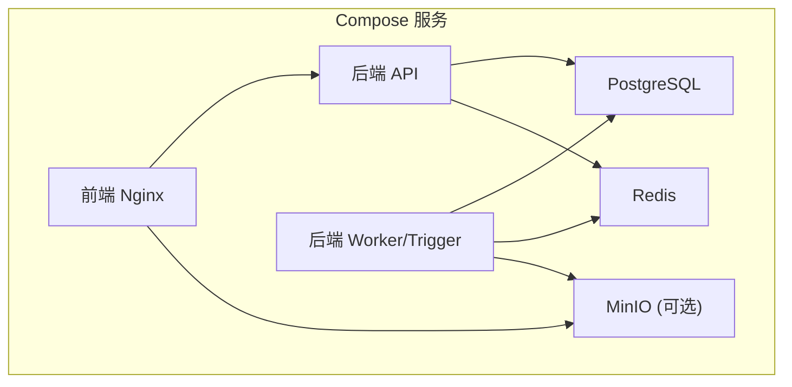
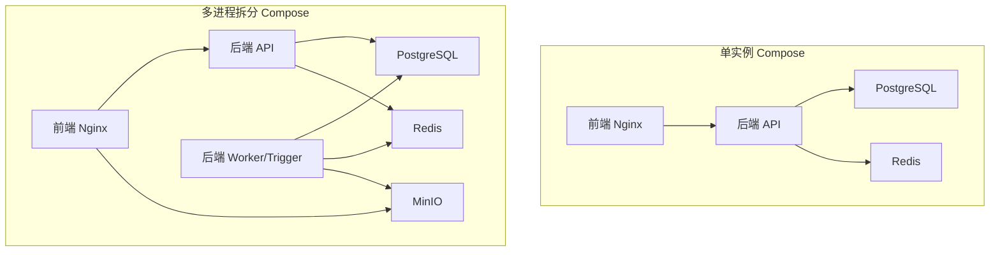
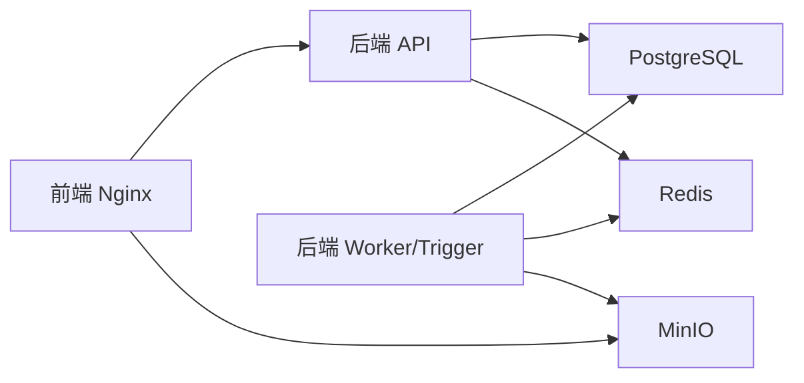

# Docker部署

<cite>
**本文引用的文件**   
- [docker-compose.yml](file://docker-compose.yml)
- [deploy/docker-compose.yml](file://deploy/docker-compose.yml)
- [deploy/docker-compose-multi.yml](file://deploy/docker-compose-multi.yml)
- [backend/Dockerfile](file://backend/Dockerfile)
- [frontend/Dockerfile](file://frontend/Dockerfile)
- [backend/entrypoint.sh](file://backend/entrypoint.sh)
- [deploy/nginx/nginx.conf](file://deploy/nginx/nginx.conf)
- [frontend/nginx.conf.template](file://frontend/nginx.conf.template)
- [setup.sh](file://setup.sh)
- [restart.sh](file://restart.sh)
- [deploy/RELEASE_DEPLOYMENT.md](file://deploy/RELEASE_DEPLOYMENT.md)
- [helm/QUICKSTART.md](file://helm/QUICKSTART.md)
</cite>

## 目录
1. [简介](#简介)
2. [项目结构](#项目结构)
3. [核心组件](#核心组件)
4. [架构总览](#架构总览)
5. [详细组件分析](#详细组件分析)
6. [依赖关系分析](#依赖关系分析)
7. [性能与容量建议](#性能与容量建议)
8. [故障排查指南](#故障排查指南)
9. [结论](#结论)
10. [附录：常用命令与环境变量清单](#附录常用命令与环境变量清单)

## 简介
本指南面向使用Docker Compose部署Clawith平台的工程师与运维人员，覆盖开发环境与生产环境的差异、服务配置（PostgreSQL、Redis、后端API、前端Nginx）、环境变量、数据卷挂载、网络与安全密钥管理、存储后端（本地/S3）配置、CORS设置、以及常见问题的排查方法。文档同时提供容器启动、停止、重启等常用操作命令，并给出多进程拆分部署（API与Worker分离）的参考方案。

## 项目结构
仓库包含多种部署形态：
- 根级 docker-compose.yml：适用于单机快速体验或小型环境，内置PostgreSQL、Redis、后端API、前端Nginx。
- deploy/docker-compose.yml：与根级类似，但路径引用相对deploy目录，便于在部署脚本中统一编排。
- deploy/docker-compose-multi.yml：多进程拆分部署，将后端拆分为API进程与Trigger/Worker进程，并集成MinIO作为S3兼容对象存储。
- backend/Dockerfile 与 frontend/Dockerfile：分别构建后端Python应用与前端静态资源+Nginx。
- backend/entrypoint.sh：容器启动入口，负责权限修复、数据库迁移、LangGraph检查点初始化、启动Uvicorn。
- deploy/nginx/nginx.conf 与 frontend/nginx.conf.template：前端Nginx反向代理配置，转发API、WebSocket、MinIO等请求。
- setup.sh 与 restart.sh：本地开发的一键安装与重启脚本，支持自动检测Docker模式并回退到源码模式。
- deploy/RELEASE_DEPLOYMENT.md：生产发布流程说明（CI/CD、镜像推送、远程部署）。
- helm/QUICKSTART.md：Kubernetes Helm部署的快速开始与常见问题。

图表来源
- [docker-compose.yml:1-115](file://docker-compose.yml#L1-L115)
- [deploy/docker-compose-multi.yml:1-196](file://deploy/docker-compose-multi.yml#L1-L196)

章节来源
- [docker-compose.yml:1-115](file://docker-compose.yml#L1-L115)
- [deploy/docker-compose.yml:1-111](file://deploy/docker-compose.yml#L1-L111)
- [deploy/docker-compose-multi.yml:1-196](file://deploy/docker-compose-multi.yml#L1-L196)

## 核心组件
- PostgreSQL：持久化业务数据，默认端口5432，健康检查通过pg_isready。
- Redis：缓存与会话队列，默认端口6379，健康检查通过redis-cli ping。
- 后端API：基于Python+Uvicorn，暴露HTTP与WebSocket接口，运行Alembic迁移与LangGraph检查点初始化。
- 前端Nginx：静态站点托管，反向代理API与MinIO，支持大文件上传与长连接。
- MinIO（可选）：S3兼容对象存储，用于文件与Agent数据持久化。

章节来源
- [docker-compose.yml:1-115](file://docker-compose.yml#L1-L115)
- [deploy/docker-compose-multi.yml:1-196](file://deploy/docker-compose-multi.yml#L1-L196)

## 架构总览
下图展示单实例Compose与多进程拆分Compose的架构差异。单实例适合开发与测试；多进程拆分适合生产，便于水平扩展与职责分离。

图表来源
- [docker-compose.yml:1-115](file://docker-compose.yml#L1-L115)
- [deploy/docker-compose-multi.yml:1-196](file://deploy/docker-compose-multi.yml#L1-L196)

## 详细组件分析

### PostgreSQL 服务
- 镜像：postgres:15-alpine
- 环境变量：POSTGRES_USER、POSTGRES_PASSWORD、POSTGRES_DB
- 数据卷：pgdata:/var/lib/postgresql/data
- 健康检查：pg_isready -U clawith
- 网络：加入默认Compose网络，供后端访问

注意事项
- 生产环境务必修改默认密码，并通过外部Secret或环境变量注入。
- 如需高可用，建议使用托管PostgreSQL服务，并在DATABASE_URL指向外部地址。

章节来源
- [docker-compose.yml:2-17](file://docker-compose.yml#L2-L17)
- [deploy/docker-compose.yml:2-17](file://deploy/docker-compose.yml#L2-L17)
- [deploy/docker-compose-multi.yml:2-17](file://deploy/docker-compose-multi.yml#L2-L17)

### Redis 服务
- 镜像：redis:7-alpine
- 数据卷：redisdata:/data
- 健康检查：redis-cli ping
- 网络：加入默认Compose网络

注意事项
- 生产环境建议启用认证与持久化策略，并根据负载调整内存限制。

章节来源
- [docker-compose.yml:19-30](file://docker-compose.yml#L19-L30)
- [deploy/docker-compose.yml:19-30](file://deploy/docker-compose.yml#L19-L30)
- [deploy/docker-compose-multi.yml:19-30](file://deploy/docker-compose-multi.yml#L19-L30)

### 后端 API 服务
- 镜像构建：backend/Dockerfile，多阶段构建，安装系统依赖与Python包，暴露8000端口。
- 启动入口：/app/entrypoint.sh，执行权限修复、Alembic迁移、LangGraph检查点初始化，然后启动Uvicorn。
- 环境变量关键项：
  - DATABASE_URL：PostgreSQL连接串
  - REDIS_URL：Redis连接串
  - STORAGE_BACKEND：local或s3
  - STORAGE_LOCAL_ROOT：本地存储根目录
  - S3_*：S3兼容端点、桶名、区域、密钥等
  - SECRET_KEY、JWT_SECRET_KEY：安全密钥
  - CORS_ORIGINS：跨域白名单
  - PUBLIC_BASE_URL：反向代理后的公开基础URL
  - PROCESS_ROLE：all/api/bootstrap/worker/connector等
  - AGENT_RUNTIME_*：Agent运行时相关开关与并发参数
- 数据卷：
  - ./backend/agent_data:/data/agents（Agent数据）
  - /var/run/docker.sock（容器内调用宿主Docker）
  - ss-nodes.json（可选SS节点配置）
- 特权与安全：privileged、SYS_ADMIN、seccomp/apparmor禁用（仅开发/测试推荐）

注意
- 生产环境应最小化权限，避免privileged与禁用seccomp/apparmor。
- 若使用S3，请确保S3_ENDPOINT_URL、S3_BUCKET、S3_ACCESS_KEY_ID、S3_SECRET_ACCESS_KEY正确配置。

章节来源
- [backend/Dockerfile:1-63](file://backend/Dockerfile#L1-L63)
- [backend/entrypoint.sh:1-95](file://backend/entrypoint.sh#L1-L95)
- [docker-compose.yml:32-90](file://docker-compose.yml#L32-L90)
- [deploy/docker-compose.yml:32-86](file://deploy/docker-compose.yml#L32-L86)
- [deploy/docker-compose-multi.yml:49-109](file://deploy/docker-compose-multi.yml#L49-L109)

### 后端 Worker/Trigger 服务（多进程拆分）
- 镜像构建：同后端API
- 启动入口：同后端API
- 环境变量关键项：
  - PROCESS_ROLE=bootstrap,worker,connector（不暴露HTTP API）
  - 其他与API一致（数据库、缓存、存储、密钥等）
- 数据卷与网络：同后端API

作用
- 处理后台任务、触发器、消息消费、异步工作流等，与API进程解耦，提升可扩展性。

章节来源
- [deploy/docker-compose-multi.yml:111-170](file://deploy/docker-compose-multi.yml#L111-L170)

### 前端 Nginx 服务
- 镜像构建：frontend/Dockerfile，Node构建静态资源，Nginx托管并反向代理API与MinIO。
- 端口映射：FRONTEND_PORT:3000（默认3008:3000）
- 环境变量：
  - VITE_API_URL：前端构建时使用的API基础URL
  - API_UPSTREAM：Nginx代理的后端API上游（如backend:8000）
  - MINIO_UPSTREAM：Nginx代理的MinIO上游（如minio:9000）
- 反向代理规则：
  - /api/* 转发至后端API
  - /p/* 公共页面转发至后端
  - /ws/* WebSocket长连接（超时1小时）
  - /minio/* 转发至MinIO，关闭缓冲以支持大文件
  - SPA fallback与静态资源缓存策略

章节来源
- [frontend/Dockerfile:1-16](file://frontend/Dockerfile#L1-L16)
- [docker-compose.yml:91-105](file://docker-compose.yml#L91-L105)
- [deploy/docker-compose.yml:87-101](file://deploy/docker-compose.yml#L87-L101)
- [deploy/docker-compose-multi.yml:172-186](file://deploy/docker-compose-multi.yml#L172-L186)
- [deploy/nginx/nginx.conf:1-82](file://deploy/nginx/nginx.conf#L1-L82)
- [frontend/nginx.conf.template:1-82](file://frontend/nginx.conf.template#L1-L82)

### MinIO（可选，S3兼容对象存储）
- 镜像：minio/minio:RELEASE.*
- 环境变量：MINIO_ROOT_USER、MINIO_ROOT_PASSWORD
- 数据卷：miniodata:/data
- 健康检查：curl http://127.0.0.1:9000/minio/health/live
- 用途：为后端提供S3兼容的文件与Agent数据存储服务

章节来源
- [deploy/docker-compose-multi.yml:32-47](file://deploy/docker-compose-multi.yml#L32-L47)

## 依赖关系分析
- 后端依赖PostgreSQL与Redis，可选依赖MinIO（当STORAGE_BACKEND=s3）。
- 前端依赖后端API与MinIO（通过Nginx代理）。
- 多进程拆分下，Worker/Trigger同样依赖PostgreSQL、Redis与MinIO。

图表来源
- [docker-compose.yml:1-115](file://docker-compose.yml#L1-L115)
- [deploy/docker-compose-multi.yml:1-196](file://deploy/docker-compose-multi.yml#L1-L196)

章节来源
- [docker-compose.yml:1-115](file://docker-compose.yml#L1-L115)
- [deploy/docker-compose-multi.yml:1-196](file://deploy/docker-compose-multi.yml#L1-L196)

## 性能与容量建议
- PostgreSQL
  - 根据数据量与并发调整shared_buffers、work_mem、max_connections。
  - 生产建议使用SSD存储与备份策略（pg_dump或托管服务快照）。
- Redis
  - 根据会话与队列规模调整maxmemory与持久化策略。
  - 生产建议启用AOF与RDB双持久化。
- 后端API
  - 合理设置AGENT_RUNTIME_COMMAND_CONCURRENCY控制命令并发。
  - 生产环境限制日志大小与轮转（已配置json-file驱动与max-size/max-file）。
- 前端Nginx
  - 大文件上传需保持client_max_body_size足够大（默认500m）。
  - 静态资源缓存策略已优化，确保index.html无缓存。
- MinIO
  - 根据文件体积与并发调整客户端缓冲与超时。
  - 生产建议使用高性能磁盘与副本策略。

[本节为通用指导，不直接分析具体文件]

## 故障排查指南
- 容器无法启动
  - 查看服务日志：docker compose logs <service>
  - 检查健康状态：docker compose ps
  - 确认端口冲突：ss -tlnp | grep <port>
- 数据库连接失败
  - 检查DATABASE_URL是否正确（主机、端口、用户名、密码、数据库名）。
  - 验证PostgreSQL是否就绪：pg_isready -h <host> -p <port> -U <user>
  - 检查Alembic迁移是否成功（见entrypoint.sh输出）。
- Redis连接失败
  - 检查REDIS_URL与Redis服务健康状态。
  - 确认防火墙与网络安全组放行6379。
- 文件上传失败
  - 检查Nginx client_max_body_size与后端存储后端配置。
  - 若使用S3，确认S3_ENDPOINT_URL、S3_BUCKET、S3_ACCESS_KEY_ID、S3_SECRET_ACCESS_KEY。
- WebSocket断开
  - 检查Nginx /ws/*代理配置与超时设置（默认1小时）。
  - 确认浏览器与中间代理支持Upgrade头。
- 权限问题
  - 后端entrypoint会尝试修复/data/agents权限，如遇SELinux/AppArmor限制，需调整策略。
  - 生产环境避免privileged与禁用seccomp/apparmor。

章节来源
- [backend/entrypoint.sh:1-95](file://backend/entrypoint.sh#L1-L95)
- [deploy/nginx/nginx.conf:1-82](file://deploy/nginx/nginx.conf#L1-L82)
- [frontend/nginx.conf.template:1-82](file://frontend/nginx.conf.template#L1-L82)

## 结论
通过Docker Compose可以快速搭建Clawith平台的全栈环境，满足开发与测试需求；在生产环境中建议采用多进程拆分部署、外部化数据库与缓存、启用S3对象存储、严格管理安全密钥与网络策略，并结合CI/CD实现自动化发布与健康检查。

[本节为总结，不直接分析具体文件]

## 附录：常用命令与环境变量清单

### 常用命令
- 启动所有服务（开发/测试）
  - docker compose up -d
- 停止服务
  - docker compose down
- 重启服务
  - docker compose restart
- 查看日志
  - docker compose logs -f <service>
- 进入容器
  - docker compose exec <service> /bin/bash
- 重建镜像并启动
  - docker compose up -d --build

章节来源
- [docker-compose.yml:1-115](file://docker-compose.yml#L1-L115)
- [deploy/docker-compose.yml:1-111](file://deploy/docker-compose.yml#L1-L111)
- [deploy/docker-compose-multi.yml:1-196](file://deploy/docker-compose-multi.yml#L1-L196)

### 环境变量清单（关键项）
- 数据库
  - DATABASE_URL：PostgreSQL连接串
- 缓存
  - REDIS_URL：Redis连接串
- 存储后端
  - STORAGE_BACKEND：local或s3
  - STORAGE_LOCAL_ROOT：本地存储根目录
  - S3_BUCKET、S3_REGION、S3_ENDPOINT_URL、S3_ACCESS_KEY_ID、S3_SECRET_ACCESS_KEY、S3_PREFIX
- 安全与跨域
  - SECRET_KEY、JWT_SECRET_KEY
  - CORS_ORIGINS：JSON数组字符串，如'["*"]'
  - PUBLIC_BASE_URL：反向代理后的公开基础URL
- 前端Nginx
  - VITE_API_URL：构建期API基础URL
  - API_UPSTREAM：Nginx代理的后端上游
  - MINIO_UPSTREAM：Nginx代理的MinIO上游
- 后端运行时
  - PROCESS_ROLE：all/api/bootstrap/worker/connector
  - AGENT_RUNTIME_COMMAND_CONCURRENCY：命令并发数
  - AGENT_RUNTIME_V2_ENABLED、AGENT_RUNTIME_V2_AGENT_IDS、AGENT_RUNTIME_V2_SOURCE_TYPES
- 网络
  - CLAWITH_DOCKER_NETWORK：自定义Compose网络名称（默认clawith_network）

章节来源
- [docker-compose.yml:40-68](file://docker-compose.yml#L40-L68)
- [deploy/docker-compose.yml:40-64](file://deploy/docker-compose.yml#L40-L64)
- [deploy/docker-compose-multi.yml:57-83](file://deploy/docker-compose-multi.yml#L57-L83)
- [deploy/docker-compose-multi.yml:119-146](file://deploy/docker-compose-multi.yml#L119-L146)
- [frontend/nginx.conf.template:1-82](file://frontend/nginx.conf.template#L1-L82)

### 开发环境与生产环境差异
- 开发环境
  - 使用根级或deploy/docker-compose.yml，单实例部署，允许privileged与禁用seccomp/apparmor。
  - 可使用本地PostgreSQL与Redis，或通过Compose拉起。
  - CORS可设置为宽松（如["*"]），便于调试。
- 生产环境
  - 推荐使用deploy/docker-compose-multi.yml进行多进程拆分（API与Worker分离）。
  - 使用外部PostgreSQL与Redis，禁用容器特权与禁用seccomp/apparmor。
  - 使用S3兼容对象存储（MinIO或云厂商S3），并配置S3_*环境变量。
  - 严格管理SECRET_KEY与JWT_SECRET_KEY，建议使用外部Secret管理。
  - 配置PUBLIC_BASE_URL与反向代理（Nginx/Cloudflare），确保OAuth回调与邮件链接正确。
  - 启用日志轮转与监控告警，定期备份数据库与对象存储数据。

章节来源
- [deploy/RELEASE_DEPLOYMENT.md:1-90](file://deploy/RELEASE_DEPLOYMENT.md#L1-L90)
- [helm/QUICKSTART.md:1-715](file://helm/QUICKSTART.md#L1-L715)

### 一键脚本与自动部署
- setup.sh：首次安装脚本，自动检测Python/Node/PostgreSQL，创建虚拟环境，安装依赖，初始化数据库与种子数据。
- restart.sh：重启脚本，支持自动检测Docker模式并切换，也可强制源码模式。

章节来源
- [setup.sh:1-472](file://setup.sh#L1-L472)
- [restart.sh:1-360](file://restart.sh#L1-L360)