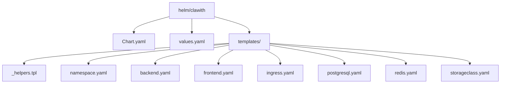
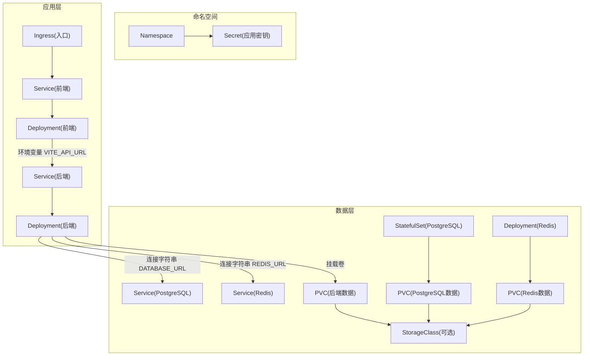
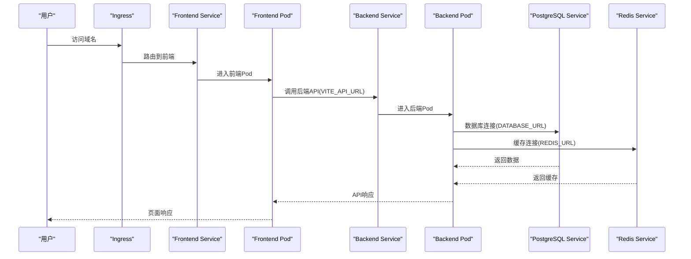

# Helm图表使用

<cite>
**本文引用的文件**   
- [Chart.yaml](file://helm/clawith/Chart.yaml)
- [values.yaml](file://helm/clawith/values.yaml)
- [_helpers.tpl](file://helm/clawith/templates/_helpers.tpl)
- [backend.yaml](file://helm/clawith/templates/backend.yaml)
- [frontend.yaml](file://helm/clawith/templates/frontend.yaml)
- [ingress.yaml](file://helm/clawith/templates/ingress.yaml)
- [postgresql.yaml](file://helm/clawith/templates/postgresql.yaml)
- [redis.yaml](file://helm/clawith/templates/redis.yaml)
- [storageclass.yaml](file://helm/clawith/templates/storageclass.yaml)
- [namespace.yaml](file://helm/clawith/templates/namespace.yaml)
- [QUICKSTART.md](file://helm/QUICKSTART.md)
</cite>

## 目录
1. [简介](#简介)
2. [项目结构](#项目结构)
3. [核心组件](#核心组件)
4. [架构总览](#架构总览)
5. [详细组件分析](#详细组件分析)
6. [依赖关系分析](#依赖关系分析)
7. [性能与容量建议](#性能与容量建议)
8. [故障排查指南](#故障排查指南)
9. [结论](#结论)
10. [附录：参数参考与环境示例](#附录参数参考与环境示例)

## 简介
本指南面向在Kubernetes上使用Helm部署Clawith的工程师与运维人员，系统说明Chart元数据、可配置项、安装升级卸载流程、不同环境的配置示例以及最佳实践。内容基于仓库中的Helm Chart源码与快速开始文档整理而成，确保与实际实现一致。

## 项目结构
Helm Chart位于 helm/clawith 目录，包含Chart元数据、默认值与Kubernetes资源模板；同时提供快速上手文档。

**图示来源** 
- [Chart.yaml:1-14](file://helm/clawith/Chart.yaml#L1-L14)
- [values.yaml:1-229](file://helm/clawith/values.yaml#L1-L229)
- [_helpers.tpl:1-139](file://helm/clawith/templates/_helpers.tpl#L1-L139)
- [namespace.yaml:1-21](file://helm/clawith/templates/namespace.yaml#L1-L21)
- [backend.yaml:1-142](file://helm/clawith/templates/backend.yaml#L1-L142)
- [frontend.yaml:1-57](file://helm/clawith/templates/frontend.yaml#L1-L57)
- [ingress.yaml:1-37](file://helm/clawith/templates/ingress.yaml#L1-L37)
- [postgresql.yaml:1-184](file://helm/clawith/templates/postgresql.yaml#L1-L184)
- [redis.yaml:1-94](file://helm/clawith/templates/redis.yaml#L1-L94)
- [storageclass.yaml:1-18](file://helm/clawith/templates/storageclass.yaml#L1-L18)

**章节来源**
- [Chart.yaml:1-14](file://helm/clawith/Chart.yaml#L1-L14)
- [values.yaml:1-229](file://helm/clawith/values.yaml#L1-L229)
- [QUICKSTART.md:1-715](file://helm/QUICKSTART.md#L1-L715)

## 核心组件
- Chart元数据：定义应用名称、版本、应用版本、维护者、主页等。
- 默认值：集中管理镜像、服务、存储、数据库、缓存、Ingress、Secrets等所有可配置项。
- 模板：渲染Namespace、后端、前端、数据库、缓存、Ingress、可选StorageClass等资源。
- 辅助函数：统一生成名称、标签、选择器、PostgreSQL/Redis连接信息、Secret名称等。

**章节来源**
- [Chart.yaml:1-14](file://helm/clawith/Chart.yaml#L1-L14)
- [values.yaml:1-229](file://helm/clawith/values.yaml#L1-L229)
- [_helpers.tpl:1-139](file://helm/clawith/templates/_helpers.tpl#L1-L139)

## 架构总览
下图展示了Helm渲染后的主要Kubernetes对象及其依赖关系。

**图示来源** 
- [namespace.yaml:1-21](file://helm/clawith/templates/namespace.yaml#L1-L21)
- [backend.yaml:1-142](file://helm/clawith/templates/backend.yaml#L1-L142)
- [frontend.yaml:1-57](file://helm/clawith/templates/frontend.yaml#L1-L57)
- [ingress.yaml:1-37](file://helm/clawith/templates/ingress.yaml#L1-L37)
- [postgresql.yaml:1-184](file://helm/clawith/templates/postgresql.yaml#L1-L184)
- [redis.yaml:1-94](file://helm/clawith/templates/redis.yaml#L1-L94)
- [storageclass.yaml:1-18](file://helm/clawith/templates/storageclass.yaml#L1-L18)

## 详细组件分析

### Chart.yaml结构与配置选项
- apiVersion: v2（Helm 3）
- name: 图表名
- description: 描述
- type: application
- version: 图表版本（用于发布版本管理）
- appVersion: 应用版本（对应镜像或产品版本）
- keywords: 关键词
- maintainers: 维护者信息
- home: 项目主页

这些字段用于图表注册、分发与检索，并影响Helm发布历史与标签。

**章节来源**
- [Chart.yaml:1-14](file://helm/clawith/Chart.yaml#L1-L14)

### values.yaml参数详解与默认值
以下按模块梳理关键参数、含义与默认值（以实际文件为准）。

- 全局设置 global
  - namespace: 部署命名空间
  - imageRegistry: 镜像仓库前缀

- 后端 backend
  - enabled: 是否启用
  - replicaCount: 副本数
  - image.repository/tag/pullPolicy: 镜像仓库、标签、拉取策略
  - service.type/port: Service类型与端口
  - secrets.secretKey/jwtSecretKey: 应用密钥（若secrets.create=true则自动创建Secret）
  - hostCerts.enabled/paths/containerPaths: 主机证书挂载与容器内路径
  - env.agentDataDir/agentTemplateDir: 代理数据与模板目录
  - persistence.enabled/existingClaim/storageClass/accessMode/size: 持久化配置
  - resources: CPU/内存限制与请求

- 前端 frontend
  - enabled: 是否启用
  - replicaCount: 副本数
  - image.repository/tag/pullPolicy: 镜像相关
  - service.type/port/targetPort: Service映射
  - env.viteApiUrl: 后端API地址
  - ingress.enabled/className/annotations/host/tls.*: Ingress入口与TLS
  - resources: 资源限制

- PostgreSQL postgresql
  - enabled: 是否内置PostgreSQL
  - image.registry/repository/tag/pullPolicy: 镜像源
  - auth.database/username/password: 数据库账号密码
  - primary.service.type/port: 服务端口
  - primary.persistence.enabled/existingClaim/storageClass/accessMode/size: 数据持久化
  - primary.resources: 资源限制
  - primary.podSecurityContext/containerSecurityContext: 安全上下文
  - external.host/port/database/username/password: 外部数据库连接

- Redis redis
  - enabled: 是否内置Redis
  - image.registry/repository/tag/pullPolicy: 镜像源
  - service.type/port: 服务端口
  - persistence.enabled/existingClaim/storageClass/accessMode/size: 持久化
  - resources: 资源限制
  - external.host/port/database/password: 外部Redis连接

- Secrets secrets
  - create: 是否由Chart创建Secret
  - existingSecret: 使用已有Secret名称

- StorageClass storageClass
  - create: 是否创建自定义StorageClass
  - name/provisioner/reclaimPolicy/volumeBindingMode/allowVolumeExpansion/parameters: 存储类参数

注意：values.yaml末尾重复了Chart.yaml片段，属于冗余内容，不影响Helm渲染。

**章节来源**
- [values.yaml:1-229](file://helm/clawith/values.yaml#L1-L229)

### 模板与渲染逻辑
- _helpers.tpl
  - 统一生成名称、标签、选择器
  - 封装PostgreSQL与Redis的连接信息（host/port/database/username/password）
  - 封装Secret名称（根据create或existingSecret决定）

- backend.yaml
  - 条件创建PVC（当persistence开启且未指定existingClaim时）
  - Deployment注入环境变量：DATABASE_URL、REDIS_URL、AGENT_DATA_DIR、AGENT_TEMPLATE_DIR、SSL_*（当启用hostCerts）
  - 通过secretKeyRef注入SECRET_KEY与JWT_SECRET_KEY
  - 挂载Agent数据卷与可选的证书卷

- frontend.yaml
  - Deployment注入VITE_API_URL指向后端Service
  - Service暴露HTTP端口

- ingress.yaml
  - 根据frontend.ingress.*生成Ingress规则与TLS

- postgresql.yaml
  - 创建Secret（密码）、PVC（如需要）、StatefulSet、Service与Headless Service
  - 探针与健康检查

- redis.yaml
  - 条件创建PVC、Deployment、Service

- storageclass.yaml
  - 按需创建StorageClass

- namespace.yaml
  - 创建命名空间
  - 当secrets.create=true时创建应用Secret

**章节来源**
- [_helpers.tpl:1-139](file://helm/clawith/templates/_helpers.tpl#L1-L139)
- [backend.yaml:1-142](file://helm/clawith/templates/backend.yaml#L1-L142)
- [frontend.yaml:1-57](file://helm/clawith/templates/frontend.yaml#L1-L57)
- [ingress.yaml:1-37](file://helm/clawith/templates/ingress.yaml#L1-L37)
- [postgresql.yaml:1-184](file://helm/clawith/templates/postgresql.yaml#L1-L184)
- [redis.yaml:1-94](file://helm/clawith/templates/redis.yaml#L1-L94)
- [storageclass.yaml:1-18](file://helm/clawith/templates/storageclass.yaml#L1-L18)
- [namespace.yaml:1-21](file://helm/clawith/templates/namespace.yaml#L1-L21)

### 安装、升级、卸载操作
- 安装
  - 修改values.yaml后执行安装命令，创建命名空间与全部资源。
- 升级
  - 修改values.yaml或使用--set覆盖特定值进行升级。
- 回滚
  - 查看历史版本并回滚到指定版本。
- 卸载
  - 卸载应用（默认保留PVC），如需清理再删除PVC与命名空间。

上述命令与场景详见快速开始文档。

**章节来源**
- [QUICKSTART.md:1-715](file://helm/QUICKSTART.md#L1-L715)

## 依赖关系分析
- 后端依赖PostgreSQL与Redis（通过环境变量连接）
- 前端通过Service访问后端
- Ingress将域名流量转发至前端Service
- 各组件可按需启用/禁用（enabled开关）
- 存储依赖StorageClass（可动态创建）

**图示来源** 
- [ingress.yaml:1-37](file://helm/clawith/templates/ingress.yaml#L1-L37)
- [frontend.yaml:1-57](file://helm/clawith/templates/frontend.yaml#L1-L57)
- [backend.yaml:1-142](file://helm/clawith/templates/backend.yaml#L1-L142)
- [postgresql.yaml:1-184](file://helm/clawith/templates/postgresql.yaml#L1-L184)
- [redis.yaml:1-94](file://helm/clawith/templates/redis.yaml#L1-L94)

## 性能与容量建议
- 为后端与数据库设置合理的requests/limits，避免资源争用
- 生产环境建议使用SSD类StorageClass，并适当增大PVC容量
- 多副本部署后端以提升可用性（结合负载均衡）
- 对PostgreSQL与Redis启用健康检查与监控
- 合理配置镜像拉取策略（生产建议使用固定tag而非latest）

[本节为通用建议，不直接分析具体文件]

## 故障排查指南
- 查看Helm状态与值
  - 使用helm status/get values获取当前发布信息与生效值
- 查看Pod日志与事件
  - 针对后端、前端、数据库、缓存分别查看日志与事件
- 验证存储绑定
  - 检查PVC/PV/StorageClass状态
- 验证网络连通性
  - 从后端Pod测试数据库与Redis连通性
- 预览渲染结果
  - 使用helm template或--dry-run预览变更

**章节来源**
- [QUICKSTART.md:1-715](file://helm/QUICKSTART.md#L1-L715)

## 结论
该Helm Chart提供了完整的Clawith应用部署能力，涵盖前后端、数据库、缓存、存储与入口。通过values.yaml集中管理配置，配合模板与辅助函数，实现了高可维护性与可扩展性。遵循本文档的参数说明与最佳实践，可在开发、测试与生产环境中稳定部署与演进。

[本节为总结，不直接分析具体文件]

## 附录：参数参考与环境示例

### values.yaml参数参考（节选）
- 全局
  - global.namespace: 命名空间
  - global.imageRegistry: 镜像仓库前缀
- 后端
  - backend.enabled/replicaCount
  - backend.image.repository/tag/pullPolicy
  - backend.service.type/port
  - backend.secrets.secretKey/jwtSecretKey
  - backend.hostCerts.*
  - backend.env.agentDataDir/agentTemplateDir
  - backend.persistence.*
  - backend.resources.*
- 前端
  - frontend.enabled/replicaCount
  - frontend.image.repository/tag/pullPolicy
  - frontend.service.type/port/targetPort
  - frontend.env.viteApiUrl
  - frontend.ingress.*
  - frontend.resources.*
- PostgreSQL
  - postgresql.enabled/image.*
  - postgresql.auth.*
  - postgresql.primary.*
  - postgresql.external.*
- Redis
  - redis.enabled/image.*
  - redis.service.*
  - redis.persistence.*
  - redis.external.*
- Secrets
  - secrets.create/existingSecret
- StorageClass
  - storageClass.create/name/provisioner/reclaimPolicy/volumeBindingMode/allowVolumeExpansion/parameters

**章节来源**
- [values.yaml:1-229](file://helm/clawith/values.yaml#L1-L229)

### 不同环境配置示例要点
- 开发环境
  - 使用默认values，仅修改镜像仓库与必要域名
  - 可使用ClusterIP+端口转发访问
- 测试环境
  - 固定镜像tag，启用Ingress，配置测试域名
  - 为数据库与缓存分配足够PVC
- 生产环境
  - 多副本后端，严格资源限制
  - 使用高性能StorageClass与强密码
  - 启用TLS与HTTPS，使用外部Secret管理敏感信息

上述示例与命令请参考快速开始文档中的“常见配置场景”和“生产环境配置”。

**章节来源**
- [QUICKSTART.md:1-715](file://helm/QUICKSTART.md#L1-L715)

### Helm命令速查
- 安装：helm install <release> ./helm/clawith -n <namespace> --create-namespace
- 升级：helm upgrade <release> ./helm/clawith -n <namespace> [--set ...]
- 回滚：helm rollback <release> [<revision>] -n <namespace>
- 卸载：helm uninstall <release> -n <namespace>
- 预览：helm template <release> ./helm/clawith -n <namespace> > preview.yaml
- 查看值：helm get values <release> -n <namespace>

**章节来源**
- [QUICKSTART.md:1-715](file://helm/QUICKSTART.md#L1-L715)