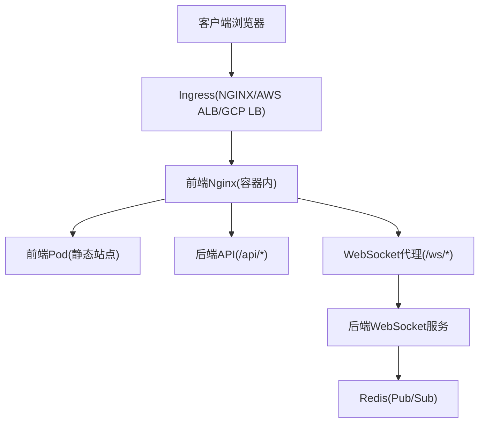
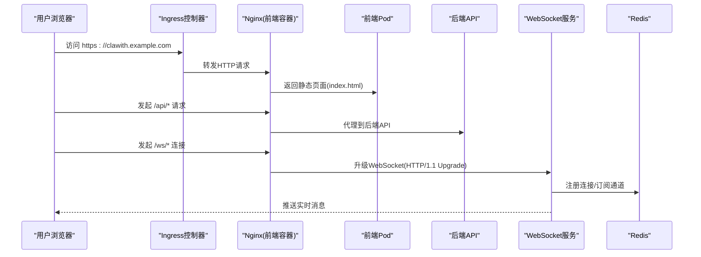
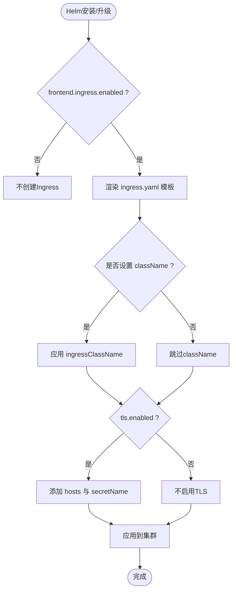
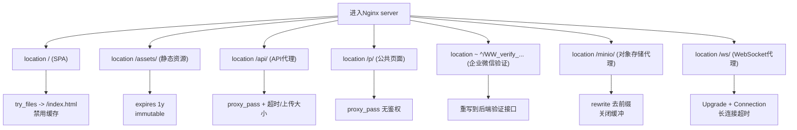
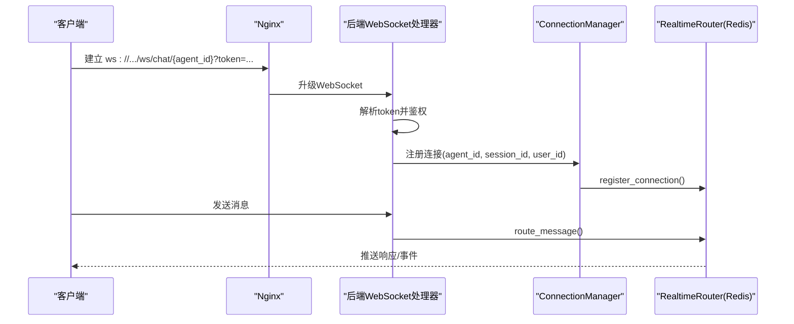
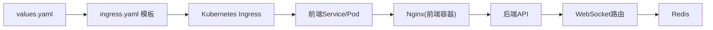

# Ingress和网络配置

<cite>
**本文引用的文件**   
- [ingress.yaml](file://helm/clawith/templates/ingress.yaml)
- [values.yaml](file://helm/clawith/values.yaml)
- [nginx.conf](file://deploy/nginx/nginx.conf)
- [nginx.conf.template](file://frontend/nginx.conf.template)
- [docker-compose.yml](file://deploy/docker-compose.yml)
- [websocket.py](file://backend/app/api/websocket.py)
- [group_websocket.py](file://backend/app/api/group_websocket.py)
- [router.py](file://backend/app/services/realtime_runtime/router.py)
- [QUICKSTART.md](file://helm/QUICKSTART.md)
</cite>

## 目录
1. [简介](#简介)
2. [项目结构](#项目结构)
3. [核心组件](#核心组件)
4. [架构总览](#架构总览)
5. [详细组件分析](#详细组件分析)
6. [依赖关系分析](#依赖关系分析)
7. [性能考虑](#性能考虑)
8. [故障排查指南](#故障排查指南)
9. [结论](#结论)
10. [附录](#附录)

## 简介
本指南面向在 Kubernetes、Docker Compose 或云负载均衡环境下部署 Clawith 平台的运维与平台工程团队，聚焦 Ingress 与网络配置。内容涵盖：
- Ingress 资源定义、域名绑定与 TLS 证书管理
- Nginx 反向代理与 WebSocket 长连接支持
- AWS ALB/GCP LB 等云负载均衡器的接入要点
- Service Mesh（如 Istio）集成建议
- 企业级网络安全策略、防火墙规则与网络隔离
- 网络性能优化与常见问题排查

## 项目结构
Clawith 的 Ingress 与网络相关配置主要分布在 Helm Chart、Nginx 模板与后端 WebSocket 路由中：
- Helm Chart 提供 Ingress 模板与默认值，便于在不同环境快速启用 HTTPS、设置域名与注解
- Nginx 模板负责静态资源缓存、API 转发、MinIO 代理以及 WebSocket 升级
- Docker Compose 演示了本地开发时的前端 Nginx 与后端 API 的代理关系
- 后端暴露 /ws 系列 WebSocket 端点，配合 Redis Pub/Sub 实现跨实例消息路由

图表来源
- [ingress.yaml:1-37](file://helm/clawith/templates/ingress.yaml#L1-L37)
- [nginx.conf:1-82](file://deploy/nginx/nginx.conf#L1-L82)
- [websocket.py:229-240](file://backend/app/api/websocket.py#L229-L240)
- [router.py:1-34](file://backend/app/services/realtime_runtime/router.py#L1-L34)

章节来源
- [ingress.yaml:1-37](file://helm/clawith/templates/ingress.yaml#L1-L37)
- [values.yaml:88-99](file://helm/clawith/values.yaml#L88-L99)
- [nginx.conf:1-82](file://deploy/nginx/nginx.conf#L1-L82)
- [docker-compose.yml:87-101](file://deploy/docker-compose.yml#L87-L101)

## 核心组件
- Ingress 模板：定义 host、TLS、className 与注解，将流量转发到前端 Service
- Nginx 反向代理：处理 SPA 回退、静态资源缓存、API 与 MinIO 代理、WebSocket 升级
- WebSocket 路由：/ws/chat/{agent_id} 与 /ws/group/{group_id} 两个端点，基于 Redis Pub/Sub 进行跨实例路由
- Docker Compose：本地开发时通过 Nginx 将 /api 与 /ws 转发至后端

章节来源
- [ingress.yaml:1-37](file://helm/clawith/templates/ingress.yaml#L1-L37)
- [nginx.conf:1-82](file://deploy/nginx/nginx.conf#L1-L82)
- [websocket.py:229-240](file://backend/app/api/websocket.py#L229-L240)
- [group_websocket.py:51-82](file://backend/app/api/group_websocket.py#L51-L82)
- [docker-compose.yml:87-101](file://deploy/docker-compose.yml#L87-L101)

## 架构总览
下图展示了从外部访问到内部服务的完整路径，包括 Ingress、Nginx、后端 API 与 WebSocket 路由，以及与 Redis 的交互。

图表来源
- [ingress.yaml:14-35](file://helm/clawith/templates/ingress.yaml#L14-L35)
- [nginx.conf:26-80](file://deploy/nginx/nginx.conf#L26-L80)
- [websocket.py:229-240](file://backend/app/api/websocket.py#L229-L240)
- [router.py:1-34](file://backend/app/services/realtime_runtime/router.py#L1-L34)

## 详细组件分析

### Ingress 资源与域名/TLS 配置
- 使用 Helm values 控制是否启用 Ingress、className、host 与 TLS secret
- 通过 annotations 注入控制器特性（例如 nginx.ingress.kubernetes.io/ssl-redirect、cert-manager 注解）
- 当启用 tls.enabled 时，需准备包含证书与私钥的 Secret，并在 values 中指定 secretName

图表来源
- [ingress.yaml:1-35](file://helm/clawith/templates/ingress.yaml#L1-L35)
- [values.yaml:88-99](file://helm/clawith/values.yaml#L88-L99)

章节来源
- [ingress.yaml:1-37](file://helm/clawith/templates/ingress.yaml#L1-L37)
- [values.yaml:88-99](file://helm/clawith/values.yaml#L88-L99)
- [QUICKSTART.md:517-530](file://helm/QUICKSTART.md#L517-L530)

### Nginx 反向代理与 WebSocket 支持
- SPA 回退：根路径 try_files 指向 index.html，并禁用缓存确保最新构建
- 静态资源：/assets/ 长期缓存
- API 代理：/api/ 转发到后端，设置超时与上传大小限制
- 公共页面：/p/ 无鉴权，直接代理到后端
- MinIO 代理：/minio/ 重写前缀并关闭缓冲以支持大文件
- WebSocket：/ws/ 开启 HTTP/1.1 与 Upgrade，设置长连接超时

图表来源
- [nginx.conf:1-82](file://deploy/nginx/nginx.conf#L1-L82)
- [nginx.conf.template:1-82](file://frontend/nginx.conf.template#L1-L82)

章节来源
- [nginx.conf:1-82](file://deploy/nginx/nginx.conf#L1-L82)
- [nginx.conf.template:1-82](file://frontend/nginx.conf.template#L1-L82)
- [docker-compose.yml:92-98](file://deploy/docker-compose.yml#L92-L98)

### WebSocket 端点与跨实例路由
- 端点：/ws/chat/{agent_id} 与 /ws/group/{group_id}
- 认证：通过 Query token 解码用户身份，校验 Agent/Group 权限
- 路由：ConnectionManager 维护连接映射，RealtimeRouter 基于 Redis Pub/Sub 进行跨实例消息分发
- 心跳与保活：Nginx 层设置长连接超时；后端按业务需要发送 ping/pong

图表来源
- [websocket.py:229-240](file://backend/app/api/websocket.py#L229-L240)
- [websocket.py:76-162](file://backend/app/api/websocket.py#L76-L162)
- [group_websocket.py:51-82](file://backend/app/api/group_websocket.py#L51-L82)
- [router.py:1-34](file://backend/app/services/realtime_runtime/router.py#L1-L34)

章节来源
- [websocket.py:229-240](file://backend/app/api/websocket.py#L229-L240)
- [websocket.py:76-162](file://backend/app/api/websocket.py#L76-L162)
- [group_websocket.py:51-82](file://backend/app/api/group_websocket.py#L51-L82)
- [router.py:1-34](file://backend/app/services/realtime_runtime/router.py#L1-L34)

### Docker Compose 中的代理关系
- 前端容器运行 Nginx，监听 3000，将 /api 与 /ws 转发到后端
- 环境变量 API_UPSTREAM 与 MINIO_UPSTREAM 控制上游地址
- 端口映射 FRONTEND_PORT 暴露给宿主机

章节来源
- [docker-compose.yml:87-101](file://deploy/docker-compose.yml#L87-L101)
- [docker-compose.yml:92-98](file://deploy/docker-compose.yml#L92-L98)

## 依赖关系分析
- Ingress 依赖 Helm values 与模板渲染结果
- Nginx 依赖环境变量 API_UPSTREAM/MINIO_UPSTREAM
- WebSocket 依赖 Redis 作为 Pub/Sub 中间件
- 前端静态资源由 Nginx 直接提供，减少后端压力

图表来源
- [values.yaml:88-99](file://helm/clawith/values.yaml#L88-L99)
- [ingress.yaml:1-35](file://helm/clawith/templates/ingress.yaml#L1-L35)
- [nginx.conf:1-82](file://deploy/nginx/nginx.conf#L1-L82)
- [router.py:1-34](file://backend/app/services/realtime_runtime/router.py#L1-L34)

章节来源
- [values.yaml:88-99](file://helm/clawith/values.yaml#L88-L99)
- [ingress.yaml:1-35](file://helm/clawith/templates/ingress.yaml#L1-L35)
- [nginx.conf:1-82](file://deploy/nginx/nginx.conf#L1-L82)
- [router.py:1-34](file://backend/app/services/realtime_runtime/router.py#L1-L34)

## 性能考虑
- 静态资源缓存：/assets/ 使用 immutable 与一年过期，提升加载速度
- 上传大小与超时：/api/ 允许大文件上传，合理设置 proxy_read_timeout/proxy_send_timeout
- WebSocket 长连接：/ws/ 设置 3600s 超时，避免长时间会话被中断
- 关闭缓冲：/minio/ 关闭缓冲以支持流式传输与大文件
- 多副本与水平扩展：后端与前端均可多副本，结合 Ingress 控制器实现负载均衡

[本节为通用指导，无需引用具体文件]

## 故障排查指南
- Ingress 未生效
  - 检查 values 中 frontend.ingress.enabled、className、host、tls.secretName
  - 查看 Ingress 状态与事件
- TLS 证书问题
  - 确认 Secret 存在且包含证书与私钥
  - 若使用 cert-manager，检查 ClusterIssuer 与证书状态
- WebSocket 连接失败
  - 确认 Nginx 已正确设置 Upgrade 与 Connection 头
  - 检查后端 WebSocket 端点可访问性与鉴权逻辑
  - 检查 Redis 连通性与 Pub/Sub 通道
- 大文件上传失败
  - 调整 client_max_body_size 与后端超时参数
- 本地开发无法访问
  - 核对 docker-compose 端口映射与环境变量 API_UPSTREAM/MINIO_UPSTREAM

章节来源
- [QUICKSTART.md:414-470](file://helm/QUICKSTART.md#L414-L470)
- [nginx.conf:26-80](file://deploy/nginx/nginx.conf#L26-L80)
- [websocket.py:229-240](file://backend/app/api/websocket.py#L229-L240)
- [docker-compose.yml:87-101](file://deploy/docker-compose.yml#L87-L101)

## 结论
通过 Helm 提供的 Ingress 模板与 Nginx 反向代理，Clawith 能够在多种环境中稳定地对外提供服务，并支持 WebSocket 实时通信。结合合理的 TLS、缓存与超时配置，可满足企业级安全与性能需求。在生产环境中，建议结合云负载均衡器与 Service Mesh 进一步细化流量治理与安全策略。

[本节为总结性内容，无需引用具体文件]

## 附录

### 不同负载均衡器的接入要点
- NGINX Ingress
  - 使用 annotations 启用 ssl-redirect、自定义超时与限流
  - 如需自动签发证书，启用 cert-manager 注解
- AWS ALB
  - 通过 Target Group 指向后端 Service/NodePort
  - 在 Listener 上配置 HTTPS 与证书，必要时启用 Path-based Routing
  - 对 WebSocket 需启用 HTTP/1.1 与 Connection Upgrade
- GCP LB
  - 使用 Backend Service 与 Health Checks
  - 启用 HTTP/2 与 WebSocket 支持
  - 通过 SSL Certificate 与 Managed Certificate 管理证书

[本节为通用指导，无需引用具体文件]

### Service Mesh（Istio）集成建议
- 使用 VirtualService 与 DestinationRule 管理路由与重试/熔断
- 对 /ws 路径启用 TCP 或 HTTP/1.1 透传，避免代理层中断长连接
- 利用 mTLS 加密服务间通信，结合 AuthorizationPolicy 实施细粒度访问控制

[本节为通用指导，无需引用具体文件]

### 企业级网络安全策略
- 最小权限原则：仅开放必要端口与路径
- 白名单与黑名单：结合 Ingress 注解或网关插件限制来源 IP
- 网络隔离：使用 NetworkPolicy 限制 Pod 间通信
- 审计与日志：集中收集 Ingress、Nginx 与应用日志，便于溯源

[本节为通用指导，无需引用具体文件]