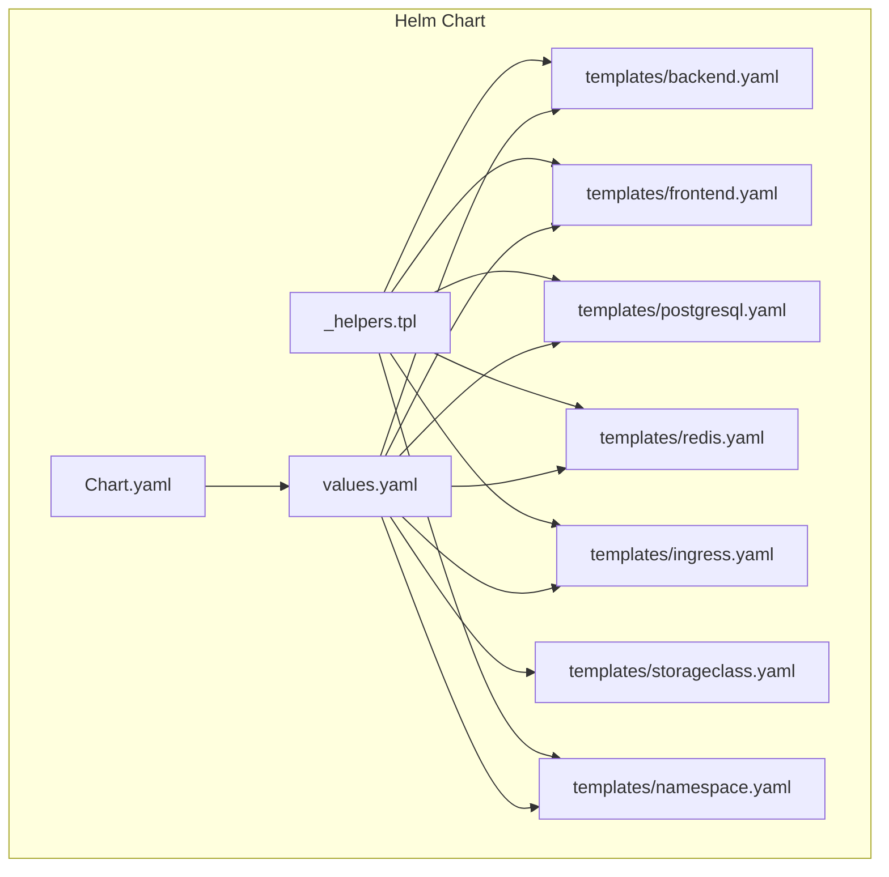
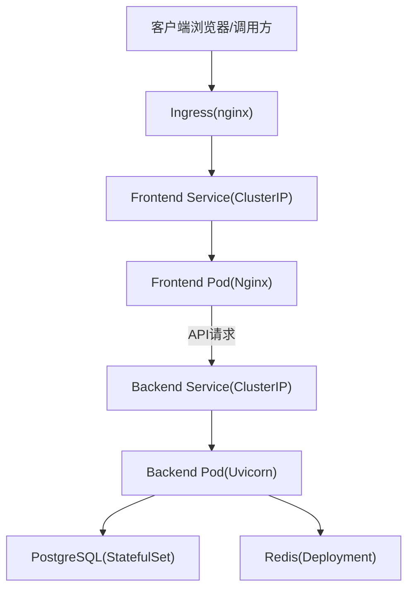
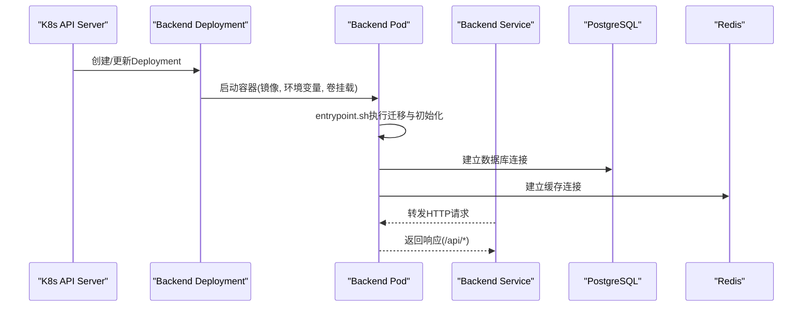
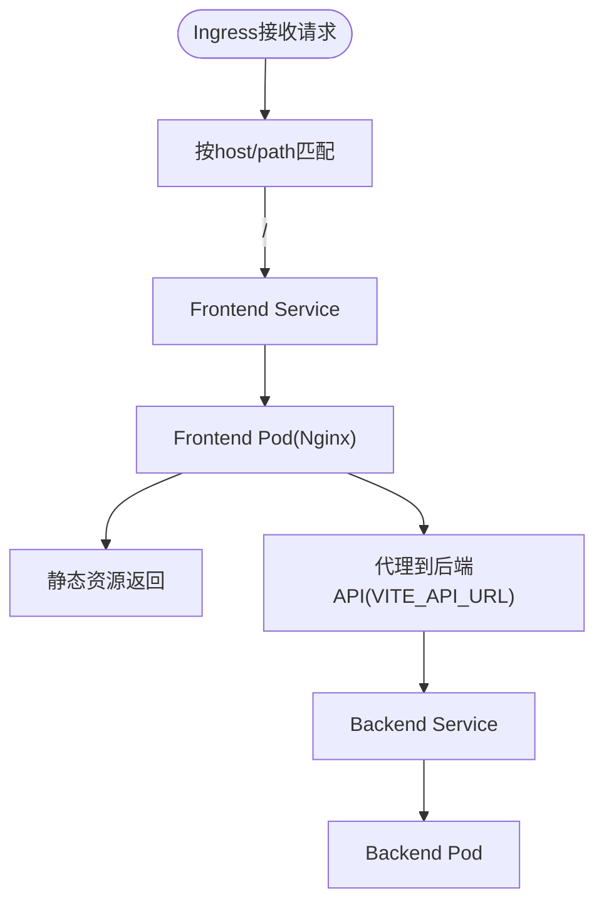
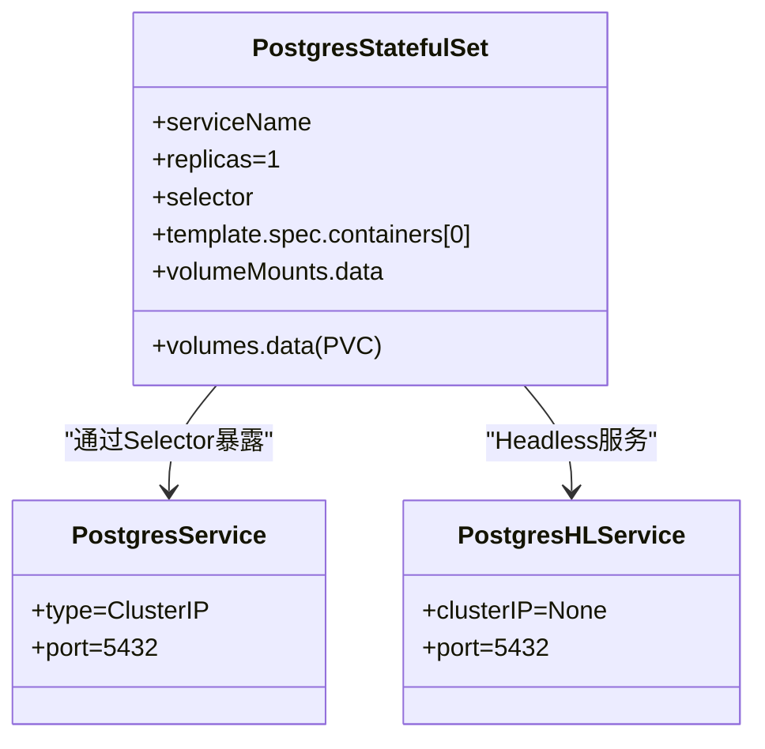
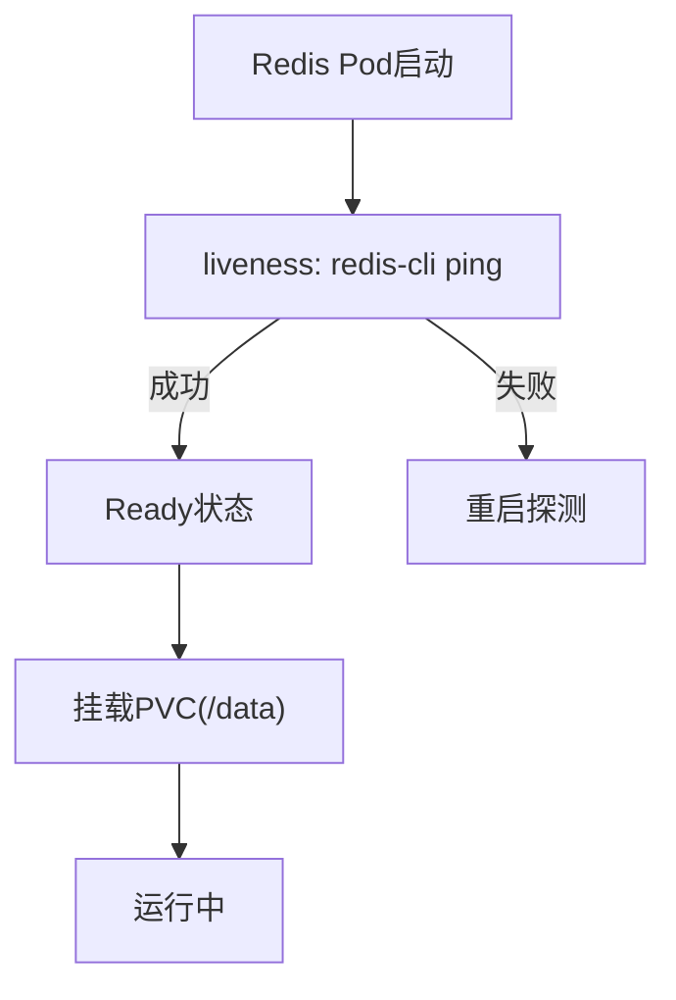
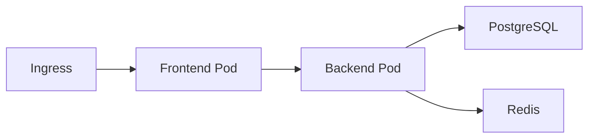

# Kubernetes资源配置

<cite>
**本文引用的文件**   
- [Chart.yaml](file://helm/clawith/Chart.yaml)
- [values.yaml](file://helm/clawith/values.yaml)
- [backend.yaml](file://helm/clawith/templates/backend.yaml)
- [frontend.yaml](file://helm/clawith/templates/frontend.yaml)
- [postgresql.yaml](file://helm/clawith/templates/postgresql.yaml)
- [redis.yaml](file://helm/clawith/templates/redis.yaml)
- [ingress.yaml](file://helm/clawith/templates/ingress.yaml)
- [storageclass.yaml](file://helm/clawith/templates/storageclass.yaml)
- [_helpers.tpl](file://helm/clawith/templates/_helpers.tpl)
- [namespace.yaml](file://helm/clawith/templates/namespace.yaml)
- [Dockerfile（后端）](file://backend/Dockerfile)
- [Dockerfile（前端）](file://frontend/Dockerfile)
- [entrypoint.sh](file://backend/entrypoint.sh)
- [config.py](file://backend/app/config.py)
</cite>

## 目录
1. [简介](#简介)
2. [项目结构](#项目结构)
3. [核心组件](#核心组件)
4. [架构总览](#架构总览)
5. [详细组件分析](#详细组件分析)
6. [依赖关系分析](#依赖关系分析)
7. [性能与资源规划](#性能与资源规划)
8. [故障排查指南](#故障排查指南)
9. [结论](#结论)
10. [附录：环境变量与配置项速查](#附录环境变量与配置项速查)

## 简介
本文件面向在Kubernetes上部署Clawith平台的运维与SRE人员，系统化说明Helm Chart的组织方式、各组件的Pod/Service/StatefulSet配置、持久化与备份策略、Ingress暴露方式、ConfigMap/Secret使用模式，以及高级调度能力（配额、亲和性、容忍度等）。文档同时结合后端容器镜像与健康检查机制，给出生产环境最佳实践建议。

## 项目结构
Clawith通过Helm Chart进行统一编排，核心位于 helm/clawith 目录：
- Chart元数据：Chart.yaml
- 默认值与可配置项：values.yaml
- 模板文件：templates/*.yaml（后端、前端、PostgreSQL、Redis、Ingress、StorageClass、命名空间与Secret）
- 辅助模板：_helpers.tpl（名称解析、服务发现、Secret名称等）

图表来源
- [Chart.yaml:1-14](file://helm/clawith/Chart.yaml#L1-L14)
- [values.yaml:1-229](file://helm/clawith/values.yaml#L1-L229)
- [_helpers.tpl:1-139](file://helm/clawith/templates/_helpers.tpl#L1-L139)

章节来源
- [Chart.yaml:1-14](file://helm/clawith/Chart.yaml#L1-L14)
- [values.yaml:1-229](file://helm/clawith/values.yaml#L1-L229)

## 核心组件
- 后端（Backend）：Deployment + Service，挂载Agent数据卷，注入数据库与Redis连接信息，支持自定义CA证书注入，健康检查由容器内HTTP端点提供。
- 前端（Frontend）：Deployment + Service，静态资源由Nginx托管，通过Ingress对外暴露。
- 数据库（PostgreSQL）：StatefulSet + Headless Service + ClusterIP Service，持久化存储，内置存活/就绪探针。
- 缓存（Redis）：Deployment + Service，可选持久化，包含liveness探针。
- Ingress：将域名路由到前端Service，支持TLS。
- StorageClass：按需创建自定义存储类。
- Secret：应用密钥与数据库密码管理。

章节来源
- [backend.yaml:1-142](file://helm/clawith/templates/backend.yaml#L1-L142)
- [frontend.yaml:1-57](file://helm/clawith/templates/frontend.yaml#L1-L57)
- [postgresql.yaml:1-184](file://helm/clawith/templates/postgresql.yaml#L1-L184)
- [redis.yaml:1-94](file://helm/clawith/templates/redis.yaml#L1-L94)
- [ingress.yaml:1-37](file://helm/clawith/templates/ingress.yaml#L1-L37)
- [storageclass.yaml:1-18](file://helm/clawith/templates/storageclass.yaml#L1-L18)
- [namespace.yaml:1-21](file://helm/clawith/templates/namespace.yaml#L1-L21)

## 架构总览
下图展示Kubernetes中各组件的关系与数据流向：

图表来源
- [ingress.yaml:1-37](file://helm/clawith/templates/ingress.yaml#L1-L37)
- [frontend.yaml:1-57](file://helm/clawith/templates/frontend.yaml#L1-L57)
- [backend.yaml:1-142](file://helm/clawith/templates/backend.yaml#L1-L142)
- [postgresql.yaml:1-184](file://helm/clawith/templates/postgresql.yaml#L1-L184)
- [redis.yaml:1-94](file://helm/clawith/templates/redis.yaml#L1-L94)

## 详细组件分析

### 后端（Backend）
- Deployment副本数、镜像仓库与拉取策略由values控制；容器端口映射至Service端口。
- 环境变量：
  - DATABASE_URL、REDIS_URL：由_helpers模板根据是否启用内置数据库/缓存或外部地址生成。
  - AGENT_DATA_DIR、AGENT_TEMPLATE_DIR：Agent数据与模板路径。
  - SECRET_KEY、JWT_SECRET_KEY：从Secret读取。
  - SSL相关变量：当启用hostCerts时，自动注入并合并宿主CA证书。
- 持久化：
  - 通过PVC挂载Agent数据目录，支持existingClaim复用。
- 健康检查：
  - 容器HEALTHCHECK调用/api/health；K8s层面可通过readiness/liveness进一步定义。
- 资源限制：
  - 通过resources字段设置requests/limits。

图表来源
- [backend.yaml:1-142](file://helm/clawith/templates/backend.yaml#L1-L142)
- [entrypoint.sh:1-95](file://backend/entrypoint.sh#L1-L95)
- [config.py:1-268](file://backend/app/config.py#L1-L268)

章节来源
- [backend.yaml:1-142](file://helm/clawith/templates/backend.yaml#L1-L142)
- [values.yaml:12-68](file://helm/clawith/values.yaml#L12-L68)
- [Dockerfile（后端）:1-63](file://backend/Dockerfile#L1-L63)
- [entrypoint.sh:1-95](file://backend/entrypoint.sh#L1-L95)
- [config.py:80-120](file://backend/app/config.py#L80-L120)

### 前端（Frontend）
- Deployment副本数与镜像由values控制；容器端口为Nginx监听端口。
- 环境变量VITE_API_URL指向后端Service地址。
- Service类型默认ClusterIP，通常配合Ingress对外暴露。
- Ingress规则将域名路由到前端Service，支持TLS与注解扩展。

图表来源
- [frontend.yaml:1-57](file://helm/clawith/templates/frontend.yaml#L1-L57)
- [ingress.yaml:1-37](file://helm/clawith/templates/ingress.yaml#L1-L37)

章节来源
- [frontend.yaml:1-57](file://helm/clawith/templates/frontend.yaml#L1-L57)
- [ingress.yaml:1-37](file://helm/clawith/templates/ingress.yaml#L1-L37)
- [Dockerfile（前端）:1-16](file://frontend/Dockerfile#L1-L16)

### PostgreSQL（StatefulSet）
- StatefulSet单副本，Headless Service用于稳定网络标识，ClusterIP Service供应用访问。
- 持久化：PVC挂载到/bitnami/postgresql，支持existingClaim与自定义storageClass。
- 安全上下文：pod与container级别均可配置。
- 健康检查：liveness/readiness通过pg_isready检测。
- 环境变量：POSTGRES_PASSWORD来自Secret，其他参数由values控制。

图表来源
- [postgresql.yaml:1-184](file://helm/clawith/templates/postgresql.yaml#L1-L184)

章节来源
- [postgresql.yaml:1-184](file://helm/clawith/templates/postgresql.yaml#L1-L184)
- [values.yaml:108-157](file://helm/clawith/values.yaml#L108-L157)

### Redis（Deployment）
- Deployment单副本，Recreate策略保证数据一致性。
- 持久化：可选PVC挂载/data，支持existingClaim与storageClass。
- 健康检查：liveness通过redis-cli ping。
- Service：ClusterIP，端口6379。

图表来源
- [redis.yaml:1-94](file://helm/clawith/templates/redis.yaml#L1-L94)

章节来源
- [redis.yaml:1-94](file://helm/clawith/templates/redis.yaml#L1-L94)
- [values.yaml:158-196](file://helm/clawith/values.yaml#L158-L196)

### Ingress与Service类型选择
- Ingress：
  - 通过ingressClassName指定控制器（如nginx）。
  - 支持annotations扩展行为（如rewrite-target、ssl-redirect）。
  - TLS：启用后绑定secretName，对指定host生效。
- Service类型：
  - ClusterIP：默认，仅集群内可达。
  - NodePort：如需节点端口暴露。
  - LoadBalancer：云厂商负载均衡器暴露。

章节来源
- [ingress.yaml:1-37](file://helm/clawith/templates/ingress.yaml#L1-L37)
- [values.yaml:70-106](file://helm/clawith/values.yaml#L70-L106)

### ConfigMap与Secret使用
- Secret：
  - 应用密钥（SECRET_KEY、JWT_SECRET_KEY）由namespace模板创建或引用existingSecret。
  - PostgreSQL密码由postgresql模板创建Secret并注入。
- ConfigMap：
  - 当前未显式使用ConfigMap；可将非敏感配置以ConfigMap形式注入，便于多环境复用。
- 多环境敏感信息管理：
  - 开发/测试：可使用values中的默认值或本地Secret。
  - 生产：建议使用外部Secret管理（如Vault、KMS），并通过secrets.existingSecret引用。

章节来源
- [namespace.yaml:1-21](file://helm/clawith/templates/namespace.yaml#L1-L21)
- [postgresql.yaml:1-184](file://helm/clawith/templates/postgresql.yaml#L1-L184)
- [values.yaml:197-213](file://helm/clawith/values.yaml#L197-L213)

### 高级调度与资源管理
- 资源配额：
  - 可在values.backend.resources与values.frontend.resources中设置requests/limits。
  - 集群级可用ResourceQuota与LimitRange约束命名空间资源。
- 节点亲和性与容忍度：
  - 可在Pod模板中添加affinity与tolerations，实现GPU/专用节点调度。
- 存储类：
  - storageClass.create=true时可创建自定义StorageClass，支持扩容与回收策略。

章节来源
- [values.yaml:62-68](file://helm/clawith/values.yaml#L62-L68)
- [values.yaml:100-106](file://helm/clawith/values.yaml#L100-L106)
- [storageclass.yaml:1-18](file://helm/clawith/templates/storageclass.yaml#L1-L18)
- [values.yaml:204-216](file://helm/clawith/values.yaml#L204-L216)

## 依赖关系分析
- 后端依赖：
  - PostgreSQL：DATABASE_URL由_helpers模板生成，支持内置或外部实例。
  - Redis：REDIS_URL由_helpers模板生成，支持内置或外部实例。
  - 可选CA证书：通过hostCerts注入并合并到容器信任链。
- 前端依赖：
  - 后端API：VITE_API_URL指向后端Service。
  - Ingress：对外暴露域名与TLS。

图表来源
- [_helpers.tpl:54-126](file://helm/clawith/templates/_helpers.tpl#L54-L126)
- [backend.yaml:62-88](file://helm/clawith/templates/backend.yaml#L62-L88)
- [frontend.yaml:29-31](file://helm/clawith/templates/frontend.yaml#L29-L31)

章节来源
- [_helpers.tpl:54-126](file://helm/clawith/templates/_helpers.tpl#L54-L126)
- [backend.yaml:62-88](file://helm/clawith/templates/backend.yaml#L62-L88)
- [frontend.yaml:29-31](file://helm/clawith/templates/frontend.yaml#L29-L31)

## 性能与资源规划
- 后端资源：
  - 建议根据并发与模型调用规模设置CPU/Memory requests/limits。
  - Agent数据目录建议高性能磁盘（SSD/NVMe），I/O密集场景关注延迟。
- 数据库资源：
  - PostgreSQL建议独立节点或高IO存储类，开启共享内存优化（dshm）。
  - 合理设置连接池与超时参数。
- Redis资源：
  - 作为缓存与任务队列，建议内存充足，持久化按需开启。
- 健康检查：
  - 后端容器HEALTHCHECK已定义/api/health；建议在K8s层面补充readiness/liveness以提升可用性。
- 水平扩展：
  - 后端无状态，可通过增加副本提升吞吐；需确保数据库连接池与Redis容量匹配。

章节来源
- [Dockerfile（后端）:56-60](file://backend/Dockerfile#L56-L60)
- [postgresql.yaml:129-144](file://helm/clawith/templates/postgresql.yaml#L129-L144)
- [redis.yaml:51-62](file://helm/clawith/templates/redis.yaml#L51-L62)

## 故障排查指南
- 后端无法启动：
  - 检查entrypoint.sh日志，确认Alembic迁移与LangGraph checkpoint初始化是否成功。
  - 验证DATABASE_URL与REDIS_URL连通性。
  - 若启用hostCerts，确认证书路径与合并逻辑正常。
- 数据库不可用：
  - 检查PostgreSQL liveness/readiness探针结果。
  - 确认PVC挂载与权限（fsGroup/runAsUser）。
- Redis异常：
  - 查看liveness探针失败原因（redis-cli ping）。
  - 检查持久化卷挂载与权限。
- Ingress无法访问：
  - 确认ingressClassName与控制器安装正确。
  - 检查TLS secret是否存在且域名匹配。
  - 校验前端Service端口与targetPort映射。

章节来源
- [entrypoint.sh:42-91](file://backend/entrypoint.sh#L42-L91)
- [backend.yaml:62-88](file://helm/clawith/templates/backend.yaml#L62-L88)
- [postgresql.yaml:102-124](file://helm/clawith/templates/postgresql.yaml#L102-L124)
- [redis.yaml:51-58](file://helm/clawith/templates/redis.yaml#L51-L58)
- [ingress.yaml:14-35](file://helm/clawith/templates/ingress.yaml#L14-L35)

## 结论
本Helm Chart提供了Clawith平台在Kubernetes上的完整部署方案，涵盖前后端、数据库、缓存、Ingress与存储类管理。通过values集中配置、_helpers模板抽象服务发现、Secret统一管理敏感信息，并结合健康检查与持久化策略，满足生产环境的稳定性与可扩展性需求。建议在生产环境中采用外部Secret管理、合理的资源配额与节点亲和性策略，以实现高可用与高效调度。

## 附录：环境变量与配置项速查
- 后端关键环境变量：
  - DATABASE_URL、REDIS_URL、AGENT_DATA_DIR、AGENT_TEMPLATE_DIR、SECRET_KEY、JWT_SECRET_KEY、SSL_CERT_FILE、REQUESTS_CA_BUNDLE、CURL_CA_BUNDLE
- 前端关键环境变量：
  - VITE_API_URL
- PostgreSQL关键环境变量：
  - POSTGRES_PASSWORD、POSTGRES_DB、POSTGRESQL_PORT_NUMBER、PGDATA等
- Redis关键配置：
  - 服务端口6379，持久化路径/data

章节来源
- [backend.yaml:62-88](file://helm/clawith/templates/backend.yaml#L62-L88)
- [frontend.yaml:29-31](file://helm/clawith/templates/frontend.yaml#L29-L31)
- [postgresql.yaml:67-98](file://helm/clawith/templates/postgresql.yaml#L67-L98)
- [config.py:89-120](file://backend/app/config.py#L89-L120)