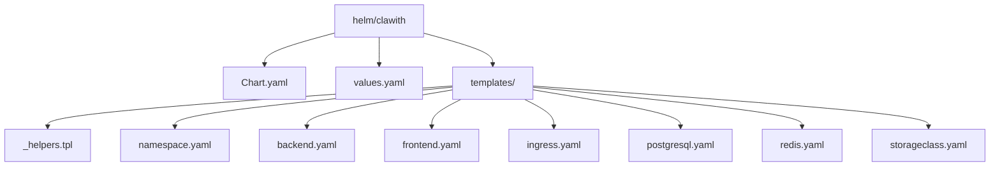
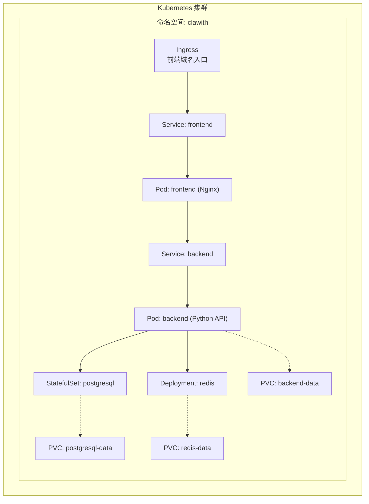
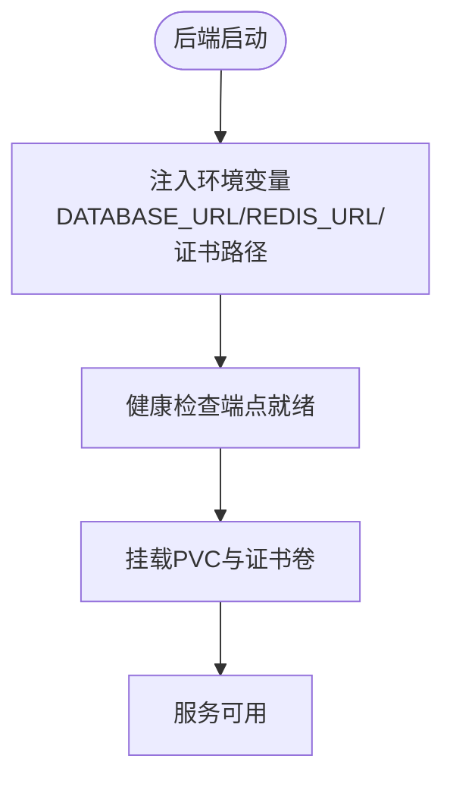
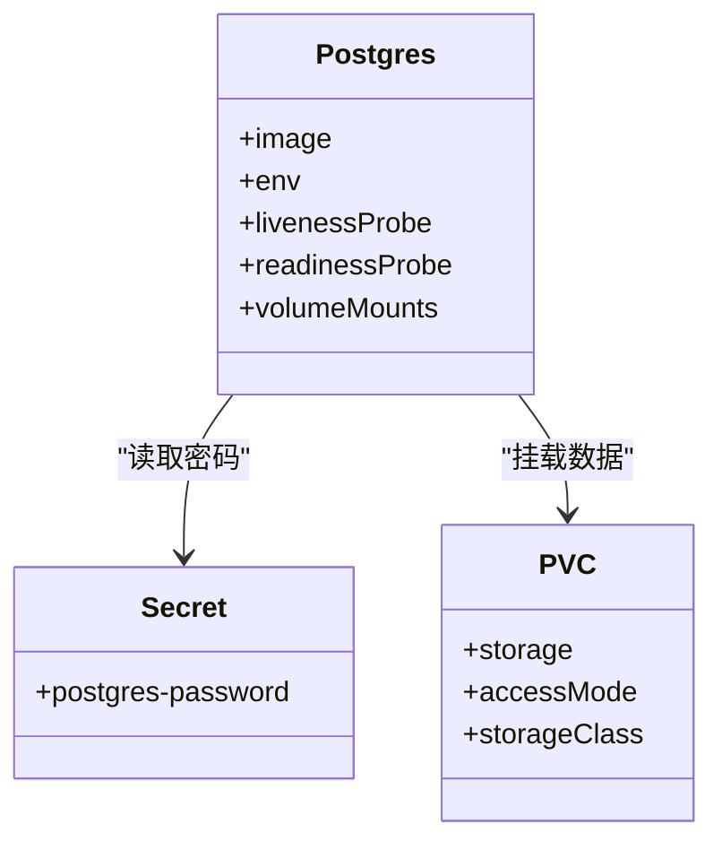
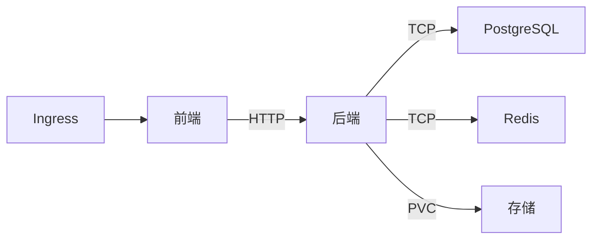

# Kubernetes部署

<cite>
**本文引用的文件**   
- [helm/clawith/Chart.yaml](file://helm/clawith/Chart.yaml)
- [helm/clawith/values.yaml](file://helm/clawith/values.yaml)
- [helm/clawith/templates/_helpers.tpl](file://helm/clawith/templates/_helpers.tpl)
- [helm/clawith/templates/backend.yaml](file://helm/clawith/templates/backend.yaml)
- [helm/clawith/templates/frontend.yaml](file://helm/clawith/templates/frontend.yaml)
- [helm/clawith/templates/ingress.yaml](file://helm/clawith/templates/ingress.yaml)
- [helm/clawith/templates/postgresql.yaml](file://helm/clawith/templates/postgresql.yaml)
- [helm/clawith/templates/redis.yaml](file://helm/clawith/templates/redis.yaml)
- [helm/clawith/templates/storageclass.yaml](file://helm/clawith/templates/storageclass.yaml)
- [helm/clawith/templates/namespace.yaml](file://helm/clawith/templates/namespace.yaml)
- [backend/Dockerfile](file://backend/Dockerfile)
- [frontend/Dockerfile](file://frontend/Dockerfile)
- [helm/QUICKSTART.md](file://helm/QUICKSTART.md)
</cite>

## 目录
1. [简介](#简介)
2. [项目结构](#项目结构)
3. [核心组件](#核心组件)
4. [架构总览](#架构总览)
5. [详细组件分析](#详细组件分析)
6. [依赖关系分析](#依赖关系分析)
7. [性能与可伸缩性](#性能与可伸缩性)
8. [故障排查指南](#故障排查指南)
9. [结论](#结论)
10. [附录：环境配置示例与最佳实践](#附录环境配置示例与最佳实践)

## 简介
本指南面向在Kubernetes集群上部署Clawith平台的运维与开发团队，围绕Helm Chart的结构、参数化配置、模板渲染机制以及K8s核心对象（Pod、Service、Ingress、PersistentVolume/PVC等）进行系统化说明。文档同时覆盖不同环境的部署策略、负载均衡与健康检查、滚动更新、扩缩容、监控与日志收集等生产级运维要点，帮助读者快速、安全、稳定地交付应用。

## 项目结构
Clawith的Kubernetes部署通过Helm Chart组织，位于helm/clawith目录。Chart元数据、默认值与模板分离，便于多环境复用与版本化管理。



图表来源
- [helm/clawith/Chart.yaml:1-14](file://helm/clawith/Chart.yaml#L1-L14)
- [helm/clawith/values.yaml:1-229](file://helm/clawith/values.yaml#L1-L229)
- [helm/clawith/templates/_helpers.tpl:1-139](file://helm/clawith/templates/_helpers.tpl#L1-L139)

章节来源
- [helm/clawith/Chart.yaml:1-14](file://helm/clawith/Chart.yaml#L1-L14)
- [helm/clawith/values.yaml:1-229](file://helm/clawith/values.yaml#L1-L229)
- [helm/QUICKSTART.md:1-715](file://helm/QUICKSTART.md#L1-L715)

## 核心组件
- Chart元数据与版本管理：Chart.yaml定义Chart名称、版本与应用版本，配合Helm发布生命周期管理。
- 参数化配置：values.yaml集中管理镜像、服务、存储、TLS、资源限制、外部依赖等所有可调参数。
- 模板辅助函数：_helpers.tpl提供命名、标签、选择器、数据库与Redis连接信息、Secret名称等复用逻辑。
- 工作负载与服务：
  - 后端：Deployment + Service + PVC（可选），环境变量注入数据库与缓存地址，支持挂载主机证书。
  - 前端：Deployment + Service，Nginx静态站点反向代理到后端API。
  - Ingress：对外暴露HTTP/HTTPS入口，支持注解与TLS。
- 依赖组件：
  - PostgreSQL：StatefulSet + Headless Service + PVC，内置健康检查探针。
  - Redis：Deployment + Service + PVC（可选），Recreate策略保障数据一致性。
  - StorageClass：可选创建自定义StorageClass以动态供给PVC。
- 命名空间与密钥：Namespace与Secret由模板统一创建或引用已有Secret。

章节来源
- [helm/clawith/templates/_helpers.tpl:1-139](file://helm/clawith/templates/_helpers.tpl#L1-L139)
- [helm/clawith/templates/backend.yaml:1-142](file://helm/clawith/templates/backend.yaml#L1-L142)
- [helm/clawith/templates/frontend.yaml:1-57](file://helm/clawith/templates/frontend.yaml#L1-L57)
- [helm/clawith/templates/ingress.yaml:1-37](file://helm/clawith/templates/ingress.yaml#L1-L37)
- [helm/clawith/templates/postgresql.yaml:1-184](file://helm/clawith/templates/postgresql.yaml#L1-L184)
- [helm/clawith/templates/redis.yaml:1-94](file://helm/clawith/templates/redis.yaml#L1-L94)
- [helm/clawith/templates/storageclass.yaml:1-18](file://helm/clawith/templates/storageclass.yaml#L1-L18)
- [helm/clawith/templates/namespace.yaml:1-21](file://helm/clawith/templates/namespace.yaml#L1-L21)

## 架构总览
下图展示了Clawith在Kubernetes中的整体部署拓扑：Ingress作为统一入口，将请求路由至前端Service；前端通过环境变量访问后端Service；后端连接PostgreSQL与Redis；持久化数据通过PVC绑定到节点存储。



图表来源
- [helm/clawith/templates/ingress.yaml:1-37](file://helm/clawith/templates/ingress.yaml#L1-L37)
- [helm/clawith/templates/frontend.yaml:1-57](file://helm/clawith/templates/frontend.yaml#L1-L57)
- [helm/clawith/templates/backend.yaml:1-142](file://helm/clawith/templates/backend.yaml#L1-L142)
- [helm/clawith/templates/postgresql.yaml:1-184](file://helm/clawith/templates/postgresql.yaml#L1-L184)
- [helm/clawith/templates/redis.yaml:1-94](file://helm/clawith/templates/redis.yaml#L1-L94)

## 详细组件分析

### Helm Chart元数据与参数体系
- Chart.yaml：声明Chart基本信息与应用版本，便于仓库管理与升级追踪。
- values.yaml：集中定义全局与组件级参数，包括镜像仓库、副本数、端口、存储类、TLS、资源限制、外部依赖等。推荐按环境维护多份values或采用--set/-f覆盖。
- _helpers.tpl：封装命名规则、标签选择器、数据库/Redis连接拼装、Secret名称解析等公共逻辑，确保模板一致性与可维护性。

章节来源
- [helm/clawith/Chart.yaml:1-14](file://helm/clawith/Chart.yaml#L1-L14)
- [helm/clawith/values.yaml:1-229](file://helm/clawith/values.yaml#L1-L229)
- [helm/clawith/templates/_helpers.tpl:1-139](file://helm/clawith/templates/_helpers.tpl#L1-L139)

### 后端服务（Backend）
- Deployment：控制副本数、镜像拉取策略、容器端口与环境变量。
- Service：ClusterIP类型，暴露后端API端口供前端与Ingress使用。
- PersistentVolumeClaim：为Agent数据目录提供持久化存储，支持现有PVC或动态供给。
- 环境变量：DATABASE_URL、REDIS_URL、AGENT_DATA_DIR、AGENT_TEMPLATE_DIR，以及可选SSL证书路径。
- 安全与证书：支持从主机挂载CA证书并注入容器内环境变量，满足企业私签证书场景。
- 资源限制：通过values.yaml的resources字段注入CPU/内存限制与请求。



图表来源
- [helm/clawith/templates/backend.yaml:1-142](file://helm/clawith/templates/backend.yaml#L1-L142)
- [backend/Dockerfile:1-63](file://backend/Dockerfile#L1-L63)

章节来源
- [helm/clawith/templates/backend.yaml:1-142](file://helm/clawith/templates/backend.yaml#L1-L142)
- [backend/Dockerfile:1-63](file://backend/Dockerfile#L1-L63)

### 前端服务（Frontend）
- Deployment：Nginx静态站点，暴露目标端口供Service转发。
- Service：ClusterIP类型，端口映射到Nginx监听端口。
- Ingress：根据values配置生成域名、注解与TLS，将流量路由到前端Service。
- 环境变量：VITE_API_URL指向后端Service地址，用于构建期或运行期API访问。

```mermaid
sequenceDiagram
Client as "客户端"
Ingress as "Ingress"
FE_Svc as "Service : frontend"
FE_Pod as "Pod : frontend(Nginx)"
BE_Svc as "Service : backend"
BE_Pod as "Pod : backend(API)"
Client->>Ingress : HTTP/HTTPS 请求
Ingress->>FE_Svc : 转发到前端
FE_Svc->>FE_Pod : Nginx处理静态资源
FE_Pod->>BE_Svc : 调用后端API(VITE_API_URL)
BE_Svc->>BE_Pod : 路由到后端
BE_Pod-->>FE_Pod : 返回API响应
FE_Pod-->>Client : 返回页面/数据
```

图表来源
- [helm/clawith/templates/frontend.yaml:1-57](file://helm/clawith/templates/frontend.yaml#L1-L57)
- [helm/clawith/templates/ingress.yaml:1-37](file://helm/clawith/templates/ingress.yaml#L1-L37)
- [frontend/Dockerfile:1-16](file://frontend/Dockerfile#L1-L16)

章节来源
- [helm/clawith/templates/frontend.yaml:1-57](file://helm/clawith/templates/frontend.yaml#L1-L57)
- [helm/clawith/templates/ingress.yaml:1-37](file://helm/clawith/templates/ingress.yaml#L1-L37)
- [frontend/Dockerfile:1-16](file://frontend/Dockerfile#L1-L16)

### 数据库（PostgreSQL）
- StatefulSet：单副本主库，固定网络标识，适合有状态数据存储。
- Service与Headless Service：常规Service对外暴露端口，Headless Service用于StatefulSet内部DNS解析。
- Secret：密码通过Secret注入，避免明文。
- 健康检查：liveness/readiness探针基于pg_isready检测数据库可用性。
- 持久化：PVC挂载数据目录，支持现有PVC或动态供给。



图表来源
- [helm/clawith/templates/postgresql.yaml:1-184](file://helm/clawith/templates/postgresql.yaml#L1-L184)

章节来源
- [helm/clawith/templates/postgresql.yaml:1-184](file://helm/clawith/templates/postgresql.yaml#L1-L184)

### 缓存（Redis）
- Deployment：单副本，Recreate策略保证数据一致性。
- Service：ClusterIP暴露端口。
- 健康检查：redis-cli ping探测存活。
- 持久化：可选PVC挂载/data目录。

章节来源
- [helm/clawith/templates/redis.yaml:1-94](file://helm/clawith/templates/redis.yaml#L1-L94)

### 存储类（StorageClass）
- 可选创建自定义StorageClass，指定provisioner、reclaimPolicy、volumeBindingMode与扩展能力。
- 适用于需要特定存储后端或行为控制的场景。

章节来源
- [helm/clawith/templates/storageclass.yaml:1-18](file://helm/clawith/templates/storageclass.yaml#L1-L18)
- [helm/clawith/values.yaml:204-216](file://helm/clawith/values.yaml#L204-L216)

### 命名空间与密钥
- Namespace：统一隔离部署资源。
- Secret：支持模板创建或引用已有Secret，包含应用密钥与JWT密钥。

章节来源
- [helm/clawith/templates/namespace.yaml:1-21](file://helm/clawith/templates/namespace.yaml#L1-L21)

## 依赖关系分析
- 组件耦合：
  - 前端依赖后端Service（VITE_API_URL）。
  - 后端依赖PostgreSQL与Redis（DATABASE_URL/REDIS_URL）。
  - 所有组件共享统一的命名空间与标签选择器。
- 外部依赖：
  - 镜像仓库：global.imageRegistry与组件镜像仓库/标签。
  - 存储后端：StorageClass与PVC绑定。
  - TLS：Ingress TLS Secret与可选主机证书。



图表来源
- [helm/clawith/templates/backend.yaml:1-142](file://helm/clawith/templates/backend.yaml#L1-L142)
- [helm/clawith/templates/frontend.yaml:1-57](file://helm/clawith/templates/frontend.yaml#L1-L57)
- [helm/clawith/templates/postgresql.yaml:1-184](file://helm/clawith/templates/postgresql.yaml#L1-L184)
- [helm/clawith/templates/redis.yaml:1-94](file://helm/clawith/templates/redis.yaml#L1-L94)
- [helm/clawith/templates/ingress.yaml:1-37](file://helm/clawith/templates/ingress.yaml#L1-L37)

章节来源
- [helm/clawith/values.yaml:1-229](file://helm/clawith/values.yaml#L1-L229)

## 性能与可伸缩性
- 副本与水平扩展：
  - 后端与前端均支持replicaCount调整，结合HPA可实现自动扩缩容。
- 资源限制与请求：
  - 通过values.yaml的resources字段设置CPU/内存requests与limits，保障调度与稳定性。
- 健康检查：
  - 后端容器内置HEALTHCHECK；PostgreSQL与Redis提供liveness/readiness探针。
- 滚动更新：
  - Deployment默认滚动策略；可通过Helm upgrade平滑升级。
- 存储I/O：
  - 选择合适的StorageClass与PVC大小，必要时启用SSD或高性能存储后端。

[本节为通用指导，不直接分析具体文件]

## 故障排查指南
- Pod无法启动：
  - 查看事件与日志：kubectl describe pod / kubectl logs。
  - 检查镜像拉取配置与镜像仓库可达性。
- PVC绑定失败：
  - 检查StorageClass是否存在且可用，确认容量与访问模式匹配。
- 数据库连接问题：
  - 验证PostgreSQL服务与Secret中的密码是否正确。
  - 在后端Pod内测试连通性（如nc -zv）。
- Ingress不可达：
  - 检查Ingress Controller是否安装，域名解析与TLS Secret是否正确。
- 证书问题：
  - 如需私签证书，启用hostCerts并确保主机路径与容器路径正确映射。

章节来源
- [helm/QUICKSTART.md:414-470](file://helm/QUICKSTART.md#L414-L470)
- [helm/clawith/templates/backend.yaml:1-142](file://helm/clawith/templates/backend.yaml#L1-L142)
- [helm/clawith/templates/postgresql.yaml:1-184](file://helm/clawith/templates/postgresql.yaml#L1-L184)

## 结论
通过Helm Chart对Clawith平台进行Kubernetes部署，能够实现参数化、可重复、易回滚的交付流程。借助标准的K8s对象模型（Deployment、Service、Ingress、PVC/StorageClass）与模板抽象，可在不同环境中快速切换与定制。结合健康检查、滚动更新、资源限制与外部依赖管理，能够满足从开发到生产的多样化需求。

[本节为总结性内容，不直接分析具体文件]

## 附录：环境配置示例与最佳实践

### 开发环境
- 镜像：使用latest或开发分支标签，镜像仓库指向本地或私有仓库。
- 副本：后端与前端各1副本。
- 存储：使用默认StorageClass或本地磁盘，PVC较小即可。
- Ingress：启用并配置开发域名，无需TLS或使用自签证书。
- 密钥：使用临时密钥，便于调试。

章节来源
- [helm/clawith/values.yaml:1-229](file://helm/clawith/values.yaml#L1-L229)
- [helm/QUICKSTART.md:35-124](file://helm/QUICKSTART.md#L35-L124)

### 测试环境
- 镜像：固定版本号，确保与CI产物一致。
- 副本：后端与前端各1-2副本。
- 存储：建议使用独立StorageClass，容量适中。
- Ingress：启用TLS，配置测试域名。
- 密钥：使用测试专用Secret，避免与生产混用。

章节来源
- [helm/clawith/values.yaml:1-229](file://helm/clawith/values.yaml#L1-L229)
- [helm/QUICKSTART.md:245-306](file://helm/QUICKSTART.md#L245-L306)

### 生产环境
- 镜像：固定版本标签，镜像仓库高可用。
- 副本：后端与前端至少2副本，建议开启HPA。
- 存储：高性能StorageClass（如SSD），合理容量规划。
- Ingress：启用TLS与证书管理（如cert-manager），配置SSL重定向。
- 密钥：使用外部Secret管理（如KMS或云厂商Secret Manager）。
- 资源限制：严格设置requests与limits，避免资源争用。
- 备份与恢复：定期备份PostgreSQL与PVC数据。

章节来源
- [helm/clawith/values.yaml:245-306](file://helm/clawith/values.yaml#L245-L306)
- [helm/QUICKSTART.md:471-558](file://helm/QUICKSTART.md#L471-L558)

### 高级特性配置
- 负载均衡：
  - Ingress层：通过Ingress Controller实现七层负载均衡与路径/域名路由。
  - Service层：ClusterIP默认轮询分发，可结合外部负载均衡器（如云LB）。
- 健康检查：
  - 后端容器HEALTHCHECK；PostgreSQL与Redis探针已内置。
- 滚动更新：
  - 使用helm upgrade平滑升级，支持回滚。
- 扩缩容：
  - 手动调整replicaCount或配置HPA自动扩缩容。
- 监控与日志：
  - 采集容器日志（stdout/stderr）并汇聚到日志系统（如ELK/Loki）。
  - 使用Prometheus抓取指标，Grafana可视化。

章节来源
- [helm/clawith/templates/backend.yaml:1-142](file://helm/clawith/templates/backend.yaml#L1-L142)
- [helm/clawith/templates/postgresql.yaml:1-184](file://helm/clawith/templates/postgresql.yaml#L1-L184)
- [helm/clawith/templates/redis.yaml:1-94](file://helm/clawith/templates/redis.yaml#L1-L94)
- [backend/Dockerfile:56-58](file://backend/Dockerfile#L56-L58)
- [helm/QUICKSTART.md:614-648](file://helm/QUICKSTART.md#L614-L648)