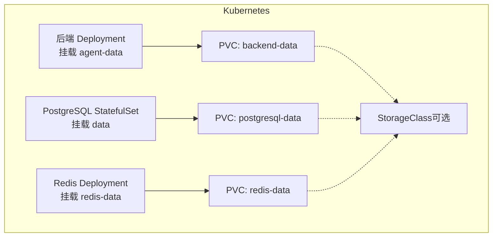
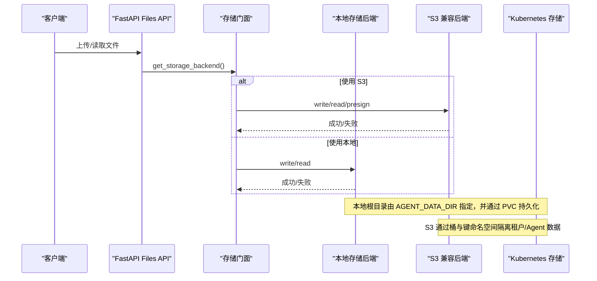
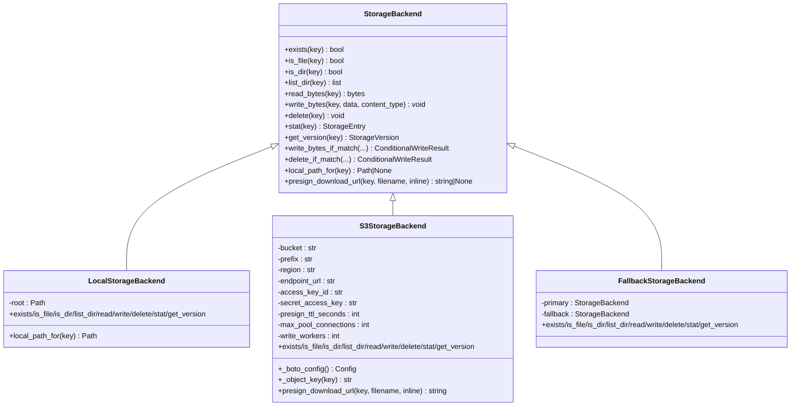
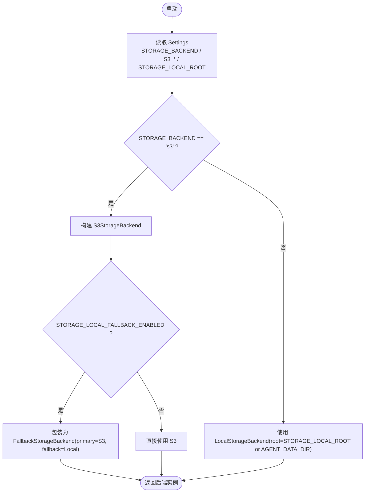
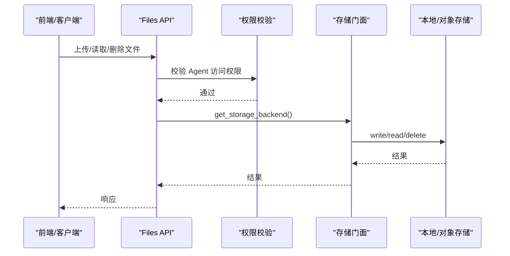
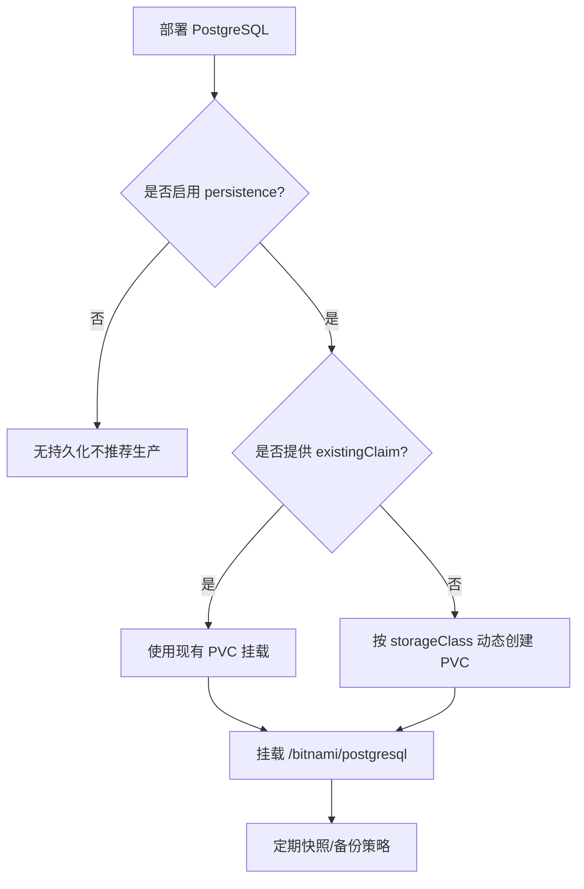
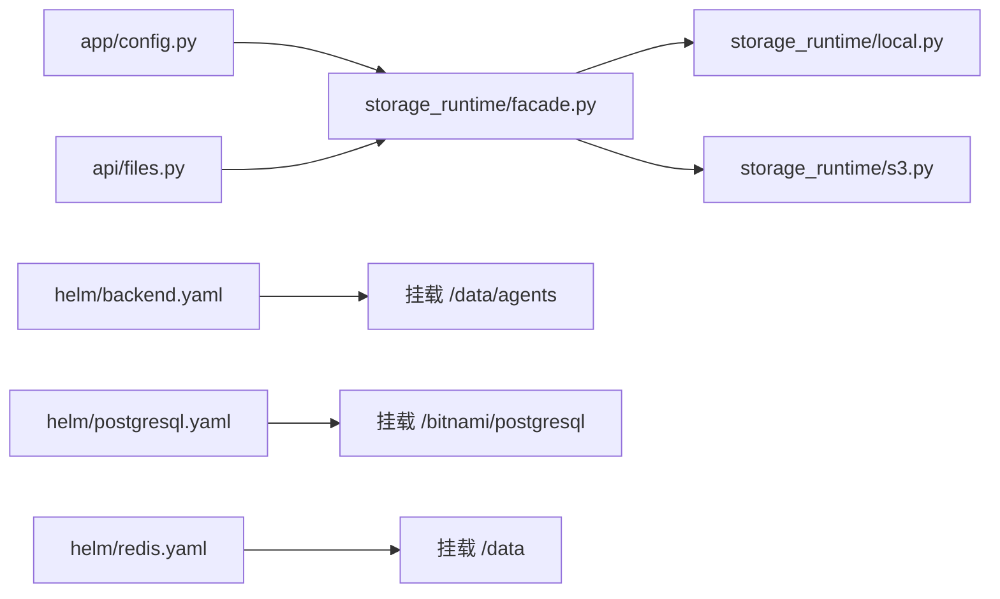

# 存储和持久化

<cite>
**本文引用的文件**   
- [docker-compose.yml](file://deploy/docker-compose.yml)
- [values.yaml](file://helm/clawith/values.yaml)
- [backend.yaml](file://helm/clawith/templates/backend.yaml)
- [postgresql.yaml](file://helm/clawith/templates/postgresql.yaml)
- [redis.yaml](file://helm/clawith/templates/redis.yaml)
- [storageclass.yaml](file://helm/clawith/templates/storageclass.yaml)
- [config.py](file://backend/app/config.py)
- [database.py](file://backend/app/database.py)
- [files.py](file://backend/app/api/files.py)
- [storage_runtime_base.py](file://backend/app/services/storage_runtime/base.py)
- [storage_runtime_facade.py](file://backend/app/services/storage_runtime/facade.py)
- [storage_runtime_local.py](file://backend/app/services/storage_runtime/local.py)
- [storage_runtime_s3.py](file://backend/app/services/storage_runtime/s3.py)
- [storage_runtime_agent_files.py](file://backend/app/services/storage_runtime/agent_files.py)
- [storage_compat.py](file://backend/app/services/storage.py)
- [agent_manager.py](file://backend/app/services/agent_manager.py)
</cite>

## 目录
1. [简介](#简介)
2. [项目结构](#项目结构)
3. [核心组件](#核心组件)
4. [架构总览](#架构总览)
5. [详细组件分析](#详细组件分析)
6. [依赖关系分析](#依赖关系分析)
7. [性能与容量规划](#性能与容量规划)
8. [故障排查指南](#故障排查指南)
9. [结论](#结论)
10. [附录：配置清单与最佳实践](#附录配置清单与最佳实践)

## 简介
本指南聚焦 Clawith 平台的“存储与持久化”能力，覆盖以下主题：
- Kubernetes 中的 PersistentVolume（PV）与 PersistentVolumeClaim（PVC）静态/动态供给
- 本地存储与云对象存储（S3 兼容，含 AWS S3、GCS 的 S3 兼容模式等）
- PostgreSQL 数据持久化、备份卷与快照策略建议
- 应用上传文件与 Agent 工作空间文件的存储方案
- 存储类（StorageClass）的动态与静态供给配置
- 运维最佳实践：性能调优、容量规划、数据迁移与回滚

## 项目结构
Clawith 在容器编排与 Helm Chart 中为各组件提供持久化挂载点：
- 后端（Backend）：Agent 数据与工作区文件通过 PVC 挂载到 /data/agents
- PostgreSQL：数据目录 /bitnami/postgresql 通过 PVC 持久化
- Redis：数据目录 /data 通过 PVC 持久化
- 可选 StorageClass：支持自定义 provisioner、扩容策略等

图表来源
- [backend.yaml:1-142](file://helm/clawith/templates/backend.yaml#L1-L142)
- [postgresql.yaml:1-184](file://helm/clawith/templates/postgresql.yaml#L1-L184)
- [redis.yaml:1-46](file://helm/clawith/templates/redis.yaml#L1-L46)
- [values.yaml:51-229](file://helm/clawith/values.yaml#L51-L229)
- [storageclass.yaml:1-18](file://helm/clawith/templates/storageclass.yaml#L1-L18)

章节来源
- [docker-compose.yml:1-111](file://deploy/docker-compose.yml#L1-L111)
- [values.yaml:51-229](file://helm/clawith/values.yaml#L51-L229)

## 核心组件
- 应用配置（Settings）：定义 STORAGE_BACKEND、STORAGE_LOCAL_ROOT、AGENT_DATA_DIR、S3_* 等关键环境变量
- 存储门面（Facade）：根据配置选择 Local 或 S3 后端，并支持本地回退以平滑迁移
- 本地存储后端（Local）：基于文件系统，路径安全校验、原子写入、条件写入
- S3 兼容后端（S3）：支持桶前缀、预签名下载、连接池与并发写参数
- 数据库连接（Database）：异步引擎与事务封装，用于元数据与状态持久化
- Helm Chart：声明式地创建 PVC、挂载卷、注入环境变量与 Secret

章节来源
- [config.py:79-120](file://backend/app/config.py#L79-L120)
- [storage_runtime_facade.py:34-77](file://backend/app/services/storage_runtime/facade.py#L34-L77)
- [storage_runtime_local.py:1-49](file://backend/app/services/storage_runtime/local.py#L1-L49)
- [storage_runtime_s3.py:1-48](file://backend/app/services/storage_runtime/s3.py#L1-L48)
- [database.py:1-79](file://backend/app/database.py#L1-L79)

## 架构总览
下图展示从 API 到存储后端的调用链，以及 Kubernetes 层 PV/PVC 的挂载关系。

图表来源
- [files.py:1-45](file://backend/app/api/files.py#L1-L45)
- [storage_runtime_facade.py:34-77](file://backend/app/services/storage_runtime/facade.py#L34-L77)
- [storage_runtime_local.py:1-49](file://backend/app/services/storage_runtime/local.py#L1-L49)
- [storage_runtime_s3.py:1-48](file://backend/app/services/storage_runtime/s3.py#L1-L48)
- [backend.yaml:89-111](file://helm/clawith/templates/backend.yaml#L89-L111)

## 详细组件分析

### 存储后端抽象与实现
- 统一接口 StorageBackend：定义 exists/is_file/is_dir/list_dir/read/write/delete/stat/get_version 等方法，并提供条件写入与版本令牌机制
- LocalStorageBackend：基于文件系统，路径规范化与安全校验，支持临时文件前缀与并发安全
- S3StorageBackend：桶、前缀、区域、端点、认证、预签名 TTL、连接池与并发写；对 GCS 的 S3 兼容模式有专门处理
- FallbackStorageBackend：读优先主存储，命中回退时复制到主存储，便于从本地向远端平滑迁移

图表来源
- [storage_runtime_base.py:1-146](file://backend/app/services/storage_runtime/base.py#L1-L146)
- [storage_runtime_local.py:1-49](file://backend/app/services/storage_runtime/local.py#L1-L49)
- [storage_runtime_s3.py:1-48](file://backend/app/services/storage_runtime/s3.py#L1-L48)
- [storage_runtime_fallback.py:1-35](file://backend/app/services/storage_runtime/fallback.py#L1-L35)

章节来源
- [storage_runtime_base.py:1-146](file://backend/app/services/storage_runtime/base.py#L1-L146)
- [storage_runtime_local.py:1-49](file://backend/app/services/storage_runtime/local.py#L1-L49)
- [storage_runtime_s3.py:1-48](file://backend/app/services/storage_runtime/s3.py#L1-L48)
- [storage_runtime_fallback.py:1-35](file://backend/app/services/storage_runtime/fallback.py#L1-L35)

### 存储门面与后端选择
- get_settings() 读取环境变量，决定 STORAGE_BACKEND
- 当 STORAGE_BACKEND=s3 时，构造 S3StorageBackend；若启用本地回退，则包装为 FallbackStorageBackend
- 否则默认使用 LocalStorageBackend，根目录来自 STORAGE_LOCAL_ROOT 或 AGENT_DATA_DIR

图表来源
- [storage_runtime_facade.py:34-77](file://backend/app/services/storage_runtime/facade.py#L34-L77)
- [config.py:105-120](file://backend/app/config.py#L105-L120)

章节来源
- [storage_runtime_facade.py:34-77](file://backend/app/services/storage_runtime/facade.py#L34-L77)
- [config.py:79-120](file://backend/app/config.py#L79-L120)

### 文件 API 与 Agent 工作空间
- files.py 暴露 Agent 工作区的文件读写 API，结合权限校验与协作锁
- agent_files.py 提供统一的键生成方法：agent_storage_key、agent_workspace_key、agent_upload_key
- agent_manager.py 将共享存储内容物化到本地工作树，供沙箱/Agent 直接访问

图表来源
- [files.py:1-45](file://backend/app/api/files.py#L1-L45)
- [storage_runtime_agent_files.py:1-41](file://backend/app/services/storage_runtime/agent_files.py#L1-L41)
- [agent_manager.py:65-92](file://backend/app/services/agent_manager.py#L65-L92)

章节来源
- [files.py:1-45](file://backend/app/api/files.py#L1-L45)
- [storage_runtime_agent_files.py:1-41](file://backend/app/services/storage_runtime/agent_files.py#L1-L41)
- [agent_manager.py:65-92](file://backend/app/services/agent_manager.py#L65-L92)

### PostgreSQL 持久化与备份策略
- Helm Chart 中 PostgreSQL 通过 StatefulSet 运行，数据目录 /bitnami/postgresql 挂载到 PVC
- 可通过 existingClaim 复用已有 PVC，或通过 storageClass 动态供给
- 建议配合云厂商快照策略（如 EBS Snapshot、Azure Disk Snapshot、GCP PD Snapshot）定期备份

图表来源
- [postgresql.yaml:14-32](file://helm/clawith/templates/postgresql.yaml#L14-L32)
- [postgresql.yaml:129-144](file://helm/clawith/templates/postgresql.yaml#L129-L144)
- [values.yaml:125-148](file://helm/clawith/values.yaml#L125-L148)

章节来源
- [postgresql.yaml:1-184](file://helm/clawith/templates/postgresql.yaml#L1-L184)
- [values.yaml:108-157](file://helm/clawith/values.yaml#L108-L157)

### Redis 持久化
- Redis 数据目录 /data 通过 PVC 持久化，避免重启丢失缓存/会话
- 可复用 existingClaim 或动态供给

章节来源
- [redis.yaml:1-46](file://helm/clawith/templates/redis.yaml#L1-L46)
- [values.yaml:158-196](file://helm/clawith/values.yaml#L158-L196)

### 后端 Agent 数据与工作区
- Backend 通过 PVC 挂载 /data/agents，作为 AGENT_DATA_DIR 与 STORAGE_LOCAL_ROOT 的根
- 在 Docker Compose 中，该目录映射到宿主机 ./backend/agent_data
- 在 Kubernetes 中，由 values.yaml 的 backend.persistence 控制

章节来源
- [docker-compose.yml:40-76](file://deploy/docker-compose.yml#L40-L76)
- [backend.yaml:89-111](file://helm/clawith/templates/backend.yaml#L89-L111)
- [values.yaml:43-68](file://helm/clawith/values.yaml#L43-L68)

## 依赖关系分析
- 应用配置（config.py）驱动存储后端选择与参数
- 存储门面（facade.py）组合具体后端实现
- API 层（files.py）通过门面访问存储
- Helm Chart 负责 PVC、Secret、环境变量注入与卷挂载

图表来源
- [config.py:79-120](file://backend/app/config.py#L79-L120)
- [storage_runtime_facade.py:34-77](file://backend/app/services/storage_runtime/facade.py#L34-L77)
- [storage_runtime_local.py:1-49](file://backend/app/services/storage_runtime/local.py#L1-L49)
- [storage_runtime_s3.py:1-48](file://backend/app/services/storage_runtime/s3.py#L1-L48)
- [files.py:1-45](file://backend/app/api/files.py#L1-L45)
- [backend.yaml:89-111](file://helm/clawith/templates/backend.yaml#L89-L111)
- [postgresql.yaml:129-144](file://helm/clawith/templates/postgresql.yaml#L129-L144)
- [redis.yaml:1-46](file://helm/clawith/templates/redis.yaml#L1-L46)

章节来源
- [config.py:79-120](file://backend/app/config.py#L79-L120)
- [storage_runtime_facade.py:34-77](file://backend/app/services/storage_runtime/facade.py#L34-L77)
- [files.py:1-45](file://backend/app/api/files.py#L1-L45)
- [backend.yaml:1-142](file://helm/clawith/templates/backend.yaml#L1-L142)
- [postgresql.yaml:1-184](file://helm/clawith/templates/postgresql.yaml#L1-L184)
- [redis.yaml:1-46](file://helm/clawith/templates/redis.yaml#L1-L46)

## 性能与容量规划
- 本地存储（Local）
  - 适合单机或小规模场景，I/O 延迟低
  - 注意磁盘 IOPS 与吞吐，避免单盘瓶颈
  - 建议开启只读副本或跨节点共享存储（NFS/CIFS）以实现多副本
- 对象存储（S3 兼容）
  - 高扩展性与高可用，适合大规模与跨区域复制
  - 合理设置 S3_MAX_POOL_CONNECTIONS 与 S3_WRITE_WORKERS 提升并发
  - 使用预签名 URL 降低后端带宽压力
- PostgreSQL
  - 使用高性能 SSD 或云盘（如 gp3/io2、Premium SSD、SSD Balanced）
  - 调整连接池大小（pool_size、max_overflow）匹配并发
  - 定期 WAL 归档与逻辑备份（pg_dump），结合云快照
- Redis
  - 使用内存型存储或带持久化的云托管服务
  - 合理设置 maxmemory 与淘汰策略，避免 OOM
- 容量规划
  - 估算 Agent 工作区增长速率（每个 Agent 约数十 MB~数 GB）
  - 预留 20%~30% 冗余空间应对突发增长
  - 监控 PVC 使用率，设置告警阈值（如 80%）

[本节为通用指导，无需特定文件引用]

## 故障排查指南
- 无法写入本地文件
  - 检查 AGENT_DATA_DIR 与 STORAGE_LOCAL_ROOT 指向的 PVC 是否正确挂载
  - 确认容器用户权限与 fsGroup 设置
- S3 连接失败
  - 核对 S3_BUCKET、S3_REGION、S3_ENDPOINT_URL、S3_ACCESS_KEY_ID、S3_SECRET_ACCESS_KEY
  - 检查网络连通性与代理配置（HTTP_PROXY/HTTPS_PROXY/NO_PROXY）
- PostgreSQL 连接异常
  - 检查 DATABASE_URL、用户名/密码、端口与服务名
  - 查看数据库健康检查与日志
- Redis 数据丢失
  - 确认 redisdata PVC 已挂载且未损坏
  - 检查 RDB/AOF 策略与持久化开关

章节来源
- [backend.yaml:89-111](file://helm/clawith/templates/backend.yaml#L89-L111)
- [postgresql.yaml:102-124](file://helm/clawith/templates/postgresql.yaml#L102-L124)
- [redis.yaml:1-46](file://helm/clawith/templates/redis.yaml#L1-L46)
- [config.py:168-176](file://backend/app/config.py#L168-L176)

## 结论
Clawith 的存储与持久化体系通过“配置驱动的后端选择 + 统一的存储抽象 + Helm 声明式挂载”，实现了从本地到对象存储的灵活切换与平滑迁移。在生产环境中，建议：
- 使用对象存储承载 Agent 工作区与上传文件
- PostgreSQL 与 Redis 均启用持久化与快照策略
- 通过 StorageClass 管理动态供给与扩容
- 建立完善的监控、备份与灾难恢复流程

[本节为总结性内容，无需特定文件引用]

## 附录：配置清单与最佳实践

### Kubernetes 存储类（StorageClass）
- 动态供给：通过 provisioner 自动创建 PV（如 NFS、云盘）
- 静态供给：预先创建 PV，PVC 引用其名称
- 常用参数：reclaimPolicy、volumeBindingMode、allowVolumeExpansion、parameters（如 type/fsType）

章节来源
- [storageclass.yaml:1-18](file://helm/clawith/templates/storageclass.yaml#L1-L18)
- [values.yaml:204-215](file://helm/clawith/values.yaml#L204-L215)

### Helm 值（values.yaml）关键项
- backend.persistence：enabled/existingClaim/storageClass/accessMode/size
- postgresql.primary.persistence：同上
- redis.persistence：同上
- secrets：secretKey/jwtSecretKey 等敏感信息

章节来源
- [values.yaml:51-68](file://helm/clawith/values.yaml#L51-L68)
- [values.yaml:125-148](file://helm/clawith/values.yaml#L125-L148)
- [values.yaml:158-196](file://helm/clawith/values.yaml#L158-L196)
- [values.yaml:197-203](file://helm/clawith/values.yaml#L197-L203)

### 环境变量（Settings）关键项
- STORAGE_BACKEND：local 或 s3
- STORAGE_LOCAL_ROOT：本地根目录（默认同 AGENT_DATA_DIR）
- AGENT_DATA_DIR：Agent 数据与工作区根
- S3_BUCKET/S3_REGION/S3_ENDPOINT_URL/S3_ACCESS_KEY_ID/S3_SECRET_ACCESS_KEY/S3_PREFIX/S3_PRESIGN_TTL_SECONDS/S3_MAX_POOL_CONNECTIONS/S3_WRITE_WORKERS
- DATABASE_URL/REDIS_URL：数据库与缓存连接串

章节来源
- [config.py:105-120](file://backend/app/config.py#L105-L120)

### Docker Compose 卷映射
- pgdata:/var/lib/postgresql/data
- redisdata:/data
- ./backend/agent_data:/data/agents（后端 Agent 数据）

章节来源
- [docker-compose.yml:11-26](file://deploy/docker-compose.yml#L11-L26)
- [docker-compose.yml:65-68](file://deploy/docker-compose.yml#L65-L68)

### 备份与快照策略（建议）
- PostgreSQL：WAL 归档 + pg_dump 定时备份 + 云盘快照
- Redis：RDB 快照 + AOF 持久化 + 云盘快照
- 对象存储：生命周期规则（冷热分层）、版本控制、跨区域复制
- 本地存储：定期 rsync 至异地或对象存储

[本节为通用指导，无需特定文件引用]