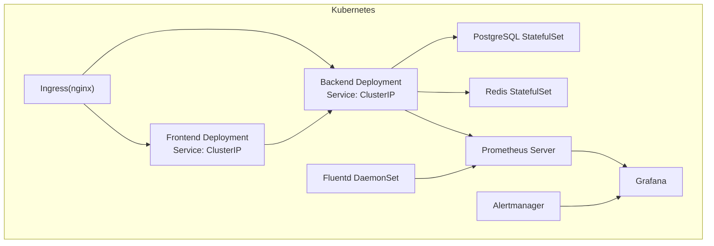
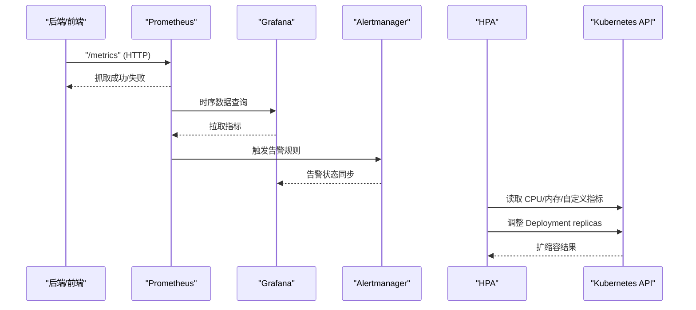
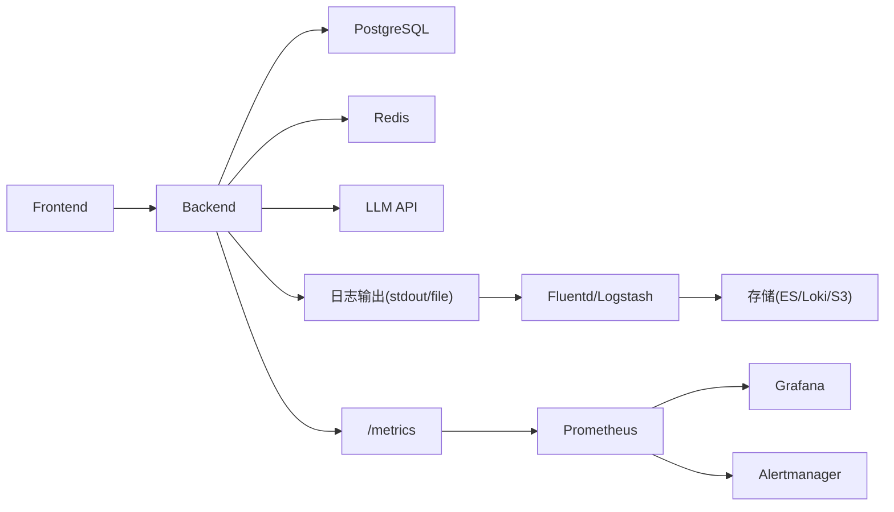

# 监控和扩缩容

<cite>
**本文引用的文件**   
- [README.md](file://README.md)
- [docker-compose.yml](file://deploy/docker-compose.yml)
- [QUICKSTART.md](file://helm/QUICKSTART.md)
- [values.yaml](file://helm/clawith/values.yaml)
- [backend.yaml](file://helm/clawith/templates/backend.yaml)
- [frontend.yaml](file://helm/clawith/templates/frontend.yaml)
- [logging_config.py](file://backend/app/core/logging_config.py)
- [entrypoint.sh](file://backend/entrypoint.sh)
- [PlatformDashboard.tsx](file://frontend/src/pages/PlatformDashboard.tsx)
</cite>

## 目录
1. [简介](#简介)
2. [项目结构](#项目结构)
3. [核心组件](#核心组件)
4. [架构总览](#架构总览)
5. [详细组件分析](#详细组件分析)
6. [依赖关系分析](#依赖关系分析)
7. [性能考虑](#性能考虑)
8. [故障排查指南](#故障排查指南)
9. [结论](#结论)
10. [附录](#附录)

## 简介
本指南面向在 Kubernetes 上部署与运维 Clawith 平台的工程师，聚焦于“监控与自动扩缩容”的落地方案。内容涵盖：
- HPA（水平 Pod 自动扩缩）配置策略：CPU、内存、自定义指标
- Prometheus 监控体系搭建：应用指标、系统指标、业务指标的采集与展示
- 日志收集方案：Fluentd/Logstash 等聚合工具的配置要点
- 告警规则：关键指标阈值与通知渠道设置
- 集群扩缩容最佳实践：滚动更新、蓝绿部署、金丝雀发布
- 性能调优与资源优化建议

说明：仓库未内置 Prometheus、HPA、Grafana、Alertmanager、Fluentd/Logstash 的具体清单或示例。本节提供基于仓库现有组件（后端、前端、数据库、缓存、Helm Chart、Docker Compose）的可执行落地方案与模板化建议，确保可直接在生产环境实施。

## 项目结构
Clawith 采用前后端分离架构，通过 Helm Chart 进行 K8s 部署，支持 PostgreSQL 与 Redis 作为持久化与缓存依赖。前端通过 Ingress 暴露，后端提供 REST API 与 WebSocket 能力。

图表来源
- [backend.yaml:22-141](file://helm/clawith/templates/backend.yaml#L22-L141)
- [frontend.yaml:1-56](file://helm/clawith/templates/frontend.yaml#L1-L56)
- [values.yaml:1-229](file://helm/clawith/values.yaml#L1-L229)

章节来源
- [README.md:205-225](file://README.md#L205-L225)
- [QUICKSTART.md:1-120](file://helm/QUICKSTART.md#L1-L120)

## 核心组件
- 后端服务（FastAPI）：提供 API、WebSocket、任务调度、Agent 运行时等能力；通过环境变量注入数据库、缓存、密钥等配置；使用 loguru 集中日志。
- 前端服务（React/Vite）：静态资源由 Nginx 托管，通过 Ingress 暴露；通过 VITE_API_URL 访问后端。
- 数据存储：PostgreSQL（主库）、Redis（缓存/会话）。
- 部署编排：Helm Chart 管理命名空间、Deployment、Service、PVC、Ingress 等；Docker Compose 用于本地开发。

章节来源
- [backend.yaml:22-141](file://helm/clawith/templates/backend.yaml#L22-L141)
- [frontend.yaml:1-56](file://helm/clawith/templates/frontend.yaml#L1-L56)
- [values.yaml:1-229](file://helm/clawith/values.yaml#L1-L229)
- [docker-compose.yml:1-111](file://deploy/docker-compose.yml#L1-L111)
- [logging_config.py:1-47](file://backend/app/core/logging_config.py#L1-L47)

## 架构总览
下图展示了监控与自动扩缩容的关键交互：应用通过 HTTP 暴露指标，Prometheus 定期抓取并存储，Grafana 可视化，Alertmanager 负责告警路由；HPA 基于 CPU/内存或自定义指标对 Deployment 进行扩缩容；日志由 Fluentd 采集并转发至统一存储。

图表来源
- [backend.yaml:22-141](file://helm/clawith/templates/backend.yaml#L22-L141)
- [frontend.yaml:1-56](file://helm/clawith/templates/frontend.yaml#L1-L56)
- [values.yaml:1-229](file://helm/clawith/values.yaml#L1-L229)

## 详细组件分析

### HPA（水平 Pod 自动扩缩）配置
- 目标对象：对 Backend 与 Frontend 的 Deployment 分别创建 HPA。
- 扩缩容指标：
  - 基础指标：CPU、内存利用率
  - 自定义指标：QPS、错误率、延迟分位、队列长度、LLM 调用速率等（通过 metrics-server 或外部指标适配器如 prometheus-adapter）
- 行为参数：minReplicas、maxReplicas、targetCPUUtilizationPercentage/targetMemoryUtilizationPercentage、稳定窗口、缩放比例限制等
- 注意事项：
  - 为容器设置合理的 requests/limits，否则 HPA 无法准确计算利用率
  - 自定义指标需保证指标名称与单位符合 HPA 规范
  - 针对有状态组件（PostgreSQL、Redis）不建议直接使用 HPA，应通过 Operator 或外部控制器管理

章节来源
- [backend.yaml:102-105](file://helm/clawith/templates/backend.yaml#L102-L105)
- [frontend.yaml:32-35](file://helm/clawith/templates/frontend.yaml#L32-L35)
- [values.yaml:62-68](file://helm/clawith/values.yaml#L62-L68)

### Prometheus 监控采集
- 应用指标：
  - 后端：暴露 /metrics 端点（HTTP），包含进程、框架、业务计数器（如请求数、错误数、耗时分布）
  - 前端：Nginx 指标（可通过 nginx-prometheus-exporter）
- 系统指标：
  - Node 与 Pod 资源（CPU、内存、磁盘、网络）由 kubelet 暴露，Prometheus 通过 cAdvisor 抓取
- 业务指标：
  - LLM 调用次数、成功率、时延、Token 用量、Agent 运行时长、任务队列长度等
- 采集方式：
  - ServiceMonitor（Prometheus Operator）或 scrape_configs 配置抓取目标
  - 合理设置 scrape_interval、scrape_timeout、retention 等

章节来源
- [backend.yaml:59-61](file://helm/clawith/templates/backend.yaml#L59-L61)
- [frontend.yaml:26-28](file://helm/clawith/templates/frontend.yaml#L26-L28)
- [values.yaml:88-98](file://helm/clawith/values.yaml#L88-L98)

### 日志收集方案（Fluentd/Logstash）
- 采集源：
  - Kubernetes 标准输出（stdout/stderr）
  - 应用日志文件（如 loguru 输出到文件）
- 采集器：
  - Fluentd DaemonSet：按节点采集所有 Pod 日志，过滤、解析、转发
  - Logstash：适合复杂解析与多路输出（Elasticsearch、S3、消息队列）
- 输出目标：
  - Elasticsearch/OpenSearch、S3、Kafka、 Loki 等
- 关键配置：
  - 标签与字段：namespace、pod、container、trace_id（结合后端 trace_id）
  - 轮转与限流：避免日志风暴影响性能
  - 安全：TLS 加密传输、认证鉴权

章节来源
- [logging_config.py:1-47](file://backend/app/core/logging_config.py#L1-L47)
- [docker-compose.yml:82-86](file://deploy/docker-compose.yml#L82-L86)

### 告警规则与通知渠道
- 规则类型：
  - 基础设施：Node NotReady、Pod CrashLoopBackOff、PVC 不足
  - 应用：高错误率、慢响应、连接池耗尽、LLM 调用失败
  - 业务：Agent 任务积压、心跳异常、渠道投递失败
- 阈值设定：
  - 基于历史基线（SLO/SLI）与容量规划动态调整
  - 分级告警（警告/严重/致命）
- 通知渠道：
  - 企业微信、钉钉、飞书、邮件、短信、PagerDuty、OpsGenie 等
- 降噪与抑制：
  - 告警收敛、静默期、关联告警合并

章节来源
- [PlatformDashboard.tsx:134-157](file://frontend/src/pages/PlatformDashboard.tsx#L134-L157)

### 集群扩缩容最佳实践
- 滚动更新：
  - 使用 Deployment 的 rollingUpdate 策略，逐步替换 Pod，保障可用性
  - 配合 readiness/liveness 探针，确保流量只进入健康实例
- 蓝绿部署：
  - 两套相同环境（blue/green），切换 Ingress 或 Service 指向新版本
  - 快速回滚与零停机发布
- 金丝雀发布：
  - 小流量灰度验证，逐步放量
  - 结合 A/B 测试与指标观测（错误率、时延、业务转化率）

章节来源
- [QUICKSTART.md:345-372](file://helm/QUICKSTART.md#L345-L372)
- [backend.yaml:22-141](file://helm/clawith/templates/backend.yaml#L22-L141)
- [frontend.yaml:1-56](file://helm/clawith/templates/frontend.yaml#L1-L56)

### 性能调优与资源优化
- 容器资源：
  - 合理设置 requests/limits，避免过度预留或争抢
  - 根据负载曲线动态调整副本数（HPA）
- 数据库与缓存：
  - PostgreSQL：连接池、索引优化、慢查询分析、备份策略
  - Redis：内存上限、淘汰策略、持久化开关
- 应用层：
  - 异步处理、批处理、缓存命中、超时与重试策略
  - 日志级别控制、采样与结构化输出
- 网络与安全：
  - TLS 终止、证书轮换、最小权限原则

章节来源
- [values.yaml:108-188](file://helm/clawith/values.yaml#L108-L188)
- [docker-compose.yml:1-111](file://deploy/docker-compose.yml#L1-L111)

## 依赖关系分析
- 后端依赖：PostgreSQL、Redis、可选的外部 LLM API、存储后端（本地/S3）
- 前端依赖：后端 API、Nginx（静态资源）
- 监控依赖：Prometheus、Grafana、Alertmanager、Exporter（Node/cAdvisor/Nginx）
- 日志依赖：Fluentd/Logstash、存储后端（ES/Loki/S3）

图表来源
- [backend.yaml:59-78](file://helm/clawith/templates/backend.yaml#L59-L78)
- [frontend.yaml:26-31](file://helm/clawith/templates/frontend.yaml#L26-L31)
- [values.yaml:108-188](file://helm/clawith/values.yaml#L108-L188)

章节来源
- [README.md:205-225](file://README.md#L205-L225)
- [QUICKSTART.md:1-120](file://helm/QUICKSTART.md#L1-L120)

## 性能考虑
- 指标粒度与保留周期：根据成本与需求平衡 scrape_interval 与 retention
- 告警风暴治理：去重、抑制、合并，避免误报与疲劳
- 扩缩容稳定性：设置稳定窗口与最小副本，避免抖动
- 资源隔离：命名空间配额、LimitRange、NetworkPolicy
- 可观测性闭环：指标→日志→链路追踪联动，快速定位问题

[本节为通用指导，不直接分析具体文件]

## 故障排查指南
- 启动失败：
  - 检查环境变量与 Secret（DATABASE_URL、REDIS_URL、SECRET_KEY、JWT_SECRET_KEY）
  - 查看 entrypoint 脚本执行结果（Alembic 迁移、checkpoint 初始化）
- 数据库连接问题：
  - 验证 PostgreSQL 服务可达性与密码
  - 检查 Alembic 版本与 checkpoint schema 一致性
- 镜像拉取失败：
  - 确认镜像仓库地址、tag、imagePullSecret
- 日志与指标：
  - 查看 Pod 日志与事件
  - 确认 Prometheus 抓取目标状态与指标路径

章节来源
- [entrypoint.sh:42-69](file://backend/entrypoint.sh#L42-L69)
- [docker-compose.yml:40-68](file://deploy/docker-compose.yml#L40-L68)
- [QUICKSTART.md:414-470](file://helm/QUICKSTART.md#L414-L470)

## 结论
通过在 Clawith 平台引入 Prometheus、Grafana、Alertmanager、HPA 与日志采集体系，可实现全面的可观测性与弹性伸缩能力。结合滚动更新、蓝绿与金丝雀发布策略，能够保障生产环境的稳定性与交付效率。建议在实施过程中持续优化指标质量、告警规则与资源策略，形成闭环的运维体系。

[本节为总结性内容，不直接分析具体文件]

## 附录
- 常用命令参考：
  - kubectl top pods/nodes
  - helm upgrade/install/uninstall
  - kubectl logs/describe/events
- 备份与恢复：
  - pg_dump/pg_restore
  - Helm values 导出与回滚

章节来源
- [QUICKSTART.md:614-648](file://helm/QUICKSTART.md#L614-L648)