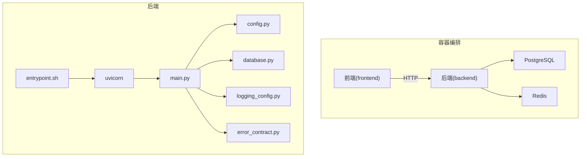
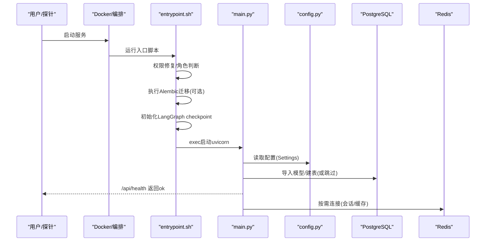
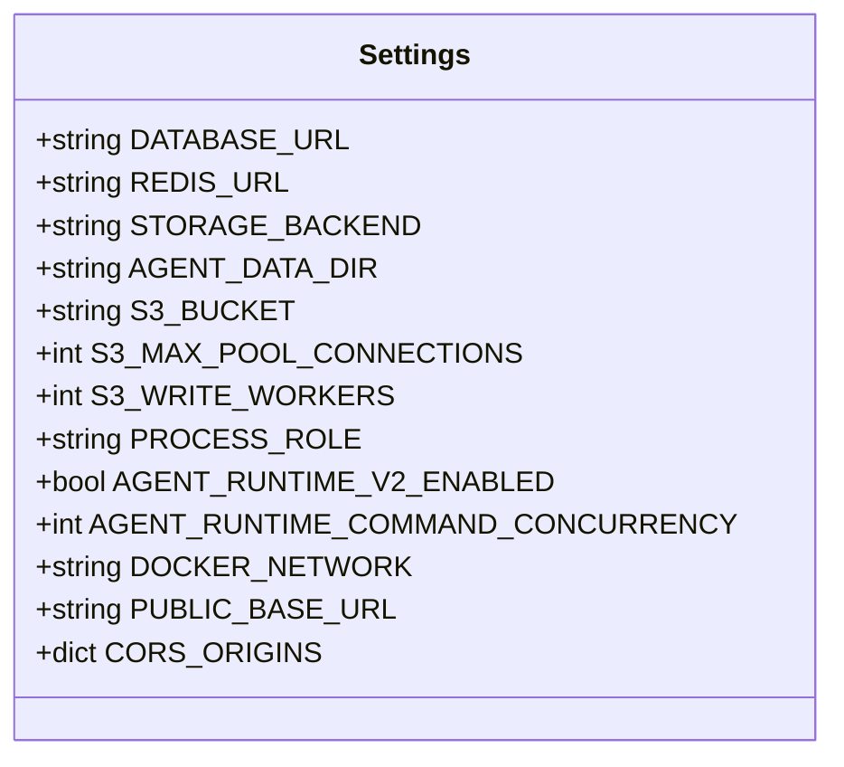
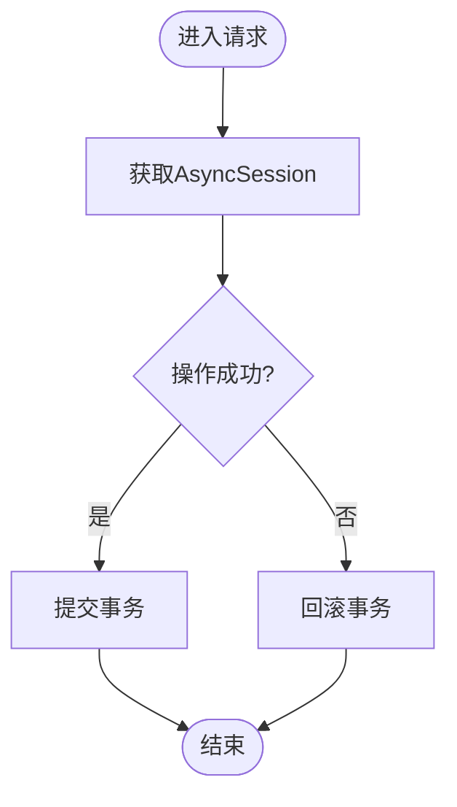
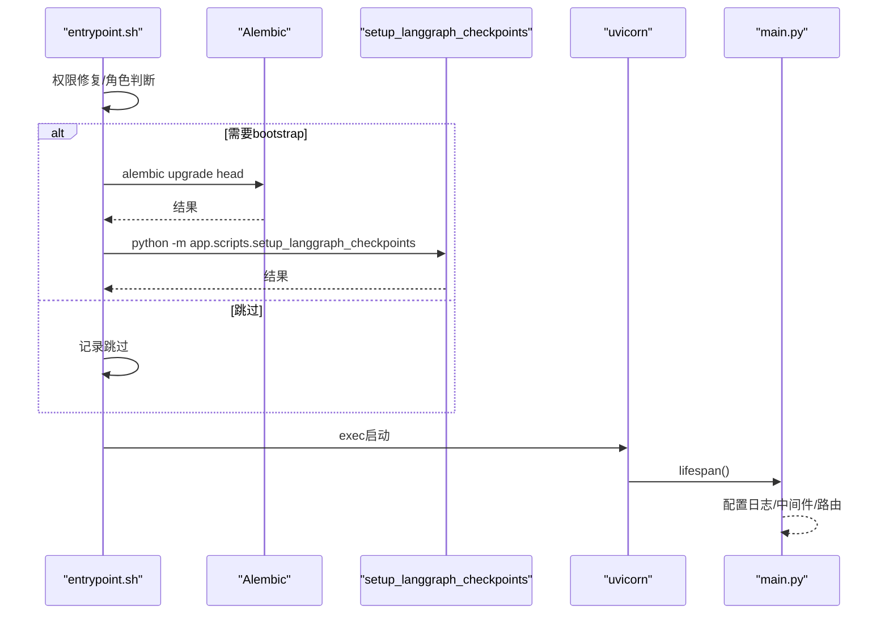
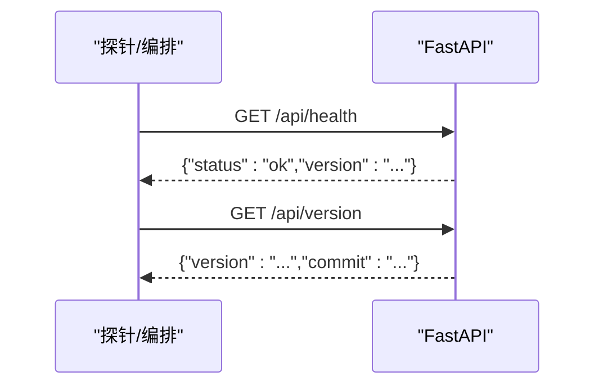
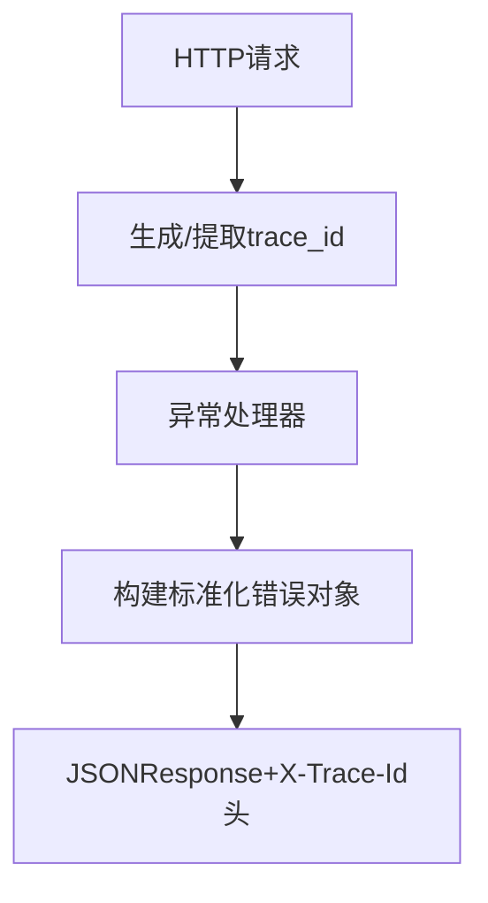
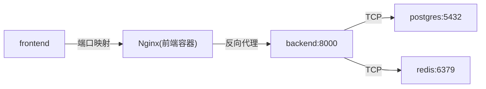

# 故障排查

<cite>
**本文引用的文件**   
- [backend/app/config.py](file://backend/app/config.py)
- [backend/app/database.py](file://backend/app/database.py)
- [docker-compose.yml](file://docker-compose.yml)
- [deploy/docker-compose.yml](file://deploy/docker-compose.yml)
- [backend/Dockerfile](file://backend/Dockerfile)
- [backend/entrypoint.sh](file://backend/entrypoint.sh)
- [backend/app/main.py](file://backend/app/main.py)
- [backend/app/core/logging_config.py](file://backend/app/core/logging_config.py)
- [backend/app/core/error_contract.py](file://backend/app/core/error_contract.py)
- [backend/app/schemas/schemas.py](file://backend/app/schemas/schemas.py)
</cite>

## 目录
1. [简介](#简介)
2. [项目结构](#项目结构)
3. [核心组件](#核心组件)
4. [架构总览](#架构总览)
5. [详细组件分析](#详细组件分析)
6. [依赖关系分析](#依赖关系分析)
7. [性能考虑](#性能考虑)
8. [故障排查指南](#故障排查指南)
9. [结论](#结论)
10. [附录](#附录)

## 简介
本手册面向Clawith平台的运维与SRE团队，聚焦常见部署问题的诊断与修复、容器化启动失败定位、性能瓶颈分析与调优、备份恢复与灾难恢复策略，以及监控告警与日志调试工具的使用。内容基于仓库中的配置、入口脚本、健康检查与错误处理实现进行系统化梳理，帮助快速定位并解决问题。

## 项目结构
- 后端服务：FastAPI应用，依赖PostgreSQL与Redis，通过Docker Compose编排，提供健康检查与健康探针。
- 数据库迁移：Alembic在启动时执行（可选），LangGraph checkpoint初始化由脚本完成。
- 存储：支持本地与S3后端，路径与凭据通过环境变量注入。
- 前端：Nginx反向代理到后端API，端口可配置。

**图示来源** 
- [docker-compose.yml:1-115](file://docker-compose.yml#L1-L115)
- [backend/Dockerfile:1-63](file://backend/Dockerfile#L1-L63)
- [backend/entrypoint.sh:1-95](file://backend/entrypoint.sh#L1-L95)
- [backend/app/main.py:121-200](file://backend/app/main.py#L121-L200)
- [backend/app/config.py:79-248](file://backend/app/config.py#L79-L248)
- [backend/app/database.py:1-79](file://backend/app/database.py#L1-L79)
- [backend/app/core/logging_config.py:1-129](file://backend/app/core/logging_config.py#L1-L129)
- [backend/app/core/error_contract.py:1-229](file://backend/app/core/error_contract.py#L1-L229)

**章节来源**
- [docker-compose.yml:1-115](file://docker-compose.yml#L1-L115)
- [deploy/docker-compose.yml:1-111](file://deploy/docker-compose.yml#L1-L111)
- [backend/Dockerfile:1-63](file://backend/Dockerfile#L1-L63)

## 核心组件
- 配置中心：Settings集中管理数据库、Redis、存储、沙箱、运行时等关键参数，支持从.env与环境变量加载。
- 数据库连接：异步引擎与会话工厂，提供事务上下文与自动回滚。
- 启动流程：entrypoint负责权限修复、迁移与checkpoint初始化，随后启动uvicorn。
- 健康检查：/api/health返回状态与版本信息，Docker HEALTHCHECK定期探测。
- 日志与错误：loguru统一日志，TraceId贯穿请求；标准化错误对象便于追踪。

**章节来源**
- [backend/app/config.py:79-248](file://backend/app/config.py#L79-L248)
- [backend/app/database.py:1-79](file://backend/app/database.py#L1-L79)
- [backend/entrypoint.sh:1-95](file://backend/entrypoint.sh#L1-L95)
- [backend/app/main.py:470-513](file://backend/app/main.py#L470-L513)
- [backend/app/core/logging_config.py:1-129](file://backend/app/core/logging_config.py#L1-L129)
- [backend/app/core/error_contract.py:1-229](file://backend/app/core/error_contract.py#L1-L229)

## 架构总览
后端以FastAPI为核心，启动时加载配置、初始化日志、注册错误处理器、导入模型并创建表（或依赖Alembic）。数据库与Redis为外部依赖，通过环境变量注入连接串。Docker Compose定义服务依赖与健康检查，确保启动顺序与可用性。

**图示来源** 
- [backend/entrypoint.sh:1-95](file://backend/entrypoint.sh#L1-L95)
- [backend/app/main.py:121-200](file://backend/app/main.py#L121-L200)
- [backend/app/config.py:79-248](file://backend/app/config.py#L79-L248)
- [docker-compose.yml:1-115](file://docker-compose.yml#L1-L115)

## 详细组件分析

### 配置与运行时参数
- 数据库连接：DATABASE_URL默认指向本地PostgreSQL，生产环境需替换为集群地址与凭据。
- Redis连接：REDIS_URL默认本地6379，需与编排网络一致。
- 存储后端：STORAGE_BACKEND支持local/S3，S3相关端点、桶名、密钥与并发参数可调。
- 进程角色：PROCESS_ROLE控制是否执行bootstrap（迁移与初始化）与业务逻辑。
- 沙箱与安全：SANDBOX_*控制代码执行隔离与超时，bwrap缺失会给出警告并可降级。

**图示来源** 
- [backend/app/config.py:79-248](file://backend/app/config.py#L79-L248)

**章节来源**
- [backend/app/config.py:79-248](file://backend/app/config.py#L79-L248)

### 数据库连接与事务
- 引擎与会话：使用asyncpg异步引擎，池大小与溢出限制已配置。
- 事务边界：提供transaction上下文管理器，异常自动回滚。
- 自动建表：可通过DATABASE_AUTO_CREATE_TABLES启用（不推荐生产使用）。

**图示来源** 
- [backend/app/database.py:30-79](file://backend/app/database.py#L30-L79)

**章节来源**
- [backend/app/database.py:1-79](file://backend/app/database.py#L1-L79)

### 启动与迁移流程
- entrypoint.sh：检测root并降权，按PROCESS_ROLE决定是否执行Alembic与checkpoint初始化，最后exec uvicorn。
- main.py lifespan：配置日志、拦截标准库日志、校验JWT默认值、导入模型、初始化调度器与通道管理器。
- 健康检查：/api/health返回状态与版本，Docker HEALTHCHECK调用该端点。

**图示来源** 
- [backend/entrypoint.sh:1-95](file://backend/entrypoint.sh#L1-L95)
- [backend/app/main.py:121-200](file://backend/app/main.py#L121-L200)

**章节来源**
- [backend/entrypoint.sh:1-95](file://backend/entrypoint.sh#L1-L95)
- [backend/app/main.py:121-200](file://backend/app/main.py#L121-L200)
- [backend/app/main.py:470-513](file://backend/app/main.py#L470-L513)

### 健康检查与版本接口
- /api/health：返回status与version，供编排系统探测。
- /api/version：返回应用版本与commit哈希，便于发布追踪。

**图示来源** 
- [backend/app/main.py:470-513](file://backend/app/main.py#L470-L513)

**章节来源**
- [backend/app/main.py:470-513](file://backend/app/main.py#L470-L513)

### 日志与错误追踪
- 日志：loguru统一输出，包含trace_id，屏蔽高频连接噪音。
- 错误：标准化错误对象，包含code、message、trace_id、retryable等字段，便于上游聚合与重试策略。

**图示来源** 
- [backend/app/core/logging_config.py:1-129](file://backend/app/core/logging_config.py#L1-L129)
- [backend/app/core/error_contract.py:1-229](file://backend/app/core/error_contract.py#L1-L229)

**章节来源**
- [backend/app/core/logging_config.py:1-129](file://backend/app/core/logging_config.py#L1-L129)
- [backend/app/core/error_contract.py:1-229](file://backend/app/core/error_contract.py#L1-L229)

## 依赖关系分析
- 服务依赖：backend依赖postgres与redis，compose中通过depends_on与healthcheck保证顺序。
- 镜像构建：Dockerfile多阶段构建，安装系统依赖与应用依赖，暴露8000端口。
- 网络与卷：默认网络clawith_network，数据持久化到pgdata与redisdata，agent_data挂载至/data/agents。

**图示来源** 
- [docker-compose.yml:1-115](file://docker-compose.yml#L1-L115)
- [deploy/docker-compose.yml:1-111](file://deploy/docker-compose.yml#L1-L111)
- [backend/Dockerfile:1-63](file://backend/Dockerfile#L1-L63)

**章节来源**
- [docker-compose.yml:1-115](file://docker-compose.yml#L1-L115)
- [deploy/docker-compose.yml:1-111](file://deploy/docker-compose.yml#L1-L111)
- [backend/Dockerfile:1-63](file://backend/Dockerfile#L1-L63)

## 性能考虑
- 数据库连接池：pool_size与max_overflow已设置，可根据QPS与连接上限调整。
- 存储写入并发：S3_WRITE_WORKERS与S3_MAX_POOL_CONNECTIONS影响高并发上传吞吐。
- 运行时并发：AGENT_RUNTIME_COMMAND_CONCURRENCY控制命令执行并发度，避免资源争用。
- 日志开销：enqueue=True异步落盘，减少主线程阻塞；建议在生产环境降低websockets访问日志级别。

[本节为通用指导，无需特定文件引用]

## 故障排查指南

### 数据库连接失败
- 症状：启动时报错无法连接PostgreSQL，或健康检查失败。
- 排查步骤：
  - 检查DATABASE_URL是否正确，用户名、密码、主机名与端口是否与compose一致。
  - 确认postgres服务健康检查通过（pg_isready）。
  - 若启用自动建表，检查DATABASE_AUTO_CREATE_TABLES与权限。
  - 查看日志中是否有连接池耗尽或认证失败提示。
- 修复建议：
  - 修正连接串与网络可达性，确保backend能解析postgres主机名。
  - 调整连接池参数与超时，必要时扩容数据库实例。

**章节来源**
- [backend/app/config.py:89-91](file://backend/app/config.py#L89-L91)
- [backend/app/database.py:14-21](file://backend/app/database.py#L14-L21)
- [docker-compose.yml:1-30](file://docker-compose.yml#L1-L30)

### Redis连接异常
- 症状：缓存/会话读写失败，部分功能不可用。
- 排查步骤：
  - 检查REDIS_URL与redis服务健康检查（redis-cli ping）。
  - 确认网络连通与防火墙规则。
  - 查看日志中是否有连接超时或认证错误。
- 修复建议：
  - 修正REDIS_URL，确保端口与网络正确。
  - 增加重试与超时配置，必要时扩容Redis实例。

**章节来源**
- [backend/app/config.py:93-95](file://backend/app/config.py#L93-L95)
- [docker-compose.yml:19-30](file://docker-compose.yml#L19-L30)

### 存储服务不可用
- 症状：文件上传/下载失败，Agent数据读写异常。
- 排查步骤：
  - 检查STORAGE_BACKEND与STORAGE_LOCAL_ROOT或S3相关配置。
  - 本地模式：确认/data/agents目录存在且权限为clawith:clawith。
  - S3模式：检查S3_BUCKET、S3_ENDPOINT_URL、S3_ACCESS_KEY_ID、S3_SECRET_ACCESS_KEY。
- 修复建议：
  - 修正存储路径与权限，或完善S3凭据与端点。
  - 调整S3_WRITE_WORKERS与S3_MAX_POOL_CONNECTIONS提升吞吐。

**章节来源**
- [backend/app/config.py:105-119](file://backend/app/config.py#L105-L119)
- [backend/entrypoint.sh:17-33](file://backend/entrypoint.sh#L17-L33)
- [docker-compose.yml:69-78](file://docker-compose.yml#L69-L78)

### 应用启动失败
- 症状：容器启动后立即退出或健康检查失败。
- 排查步骤：
  - 查看entrypoint.sh输出，确认Alembic与checkpoint初始化是否成功。
  - 检查PROCESS_ROLE是否为all或包含bootstrap。
  - 查看日志中是否有默认密钥警告或bwrap缺失警告。
- 修复建议：
  - 修正环境变量与权限，确保迁移脚本可执行。
  - 安装bubblewrap或设置SANDBOX_ALLOW_UNSAFE_FALLBACK_WHEN_BWRAP_MISSING=true。

**章节来源**
- [backend/entrypoint.sh:42-91](file://backend/entrypoint.sh#L42-L91)
- [backend/app/main.py:37-70](file://backend/app/main.py#L37-L70)

### 端口冲突
- 症状：前端或后端端口被占用，服务无法绑定。
- 排查步骤：
  - 检查FRONTEND_PORT与后端默认8000端口占用情况。
  - 确认nginx模板与VITE_API_URL配置正确。
- 修复建议：
  - 修改端口映射或释放占用端口，更新compose与前端环境变量。

**章节来源**
- [docker-compose.yml:91-105](file://docker-compose.yml#L91-L105)
- [deploy/docker-compose.yml:87-101](file://deploy/docker-compose.yml#L87-L101)

### 权限问题
- 症状：写入/data/agents失败，容器内权限不足。
- 排查步骤：
  - 检查entrypoint.sh的chown逻辑与宿主目录所有者。
  - 确认容器以root启动后降权至clawith用户。
- 修复建议：
  - 确保挂载目录所有者为clawith:clawith，或允许entrypoint自动修复。

**章节来源**
- [backend/entrypoint.sh:17-33](file://backend/entrypoint.sh#L17-L33)
- [backend/Dockerfile:47-54](file://backend/Dockerfile#L47-L54)

### 性能瓶颈分析方法
- CPU使用率优化：
  - 调整AGENT_RUNTIME_COMMAND_CONCURRENCY与S3_WRITE_WORKERS。
  - 检查数据库慢查询与索引缺失。
- 内存泄漏检测：
  - 使用Python内存分析工具（如memory_profiler）定位未释放对象。
  - 观察长生命周期会话与缓存增长趋势。
- I/O瓶颈：
  - 监控磁盘I/O与网络带宽，必要时升级存储或启用CDN。

[本节为通用指导，无需特定文件引用]

### 备份恢复策略
- 数据库备份：
  - 使用pg_dump定时备份clawith库，保留历史版本。
  - 恢复前校验备份完整性，按顺序执行迁移。
- 文件存储备份：
  - 本地模式：同步/data/agents目录至远程存储。
  - S3模式：启用版本控制与跨区域复制。
- 一致性保障：
  - 停止写入或进入只读模式后再备份，确保一致性。

[本节为通用指导，无需特定文件引用]

### 数据迁移方案
- Alembic迁移：
  - 在bootstrap角色下执行alembic upgrade head，确保幂等。
  - 失败时根据错误日志回滚或修复脚本。
- LangGraph checkpoint：
  - 执行setup_langgraph_checkpoints初始化表结构。
  - 验证checkpoint_migrations表版本与预期一致。

**章节来源**
- [backend/entrypoint.sh:42-91](file://backend/entrypoint.sh#L42-L91)

### 灾难恢复预案
- 多可用区部署：
  - PostgreSQL主从或托管服务，跨AZ副本。
  - Redis哨兵或云托管Redis，自动故障转移。
- 快速恢复：
  - 预置最小化镜像与配置，优先恢复数据库与缓存。
  - 逐步恢复代理服务与前端。

[本节为通用指导，无需特定文件引用]

### 监控告警配置
- 健康检查：
  - Docker HEALTHCHECK定期调用/api/health。
  - 编排层对失败服务自动重启或告警。
- 指标采集：
  - 暴露Prometheus指标端点（如需扩展）。
  - 收集CPU、内存、I/O与队列长度。
- 告警规则：
  - 服务不可用、错误率飙升、延迟超过阈值触发告警。

**章节来源**
- [backend/Dockerfile:56-58](file://backend/Dockerfile#L56-L58)
- [backend/app/main.py:470-513](file://backend/app/main.py#L470-L513)

### 日志分析工具
- 统一日志：
  - loguru输出结构化日志，包含trace_id。
  - 过滤websockets与uvicorn访问日志噪音。
- 追踪链路：
  - 通过X-Trace-Id头关联请求全链路日志。
  - 结合ELK或云日志平台进行检索与分析。

**章节来源**
- [backend/app/core/logging_config.py:1-129](file://backend/app/core/logging_config.py#L1-L129)
- [backend/app/core/error_contract.py:16-17](file://backend/app/core/error_contract.py#L16-L17)

### 调试技巧
- 本地调试：
  - 设置DEBUG=true开启SQLAlchemy echo与详细日志。
  - 使用VS Code或PyCharm断点调试FastAPI路由。
- 容器调试：
  - 进入容器执行bash，检查环境变量与文件权限。
  - 临时关闭健康检查以便长时间调试。

[本节为通用指导，无需特定文件引用]

## 结论
通过系统化梳理配置、启动流程、健康检查与错误处理机制，结合日志与追踪能力，可高效定位并解决数据库、Redis、存储与容器化部署常见问题。配合性能调优、备份恢复与监控告警策略，能够保障Clawith平台在高可用与高性能环境下稳定运行。

## 附录
- 常用命令：
  - docker compose logs backend --tail=200
  - docker exec -it <container> bash
  - pg_isready -U clawith -h postgres
- 参考文件：
  - 配置与Schema：[backend/app/config.py](file://backend/app/config.py), [backend/app/schemas/schemas.py](file://backend/app/schemas/schemas.py)
  - 启动与入口：[backend/entrypoint.sh](file://backend/entrypoint.sh), [backend/app/main.py](file://backend/app/main.py)
  - 数据库与日志：[backend/app/database.py](file://backend/app/database.py), [backend/app/core/logging_config.py](file://backend/app/core/logging_config.py)
  - 错误处理：[backend/app/core/error_contract.py](file://backend/app/core/error_contract.py)
  - 编排与镜像：[docker-compose.yml](file://docker-compose.yml), [backend/Dockerfile](file://backend/Dockerfile)