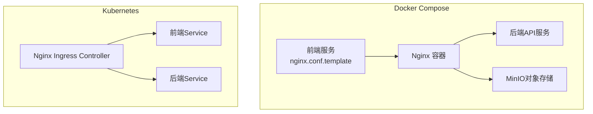
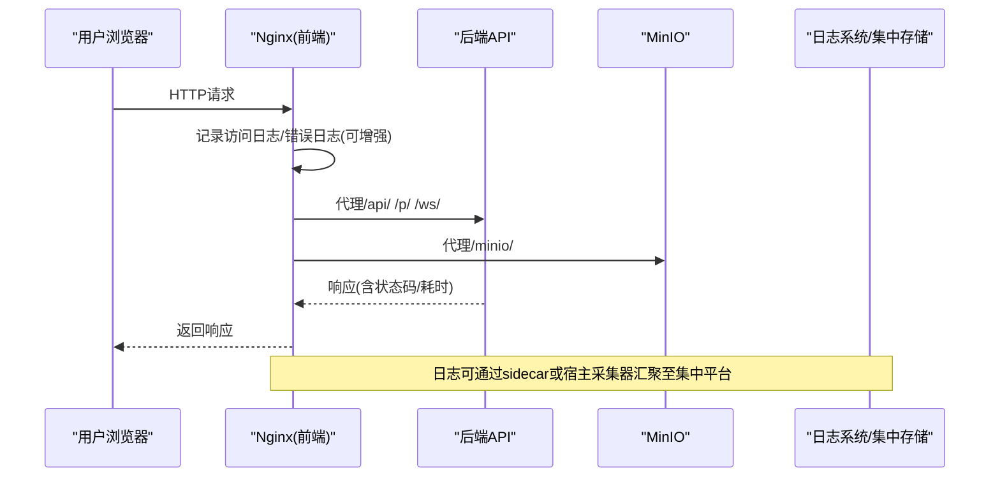
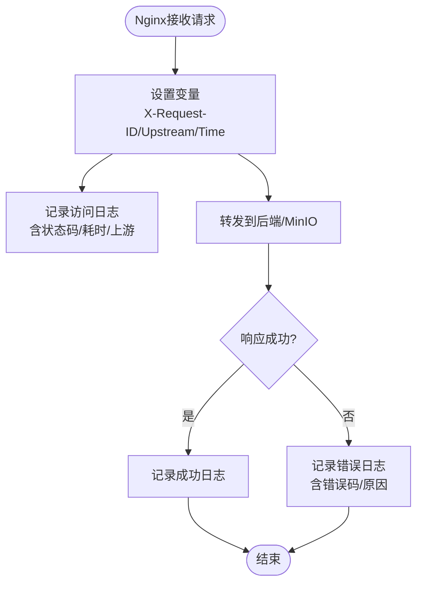
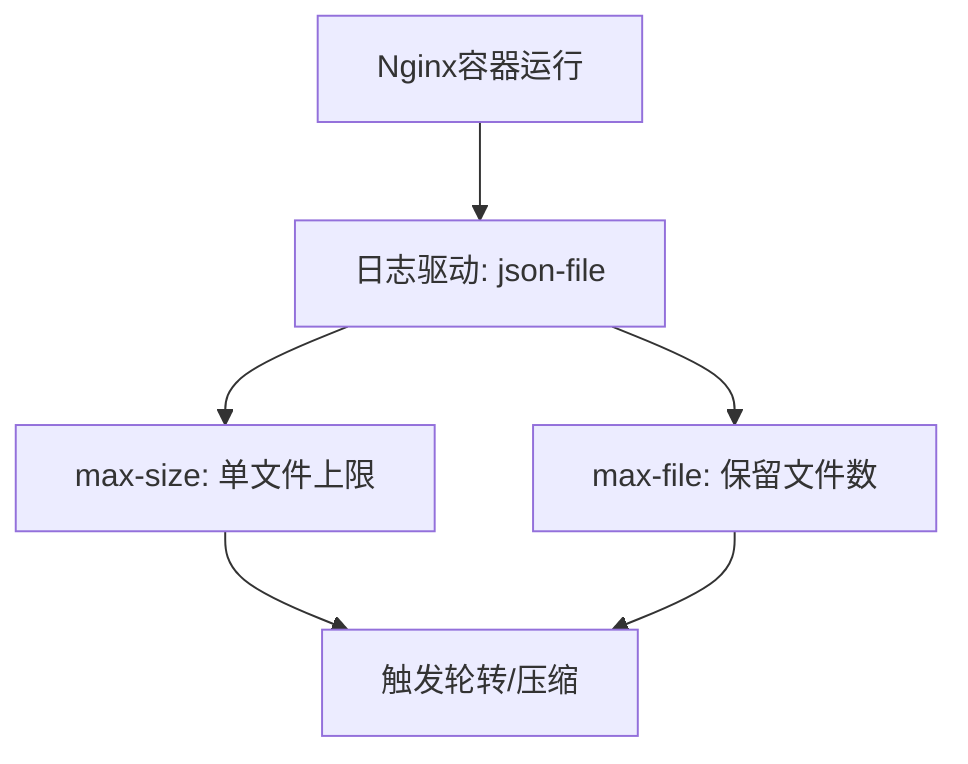
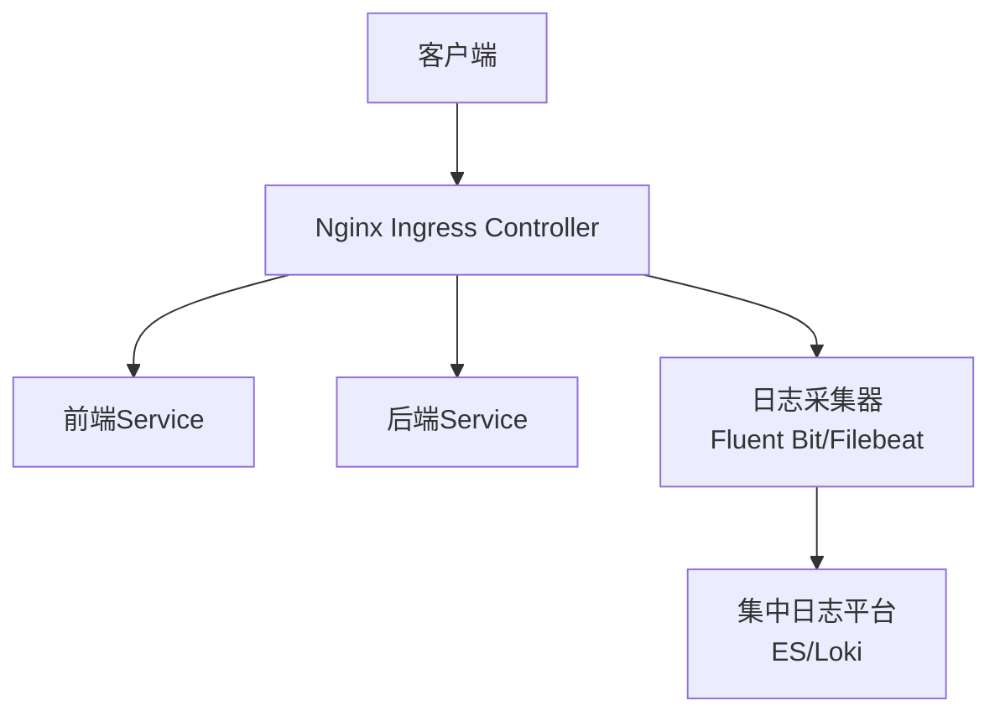
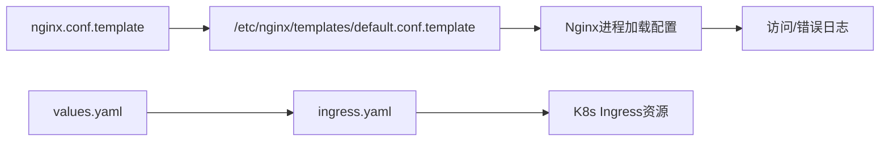

# Nginx日志管理

<cite>
**本文引用的文件**   
- [deploy/nginx/nginx.conf](file://deploy/nginx/nginx.conf)
- [frontend/nginx.conf.template](file://frontend/nginx.conf.template)
- [deploy/docker-compose.yml](file://deploy/docker-compose.yml)
- [deploy/docker-compose-multi.yml](file://deploy/docker-compose-multi.yml)
- [helm/clawith/templates/ingress.yaml](file://helm/clawith/templates/ingress.yaml)
- [helm/clawith/values.yaml](file://helm/clawith/values.yaml)
</cite>

## 目录
1. [简介](#简介)
2. [项目结构](#项目结构)
3. [核心组件](#核心组件)
4. [架构总览](#架构总览)
5. [详细组件分析](#详细组件分析)
6. [依赖关系分析](#依赖关系分析)
7. [性能与容量规划](#性能与容量规划)
8. [故障排查指南](#故障排查指南)
9. [结论](#结论)
10. [附录](#附录)

## 简介
本指南面向在生产环境中使用Nginx作为前端反向代理的Clawith部署，聚焦于访问日志与错误日志的管理与优化。内容涵盖：
- 日志格式定制、请求跟踪ID注入、响应时间统计等高级配置思路
- 日志轮转策略、磁盘空间管理与压缩归档等运维实践
- 日志分析工具推荐、异常请求检测、性能瓶颈识别方法
- 负载均衡场景下的日志收集、多实例聚合与集中式存储方案

说明：当前仓库中的Nginx配置未显式定义access_log与error_log路径及log_format，因此本节提供“可直接落地的增强方案”，并给出在现有模板基础上如何扩展的最小改动点与注意事项。

## 项目结构
与Nginx日志相关的关键位置：
- 单节点Docker Compose：前端容器挂载Nginx模板到/etc/nginx/templates/default.conf.template
- 多副本Docker Compose：同样通过模板渲染Nginx配置
- Kubernetes Helm Chart：Ingress由集群内Nginx Ingress Controller生成，非本仓库内置Nginx镜像

**图表来源** 
- [deploy/docker-compose.yml:87-101](file://deploy/docker-compose.yml#L87-L101)
- [deploy/docker-compose-multi.yml:172-186](file://deploy/docker-compose-multi.yml#L172-L186)
- [helm/clawith/templates/ingress.yaml:1-37](file://helm/clawith/templates/ingress.yaml#L1-L37)

**章节来源**
- [deploy/docker-compose.yml:87-101](file://deploy/docker-compose.yml#L87-L101)
- [deploy/docker-compose-multi.yml:172-186](file://deploy/docker-compose-multi.yml#L172-L186)
- [helm/clawith/templates/ingress.yaml:1-37](file://helm/clawith/templates/ingress.yaml#L1-L37)

## 核心组件
- Nginx主配置（单节点）：deploy/nginx/nginx.conf
- Nginx模板（用于Compose构建）：frontend/nginx.conf.template
- Docker Compose服务编排与日志驱动：deploy/docker-compose.yml、deploy/docker-compose-multi.yml
- K8s Ingress模板与值配置：helm/clawith/templates/ingress.yaml、helm/clawith/values.yaml

这些文件共同决定了请求如何被代理、哪些头部被透传、以及容器运行时日志如何输出。

**章节来源**
- [deploy/nginx/nginx.conf:1-82](file://deploy/nginx/nginx.conf#L1-L82)
- [frontend/nginx.conf.template:1-82](file://frontend/nginx.conf.template#L1-L82)
- [deploy/docker-compose.yml:82-86](file://deploy/docker-compose.yml#L82-L86)
- [deploy/docker-compose-multi.yml:105-110](file://deploy/docker-compose-multi.yml#L105-L110)
- [helm/clawith/templates/ingress.yaml:1-37](file://helm/clawith/templates/ingress.yaml#L1-L37)
- [helm/clawith/values.yaml:88-98](file://helm/clawith/values.yaml#L88-L98)

## 架构总览
下图展示从浏览器到Nginx再到后端/MinIO的请求链路，以及日志落盘与聚合的可能路径。

**图表来源** 
- [deploy/nginx/nginx.conf:26-80](file://deploy/nginx/nginx.conf#L26-L80)
- [frontend/nginx.conf.template:26-80](file://frontend/nginx.conf.template#L26-L80)

## 详细组件分析

### Nginx访问与错误日志增强方案
现状：当前模板未显式声明access_log与error_log，也未定义自定义log_format。建议按以下要点增强：
- 启用访问日志与错误日志
- 定义结构化日志格式（包含客户端IP、请求ID、URI、状态码、上游地址、响应体大小、耗时等）
- 注入请求跟踪ID（如X-Request-ID），贯穿Nginx与后端
- 记录上游响应时间与连接信息，便于定位慢请求

关键实现要点（以模板为基准进行最小化增强）：
- 在http块中定义log_format，并在server块中启用access_log与error_log
- 在location中设置proxy_set_header传递X-Request-ID；若后端未生成，可在Nginx层生成并写入响应头
- 使用$upstream_response_time、$request_time等变量统计耗时
- 将日志输出到容器标准输出或持久卷，便于后续采集

**图表来源** 
- [frontend/nginx.conf.template:1-82](file://frontend/nginx.conf.template#L1-L82)
- [deploy/nginx/nginx.conf:1-82](file://deploy/nginx/nginx.conf#L1-L82)

**章节来源**
- [frontend/nginx.conf.template:1-82](file://frontend/nginx.conf.template#L1-L82)
- [deploy/nginx/nginx.conf:1-82](file://deploy/nginx/nginx.conf#L1-L82)

### 请求跟踪ID注入与跨端追踪
- 在Nginx层生成唯一请求ID（例如基于UUID或NanoID），放入请求头X-Request-ID
- 透传到后端，确保后端日志也携带该ID
- 在响应头回写X-Request-ID，便于前端与链路追踪系统关联

建议在模板的location段增加相应header设置，并在日志格式中包含该字段。

**章节来源**
- [frontend/nginx.conf.template:27-35](file://frontend/nginx.conf.template#L27-L35)
- [deploy/nginx/nginx.conf:27-35](file://deploy/nginx/nginx.conf#L27-L35)

### 响应时间统计与慢请求定位
- 使用$request_time记录端到端耗时
- 使用$upstream_response_time记录后端处理耗时
- 在日志格式中输出上述字段，结合阈值告警快速定位慢接口

**章节来源**
- [frontend/nginx.conf.template:27-35](file://frontend/nginx.conf.template#L27-L35)
- [deploy/nginx/nginx.conf:27-35](file://deploy/nginx/nginx.conf#L27-L35)

### WebSocket与长连接日志
- /ws/路径开启HTTP/1.1与Upgrade，保持长连接
- 长连接场景下，建议关注连接建立与断开事件、心跳超时等指标
- 在日志中记录首次握手状态码与延迟，辅助定位WebSocket问题

**章节来源**
- [frontend/nginx.conf.template:69-80](file://frontend/nginx.conf.template#L69-L80)
- [deploy/nginx/nginx.conf:69-80](file://deploy/nginx/nginx.conf#L69-L80)

### MinIO大文件上传下载日志
- /minio/路径关闭缓冲，允许大文件传输
- 关注大请求的带宽占用、超时与失败率
- 在日志中记录请求体大小与响应体大小，评估吞吐

**章节来源**
- [frontend/nginx.conf.template:55-67](file://frontend/nginx.conf.template#L55-L67)
- [deploy/nginx/nginx.conf:55-67](file://deploy/nginx/nginx.conf#L55-L67)

### Docker Compose日志驱动与轮转
- 后端服务默认使用json-file驱动，限制单文件大小与保留数量
- 建议对Nginx容器也启用相同策略，避免日志占满磁盘

**图表来源** 
- [deploy/docker-compose.yml:82-86](file://deploy/docker-compose.yml#L82-L86)
- [deploy/docker-compose-multi.yml:105-110](file://deploy/docker-compose-multi.yml#L105-L110)

**章节来源**
- [deploy/docker-compose.yml:82-86](file://deploy/docker-compose.yml#L82-L86)
- [deploy/docker-compose-multi.yml:105-110](file://deploy/docker-compose-multi.yml#L105-L110)

### Kubernetes Ingress与集中式日志
- Helm Chart通过Ingress暴露前端，实际Nginx由集群Ingress Controller提供
- 日志通常由Ingress Controller输出到stdout/stderr，再由DaemonSet/Fluent Bit等采集到集中平台（如Elasticsearch/Loki）
- 建议在values.yaml中配置Ingress注解，启用访问日志与结构化输出

**图表来源** 
- [helm/clawith/templates/ingress.yaml:1-37](file://helm/clawith/templates/ingress.yaml#L1-L37)
- [helm/clawith/values.yaml:88-98](file://helm/clawith/values.yaml#L88-L98)

**章节来源**
- [helm/clawith/templates/ingress.yaml:1-37](file://helm/clawith/templates/ingress.yaml#L1-L37)
- [helm/clawith/values.yaml:88-98](file://helm/clawith/values.yaml#L88-L98)

## 依赖关系分析
- Nginx模板与Compose挂载关系：前端容器将模板映射为Nginx配置
- Ingress与Helm值的关系：Ingress资源由模板渲染，受values控制
- 日志驱动与容器运行时：docker-compose logging选项决定日志轮转策略

**图表来源** 
- [deploy/docker-compose.yml:96-98](file://deploy/docker-compose.yml#L96-L98)
- [helm/clawith/templates/ingress.yaml:1-37](file://helm/clawith/templates/ingress.yaml#L1-L37)
- [helm/clawith/values.yaml:88-98](file://helm/clawith/values.yaml#L88-L98)

**章节来源**
- [deploy/docker-compose.yml:96-98](file://deploy/docker-compose.yml#L96-L98)
- [helm/clawith/templates/ingress.yaml:1-37](file://helm/clawith/templates/ingress.yaml#L1-L37)
- [helm/clawith/values.yaml:88-98](file://helm/clawith/values.yaml#L88-L98)

## 性能与容量规划
- 日志量估算：根据QPS、平均请求体/响应体大小、日志字段数量估算每日日志体积
- 磁盘规划：按max-size与max-file计算单节点日志占用，预留扩容空间
- 压缩归档：结合宿主机cron或sidecar对历史日志进行gzip压缩
- 采样与分级：对DEBUG级别日志进行采样，生产环境仅保留INFO及以上
- 热点过滤：对健康检查、静态资源等高频低价值请求进行过滤或降采样

[本节为通用指导，不直接分析具体文件]

## 故障排查指南
- 无法访问日志：确认Nginx是否启用了access_log与error_log，路径是否存在且可写
- 日志无请求ID：检查是否设置了X-Request-ID透传与生成逻辑
- 慢请求定位：查看$request_time与$upstream_response_time，对比前后端耗时差异
- WebSocket异常：检查Upgrade与Connection头是否正确，关注超时与重连
- 磁盘爆满：调整max-size与max-file，或接入外部日志采集与轮转

**章节来源**
- [frontend/nginx.conf.template:1-82](file://frontend/nginx.conf.template#L1-L82)
- [deploy/nginx/nginx.conf:1-82](file://deploy/nginx/nginx.conf#L1-L82)
- [deploy/docker-compose.yml:82-86](file://deploy/docker-compose.yml#L82-L86)
- [deploy/docker-compose-multi.yml:105-110](file://deploy/docker-compose-multi.yml#L105-L110)

## 结论
通过对Nginx模板与Compose/K8s配置的增强，可以实现结构化、可追踪、可统计的访问与错误日志体系。结合合理的轮转策略与集中式采集，能够在高并发与多实例环境下保障日志的可观测性与可维护性。

[本节为总结，不直接分析具体文件]

## 附录
- 日志分析工具推荐：ELK/EFK、Loki+Grafana、Splunk、Datadog、OpenSearch
- 分析方法：
  - 异常请求检测：按状态码分布、错误率、超时率、上游错误率监控
  - 性能瓶颈识别：对比$request_time与$upstream_response_time，定位Nginx或后端瓶颈
  - 安全审计：关注4xx/5xx突增、异常UA、恶意扫描特征
- 集中式存储方案：
  - Docker Compose：通过sidecar或宿主采集器将Nginx日志输出到集中平台
  - Kubernetes：利用DaemonSet采集Ingress Controller日志，统一入仓

[本节为通用指导，不直接分析具体文件]