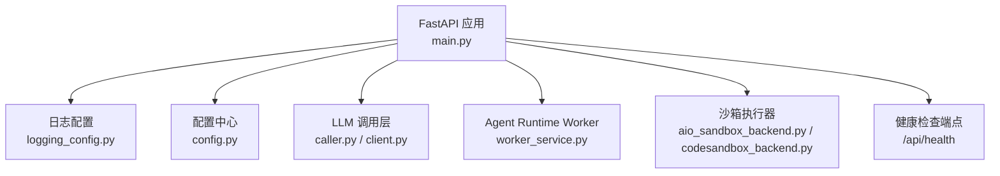
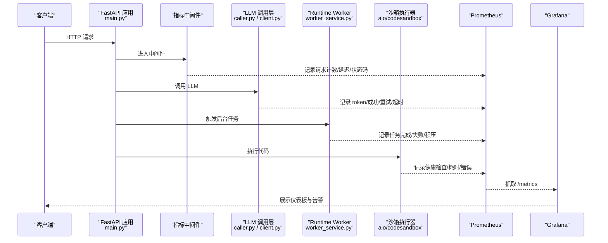
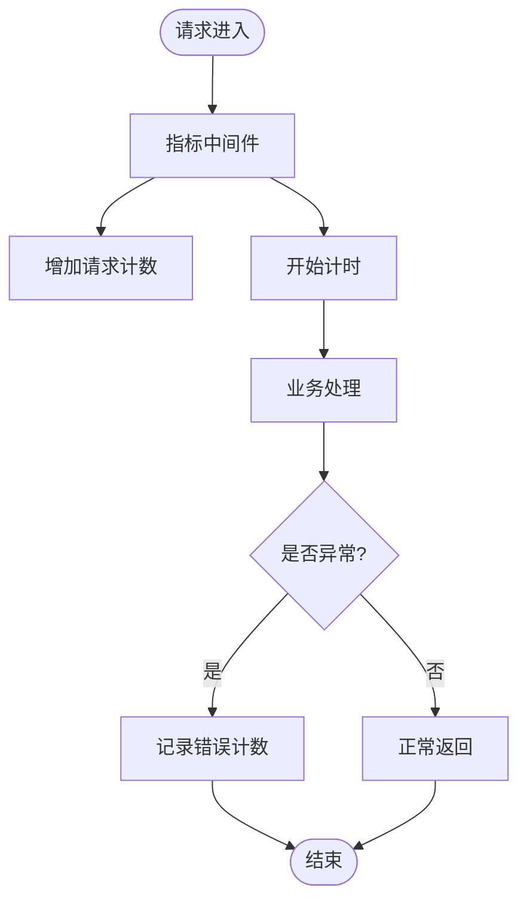
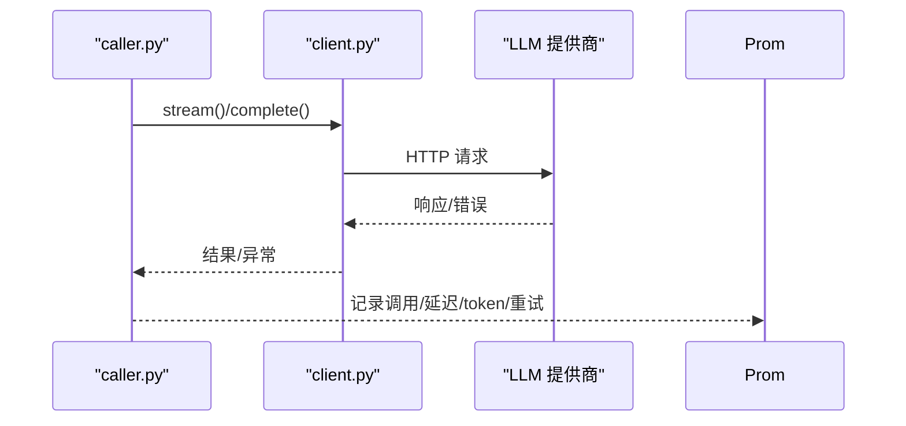
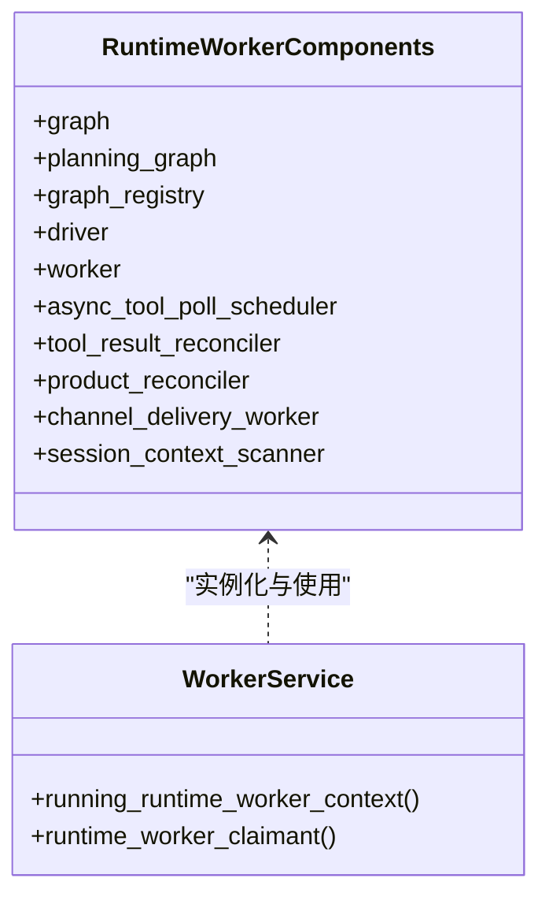
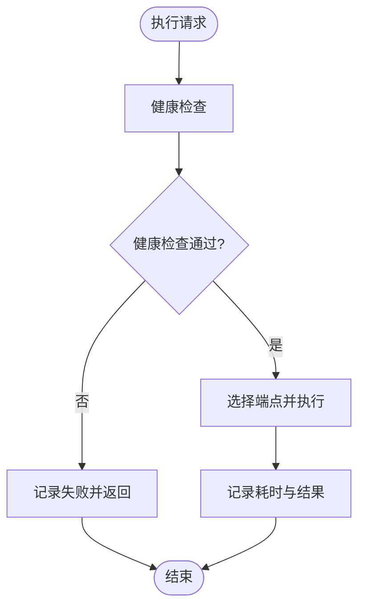
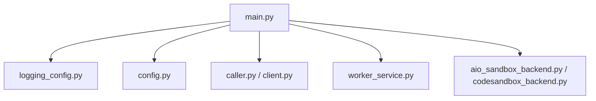

# Prometheus监控

<cite>
**本文引用的文件**   
- [backend/app/main.py](file://backend/app/main.py)
- [backend/app/core/logging_config.py](file://backend/app/core/logging_config.py)
- [backend/app/config.py](file://backend/app/config.py)
- [backend/app/api/admin.py](file://backend/app/api/admin.py)
- [backend/app/services/llm/caller.py](file://backend/app/services/llm/caller.py)
- [backend/app/services/llm/client.py](file://backend/app/services/llm/client.py)
- [backend/app/services/agent_runtime/worker_service.py](file://backend/app/services/agent_runtime/worker_service.py)
- [backend/app/services/sandbox/remote/aio_sandbox_backend.py](file://backend/app/services/sandbox/remote/aio_sandbox_backend.py)
- [backend/app/services/sandbox/api/codesandbox_backend.py](file://backend/app/services/sandbox/api/codesandbox_backend.py)
</cite>

## 目录
1. [简介](#简介)
2. [项目结构](#项目结构)
3. [核心组件](#核心组件)
4. [架构总览](#架构总览)
5. [详细组件分析](#详细组件分析)
6. [依赖关系分析](#依赖关系分析)
7. [性能考量](#性能考量)
8. [故障排查指南](#故障排查指南)
9. [结论](#结论)
10. [附录](#附录)

## 简介
本指南面向在 Clawith 后端集成 Prometheus 监控指标收集与暴露的工程师，提供从指标定义、采集点埋点到 Grafana 仪表板与告警规则落地的完整实践。结合代码现状，本项目尚未内置 prometheus-client 或 /metrics 端点，但已具备完善的日志、健康检查、运行时配置与外部服务调用链路，非常适合以最小改动接入 Prometheus。

## 项目结构
- 应用入口与生命周期管理：FastAPI 启动、中间件注册、路由挂载、健康检查端点。
- 日志系统：基于 loguru 的统一日志与 trace_id 上下文。
- 配置中心：运行时参数（如并发度、轮询间隔等）集中管理。
- LLM 调用层：HTTP 流式调用、错误分类、重试策略。
- Agent Runtime Worker：后台任务调度、持久化、异步工具轮询。
- 沙箱执行器：远程执行服务的健康检查与调用耗时统计。

**图示来源** 
- [backend/app/main.py:352-476](file://backend/app/main.py#L352-L476)
- [backend/app/core/logging_config.py:61-79](file://backend/app/core/logging_config.py#L61-L79)
- [backend/app/config.py:124-145](file://backend/app/config.py#L124-L145)
- [backend/app/services/llm/caller.py:663-689](file://backend/app/services/llm/caller.py#L663-L689)
- [backend/app/services/llm/client.py:898-934](file://backend/app/services/llm/client.py#L898-L934)
- [backend/app/services/agent_runtime/worker_service.py:101-141](file://backend/app/services/agent_runtime/worker_service.py#L101-L141)
- [backend/app/services/sandbox/remote/aio_sandbox_backend.py:48-78](file://backend/app/services/sandbox/remote/aio_sandbox_backend.py#L48-L78)
- [backend/app/services/sandbox/api/codesandbox_backend.py:47-81](file://backend/app/services/sandbox/api/codesandbox_backend.py#L47-L81)

**章节来源**
- [backend/app/main.py:352-476](file://backend/app/main.py#L352-L476)
- [backend/app/core/logging_config.py:61-79](file://backend/app/core/logging_config.py#L61-L79)
- [backend/app/config.py:124-145](file://backend/app/config.py#L124-L145)

## 核心组件
- 指标采集与暴露
  - 引入 prometheus-client，创建计数器、直方图、计时器、标签集合。
  - 新增 /metrics 端点，供 Prometheus 抓取。
  - 通过中间件或装饰器自动记录 HTTP 请求指标。
- 关键业务指标
  - HTTP 请求：请求量、延迟分布、错误率、状态码分布。
  - 数据库查询：慢查询计数、连接池使用率、事务失败率。
  - LLM 调用：token 用量、成功率、超时率、重试次数。
  - Agent 运行：任务完成数、失败数、队列积压、轮询频率。
  - 沙箱执行：健康检查成功率、执行耗时、错误分类。
- 命名规范
  - 采用 <模块>_<子域>_<度量> 形式，单位后缀明确（_seconds、_bytes、_total）。
  - 标签维度控制基数（tenant、agent、model、endpoint、method、status_code）。

**章节来源**
- [backend/app/main.py:473-476](file://backend/app/main.py#L473-L476)
- [backend/app/services/llm/caller.py:663-689](file://backend/app/services/llm/caller.py#L663-L689)
- [backend/app/services/llm/client.py:898-934](file://backend/app/services/llm/client.py#L898-L934)
- [backend/app/services/agent_runtime/worker_service.py:101-141](file://backend/app/services/agent_runtime/worker_service.py#L101-L141)
- [backend/app/services/sandbox/remote/aio_sandbox_backend.py:48-78](file://backend/app/services/sandbox/remote/aio_sandbox_backend.py#L48-L78)
- [backend/app/services/sandbox/api/codesandbox_backend.py:47-81](file://backend/app/services/sandbox/api/codesandbox_backend.py#L47-L81)

## 架构总览
下图展示 Prometheus 监控在 Clawith 中的集成位置与数据流向：应用通过中间件和埋点将指标写入 prometheus-client，Prometheus 定时抓取 /metrics，Grafana 消费指标并展示。

**图示来源** 
- [backend/app/main.py:352-476](file://backend/app/main.py#L352-L476)
- [backend/app/services/llm/caller.py:663-689](file://backend/app/services/llm/caller.py#L663-L689)
- [backend/app/services/llm/client.py:898-934](file://backend/app/services/llm/client.py#L898-L934)
- [backend/app/services/agent_runtime/worker_service.py:101-141](file://backend/app/services/agent_runtime/worker_service.py#L101-L141)
- [backend/app/services/sandbox/remote/aio_sandbox_backend.py:48-78](file://backend/app/services/sandbox/remote/aio_sandbox_backend.py#L48-L78)
- [backend/app/services/sandbox/api/codesandbox_backend.py:47-81](file://backend/app/services/sandbox/api/codesandbox_backend.py#L47-L81)

## 详细组件分析

### HTTP 请求指标（中间件 + /metrics）
- 目标
  - 统计每个端点的请求总量、平均/分位延迟、错误率、状态码分布。
  - 控制高基数标签（避免用户 ID、长路径等）。
- 实现要点
  - 在 FastAPI 启动时注册指标中间件，统一拦截所有请求。
  - 新增 /metrics 端点，暴露 prometheus_client 收集的指标。
  - 对异常分支进行错误计数与分类。
- 建议指标
  - http_requests_total{method,endpoint,status_code}
  - http_request_duration_seconds{method,endpoint}
  - http_errors_total{method,endpoint,error_type}

**图示来源** 
- [backend/app/main.py:352-476](file://backend/app/main.py#L352-476)

**章节来源**
- [backend/app/main.py:352-476](file://backend/app/main.py#L352-476)

### 数据库查询指标（慢查询与连接池）
- 目标
  - 统计慢查询数量、平均耗时、连接池使用率、事务失败率。
- 实现要点
  - 在 SQLAlchemy 引擎层或会话层插入钩子，记录查询耗时与 SQL 摘要。
  - 对连接池大小、活跃连接、等待时间进行计数与直方图统计。
- 建议指标
  - db_query_duration_seconds{operation,table}
  - db_pool_active_connections
  - db_pool_max_connections
  - db_errors_total{error_type}

**章节来源**
- [backend/app/config.py:124-145](file://backend/app/config.py#L124-L145)

### LLM 调用指标（token 用量、成功率、重试）
- 目标
  - 统计 token 用量、调用成功率、超时率、重试次数、错误分类。
- 实现要点
  - 在 caller/stream 调用前后记录耗时与 token 用量。
  - 捕获 LLMError 与网络异常，分类为可重试/不可重试。
- 建议指标
  - llm_calls_total{provider,model,status}
  - llm_tokens_total{usage_type}
  - llm_latency_seconds{provider,model}
  - llm_retries_total{provider,model}

**图示来源** 
- [backend/app/services/llm/caller.py:663-689](file://backend/app/services/llm/caller.py#L663-L689)
- [backend/app/services/llm/client.py:898-934](file://backend/app/services/llm/client.py#L898-L934)

**章节来源**
- [backend/app/services/llm/caller.py:663-689](file://backend/app/services/llm/caller.py#L663-L689)
- [backend/app/services/llm/client.py:898-934](file://backend/app/services/llm/client.py#L898-L934)

### Agent 运行状态指标（任务完成、失败、积压）
- 目标
  - 统计任务完成/失败数、队列积压、轮询频率、重试耗尽。
- 实现要点
  - 在 worker_service 启动与任务调度处记录状态变更。
  - 对异步工具轮询与重试进行计数与延迟统计。
- 建议指标
  - agent_tasks_completed_total{source_type,status}
  - agent_tasks_failed_total{source_type,error_code}
  - agent_queue_depth
  - agent_poll_interval_seconds

**图示来源** 
- [backend/app/services/agent_runtime/worker_service.py:101-141](file://backend/app/services/agent_runtime/worker_service.py#L101-L141)

**章节来源**
- [backend/app/services/agent_runtime/worker_service.py:101-141](file://backend/app/services/agent_runtime/worker_service.py#L101-L141)

### 沙箱执行指标（健康检查与执行耗时）
- 目标
  - 统计远程沙箱健康检查成功率、执行耗时、错误分类。
- 实现要点
  - 在 health_check 与 execute 方法中记录耗时与状态码。
  - 区分语言映射与不支持语言的快速失败。
- 建议指标
  - sandbox_health_check_total{service,status}
  - sandbox_execution_duration_seconds{language}
  - sandbox_errors_total{error_type}

**图示来源** 
- [backend/app/services/sandbox/remote/aio_sandbox_backend.py:48-78](file://backend/app/services/sandbox/remote/aio_sandbox_backend.py#L48-L78)
- [backend/app/services/sandbox/api/codesandbox_backend.py:47-81](file://backend/app/services/sandbox/api/codesandbox_backend.py#L47-81)

**章节来源**
- [backend/app/services/sandbox/remote/aio_sandbox_backend.py:48-78](file://backend/app/services/sandbox/remote/aio_sandbox_backend.py#L48-L78)
- [backend/app/services/sandbox/api/codesandbox_backend.py:47-81](file://backend/app/services/sandbox/api/codesandbox_backend.py#L47-81)

### 指标命名规范与最佳实践
- 命名约定
  - 使用下划线分隔，避免连字符；单位后缀清晰（_seconds、_bytes、_total）。
  - 标签维度限制基数，禁止包含用户 ID、长文本等。
- 指标类型选择
  - 计数器用于累计事件（请求数、错误数）。
  - 直方图用于延迟分布（分位数计算）。
  - 计时器用于请求时长（自动封装计数与直方图）。
- 标签设计
  - 固定低基数字典（method、endpoint、status_code、provider、model）。
  - 租户/代理标识仅在高价值场景使用，避免爆炸基数。

**章节来源**
- [backend/app/api/admin.py:355-381](file://backend/app/api/admin.py#L355-L381)

## 依赖关系分析
- 应用入口 main.py 负责中间件与路由注册，是指标中间件与 /metrics 端点的挂载点。
- logging_config.py 提供统一日志与 trace_id，便于关联指标与日志。
- config.py 提供运行时参数，影响指标采样与聚合粒度。
- LLM 调用层与沙箱执行器是外部依赖，需重点监控其稳定性与延迟。
- Worker 服务承载后台任务，需监控任务积压与重试情况。

**图示来源** 
- [backend/app/main.py:352-476](file://backend/app/main.py#L352-476)
- [backend/app/core/logging_config.py:61-79](file://backend/app/core/logging_config.py#L61-L79)
- [backend/app/config.py:124-145](file://backend/app/config.py#L124-L145)
- [backend/app/services/llm/caller.py:663-689](file://backend/app/services/llm/caller.py#L663-L689)
- [backend/app/services/llm/client.py:898-934](file://backend/app/services/llm/client.py#L898-L934)
- [backend/app/services/agent_runtime/worker_service.py:101-141](file://backend/app/services/agent_runtime/worker_service.py#L101-L141)
- [backend/app/services/sandbox/remote/aio_sandbox_backend.py:48-78](file://backend/app/services/sandbox/remote/aio_sandbox_backend.py#L48-L78)
- [backend/app/services/sandbox/api/codesandbox_backend.py:47-81](file://backend/app/services/sandbox/api/codesandbox_backend.py#L47-81)

**章节来源**
- [backend/app/main.py:352-476](file://backend/app/main.py#L352-476)
- [backend/app/core/logging_config.py:61-79](file://backend/app/core/logging_config.py#L61-L79)
- [backend/app/config.py:124-145](file://backend/app/config.py#L124-L145)

## 性能考量
- 指标采样与聚合
  - 使用直方图的分位数桶优化内存占用，合理设置 buckets。
  - 对高频计数器进行本地聚合后再上报，降低 Prometheus 压力。
- 高基数数据处理
  - 严格限制标签维度，避免 cardinality explosion。
  - 对动态标签进行白名单过滤与归一化。
- 分布式环境下的指标聚合
  - 使用 Pushgateway 或联邦集群进行多实例聚合。
  - 通过 tenant/instance 标签区分不同节点。
- 调优建议
  - 调整 Prometheus 抓取间隔与保留周期。
  - 对慢查询与外部依赖调用进行超时与熔断保护。

[本节为通用指导，不直接分析具体文件]

## 故障排查指南
- 常见问题
  - /metrics 无法抓取：检查中间件与端点注册、权限与端口。
  - 指标缺失：确认埋点位置与异常分支覆盖。
  - 高基数告警：审查标签设计与动态值过滤。
- 定位手段
  - 结合 trace_id 关联日志与指标。
  - 查看健康检查端点与外部依赖状态。
  - 使用 Prometheus 查询语句定位异常时段与节点。

**章节来源**
- [backend/app/core/logging_config.py:61-79](file://backend/app/core/logging_config.py#L61-L79)
- [backend/app/main.py:473-476](file://backend/app/main.py#L473-L476)

## 结论
通过在 Clawith 后端集成 prometheus-client 并在关键路径埋点，可实现全面的 HTTP、数据库、LLM、Agent 运行与沙箱执行监控。配合规范的指标命名与标签设计，可在分布式环境下稳定采集与聚合指标，支撑 Grafana 可视化与告警规则落地。

[本节为总结性内容，不直接分析具体文件]

## 附录
- Grafana 仪表板模板
  - 提供 HTTP 请求概览、LLM 调用质量、Agent 运行状态、沙箱执行健康等面板。
- 告警规则定义
  - 基于 PromQL 定义错误率、延迟阈值、资源使用率告警。
- 指标字典
  - 列出所有指标名称、类型、标签、含义与示例查询。

[本节为补充材料，不直接分析具体文件]