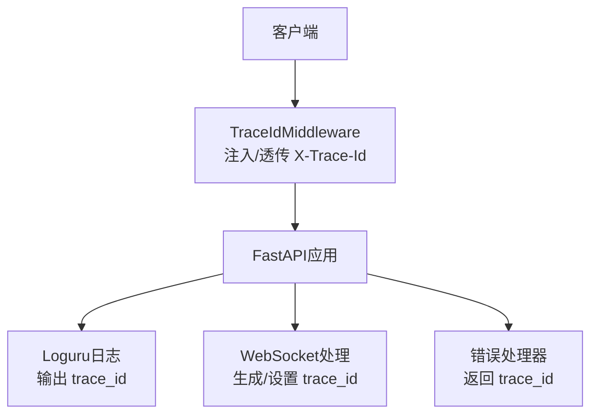
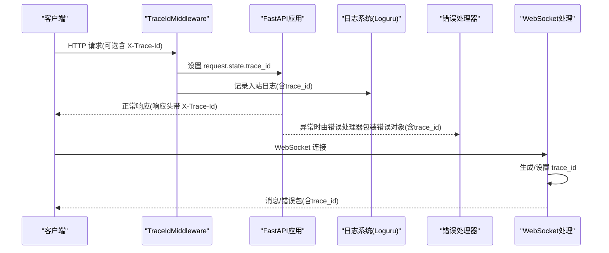
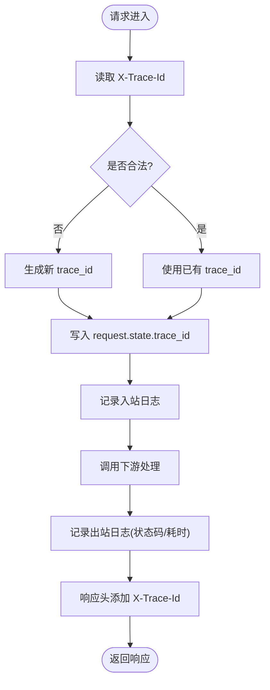
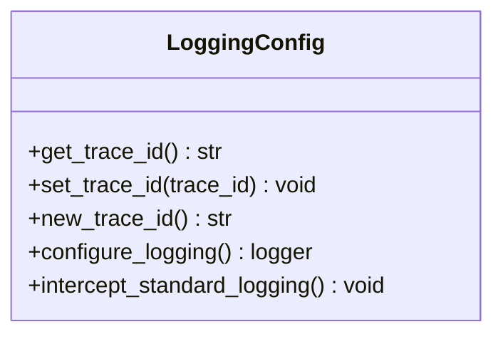
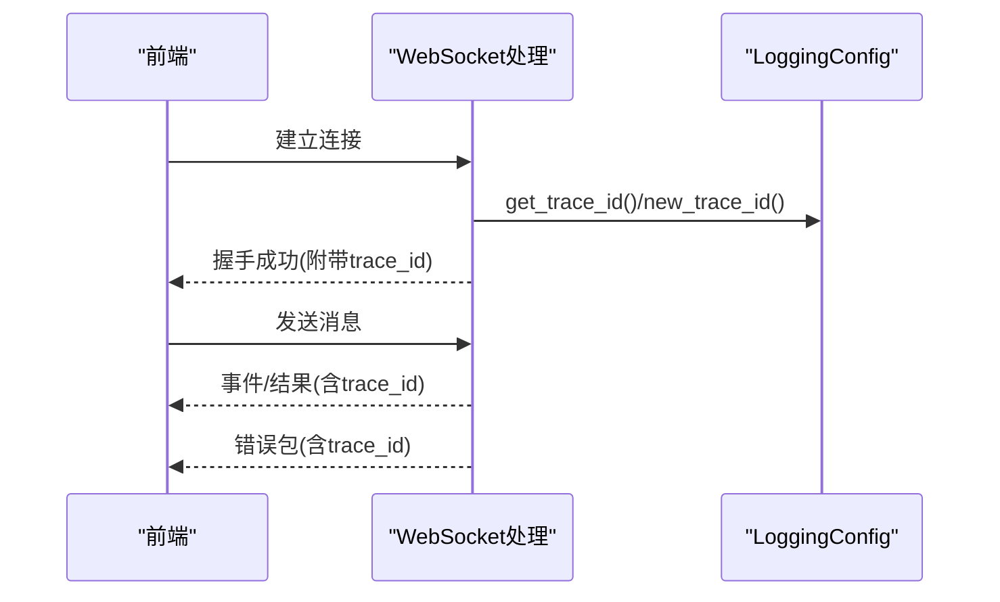
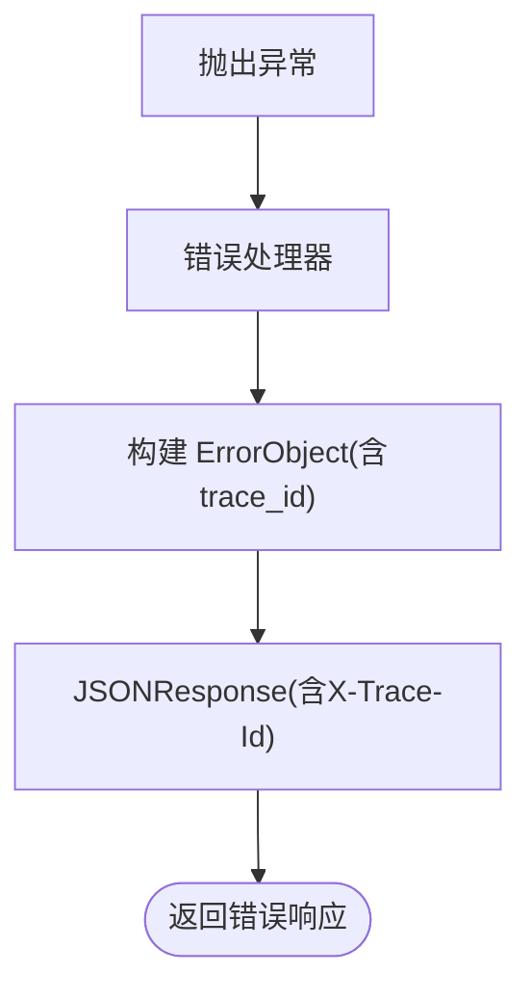
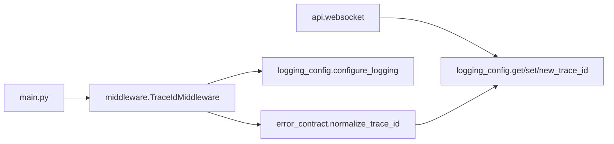

# 分布式追踪

<cite>
**本文引用的文件**   
- [backend/app/main.py](file://backend/app/main.py)
- [backend/app/core/middleware.py](file://backend/app/core/middleware.py)
- [backend/app/core/logging_config.py](file://backend/app/core/logging_config.py)
- [backend/app/core/error_contract.py](file://backend/app/core/error_contract.py)
- [backend/app/api/websocket.py](file://backend/app/api/websocket.py)
- [backend/app/config.py](file://backend/app/config.py)
</cite>

## 目录
1. [简介](#简介)
2. [项目结构](#项目结构)
3. [核心组件](#核心组件)
4. [架构总览](#架构总览)
5. [详细组件分析](#详细组件分析)
6. [依赖关系分析](#依赖关系分析)
7. [性能与采样策略](#性能与采样策略)
8. [运维配置：存储与查询](#运维配置存储与查询)
9. [故障定位与排错指南](#故障定位与排错指南)
10. [结论](#结论)
11. [附录：集成OpenTelemetry/Jaeger建议](#附录集成opentelemetryjaeger建议)

## 简介
本指南面向在微服务架构中落地分布式链路追踪的工程师与运维人员，结合当前代码库已有的“请求级追踪ID”能力，给出如何扩展为完整的OpenTelemetry或Jaeger集成的实践方案。内容涵盖Span创建、上下文传播（HTTP/WebSocket/异步任务）、跨服务追踪、采样策略、性能影响评估、数据存储与查询、以及基于链路的依赖可视化与故障定位方法。

## 项目结构
本项目后端使用FastAPI作为Web框架，已内置轻量级的请求追踪能力：
- 通过中间件注入并透传X-Trace-Id
- 日志统一格式包含trace_id
- WebSocket连接内生成并维护trace_id
- 错误响应体与响应头携带trace_id

**图示来源** 
- [backend/app/main.py:359-360](file://backend/app/main.py#L359-L360)
- [backend/app/core/middleware.py:12-53](file://backend/app/core/middleware.py#L12-L53)
- [backend/app/core/logging_config.py:61-79](file://backend/app/core/logging_config.py#L61-L79)
- [backend/app/api/websocket.py:180-203](file://backend/app/api/websocket.py#L180-L203)
- [backend/app/core/error_contract.py:158-181](file://backend/app/core/error_contract.py#L158-L181)

**章节来源**
- [backend/app/main.py:359-360](file://backend/app/main.py#L359-L360)
- [backend/app/core/middleware.py:12-53](file://backend/app/core/middleware.py#L12-L53)
- [backend/app/core/logging_config.py:61-79](file://backend/app/core/logging_config.py#L61-L79)
- [backend/app/api/websocket.py:180-203](file://backend/app/api/websocket.py#L180-L203)
- [backend/app/core/error_contract.py:158-181](file://backend/app/core/error_contract.py#L158-L181)

## 核心组件
- TraceIdMiddleware：解析/校验/回退X-Trace-Id，写入request.state并在响应头回写
- logging_config：loguru集中化配置，格式化输出包含trace_id；提供get/set/new_trace_id
- error_contract：规范化错误对象，确保所有错误响应都包含trace_id
- websocket：长连接场景下生成/设置trace_id，保证消息与错误包携带trace_id
- main：应用启动时注册中间件、错误处理器等

**章节来源**
- [backend/app/core/middleware.py:12-53](file://backend/app/core/middleware.py#L12-L53)
- [backend/app/core/logging_config.py:28-47](file://backend/app/core/logging_config.py#L28-L47)
- [backend/app/core/error_contract.py:34-47](file://backend/app/core/error_contract.py#L34-L47)
- [backend/app/api/websocket.py:180-203](file://backend/app/api/websocket.py#L180-L203)
- [backend/app/main.py:359-360](file://backend/app/main.py#L359-L360)

## 架构总览
下图展示从HTTP请求进入，到日志、错误响应、WebSocket连接的追踪上下文流转。

**图示来源** 
- [backend/app/core/middleware.py:15-53](file://backend/app/core/middleware.py#L15-L53)
- [backend/app/core/logging_config.py:61-79](file://backend/app/core/logging_config.py#L61-L79)
- [backend/app/core/error_contract.py:158-181](file://backend/app/core/error_contract.py#L158-L181)
- [backend/app/api/websocket.py:180-203](file://backend/app/api/websocket.py#L180-L203)

## 详细组件分析

### HTTP请求追踪（中间件）
- 行为要点
  - 从请求头读取X-Trace-Id，若非法或缺失则生成新的12位trace_id
  - 将trace_id写入request.state供后续逻辑使用
  - 记录入站/出站日志，并在响应头回写X-Trace-Id
- 适用场景
  - 所有HTTP API调用均可被唯一标识，便于聚合日志与链路分析

**图示来源** 
- [backend/app/core/middleware.py:15-53](file://backend/app/core/middleware.py#L15-L53)

**章节来源**
- [backend/app/core/middleware.py:12-53](file://backend/app/core/middleware.py#L12-L53)

### 日志与上下文传播
- 行为要点
  - loguru集中配置，输出格式包含trace_id
  - 提供get_trace_id/set_trace_id/new_trace_id用于任意上下文获取/设置
  - 标准库logging被拦截转发至loguru，保持trace_id一致
- 适用场景
  - 业务代码在任何位置打印日志都能带上trace_id，便于串联调用链

**图示来源** 
- [backend/app/core/logging_config.py:28-47](file://backend/app/core/logging_config.py#L28-L47)
- [backend/app/core/logging_config.py:61-79](file://backend/app/core/logging_config.py#L61-L79)
- [backend/app/core/logging_config.py:89-124](file://backend/app/core/logging_config.py#L89-L124)

**章节来源**
- [backend/app/core/logging_config.py:28-47](file://backend/app/core/logging_config.py#L28-L47)
- [backend/app/core/logging_config.py:61-79](file://backend/app/core/logging_config.py#L61-L79)
- [backend/app/core/logging_config.py:89-124](file://backend/app/core/logging_config.py#L89-L124)

### WebSocket连接追踪
- 行为要点
  - 连接建立后生成或复用trace_id，并通过消息/错误包下发给前端
  - 错误包结构包含code/message/run_id/agent_id/stage/trace_id等字段
- 适用场景
  - 实时对话、事件推送等长连接场景可被唯一标识与排查

**图示来源** 
- [backend/app/api/websocket.py:180-203](file://backend/app/api/websocket.py#L180-L203)
- [backend/app/core/logging_config.py:28-47](file://backend/app/core/logging_config.py#L28-L47)

**章节来源**
- [backend/app/api/websocket.py:180-203](file://backend/app/api/websocket.py#L180-L203)

### 错误响应中的追踪
- 行为要点
  - 所有HTTP异常均会被统一处理器捕获，构造标准化错误对象，包含trace_id
  - 响应头强制携带X-Trace-Id，便于客户端侧关联问题
- 适用场景
  - 前后端联调、线上问题快速定位

**图示来源** 
- [backend/app/core/error_contract.py:158-181](file://backend/app/core/error_contract.py#L158-L181)
- [backend/app/core/error_contract.py:184-202](file://backend/app/core/error_contract.py#L184-L202)
- [backend/app/core/error_contract.py:205-221](file://backend/app/core/error_contract.py#L205-L221)

**章节来源**
- [backend/app/core/error_contract.py:34-47](file://backend/app/core/error_contract.py#L34-L47)
- [backend/app/core/error_contract.py:158-181](file://backend/app/core/error_contract.py#L158-L181)
- [backend/app/core/error_contract.py:184-202](file://backend/app/core/error_contract.py#L184-L202)
- [backend/app/core/error_contract.py:205-221](file://backend/app/core/error_contract.py#L205-L221)

## 依赖关系分析
- 入口与中间件
  - main.py在应用初始化时注册TraceIdMiddleware与错误处理器
- 追踪上下文
  - middleware依赖error_contract.normalize_trace_id进行ID规范化
  - logging_config提供ContextVar级别的trace_id传播
  - websocket模块直接调用logging_config的get/set/new函数
- 错误处理
  - error_contract统一封装错误对象，确保trace_id贯穿全链路

**图示来源** 
- [backend/app/main.py:359-360](file://backend/app/main.py#L359-L360)
- [backend/app/core/middleware.py:12-53](file://backend/app/core/middleware.py#L12-L53)
- [backend/app/core/error_contract.py:34-47](file://backend/app/core/error_contract.py#L34-L47)
- [backend/app/core/logging_config.py:28-47](file://backend/app/core/logging_config.py#L28-L47)
- [backend/app/api/websocket.py:180-203](file://backend/app/api/websocket.py#L180-L203)

**章节来源**
- [backend/app/main.py:359-360](file://backend/app/main.py#L359-L360)
- [backend/app/core/middleware.py:12-53](file://backend/app/core/middleware.py#L12-L53)
- [backend/app/core/error_contract.py:34-47](file://backend/app/core/error_contract.py#L34-L47)
- [backend/app/core/logging_config.py:28-47](file://backend/app/core/logging_config.py#L28-L47)
- [backend/app/api/websocket.py:180-203](file://backend/app/api/websocket.py#L180-L203)

## 性能与采样策略
- 现状评估
  - 当前实现仅做trace_id注入与日志输出，无OpenTelemetry SDK上报开销
  - 日志采用loguru异步队列输出，降低主线程阻塞
- 建议采样策略
  - 按请求维度采样：例如对慢请求或错误请求100%采样，其余按比例采样
  - 按租户/接口维度采样：高价值接口或租户提高采样率
  - 动态采样：根据QPS、延迟阈值、错误率动态调整采样比例
- 性能影响评估
  - 日志量控制：避免在高并发下产生过多日志，合理设置日志级别与过滤
  - 上报通道：使用批量上报、压缩、重试机制，避免阻塞请求路径
  - Span属性精简：只保留必要标签，减少内存与网络开销

[本节为通用指导，不直接分析具体文件]

## 运维配置：存储与查询
- 存储选型
  - Jaeger：适合微服务链路追踪，支持热插拔存储后端（如ES、Cassandra）
  - OpenTelemetry Collector：统一采集、转换、导出至多种后端（Jaeger、Zipkin、OTLP）
- 部署建议
  - 使用容器编排部署Collector与Jaeger，配合Kubernetes Service发现
  - 配置合理的索引与TTL策略，控制存储成本
- 查询与分析
  - 基于trace_id检索完整链路
  - 按服务名、操作名、错误码、耗时分布进行聚合分析
  - 结合日志系统（ELK/Loki）以trace_id为纽带进行联合查询

[本节为通用指导，不直接分析具体文件]

## 故障定位与排错指南
- 常见问题
  - 未收到X-Trace-Id：检查上游网关/负载均衡是否透传该头部
  - trace_id不一致：确认各服务间是否正确传播上下文（HTTP/WSS/消息队列）
  - 日志缺失trace_id：确认是否在正确的上下文中调用日志接口
- 定位步骤
  - 通过X-Trace-Id在日志系统中检索全链路日志
  - 结合错误响应体中的trace_id与run_id/agent_id定位具体执行
  - 对WebSocket连接，使用连接建立时的trace_id追踪后续事件

**章节来源**
- [backend/app/core/middleware.py:15-53](file://backend/app/core/middleware.py#L15-L53)
- [backend/app/core/error_contract.py:158-181](file://backend/app/core/error_contract.py#L158-L181)
- [backend/app/api/websocket.py:180-203](file://backend/app/api/websocket.py#L180-L203)

## 结论
当前代码库已具备稳定的请求级追踪基础：统一的trace_id生成、传播与日志输出。在此基础上，可通过引入OpenTelemetry SDK与Collector，逐步升级为完整的分布式链路追踪体系，覆盖HTTP、WebSocket、异步任务等场景，并结合采样策略与存储优化，实现高性能、可观测的微服务治理。

[本节为总结性内容，不直接分析具体文件]

## 附录：集成OpenTelemetry/Jaeger建议
- 集成步骤
  - 安装OpenTelemetry SDK与Exporter（如otlp-http）
  - 在应用启动时初始化TracerProvider，注册HTTP/数据库/外部调用Instrumentation
  - 配置Exporter指向OpenTelemetry Collector
- 上下文传播
  - HTTP：使用W3C Trace Context或B3格式传播
  - WebSocket：在握手阶段注入traceparent或自定义头部
  - 异步任务：在消息序列化时携带trace上下文，消费端恢复
- 采样与导出
  - 配置Sampler（如TraceIdRatioBased），按环境调整采样率
  - 使用Collector进行批处理、压缩、重试与降级
- 可视化与查询
  - 部署Jaeger UI，按trace_id与服务拓扑进行链路分析
  - 结合指标与日志，形成“链路-指标-日志”三位一体可观测性

[本节为通用指导，不直接分析具体文件]