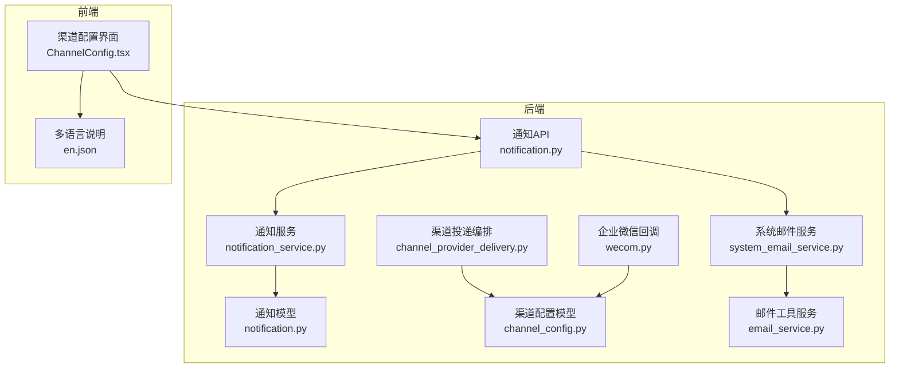
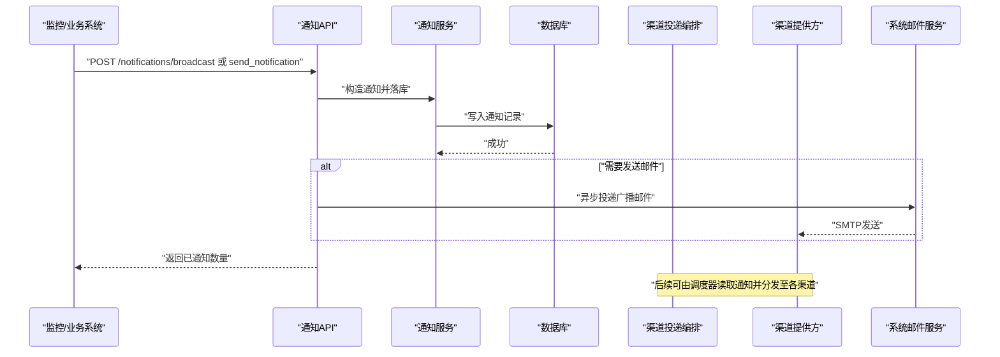
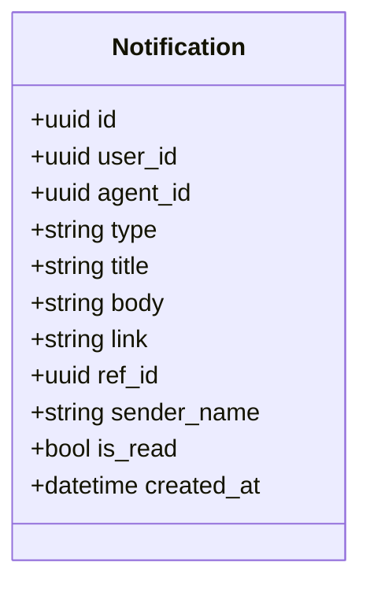
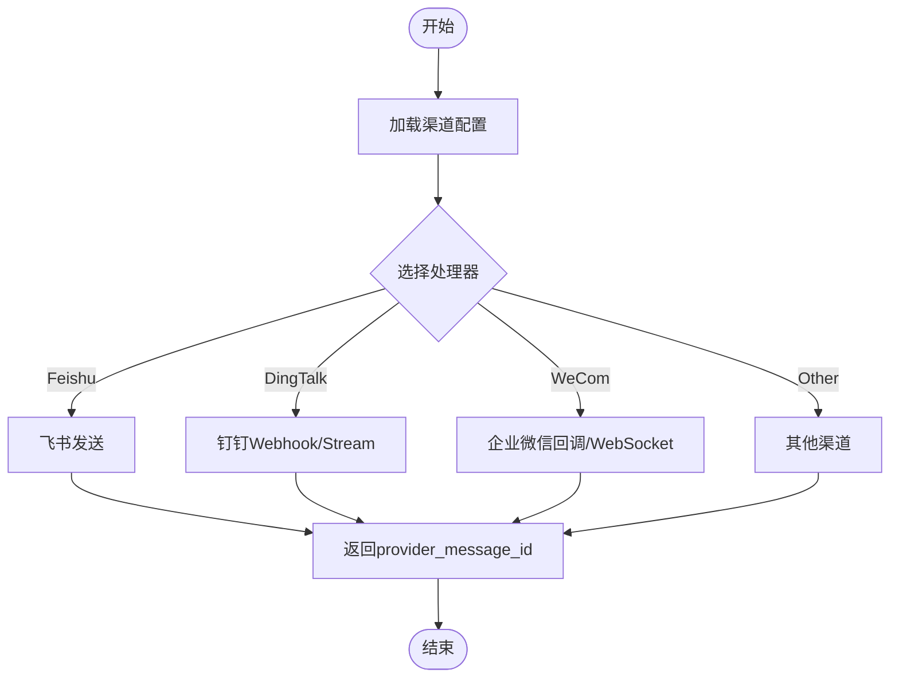
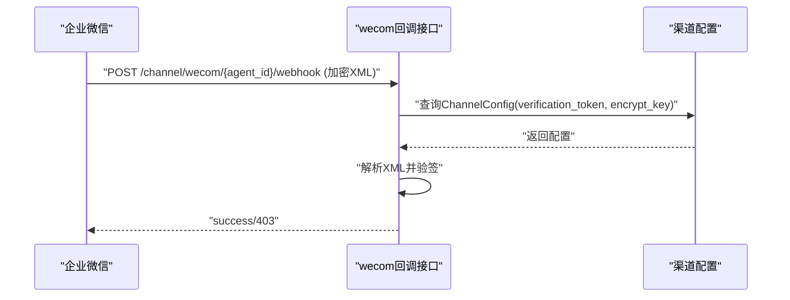
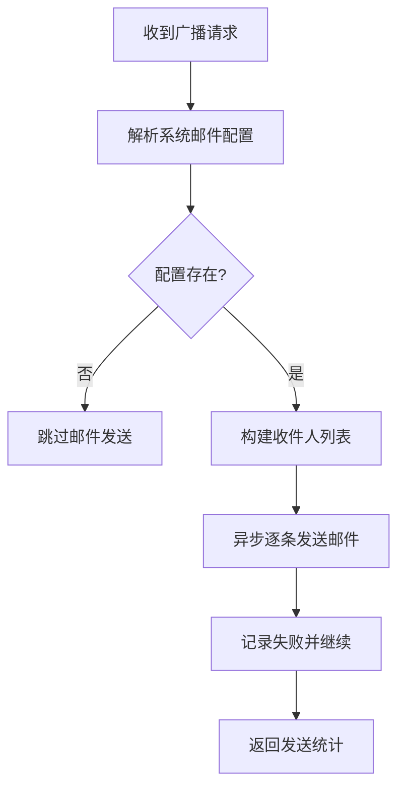
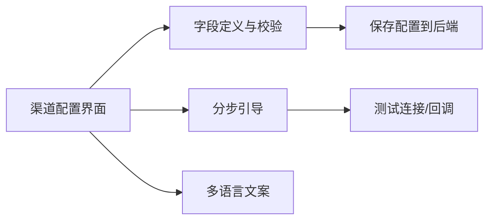
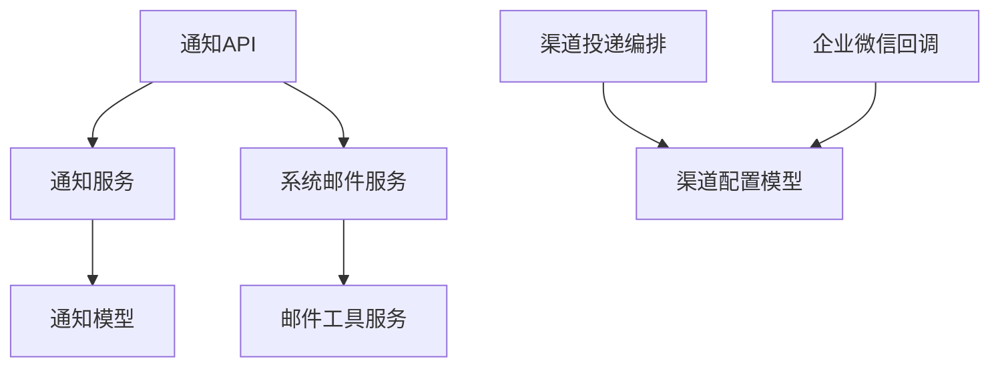

# 告警系统

<cite>
**本文引用的文件**   
- [backend/app/services/notification_service.py](file://backend/app/services/notification_service.py)
- [backend/app/models/notification.py](file://backend/app/models/notification.py)
- [backend/app/api/notification.py](file://backend/app/api/notification.py)
- [backend/app/models/channel_config.py](file://backend/app/models/channel_config.py)
- [backend/app/services/agent_runtime/channel_provider_delivery.py](file://backend/app/services/agent_runtime/channel_provider_delivery.py)
- [backend/app/api/wecom.py](file://backend/app/api/wecom.py)
- [backend/app/services/system_email_service.py](file://backend/app/services/system_email_service.py)
- [backend/app/services/email_service.py](file://backend/app/services/email_service.py)
- [frontend/src/components/ChannelConfig.tsx](file://frontend/src/components/ChannelConfig.tsx)
- [frontend/src/i18n/en.json](file://frontend/src/i18n/en.json)
</cite>

## 目录
1. [简介](#简介)
2. [项目结构](#项目结构)
3. [核心组件](#核心组件)
4. [架构总览](#架构总览)
5. [详细组件分析](#详细组件分析)
6. [依赖关系分析](#依赖关系分析)
7. [性能考虑](#性能考虑)
8. [故障排查指南](#故障排查指南)
9. [结论](#结论)
10. [附录](#附录)

## 简介
本指南面向Clawith平台的告警与通知能力，聚焦于“应用内通知 + 多渠道推送”的体系。当前仓库未内置Prometheus AlertManager规则引擎，但提供了完善的通知模型、API与服务层实现，以及与企业微信、钉钉、飞书等渠道的集成能力。本文基于现有代码，给出：
- 应用级告警（如CPU、内存泄漏、API超时）如何落地为“应用内通知 + 多渠道推送”的实现方案
- 基础设施告警（数据库连接池、磁盘空间、网络延迟）的接入建议与对接方式
- 告警升级策略、静默规则、抑制等高级能力的扩展思路
- 邮件、企业微信、钉钉等通知渠道的配置与排错要点
- 移动端推送与事件处理流程的最佳实践

## 项目结构
围绕告警与通知的核心代码分布在后端服务层、数据模型与API层，以及前端渠道配置界面：
- 数据模型：通知实体、渠道配置实体
- 服务层：统一通知发送入口、系统邮件服务、渠道投递编排
- API层：通知列表/计数/已读标记、广播通知、企业微信回调
- 前端：渠道配置向导与多语言说明

图表来源
- [backend/app/api/notification.py:1-217](file://backend/app/api/notification.py#L1-L217)
- [backend/app/services/notification_service.py:1-56](file://backend/app/services/notification_service.py#L1-L56)
- [backend/app/models/notification.py:1-31](file://backend/app/models/notification.py#L1-L31)
- [backend/app/models/channel_config.py:1-52](file://backend/app/models/channel_config.py#L1-L52)
- [backend/app/services/agent_runtime/channel_provider_delivery.py:84-159](file://backend/app/services/agent_runtime/channel_provider_delivery.py#L84-L159)
- [backend/app/api/wecom.py:347-384](file://backend/app/api/wecom.py#L347-L384)
- [backend/app/services/system_email_service.py:1-311](file://backend/app/services/system_email_service.py#L1-L311)
- [backend/app/services/email_service.py:1-466](file://backend/app/services/email_service.py#L1-L466)
- [frontend/src/components/ChannelConfig.tsx:126-225](file://frontend/src/components/ChannelConfig.tsx#L126-L225)
- [frontend/src/i18n/en.json:1804-1820](file://frontend/src/i18n/en.json#L1804-L1820)

章节来源
- [backend/app/api/notification.py:1-217](file://backend/app/api/notification.py#L1-L217)
- [backend/app/services/notification_service.py:1-56](file://backend/app/services/notification_service.py#L1-L56)
- [backend/app/models/notification.py:1-31](file://backend/app/models/notification.py#L1-L31)
- [backend/app/models/channel_config.py:1-52](file://backend/app/models/channel_config.py#L1-L52)
- [backend/app/services/agent_runtime/channel_provider_delivery.py:84-159](file://backend/app/services/agent_runtime/channel_provider_delivery.py#L84-L159)
- [backend/app/api/wecom.py:347-384](file://backend/app/api/wecom.py#L347-L384)
- [backend/app/services/system_email_service.py:1-311](file://backend/app/services/system_email_service.py#L1-L311)
- [backend/app/services/email_service.py:1-466](file://backend/app/services/email_service.py#L1-L466)
- [frontend/src/components/ChannelConfig.tsx:126-225](file://frontend/src/components/ChannelConfig.tsx#L126-L225)
- [frontend/src/i18n/en.json:1804-1820](file://frontend/src/i18n/en.json#L1804-L1820)

## 核心组件
- 通知模型与持久化
  - 通知实体包含类型、标题、正文、跳转链接、关联对象ID、发送者、是否已读、创建时间等字段，支持按用户或Agent接收。
- 通知服务
  - 统一的send_notification函数负责校验入参并写入数据库，记录日志。
- 通知API
  - 提供查询、过滤（分类）、未读数统计、批量标记已读、广播通知等接口；广播可异步发送邮件。
- 渠道配置模型
  - ChannelConfig存储各渠道（飞书、企业微信、钉钉、Slack、Discord、Teams等）的凭据与状态，支持JSON扩展字段。
- 渠道投递编排
  - 根据目标渠道选择对应处理器，封装HTTP/WebSocket调用与错误处理，返回provider_message_id用于追踪。
- 企业微信回调
  - 解析加密XML、验签、读取配置，确保回调安全。
- 系统邮件服务
  - 从系统设置中解析SMTP配置，支持模板渲染、批量广播邮件发送与测试。
- 邮件工具服务
  - 面向Agent工具的IMAP/SMTP收发邮件能力，含常见邮箱提供商预设。

章节来源
- [backend/app/models/notification.py:1-31](file://backend/app/models/notification.py#L1-L31)
- [backend/app/services/notification_service.py:1-56](file://backend/app/services/notification_service.py#L1-L56)
- [backend/app/api/notification.py:1-217](file://backend/app/api/notification.py#L1-L217)
- [backend/app/models/channel_config.py:1-52](file://backend/app/models/channel_config.py#L1-L52)
- [backend/app/services/agent_runtime/channel_provider_delivery.py:84-159](file://backend/app/services/agent_runtime/channel_provider_delivery.py#L84-L159)
- [backend/app/api/wecom.py:347-384](file://backend/app/api/wecom.py#L347-L384)
- [backend/app/services/system_email_service.py:1-311](file://backend/app/services/system_email_service.py#L1-L311)
- [backend/app/services/email_service.py:1-466](file://backend/app/services/email_service.py#L1-L466)

## 架构总览
下图展示从“告警触发”到“多渠道送达”的整体流程。当前平台通过API或服务层生成通知，持久化后由投递编排器发送至具体渠道；邮件走系统邮件服务，其他渠道通过Provider Delivery统一处理。

图表来源
- [backend/app/api/notification.py:114-217](file://backend/app/api/notification.py#L114-L217)
- [backend/app/services/notification_service.py:1-56](file://backend/app/services/notification_service.py#L1-L56)
- [backend/app/services/system_email_service.py:177-184](file://backend/app/services/system_email_service.py#L177-L184)

## 详细组件分析

### 通知模型与API
- 通知模型字段涵盖类型、标题、正文、跳转链接、关联对象、发送者、已读状态与时间戳，便于前端展示与交互。
- 通知API提供：
  - 列表查询与分类过滤（tool、approval、social、broadcast）
  - 未读数统计
  - 单条/全部标记已读
  - 广播通知（可选发送邮件）

图表来源
- [backend/app/models/notification.py:13-31](file://backend/app/models/notification.py#L13-L31)

章节来源
- [backend/app/models/notification.py:1-31](file://backend/app/models/notification.py#L1-L31)
- [backend/app/api/notification.py:1-217](file://backend/app/api/notification.py#L1-L217)

### 渠道配置与投递编排
- ChannelConfig存储各渠道凭据与状态，支持JSON扩展字段以适配不同渠道特性。
- 渠道投递编排根据envelope.channel选择处理器，统一错误处理与结果封装。

图表来源
- [backend/app/models/channel_config.py:13-52](file://backend/app/models/channel_config.py#L13-L52)
- [backend/app/services/agent_runtime/channel_provider_delivery.py:84-159](file://backend/app/services/agent_runtime/channel_provider_delivery.py#L84-L159)

章节来源
- [backend/app/models/channel_config.py:1-52](file://backend/app/models/channel_config.py#L1-L52)
- [backend/app/services/agent_runtime/channel_provider_delivery.py:84-159](file://backend/app/services/agent_runtime/channel_provider_delivery.py#L84-L159)

### 企业微信回调处理
- 回调接口接收加密XML，解析Encrypt字段，使用配置的Token与EncodingAESKey进行签名校验，防止伪造请求。

图表来源
- [backend/app/api/wecom.py:347-384](file://backend/app/api/wecom.py#L347-L384)
- [backend/app/models/channel_config.py:13-52](file://backend/app/models/channel_config.py#L13-L52)

章节来源
- [backend/app/api/wecom.py:347-384](file://backend/app/api/wecom.py#L347-L384)
- [backend/app/models/channel_config.py:1-52](file://backend/app/models/channel_config.py#L1-L52)

### 系统邮件服务
- 从系统设置中解析SMTP配置，支持模板渲染与批量广播邮件发送；提供测试接口验证配置。

图表来源
- [backend/app/services/system_email_service.py:54-84](file://backend/app/services/system_email_service.py#L54-L84)
- [backend/app/services/system_email_service.py:177-184](file://backend/app/services/system_email_service.py#L177-L184)
- [backend/app/api/notification.py:122-217](file://backend/app/api/notification.py#L122-L217)

章节来源
- [backend/app/services/system_email_service.py:1-311](file://backend/app/services/system_email_service.py#L1-L311)
- [backend/app/api/notification.py:114-217](file://backend/app/api/notification.py#L114-L217)

### 前端渠道配置
- 前端提供多渠道配置向导，包含字段定义、步骤指引与多语言说明，降低配置门槛。

图表来源
- [frontend/src/components/ChannelConfig.tsx:126-225](file://frontend/src/components/ChannelConfig.tsx#L126-L225)
- [frontend/src/i18n/en.json:1804-1820](file://frontend/src/i18n/en.json#L1804-L1820)

章节来源
- [frontend/src/components/ChannelConfig.tsx:126-225](file://frontend/src/components/ChannelConfig.tsx#L126-L225)
- [frontend/src/i18n/en.json:1804-1820](file://frontend/src/i18n/en.json#L1804-L1820)

## 依赖关系分析
- 通知API依赖通知服务与数据库会话，广播通知可选依赖系统邮件服务。
- 渠道投递编排依赖ChannelConfig与具体渠道SDK/HTTP客户端。
- 企业微信回调依赖ChannelConfig中的验签参数。
- 系统邮件服务依赖系统设置DAO与底层SMTP发送工具。

图表来源
- [backend/app/api/notification.py:1-217](file://backend/app/api/notification.py#L1-L217)
- [backend/app/services/notification_service.py:1-56](file://backend/app/services/notification_service.py#L1-L56)
- [backend/app/models/notification.py:1-31](file://backend/app/models/notification.py#L1-L31)
- [backend/app/services/agent_runtime/channel_provider_delivery.py:84-159](file://backend/app/services/agent_runtime/channel_provider_delivery.py#L84-L159)
- [backend/app/models/channel_config.py:1-52](file://backend/app/models/channel_config.py#L1-L52)
- [backend/app/api/wecom.py:347-384](file://backend/app/api/wecom.py#L347-L384)
- [backend/app/services/system_email_service.py:1-311](file://backend/app/services/system_email_service.py#L1-L311)
- [backend/app/services/email_service.py:1-466](file://backend/app/services/email_service.py#L1-L466)

## 性能考虑
- 广播邮件采用后台任务异步发送，避免阻塞主线程。
- 渠道投递使用异步HTTP客户端，合理设置超时与重试策略。
- 通知列表与未读数查询使用索引字段（user_id、created_at），提升分页与聚合效率。
- 企业微信回调需快速验签与响应，减少外部依赖等待。

[本节为通用指导，不直接分析具体文件]

## 故障排查指南
- 企业微信回调失败
  - 检查ChannelConfig中的verification_token与encrypt_key是否正确
  - 确认回调URL公网可达且签名一致
- 邮件发送失败
  - 使用系统邮件测试接口验证SMTP配置
  - 检查SSL/TLS端口与认证信息
- 渠道投递异常
  - 查看投递编排的错误码与payload，定位具体渠道问题
  - 核对target字段（如session_webhook、receive_id_type）是否符合渠道要求

章节来源
- [backend/app/api/wecom.py:347-384](file://backend/app/api/wecom.py#L347-L384)
- [backend/app/services/system_email_service.py:292-311](file://backend/app/services/system_email_service.py#L292-L311)
- [backend/app/services/agent_runtime/channel_provider_delivery.py:84-159](file://backend/app/services/agent_runtime/channel_provider_delivery.py#L84-L159)

## 结论
当前Clawith平台已具备完善的通知与多渠道推送能力，可作为告警系统的“执行层”。对于Prometheus AlertManager的规则与分组、抑制、静默等高级能力，建议通过外部监控系统将告警事件转换为平台通知（调用通知API或广播接口），再由平台统一分发至邮件、企业微信、钉钉等渠道，形成“监控-通知-触达”的闭环。

[本节为总结性内容，不直接分析具体文件]

## 附录
- 应用级告警落地建议
  - CPU使用率、内存泄漏、API超时等指标由监控系统采集后，调用通知API生成“application”类通知，并通过渠道投递编排发送到企业微信/钉钉/邮件。
- 基础设施告警落地建议
  - 数据库连接池、磁盘空间、网络延迟等指标同样转为通知，结合租户维度与资源标签进行分组与路由。
- 告警升级策略
  - 在调度层根据通知类型与严重级别，设定重复提醒与升级路径（如先企业微信，再邮件）。
- 静默规则与抑制
  - 在调度层维护静默窗口与抑制规则，避免告警风暴。
- 移动端推送
  - 可通过企业微信/钉钉的长连接模式或第三方推送网关，将通知同步至移动端。

[本节为概念性内容，不直接分析具体文件]