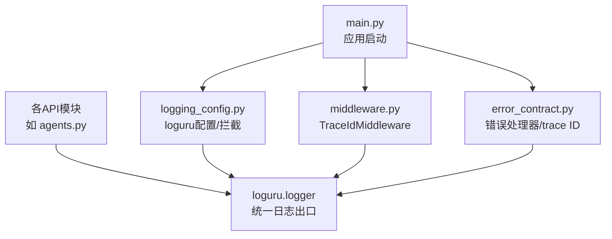
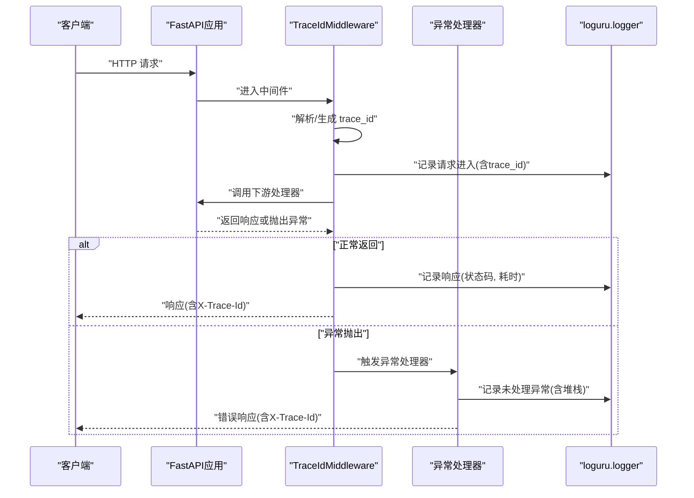
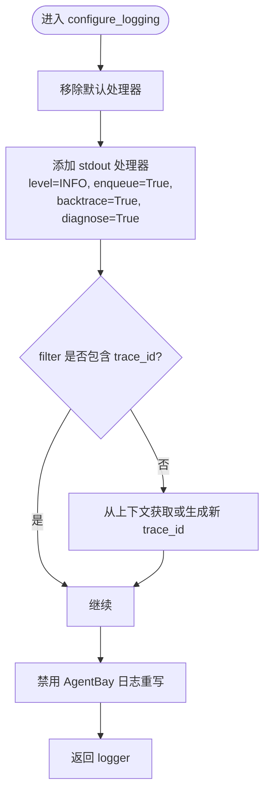
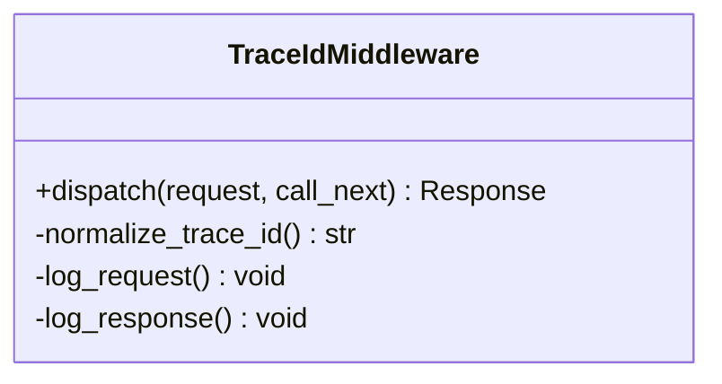
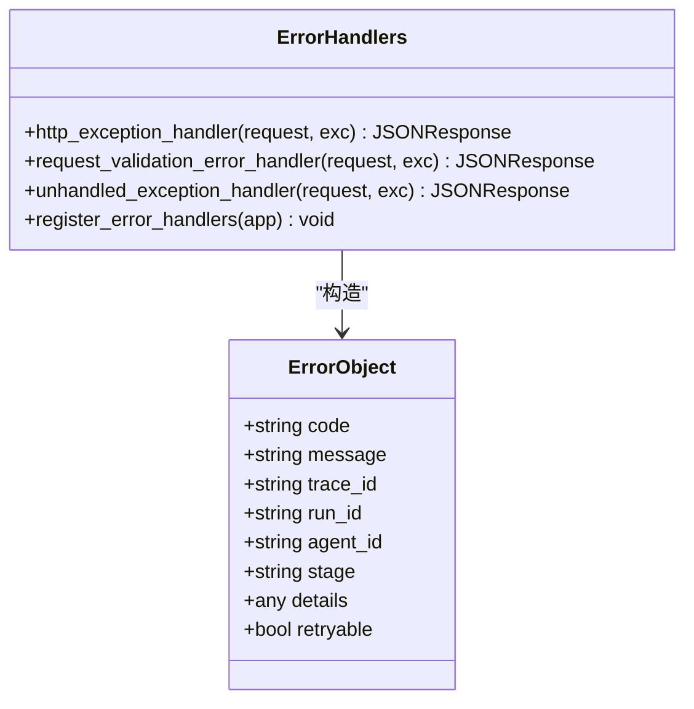
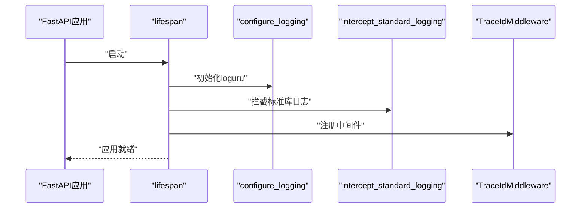
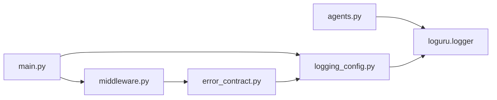

# 应用日志配置

<cite>
**本文引用的文件**   
- [logging_config.py](file://backend/app/core/logging_config.py)
- [middleware.py](file://backend/app/core/middleware.py)
- [error_contract.py](file://backend/app/core/error_contract.py)
- [main.py](file://backend/app/main.py)
- [agents.py](file://backend/app/api/agents.py)
</cite>

## 目录
1. [简介](#简介)
2. [项目结构](#项目结构)
3. [核心组件](#核心组件)
4. [架构总览](#架构总览)
5. [详细组件分析](#详细组件分析)
6. [依赖关系分析](#依赖关系分析)
7. [性能考虑](#性能考虑)
8. [故障排查指南](#故障排查指南)
9. [结论](#结论)
10. [附录](#附录)

## 简介
本指南面向Clawith后端应用的日志系统，围绕loguru日志库的配置与使用展开，涵盖以下主题：
- 自定义格式设置（时间、级别、模块行号、trace ID等）
- trace ID追踪机制（请求上下文、响应头透传、后台任务隔离）
- 异步日志处理（队列化输出、背压与诊断信息）
- 日志级别管理（DEBUG、INFO、WARNING、ERROR）
- 结构化日志输出格式（extra字段扩展）
- 上下文变量传递（ContextVar）
- 日志过滤器配置（按模块/级别过滤）
- 标准库日志拦截（将logging桥接到loguru）
- 第三方库日志控制（uvicorn/websockets/urllib3等降噪）
- 性能优化建议（enqueue、backtrace、diagnose、过滤策略）
- 内存管理与常见问题解决方案

## 项目结构
日志相关代码集中在backend/app/core目录下，并在应用启动时统一初始化。关键文件职责如下：
- logging_config.py：loguru全局配置、trace ID上下文、标准库拦截、第三方库降噪
- middleware.py：FastAPI中间件，注入trace ID并记录请求出入栈日志
- error_contract.py：错误对象构建、异常处理器、trace ID规范化
- main.py：应用生命周期入口，启动时完成日志初始化与中间件注册
- agents.py：示例API路由，展示在业务代码中如何使用logger

图表来源 
- [main.py:122-128](file://backend/app/main.py#L122-L128)
- [logging_config.py:61-79](file://backend/app/core/logging_config.py#L61-L79)
- [middleware.py:12-53](file://backend/app/core/middleware.py#L12-L53)
- [error_contract.py:158-229](file://backend/app/core/error_contract.py#L158-L229)

章节来源
- [main.py:122-128](file://backend/app/main.py#L122-L128)
- [logging_config.py:61-79](file://backend/app/core/logging_config.py#L61-L79)
- [middleware.py:12-53](file://backend/app/core/middleware.py#L12-L53)
- [error_contract.py:158-229](file://backend/app/core/error_contract.py#L158-L229)

## 核心组件
- loguru全局配置器
  - 移除默认处理器，添加stdout处理器，启用异步队列输出、回溯与诊断信息
  - 自定义格式化模板，包含时间、级别、trace_id、模块名与行号
  - 通过filter确保每条日志都携带trace_id
- TraceIdMiddleware
  - 从请求头X-Trace-Id解析或生成trace_id，写入request.state
  - 记录请求进入与返回的耗时，并将trace_id回写至响应头
- 标准库日志拦截器
  - 将Python标准库logging重定向到loguru，保持统一的输出格式与trace_id
- 错误契约与异常处理器
  - 规范化trace_id，构造统一错误体，保证所有HTTP异常路径均携带trace_id

章节来源
- [logging_config.py:61-79](file://backend/app/core/logging_config.py#L61-L79)
- [middleware.py:12-53](file://backend/app/core/middleware.py#L12-L53)
- [error_contract.py:34-48](file://backend/app/core/error_contract.py#L34-L48)
- [error_contract.py:158-229](file://backend/app/core/error_contract.py#L158-L229)

## 架构总览
下图展示了请求生命周期中的日志与trace ID流转：

图表来源 
- [middleware.py:12-53](file://backend/app/core/middleware.py#L12-L53)
- [error_contract.py:158-229](file://backend/app/core/error_contract.py#L158-L229)

## 详细组件分析

### 组件A：loguru日志配置器（logging_config.py）
- 功能要点
  - 移除默认处理器，新增stdout处理器，启用异步队列输出（enqueue=True），开启回溯（backtrace=True）与诊断（diagnose=True）
  - 自定义格式包含时间、级别、trace_id、模块名与行号
  - filter强制每条日志携带trace_id，缺失时自动从上下文获取或生成新ID
  - 提供get_trace_id/set_trace_id/new_trace_id用于上下文读写与后台任务隔离
  - 禁用AgentBay SDK对loguru的重写，避免覆盖配置
  - 提供quiet_noisy_connection_loggers降低连接层噪音（uvicorn/websockets/urllib3）
  - intercept_standard_logging将标准库logging桥接到loguru，统一输出

- 数据结构与复杂度
  - ContextVar用于线程/协程安全的trace_id传递，O(1)访问
  - 过滤器为闭包函数，每次日志记录执行一次判断，开销极低

- 依赖链
  - sys、logging、contextvars、uuid、loguru
  - 被main.py在启动时调用configure_logging与intercept_standard_logging

- 错误处理与边界
  - 捕获第三方库日志格式化失败时的异常，降级输出原始消息
  - 对AgentBay logger重写进行try/except保护

- 性能影响
  - enqueue=True实现异步落盘，减少主线程阻塞
  - backtrace/diagnose在调试阶段有用，生产环境可按需关闭以降低开销

图表来源 
- [logging_config.py:61-79](file://backend/app/core/logging_config.py#L61-L79)
- [logging_config.py:28-47](file://backend/app/core/logging_config.py#L28-L47)

章节来源
- [logging_config.py:61-79](file://backend/app/core/logging_config.py#L61-L79)
- [logging_config.py:82-87](file://backend/app/core/logging_config.py#L82-L87)
- [logging_config.py:89-124](file://backend/app/core/logging_config.py#L89-L124)

### 组件B：TraceIdMiddleware（middleware.py）
- 功能要点
  - 从请求头X-Trace-Id解析trace_id，若无效则生成新的trace_id
  - 将trace_id写入request.state.trace_id供后续逻辑使用
  - 记录请求进入与返回的日志，包含方法、路径、客户端IP、状态码与耗时
  - 将trace_id回写到响应头X-Trace-Id，便于前端或网关链路追踪

- 数据流
  - 入站请求 -> 解析/生成trace_id -> request.state -> 下游处理器 -> 响应头回写

- 错误处理
  - 异常路径记录错误日志并重新抛出，保证上层异常处理器接管

图表来源 
- [middleware.py:12-53](file://backend/app/core/middleware.py#L12-L53)

章节来源
- [middleware.py:12-53](file://backend/app/core/middleware.py#L12-L53)

### 组件C：错误契约与异常处理器（error_contract.py）
- 功能要点
  - normalize_trace_id：校验并规范化trace_id，无效则生成新ID并绑定上下文
  - get_request_trace_id：从request.state获取或修复trace_id
  - build_error_object：构造统一错误体，包含code、message、trace_id及可选字段
  - http_exception_handler/request_validation_error_handler/unhandled_exception_handler：统一异常处理，记录错误并返回带trace_id的错误响应

- 数据模型
  - ErrorObject：包含code、message、trace_id以及run_id、agent_id、stage、details、retryable等可选字段

图表来源 
- [error_contract.py:21-31](file://backend/app/core/error_contract.py#L21-L31)
- [error_contract.py:158-229](file://backend/app/core/error_contract.py#L158-L229)

章节来源
- [error_contract.py:34-48](file://backend/app/core/error_contract.py#L34-L48)
- [error_contract.py:158-229](file://backend/app/core/error_contract.py#L158-L229)

### 组件D：应用启动与中间件注册（main.py）
- 功能要点
  - lifespan中首先调用configure_logging与intercept_standard_logging完成日志初始化
  - 注册TraceIdMiddleware，确保所有请求均经过trace_id注入与记录
  - 启动阶段打印关键诊断信息（如bubblewrap可用性、代理配置等）

图表来源 
- [main.py:122-128](file://backend/app/main.py#L122-L128)
- [main.py:359-360](file://backend/app/main.py#L359-L360)

章节来源
- [main.py:122-128](file://backend/app/main.py#L122-L128)
- [main.py:359-360](file://backend/app/main.py#L359-L360)

### 组件E：业务API中的日志使用示例（agents.py）
- 功能要点
  - 在API路由中直接import并使用loguru.logger进行信息、警告、错误级别的日志记录
  - 结合trace_id上下文，确保每条业务日志可关联到具体请求

章节来源
- [agents.py:1-200](file://backend/app/api/agents.py#L1-L200)

## 依赖关系分析
- 模块耦合
  - main.py依赖logging_config与middleware完成启动期配置与中间件注册
  - middleware依赖error_contract中的trace_id规范化函数
  - error_contract依赖logging_config的trace_id工具函数
  - 各API模块依赖loguru.logger作为统一日志出口

- 外部依赖
  - loguru：日志框架
  - contextvars：协程/线程安全上下文
  - logging：标准库日志（被拦截并重定向）
  - uvicorn/websockets/urllib3：网络层日志（被降噪）

图表来源 
- [main.py:122-128](file://backend/app/main.py#L122-L128)
- [middleware.py:12-53](file://backend/app/core/middleware.py#L12-L53)
- [error_contract.py:158-229](file://backend/app/core/error_contract.py#L158-L229)
- [logging_config.py:61-79](file://backend/app/core/logging_config.py#L61-L79)
- [agents.py:1-200](file://backend/app/api/agents.py#L1-L200)

章节来源
- [main.py:122-128](file://backend/app/main.py#L122-L128)
- [middleware.py:12-53](file://backend/app/core/middleware.py#L12-L53)
- [error_contract.py:158-229](file://backend/app/core/error_contract.py#L158-L229)
- [logging_config.py:61-79](file://backend/app/core/logging_config.py#L61-L79)
- [agents.py:1-200](file://backend/app/api/agents.py#L1-L200)

## 性能考虑
- 异步输出
  - 启用enqueue=True，将日志写入队列，避免I/O阻塞主循环
- 诊断与回溯
  - backtrace=True与diagnose=True有助于定位问题，但在高吞吐场景下会增加CPU与内存开销，可根据环境开关
- 过滤策略
  - 使用NOISY_CONNECTION_LOGGERS降低连接层噪音，减少无关日志
- 上下文变量
  - ContextVar读写为O(1)，无额外分配，适合高频调用
- 内存管理
  - 合理控制日志级别，避免在生产环境输出过多DEBUG日志
  - 定期清理或归档日志文件，防止磁盘占满

[本节为通用指导，不直接分析具体文件]

## 故障排查指南
- 常见配置问题
  - trace_id缺失：检查filter是否正确设置，确保get_trace_id/new_trace_id被调用
  - 标准库日志未统一：确认intercept_standard_logging已调用且force=True
  - 第三方库噪音过大：调整NOISY_CONNECTION_LOGGERS中的级别
  - AgentBay SDK覆盖loguru：确保_disable_agentbay_logger_override生效
- 异常路径排查
  - 查看unhandled_exception_handler是否记录完整堆栈
  - 检查错误响应是否包含X-Trace-Id头
- 性能问题定位
  - 临时关闭backtrace/diagnose观察吞吐变化
  - 评估enqueue队列长度与消费者速度

章节来源
- [logging_config.py:82-87](file://backend/app/core/logging_config.py#L82-L87)
- [logging_config.py:89-124](file://backend/app/core/logging_config.py#L89-L124)
- [error_contract.py:205-221](file://backend/app/core/error_contract.py#L205-L221)

## 结论
Clawith的日志系统以loguru为核心，结合ContextVar实现trace_id贯穿请求与后台任务，通过中间件与异常处理器保证一致的追踪能力。异步输出与过滤策略兼顾了性能与可观测性。建议在开发环境保留诊断信息，在生产环境按需调优级别与开关，以获得最佳平衡。

[本节为总结，不直接分析具体文件]

## 附录
- 日志级别建议
  - DEBUG：开发与调试阶段使用
  - INFO：关键业务流程与事件
  - WARNING：潜在问题与降级行为
  - ERROR：错误与异常
- 结构化日志实践
  - 使用extra字段传递trace_id、用户ID、租户ID等上下文
  - 避免在message中拼接大对象，优先使用结构化字段
- 环境变量与配置
  - 通过Settings加载环境变量，集中管理配置项
  - 日志相关开关可通过环境变量控制（如DEBUG、LOG_LEVEL等）

[本节为概念性内容，不直接分析具体文件]