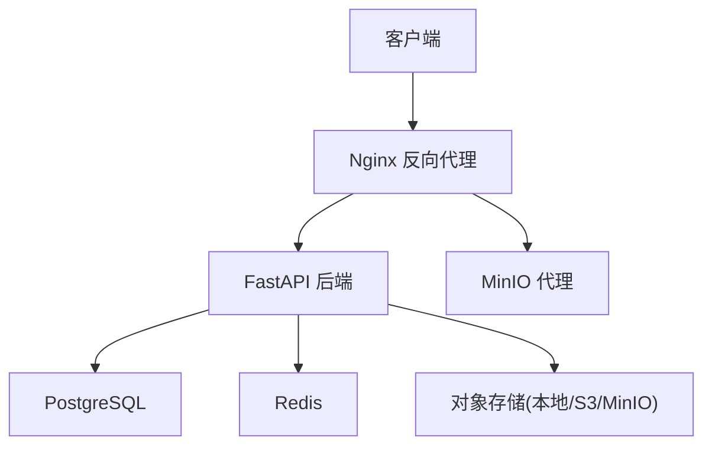
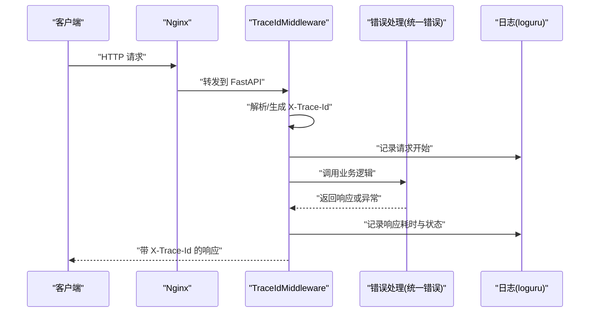
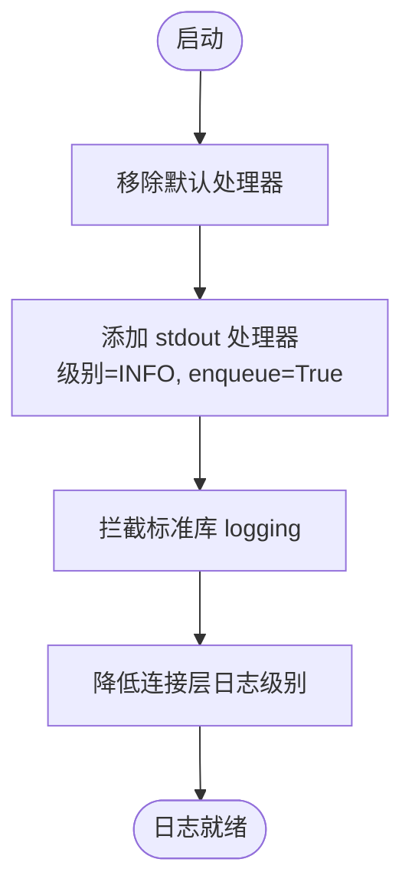
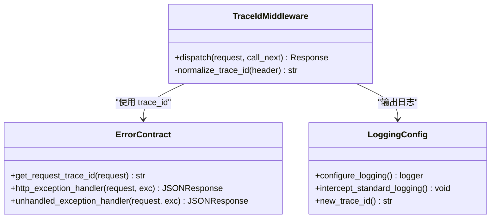
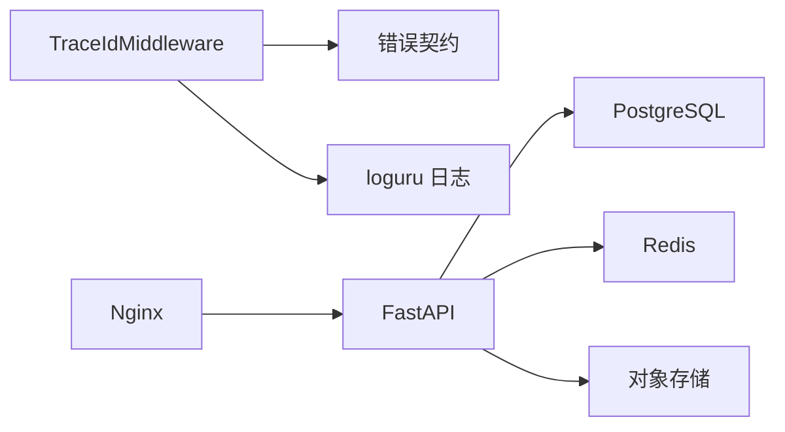

# 监控告警

<cite>
**本文引用的文件**   
- [backend/app/core/logging_config.py](file://backend/app/core/logging_config.py)
- [backend/app/core/middleware.py](file://backend/app/core/middleware.py)
- [backend/app/core/error_contract.py](file://backend/app/core/error_contract.py)
- [backend/app/main.py](file://backend/app/main.py)
- [backend/app/api/advanced.py](file://backend/app/api/advanced.py)
- [deploy/nginx/nginx.conf](file://deploy/nginx/nginx.conf)
- [docker-compose.yml](file://docker-compose.yml)
</cite>

## 目录
1. [简介](#简介)
2. [项目结构](#项目结构)
3. [核心组件](#核心组件)
4. [架构总览](#架构总览)
5. [详细组件分析](#详细组件分析)
6. [依赖关系分析](#依赖关系分析)
7. [性能考虑](#性能考虑)
8. [故障排查指南](#故障排查指南)
9. [结论](#结论)
10. [附录](#附录)

## 简介
本指南面向Clawith平台的监控与日志体系建设，覆盖应用日志配置、结构化日志输出、日志级别设置；Prometheus指标暴露与Grafana仪表板接入思路；Nginx访问日志与错误日志分析；分布式追踪（Trace ID）贯穿请求链路；以及日志轮转、归档策略与存储优化等运维建议。文档基于仓库现有实现进行梳理，并给出可操作的落地步骤与最佳实践。

## 项目结构
后端采用FastAPI框架，统一通过中间件注入Trace ID，使用loguru集中化日志，并通过标准库logging拦截器将第三方库日志统一到loguru。Nginx作为反向代理，负责静态资源缓存、API/WebSocket转发及MinIO代理。Docker Compose为后端服务提供json-file日志驱动与轮转策略。

**图表来源** 
- [deploy/nginx/nginx.conf:1-82](file://deploy/nginx/nginx.conf#L1-L82)
- [docker-compose.yml:1-115](file://docker-compose.yml#L1-L115)

**章节来源**
- [backend/app/main.py:352-371](file://backend/app/main.py#L352-L371)
- [deploy/nginx/nginx.conf:1-82](file://deploy/nginx/nginx.conf#L1-L82)
- [docker-compose.yml:86-91](file://docker-compose.yml#L86-L91)

## 核心组件
- 日志系统：基于loguru的集中式日志配置，支持异步队列输出、回溯信息、诊断信息，统一格式包含时间、级别、trace_id、模块与行号、消息体。
- 追踪上下文：通过ContextVar维护trace_id，中间件从请求头X-Trace-Id读取或生成新ID，并在响应头回写，保证全链路一致。
- 错误契约：统一的HTTP错误响应结构与字段，包含code、message、trace_id、run_id、agent_id、stage、details、retryable等，便于前端与监控系统消费。
- 中间件：TraceIdMiddleware记录请求开始/结束、耗时、状态码，并将trace_id注入响应头。
- Nginx：统一入口，转发API、WebSocket、MinIO，设置超时与缓存策略。
- 容器日志：Docker Compose为后端启用json-file驱动，限制单文件大小与保留文件数。

**章节来源**
- [backend/app/core/logging_config.py:1-129](file://backend/app/core/logging_config.py#L1-L129)
- [backend/app/core/middleware.py:1-53](file://backend/app/core/middleware.py#L1-L53)
- [backend/app/core/error_contract.py:1-229](file://backend/app/core/error_contract.py#L1-L229)
- [deploy/nginx/nginx.conf:1-82](file://deploy/nginx/nginx.conf#L1-L82)
- [docker-compose.yml:86-91](file://docker-compose.yml#L86-L91)

## 架构总览
下图展示一次HTTP请求在Nginx与后端之间的流转，以及Trace ID在各层的传递与日志记录点。

**图表来源** 
- [backend/app/core/middleware.py:12-53](file://backend/app/core/middleware.py#L12-L53)
- [backend/app/core/error_contract.py:158-228](file://backend/app/core/error_contract.py#L158-L228)
- [backend/app/core/logging_config.py:61-79](file://backend/app/core/logging_config.py#L61-L79)

**章节来源**
- [backend/app/main.py:352-371](file://backend/app/main.py#L352-L371)
- [backend/app/core/middleware.py:1-53](file://backend/app/core/middleware.py#L1-L53)
- [backend/app/core/error_contract.py:1-229](file://backend/app/core/error_contract.py#L1-L229)

## 详细组件分析

### 应用日志配置与结构化输出
- 日志框架：loguru，移除默认处理器，添加stdout处理器，启用enqueue异步输出、backtrace与diagnose增强调试。
- 格式规范：包含时间、级别、trace_id、模块名与行号、消息体，便于检索与聚合。
- 标准库拦截：将Python标准logging重定向到loguru，确保第三方库日志统一格式。
- 噪音控制：对uvicorn.access、websockets、urllib3.connection等降低级别，避免干扰关键日志。
- Trace ID上下文：ContextVar维护trace_id，后台任务可通过new_trace_id生成并绑定上下文。

**图表来源** 
- [backend/app/core/logging_config.py:61-87](file://backend/app/core/logging_config.py#L61-L87)

**章节来源**
- [backend/app/core/logging_config.py:1-129](file://backend/app/core/logging_config.py#L1-L129)

### 追踪与链路追踪（Trace ID）
- 来源优先级：优先从请求头X-Trace-Id读取，若无效则生成新的12字符ID。
- 注入位置：中间件在请求开始时设置request.state.trace_id，并在响应头回写X-Trace-Id。
- 错误响应：所有HTTP错误响应均携带X-Trace-Id，便于跨层关联。
- 后台任务：非HTTP场景通过new_trace_id生成并绑定上下文，保证同一任务日志共享trace_id。

**图表来源** 
- [backend/app/core/middleware.py:12-53](file://backend/app/core/middleware.py#L12-L53)
- [backend/app/core/error_contract.py:34-48](file://backend/app/core/error_contract.py#L34-L48)
- [backend/app/core/logging_config.py:38-47](file://backend/app/core/logging_config.py#L38-L47)

**章节来源**
- [backend/app/core/middleware.py:1-53](file://backend/app/core/middleware.py#L1-L53)
- [backend/app/core/error_contract.py:1-229](file://backend/app/core/error_contract.py#L1-L229)
- [backend/app/core/logging_config.py:1-129](file://backend/app/core/logging_config.py#L1-L129)

### Prometheus指标暴露与Grafana仪表板
- 现状：仓库未内置Prometheus指标端点（如/metrics）。当前观测能力集中在：
  - 健康检查：/api/health
  - 版本信息：/api/version
  - Agent指标：/api/agents/{agent_id}/metrics（任务统计、审批统计等）
- 建议方案：
  - 引入prometheus_client，注册自定义指标（QPS、延迟、错误率、数据库连接池、Redis命中率、LLM调用次数与失败率等）。
  - 新增/metrics端点，暴露给Prometheus抓取。
  - Grafana通过Prometheus数据源创建仪表板，展示关键SLO与容量规划指标。
  - 结合Trace ID与结构化日志，建立“指标+日志”联动定位问题。

[本节为概念性说明，不直接分析具体文件]

### Nginx访问日志与错误日志分析
- 访问日志：Nginx默认开启access.log，建议按天轮转，保留一定周期，配合ELK/Fluentd/Vector采集。
- 错误日志：error_log级别建议warn及以上，关注上游超时、代理失败、SSL握手错误等。
- 代理配置要点：
  - API路径设置合理的proxy_read_timeout与proxy_send_timeout。
  - WebSocket路径保持长连接，设置足够大的超时。
  - MinIO代理关闭缓冲以支持大文件上传下载。
- 缓存策略：静态资源长期缓存，SPA页面禁用缓存以保证最新构建。

**章节来源**
- [deploy/nginx/nginx.conf:1-82](file://deploy/nginx/nginx.conf#L1-L82)

### 慢查询分析与数据库性能
- 现状：仓库包含Alembic迁移与索引优化脚本，提升常用查询性能。
- 建议方案：
  - 开启慢查询日志（PostgreSQL log_min_duration_statement），阈值根据SLA设定。
  - 结合pg_stat_statements扩展统计热点SQL。
  - 定期分析执行计划，补充缺失索引，避免全表扫描。
  - 将慢查询与Trace ID关联，快速定位问题代码路径。

[本节为概念性说明，不直接分析具体文件]

### 分布式追踪与链路追踪实现
- 当前实现：基于Trace ID的轻量级链路追踪，适用于单体或简单微服务场景。
- 进阶方案：如需跨语言、跨进程的全链路追踪，可引入OpenTelemetry：
  - 在HTTP网关、数据库、消息队列、外部API调用处埋点。
  - 导出至Jaeger/Zipkin等追踪后端。
  - 与日志、指标体系打通，形成“三支柱”可观测性。

[本节为概念性说明，不直接分析具体文件]

### 日志轮转、归档策略与存储优化
- Docker Compose：后端服务启用json-file驱动，单文件最大10MB，最多保留3个文件。
- 生产建议：
  - 使用外部日志收集器（Fluent Bit/Vector）将stdout/stderr实时推送至ES/Loki。
  - 按租户、模块、级别分片存储，设置生命周期策略（TTL）。
  - 压缩归档历史日志，降低存储成本。
  - 敏感信息脱敏（如密码、密钥、用户隐私），避免泄露。

**章节来源**
- [docker-compose.yml:86-91](file://docker-compose.yml#L86-L91)

## 依赖关系分析
- 中间件依赖错误契约获取trace_id，日志配置提供logger实例。
- Nginx依赖环境变量API_UPSTREAM、MINIO_UPSTREAM进行动态转发。
- Docker Compose定义服务间网络与卷挂载，影响日志输出路径与持久化。

**图表来源** 
- [backend/app/core/middleware.py:1-53](file://backend/app/core/middleware.py#L1-L53)
- [backend/app/core/error_contract.py:1-229](file://backend/app/core/error_contract.py#L1-L229)
- [deploy/nginx/nginx.conf:1-82](file://deploy/nginx/nginx.conf#L1-L82)
- [docker-compose.yml:1-115](file://docker-compose.yml#L1-L115)

**章节来源**
- [backend/app/main.py:352-371](file://backend/app/main.py#L352-L371)
- [deploy/nginx/nginx.conf:1-82](file://deploy/nginx/nginx.conf#L1-L82)
- [docker-compose.yml:1-115](file://docker-compose.yml#L1-L115)

## 性能考虑
- 日志异步输出：启用enqueue避免阻塞主线程，高吞吐场景下显著降低延迟。
- 日志级别调优：生产环境INFO及以上，开发环境DEBUG，减少无用输出。
- Nginx超时设置：根据业务SLA调整proxy_read_timeout与proxy_send_timeout，避免假死。
- WebSocket长连接：合理设置超时，防止会话中断。
- 数据库索引：利用现有索引优化脚本，定期评估查询性能。

[本节为通用指导，不直接分析具体文件]

## 故障排查指南
- 快速定位：通过响应头X-Trace-Id在日志系统中检索完整链路日志。
- 常见错误：
  - 上游超时：检查Nginx proxy_read_timeout与后端处理耗时。
  - 认证失败：查看错误契约中的code与message字段。
  - 数据库连接池耗尽：监控连接数与慢查询。
  - 内存泄漏：观察进程内存增长趋势，结合GC日志分析。
- 工具建议：
  - 使用结构化日志查询（JSON格式）进行过滤与聚合。
  - 结合指标告警（QPS下降、错误率上升）触发预警。
  - 使用APM工具（如OpenTelemetry）进行深度剖析。

**章节来源**
- [backend/app/core/error_contract.py:158-228](file://backend/app/core/error_contract.py#L158-L228)
- [backend/app/core/middleware.py:12-53](file://backend/app/core/middleware.py#L12-L53)

## 结论
Clawith平台已具备完善的日志与追踪基础：loguru集中化日志、Trace ID贯穿请求链路、统一错误契约、Nginx反向代理与Docker日志轮转。在此基础上，建议逐步引入Prometheus指标暴露与Grafana仪表板，完善慢查询分析与分布式追踪，形成完整的可观测性体系。通过合理的日志轮转与归档策略，保障系统在大规模运行下的稳定性与可维护性。

[本节为总结性内容，不直接分析具体文件]

## 附录
- 健康检查接口：/api/health
- 版本信息接口：/api/version
- Agent指标接口：/api/agents/{agent_id}/metrics

**章节来源**
- [backend/app/main.py:473-512](file://backend/app/main.py#L473-L512)
- [backend/app/api/advanced.py:213-243](file://backend/app/api/advanced.py#L213-L243)