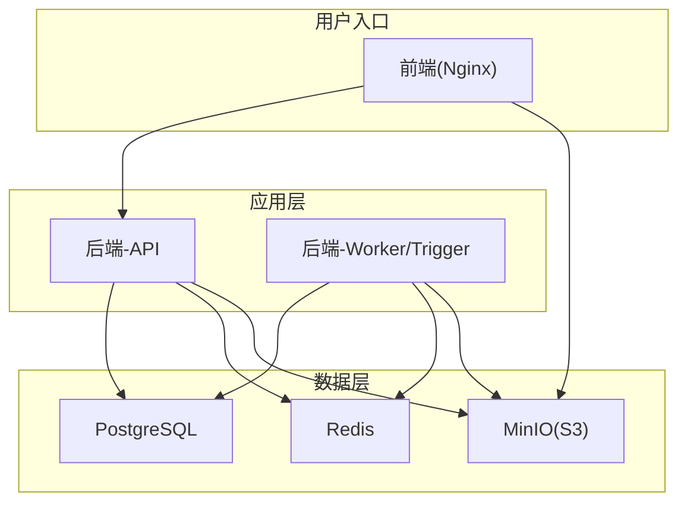
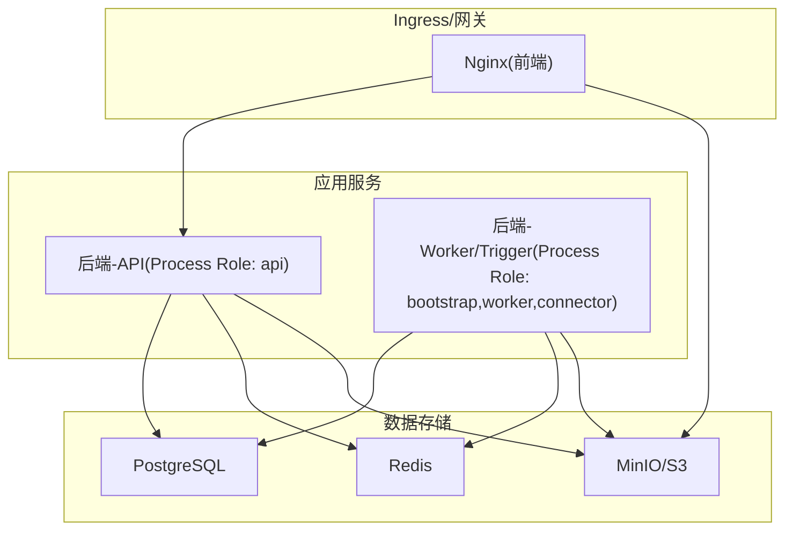
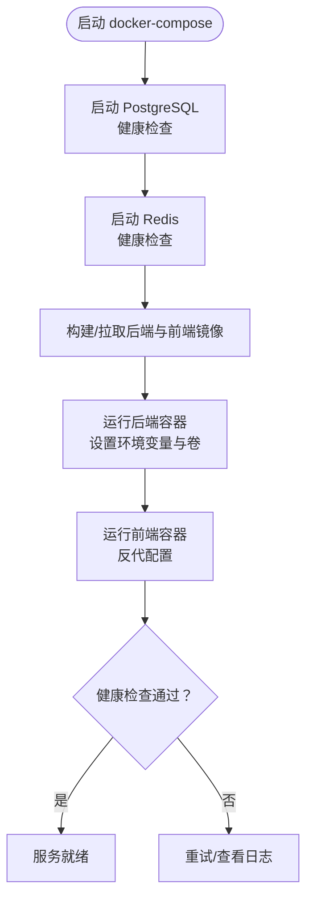
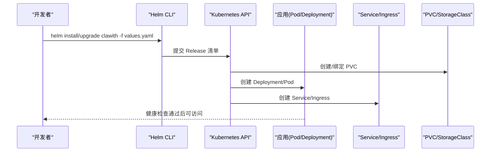
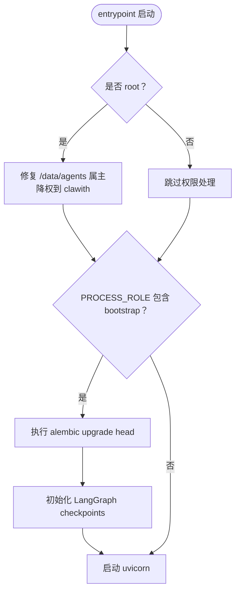
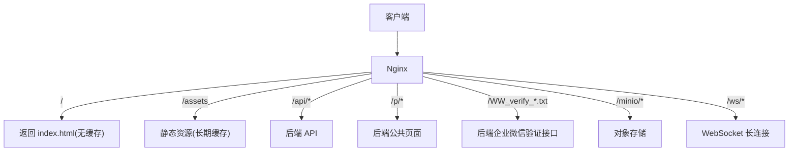
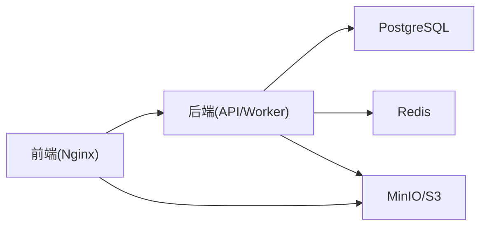
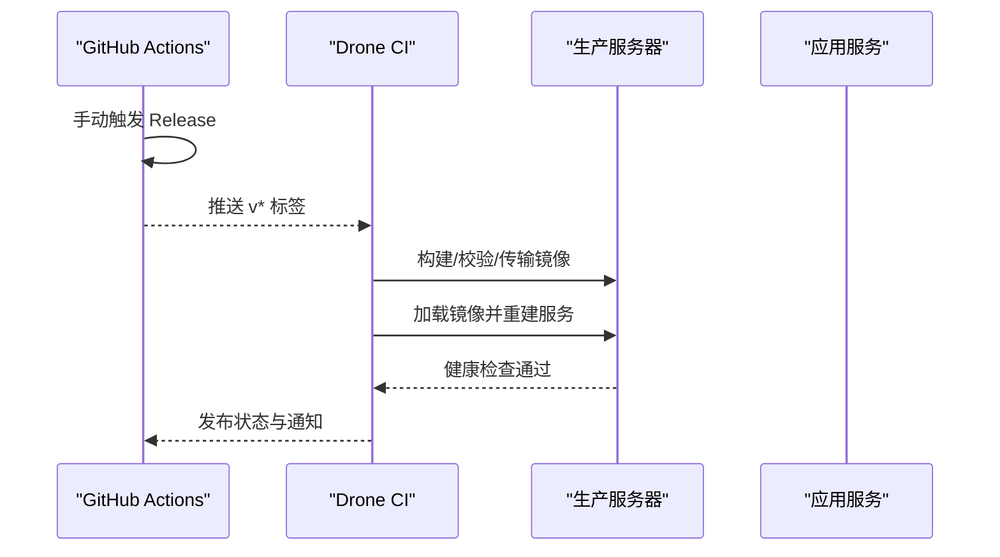

# 部署运维

<cite>
**本文引用的文件**   
- [docker-compose.yml](file://deploy/docker-compose.yml)
- [docker-compose-multi.yml](file://deploy/docker-compose-multi.yml)
- [docker-compose.yml](file://docker-compose.yml)
- [docker-compose.cd.yml](file://docker-compose.cd.yml)
- [docker-compose.ci.yml](file://docker-compose.ci.yml)
- [Dockerfile（后端）](file://backend/Dockerfile)
- [Dockerfile（前端）](file://frontend/Dockerfile)
- [entrypoint.sh](file://backend/entrypoint.sh)
- [nginx.conf（部署模板）](file://deploy/nginx/nginx.conf)
- [nginx.conf.template（前端模板）](file://frontend/nginx.conf.template)
- [Chart.yaml](file://helm/clawith/Chart.yaml)
- [values.yaml](file://helm/clawith/values.yaml)
- [QUICKSTART.md](file://helm/QUICKSTART.md)
- [RELEASE_DEPLOYMENT.md](file://deploy/RELEASE_DEPLOYMENT.md)
</cite>

## 目录
1. [简介](#简介)
2. [项目结构](#项目结构)
3. [核心组件](#核心组件)
4. [架构总览](#架构总览)
5. [详细组件分析](#详细组件分析)
6. [依赖关系分析](#依赖关系分析)
7. [性能与容量规划](#性能与容量规划)
8. [CI/CD 流水线与自动化测试](#cicd-流水线与自动化测试)
9. [监控、日志与可观测性](#监控日志与可观测性)
10. [故障排查指南](#故障排查指南)
11. [备份与恢复策略](#备份与恢复策略)
12. [安全加固措施](#安全加固措施)
13. [高可用与扩展方案](#高可用与扩展方案)
14. [结论](#结论)

## 简介
本指南面向生产环境的 Clawith 平台部署与运维，覆盖 Docker 容器化部署、Kubernetes + Helm 部署、环境变量与存储卷配置、CI/CD 流水线、监控告警、日志采集、性能调优、故障排查、备份恢复与安全加固等主题。文档内容严格基于仓库中的配置文件与脚本，确保可操作性与一致性。

## 项目结构
Clawith 采用前后端分离与多服务编排：
- 后端：Python 应用，通过 Uvicorn 启动，使用 Alembic 进行数据库迁移，支持多种存储后端（本地与 S3 兼容）。
- 前端：Node.js 构建产物由 Nginx 静态托管，反向代理 API 与 MinIO。
- 数据层：PostgreSQL 持久化业务数据，Redis 作为缓存与会话存储，MinIO 提供对象存储（可选）。
- 编排：提供单机 Docker Compose、多进程拆分 Compose、CI/CD 专用 Compose 以及 Kubernetes Helm Chart。

**图示来源** 
- [docker-compose.yml:1-111](file://deploy/docker-compose.yml#L1-L111)
- [docker-compose-multi.yml:1-196](file://deploy/docker-compose-multi.yml#L1-L196)
- [docker-compose.cd.yml:1-123](file://docker-compose.cd.yml#L1-L123)

**章节来源**
- [docker-compose.yml:1-111](file://deploy/docker-compose.yml#L1-L111)
- [docker-compose-multi.yml:1-196](file://deploy/docker-compose-multi.yml#L1-L196)
- [docker-compose.cd.yml:1-123](file://docker-compose.cd.yml#L1-L123)

## 核心组件
- 后端容器镜像：多阶段构建，安装系统依赖与应用依赖，暴露健康检查端口，启动命令由 entrypoint.sh 负责初始化与降级权限后执行 uvicorn。
- 前端容器镜像：Node 构建产物，Nginx 提供静态资源与反向代理，模板化 nginx.conf 注入上游地址。
- 数据服务：PostgreSQL、Redis、MinIO（可选），均具备健康检查与持久化卷。
- 编排与部署：Docker Compose（开发/测试/CD）、Helm Chart（K8s）。

**章节来源**
- [Dockerfile（后端）:1-63](file://backend/Dockerfile#L1-L63)
- [Dockerfile（前端）:1-16](file://frontend/Dockerfile#L1-L16)
- [entrypoint.sh:1-95](file://backend/entrypoint.sh#L1-L95)

## 架构总览
下图展示了典型的生产部署拓扑：前端 Nginx 统一入口，API Worker 拆分运行，数据层通过外部或内置服务提供。

**图示来源** 
- [docker-compose-multi.yml:49-170](file://deploy/docker-compose-multi.yml#L49-L170)
- [docker-compose.cd.yml:9-117](file://docker-compose.cd.yml#L9-L117)
- [nginx.conf.template（前端模板）:1-82](file://frontend/nginx.conf.template#L1-L82)

## 详细组件分析

### Docker 容器化部署（单机/开发）
- 基础服务：PostgreSQL、Redis、可选 MinIO。
- 应用服务：
  - backend：默认 PROCESS_ROLE=all，适合单机；生产建议拆分为 API 与 Worker。
  - frontend：Nginx 反代 API 与 MinIO，端口映射可通过环境变量调整。
- 关键环境变量：
  - DATABASE_URL、REDIS_URL、AGENT_DATA_DIR、AGENT_TEMPLATE_DIR
  - STORAGE_BACKEND、STORAGE_LOCAL_ROOT、S3_*（如启用对象存储）
  - SECRET_KEY、JWT_SECRET_KEY、PUBLIC_BASE_URL、CORS_ORIGINS
  - AGENT_RUNTIME_COMMAND_CONCURRENCY、AGENT_RUNTIME_V2_ENABLED 等
- 卷挂载：
  - PostgreSQL：pgdata
  - Redis：redisdata
  - 后端 Agent 数据：./backend/agent_data:/data/agents
  - ss-nodes.json：只读挂载
  - 前端 Nginx 模板：nginx.conf 模板挂载
- 健康检查：各服务定义 healthcheck，Compose 依赖条件等待健康。

**图示来源** 
- [docker-compose.yml:1-111](file://deploy/docker-compose.yml#L1-L111)
- [docker-compose-multi.yml:1-196](file://deploy/docker-compose-multi.yml#L1-L196)

**章节来源**
- [docker-compose.yml:1-111](file://deploy/docker-compose.yml#L1-L111)
- [docker-compose-multi.yml:1-196](file://deploy/docker-compose-multi.yml#L1-L196)
- [docker-compose.ci.yml:1-71](file://docker-compose.ci.yml#L1-L71)

### Kubernetes + Helm 部署
- Chart 元信息：名称、版本、应用版本、维护者等。
- values.yaml 提供全局与组件级配置：
  - 后端：副本数、镜像、Service、Secrets、持久化、资源限制、自定义环境变量。
  - 前端：副本数、镜像、Service、Ingress、TLS、资源限制。
  - 数据层：PostgreSQL、Redis 的镜像、认证、持久化、资源、外部连接参数。
  - Secrets：创建或复用现有 Secret。
  - StorageClass：可选自定义存储类。
- 部署步骤概览：
  - 准备镜像并推送到镜像仓库。
  - 配置 values.yaml（镜像仓库、域名、证书、存储类等）。
  - 安装/升级 Helm Release。
  - 验证 Ingress 与健康检查。

**图示来源** 
- [Chart.yaml:1-14](file://helm/clawith/Chart.yaml#L1-L14)
- [values.yaml:1-229](file://helm/clawith/values.yaml#L1-L229)

**章节来源**
- [Chart.yaml:1-14](file://helm/clawith/Chart.yaml#L1-L14)
- [values.yaml:1-229](file://helm/clawith/values.yaml#L1-L229)
- [QUICKSTART.md](file://helm/QUICKSTART.md)

### 启动流程与权限管理（entrypoint）
- 角色控制：PROCESS_ROLE 决定是否执行迁移与 checkpoint 初始化。
- 权限处理：若以 root 运行，自动修复挂载目录属主并降权到 clawith 用户。
- 初始化顺序：Alembic 迁移 → LangGraph checkpoint 表初始化 → 启动 uvicorn。
- 失败策略：可通过 ALLOW_MIGRATION_FAILURE 控制迁移失败时的行为。

**图示来源** 
- [entrypoint.sh:1-95](file://backend/entrypoint.sh#L1-L95)

**章节来源**
- [entrypoint.sh:1-95](file://backend/entrypoint.sh#L1-L95)

### Nginx 反向代理与路由
- SPA 路由：根路径 fallback 到 index.html，禁用缓存。
- 静态资源：/assets 长期缓存。
- API 代理：/api 转发至后端，设置超时与上传大小。
- 公共页面：/p 直接代理后端。
- 企业微信验证：拦截 WW_verify_*.txt 请求并代理到后端接口。
- MinIO 代理：/minio 前缀重写并透传请求，关闭缓冲以支持大文件。
- WebSocket：/ws 长连接保持，超时设置为 1 小时。

**图示来源** 
- [nginx.conf.template（前端模板）:1-82](file://frontend/nginx.conf.template#L1-L82)
- [nginx.conf（部署模板）:1-82](file://deploy/nginx/nginx.conf#L1-L82)

**章节来源**
- [nginx.conf.template（前端模板）:1-82](file://frontend/nginx.conf.template#L1-L82)
- [nginx.conf（部署模板）:1-82](file://deploy/nginx/nginx.conf#L1-L82)

## 依赖关系分析
- 后端依赖：PostgreSQL、Redis、可选 MinIO（S3 兼容）。
- 前端依赖：后端 API、MinIO（对象存储）。
- 网络：Compose 默认网络，可通过 CLAWITH_DOCKER_NETWORK 指定外部网络。
- 存储：PG/Redis/Agent 数据持久化卷，MinIO 数据卷。

**图示来源** 
- [docker-compose.yml:1-111](file://deploy/docker-compose.yml#L1-L111)
- [docker-compose-multi.yml:1-196](file://deploy/docker-compose-multi.yml#L1-L196)

**章节来源**
- [docker-compose.yml:1-111](file://deploy/docker-compose.yml#L1-L111)
- [docker-compose-multi.yml:1-196](file://deploy/docker-compose-multi.yml#L1-L196)

## 性能与容量规划
- 后端并发：AGENT_RUNTIME_COMMAND_CONCURRENCY 控制命令并发度，根据负载调优。
- 资源限制：在 Helm values.yaml 中为后端与前端设置 requests/limits，避免资源争用。
- 存储容量：
  - PostgreSQL：按业务增长预留空间，开启 WAL 归档与定期清理。
  - Redis：合理设置内存上限与淘汰策略，持久化按需开启。
  - MinIO：对象存储按文件大小与数量规划，启用生命周期策略。
- 前端缓存：静态资源长期缓存，SPA 不缓存，减少带宽与提升加载速度。
- 超时与连接：Nginx 对 API 与 WS 设置合理的超时，避免连接堆积。

[本节为通用指导，无需特定文件引用]

## CI/CD 流水线与自动化测试
- GitHub Actions：触发 Release 流程，计算版本、更新版本号、生成草稿发布说明、创建标签 PR。
- Drone CI：接收标签事件，执行完整流水线：
  - 构建前后端镜像
  - 校验数据库迁移
  - 校验全新部署与从上一稳定版升级
  - 导出并传输镜像
  - 加载镜像并重建生产服务
  - 验证代理后的 API 健康端点
  - 发送飞书通知
- 服务器前置条件：Docker + Compose、外部网络、已有 PG/Redis/MinIO、/data/agent_data、ss-nodes.json（可选）。
- CD Compose：仅更新应用容器，复用现有数据服务与网络。

**图示来源** 
- [RELEASE_DEPLOYMENT.md:1-90](file://deploy/RELEASE_DEPLOYMENT.md#L1-L90)
- [docker-compose.cd.yml:1-123](file://docker-compose.cd.yml#L1-L123)

**章节来源**
- [RELEASE_DEPLOYMENT.md:1-90](file://deploy/RELEASE_DEPLOYMENT.md#L1-L90)
- [docker-compose.cd.yml:1-123](file://docker-compose.cd.yml#L1-L123)
- [docker-compose.ci.yml:1-71](file://docker-compose.ci.yml#L1-L71)

## 监控、日志与可观测性
- 健康检查：
  - 后端：/api/health 端点用于健康探测。
  - 数据层：PostgreSQL pg_isready、Redis redis-cli ping、MinIO 健康接口。
- 日志收集：
  - Compose 默认 json-file 驱动，限制单文件大小与保留数量。
  - 生产环境建议接入集中式日志系统（如 ELK/Loki），通过 sidecar 或 DaemonSet 采集。
- 指标与追踪：
  - 后端可集成 Prometheus 指标端点（按需扩展）。
  - 前端与 Nginx 可输出访问日志，结合 APM 工具进行链路追踪。

**章节来源**
- [Dockerfile（后端）:57-58](file://backend/Dockerfile#L57-L58)
- [docker-compose.yml:13-17](file://deploy/docker-compose.yml#L13-L17)
- [docker-compose-multi.yml:13-17](file://deploy/docker-compose-multi.yml#L13-L17)
- [docker-compose.cd.yml:51-55](file://docker-compose.cd.yml#L51-L55)

## 故障排查指南
- 启动失败：
  - 检查环境变量是否正确（DATABASE_URL、REDIS_URL、SECRET_KEY、JWT_SECRET_KEY 等）。
  - 查看 entrypoint 日志，确认迁移与 checkpoint 初始化是否成功。
  - 检查卷挂载权限与属主是否为 clawith。
- 数据库问题：
  - 验证连接字符串与网络可达性。
  - 检查迁移版本与 schema 一致性。
- 对象存储问题：
  - 校验 S3_* 配置与 MinIO 服务可用性。
  - 检查桶名、前缀与访问密钥。
- 前端代理问题：
  - 确认 API_UPSTREAM 与 MINIO_UPSTREAM 指向正确。
  - 检查 Nginx 模板变量替换与反向代理规则。
- 健康检查失败：
  - 调用 /api/health 确认后端状态。
  - 检查依赖服务健康检查是否通过。

**章节来源**
- [entrypoint.sh:1-95](file://backend/entrypoint.sh#L1-L95)
- [docker-compose.yml:13-17](file://deploy/docker-compose.yml#L13-L17)
- [docker-compose-multi.yml:13-17](file://deploy/docker-compose-multi.yml#L13-L17)
- [nginx.conf.template（前端模板）:1-82](file://frontend/nginx.conf.template#L1-L82)

## 备份与恢复策略
- PostgreSQL：
  - 定期逻辑备份（pg_dump）与物理备份（WAL 归档）。
  - 恢复时先还原数据，再校验迁移版本。
- Redis：
  - 启用 RDB/AOF 持久化，定期快照备份。
  - 恢复时注意内存与数据结构兼容性。
- MinIO：
  - 对象级别备份（mc mirror/sync）与跨集群复制。
  - 恢复时校验桶结构与权限。
- Agent 数据：
  - 定期打包 /data/agents 目录，确保与后端版本一致。
- 恢复演练：
  - 在预发环境定期演练恢复流程，验证数据完整性与服务可用性。

[本节为通用指导，无需特定文件引用]

## 安全加固措施
- 最小权限原则：
  - 后端容器以非 root 用户运行，entrypoint 自动降权。
  - 限制 SYS_ADMIN 能力与 seccomp/apparmor 策略（生产建议收紧）。
- 密钥管理：
  - SECRET_KEY、JWT_SECRET_KEY 通过环境变量或 Secret 管理，禁止硬编码。
  - MinIO 访问密钥与数据库密码使用安全存储。
- 网络安全：
  - 仅暴露必要端口，使用内部网络通信。
  - 启用 TLS 终止于 Ingress/Nginx，强制 HTTPS。
- 输入校验与限流：
  - Nginx 限制上传大小与请求频率。
  - 后端启用 CORS 白名单与鉴权。
- 审计与合规：
  - 记录关键操作日志，接入 SIEM 系统。
  - 定期漏洞扫描与依赖更新。

**章节来源**
- [entrypoint.sh:17-33](file://backend/entrypoint.sh#L17-L33)
- [docker-compose.yml:69-74](file://deploy/docker-compose.yml#L69-L74)
- [docker-compose-multi.yml:88-93](file://deploy/docker-compose-multi.yml#L88-L93)
- [nginx.conf.template（前端模板）:10-11](file://frontend/nginx.conf.template#L10-L11)

## 高可用与扩展方案
- 水平扩展：
  - 后端 API 与 Worker 独立部署，增加副本数以应对流量峰值。
  - 前端 Nginx 多副本配合负载均衡器。
- 负载均衡：
  - Ingress 控制器（如 Nginx Ingress）分发请求，启用会话亲和性与健康检查。
- 数据层高可用：
  - PostgreSQL 主从或托管服务，启用自动故障转移。
  - Redis 哨兵或集群模式，持久化与备份。
  - MinIO 分布式模式，多节点冗余。
- 滚动更新与回滚：
  - Helm 升级策略，逐步替换 Pod，验证健康后再继续。
  - 保留历史版本以便快速回滚。
- 弹性伸缩：
  - 基于 CPU/内存或自定义指标（Prometheus）自动扩缩容。

**章节来源**
- [values.yaml:12-106](file://helm/clawith/values.yaml#L12-L106)
- [docker-compose-multi.yml:49-170](file://deploy/docker-compose-multi.yml#L49-L170)

## 结论
本指南基于仓库提供的配置文件与脚本，系统化地阐述了 Clawith 平台的容器化与 Kubernetes 部署方法、生产环境关键配置、CI/CD 流水线、监控日志、性能调优、故障排查、备份恢复与安全加固。遵循本文档的实践，可构建稳定、可扩展且安全的 Clawith 生产环境。