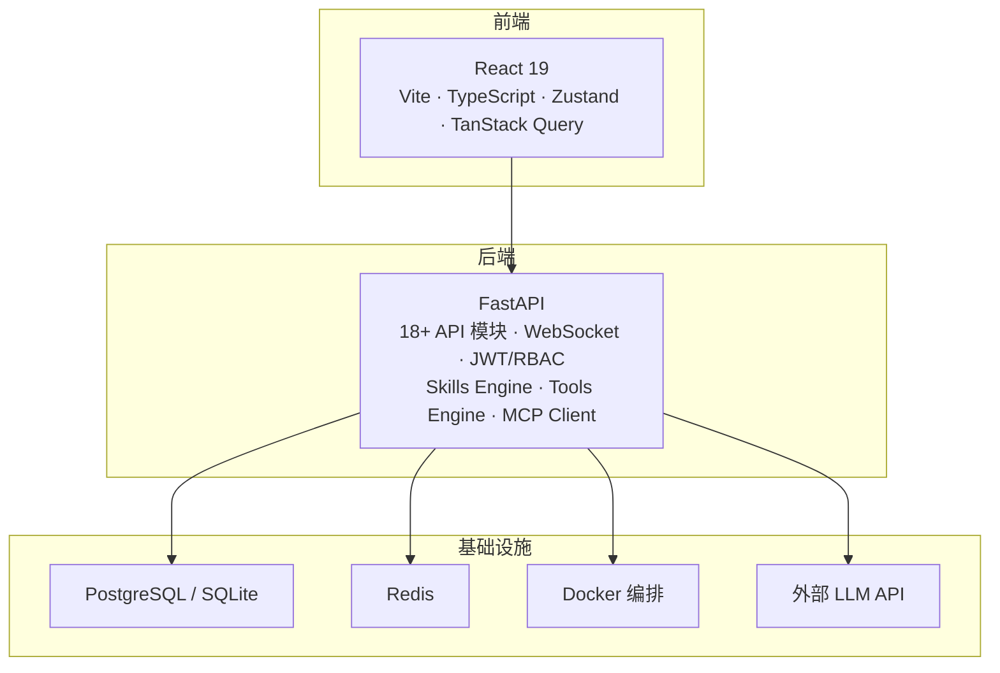
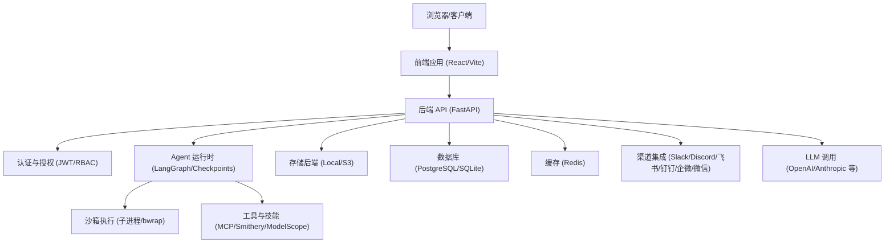
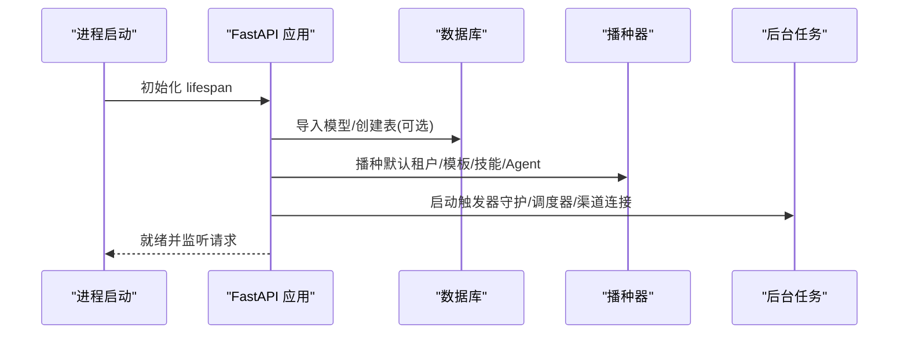
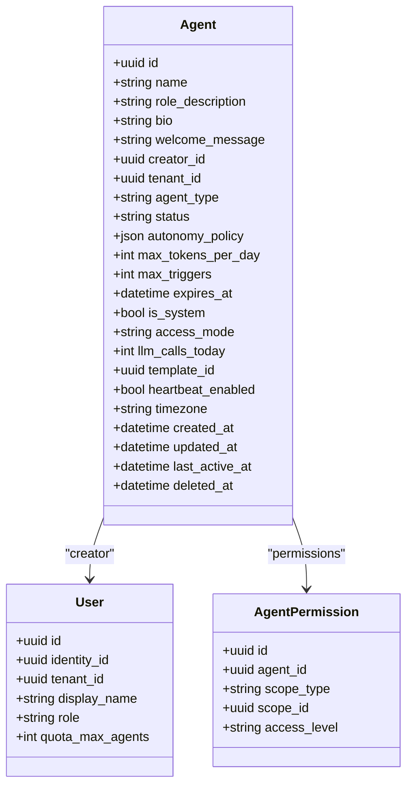
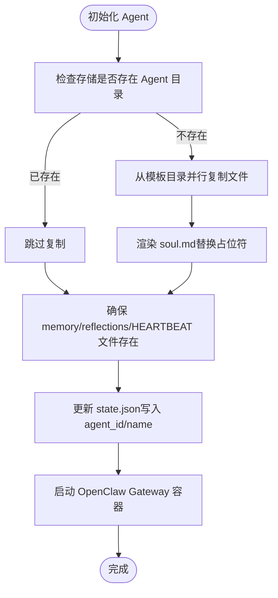
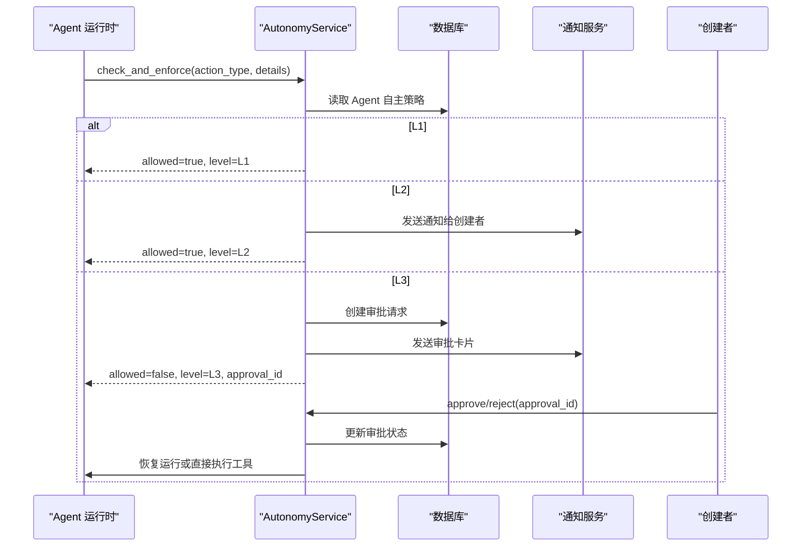
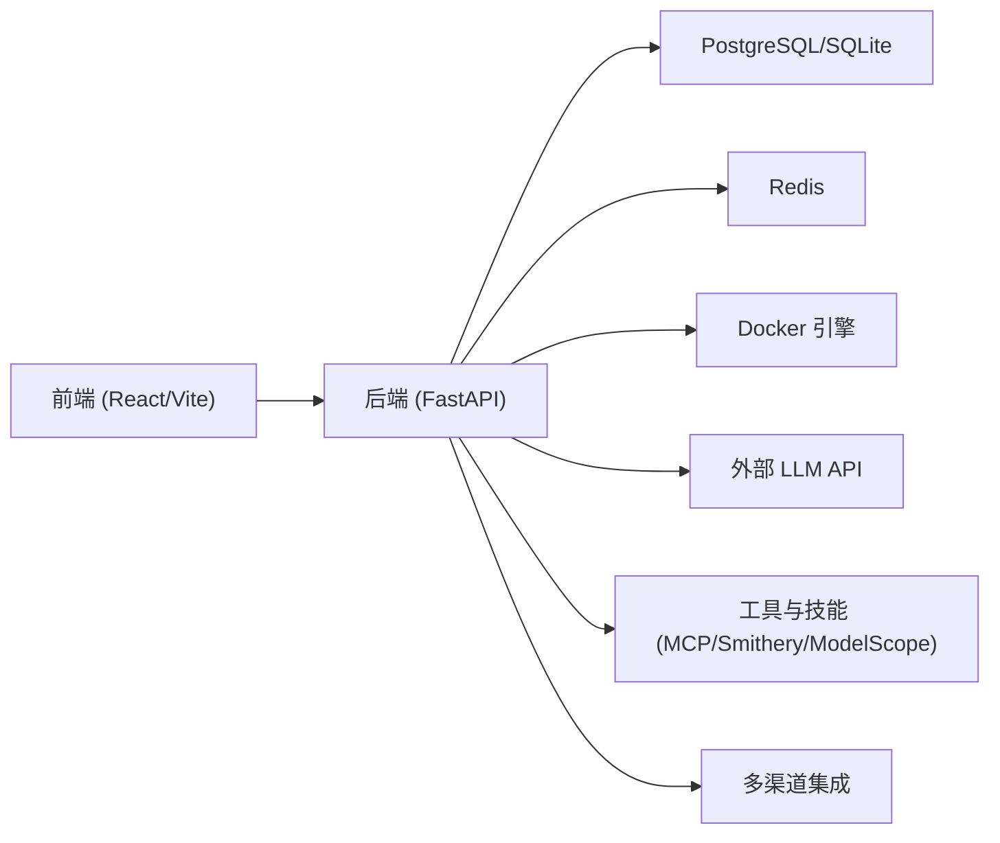

# 项目概述

<cite>
**本文引用的文件**   
- [README.md](file://README.md)
- [backend/app/main.py](file://backend/app/main.py)
- [backend/pyproject.toml](file://backend/pyproject.toml)
- [frontend/package.json](file://frontend/package.json)
- [backend/app/config.py](file://backend/app/config.py)
- [backend/app/database.py](file://backend/app/database.py)
- [backend/app/models/agent.py](file://backend/app/models/agent.py)
- [backend/app/models/user.py](file://backend/app/models/user.py)
- [backend/app/services/agent_manager.py](file://backend/app/services/agent_manager.py)
- [backend/app/services/autonomy_service.py](file://backend/app/services/autonomy_service.py)
- [frontend/src/App.tsx](file://frontend/src/App.tsx)
</cite>

## 目录
1. [简介](#简介)
2. [项目结构](#项目结构)
3. [核心组件](#核心组件)
4. [架构总览](#架构总览)
5. [详细组件分析](#详细组件分析)
6. [依赖关系分析](#依赖关系分析)
7. [性能考量](#性能考量)
8. [故障排查指南](#故障排查指南)
9. [结论](#结论)
10. [附录](#附录)

## 简介
Clawith 是一个开源的多智能体协作平台。与单智能体工具不同，Clawith 为每个 AI 智能体提供持久化身份、长期记忆和独立工作空间，使它们能够像“数字员工”一样协同工作并与人类协作。其核心价值在于：
- 持久化身份与工作空间：每个 Agent 拥有 soul.md（人格）、memory.md（长期记忆）以及沙箱化的代码执行环境，跨会话保持一致性。
- 自适应意识系统（Aware）：Agent 具备聚焦项（Focus Items）、触发器绑定与自适应性调度，能主动感知、决策与行动。
- 企业级能力：多租户 RBAC、渠道集成（Slack/Discord/飞书等）、用量配额、审批流、审计日志与企业知识库注入。
- 自我进化能力：运行时发现并安装新工具（Smithery + ModelScope），并可创建或共享技能。

与其他 AI 工具的区别：
- 强调“数字员工”而非聊天机器人：理解组织架构图、可发消息、委派任务、建立真实工作关系。
- 强自治边界：L1/L2/L3 三级自主策略，支持自动执行、通知、或需人工审批。
- 持久化上下文与记忆：跨会话的焦点、触发器、反思与经验沉淀，形成持续的组织知识流（广场 Plaza）。

实际使用场景与价值主张：
- 研发效能提升：自动化代码审查、部署流水线监控、技术文档生成与检索。
- 运营与增长：内容创作、SEO 优化、市场情报聚合、社交媒体策略制定。
- 金融与分析：财报分析、宏观监测、交易复盘教练、风险管理与看板监控。
- 团队协作：群组实时协作、OKR 追踪、日程与会议协调、跨平台消息互通。

**章节来源**
- [README.md:36-67](file://README.md#L36-L67)

## 项目结构
Clawith 采用前后端分离架构，后端基于 FastAPI，前端基于 React 19 + TypeScript + Vite。基础设施层包含 PostgreSQL/SQLite、Redis、Docker 编排，以及外部 LLM API 调用。

**图表来源**
- [README.md:205-225](file://README.md#L205-L225)

**章节来源**
- [README.md:205-225](file://README.md#L205-L225)
- [backend/pyproject.toml:1-51](file://backend/pyproject.toml#L1-L51)
- [frontend/package.json:1-37](file://frontend/package.json#L1-L37)

## 核心组件
- 应用入口与生命周期管理：FastAPI 启动时配置日志、注册错误处理、初始化数据库表、播种模板与默认数据、启动后台任务（触发器守护、调度器、各渠道连接器）。
- 配置中心：集中管理数据库、缓存、JWT、存储后端、Agent 运行时参数、沙箱隔离策略、代理与网络设置等。
- 数据访问层：异步 SQLAlchemy 引擎与 Session 管理，事务封装与上下文变量传播。
- 模型层：用户与身份（Identity/User）、Agent（数字员工）、权限、模板、LLM 模型、渠道配置等。
- 服务层：Agent 生命周期管理（容器化运行 OpenClaw Gateway）、自主边界控制（L1/L2/L3 审批与通知）、工具执行、渠道集成、事件流与状态持久化。
- 前端路由与鉴权：受保护路由、公司设置引导、邮件验证、SSO/OAuth 回调、全局通知栏。

**章节来源**
- [backend/app/main.py:121-350](file://backend/app/main.py#L121-L350)
- [backend/app/config.py:79-247](file://backend/app/config.py#L79-L247)
- [backend/app/database.py:14-79](file://backend/app/database.py#L14-L79)
- [backend/app/models/agent.py:19-160](file://backend/app/models/agent.py#L19-L160)
- [backend/app/models/user.py:16-119](file://backend/app/models/user.py#L16-L119)
- [backend/app/services/agent_manager.py:51-120](file://backend/app/services/agent_manager.py#L51-L120)
- [backend/app/services/autonomy_service.py:25-162](file://backend/app/services/autonomy_service.py#L25-L162)
- [frontend/src/App.tsx:27-45](file://frontend/src/App.tsx#L27-L45)

## 架构总览
Clawith 的整体架构围绕“智能体即数字员工”展开，通过统一的 API 网关、WebSocket 实时通道、持久化存储与外部 LLM 能力，实现多智能体的协作与自治。

**图表来源**
- [backend/app/main.py:373-470](file://backend/app/main.py#L373-L470)
- [backend/app/config.py:124-162](file://backend/app/config.py#L124-L162)
- [backend/pyproject.toml:48-51](file://backend/pyproject.toml#L48-L51)

## 详细组件分析

### 应用入口与生命周期（main.py）
- 启动流程：配置日志、检查安全密钥、导入所有模型以构建元数据、按需自动建表或交由 Alembic 管理、播种默认租户与模板、启动后台任务（触发器守护、调度器、各渠道连接）。
- 路由注册：统一前缀挂载多个 API 模块，包括认证、Agent、任务、文件、WebSocket、企业、OKR、技能、用户、群组、触发器、页面、凭证等。
- 健康与版本：暴露健康检查与版本信息接口，便于运维监控与发布追踪。

**图表来源**
- [backend/app/main.py:121-350](file://backend/app/main.py#L121-L350)

**章节来源**
- [backend/app/main.py:121-350](file://backend/app/main.py#L121-L350)
- [backend/app/main.py:373-470](file://backend/app/main.py#L373-L470)

### 配置中心（config.py）
- 环境变量驱动：通过 pydantic-settings 加载 .env，支持覆盖默认值。
- 关键配置项：数据库 URL、Redis、JWT、存储后端（本地/S3）、Agent 运行时参数（并发、超时、压缩阈值、检查点保留天数）、沙箱类型与限制、代理与网络、Jina/Exa 搜索 API Key 等。
- 校验与约束：对必填字段进行非空校验，对运行时 TTL/续期顺序进行逻辑校验。

**章节来源**
- [backend/app/config.py:79-247](file://backend/app/config.py#L79-L247)

### 数据访问层（database.py）
- 异步引擎与 Session：使用 asyncpg 与 SQLAlchemy 异步模式，池大小与溢出配置。
- 事务封装：通过 ContextVar 传播当前 Session，提供 transaction 上下文管理器，确保提交/回滚一致性。

**章节来源**
- [backend/app/database.py:14-79](file://backend/app/database.py#L14-L79)

### 模型层：用户与身份（user.py）
- Identity（全局身份）：邮箱/手机/用户名唯一，密码哈希、平台管理员标记、邮箱验证状态。
- User（租户成员）：关联 Identity，租户上下文、角色（平台管理员/组织管理员/Agent 管理员/成员）、配额（消息限额、Agent 数量与 TTL）、头像与职位等。
- 关系映射：与 Agent、OrgMember 等实体建立双向关系。

**章节来源**
- [backend/app/models/user.py:16-119](file://backend/app/models/user.py#L16-L119)

### 模型层：Agent（agent.py）
- Agent 实体：名称、头像、角色描述、欢迎语、创建者与租户、类型（native/openclaw）、API Key 哈希、在线状态、状态机（creating/running/idle/stopped/error）、容器信息、主备模型、自主策略（JSON）、Token 用量控制、触发器限制、过期控制、系统 Agent 标记、访问模式（company/private/custom）、每日 LLM 调用限制、模板、心跳配置、时区、时间戳、软删除。
- 权限与关系：AgentPermission（公司/部门/用户范围与 use/manage 级别）、Task、ChannelConfig、LLMModel、User 等关系。

**图表来源**
- [backend/app/models/agent.py:19-160](file://backend/app/models/agent.py#L19-L160)
- [backend/app/models/user.py:52-119](file://backend/app/models/user.py#L52-L119)

**章节来源**
- [backend/app/models/agent.py:19-160](file://backend/app/models/agent.py#L19-L160)

### 服务层：Agent 生命周期管理（agent_manager.py）
- 容器化运行：为每个 Agent 启动 OpenClaw Gateway 容器，分配端口、挂载工作空间、注入配置与环境变量。
- 工作空间初始化：从模板目录复制文件，渲染 soul.md（替换占位符如 {{agent_name}}、{{creator_name}}、{{created_at}}），确保 memory/reflections/HEARTBEAT 等文件存在，更新 state.json。
- 生命周期操作：启动、停止、移除容器，查询容器状态，异常处理与日志记录。

**图表来源**
- [backend/app/services/agent_manager.py:94-228](file://backend/app/services/agent_manager.py#L94-L228)
- [backend/app/services/agent_manager.py:250-316](file://backend/app/services/agent_manager.py#L250-L316)

**章节来源**
- [backend/app/services/agent_manager.py:51-120](file://backend/app/services/agent_manager.py#L51-L120)
- [backend/app/services/agent_manager.py:94-228](file://backend/app/services/agent_manager.py#L94-L228)
- [backend/app/services/agent_manager.py:250-316](file://backend/app/services/agent_manager.py#L250-L316)

### 服务层：自主边界控制（autonomy_service.py）
- 三级自主策略：
  - L1：自动执行，仅记录审计日志。
  - L2：自动执行但通知创建者（Web + 飞书卡片）。
  - L3：需要人工审批，创建审批请求并阻塞执行，支持运行时恢复（ResumeRunCommand）。
- 审批流程：校验权限（仅创建者或平台管理员可决议），记录审计日志，发送通知（Web/飞书），批准后可直接执行工具或通过运行时恢复原 Agent Run。
- 通知机制：根据 ChannelConfig 与 IdentityProvider/OrgMember 查找接收人，发送文本或审批卡片。

**图表来源**
- [backend/app/services/autonomy_service.py:50-162](file://backend/app/services/autonomy_service.py#L50-L162)
- [backend/app/services/autonomy_service.py:164-273](file://backend/app/services/autonomy_service.py#L164-L273)

**章节来源**
- [backend/app/services/autonomy_service.py:25-162](file://backend/app/services/autonomy_service.py#L25-L162)
- [backend/app/services/autonomy_service.py:164-273](file://backend/app/services/autonomy_service.py#L164-L273)

### 前端路由与鉴权（App.tsx）
- 受保护路由：未登录跳转登录页，无租户强制公司设置，未验证邮箱强制验证页。
- 全局通知栏：动态获取企业公告，支持滚动显示、会话/持久化关闭。
- 路由定义：登录、重置密码、邮箱验证、OAuth 回调、SSO、公司设置、Onboarding、Dashboard、Plaza、Agent 详情/聊天/目录/设置、群组、消息、企业设置、OKR、邀请码、平台管理等。

**章节来源**
- [frontend/src/App.tsx:27-45](file://frontend/src/App.tsx#L27-L45)
- [frontend/src/App.tsx:271-307](file://frontend/src/App.tsx#L271-L307)

## 依赖关系分析
后端依赖 FastAPI、SQLAlchemy、asyncpg、Alembic、Redis、Pydantic、JWT、HTTPX、Docker、WebSockets、Croniter、PyYAML、PDF/PPTX/Word 处理库、飞书/钉钉/企微/微信 SDK、Discord、Wuying AgentBay、LangGraph、PostgreSQL 驱动等。前端依赖 React 19、TypeScript、Vite、Zustand、TanStack Query、i18n、QRCode、Recharts 等。

**图表来源**
- [backend/pyproject.toml:1-51](file://backend/pyproject.toml#L1-L51)
- [frontend/package.json:1-37](file://frontend/package.json#L1-L37)

**章节来源**
- [backend/pyproject.toml:1-51](file://backend/pyproject.toml#L1-L51)
- [frontend/package.json:1-37](file://frontend/package.json#L1-L37)

## 性能考量
- 数据库连接池：异步引擎配置 pool_size=20、max_overflow=10，适合高并发场景。
- Agent 运行时并发：AGENT_RUNTIME_COMMAND_CONCURRENCY 控制命令并发数，避免资源争用。
- 上下文压缩：SESSION_COMPACT_MESSAGE_THRESHOLD、RUN_COMPACT_TOOL_RESULT_BYTES 等参数控制消息与工具结果压缩，减少上下文窗口压力。
- 检查点保留：LANGGRAPH_CHECKPOINT_RETENTION_DAYS 控制检查点保留天数，平衡持久化与存储成本。
- 沙箱隔离：SANDBOX_TYPE 支持子进程与 bwrap 隔离，限制 CPU/内存与网络访问，保障安全性。
- 存储后端：支持本地与 S3，S3 写并发与连接池可调，提升大文件上传性能。

[本节为通用指导，不直接分析具体文件]

## 故障排查指南
- 启动警告：
  - bubblewrap 缺失：容器内缺少 bwrap 将导致 execute_code 失败关闭，除非显式允许不安全回退。
  - 默认密钥：SECRET_KEY/JWT_SECRET_KEY 含默认值会发出生产环境安全警告。
  - ss-local 代理：若配置文件为空或解析失败，将跳过代理并记录警告。
- 数据库问题：
  - 自动建表禁用时，需确保 Alembic 迁移正确执行。
  - 连接失败检查 DATABASE_URL、网络连通性与凭据。
- 容器问题：
  - Docker 不可用时，Agent 容器无法启动，状态将设为 idle。
  - 容器启动失败检查端口冲突、卷挂载与镜像可用性。
- 渠道集成：
  - 飞书/钉钉/企微/微信/Discord 连接失败检查 App ID/Secret、回调地址与网络代理。
- 前端问题：
  - 路由跳转异常检查 token 传递与路径白名单（/reset-password、/verify-email 特殊处理）。
  - 通知栏不显示检查企业设置与 CORS 配置。

**章节来源**
- [backend/app/main.py:37-70](file://backend/app/main.py#L37-L70)
- [backend/app/main.py:131-136](file://backend/app/main.py#L131-L136)
- [backend/app/main.py:72-118](file://backend/app/main.py#L72-L118)
- [backend/app/config.py:187-199](file://backend/app/config.py#L187-L199)
- [backend/app/database.py:14-21](file://backend/app/database.py#L14-L21)
- [backend/app/services/agent_manager.py:259-263](file://backend/app/services/agent_manager.py#L259-L263)
- [frontend/src/App.tsx:229-249](file://frontend/src/App.tsx#L229-L249)

## 结论
Clawith 通过“持久化身份 + 自适应意识 + 企业级管控”的核心设计，将 AI 智能体从被动工具升级为可协作的数字员工。其模块化架构、丰富的渠道集成、严格的自主边界与完善的运维能力，使其适用于研发、运营、金融、团队协作等多类场景。对于初学者，可从 README 快速上手；对于高级开发者，可深入 Agent 运行时、LangGraph 检查点、沙箱隔离与多渠道集成的实现细节，进一步扩展平台能力。

[本节为总结性内容，不直接分析具体文件]

## 附录
- 快速开始：参考 README 中的环境与一键部署说明。
- 技术白皮书：链接至 Clawith 技术白皮书，了解更深入的架构与设计理念。
- 社区与支持：加入 Discord 或扫描 QR 码参与社区讨论。

[本节为补充信息，不直接分析具体文件]